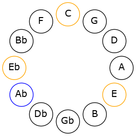
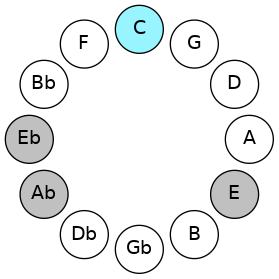
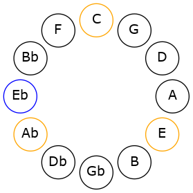
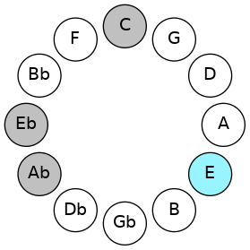

# Mode AFlatEpogic

## Links

- [Documentation](README.md)
- [Scales Index](Scales.md)
- [Modes Index](Modes.md)
- [Chords Index](Chords.md)

## Scale

[Zyphic](ScaleZyphic.md)

## Mode

[AFlatEpogic](ModeAFlatEpogic.md)

## Tonic

Ab

## Signature

[CNaturalMajor]

## Interval Pattern

4, 3, 1, 4

## Chord Pattern

## Perfection

 - 1 Perfect Notes

 - 3 Imperfect Notes

## Notes

- Ab
- C (Imperfect)
- Eb (Imperfect)
- E (Imperfect)
- Ab

## Illustration

## Diagram

## Relative Modes

| Number | Mode | Tonic | Notes | Illustration |
|--------|------|-------|-------|--------------|
| [401](https://ianring.com/musictheory/scales/401) | [Epogic](ModeEpogic.md) | Ab | Ab, C, Eb, E, Ab |  |
| [281](https://ianring.com/musictheory/scales/281) | [Lanic](ModeLanic.md) | C | C, D#, E, G#, C |  |
| [547](https://ianring.com/musictheory/scales/547) | [Pyrric](ModePyrric.md) | Eb | Eb, E, Ab, C, Eb |  |
| [2321](https://ianring.com/musictheory/scales/2321) | [Zyphic](ModeZyphic.md) | E | E, G#, C, D#, E |  |
## Relative Brightness

| Number | Mode | Tonic | Notes | Illustration |
|--------|------|-------|-------|--------------|
| [401](https://ianring.com/musictheory/scales/401) | [Epogic](ModeEpogic.md) | Ab | Ab, C, Eb, E, Ab |  |
| [281](https://ianring.com/musictheory/scales/281) | [Lanic](ModeLanic.md) | C | C, D#, E, G#, C |  |
| [547](https://ianring.com/musictheory/scales/547) | [Pyrric](ModePyrric.md) | Eb | Eb, E, Ab, C, Eb |  |
| [2321](https://ianring.com/musictheory/scales/2321) | [Zyphic](ModeZyphic.md) | E | E, G#, C, D#, E |  |

## Chords

### Ab

| Number | Root | Name | Notes | Illustration | Audio |
|--------|------|------|-------|--------------|-------|
| 264 | Ab | [Ab5](ChordAFlatPowerChord.md) | Ab, Eb |  | [midi](ChordAFlatPowerChordRootPosition.mid) |
| 265 | Ab | [AbM](ChordAFlatMajor.md) | Ab, C, Eb |  | [midi](ChordAFlatMajorRootPosition.mid) |
| 273 | Ab | [Ab+](ChordAFlatAugmented.md) | Ab, C, E |  | [midi](ChordAFlatAugmentedRootPosition.mid) |
| 273 | Ab | [Ab+7](ChordAFlatAugmentedAugmentedSeventh.md) | Ab, C, E, G# |  | [midi](ChordAFlatAugmentedAugmentedSeventhRootPosition.mid) |

### C

| Number | Root | Name | Notes | Illustration | Audio |
|--------|------|------|-------|--------------|-------|
| 265 | C | [Cm#5](ChordCNaturalMinorSharpFifth.md) | C, Eb, Ab |  | [midi](ChordCNaturalMinorSharpFifthRootPosition.mid) |
| 273 | C | [C+](ChordCNaturalAugmented.md) | C, E, G# |  | [midi](ChordCNaturalAugmentedRootPosition.mid) |
| 273 | C | [C+7](ChordCNaturalAugmentedAugmentedSeventh.md) | C, E, G#, B# |  | [midi](ChordCNaturalAugmentedAugmentedSeventhRootPosition.mid) |

### Eb

| Number | Root | Name | Notes | Illustration | Audio |
|--------|------|------|-------|--------------|-------|
| 265 | Eb | [Ebsus4##5](ChordEFlatSuspendedFourthDoubleSharpFifth.md) | Eb, Ab, C |  | [midi](ChordEFlatSuspendedFourthDoubleSharpFifthRootPosition.mid) |

### E

| Number | Root | Name | Notes | Illustration | Audio |
|--------|------|------|-------|--------------|-------|
| 273 | E | [E+](ChordENaturalAugmented.md) | E, G#, B# |  | [midi](ChordENaturalAugmentedRootPosition.mid) |
| 273 | E | [E+7](ChordENaturalAugmentedAugmentedSeventh.md) | E, G#, B#, D## |  | [midi](ChordENaturalAugmentedAugmentedSeventhRootPosition.mid) |
| 281 | E | [E+(M7)](ChordENaturalAugmentedMajorSeventh.md) | E, G#, B#, D# |  | [midi](ChordENaturalAugmentedMajorSeventhRootPosition.mid) |

