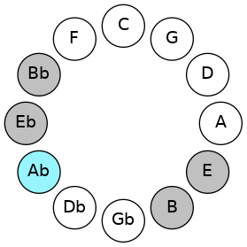
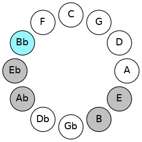
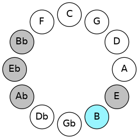
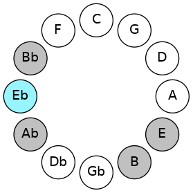
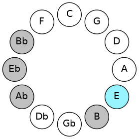

# Mode AFlatEpogitonic

## Links

- [Documentation](README.md)
- [Scales Index](Scales.md)
- [Modes Index](Modes.md)
- [Chords Index](Chords.md)

## Scale

[Zolitonic](ScaleZolitonic.md)

## Mode

[AFlatEpogitonic](ModeAFlatEpogitonic.md)

## Tonic

Ab

## Signature

[CNaturalMajor]

## Transposition

2, 1, 4, 1, 4

## Chord Pattern

## Perfection

 - 3 Perfect Notes

 - 2 Imperfect Notes

## Notes

- Ab
- Bb (Imperfect)
- B (Imperfect)
- Eb
- E
- Ab

## Illustration

## Diagram

## Relative Modes

| Number | Mode | Tonic | Notes | Illustration |
|--------|------|-------|-------|--------------|
| [397](https://ianring.com/musictheory/scales/397) | [Epogitonic](ModeEpogitonic.md) | G# | G#, A#, B, D#, E, G# |  |
| [397](https://ianring.com/musictheory/scales/397) | [Epogitonic](ModeEpogitonic.md) | Ab | Ab, Bb, B, Eb, E, Ab |  |
| [1123](https://ianring.com/musictheory/scales/1123) | [Lanitonic](ModeLanitonic.md) | A# | A#, B, D#, E, G#, A# |  |
| [1123](https://ianring.com/musictheory/scales/1123) | [Lanitonic](ModeLanitonic.md) | Bb | Bb, B, Eb, E, Ab, Bb |  |
| [2609](https://ianring.com/musictheory/scales/2609) | [Paptitonic](ModePaptitonic.md) | B | B, D#, E, G#, A#, B |  |
| [419](https://ianring.com/musictheory/scales/419) | [Ionacritonic](ModeIonacritonic.md) | D# | D#, E, G#, A#, B, D# |  |
| [419](https://ianring.com/musictheory/scales/419) | [Ionacritonic](ModeIonacritonic.md) | Eb | Eb, E, Ab, Bb, B, Eb |  |
| [2257](https://ianring.com/musictheory/scales/2257) | [Zolitonic](ModeZolitonic.md) | E | E, G#, A#, B, D#, E |  |
## Relative Brightness

| Number | Mode | Tonic | Notes | Illustration |
|--------|------|-------|-------|--------------|
| [397](https://ianring.com/musictheory/scales/397) | [Epogitonic](ModeEpogitonic.md) | G# | G#, A#, B, D#, E, G# |  |
| [397](https://ianring.com/musictheory/scales/397) | [Epogitonic](ModeEpogitonic.md) | Ab | Ab, Bb, B, Eb, E, Ab |  |
| [1123](https://ianring.com/musictheory/scales/1123) | [Lanitonic](ModeLanitonic.md) | A# | A#, B, D#, E, G#, A# |  |
| [1123](https://ianring.com/musictheory/scales/1123) | [Lanitonic](ModeLanitonic.md) | Bb | Bb, B, Eb, E, Ab, Bb |  |
| [2609](https://ianring.com/musictheory/scales/2609) | [Paptitonic](ModePaptitonic.md) | B | B, D#, E, G#, A#, B |  |
| [419](https://ianring.com/musictheory/scales/419) | [Ionacritonic](ModeIonacritonic.md) | D# | D#, E, G#, A#, B, D# |  |
| [419](https://ianring.com/musictheory/scales/419) | [Ionacritonic](ModeIonacritonic.md) | Eb | Eb, E, Ab, Bb, B, Eb |  |
| [2257](https://ianring.com/musictheory/scales/2257) | [Zolitonic](ModeZolitonic.md) | E | E, G#, A#, B, D#, E |  |

## Chords

### Ab

| Number | Root | Name | Notes | Illustration | Audio |
|--------|------|------|-------|--------------|-------|
| 264 | Ab | [G#5](ChordGSharpPowerChord.md) | G#, D# |  | [midi](ChordGSharpPowerChordRootPosition.mid) |
| 264 | Ab | [Ab5](ChordAFlatPowerChord.md) | Ab, Eb |  | [midi](ChordAFlatPowerChordRootPosition.mid) |
| 1288 | Ab | [G#sus2](ChordGSharpSuspendedSecond.md) | G#, A#, D# |  | [midi](ChordGSharpSuspendedSecondRootPosition.mid) |
| 1288 | Ab | [Absus2](ChordAFlatSuspendedSecond.md) | Ab, Bb, Eb |  | [midi](ChordAFlatSuspendedSecondRootPosition.mid) |
| 2312 | Ab | [G#m](ChordGSharpMinor.md) | G#, B, D# |  | [midi](ChordGSharpMinorRootPosition.mid) |
| 2312 | Ab | [G#m(add(#9))](ChordGSharpMinorAddSharpNinth.md) | G#, B, D#, A## |  | [midi](ChordGSharpMinorAddSharpNinthRootPosition.mid) |
| 2312 | Ab | [Abm](ChordAFlatMinor.md) | Ab, Cb, Eb |  | [midi](ChordAFlatMinorRootPosition.mid) |
| 2312 | Ab | [Abm(add(#9))](ChordAFlatMinorAddSharpNinth.md) | Ab, Cb, Eb, B |  | [midi](ChordAFlatMinorAddSharpNinthRootPosition.mid) |
| 3336 | Ab | [G#m(add9)](ChordGSharpMinorAddNinth.md) | G#, B, D#, A# |  | [midi](ChordGSharpMinorAddNinthRootPosition.mid) |
| 3336 | Ab | [Abm(add9)](ChordAFlatMinorAddNinth.md) | Ab, Cb, Eb, Bb |  | [midi](ChordAFlatMinorAddNinthRootPosition.mid) |
| 1296 | Ab | [G#sus2#5](ChordGSharpSuspendedSecondSharpFifth.md) | G#, A#, D## |  | [midi](ChordGSharpSuspendedSecondSharpFifthRootPosition.mid) |
| 1296 | Ab | [Absus2#5](ChordAFlatSuspendedSecondSharpFifth.md) | Ab, Bb, E |  | [midi](ChordAFlatSuspendedSecondSharpFifthRootPosition.mid) |
| 2320 | Ab | [G#m#5](ChordGSharpMinorSharpFifth.md) | G#, B, E |  | [midi](ChordGSharpMinorSharpFifthRootPosition.mid) |
| 2320 | Ab | [Abm#5](ChordAFlatMinorSharpFifth.md) | Ab, Cb, Fb |  | [midi](ChordAFlatMinorSharpFifthRootPosition.mid) |

### Bb

| Number | Root | Name | Notes | Illustration | Audio |
|--------|------|------|-------|--------------|-------|
| 3088 | Bb | [A#loc](ChordASharpLocrian.md) | A#, B, E |  | [midi](ChordASharpLocrianRootPosition.mid) |
| 3088 | Bb | [Bbloc](ChordBFlatLocrian.md) | Bb, Cb, Fb |  | [midi](ChordBFlatLocrianRootPosition.mid) |
| 1048 | Bb | [A#sus4b5](ChordASharpSuspendedFourthFlatFifth.md) | A#, D#, E |  | [midi](ChordASharpSuspendedFourthFlatFifthRootPosition.mid) |
| 1048 | Bb | [Bbsus4b5](ChordBFlatSuspendedFourthFlatFifth.md) | Bb, Eb, Fb |  | [midi](ChordBFlatSuspendedFourthFlatFifthRootPosition.mid) |
| 1288 | Bb | [A#Q](ChordASharpQuartal.md) | A#, D#, G# |  | [midi](ChordASharpQuartalRootPosition.mid) |
| 1288 | Bb | [BbQ](ChordBFlatQuartal.md) | Bb, Eb, Ab |  | [midi](ChordBFlatQuartalRootPosition.mid) |

### B

| Number | Root | Name | Notes | Illustration | Audio |
|--------|------|------|-------|--------------|-------|
| 2312 | B | [BM##5](ChordBNaturalMajorDoubleSharpFifth.md) | B, D#, G# |  | [midi](ChordBNaturalMajorDoubleSharpFifthRootPosition.mid) |
| 2320 | B | [Bsus4##5](ChordBNaturalSuspendedFourthDoubleSharpFifth.md) | B, E, G# |  | [midi](ChordBNaturalSuspendedFourthDoubleSharpFifthRootPosition.mid) |
| 3088 | B | [BQ+](ChordBNaturalQuartalAugmented.md) | B, E, A# |  | [midi](ChordBNaturalQuartalAugmentedRootPosition.mid) |
| 3336 | B | [BM7##5](ChordBNaturalMajorSeventhDoubleSharpFifth.md) | B, D#, G#, A# |  | [midi](ChordBNaturalMajorSeventhDoubleSharpFifthRootPosition.mid) |
| 3344 | B | [BM7(sus4)##5](ChordBNaturalMajorSeventhSuspendedFourthDoubleSharpFifth.md) | B, E, G#, A# |  | [midi](ChordBNaturalMajorSeventhSuspendedFourthDoubleSharpFifthRootPosition.mid) |

### Eb

| Number | Root | Name | Notes | Illustration | Audio |
|--------|------|------|-------|--------------|-------|
| 1032 | Eb | [D#5](ChordDSharpPowerChord.md) | D#, A# |  | [midi](ChordDSharpPowerChordRootPosition.mid) |
| 1032 | Eb | [Eb5](ChordEFlatPowerChord.md) | Eb, Bb |  | [midi](ChordEFlatPowerChordRootPosition.mid) |
| 1048 | Eb | [D#phryg](ChordDSharpPhrygian.md) | D#, E, A# |  | [midi](ChordDSharpPhrygianRootPosition.mid) |
| 1048 | Eb | [Ebphryg](ChordEFlatPhrygian.md) | Eb, Fb, Bb |  | [midi](ChordEFlatPhrygianRootPosition.mid) |
| 1288 | Eb | [D#sus4](ChordDSharpSuspendedFourth.md) | D#, G#, A# |  | [midi](ChordDSharpSuspendedFourthRootPosition.mid) |
| 1288 | Eb | [Ebsus4](ChordEFlatSuspendedFourth.md) | Eb, Ab, Bb |  | [midi](ChordEFlatSuspendedFourthRootPosition.mid) |
| 2312 | Eb | [D#sus4#5](ChordDSharpSuspendedFourthSharpFifth.md) | D#, G#, A## |  | [midi](ChordDSharpSuspendedFourthSharpFifthRootPosition.mid) |
| 2312 | Eb | [Ebsus4#5](ChordEFlatSuspendedFourthSharpFifth.md) | Eb, Ab, B |  | [midi](ChordEFlatSuspendedFourthSharpFifthRootPosition.mid) |

### E

| Number | Root | Name | Notes | Illustration | Audio |
|--------|------|------|-------|--------------|-------|
| 1296 | E | [EMb5](ChordENaturalMajorFlatFifth.md) | E, G#, Bb |  | [midi](ChordENaturalMajorFlatFifthRootPosition.mid) |
| 2064 | E | [E5](ChordENaturalPowerChord.md) | E, B |  | [midi](ChordENaturalPowerChordRootPosition.mid) |
| 2320 | E | [EM](ChordENaturalMajor.md) | E, G#, B |  | [midi](ChordENaturalMajorRootPosition.mid) |
| 3088 | E | [Elyd](ChordENaturalLydian.md) | E, A#, B |  | [midi](ChordENaturalLydianRootPosition.mid) |
| 3344 | E | [EM(add(#4))](ChordENaturalMajorAddSharpFourth.md) | E, G#, A#, B |  | [midi](ChordENaturalMajorAddSharpFourthRootPosition.mid) |
| 1304 | E | [EM7b5](ChordENaturalMajorSeventhFlatFifth.md) | E, G#, Bb, D# |  | [midi](ChordENaturalMajorSeventhFlatFifthRootPosition.mid) |
| 2328 | E | [EM7](ChordENaturalMajorSeventh.md) | E, G#, B, D# |  | [midi](ChordENaturalMajorSeventhRootPosition.mid) |
| 3096 | E | [Elyd(M7)](ChordENaturalLydianMajorSeventh.md) | E, A#, B, D# |  | [midi](ChordENaturalLydianMajorSeventhRootPosition.mid) |
| 3352 | E | [EM7add(#11)](ChordENaturalMajorSeventhAddSharpEleventh.md) | E, G#, B, D#, A# |  | [midi](ChordENaturalMajorSeventhAddSharpEleventhRootPosition.mid) |
| 3352 | E | [EM7add(#4)](ChordENaturalMajorSeventhAddSharpFourth.md) | E, G#, A#, B, D# |  | [midi](ChordENaturalMajorSeventhAddSharpFourthRootPosition.mid) |

