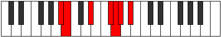
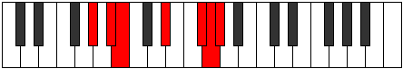

# Mode AFlatEponimic

## Links

- [Documentation](index.md)
- [Scales Index](Scales.md)
- [Modes Index](Modes.md)
- [Chords Index](Chords.md)

## Scale

[Bygimic](ScaleBygimic.md)

## Mode

[AFlatEponimic](ModeAFlatEponimic.md)

## Tonic

Ab

## Signature

[CNaturalMajor]

## Perfection

 - 3 Perfect Notes

 - 3 Imperfect Notes

## Notes

- Ab
- Bb (Imperfect)
- Cb
- D#
- E## (Imperfect)
- F## (Imperfect)
- Ab

## Illustration

## Relative Modes

| Number | Mode | Tonic | Notes | Illustration |
|--------|------|-------|-------|--------------|
| [441](https://ianring.com/musictheory/scales/441) | [Thycrimic](ModeThycrimic.md) | D# | D#, E##, F##, G#, A#, B, D# |  |
| [441](https://ianring.com/musictheory/scales/441) | [Thycrimic](ModeThycrimic.md) | Eb | Eb, F#, G, Ab, Bb, Cb, Eb |  |
| [567](https://ianring.com/musictheory/scales/567) | [Aeoladimic](ModeAeoladimic.md) | F# | F#, G, Ab, Bb, Cb, D#, F# |  |
| [567](https://ianring.com/musictheory/scales/567) | [Aeoladimic](ModeAeoladimic.md) | Gb | Gb, Abb, Bbbb, Cbb, Dbbb, Eb, Gb |  |
| [1827](https://ianring.com/musictheory/scales/1827) | [Katygimic](ModeKatygimic.md) | A# | A#, B, C###, E##, F##, G#, A# |  |
| [1827](https://ianring.com/musictheory/scales/1827) | [Katygimic](ModeKatygimic.md) | Bb | Bb, Cb, D#, E##, F##, G#, Bb |  |
| [2331](https://ianring.com/musictheory/scales/2331) | [Dylimic](ModeDylimic.md) | G | G, Ab, Bb, Cb, D#, E##, G |  |
| [2961](https://ianring.com/musictheory/scales/2961) | [Bygimic](ModeBygimic.md) | B | B, C###, E##, F##, G#, A#, B |  |
| [3213](https://ianring.com/musictheory/scales/3213) | [Eponimic](ModeEponimic.md) | G# | G#, A#, B, C###, E##, F##, G# |  |
| [3213](https://ianring.com/musictheory/scales/3213) | [Eponimic](ModeEponimic.md) | Ab | Ab, Bb, Cb, D#, E##, F##, Ab |  |

## Chords

### Ab

| Number | Root | Name | Notes | Illustration | Audio |
|--------|------|------|-------|--------------|-------|

### Bb

| Number | Root | Name | Notes | Illustration | Audio |
|--------|------|------|-------|--------------|-------|

### Cb

| Number | Root | Name | Notes | Illustration | Audio |
|--------|------|------|-------|--------------|-------|

### D#

| Number | Root | Name | Notes | Illustration | Audio |
|--------|------|------|-------|--------------|-------|

### E##

| Number | Root | Name | Notes | Illustration | Audio |
|--------|------|------|-------|--------------|-------|

### F##

| Number | Root | Name | Notes | Illustration | Audio |
|--------|------|------|-------|--------------|-------|

