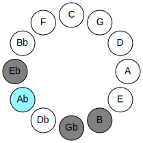
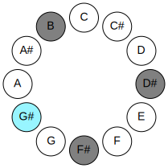
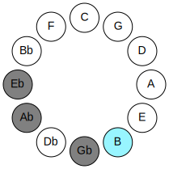
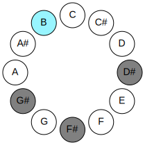
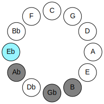
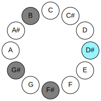
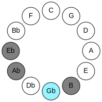
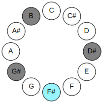

# Mode AFlatEporic

## Links

- [Documentation](README.md)
- [Scales Index](Scales.md)
- [Modes Index](Modes.md)
- [Chords Index](Chords.md)

## Parent Scale

[Epathic](ScaleEpathic.md)

## Mode

[AFlatEporic](ModeAFlatEporic.md)

## Number

1161

## Luminosity

-1

## Tonic

Ab

## Signature

C

## Transposition

3, 4, 3, 2

## Chord Pattern

## Perfection

 - 2 Perfect Notes

 - 2 Imperfect Notes

 - Perfection Profile - true, true, false, false

## Notes

- Ab
- B
- Eb (Imperfect)
- Gb (Imperfect)
- Ab

## Illustration

## Diagram

| Circle of Fifth | Chromatic Circle |
|-----------------|------------------|
|  |  |
## Relative Modes

| Number | Mode | Luminosity | Tonic | Notes | Illustration |
|--------|------|------------|-------|-------|--------------|
| [1161](https://ianring.com/musictheory/scales/1161) | [Eporic](ModeEporic.md) | -1 | G# | G#, B, D#, F#, G# |  |
| [1161](https://ianring.com/musictheory/scales/1161) | [Eporic](ModeEporic.md) | -1 | Ab | Ab, B, Eb, Gb, Ab |  |
| [657](https://ianring.com/musictheory/scales/657) | [Epathic](ModeEpathic.md) | 4 | B | B, D#, F#, G#, B |  |
| [297](https://ianring.com/musictheory/scales/297) | [Mynic](ModeMynic.md) | -1 | D# | D#, F#, G#, B, D# |  |
| [297](https://ianring.com/musictheory/scales/297) | [Mynic](ModeMynic.md) | -1 | Eb | Eb, Gb, Ab, B, Eb |  |
| [549](https://ianring.com/musictheory/scales/549) | [Rothic](ModeRothic.md) | 3 | F# | F#, G#, B, D#, F# |  |
| [549](https://ianring.com/musictheory/scales/549) | [Rothic](ModeRothic.md) | -1 | Gb | Gb, Ab, B, Eb, Gb |  |
## Relative Brightness

| Number | Mode | Luminosity | Tonic | Notes | Circle Of Fifth | Chromatic Circle |
|--------|------|------------|-------|-------|-----------------|------------------|
| [1161](https://ianring.com/musictheory/scales/1161) | [Eporic](ModeEporic.md) | -1 | G# | G#, B, D#, F#, G# |  |  |
| [1161](https://ianring.com/musictheory/scales/1161) | [Eporic](ModeEporic.md) | 4 | Ab | Ab, B, Eb, Gb, Ab |  |  |
| [657](https://ianring.com/musictheory/scales/657) | [Epathic](ModeEpathic.md) | 4 | B | B, D#, F#, G#, B |  |  |
| [297](https://ianring.com/musictheory/scales/297) | [Mynic](ModeMynic.md) | 3 | D# | D#, F#, G#, B, D# |  |  |
| [297](https://ianring.com/musictheory/scales/297) | [Mynic](ModeMynic.md) | -1 | Eb | Eb, Gb, Ab, B, Eb |  |  |
| [549](https://ianring.com/musictheory/scales/549) | [Rothic](ModeRothic.md) | 3 | F# | F#, G#, B, D#, F# |  |  |
| [549](https://ianring.com/musictheory/scales/549) | [Rothic](ModeRothic.md) | 3 | Gb | Gb, Ab, B, Eb, Gb |  |  |

## Chords

### Ab

| Number | Root | Name | Notes | Illustration | Audio |
|--------|------|------|-------|--------------|-------|
| 264 | Ab | [G#5](ChordGSharpPowerChord.md) | G#, D# |  | [midi](ChordGSharpPowerChordRootPosition.mid) |
| 264 | Ab | [Ab5](ChordAFlatPowerChord.md) | Ab, Eb |  | [midi](ChordAFlatPowerChordRootPosition.mid) |
| 2312 | Ab | [G#m](ChordGSharpMinor.md) | G#, B, D# |  | [midi](ChordGSharpMinorRootPosition.mid) |
| 2312 | Ab | [G#m(add(#9))](ChordGSharpMinorAddSharpNinth.md) | G#, B, D#, A## |  | [midi](ChordGSharpMinorAddSharpNinthRootPosition.mid) |
| 2312 | Ab | [Abm](ChordAFlatMinor.md) | Ab, Cb, Eb |  | [midi](ChordAFlatMinorRootPosition.mid) |
| 2312 | Ab | [Abm(add(#9))](ChordAFlatMinorAddSharpNinth.md) | Ab, Cb, Eb, B |  | [midi](ChordAFlatMinorAddSharpNinthRootPosition.mid) |
| 2376 | Ab | [G#m7](ChordGSharpMinorSeventh.md) | G#, B, D#, F# |  | [midi](ChordGSharpMinorSeventhRootPosition.mid) |
| 2376 | Ab | [Abm7](ChordAFlatMinorSeventh.md) | Ab, Cb, Eb, Gb |  | [midi](ChordAFlatMinorSeventhRootPosition.mid) |

### B

| Number | Root | Name | Notes | Illustration | Audio |
|--------|------|------|-------|--------------|-------|
| 2112 | B | [B5](ChordBNaturalPowerChord.md) | B, F# |  | [midi](ChordBNaturalPowerChordRootPosition.mid) |
| 2120 | B | [BM](ChordBNaturalMajor.md) | B, D#, F# |  | [midi](ChordBNaturalMajorRootPosition.mid) |
| 2312 | B | [BM##5](ChordBNaturalMajorDoubleSharpFifth.md) | B, D#, G# |  | [midi](ChordBNaturalMajorDoubleSharpFifthRootPosition.mid) |
| 2376 | B | [BM6](ChordBNaturalMajorSixth.md) | B, D#, F#, G# |  | [midi](ChordBNaturalMajorSixthRootPosition.mid) |

### Eb

| Number | Root | Name | Notes | Illustration | Audio |
|--------|------|------|-------|--------------|-------|
| 328 | Eb | [D#mbb5](ChordDSharpMinorDoubleFlatFifth.md) | D#, F#, G# |  | [midi](ChordDSharpMinorDoubleFlatFifthRootPosition.mid) |
| 328 | Eb | [Ebmbb5](ChordEFlatMinorDoubleFlatFifth.md) | Eb, Gb, Ab |  | [midi](ChordEFlatMinorDoubleFlatFifthRootPosition.mid) |
| 2120 | Eb | [D#m#5](ChordDSharpMinorSharpFifth.md) | D#, F#, B |  | [midi](ChordDSharpMinorSharpFifthRootPosition.mid) |
| 2120 | Eb | [Ebm#5](ChordEFlatMinorSharpFifth.md) | Eb, Gb, Cb |  | [midi](ChordEFlatMinorSharpFifthRootPosition.mid) |
| 2312 | Eb | [D#sus4#5](ChordDSharpSuspendedFourthSharpFifth.md) | D#, G#, A## |  | [midi](ChordDSharpSuspendedFourthSharpFifthRootPosition.mid) |
| 2312 | Eb | [Ebsus4#5](ChordEFlatSuspendedFourthSharpFifth.md) | Eb, Ab, B |  | [midi](ChordEFlatSuspendedFourthSharpFifthRootPosition.mid) |

### Gb

| Number | Root | Name | Notes | Illustration | Audio |
|--------|------|------|-------|--------------|-------|
| 2368 | Gb | [F#sus2bb5](ChordFSharpSuspendedSecondDoubleFlatFifth.md) | F#, G#, B |  | [midi](ChordFSharpSuspendedSecondDoubleFlatFifthRootPosition.mid) |
| 2368 | Gb | [Gbsus2bb5](ChordGFlatSuspendedSecondDoubleFlatFifth.md) | Gb, Ab, Cb |  | [midi](ChordGFlatSuspendedSecondDoubleFlatFifthRootPosition.mid) |
| 2120 | Gb | [F#sus4##5](ChordFSharpSuspendedFourthDoubleSharpFifth.md) | F#, B, D# |  | [midi](ChordFSharpSuspendedFourthDoubleSharpFifthRootPosition.mid) |
| 2120 | Gb | [Gbsus4##5](ChordGFlatSuspendedFourthDoubleSharpFifth.md) | Gb, Cb, Eb |  | [midi](ChordGFlatSuspendedFourthDoubleSharpFifthRootPosition.mid) |
| 2376 | Gb | [F#M6sus2bb5](ChordFSharpMajorSixthSuspendedSecondDoubleFlatFifth.md) | F#, G#, B, D# |  | [midi](ChordFSharpMajorSixthSuspendedSecondDoubleFlatFifthRootPosition.mid) |
| 2376 | Gb | [GbM6sus2bb5](ChordGFlatMajorSixthSuspendedSecondDoubleFlatFifth.md) | Gb, Ab, Cb, Eb |  | [midi](ChordGFlatMajorSixthSuspendedSecondDoubleFlatFifthRootPosition.mid) |

