# Mode AFlatEpothyllic

## Links

- [Documentation](README.md)
- [Scales Index](Scales.md)
- [Modes Index](Modes.md)
- [Chords Index](Chords.md)

## Scale

[Lydyllic](ScaleLydyllic.md)

## Mode

[AFlatEpothyllic](ModeAFlatEpothyllic.md)

## Tonic

Ab

## Signature

[CNaturalMajor]

## Transposition

1, 3, 2, 1, 2, 1, 1, 1

## Chord Pattern

I, iii⁰, vii⁰b3

## Perfection

 - 5 Perfect Notes

 - 3 Imperfect Notes

## Notes

- Ab
- A (Imperfect)
- C
- D
- Eb (Imperfect)
- F
- Gb (Imperfect)
- G
- Ab

## Illustration

## Diagram

| Circle of Fifth | Chromatic Circle |
|-----------------|------------------|
| 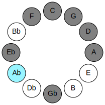 | 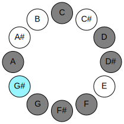 |
## Relative Modes

| Number | Mode | Tonic | Notes | Illustration |
|--------|------|-------|-------|--------------|
| [3795](https://ianring.com/musictheory/scales/3795) | [Epothyllic](ModeEpothyllic.md) | G# | G#, A, C, D, D#, F, F#, G, G# |  |
| [3795](https://ianring.com/musictheory/scales/3795) | [Epothyllic](ModeEpothyllic.md) | Ab | Ab, A, C, D, Eb, F, Gb, G, Ab |  |
| [3945](https://ianring.com/musictheory/scales/3945) | [Lydyllic](ModeLydyllic.md) | A | A, C, D, D#, F, F#, G, G#, A |  |
| [1005](https://ianring.com/musictheory/scales/1005) | [Radyllic](ModeRadyllic.md) | C | C, D, D#, F, F#, G, G#, A, C |  |
| [1275](https://ianring.com/musictheory/scales/1275) | [Stagyllic](ModeStagyllic.md) | D | D, D#, F, F#, G, G#, A, C, D |  |
| [2685](https://ianring.com/musictheory/scales/2685) | [Ionoryllic](ModeIonoryllic.md) | D# | D#, F, F#, G, G#, A, C, D, D# |  |
| [2685](https://ianring.com/musictheory/scales/2685) | [Ionoryllic](ModeIonoryllic.md) | Eb | Eb, F, Gb, G, Ab, A, C, D, Eb |  |
| [1695](https://ianring.com/musictheory/scales/1695) | [Phrodyllic](ModePhrodyllic.md) | F | F, F#, G, G#, A, C, D, D#, F |  |
| [2895](https://ianring.com/musictheory/scales/2895) | [Aeragyllic](ModeAeragyllic.md) | F# | F#, G, G#, A, C, D, D#, F, F# |  |
| [2895](https://ianring.com/musictheory/scales/2895) | [Aeragyllic](ModeAeragyllic.md) | Gb | Gb, G, Ab, A, C, D, Eb, F, Gb |  |
| [3495](https://ianring.com/musictheory/scales/3495) | [Banyllic](ModeBanyllic.md) | G | G, G#, A, C, D, D#, F, F#, G |  |
## Relative Brightness

| Number | Mode | Tonic | Notes | Circle Of Fifth | Chromatic Circle |
|--------|------|-------|-------|-----------------|------------------|
| [3795](https://ianring.com/musictheory/scales/3795) | [Epothyllic](ModeEpothyllic.md) | G# | G#, A, C, D, D#, F, F#, G, G# |  |  |
| [3795](https://ianring.com/musictheory/scales/3795) | [Epothyllic](ModeEpothyllic.md) | Ab | Ab, A, C, D, Eb, F, Gb, G, Ab |  |  |
| [3945](https://ianring.com/musictheory/scales/3945) | [Lydyllic](ModeLydyllic.md) | A | A, C, D, D#, F, F#, G, G#, A | 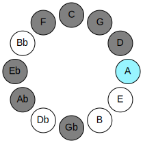 | 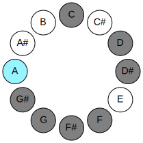 |
| [1005](https://ianring.com/musictheory/scales/1005) | [Radyllic](ModeRadyllic.md) | C | C, D, D#, F, F#, G, G#, A, C | 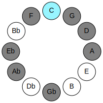 | 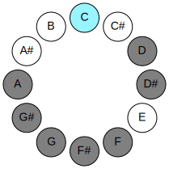 |
| [1275](https://ianring.com/musictheory/scales/1275) | [Stagyllic](ModeStagyllic.md) | D | D, D#, F, F#, G, G#, A, C, D | 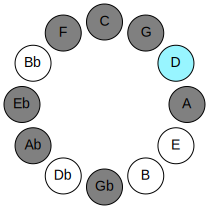 | 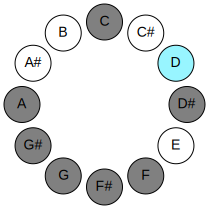 |
| [2685](https://ianring.com/musictheory/scales/2685) | [Ionoryllic](ModeIonoryllic.md) | D# | D#, F, F#, G, G#, A, C, D, D# | 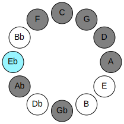 |  |
| [2685](https://ianring.com/musictheory/scales/2685) | [Ionoryllic](ModeIonoryllic.md) | Eb | Eb, F, Gb, G, Ab, A, C, D, Eb |  | 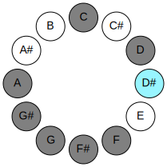 |
| [1695](https://ianring.com/musictheory/scales/1695) | [Phrodyllic](ModePhrodyllic.md) | F | F, F#, G, G#, A, C, D, D#, F | 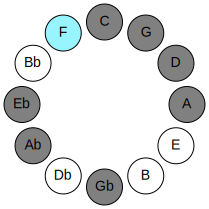 | 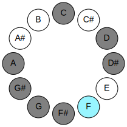 |
| [2895](https://ianring.com/musictheory/scales/2895) | [Aeragyllic](ModeAeragyllic.md) | F# | F#, G, G#, A, C, D, D#, F, F# | 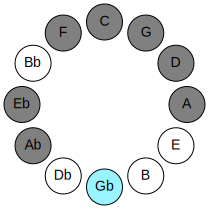 |  |
| [2895](https://ianring.com/musictheory/scales/2895) | [Aeragyllic](ModeAeragyllic.md) | Gb | Gb, G, Ab, A, C, D, Eb, F, Gb |  | 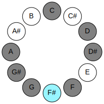 |
| [3495](https://ianring.com/musictheory/scales/3495) | [Banyllic](ModeBanyllic.md) | G | G, G#, A, C, D, D#, F, F#, G | 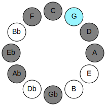 | 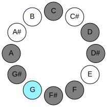 |

## Chords

### Ab

| Number | Root | Name | Notes | Illustration | Audio |
|--------|------|------|-------|--------------|-------|
| 772 | Ab | [G#loc](ChordGSharpLocrian.md) | G#, A, D |  | [midi](ChordGSharpLocrianRootPosition.mid) |
| 772 | Ab | [Abloc](ChordAFlatLocrian.md) | Ab, Bbb, Ebb |  | [midi](ChordAFlatLocrianRootPosition.mid) |
| 261 | Ab | [G#Mb5](ChordGSharpMajorFlatFifth.md) | G#, B#, D |  | [midi](ChordGSharpMajorFlatFifthRootPosition.mid) |
| 261 | Ab | [AbMb5](ChordAFlatMajorFlatFifth.md) | Ab, C, Ebb |  | [midi](ChordAFlatMajorFlatFifthRootPosition.mid) |
| 264 | Ab | [G#5](ChordGSharpPowerChord.md) | G#, D# |  | [midi](ChordGSharpPowerChordRootPosition.mid) |
| 264 | Ab | [Ab5](ChordAFlatPowerChord.md) | Ab, Eb |  | [midi](ChordAFlatPowerChordRootPosition.mid) |
| 776 | Ab | [G#phryg](ChordGSharpPhrygian.md) | G#, A, D# |  | [midi](ChordGSharpPhrygianRootPosition.mid) |
| 776 | Ab | [Abphryg](ChordAFlatPhrygian.md) | Ab, Bbb, Eb |  | [midi](ChordAFlatPhrygianRootPosition.mid) |
| 265 | Ab | [G#M](ChordGSharpMajor.md) | G#, B#, D# |  | [midi](ChordGSharpMajorRootPosition.mid) |
| 265 | Ab | [AbM](ChordAFlatMajor.md) | Ab, C, Eb |  | [midi](ChordAFlatMajorRootPosition.mid) |
| 268 | Ab | [G#lyd](ChordGSharpLydian.md) | G#, C##, D# |  | [midi](ChordGSharpLydianRootPosition.mid) |
| 268 | Ab | [Ablyd](ChordAFlatLydian.md) | Ab, D, Eb |  | [midi](ChordAFlatLydianRootPosition.mid) |
| 269 | Ab | [G#M(add(#4))](ChordGSharpMajorAddSharpFourth.md) | G#, B#, C##, D# |  | [midi](ChordGSharpMajorAddSharpFourthRootPosition.mid) |
| 269 | Ab | [AbM(add(#4))](ChordAFlatMajorAddSharpFourth.md) | Ab, C, D, Eb |  | [midi](ChordAFlatMajorAddSharpFourthRootPosition.mid) |
| 289 | Ab | [G#M##5](ChordGSharpMajorDoubleSharpFifth.md) | G#, B#, E# |  | [midi](ChordGSharpMajorDoubleSharpFifthRootPosition.mid) |
| 289 | Ab | [AbM##5](ChordAFlatMajorDoubleSharpFifth.md) | Ab, C, F |  | [midi](ChordAFlatMajorDoubleSharpFifthRootPosition.mid) |
| 293 | Ab | [G#M6b5](ChordGSharpMajorSixthFlatFifth.md) | G#, B#, D, E# |  | [midi](ChordGSharpMajorSixthFlatFifthRootPosition.mid) |
| 293 | Ab | [AbM6b5](ChordAFlatMajorSixthFlatFifth.md) | Ab, C, Ebb, F |  | [midi](ChordAFlatMajorSixthFlatFifthRootPosition.mid) |
| 297 | Ab | [G#M6](ChordGSharpMajorSixth.md) | G#, B#, D#, E# |  | [midi](ChordGSharpMajorSixthRootPosition.mid) |
| 297 | Ab | [AbM6](ChordAFlatMajorSixth.md) | Ab, C, Eb, F |  | [midi](ChordAFlatMajorSixthRootPosition.mid) |
| 809 | Ab | [G#M6(addb9)](ChordGSharpMajorSixthAddFlatNinth.md) | G#, B#, D#, E#, A |  | [midi](ChordGSharpMajorSixthAddFlatNinthRootPosition.mid) |
| 809 | Ab | [AbM6(addb9)](ChordAFlatMajorSixthAddFlatNinth.md) | Ab, C, Eb, F, Bbb |  | [midi](ChordAFlatMajorSixthAddFlatNinthRootPosition.mid) |
| 325 | Ab | [G#7b5](ChordGSharpDominantSeventhFlatFifth.md) | G#, B#, D, F# |  | [midi](ChordGSharpDominantSeventhFlatFifthRootPosition.mid) |
| 325 | Ab | [Ab7b5](ChordAFlatDominantSeventhFlatFifth.md) | Ab, C, Ebb, Gb |  | [midi](ChordAFlatDominantSeventhFlatFifthRootPosition.mid) |
| 837 | Ab | [G#7b5b9](ChordGSharpDominantSeventhFlatFifthFlatNinth.md) | G#, B#, D, F#, A |  | [midi](ChordGSharpDominantSeventhFlatFifthFlatNinthRootPosition.mid) |
| 837 | Ab | [Ab7b5b9](ChordAFlatDominantSeventhFlatFifthFlatNinth.md) | Ab, C, Ebb, Gb, Bbb |  | [midi](ChordAFlatDominantSeventhFlatFifthFlatNinthRootPosition.mid) |
| 329 | Ab | [G#7](ChordGSharpDominantSeventh.md) | G#, B#, D#, F# |  | [midi](ChordGSharpDominantSeventhRootPosition.mid) |
| 329 | Ab | [Ab7](ChordAFlatDominantSeventh.md) | Ab, C, Eb, Gb |  | [midi](ChordAFlatDominantSeventhRootPosition.mid) |
| 841 | Ab | [G#7b9](ChordGSharpDominantSeventhFlatNinth.md) | G#, B#, D#, F#, A |  | [midi](ChordGSharpDominantSeventhFlatNinthRootPosition.mid) |
| 841 | Ab | [Ab7b9](ChordAFlatDominantSeventhFlatNinth.md) | Ab, C, Eb, Gb, Bbb |  | [midi](ChordAFlatDominantSeventhFlatNinthRootPosition.mid) |
| 333 | Ab | [G#7add(#4)](ChordGSharpDominantSeventhAddSharpFourth.md) | G#, B#, C##, D#, F# |  | [midi](ChordGSharpDominantSeventhAddSharpFourthRootPosition.mid) |
| 333 | Ab | [G#7#11](ChordGSharpDominantSeventhSharpEleventh.md) | G#, B#, D#, F#, C## |  | [midi](ChordGSharpDominantSeventhSharpEleventhRootPosition.mid) |
| 333 | Ab | [Ab7add(#4)](ChordAFlatDominantSeventhAddSharpFourth.md) | Ab, C, D, Eb, Gb |  | [midi](ChordAFlatDominantSeventhAddSharpFourthRootPosition.mid) |
| 333 | Ab | [Ab7#11](ChordAFlatDominantSeventhSharpEleventh.md) | Ab, C, Eb, Gb, D |  | [midi](ChordAFlatDominantSeventhSharpEleventhRootPosition.mid) |
| 361 | Ab | [G#7add13](ChordGSharpDominantSeventhAddThirteenth.md) | G#, B#, D#, F#, E# |  | [midi](ChordGSharpDominantSeventhAddThirteenthRootPosition.mid) |
| 361 | Ab | [Ab7add13](ChordAFlatDominantSeventhAddThirteenth.md) | Ab, C, Eb, Gb, F |  | [midi](ChordAFlatDominantSeventhAddThirteenthRootPosition.mid) |
| 389 | Ab | [G#M7b5](ChordGSharpMajorSeventhFlatFifth.md) | G#, B#, D, F## |  | [midi](ChordGSharpMajorSeventhFlatFifthRootPosition.mid) |
| 389 | Ab | [AbM7b5](ChordAFlatMajorSeventhFlatFifth.md) | Ab, C, Ebb, G |  | [midi](ChordAFlatMajorSeventhFlatFifthRootPosition.mid) |
| 904 | Ab | [G#phryg+7](ChordGSharpPhrygianAddSeventh.md) | G#, A, D#, F## |  | [midi](ChordGSharpPhrygianAddSeventhRootPosition.mid) |
| 904 | Ab | [Abphryg+7](ChordAFlatPhrygianAddSeventh.md) | Ab, Bbb, Eb, G |  | [midi](ChordAFlatPhrygianAddSeventhRootPosition.mid) |
| 393 | Ab | [G#M7](ChordGSharpMajorSeventh.md) | G#, B#, D#, F## |  | [midi](ChordGSharpMajorSeventhRootPosition.mid) |
| 393 | Ab | [AbM7](ChordAFlatMajorSeventh.md) | Ab, C, Eb, G |  | [midi](ChordAFlatMajorSeventhRootPosition.mid) |
| 396 | Ab | [G#lyd(M7)](ChordGSharpLydianMajorSeventh.md) | G#, C##, D#, F## |  | [midi](ChordGSharpLydianMajorSeventhRootPosition.mid) |
| 396 | Ab | [Ablyd(M7)](ChordAFlatLydianMajorSeventh.md) | Ab, D, Eb, G |  | [midi](ChordAFlatLydianMajorSeventhRootPosition.mid) |
| 397 | Ab | [G#M7add(#11)](ChordGSharpMajorSeventhAddSharpEleventh.md) | G#, B#, D#, F##, C## |  | [midi](ChordGSharpMajorSeventhAddSharpEleventhRootPosition.mid) |
| 397 | Ab | [G#M7add(#4)](ChordGSharpMajorSeventhAddSharpFourth.md) | G#, B#, C##, D#, F## |  | [midi](ChordGSharpMajorSeventhAddSharpFourthRootPosition.mid) |
| 397 | Ab | [AbM7add(#11)](ChordAFlatMajorSeventhAddSharpEleventh.md) | Ab, C, Eb, G, D |  | [midi](ChordAFlatMajorSeventhAddSharpEleventhRootPosition.mid) |
| 397 | Ab | [AbM7add(#4)](ChordAFlatMajorSeventhAddSharpFourth.md) | Ab, C, D, Eb, G |  | [midi](ChordAFlatMajorSeventhAddSharpFourthRootPosition.mid) |
| 417 | Ab | [G#M7##5](ChordGSharpMajorSeventhDoubleSharpFifth.md) | G#, B#, E#, F## |  | [midi](ChordGSharpMajorSeventhDoubleSharpFifthRootPosition.mid) |
| 417 | Ab | [AbM7##5](ChordAFlatMajorSeventhDoubleSharpFifth.md) | Ab, C, F, G |  | [midi](ChordAFlatMajorSeventhDoubleSharpFifthRootPosition.mid) |
| 425 | Ab | [G#M7add13](ChordGSharpMajorSeventhAddThirteenth.md) | G#, B#, D#, F##, E# |  | [midi](ChordGSharpMajorSeventhAddThirteenthRootPosition.mid) |
| 425 | Ab | [AbM7add13](ChordAFlatMajorSeventhAddThirteenth.md) | Ab, C, Eb, G, F |  | [midi](ChordAFlatMajorSeventhAddThirteenthRootPosition.mid) |

### A

| Number | Root | Name | Notes | Illustration | Audio |
|--------|------|------|-------|--------------|-------|
| 517 | A | [Ambb5](ChordANaturalMinorDoubleFlatFifth.md) | A, C, D |  | [midi](ChordANaturalMinorDoubleFlatFifthRootPosition.mid) |
| 521 | A | [Ao](ChordANaturalDiminished.md) | A, C, Eb |  | [midi](ChordANaturalDiminishedRootPosition.mid) |
| 524 | A | [Asus4b5](ChordANaturalSuspendedFourthFlatFifth.md) | A, D, Eb |  | [midi](ChordANaturalSuspendedFourthFlatFifthRootPosition.mid) |
| 545 | A | [Am#5](ChordANaturalMinorSharpFifth.md) | A, C, F |  | [midi](ChordANaturalMinorSharpFifthRootPosition.mid) |
| 548 | A | [Asus4#5](ChordANaturalSuspendedFourthSharpFifth.md) | A, D, E# |  | [midi](ChordANaturalSuspendedFourthSharpFifthRootPosition.mid) |
| 580 | A | [Asus4##5](ChordANaturalSuspendedFourthDoubleSharpFifth.md) | A, D, F# |  | [midi](ChordANaturalSuspendedFourthDoubleSharpFifthRootPosition.mid) |
| 585 | A | [Ao7](ChordANaturalFullDiminishedSeventh.md) | A, C, Eb, Gb |  | [midi](ChordANaturalFullDiminishedSeventhRootPosition.mid) |
| 644 | A | [AQ](ChordANaturalQuartal.md) | A, D, G |  | [midi](ChordANaturalQuartalRootPosition.mid) |
| 645 | A | [Am7bb5](ChordANaturalMinorSeventhDoubleFlatFifth.md) | A, C, D, G |  | [midi](ChordANaturalMinorSeventhDoubleFlatFifthRootPosition.mid) |
| 649 | A | [Aø7](ChordANaturalHalfDiminishedSeventh.md) | A, C, Eb, G |  | [midi](ChordANaturalHalfDiminishedSeventhRootPosition.mid) |
| 673 | A | [Am7#5](ChordANaturalMinorSeventhSharpFifth.md) | A, C, E#, G |  | [midi](ChordANaturalMinorSeventhSharpFifthRootPosition.mid) |
| 772 | A | [AQ+](ChordANaturalQuartalAugmented.md) | A, D, G# |  | [midi](ChordANaturalQuartalAugmentedRootPosition.mid) |
| 777 | A | [AoM7](ChordANaturalDiminishedMajorSeventh.md) | A, C, Eb, G# |  | [midi](ChordANaturalDiminishedMajorSeventhRootPosition.mid) |
| 804 | A | [AM7(sus4)#5](ChordANaturalMajorSeventhSuspendedFourthSharpFifth.md) | A, D, E#, G# |  | [midi](ChordANaturalMajorSeventhSuspendedFourthSharpFifthRootPosition.mid) |
| 836 | A | [AM7(sus4)##5](ChordANaturalMajorSeventhSuspendedFourthDoubleSharpFifth.md) | A, D, F#, G# |  | [midi](ChordANaturalMajorSeventhSuspendedFourthDoubleSharpFifthRootPosition.mid) |

### C

| Number | Root | Name | Notes | Illustration | Audio |
|--------|------|------|-------|--------------|-------|
| 37 | C | [Csus2bb5](ChordCNaturalSuspendedSecondDoubleFlatFifth.md) | C, D, F |  | [midi](ChordCNaturalSuspendedSecondDoubleFlatFifthRootPosition.mid) |
| 41 | C | [Cmbb5](ChordCNaturalMinorDoubleFlatFifth.md) | C, Eb, F |  | [midi](ChordCNaturalMinorDoubleFlatFifthRootPosition.mid) |
| 69 | C | [C](ChordCNaturalDiminishedFlatThird.md) | C, Ebb, Gb |  | [midi](ChordCNaturalDiminishedFlatThirdRootPosition.mid) |
| 69 | C | [Csus2b5](ChordCNaturalSuspendedSecondFlatFifth.md) | C, D, Gb |  | [midi](ChordCNaturalSuspendedSecondFlatFifthRootPosition.mid) |
| 73 | C | [Co](ChordCNaturalDiminished.md) | C, Eb, Gb |  | [midi](ChordCNaturalDiminishedRootPosition.mid) |
| 97 | C | [Csus4b5](ChordCNaturalSuspendedFourthFlatFifth.md) | C, F, Gb |  | [midi](ChordCNaturalSuspendedFourthFlatFifthRootPosition.mid) |
| 129 | C | [C5](ChordCNaturalPowerChord.md) | C, G |  | [midi](ChordCNaturalPowerChordRootPosition.mid) |
| 133 | C | [Csus2](ChordCNaturalSuspendedSecond.md) | C, D, G |  | [midi](ChordCNaturalSuspendedSecondRootPosition.mid) |
| 137 | C | [Cm](ChordCNaturalMinor.md) | C, Eb, G |  | [midi](ChordCNaturalMinorRootPosition.mid) |
| 137 | C | [Cm(add(#9))](ChordCNaturalMinorAddSharpNinth.md) | C, Eb, G, D# |  | [midi](ChordCNaturalMinorAddSharpNinthRootPosition.mid) |
| 141 | C | [Cm(add9)](ChordCNaturalMinorAddNinth.md) | C, Eb, G, D |  | [midi](ChordCNaturalMinorAddNinthRootPosition.mid) |
| 161 | C | [Csus4](ChordCNaturalSuspendedFourth.md) | C, F, G |  | [midi](ChordCNaturalSuspendedFourthRootPosition.mid) |
| 169 | C | [Cm(add11)](ChordCNaturalMinorAddEleventh.md) | C, Eb, G, F |  | [midi](ChordCNaturalMinorAddEleventhRootPosition.mid) |
| 169 | C | [Cm(add4)](ChordCNaturalMinorAddFourth.md) | C, Eb, F, G |  | [midi](ChordCNaturalMinorAddFourthRootPosition.mid) |
| 193 | C | [Clyd](ChordCNaturalLydian.md) | C, F#, G |  | [midi](ChordCNaturalLydianRootPosition.mid) |
| 201 | C | [Cm(add(#4))](ChordCNaturalMinorAddSharpFourth.md) | C, Eb, F#, G |  | [midi](ChordCNaturalMinorAddSharpFourthRootPosition.mid) |
| 261 | C | [Csus2#5](ChordCNaturalSuspendedSecondSharpFifth.md) | C, D, G# |  | [midi](ChordCNaturalSuspendedSecondSharpFifthRootPosition.mid) |
| 265 | C | [Cm#5](ChordCNaturalMinorSharpFifth.md) | C, Eb, Ab |  | [midi](ChordCNaturalMinorSharpFifthRootPosition.mid) |
| 289 | C | [Csus4#5](ChordCNaturalSuspendedFourthSharpFifth.md) | C, F, G# |  | [midi](ChordCNaturalSuspendedFourthSharpFifthRootPosition.mid) |
| 325 | C | [Csus2b5add(#5)](ChordCNaturalSuspendedSecondFlatFifthAddSharpFifth.md) | C, D, Gb, G# |  | [midi](ChordCNaturalSuspendedSecondFlatFifthAddSharpFifthRootPosition.mid) |
| 545 | C | [Csus4##5](ChordCNaturalSuspendedFourthDoubleSharpFifth.md) | C, F, A |  | [midi](ChordCNaturalSuspendedFourthDoubleSharpFifthRootPosition.mid) |
| 549 | C | [CM6sus2bb5](ChordCNaturalMajorSixthSuspendedSecondDoubleFlatFifth.md) | C, D, F, A |  | [midi](ChordCNaturalMajorSixthSuspendedSecondDoubleFlatFifthRootPosition.mid) |
| 581 | C | [CM6sus2b5](ChordCNaturalMajorSixthSuspendedSecondFlatFifth.md) | C, D, Gb, A |  | [midi](ChordCNaturalMajorSixthSuspendedSecondFlatFifthRootPosition.mid) |
| 585 | C | [Co7](ChordCNaturalFullDiminishedSeventh.md) | C, Eb, Gb, Bbb |  | [midi](ChordCNaturalFullDiminishedSeventhRootPosition.mid) |
| 645 | C | [CM6sus2](ChordCNaturalMajorSixthSuspendedSecond.md) | C, D, G, A |  | [midi](ChordCNaturalMajorSixthSuspendedSecondRootPosition.mid) |
| 645 | C | [C7sus2b5](ChordCNaturalDominantSeventhSuspendedSecondFlatFifth.md) | C, D, G, Bbb |  | [midi](ChordCNaturalDominantSeventhSuspendedSecondFlatFifthRootPosition.mid) |
| 649 | C | [Cm6](ChordCNaturalMinorSixth.md) | C, Eb, G, A |  | [midi](ChordCNaturalMinorSixthRootPosition.mid) |
| 653 | C | [Cm6(add9)](ChordCNaturalMinorSixthAddNinth.md) | C, Eb, G, A, D |  | [midi](ChordCNaturalMinorSixthAddNinthRootPosition.mid) |
| 673 | C | [CM6sus4](ChordCNaturalMajorSixthSuspendedFourth.md) | C, F, G, A |  | [midi](ChordCNaturalMajorSixthSuspendedFourthRootPosition.mid) |

### D

| Number | Root | Name | Notes | Illustration | Audio |
|--------|------|------|-------|--------------|-------|
| 164 | D | [Dmbb5](ChordDNaturalMinorDoubleFlatFifth.md) | D, F, G |  | [midi](ChordDNaturalMinorDoubleFlatFifthRootPosition.mid) |
| 268 | D | [Dloc](ChordDNaturalLocrian.md) | D, Eb, Ab |  | [midi](ChordDNaturalLocrianRootPosition.mid) |
| 292 | D | [Do](ChordDNaturalDiminished.md) | D, F, Ab |  | [midi](ChordDNaturalDiminishedRootPosition.mid) |
| 324 | D | [DMb5](ChordDNaturalMajorFlatFifth.md) | D, F#, Ab |  | [midi](ChordDNaturalMajorFlatFifthRootPosition.mid) |
| 388 | D | [Dsus4b5](ChordDNaturalSuspendedFourthFlatFifth.md) | D, G, Ab |  | [midi](ChordDNaturalSuspendedFourthFlatFifthRootPosition.mid) |
| 516 | D | [D5](ChordDNaturalPowerChord.md) | D, A |  | [midi](ChordDNaturalPowerChordRootPosition.mid) |
| 524 | D | [Dphryg](ChordDNaturalPhrygian.md) | D, Eb, A |  | [midi](ChordDNaturalPhrygianRootPosition.mid) |
| 548 | D | [Dm](ChordDNaturalMinor.md) | D, F, A |  | [midi](ChordDNaturalMinorRootPosition.mid) |
| 548 | D | [Dm(add(#9))](ChordDNaturalMinorAddSharpNinth.md) | D, F, A, E# |  | [midi](ChordDNaturalMinorAddSharpNinthRootPosition.mid) |
| 580 | D | [DM](ChordDNaturalMajor.md) | D, F#, A |  | [midi](ChordDNaturalMajorRootPosition.mid) |
| 612 | D | [DM(add(#9))](ChordDNaturalMajorAddSharpNinth.md) | D, F#, A, E# |  | [midi](ChordDNaturalMajorAddSharpNinthRootPosition.mid) |
| 644 | D | [Dsus4](ChordDNaturalSuspendedFourth.md) | D, G, A |  | [midi](ChordDNaturalSuspendedFourthRootPosition.mid) |
| 676 | D | [Dm(add11)](ChordDNaturalMinorAddEleventh.md) | D, F, A, G |  | [midi](ChordDNaturalMinorAddEleventhRootPosition.mid) |
| 676 | D | [Dm(add4)](ChordDNaturalMinorAddFourth.md) | D, F, G, A |  | [midi](ChordDNaturalMinorAddFourthRootPosition.mid) |
| 708 | D | [DM(add11)](ChordDNaturalMajorAddEleventh.md) | D, F#, A, G |  | [midi](ChordDNaturalMajorAddEleventhRootPosition.mid) |
| 708 | D | [DM(add4)](ChordDNaturalMajorAddFourth.md) | D, F#, G, A |  | [midi](ChordDNaturalMajorAddFourthRootPosition.mid) |
| 772 | D | [Dlyd](ChordDNaturalLydian.md) | D, G#, A |  | [midi](ChordDNaturalLydianRootPosition.mid) |
| 804 | D | [Dm(add(#4))](ChordDNaturalMinorAddSharpFourth.md) | D, F, G#, A |  | [midi](ChordDNaturalMinorAddSharpFourthRootPosition.mid) |
| 836 | D | [DM(add(#4))](ChordDNaturalMajorAddSharpFourth.md) | D, F#, G#, A |  | [midi](ChordDNaturalMajorAddSharpFourthRootPosition.mid) |
| 133 | D | [DQ](ChordDNaturalQuartal.md) | D, G, C |  | [midi](ChordDNaturalQuartalRootPosition.mid) |
| 165 | D | [Dm7bb5](ChordDNaturalMinorSeventhDoubleFlatFifth.md) | D, F, G, C |  | [midi](ChordDNaturalMinorSeventhDoubleFlatFifthRootPosition.mid) |
| 293 | D | [Dø7](ChordDNaturalHalfDiminishedSeventh.md) | D, F, Ab, C |  | [midi](ChordDNaturalHalfDiminishedSeventhRootPosition.mid) |
| 325 | D | [D7b5](ChordDNaturalDominantSeventhFlatFifth.md) | D, F#, Ab, C |  | [midi](ChordDNaturalDominantSeventhFlatFifthRootPosition.mid) |
| 333 | D | [D7b5b9](ChordDNaturalDominantSeventhFlatFifthFlatNinth.md) | D, F#, Ab, C, Eb |  | [midi](ChordDNaturalDominantSeventhFlatFifthFlatNinthRootPosition.mid) |
| 549 | D | [Dm7](ChordDNaturalMinorSeventh.md) | D, F, A, C |  | [midi](ChordDNaturalMinorSeventhRootPosition.mid) |
| 557 | D | [Dm7b9](ChordDNaturalMinorSeventhFlatNinth.md) | D, F, A, C, Eb |  | [midi](ChordDNaturalMinorSeventhFlatNinthRootPosition.mid) |
| 581 | D | [D7](ChordDNaturalDominantSeventh.md) | D, F#, A, C |  | [midi](ChordDNaturalDominantSeventhRootPosition.mid) |
| 589 | D | [D7b9](ChordDNaturalDominantSeventhFlatNinth.md) | D, F#, A, C, Eb |  | [midi](ChordDNaturalDominantSeventhFlatNinthRootPosition.mid) |
| 613 | D | [D7#9](ChordDNaturalDominantSeventhSharpNinth.md) | D, F#, A, C, E# |  | [midi](ChordDNaturalDominantSeventhSharpNinthRootPosition.mid) |
| 645 | D | [D7sus4](ChordDNaturalDominantSeventhSuspendedFourth.md) | D, G, A, C |  | [midi](ChordDNaturalDominantSeventhSuspendedFourthRootPosition.mid) |
| 677 | D | [Dm7add11](ChordDNaturalMinorSeventhAddEleventh.md) | D, F, A, C, G |  | [midi](ChordDNaturalMinorSeventhAddEleventhRootPosition.mid) |
| 709 | D | [D7add4](ChordDNaturalDominantSeventhAddFourth.md) | D, F#, G, A, C |  | [midi](ChordDNaturalDominantSeventhAddFourthRootPosition.mid) |
| 709 | D | [D7add11](ChordDNaturalDominantSeventhAddEleventh.md) | D, F#, A, C, G |  | [midi](ChordDNaturalDominantSeventhAddEleventhRootPosition.mid) |
| 805 | D | [Dm7add(#11)](ChordDNaturalMinorSeventhAddSharpEleventh.md) | D, F, A, C, G# |  | [midi](ChordDNaturalMinorSeventhAddSharpEleventhRootPosition.mid) |
| 837 | D | [D7add(#4)](ChordDNaturalDominantSeventhAddSharpFourth.md) | D, F#, G#, A, C |  | [midi](ChordDNaturalDominantSeventhAddSharpFourthRootPosition.mid) |
| 837 | D | [D7#11](ChordDNaturalDominantSeventhSharpEleventh.md) | D, F#, A, C, G# |  | [midi](ChordDNaturalDominantSeventhSharpEleventhRootPosition.mid) |
| 869 | D | [D7#9#11](ChordDNaturalDominantSeventhSharpNinthSharpEleventh.md) | D, F#, A, C, E#, G# |  | [midi](ChordDNaturalDominantSeventhSharpNinthSharpEleventhRootPosition.mid) |

### Eb

| Number | Root | Name | Notes | Illustration | Audio |
|--------|------|------|-------|--------------|-------|
| 296 | Eb | [D#sus2bb5](ChordDSharpSuspendedSecondDoubleFlatFifth.md) | D#, E#, G# |  | [midi](ChordDSharpSuspendedSecondDoubleFlatFifthRootPosition.mid) |
| 296 | Eb | [Ebsus2bb5](ChordEFlatSuspendedSecondDoubleFlatFifth.md) | Eb, F, Ab |  | [midi](ChordEFlatSuspendedSecondDoubleFlatFifthRootPosition.mid) |
| 328 | Eb | [D#mbb5](ChordDSharpMinorDoubleFlatFifth.md) | D#, F#, G# |  | [midi](ChordDSharpMinorDoubleFlatFifthRootPosition.mid) |
| 328 | Eb | [Ebmbb5](ChordEFlatMinorDoubleFlatFifth.md) | Eb, Gb, Ab |  | [midi](ChordEFlatMinorDoubleFlatFifthRootPosition.mid) |
| 552 | Eb | [D#](ChordDSharpDiminishedFlatThird.md) | D#, F, A |  | [midi](ChordDSharpDiminishedFlatThirdRootPosition.mid) |
| 552 | Eb | [D#sus2b5](ChordDSharpSuspendedSecondFlatFifth.md) | D#, E#, A |  | [midi](ChordDSharpSuspendedSecondFlatFifthRootPosition.mid) |
| 552 | Eb | [Eb](ChordEFlatDiminishedFlatThird.md) | Eb, Gbb, Bbb |  | [midi](ChordEFlatDiminishedFlatThirdRootPosition.mid) |
| 552 | Eb | [Ebsus2b5](ChordEFlatSuspendedSecondFlatFifth.md) | Eb, F, Bbb |  | [midi](ChordEFlatSuspendedSecondFlatFifthRootPosition.mid) |
| 584 | Eb | [D#o](ChordDSharpDiminished.md) | D#, F#, A |  | [midi](ChordDSharpDiminishedRootPosition.mid) |
| 584 | Eb | [Ebo](ChordEFlatDiminished.md) | Eb, Gb, Bbb |  | [midi](ChordEFlatDiminishedRootPosition.mid) |
| 648 | Eb | [D#Mb5](ChordDSharpMajorFlatFifth.md) | D#, F##, A |  | [midi](ChordDSharpMajorFlatFifthRootPosition.mid) |
| 648 | Eb | [EbMb5](ChordEFlatMajorFlatFifth.md) | Eb, G, Bbb |  | [midi](ChordEFlatMajorFlatFifthRootPosition.mid) |
| 776 | Eb | [D#sus4b5](ChordDSharpSuspendedFourthFlatFifth.md) | D#, G#, A |  | [midi](ChordDSharpSuspendedFourthFlatFifthRootPosition.mid) |
| 776 | Eb | [Ebsus4b5](ChordEFlatSuspendedFourthFlatFifth.md) | Eb, Ab, Bbb |  | [midi](ChordEFlatSuspendedFourthFlatFifthRootPosition.mid) |
| 137 | Eb | [D#M##5](ChordDSharpMajorDoubleSharpFifth.md) | D#, F##, B# |  | [midi](ChordDSharpMajorDoubleSharpFifthRootPosition.mid) |
| 137 | Eb | [EbM##5](ChordEFlatMajorDoubleSharpFifth.md) | Eb, G, C |  | [midi](ChordEFlatMajorDoubleSharpFifthRootPosition.mid) |
| 265 | Eb | [D#sus4##5](ChordDSharpSuspendedFourthDoubleSharpFifth.md) | D#, G#, B# |  | [midi](ChordDSharpSuspendedFourthDoubleSharpFifthRootPosition.mid) |
| 265 | Eb | [Ebsus4##5](ChordEFlatSuspendedFourthDoubleSharpFifth.md) | Eb, Ab, C |  | [midi](ChordEFlatSuspendedFourthDoubleSharpFifthRootPosition.mid) |
| 297 | Eb | [D#M6sus2bb5](ChordDSharpMajorSixthSuspendedSecondDoubleFlatFifth.md) | D#, E#, G#, B# |  | [midi](ChordDSharpMajorSixthSuspendedSecondDoubleFlatFifthRootPosition.mid) |
| 297 | Eb | [EbM6sus2bb5](ChordEFlatMajorSixthSuspendedSecondDoubleFlatFifth.md) | Eb, F, Ab, C |  | [midi](ChordEFlatMajorSixthSuspendedSecondDoubleFlatFifthRootPosition.mid) |
| 553 | Eb | [D#M6sus2b5](ChordDSharpMajorSixthSuspendedSecondFlatFifth.md) | D#, E#, A, B# |  | [midi](ChordDSharpMajorSixthSuspendedSecondFlatFifthRootPosition.mid) |
| 553 | Eb | [EbM6sus2b5](ChordEFlatMajorSixthSuspendedSecondFlatFifth.md) | Eb, F, Bbb, C |  | [midi](ChordEFlatMajorSixthSuspendedSecondFlatFifthRootPosition.mid) |
| 585 | Eb | [D#o7](ChordDSharpFullDiminishedSeventh.md) | D#, F#, A, C |  | [midi](ChordDSharpFullDiminishedSeventhRootPosition.mid) |
| 585 | Eb | [Ebo7](ChordEFlatFullDiminishedSeventh.md) | Eb, Gb, Bbb, Dbb |  | [midi](ChordEFlatFullDiminishedSeventhRootPosition.mid) |
| 649 | Eb | [D#M6b5](ChordDSharpMajorSixthFlatFifth.md) | D#, F##, A, B# |  | [midi](ChordDSharpMajorSixthFlatFifthRootPosition.mid) |
| 649 | Eb | [EbM6b5](ChordEFlatMajorSixthFlatFifth.md) | Eb, G, Bbb, C |  | [midi](ChordEFlatMajorSixthFlatFifthRootPosition.mid) |
| 268 | Eb | [D#Q+](ChordDSharpQuartalAugmented.md) | D#, G#, C## |  | [midi](ChordDSharpQuartalAugmentedRootPosition.mid) |
| 268 | Eb | [EbQ+](ChordEFlatQuartalAugmented.md) | Eb, Ab, D |  | [midi](ChordEFlatQuartalAugmentedRootPosition.mid) |
| 588 | Eb | [D#oM7](ChordDSharpDiminishedMajorSeventh.md) | D#, F#, A, C## |  | [midi](ChordDSharpDiminishedMajorSeventhRootPosition.mid) |
| 588 | Eb | [EboM7](ChordEFlatDiminishedMajorSeventh.md) | Eb, Gb, Bbb, D |  | [midi](ChordEFlatDiminishedMajorSeventhRootPosition.mid) |
| 652 | Eb | [D#M7b5](ChordDSharpMajorSeventhFlatFifth.md) | D#, F##, A, C## |  | [midi](ChordDSharpMajorSeventhFlatFifthRootPosition.mid) |
| 652 | Eb | [EbM7b5](ChordEFlatMajorSeventhFlatFifth.md) | Eb, G, Bbb, D |  | [midi](ChordEFlatMajorSeventhFlatFifthRootPosition.mid) |
| 141 | Eb | [D#M7##5](ChordDSharpMajorSeventhDoubleSharpFifth.md) | D#, F##, B#, C## |  | [midi](ChordDSharpMajorSeventhDoubleSharpFifthRootPosition.mid) |
| 141 | Eb | [EbM7##5](ChordEFlatMajorSeventhDoubleSharpFifth.md) | Eb, G, C, D |  | [midi](ChordEFlatMajorSeventhDoubleSharpFifthRootPosition.mid) |
| 269 | Eb | [D#M7(sus4)##5](ChordDSharpMajorSeventhSuspendedFourthDoubleSharpFifth.md) | D#, G#, B#, C## |  | [midi](ChordDSharpMajorSeventhSuspendedFourthDoubleSharpFifthRootPosition.mid) |
| 269 | Eb | [EbM7(sus4)##5](ChordEFlatMajorSeventhSuspendedFourthDoubleSharpFifth.md) | Eb, Ab, C, D |  | [midi](ChordEFlatMajorSeventhSuspendedFourthDoubleSharpFifthRootPosition.mid) |

### F

| Number | Root | Name | Notes | Illustration | Audio |
|--------|------|------|-------|--------------|-------|
| 33 | F | [F5](ChordFNaturalPowerChord.md) | F, C |  | [midi](ChordFNaturalPowerChordRootPosition.mid) |
| 97 | F | [Fphryg](ChordFNaturalPhrygian.md) | F, Gb, C |  | [midi](ChordFNaturalPhrygianRootPosition.mid) |
| 161 | F | [Fsus2](ChordFNaturalSuspendedSecond.md) | F, G, C |  | [midi](ChordFNaturalSuspendedSecondRootPosition.mid) |
| 289 | F | [Fm](ChordFNaturalMinor.md) | F, Ab, C |  | [midi](ChordFNaturalMinorRootPosition.mid) |
| 289 | F | [Fm(add(#9))](ChordFNaturalMinorAddSharpNinth.md) | F, Ab, C, G# |  | [midi](ChordFNaturalMinorAddSharpNinthRootPosition.mid) |
| 417 | F | [Fm(add9)](ChordFNaturalMinorAddNinth.md) | F, Ab, C, G |  | [midi](ChordFNaturalMinorAddNinthRootPosition.mid) |
| 545 | F | [FM](ChordFNaturalMajor.md) | F, A, C |  | [midi](ChordFNaturalMajorRootPosition.mid) |
| 673 | F | [FM(add9)](ChordFNaturalMajorAddNinth.md) | F, A, C, G |  | [midi](ChordFNaturalMajorAddNinthRootPosition.mid) |
| 801 | F | [FM(add(#9))](ChordFNaturalMajorAddSharpNinth.md) | F, A, C, G# |  | [midi](ChordFNaturalMajorAddSharpNinthRootPosition.mid) |
| 548 | F | [FM##5](ChordFNaturalMajorDoubleSharpFifth.md) | F, A, D |  | [midi](ChordFNaturalMajorDoubleSharpFifthRootPosition.mid) |
| 165 | F | [FM6sus2](ChordFNaturalMajorSixthSuspendedSecond.md) | F, G, C, D |  | [midi](ChordFNaturalMajorSixthSuspendedSecondRootPosition.mid) |
| 165 | F | [F7sus2b5](ChordFNaturalDominantSeventhSuspendedSecondFlatFifth.md) | F, G, C, Ebb |  | [midi](ChordFNaturalDominantSeventhSuspendedSecondFlatFifthRootPosition.mid) |
| 293 | F | [Fm6](ChordFNaturalMinorSixth.md) | F, Ab, C, D |  | [midi](ChordFNaturalMinorSixthRootPosition.mid) |
| 357 | F | [Fm6(addb9)](ChordFNaturalMinorSixthAddFlatNinth.md) | F, Ab, C, D, Gb |  | [midi](ChordFNaturalMinorSixthAddFlatNinthRootPosition.mid) |
| 421 | F | [Fm6(add9)](ChordFNaturalMinorSixthAddNinth.md) | F, Ab, C, D, G |  | [midi](ChordFNaturalMinorSixthAddNinthRootPosition.mid) |
| 549 | F | [FM6](ChordFNaturalMajorSixth.md) | F, A, C, D |  | [midi](ChordFNaturalMajorSixthRootPosition.mid) |
| 613 | F | [FM6(addb9)](ChordFNaturalMajorSixthAddFlatNinth.md) | F, A, C, D, Gb |  | [midi](ChordFNaturalMajorSixthAddFlatNinthRootPosition.mid) |
| 677 | F | [FM6(add9)](ChordFNaturalMajorSixthAddNinth.md) | F, A, C, D, G |  | [midi](ChordFNaturalMajorSixthAddNinthRootPosition.mid) |
| 169 | F | [F7sus2](ChordFNaturalDominantSeventhSuspendedSecond.md) | F, G, C, Eb |  | [midi](ChordFNaturalDominantSeventhSuspendedSecondRootPosition.mid) |
| 169 | F | [F9sus2](ChordFNaturalDominantNinthSuspendedSecond.md) | F, G, C, Eb, G |  | [midi](ChordFNaturalDominantNinthSuspendedSecondRootPosition.mid) |
| 297 | F | [Fm7](ChordFNaturalMinorSeventh.md) | F, Ab, C, Eb |  | [midi](ChordFNaturalMinorSeventhRootPosition.mid) |
| 361 | F | [Fm7b9](ChordFNaturalMinorSeventhFlatNinth.md) | F, Ab, C, Eb, Gb |  | [midi](ChordFNaturalMinorSeventhFlatNinthRootPosition.mid) |
| 425 | F | [Fm9](ChordFNaturalMinorNinth.md) | F, Ab, C, Eb, G |  | [midi](ChordFNaturalMinorNinthRootPosition.mid) |
| 553 | F | [F7](ChordFNaturalDominantSeventh.md) | F, A, C, Eb |  | [midi](ChordFNaturalDominantSeventhRootPosition.mid) |
| 617 | F | [F7b9](ChordFNaturalDominantSeventhFlatNinth.md) | F, A, C, Eb, Gb |  | [midi](ChordFNaturalDominantSeventhFlatNinthRootPosition.mid) |
| 681 | F | [F9](ChordFNaturalDominantNinth.md) | F, A, C, Eb, G |  | [midi](ChordFNaturalDominantNinthRootPosition.mid) |
| 809 | F | [F7#9](ChordFNaturalDominantSeventhSharpNinth.md) | F, A, C, Eb, G# |  | [midi](ChordFNaturalDominantSeventhSharpNinthRootPosition.mid) |
| 301 | F | [Fm7add13](ChordFNaturalMinorSeventhAddThirteenth.md) | F, Ab, C, Eb, D |  | [midi](ChordFNaturalMinorSeventhAddThirteenthRootPosition.mid) |
| 557 | F | [F7add13](ChordFNaturalDominantSeventhAddThirteenth.md) | F, A, C, Eb, D |  | [midi](ChordFNaturalDominantSeventhAddThirteenthRootPosition.mid) |

### Gb

| Number | Root | Name | Notes | Illustration | Audio |
|--------|------|------|-------|--------------|-------|
| 193 | Gb | [F#loc](ChordFSharpLocrian.md) | F#, G, C |  | [midi](ChordFSharpLocrianRootPosition.mid) |
| 193 | Gb | [Gbloc](ChordGFlatLocrian.md) | Gb, Abb, Dbb |  | [midi](ChordGFlatLocrianRootPosition.mid) |
| 321 | Gb | [F#](ChordFSharpDiminishedFlatThird.md) | F#, Ab, C |  | [midi](ChordFSharpDiminishedFlatThirdRootPosition.mid) |
| 321 | Gb | [F#sus2b5](ChordFSharpSuspendedSecondFlatFifth.md) | F#, G#, C |  | [midi](ChordFSharpSuspendedSecondFlatFifthRootPosition.mid) |
| 321 | Gb | [Gb](ChordGFlatDiminishedFlatThird.md) | Gb, Bbbb, Dbb |  | [midi](ChordGFlatDiminishedFlatThirdRootPosition.mid) |
| 321 | Gb | [Gbsus2b5](ChordGFlatSuspendedSecondFlatFifth.md) | Gb, Ab, Dbb |  | [midi](ChordGFlatSuspendedSecondFlatFifthRootPosition.mid) |
| 577 | Gb | [F#o](ChordFSharpDiminished.md) | F#, A, C |  | [midi](ChordFSharpDiminishedRootPosition.mid) |
| 577 | Gb | [Gbo](ChordGFlatDiminished.md) | Gb, Bbb, Dbb |  | [midi](ChordGFlatDiminishedRootPosition.mid) |
| 324 | Gb | [F#sus2#5](ChordFSharpSuspendedSecondSharpFifth.md) | F#, G#, C## |  | [midi](ChordFSharpSuspendedSecondSharpFifthRootPosition.mid) |
| 324 | Gb | [Gbsus2#5](ChordGFlatSuspendedSecondSharpFifth.md) | Gb, Ab, D |  | [midi](ChordGFlatSuspendedSecondSharpFifthRootPosition.mid) |
| 580 | Gb | [F#m#5](ChordFSharpMinorSharpFifth.md) | F#, A, D |  | [midi](ChordFSharpMinorSharpFifthRootPosition.mid) |
| 580 | Gb | [Gbm#5](ChordGFlatMinorSharpFifth.md) | Gb, Bbb, Ebb |  | [midi](ChordGFlatMinorSharpFifthRootPosition.mid) |
| 325 | Gb | [F#sus2b5add(#5)](ChordFSharpSuspendedSecondFlatFifthAddSharpFifth.md) | F#, G#, C, C## |  | [midi](ChordFSharpSuspendedSecondFlatFifthAddSharpFifthRootPosition.mid) |
| 325 | Gb | [Gbsus2b5add(#5)](ChordGFlatSuspendedSecondFlatFifthAddSharpFifth.md) | Gb, Ab, Dbb, D |  | [midi](ChordGFlatSuspendedSecondFlatFifthAddSharpFifthRootPosition.mid) |
| 329 | Gb | [F#M6sus2b5](ChordFSharpMajorSixthSuspendedSecondFlatFifth.md) | F#, G#, C, D# |  | [midi](ChordFSharpMajorSixthSuspendedSecondFlatFifthRootPosition.mid) |
| 329 | Gb | [GbM6sus2b5](ChordGFlatMajorSixthSuspendedSecondFlatFifth.md) | Gb, Ab, Dbb, Eb |  | [midi](ChordGFlatMajorSixthSuspendedSecondFlatFifthRootPosition.mid) |
| 585 | Gb | [F#o7](ChordFSharpFullDiminishedSeventh.md) | F#, A, C, Eb |  | [midi](ChordFSharpFullDiminishedSeventhRootPosition.mid) |
| 585 | Gb | [Gbo7](ChordGFlatFullDiminishedSeventh.md) | Gb, Bbb, Dbb, Fbb |  | [midi](ChordGFlatFullDiminishedSeventhRootPosition.mid) |
| 609 | Gb | [F#oM7](ChordFSharpDiminishedMajorSeventh.md) | F#, A, C, E# |  | [midi](ChordFSharpDiminishedMajorSeventhRootPosition.mid) |
| 609 | Gb | [GboM7](ChordGFlatDiminishedMajorSeventh.md) | Gb, Bbb, Dbb, F |  | [midi](ChordGFlatDiminishedMajorSeventhRootPosition.mid) |

### G

| Number | Root | Name | Notes | Illustration | Audio |
|--------|------|------|-------|--------------|-------|
| 641 | G | [Gsus2bb5](ChordGNaturalSuspendedSecondDoubleFlatFifth.md) | G, A, C |  | [midi](ChordGNaturalSuspendedSecondDoubleFlatFifthRootPosition.mid) |
| 132 | G | [G5](ChordGNaturalPowerChord.md) | G, D |  | [midi](ChordGNaturalPowerChordRootPosition.mid) |
| 388 | G | [Gphryg](ChordGNaturalPhrygian.md) | G, Ab, D |  | [midi](ChordGNaturalPhrygianRootPosition.mid) |
| 644 | G | [Gsus2](ChordGNaturalSuspendedSecond.md) | G, A, D |  | [midi](ChordGNaturalSuspendedSecondRootPosition.mid) |
| 133 | G | [Gsus4](ChordGNaturalSuspendedFourth.md) | G, C, D |  | [midi](ChordGNaturalSuspendedFourthRootPosition.mid) |
| 648 | G | [Gsus2#5](ChordGNaturalSuspendedSecondSharpFifth.md) | G, A, D# |  | [midi](ChordGNaturalSuspendedSecondSharpFifthRootPosition.mid) |
| 137 | G | [Gsus4#5](ChordGNaturalSuspendedFourthSharpFifth.md) | G, C, D# |  | [midi](ChordGNaturalSuspendedFourthSharpFifthRootPosition.mid) |
| 161 | G | [GQ](ChordGNaturalQuartal.md) | G, C, F |  | [midi](ChordGNaturalQuartalRootPosition.mid) |
| 676 | G | [G7sus2](ChordGNaturalDominantSeventhSuspendedSecond.md) | G, A, D, F |  | [midi](ChordGNaturalDominantSeventhSuspendedSecondRootPosition.mid) |
| 676 | G | [G9sus2](ChordGNaturalDominantNinthSuspendedSecond.md) | G, A, D, F, A |  | [midi](ChordGNaturalDominantNinthSuspendedSecondRootPosition.mid) |
| 165 | G | [G7sus4](ChordGNaturalDominantSeventhSuspendedFourth.md) | G, C, D, F |  | [midi](ChordGNaturalDominantSeventhSuspendedFourthRootPosition.mid) |
| 677 | G | [G9sus4](ChordGNaturalDominantNinthSuspendedFourth.md) | G, C, D, F, A |  | [midi](ChordGNaturalDominantNinthSuspendedFourthRootPosition.mid) |
| 193 | G | [GQ+](ChordGNaturalQuartalAugmented.md) | G, C, F# |  | [midi](ChordGNaturalQuartalAugmentedRootPosition.mid) |
| 452 | G | [Gphryg+7](ChordGNaturalPhrygianAddSeventh.md) | G, Ab, D, F# |  | [midi](ChordGNaturalPhrygianAddSeventhRootPosition.mid) |
| 708 | G | [GM7(sus2)](ChordGNaturalMajorSeventhSuspendedSecond.md) | G, A, D, F# |  | [midi](ChordGNaturalMajorSeventhSuspendedSecondRootPosition.mid) |
| 708 | G | [GM9sus2](ChordGNaturalMajorNinthSuspendedSecond.md) | G, A, D, F#, A |  | [midi](ChordGNaturalMajorNinthSuspendedSecondRootPosition.mid) |
| 197 | G | [GM7(sus4)](ChordGNaturalMajorSeventhSuspendedFourth.md) | G, C, D, F# |  | [midi](ChordGNaturalMajorSeventhSuspendedFourthRootPosition.mid) |
| 709 | G | [GM9sus4](ChordGNaturalMajorNinthSuspendedFourth.md) | G, C, D, F#, A |  | [midi](ChordGNaturalMajorNinthSuspendedFourthRootPosition.mid) |
| 201 | G | [GM7(sus4)#5](ChordGNaturalMajorSeventhSuspendedFourthSharpFifth.md) | G, C, D#, F# |  | [midi](ChordGNaturalMajorSeventhSuspendedFourthSharpFifthRootPosition.mid) |

