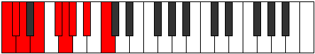
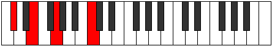

# Mode AFlatEpotyllic

## Links

- [Documentation](README.md)
- [Scales Index](Scales.md)
- [Modes Index](Modes.md)
- [Chords Index](Chords.md)

## Parent Scale

[Epotyllic](ScaleEpotyllic.md)

## Mode

[AFlatEpotyllic](ModeAFlatEpotyllic.md)

## Number

3445

## Luminosity

-1

## Tonic

Ab

## Signature

C

## Transposition

2, 2, 1, 1, 2, 2, 1, 1

## Chord Pattern

Ib5, ii⁰, iii⁰b3, iv⁰, Vb5, vi⁰, vii⁰b3, viii⁰

## Perfection

 - 4 Perfect Notes

 - 4 Imperfect Notes

 - Perfection Profile - false, false, true, true, false, false, true, true

## Notes

- Ab (Imperfect)
- Bb (Imperfect)
- C
- Db
- D (Imperfect)
- E (Imperfect)
- Gb
- G
- Ab (Imperfect)

## Illustration

## Diagram

| Circle of Fifth | Chromatic Circle |
|-----------------|------------------|
|  |  |
## Relative Modes

| Number | Mode | Luminosity | Tonic | Notes | Illustration |
|--------|------|------------|-------|-------|--------------|
| [3445](https://ianring.com/musictheory/scales/3445) | [Epotyllic](ModeEpotyllic.md) | -1 | G# | G#, A#, C, C#, D, E, F#, G, G# |  |
| [1885](https://ianring.com/musictheory/scales/1885) | [Epidyllic](ModeEpidyllic.md) | -1 | A# | A#, C, C#, D, E, F#, G, G#, A# |  |
| [1495](https://ianring.com/musictheory/scales/1495) | [Kaptyllic](ModeKaptyllic.md) | 8 | C | C, C#, D, E, F#, G, G#, A#, C |  |
## Relative Brightness

| Number | Mode | Luminosity | Tonic | Notes | Circle Of Fifth | Chromatic Circle |
|--------|------|------------|-------|-------|-----------------|------------------|
| [3445](https://ianring.com/musictheory/scales/3445) | [Epotyllic](ModeEpotyllic.md) | 6 | G# | G#, A#, C, C#, D, E, F#, G, G# |  |  |
| [3445](https://ianring.com/musictheory/scales/3445) | [Epotyllic](ModeEpotyllic.md) | -1 | Ab | Ab, Bb, C, Db, D, E, Gb, G, Ab |  |  |
| [1885](https://ianring.com/musictheory/scales/1885) | [Epidyllic](ModeEpidyllic.md) | -1 | A# | A#, C, C#, D, E, F#, G, G#, A# |  |  |
| [1885](https://ianring.com/musictheory/scales/1885) | [Epidyllic](ModeEpidyllic.md) | -1 | Bb | Bb, C, Db, D, E, Gb, G, Ab, Bb |  |  |
| [1495](https://ianring.com/musictheory/scales/1495) | [Kaptyllic](ModeKaptyllic.md) | -1 | C | C, C#, D, E, F#, G, G#, A#, C |  |  |
| [3445](https://ianring.com/musictheory/scales/3445) | [Epotyllic](ModeEpotyllic.md) | 6 | D | D, E, F#, G, G#, A#, C, C#, D |  |  |
| [1885](https://ianring.com/musictheory/scales/1885) | [Epidyllic](ModeEpidyllic.md) | -1 | E | E, F#, G, G#, A#, C, C#, D, E |  |  |
| [1495](https://ianring.com/musictheory/scales/1495) | [Kaptyllic](ModeKaptyllic.md) | -1 | F# | F#, G, G#, A#, C, C#, D, E, F# |  |  |
| [1495](https://ianring.com/musictheory/scales/1495) | [Kaptyllic](ModeKaptyllic.md) | 8 | Gb | Gb, G, Ab, Bb, C, Db, D, E, Gb |  |  |

## Chords

### Ab

| Number | Root | Name | Notes | Illustration | Audio |
|--------|------|------|-------|--------------|-------|
| 1282 | Ab | [G#sus2bb5](ChordGSharpSuspendedSecondDoubleFlatFifth.md) | G#, A#, C# |  | [midi](ChordGSharpSuspendedSecondDoubleFlatFifthRootPosition.mid) |
| 1282 | Ab | [Absus2bb5](ChordAFlatSuspendedSecondDoubleFlatFifth.md) | Ab, Bb, Db |  | [midi](ChordAFlatSuspendedSecondDoubleFlatFifthRootPosition.mid) |
| 1284 | Ab | [G#](ChordGSharpDiminishedFlatThird.md) | G#, Bb, D |  | [midi](ChordGSharpDiminishedFlatThirdRootPosition.mid) |
| 1284 | Ab | [G#sus2b5](ChordGSharpSuspendedSecondFlatFifth.md) | G#, A#, D |  | [midi](ChordGSharpSuspendedSecondFlatFifthRootPosition.mid) |
| 1284 | Ab | [Ab](ChordAFlatDiminishedFlatThird.md) | Ab, Cbb, Ebb |  | [midi](ChordAFlatDiminishedFlatThirdRootPosition.mid) |
| 1284 | Ab | [Absus2b5](ChordAFlatSuspendedSecondFlatFifth.md) | Ab, Bb, Ebb |  | [midi](ChordAFlatSuspendedSecondFlatFifthRootPosition.mid) |
| 261 | Ab | [G#Mb5](ChordGSharpMajorFlatFifth.md) | G#, B#, D |  | [midi](ChordGSharpMajorFlatFifthRootPosition.mid) |
| 261 | Ab | [AbMb5](ChordAFlatMajorFlatFifth.md) | Ab, C, Ebb |  | [midi](ChordAFlatMajorFlatFifthRootPosition.mid) |
| 262 | Ab | [G#sus4b5](ChordGSharpSuspendedFourthFlatFifth.md) | G#, C#, D |  | [midi](ChordGSharpSuspendedFourthFlatFifthRootPosition.mid) |
| 262 | Ab | [Absus4b5](ChordAFlatSuspendedFourthFlatFifth.md) | Ab, Db, Ebb |  | [midi](ChordAFlatSuspendedFourthFlatFifthRootPosition.mid) |
| 1296 | Ab | [G#sus2#5](ChordGSharpSuspendedSecondSharpFifth.md) | G#, A#, D## |  | [midi](ChordGSharpSuspendedSecondSharpFifthRootPosition.mid) |
| 1296 | Ab | [Absus2#5](ChordAFlatSuspendedSecondSharpFifth.md) | Ab, Bb, E |  | [midi](ChordAFlatSuspendedSecondSharpFifthRootPosition.mid) |
| 273 | Ab | [G#+](ChordGSharpAugmented.md) | G#, B#, D## |  | [midi](ChordGSharpAugmentedRootPosition.mid) |
| 273 | Ab | [G#+7](ChordGSharpAugmentedAugmentedSeventh.md) | G#, B#, D##, F### |  | [midi](ChordGSharpAugmentedAugmentedSeventhRootPosition.mid) |
| 273 | Ab | [Ab+](ChordAFlatAugmented.md) | Ab, C, E |  | [midi](ChordAFlatAugmentedRootPosition.mid) |
| 273 | Ab | [Ab+7](ChordAFlatAugmentedAugmentedSeventh.md) | Ab, C, E, G# |  | [midi](ChordAFlatAugmentedAugmentedSeventhRootPosition.mid) |
| 274 | Ab | [G#sus4#5](ChordGSharpSuspendedFourthSharpFifth.md) | G#, C#, D## |  | [midi](ChordGSharpSuspendedFourthSharpFifthRootPosition.mid) |
| 274 | Ab | [Absus4#5](ChordAFlatSuspendedFourthSharpFifth.md) | Ab, Db, E |  | [midi](ChordAFlatSuspendedFourthSharpFifthRootPosition.mid) |
| 1300 | Ab | [G#sus2b5add(#5)](ChordGSharpSuspendedSecondFlatFifthAddSharpFifth.md) | G#, A#, D, D## |  | [midi](ChordGSharpSuspendedSecondFlatFifthAddSharpFifthRootPosition.mid) |
| 1300 | Ab | [Absus2b5add(#5)](ChordAFlatSuspendedSecondFlatFifthAddSharpFifth.md) | Ab, Bb, Ebb, E |  | [midi](ChordAFlatSuspendedSecondFlatFifthAddSharpFifthRootPosition.mid) |
| 322 | Ab | [G#Q](ChordGSharpQuartal.md) | G#, C#, F# |  | [midi](ChordGSharpQuartalRootPosition.mid) |
| 322 | Ab | [AbQ](ChordAFlatQuartal.md) | Ab, Db, Gb |  | [midi](ChordAFlatQuartalRootPosition.mid) |
| 325 | Ab | [G#7b5](ChordGSharpDominantSeventhFlatFifth.md) | G#, B#, D, F# |  | [midi](ChordGSharpDominantSeventhFlatFifthRootPosition.mid) |
| 325 | Ab | [Ab7b5](ChordAFlatDominantSeventhFlatFifth.md) | Ab, C, Ebb, Gb |  | [midi](ChordAFlatDominantSeventhFlatFifthRootPosition.mid) |
| 386 | Ab | [G#Q+](ChordGSharpQuartalAugmented.md) | G#, C#, F## |  | [midi](ChordGSharpQuartalAugmentedRootPosition.mid) |
| 386 | Ab | [AbQ+](ChordAFlatQuartalAugmented.md) | Ab, Db, G |  | [midi](ChordAFlatQuartalAugmentedRootPosition.mid) |
| 389 | Ab | [G#M7b5](ChordGSharpMajorSeventhFlatFifth.md) | G#, B#, D, F## |  | [midi](ChordGSharpMajorSeventhFlatFifthRootPosition.mid) |
| 389 | Ab | [AbM7b5](ChordAFlatMajorSeventhFlatFifth.md) | Ab, C, Ebb, G |  | [midi](ChordAFlatMajorSeventhFlatFifthRootPosition.mid) |
| 401 | Ab | [G#+(M7)](ChordGSharpAugmentedMajorSeventh.md) | G#, B#, D##, F## |  | [midi](ChordGSharpAugmentedMajorSeventhRootPosition.mid) |
| 401 | Ab | [Ab+(M7)](ChordAFlatAugmentedMajorSeventh.md) | Ab, C, E, G |  | [midi](ChordAFlatAugmentedMajorSeventhRootPosition.mid) |
| 402 | Ab | [G#M7(sus4)#5](ChordGSharpMajorSeventhSuspendedFourthSharpFifth.md) | G#, C#, D##, F## |  | [midi](ChordGSharpMajorSeventhSuspendedFourthSharpFifthRootPosition.mid) |
| 402 | Ab | [AbM7(sus4)#5](ChordAFlatMajorSeventhSuspendedFourthSharpFifth.md) | Ab, Db, E, G |  | [midi](ChordAFlatMajorSeventhSuspendedFourthSharpFifthRootPosition.mid) |

### Bb

| Number | Root | Name | Notes | Illustration | Audio |
|--------|------|------|-------|--------------|-------|
| 1041 | Bb | [A#](ChordASharpDiminishedFlatThird.md) | A#, C, E |  | [midi](ChordASharpDiminishedFlatThirdRootPosition.mid) |
| 1041 | Bb | [A#sus2b5](ChordASharpSuspendedSecondFlatFifth.md) | A#, B#, E |  | [midi](ChordASharpSuspendedSecondFlatFifthRootPosition.mid) |
| 1041 | Bb | [Bb](ChordBFlatDiminishedFlatThird.md) | Bb, Dbb, Fb |  | [midi](ChordBFlatDiminishedFlatThirdRootPosition.mid) |
| 1041 | Bb | [Bbsus2b5](ChordBFlatSuspendedSecondFlatFifth.md) | Bb, C, Fb |  | [midi](ChordBFlatSuspendedSecondFlatFifthRootPosition.mid) |
| 1042 | Bb | [A#o](ChordASharpDiminished.md) | A#, C#, E |  | [midi](ChordASharpDiminishedRootPosition.mid) |
| 1042 | Bb | [Bbo](ChordBFlatDiminished.md) | Bb, Db, Fb |  | [midi](ChordBFlatDiminishedRootPosition.mid) |
| 1044 | Bb | [A#Mb5](ChordASharpMajorFlatFifth.md) | A#, C##, E |  | [midi](ChordASharpMajorFlatFifthRootPosition.mid) |
| 1044 | Bb | [BbMb5](ChordBFlatMajorFlatFifth.md) | Bb, D, Fb |  | [midi](ChordBFlatMajorFlatFifthRootPosition.mid) |
| 1089 | Bb | [A#sus2#5](ChordASharpSuspendedSecondSharpFifth.md) | A#, B#, E## |  | [midi](ChordASharpSuspendedSecondSharpFifthRootPosition.mid) |
| 1089 | Bb | [Bbsus2#5](ChordBFlatSuspendedSecondSharpFifth.md) | Bb, C, F# |  | [midi](ChordBFlatSuspendedSecondSharpFifthRootPosition.mid) |
| 1090 | Bb | [A#m#5](ChordASharpMinorSharpFifth.md) | A#, C#, F# |  | [midi](ChordASharpMinorSharpFifthRootPosition.mid) |
| 1090 | Bb | [Bbm#5](ChordBFlatMinorSharpFifth.md) | Bb, Db, Gb |  | [midi](ChordBFlatMinorSharpFifthRootPosition.mid) |
| 1092 | Bb | [A#+](ChordASharpAugmented.md) | A#, C##, E## |  | [midi](ChordASharpAugmentedRootPosition.mid) |
| 1092 | Bb | [A#+7](ChordASharpAugmentedAugmentedSeventh.md) | A#, C##, E##, G### |  | [midi](ChordASharpAugmentedAugmentedSeventhRootPosition.mid) |
| 1092 | Bb | [Bb+](ChordBFlatAugmented.md) | Bb, D, F# |  | [midi](ChordBFlatAugmentedRootPosition.mid) |
| 1092 | Bb | [Bb+7](ChordBFlatAugmentedAugmentedSeventh.md) | Bb, D, F#, A# |  | [midi](ChordBFlatAugmentedAugmentedSeventhRootPosition.mid) |
| 1105 | Bb | [A#sus2b5add(#5)](ChordASharpSuspendedSecondFlatFifthAddSharpFifth.md) | A#, B#, E, E## |  | [midi](ChordASharpSuspendedSecondFlatFifthAddSharpFifthRootPosition.mid) |
| 1105 | Bb | [Bbsus2b5add(#5)](ChordBFlatSuspendedSecondFlatFifthAddSharpFifth.md) | Bb, C, Fb, F# |  | [midi](ChordBFlatSuspendedSecondFlatFifthAddSharpFifthRootPosition.mid) |
| 1156 | Bb | [A#M##5](ChordASharpMajorDoubleSharpFifth.md) | A#, C##, F## |  | [midi](ChordASharpMajorDoubleSharpFifthRootPosition.mid) |
| 1156 | Bb | [BbM##5](ChordBFlatMajorDoubleSharpFifth.md) | Bb, D, G |  | [midi](ChordBFlatMajorDoubleSharpFifthRootPosition.mid) |
| 1169 | Bb | [A#M6sus2b5](ChordASharpMajorSixthSuspendedSecondFlatFifth.md) | A#, B#, E, F## |  | [midi](ChordASharpMajorSixthSuspendedSecondFlatFifthRootPosition.mid) |
| 1169 | Bb | [BbM6sus2b5](ChordBFlatMajorSixthSuspendedSecondFlatFifth.md) | Bb, C, Fb, G |  | [midi](ChordBFlatMajorSixthSuspendedSecondFlatFifthRootPosition.mid) |
| 1170 | Bb | [A#o7](ChordASharpFullDiminishedSeventh.md) | A#, C#, E, G |  | [midi](ChordASharpFullDiminishedSeventhRootPosition.mid) |
| 1170 | Bb | [Bbo7](ChordBFlatFullDiminishedSeventh.md) | Bb, Db, Fb, Abb |  | [midi](ChordBFlatFullDiminishedSeventhRootPosition.mid) |
| 1172 | Bb | [A#M6b5](ChordASharpMajorSixthFlatFifth.md) | A#, C##, E, F## |  | [midi](ChordASharpMajorSixthFlatFifthRootPosition.mid) |
| 1172 | Bb | [BbM6b5](ChordBFlatMajorSixthFlatFifth.md) | Bb, D, Fb, G |  | [midi](ChordBFlatMajorSixthFlatFifthRootPosition.mid) |
| 1298 | Bb | [A#ø7](ChordASharpHalfDiminishedSeventh.md) | A#, C#, E, G# |  | [midi](ChordASharpHalfDiminishedSeventhRootPosition.mid) |
| 1298 | Bb | [Bbø7](ChordBFlatHalfDiminishedSeventh.md) | Bb, Db, Fb, Ab |  | [midi](ChordBFlatHalfDiminishedSeventhRootPosition.mid) |
| 1300 | Bb | [A#7b5](ChordASharpDominantSeventhFlatFifth.md) | A#, C##, E, G# |  | [midi](ChordASharpDominantSeventhFlatFifthRootPosition.mid) |
| 1300 | Bb | [Bb7b5](ChordBFlatDominantSeventhFlatFifth.md) | Bb, D, Fb, Ab |  | [midi](ChordBFlatDominantSeventhFlatFifthRootPosition.mid) |
| 1346 | Bb | [A#m7#5](ChordASharpMinorSeventhSharpFifth.md) | A#, C#, E##, G# |  | [midi](ChordASharpMinorSeventhSharpFifthRootPosition.mid) |
| 1346 | Bb | [Bbm7#5](ChordBFlatMinorSeventhSharpFifth.md) | Bb, Db, F#, Ab |  | [midi](ChordBFlatMinorSeventhSharpFifthRootPosition.mid) |

### C

| Number | Root | Name | Notes | Illustration | Audio |
|--------|------|------|-------|--------------|-------|
| 67 | C | [Cloc](ChordCNaturalLocrian.md) | C, Db, Gb |  | [midi](ChordCNaturalLocrianRootPosition.mid) |
| 69 | C | [C](ChordCNaturalDiminishedFlatThird.md) | C, Ebb, Gb |  | [midi](ChordCNaturalDiminishedFlatThirdRootPosition.mid) |
| 69 | C | [Csus2b5](ChordCNaturalSuspendedSecondFlatFifth.md) | C, D, Gb |  | [midi](ChordCNaturalSuspendedSecondFlatFifthRootPosition.mid) |
| 81 | C | [CMb5](ChordCNaturalMajorFlatFifth.md) | C, E, Gb |  | [midi](ChordCNaturalMajorFlatFifthRootPosition.mid) |
| 129 | C | [C5](ChordCNaturalPowerChord.md) | C, G |  | [midi](ChordCNaturalPowerChordRootPosition.mid) |
| 131 | C | [Cphryg](ChordCNaturalPhrygian.md) | C, Db, G |  | [midi](ChordCNaturalPhrygianRootPosition.mid) |
| 133 | C | [Csus2](ChordCNaturalSuspendedSecond.md) | C, D, G |  | [midi](ChordCNaturalSuspendedSecondRootPosition.mid) |
| 145 | C | [CM](ChordCNaturalMajor.md) | C, E, G |  | [midi](ChordCNaturalMajorRootPosition.mid) |
| 149 | C | [CM(add9)](ChordCNaturalMajorAddNinth.md) | C, E, G, D |  | [midi](ChordCNaturalMajorAddNinthRootPosition.mid) |
| 193 | C | [Clyd](ChordCNaturalLydian.md) | C, F#, G |  | [midi](ChordCNaturalLydianRootPosition.mid) |
| 209 | C | [CM(add(#4))](ChordCNaturalMajorAddSharpFourth.md) | C, E, F#, G |  | [midi](ChordCNaturalMajorAddSharpFourthRootPosition.mid) |
| 261 | C | [Csus2#5](ChordCNaturalSuspendedSecondSharpFifth.md) | C, D, G# |  | [midi](ChordCNaturalSuspendedSecondSharpFifthRootPosition.mid) |
| 273 | C | [C+](ChordCNaturalAugmented.md) | C, E, G# |  | [midi](ChordCNaturalAugmentedRootPosition.mid) |
| 273 | C | [C+7](ChordCNaturalAugmentedAugmentedSeventh.md) | C, E, G#, B# |  | [midi](ChordCNaturalAugmentedAugmentedSeventhRootPosition.mid) |
| 325 | C | [Csus2b5add(#5)](ChordCNaturalSuspendedSecondFlatFifthAddSharpFifth.md) | C, D, Gb, G# |  | [midi](ChordCNaturalSuspendedSecondFlatFifthAddSharpFifthRootPosition.mid) |
| 1105 | C | [C7b5](ChordCNaturalDominantSeventhFlatFifth.md) | C, E, Gb, Bb |  | [midi](ChordCNaturalDominantSeventhFlatFifthRootPosition.mid) |
| 1107 | C | [C7b5b9](ChordCNaturalDominantSeventhFlatFifthFlatNinth.md) | C, E, Gb, Bb, Db |  | [midi](ChordCNaturalDominantSeventhFlatFifthFlatNinthRootPosition.mid) |
| 1157 | C | [C7sus2](ChordCNaturalDominantSeventhSuspendedSecond.md) | C, D, G, Bb |  | [midi](ChordCNaturalDominantSeventhSuspendedSecondRootPosition.mid) |
| 1157 | C | [C9sus2](ChordCNaturalDominantNinthSuspendedSecond.md) | C, D, G, Bb, D |  | [midi](ChordCNaturalDominantNinthSuspendedSecondRootPosition.mid) |
| 1169 | C | [C7](ChordCNaturalDominantSeventh.md) | C, E, G, Bb |  | [midi](ChordCNaturalDominantSeventhRootPosition.mid) |
| 1171 | C | [C7b9](ChordCNaturalDominantSeventhFlatNinth.md) | C, E, G, Bb, Db |  | [midi](ChordCNaturalDominantSeventhFlatNinthRootPosition.mid) |
| 1173 | C | [C9](ChordCNaturalDominantNinth.md) | C, E, G, Bb, D |  | [midi](ChordCNaturalDominantNinthRootPosition.mid) |
| 1233 | C | [C7add(#4)](ChordCNaturalDominantSeventhAddSharpFourth.md) | C, E, F#, G, Bb |  | [midi](ChordCNaturalDominantSeventhAddSharpFourthRootPosition.mid) |
| 1233 | C | [C7#11](ChordCNaturalDominantSeventhSharpEleventh.md) | C, E, G, Bb, F# |  | [midi](ChordCNaturalDominantSeventhSharpEleventhRootPosition.mid) |
| 1237 | C | [C9#11](ChordCNaturalDominantNinthSharpEleventh.md) | C, E, G, Bb, D, F# |  | [midi](ChordCNaturalDominantNinthSharpEleventhRootPosition.mid) |
| 1299 | C | [C7#5b9](ChordCNaturalDominantSeventhSharpFifthFlatNinth.md) | C, E, G#, Bb, Db |  | [midi](ChordCNaturalDominantSeventhSharpFifthFlatNinthRootPosition.mid) |
| 1427 | C | [C7b9b13](ChordCNaturalDominantSeventhFlatNinthFlatThirteenth.md) | C, E, G, Bb, Db, Ab |  | [midi](ChordCNaturalDominantSeventhFlatNinthFlatThirteenthRootPosition.mid) |
| 1429 | C | [C9b13](ChordCNaturalDominantNinthFlatThirteenth.md) | C, E, G, Bb, D, Ab |  | [midi](ChordCNaturalDominantNinthFlatThirteenthRootPosition.mid) |

### Db

| Number | Root | Name | Notes | Illustration | Audio |
|--------|------|------|-------|--------------|-------|
| 82 | Db | [C#mbb5](ChordCSharpMinorDoubleFlatFifth.md) | C#, E, F# |  | [midi](ChordCSharpMinorDoubleFlatFifthRootPosition.mid) |
| 82 | Db | [Dbmbb5](ChordDFlatMinorDoubleFlatFifth.md) | Db, Fb, Gb |  | [midi](ChordDFlatMinorDoubleFlatFifthRootPosition.mid) |
| 134 | Db | [C#loc](ChordCSharpLocrian.md) | C#, D, G |  | [midi](ChordCSharpLocrianRootPosition.mid) |
| 134 | Db | [Dbloc](ChordDFlatLocrian.md) | Db, Ebb, Abb |  | [midi](ChordDFlatLocrianRootPosition.mid) |
| 146 | Db | [C#o](ChordCSharpDiminished.md) | C#, E, G |  | [midi](ChordCSharpDiminishedRootPosition.mid) |
| 146 | Db | [Dbo](ChordDFlatDiminished.md) | Db, Fb, Abb |  | [midi](ChordDFlatDiminishedRootPosition.mid) |
| 194 | Db | [C#sus4b5](ChordCSharpSuspendedFourthFlatFifth.md) | C#, F#, G |  | [midi](ChordCSharpSuspendedFourthFlatFifthRootPosition.mid) |
| 194 | Db | [Dbsus4b5](ChordDFlatSuspendedFourthFlatFifth.md) | Db, Gb, Abb |  | [midi](ChordDFlatSuspendedFourthFlatFifthRootPosition.mid) |
| 258 | Db | [C#5](ChordCSharpPowerChord.md) | C#, G# |  | [midi](ChordCSharpPowerChordRootPosition.mid) |
| 258 | Db | [Db5](ChordDFlatPowerChord.md) | Db, Ab |  | [midi](ChordDFlatPowerChordRootPosition.mid) |
| 262 | Db | [C#phryg](ChordCSharpPhrygian.md) | C#, D, G# |  | [midi](ChordCSharpPhrygianRootPosition.mid) |
| 262 | Db | [Dbphryg](ChordDFlatPhrygian.md) | Db, Ebb, Ab |  | [midi](ChordDFlatPhrygianRootPosition.mid) |
| 274 | Db | [C#m](ChordCSharpMinor.md) | C#, E, G# |  | [midi](ChordCSharpMinorRootPosition.mid) |
| 274 | Db | [C#m(add(#9))](ChordCSharpMinorAddSharpNinth.md) | C#, E, G#, D## |  | [midi](ChordCSharpMinorAddSharpNinthRootPosition.mid) |
| 274 | Db | [Dbm](ChordDFlatMinor.md) | Db, Fb, Ab |  | [midi](ChordDFlatMinorRootPosition.mid) |
| 274 | Db | [Dbm(add(#9))](ChordDFlatMinorAddSharpNinth.md) | Db, Fb, Ab, E |  | [midi](ChordDFlatMinorAddSharpNinthRootPosition.mid) |
| 322 | Db | [C#sus4](ChordCSharpSuspendedFourth.md) | C#, F#, G# |  | [midi](ChordCSharpSuspendedFourthRootPosition.mid) |
| 322 | Db | [Dbsus4](ChordDFlatSuspendedFourth.md) | Db, Gb, Ab |  | [midi](ChordDFlatSuspendedFourthRootPosition.mid) |
| 338 | Db | [C#m(add11)](ChordCSharpMinorAddEleventh.md) | C#, E, G#, F# |  | [midi](ChordCSharpMinorAddEleventhRootPosition.mid) |
| 338 | Db | [C#m(add4)](ChordCSharpMinorAddFourth.md) | C#, E, F#, G# |  | [midi](ChordCSharpMinorAddFourthRootPosition.mid) |
| 338 | Db | [Dbm(add11)](ChordDFlatMinorAddEleventh.md) | Db, Fb, Ab, Gb |  | [midi](ChordDFlatMinorAddEleventhRootPosition.mid) |
| 338 | Db | [Dbm(add4)](ChordDFlatMinorAddFourth.md) | Db, Fb, Gb, Ab |  | [midi](ChordDFlatMinorAddFourthRootPosition.mid) |
| 386 | Db | [C#lyd](ChordCSharpLydian.md) | C#, F##, G# |  | [midi](ChordCSharpLydianRootPosition.mid) |
| 386 | Db | [Dblyd](ChordDFlatLydian.md) | Db, G, Ab |  | [midi](ChordDFlatLydianRootPosition.mid) |
| 402 | Db | [C#m(add(#4))](ChordCSharpMinorAddSharpFourth.md) | C#, E, F##, G# |  | [midi](ChordCSharpMinorAddSharpFourthRootPosition.mid) |
| 402 | Db | [Dbm(add(#4))](ChordDFlatMinorAddSharpFourth.md) | Db, Fb, G, Ab |  | [midi](ChordDFlatMinorAddSharpFourthRootPosition.mid) |
| 1090 | Db | [C#sus4##5](ChordCSharpSuspendedFourthDoubleSharpFifth.md) | C#, F#, A# |  | [midi](ChordCSharpSuspendedFourthDoubleSharpFifthRootPosition.mid) |
| 1090 | Db | [Dbsus4##5](ChordDFlatSuspendedFourthDoubleSharpFifth.md) | Db, Gb, Bb |  | [midi](ChordDFlatSuspendedFourthDoubleSharpFifthRootPosition.mid) |
| 1170 | Db | [C#o7](ChordCSharpFullDiminishedSeventh.md) | C#, E, G, Bb |  | [midi](ChordCSharpFullDiminishedSeventhRootPosition.mid) |
| 1170 | Db | [Dbo7](ChordDFlatFullDiminishedSeventh.md) | Db, Fb, Abb, Cbb |  | [midi](ChordDFlatFullDiminishedSeventhRootPosition.mid) |
| 1298 | Db | [C#m6](ChordCSharpMinorSixth.md) | C#, E, G#, A# |  | [midi](ChordCSharpMinorSixthRootPosition.mid) |
| 1298 | Db | [Dbm6](ChordDFlatMinorSixth.md) | Db, Fb, Ab, Bb |  | [midi](ChordDFlatMinorSixthRootPosition.mid) |
| 1302 | Db | [C#m6(addb9)](ChordCSharpMinorSixthAddFlatNinth.md) | C#, E, G#, A#, D |  | [midi](ChordCSharpMinorSixthAddFlatNinthRootPosition.mid) |
| 1302 | Db | [Dbm6(addb9)](ChordDFlatMinorSixthAddFlatNinth.md) | Db, Fb, Ab, Bb, Ebb |  | [midi](ChordDFlatMinorSixthAddFlatNinthRootPosition.mid) |
| 1346 | Db | [C#M6sus4](ChordCSharpMajorSixthSuspendedFourth.md) | C#, F#, G#, A# |  | [midi](ChordCSharpMajorSixthSuspendedFourthRootPosition.mid) |
| 1346 | Db | [DbM6sus4](ChordDFlatMajorSixthSuspendedFourth.md) | Db, Gb, Ab, Bb |  | [midi](ChordDFlatMajorSixthSuspendedFourthRootPosition.mid) |
| 67 | Db | [C#Q+](ChordCSharpQuartalAugmented.md) | C#, F#, B# |  | [midi](ChordCSharpQuartalAugmentedRootPosition.mid) |
| 67 | Db | [DbQ+](ChordDFlatQuartalAugmented.md) | Db, Gb, C |  | [midi](ChordDFlatQuartalAugmentedRootPosition.mid) |
| 147 | Db | [C#oM7](ChordCSharpDiminishedMajorSeventh.md) | C#, E, G, B# |  | [midi](ChordCSharpDiminishedMajorSeventhRootPosition.mid) |
| 147 | Db | [DboM7](ChordDFlatDiminishedMajorSeventh.md) | Db, Fb, Abb, C |  | [midi](ChordDFlatDiminishedMajorSeventhRootPosition.mid) |
| 263 | Db | [C#phryg+7](ChordCSharpPhrygianAddSeventh.md) | C#, D, G#, B# |  | [midi](ChordCSharpPhrygianAddSeventhRootPosition.mid) |
| 263 | Db | [Dbphryg+7](ChordDFlatPhrygianAddSeventh.md) | Db, Ebb, Ab, C |  | [midi](ChordDFlatPhrygianAddSeventhRootPosition.mid) |
| 275 | Db | [C#m(M7)](ChordCSharpMinorMajorSeventh.md) | C#, E, G#, B# |  | [midi](ChordCSharpMinorMajorSeventhRootPosition.mid) |
| 275 | Db | [Dbm(M7)](ChordDFlatMinorMajorSeventh.md) | Db, Fb, Ab, C |  | [midi](ChordDFlatMinorMajorSeventhRootPosition.mid) |
| 323 | Db | [C#M7(sus4)](ChordCSharpMajorSeventhSuspendedFourth.md) | C#, F#, G#, B# |  | [midi](ChordCSharpMajorSeventhSuspendedFourthRootPosition.mid) |
| 323 | Db | [DbM7(sus4)](ChordDFlatMajorSeventhSuspendedFourth.md) | Db, Gb, Ab, C |  | [midi](ChordDFlatMajorSeventhSuspendedFourthRootPosition.mid) |
| 339 | Db | [C#m(M7)add11](ChordCSharpMinorMajorSeventhAddEleventh.md) | C#, E, G#, B#, F# |  | [midi](ChordCSharpMinorMajorSeventhAddEleventhRootPosition.mid) |
| 339 | Db | [Dbm(M7)add11](ChordDFlatMinorMajorSeventhAddEleventh.md) | Db, Fb, Ab, C, Gb |  | [midi](ChordDFlatMinorMajorSeventhAddEleventhRootPosition.mid) |
| 387 | Db | [C#lyd(M7)](ChordCSharpLydianMajorSeventh.md) | C#, F##, G#, B# |  | [midi](ChordCSharpLydianMajorSeventhRootPosition.mid) |
| 387 | Db | [Dblyd(M7)](ChordDFlatLydianMajorSeventh.md) | Db, G, Ab, C |  | [midi](ChordDFlatLydianMajorSeventhRootPosition.mid) |
| 1091 | Db | [C#M7(sus4)##5](ChordCSharpMajorSeventhSuspendedFourthDoubleSharpFifth.md) | C#, F#, A#, B# |  | [midi](ChordCSharpMajorSeventhSuspendedFourthDoubleSharpFifthRootPosition.mid) |
| 1091 | Db | [DbM7(sus4)##5](ChordDFlatMajorSeventhSuspendedFourthDoubleSharpFifth.md) | Db, Gb, Bb, C |  | [midi](ChordDFlatMajorSeventhSuspendedFourthDoubleSharpFifthRootPosition.mid) |
| 1299 | Db | [C#m(M7)add13](ChordCSharpMinorMajorSeventhAddThirteenth.md) | C#, E, G#, B#, A# |  | [midi](ChordCSharpMinorMajorSeventhAddThirteenthRootPosition.mid) |
| 1299 | Db | [Dbm(M7)add13](ChordDFlatMinorMajorSeventhAddThirteenth.md) | Db, Fb, Ab, C, Bb |  | [midi](ChordDFlatMinorMajorSeventhAddThirteenthRootPosition.mid) |

### D

| Number | Root | Name | Notes | Illustration | Audio |
|--------|------|------|-------|--------------|-------|
| 148 | D | [Dsus2bb5](ChordDNaturalSuspendedSecondDoubleFlatFifth.md) | D, E, G |  | [midi](ChordDNaturalSuspendedSecondDoubleFlatFifthRootPosition.mid) |
| 276 | D | [D](ChordDNaturalDiminishedFlatThird.md) | D, Fb, Ab |  | [midi](ChordDNaturalDiminishedFlatThirdRootPosition.mid) |
| 276 | D | [Dsus2b5](ChordDNaturalSuspendedSecondFlatFifth.md) | D, E, Ab |  | [midi](ChordDNaturalSuspendedSecondFlatFifthRootPosition.mid) |
| 324 | D | [DMb5](ChordDNaturalMajorFlatFifth.md) | D, F#, Ab |  | [midi](ChordDNaturalMajorFlatFifthRootPosition.mid) |
| 388 | D | [Dsus4b5](ChordDNaturalSuspendedFourthFlatFifth.md) | D, G, Ab |  | [midi](ChordDNaturalSuspendedFourthFlatFifthRootPosition.mid) |
| 1044 | D | [Dsus2#5](ChordDNaturalSuspendedSecondSharpFifth.md) | D, E, A# |  | [midi](ChordDNaturalSuspendedSecondSharpFifthRootPosition.mid) |
| 1092 | D | [D+](ChordDNaturalAugmented.md) | D, F#, A# |  | [midi](ChordDNaturalAugmentedRootPosition.mid) |
| 1092 | D | [D+7](ChordDNaturalAugmentedAugmentedSeventh.md) | D, F#, A#, C## |  | [midi](ChordDNaturalAugmentedAugmentedSeventhRootPosition.mid) |
| 1156 | D | [Dsus4#5](ChordDNaturalSuspendedFourthSharpFifth.md) | D, G, A# |  | [midi](ChordDNaturalSuspendedFourthSharpFifthRootPosition.mid) |
| 1300 | D | [Dsus2b5add(#5)](ChordDNaturalSuspendedSecondFlatFifthAddSharpFifth.md) | D, E, Ab, A# |  | [midi](ChordDNaturalSuspendedSecondFlatFifthAddSharpFifthRootPosition.mid) |
| 133 | D | [DQ](ChordDNaturalQuartal.md) | D, G, C |  | [midi](ChordDNaturalQuartalRootPosition.mid) |
| 325 | D | [D7b5](ChordDNaturalDominantSeventhFlatFifth.md) | D, F#, Ab, C |  | [midi](ChordDNaturalDominantSeventhFlatFifthRootPosition.mid) |
| 134 | D | [DQ+](ChordDNaturalQuartalAugmented.md) | D, G, C# |  | [midi](ChordDNaturalQuartalAugmentedRootPosition.mid) |
| 326 | D | [DM7b5](ChordDNaturalMajorSeventhFlatFifth.md) | D, F#, Ab, C# |  | [midi](ChordDNaturalMajorSeventhFlatFifthRootPosition.mid) |
| 1094 | D | [D+(M7)](ChordDNaturalAugmentedMajorSeventh.md) | D, F#, A#, C# |  | [midi](ChordDNaturalAugmentedMajorSeventhRootPosition.mid) |
| 1158 | D | [DM7(sus4)#5](ChordDNaturalMajorSeventhSuspendedFourthSharpFifth.md) | D, G, A#, C# |  | [midi](ChordDNaturalMajorSeventhSuspendedFourthSharpFifthRootPosition.mid) |

### E

| Number | Root | Name | Notes | Illustration | Audio |
|--------|------|------|-------|--------------|-------|
| 1104 | E | [E](ChordENaturalDiminishedFlatThird.md) | E, Gb, Bb |  | [midi](ChordENaturalDiminishedFlatThirdRootPosition.mid) |
| 1104 | E | [Esus2b5](ChordENaturalSuspendedSecondFlatFifth.md) | E, F#, Bb |  | [midi](ChordENaturalSuspendedSecondFlatFifthRootPosition.mid) |
| 1168 | E | [Eo](ChordENaturalDiminished.md) | E, G, Bb |  | [midi](ChordENaturalDiminishedRootPosition.mid) |
| 1296 | E | [EMb5](ChordENaturalMajorFlatFifth.md) | E, G#, Bb |  | [midi](ChordENaturalMajorFlatFifthRootPosition.mid) |
| 81 | E | [Esus2#5](ChordENaturalSuspendedSecondSharpFifth.md) | E, F#, B# |  | [midi](ChordENaturalSuspendedSecondSharpFifthRootPosition.mid) |
| 145 | E | [Em#5](ChordENaturalMinorSharpFifth.md) | E, G, C |  | [midi](ChordENaturalMinorSharpFifthRootPosition.mid) |
| 273 | E | [E+](ChordENaturalAugmented.md) | E, G#, B# |  | [midi](ChordENaturalAugmentedRootPosition.mid) |
| 273 | E | [E+7](ChordENaturalAugmentedAugmentedSeventh.md) | E, G#, B#, D## |  | [midi](ChordENaturalAugmentedAugmentedSeventhRootPosition.mid) |
| 1105 | E | [Esus2b5add(#5)](ChordENaturalSuspendedSecondFlatFifthAddSharpFifth.md) | E, F#, Bb, B# |  | [midi](ChordENaturalSuspendedSecondFlatFifthAddSharpFifthRootPosition.mid) |
| 274 | E | [EM##5](ChordENaturalMajorDoubleSharpFifth.md) | E, G#, C# |  | [midi](ChordENaturalMajorDoubleSharpFifthRootPosition.mid) |
| 1106 | E | [EM6sus2b5](ChordENaturalMajorSixthSuspendedSecondFlatFifth.md) | E, F#, Bb, C# |  | [midi](ChordENaturalMajorSixthSuspendedSecondFlatFifthRootPosition.mid) |
| 1170 | E | [Eo7](ChordENaturalFullDiminishedSeventh.md) | E, G, Bb, Db |  | [midi](ChordENaturalFullDiminishedSeventhRootPosition.mid) |
| 1298 | E | [EM6b5](ChordENaturalMajorSixthFlatFifth.md) | E, G#, Bb, C# |  | [midi](ChordENaturalMajorSixthFlatFifthRootPosition.mid) |
| 1172 | E | [Eø7](ChordENaturalHalfDiminishedSeventh.md) | E, G, Bb, D |  | [midi](ChordENaturalHalfDiminishedSeventhRootPosition.mid) |
| 1300 | E | [E7b5](ChordENaturalDominantSeventhFlatFifth.md) | E, G#, Bb, D |  | [midi](ChordENaturalDominantSeventhFlatFifthRootPosition.mid) |
| 149 | E | [Em7#5](ChordENaturalMinorSeventhSharpFifth.md) | E, G, B#, D |  | [midi](ChordENaturalMinorSeventhSharpFifthRootPosition.mid) |

### Gb

| Number | Root | Name | Notes | Illustration | Audio |
|--------|------|------|-------|--------------|-------|
| 193 | Gb | [F#loc](ChordFSharpLocrian.md) | F#, G, C |  | [midi](ChordFSharpLocrianRootPosition.mid) |
| 193 | Gb | [Gbloc](ChordGFlatLocrian.md) | Gb, Abb, Dbb |  | [midi](ChordGFlatLocrianRootPosition.mid) |
| 321 | Gb | [F#](ChordFSharpDiminishedFlatThird.md) | F#, Ab, C |  | [midi](ChordFSharpDiminishedFlatThirdRootPosition.mid) |
| 321 | Gb | [F#sus2b5](ChordFSharpSuspendedSecondFlatFifth.md) | F#, G#, C |  | [midi](ChordFSharpSuspendedSecondFlatFifthRootPosition.mid) |
| 321 | Gb | [Gb](ChordGFlatDiminishedFlatThird.md) | Gb, Bbbb, Dbb |  | [midi](ChordGFlatDiminishedFlatThirdRootPosition.mid) |
| 321 | Gb | [Gbsus2b5](ChordGFlatSuspendedSecondFlatFifth.md) | Gb, Ab, Dbb |  | [midi](ChordGFlatSuspendedSecondFlatFifthRootPosition.mid) |
| 1089 | Gb | [F#Mb5](ChordFSharpMajorFlatFifth.md) | F#, A#, C |  | [midi](ChordFSharpMajorFlatFifthRootPosition.mid) |
| 1089 | Gb | [GbMb5](ChordGFlatMajorFlatFifth.md) | Gb, Bb, Dbb |  | [midi](ChordGFlatMajorFlatFifthRootPosition.mid) |
| 66 | Gb | [F#5](ChordFSharpPowerChord.md) | F#, C# |  | [midi](ChordFSharpPowerChordRootPosition.mid) |
| 66 | Gb | [Gb5](ChordGFlatPowerChord.md) | Gb, Db |  | [midi](ChordGFlatPowerChordRootPosition.mid) |
| 194 | Gb | [F#phryg](ChordFSharpPhrygian.md) | F#, G, C# |  | [midi](ChordFSharpPhrygianRootPosition.mid) |
| 194 | Gb | [Gbphryg](ChordGFlatPhrygian.md) | Gb, Abb, Db |  | [midi](ChordGFlatPhrygianRootPosition.mid) |
| 322 | Gb | [F#sus2](ChordFSharpSuspendedSecond.md) | F#, G#, C# |  | [midi](ChordFSharpSuspendedSecondRootPosition.mid) |
| 322 | Gb | [Gbsus2](ChordGFlatSuspendedSecond.md) | Gb, Ab, Db |  | [midi](ChordGFlatSuspendedSecondRootPosition.mid) |
| 1090 | Gb | [F#M](ChordFSharpMajor.md) | F#, A#, C# |  | [midi](ChordFSharpMajorRootPosition.mid) |
| 1090 | Gb | [GbM](ChordGFlatMajor.md) | Gb, Bb, Db |  | [midi](ChordGFlatMajorRootPosition.mid) |
| 1346 | Gb | [F#M(add9)](ChordFSharpMajorAddNinth.md) | F#, A#, C#, G# |  | [midi](ChordFSharpMajorAddNinthRootPosition.mid) |
| 1346 | Gb | [GbM(add9)](ChordGFlatMajorAddNinth.md) | Gb, Bb, Db, Ab |  | [midi](ChordGFlatMajorAddNinthRootPosition.mid) |
| 67 | Gb | [F#lyd](ChordFSharpLydian.md) | F#, B#, C# |  | [midi](ChordFSharpLydianRootPosition.mid) |
| 67 | Gb | [Gblyd](ChordGFlatLydian.md) | Gb, C, Db |  | [midi](ChordGFlatLydianRootPosition.mid) |
| 1091 | Gb | [F#M(add(#4))](ChordFSharpMajorAddSharpFourth.md) | F#, A#, B#, C# |  | [midi](ChordFSharpMajorAddSharpFourthRootPosition.mid) |
| 1091 | Gb | [GbM(add(#4))](ChordGFlatMajorAddSharpFourth.md) | Gb, Bb, C, Db |  | [midi](ChordGFlatMajorAddSharpFourthRootPosition.mid) |
| 324 | Gb | [F#sus2#5](ChordFSharpSuspendedSecondSharpFifth.md) | F#, G#, C## |  | [midi](ChordFSharpSuspendedSecondSharpFifthRootPosition.mid) |
| 324 | Gb | [Gbsus2#5](ChordGFlatSuspendedSecondSharpFifth.md) | Gb, Ab, D |  | [midi](ChordGFlatSuspendedSecondSharpFifthRootPosition.mid) |
| 1092 | Gb | [F#+](ChordFSharpAugmented.md) | F#, A#, C## |  | [midi](ChordFSharpAugmentedRootPosition.mid) |
| 1092 | Gb | [F#+7](ChordFSharpAugmentedAugmentedSeventh.md) | F#, A#, C##, E## |  | [midi](ChordFSharpAugmentedAugmentedSeventhRootPosition.mid) |
| 1092 | Gb | [Gb+](ChordGFlatAugmented.md) | Gb, Bb, D |  | [midi](ChordGFlatAugmentedRootPosition.mid) |
| 1092 | Gb | [Gb+7](ChordGFlatAugmentedAugmentedSeventh.md) | Gb, Bb, D, F# |  | [midi](ChordGFlatAugmentedAugmentedSeventhRootPosition.mid) |
| 325 | Gb | [F#sus2b5add(#5)](ChordFSharpSuspendedSecondFlatFifthAddSharpFifth.md) | F#, G#, C, C## |  | [midi](ChordFSharpSuspendedSecondFlatFifthAddSharpFifthRootPosition.mid) |
| 325 | Gb | [Gbsus2b5add(#5)](ChordGFlatSuspendedSecondFlatFifthAddSharpFifth.md) | Gb, Ab, Dbb, D |  | [midi](ChordGFlatSuspendedSecondFlatFifthAddSharpFifthRootPosition.mid) |
| 1105 | Gb | [F#7b5](ChordFSharpDominantSeventhFlatFifth.md) | F#, A#, C, E |  | [midi](ChordFSharpDominantSeventhFlatFifthRootPosition.mid) |
| 1105 | Gb | [Gb7b5](ChordGFlatDominantSeventhFlatFifth.md) | Gb, Bb, Dbb, Fb |  | [midi](ChordGFlatDominantSeventhFlatFifthRootPosition.mid) |
| 1233 | Gb | [F#7b5b9](ChordFSharpDominantSeventhFlatFifthFlatNinth.md) | F#, A#, C, E, G |  | [midi](ChordFSharpDominantSeventhFlatFifthFlatNinthRootPosition.mid) |
| 1233 | Gb | [Gb7b5b9](ChordGFlatDominantSeventhFlatFifthFlatNinth.md) | Gb, Bb, Dbb, Fb, Abb |  | [midi](ChordGFlatDominantSeventhFlatFifthFlatNinthRootPosition.mid) |
| 338 | Gb | [F#7sus2](ChordFSharpDominantSeventhSuspendedSecond.md) | F#, G#, C#, E |  | [midi](ChordFSharpDominantSeventhSuspendedSecondRootPosition.mid) |
| 338 | Gb | [F#9sus2](ChordFSharpDominantNinthSuspendedSecond.md) | F#, G#, C#, E, G# |  | [midi](ChordFSharpDominantNinthSuspendedSecondRootPosition.mid) |
| 338 | Gb | [Gb7sus2](ChordGFlatDominantSeventhSuspendedSecond.md) | Gb, Ab, Db, Fb |  | [midi](ChordGFlatDominantSeventhSuspendedSecondRootPosition.mid) |
| 338 | Gb | [Gb9sus2](ChordGFlatDominantNinthSuspendedSecond.md) | Gb, Ab, Db, Fb, Ab |  | [midi](ChordGFlatDominantNinthSuspendedSecondRootPosition.mid) |
| 1106 | Gb | [F#7](ChordFSharpDominantSeventh.md) | F#, A#, C#, E |  | [midi](ChordFSharpDominantSeventhRootPosition.mid) |
| 1106 | Gb | [Gb7](ChordGFlatDominantSeventh.md) | Gb, Bb, Db, Fb |  | [midi](ChordGFlatDominantSeventhRootPosition.mid) |
| 1234 | Gb | [F#7b9](ChordFSharpDominantSeventhFlatNinth.md) | F#, A#, C#, E, G |  | [midi](ChordFSharpDominantSeventhFlatNinthRootPosition.mid) |
| 1234 | Gb | [Gb7b9](ChordGFlatDominantSeventhFlatNinth.md) | Gb, Bb, Db, Fb, Abb |  | [midi](ChordGFlatDominantSeventhFlatNinthRootPosition.mid) |
| 1362 | Gb | [F#9](ChordFSharpDominantNinth.md) | F#, A#, C#, E, G# |  | [midi](ChordFSharpDominantNinthRootPosition.mid) |
| 1362 | Gb | [Gb9](ChordGFlatDominantNinth.md) | Gb, Bb, Db, Fb, Ab |  | [midi](ChordGFlatDominantNinthRootPosition.mid) |
| 1107 | Gb | [F#7add(#4)](ChordFSharpDominantSeventhAddSharpFourth.md) | F#, A#, B#, C#, E |  | [midi](ChordFSharpDominantSeventhAddSharpFourthRootPosition.mid) |
| 1107 | Gb | [F#7#11](ChordFSharpDominantSeventhSharpEleventh.md) | F#, A#, C#, E, B# |  | [midi](ChordFSharpDominantSeventhSharpEleventhRootPosition.mid) |
| 1107 | Gb | [Gb7add(#4)](ChordGFlatDominantSeventhAddSharpFourth.md) | Gb, Bb, C, Db, Fb |  | [midi](ChordGFlatDominantSeventhAddSharpFourthRootPosition.mid) |
| 1107 | Gb | [Gb7#11](ChordGFlatDominantSeventhSharpEleventh.md) | Gb, Bb, Db, Fb, C |  | [midi](ChordGFlatDominantSeventhSharpEleventhRootPosition.mid) |
| 1363 | Gb | [F#9#11](ChordFSharpDominantNinthSharpEleventh.md) | F#, A#, C#, E, G#, B# |  | [midi](ChordFSharpDominantNinthSharpEleventhRootPosition.mid) |
| 1363 | Gb | [Gb9#11](ChordGFlatDominantNinthSharpEleventh.md) | Gb, Bb, Db, Fb, Ab, C |  | [midi](ChordGFlatDominantNinthSharpEleventhRootPosition.mid) |
| 1236 | Gb | [F#7#5b9](ChordFSharpDominantSeventhSharpFifthFlatNinth.md) | F#, A#, C##, E, G |  | [midi](ChordFSharpDominantSeventhSharpFifthFlatNinthRootPosition.mid) |
| 1236 | Gb | [Gb7#5b9](ChordGFlatDominantSeventhSharpFifthFlatNinth.md) | Gb, Bb, D, Fb, Abb |  | [midi](ChordGFlatDominantSeventhSharpFifthFlatNinthRootPosition.mid) |
| 1238 | Gb | [F#7b9b13](ChordFSharpDominantSeventhFlatNinthFlatThirteenth.md) | F#, A#, C#, E, G, D |  | [midi](ChordFSharpDominantSeventhFlatNinthFlatThirteenthRootPosition.mid) |
| 1238 | Gb | [Gb7b9b13](ChordGFlatDominantSeventhFlatNinthFlatThirteenth.md) | Gb, Bb, Db, Fb, Abb, Ebb |  | [midi](ChordGFlatDominantSeventhFlatNinthFlatThirteenthRootPosition.mid) |
| 1366 | Gb | [F#9b13](ChordFSharpDominantNinthFlatThirteenth.md) | F#, A#, C#, E, G#, D |  | [midi](ChordFSharpDominantNinthFlatThirteenthRootPosition.mid) |
| 1366 | Gb | [Gb9b13](ChordGFlatDominantNinthFlatThirteenth.md) | Gb, Bb, Db, Fb, Ab, Ebb |  | [midi](ChordGFlatDominantNinthFlatThirteenthRootPosition.mid) |

### G

| Number | Root | Name | Notes | Illustration | Audio |
|--------|------|------|-------|--------------|-------|
| 1153 | G | [Gmbb5](ChordGNaturalMinorDoubleFlatFifth.md) | G, Bb, C |  | [midi](ChordGNaturalMinorDoubleFlatFifthRootPosition.mid) |
| 386 | G | [Gloc](ChordGNaturalLocrian.md) | G, Ab, Db |  | [midi](ChordGNaturalLocrianRootPosition.mid) |
| 1154 | G | [Go](ChordGNaturalDiminished.md) | G, Bb, Db |  | [midi](ChordGNaturalDiminishedRootPosition.mid) |
| 131 | G | [Gsus4b5](ChordGNaturalSuspendedFourthFlatFifth.md) | G, C, Db |  | [midi](ChordGNaturalSuspendedFourthFlatFifthRootPosition.mid) |
| 132 | G | [G5](ChordGNaturalPowerChord.md) | G, D |  | [midi](ChordGNaturalPowerChordRootPosition.mid) |
| 388 | G | [Gphryg](ChordGNaturalPhrygian.md) | G, Ab, D |  | [midi](ChordGNaturalPhrygianRootPosition.mid) |
| 1156 | G | [Gm](ChordGNaturalMinor.md) | G, Bb, D |  | [midi](ChordGNaturalMinorRootPosition.mid) |
| 1156 | G | [Gm(add(#9))](ChordGNaturalMinorAddSharpNinth.md) | G, Bb, D, A# |  | [midi](ChordGNaturalMinorAddSharpNinthRootPosition.mid) |
| 133 | G | [Gsus4](ChordGNaturalSuspendedFourth.md) | G, C, D |  | [midi](ChordGNaturalSuspendedFourthRootPosition.mid) |
| 1157 | G | [Gm(add11)](ChordGNaturalMinorAddEleventh.md) | G, Bb, D, C |  | [midi](ChordGNaturalMinorAddEleventhRootPosition.mid) |
| 1157 | G | [Gm(add4)](ChordGNaturalMinorAddFourth.md) | G, Bb, C, D |  | [midi](ChordGNaturalMinorAddFourthRootPosition.mid) |
| 134 | G | [Glyd](ChordGNaturalLydian.md) | G, C#, D |  | [midi](ChordGNaturalLydianRootPosition.mid) |
| 1158 | G | [Gm(add(#4))](ChordGNaturalMinorAddSharpFourth.md) | G, Bb, C#, D |  | [midi](ChordGNaturalMinorAddSharpFourthRootPosition.mid) |
| 145 | G | [Gsus4##5](ChordGNaturalSuspendedFourthDoubleSharpFifth.md) | G, C, E |  | [midi](ChordGNaturalSuspendedFourthDoubleSharpFifthRootPosition.mid) |
| 1170 | G | [Go7](ChordGNaturalFullDiminishedSeventh.md) | G, Bb, Db, Fb |  | [midi](ChordGNaturalFullDiminishedSeventhRootPosition.mid) |
| 1172 | G | [Gm6](ChordGNaturalMinorSixth.md) | G, Bb, D, E |  | [midi](ChordGNaturalMinorSixthRootPosition.mid) |
| 1428 | G | [Gm6(addb9)](ChordGNaturalMinorSixthAddFlatNinth.md) | G, Bb, D, E, Ab |  | [midi](ChordGNaturalMinorSixthAddFlatNinthRootPosition.mid) |
| 149 | G | [GM6sus4](ChordGNaturalMajorSixthSuspendedFourth.md) | G, C, D, E |  | [midi](ChordGNaturalMajorSixthSuspendedFourthRootPosition.mid) |
| 193 | G | [GQ+](ChordGNaturalQuartalAugmented.md) | G, C, F# |  | [midi](ChordGNaturalQuartalAugmentedRootPosition.mid) |
| 1218 | G | [GoM7](ChordGNaturalDiminishedMajorSeventh.md) | G, Bb, Db, F# |  | [midi](ChordGNaturalDiminishedMajorSeventhRootPosition.mid) |
| 452 | G | [Gphryg+7](ChordGNaturalPhrygianAddSeventh.md) | G, Ab, D, F# |  | [midi](ChordGNaturalPhrygianAddSeventhRootPosition.mid) |
| 1220 | G | [Gm(M7)](ChordGNaturalMinorMajorSeventh.md) | G, Bb, D, F# |  | [midi](ChordGNaturalMinorMajorSeventhRootPosition.mid) |
| 197 | G | [GM7(sus4)](ChordGNaturalMajorSeventhSuspendedFourth.md) | G, C, D, F# |  | [midi](ChordGNaturalMajorSeventhSuspendedFourthRootPosition.mid) |
| 1221 | G | [Gm(M7)add11](ChordGNaturalMinorMajorSeventhAddEleventh.md) | G, Bb, D, F#, C |  | [midi](ChordGNaturalMinorMajorSeventhAddEleventhRootPosition.mid) |
| 198 | G | [Glyd(M7)](ChordGNaturalLydianMajorSeventh.md) | G, C#, D, F# |  | [midi](ChordGNaturalLydianMajorSeventhRootPosition.mid) |
| 209 | G | [GM7(sus4)##5](ChordGNaturalMajorSeventhSuspendedFourthDoubleSharpFifth.md) | G, C, E, F# |  | [midi](ChordGNaturalMajorSeventhSuspendedFourthDoubleSharpFifthRootPosition.mid) |
| 1236 | G | [Gm(M7)add13](ChordGNaturalMinorMajorSeventhAddThirteenth.md) | G, Bb, D, F#, E |  | [midi](ChordGNaturalMinorMajorSeventhAddThirteenthRootPosition.mid) |

