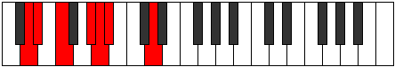

# Mode AFlatEpyrimic

## Links

- [Documentation](index.md)
- [Scales Index](Scales.md)
- [Modes Index](Modes.md)
- [Chords Index](Chords.md)

## Scale

[Epygimic](ScaleEpygimic.md)

## Mode

[AFlatEpyrimic](ModeAFlatEpyrimic.md)

## Tonic

Ab

## Signature

[CNaturalMajor]

## Perfection

 - 4 Perfect Notes

 - 2 Imperfect Notes

## Notes

- Ab
- Bbb (Imperfect)
- Cbb
- D
- Eb
- F (Imperfect)
- Ab

## Illustration

## Relative Modes

| Number | Mode | Tonic | Notes | Illustration |
|--------|------|-------|-------|--------------|
| [711](https://ianring.com/musictheory/scales/711) | [Epyrimic](ModeEpyrimic.md) | Ab | Ab, Bbb, Cbb, D, Eb, F, Ab |  |
| [459](https://ianring.com/musictheory/scales/459) | [Zaptimic](ModeZaptimic.md) | D | D, Eb, F, G#, A, Bb, D |  |
| [2277](https://ianring.com/musictheory/scales/2277) | [Kagimic](ModeKagimic.md) | Eb | Eb, F, G#, A, Bb, C##, Eb |  |
| [1593](https://ianring.com/musictheory/scales/1593) | [Zogimic](ModeZogimic.md) | F | F, G#, A, Bb, C##, D#, F |  |

## Chords

### Ab

| Number | Root | Name | Notes | Illustration | Audio |
|--------|------|------|-------|--------------|-------|

### Bbb

| Number | Root | Name | Notes | Illustration | Audio |
|--------|------|------|-------|--------------|-------|

### Cbb

| Number | Root | Name | Notes | Illustration | Audio |
|--------|------|------|-------|--------------|-------|

### D

| Number | Root | Name | Notes | Illustration | Audio |
|--------|------|------|-------|--------------|-------|

### Eb

| Number | Root | Name | Notes | Illustration | Audio |
|--------|------|------|-------|--------------|-------|

### F

| Number | Root | Name | Notes | Illustration | Audio |
|--------|------|------|-------|--------------|-------|

