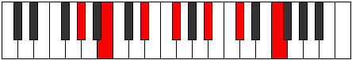
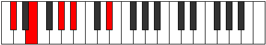
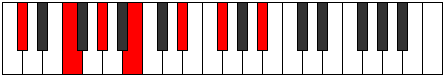

# Mode AFlatGadyllic

## Links

- [Documentation](README.md)
- [Scales Index](Scales.md)
- [Modes Index](Modes.md)
- [Chords Index](Chords.md)

## Parent Scale

[Aerycryllic](ScaleAerycryllic.md)

## Mode

[AFlatGadyllic](ModeAFlatGadyllic.md)

## Number

1965

## Luminosity

4

## Tonic

Ab

## Signature

C

## Transposition

2, 1, 2, 2, 1, 1, 1, 2

## Chord Pattern

i, ii⁰, IIIb5, vi⁰b3, vii⁰, VIII

## Perfection

 - 7 Perfect Notes

 - 1 Imperfect Notes

 - Perfection Profile - true, true, true, true, true, true, false, true

## Notes

- Ab
- Bb
- B
- Db
- Eb
- E
- F (Imperfect)
- Gb
- Ab

## Illustration

## Diagram

| Circle of Fifth | Chromatic Circle |
|-----------------|------------------|
|  |  |
## Relative Modes

| Number | Mode | Luminosity | Tonic | Notes | Illustration |
|--------|------|------------|-------|-------|--------------|
| [1965](https://ianring.com/musictheory/scales/1965) | [Gadyllic](ModeGadyllic.md) | 4 | G# | G#, A#, B, C#, D#, E, F, F#, G# |  |
| [1515](https://ianring.com/musictheory/scales/1515) | [Solyllic](ModeSolyllic.md) | 2 | A# | A#, B, C#, D#, E, F, F#, G#, A# |  |
| [2805](https://ianring.com/musictheory/scales/2805) | [Zylyllic](ModeZylyllic.md) | 7 | B | B, C#, D#, E, F, F#, G#, A#, B |  |
| [1725](https://ianring.com/musictheory/scales/1725) | [Mixodyllic](ModeMixodyllic.md) | 5 | C# | C#, D#, E, F, F#, G#, A#, B, C# |  |
| [1455](https://ianring.com/musictheory/scales/1455) | [Soryllic](ModeSoryllic.md) | 3 | D# | D#, E, F, F#, G#, A#, B, C#, D# |  |
| [2775](https://ianring.com/musictheory/scales/2775) | [Godyllic](ModeGodyllic.md) | 8 | E | E, F, F#, G#, A#, B, C#, D#, E |  |
| [3435](https://ianring.com/musictheory/scales/3435) | [Epiphyllic](ModeEpiphyllic.md) | 1 | F | F, F#, G#, A#, B, C#, D#, E, F |  |
| [3765](https://ianring.com/musictheory/scales/3765) | [Aerycryllic](ModeAerycryllic.md) | 6 | F# | F#, G#, A#, B, C#, D#, E, F, F# |  |
## Relative Brightness

| Number | Mode | Luminosity | Tonic | Notes | Circle Of Fifth | Chromatic Circle |
|--------|------|------------|-------|-------|-----------------|------------------|
| [1965](https://ianring.com/musictheory/scales/1965) | [Gadyllic](ModeGadyllic.md) | 4 | G# | G#, A#, B, C#, D#, E, F, F#, G# |  |  |
| [1965](https://ianring.com/musictheory/scales/1965) | [Gadyllic](ModeGadyllic.md) | 4 | Ab | Ab, Bb, B, Db, Eb, E, F, Gb, Ab |  |  |
| [1515](https://ianring.com/musictheory/scales/1515) | [Solyllic](ModeSolyllic.md) | 2 | A# | A#, B, C#, D#, E, F, F#, G#, A# |  |  |
| [1515](https://ianring.com/musictheory/scales/1515) | [Solyllic](ModeSolyllic.md) | 2 | Bb | Bb, B, Db, Eb, E, F, Gb, Ab, Bb |  |  |
| [2805](https://ianring.com/musictheory/scales/2805) | [Zylyllic](ModeZylyllic.md) | 7 | B | B, C#, D#, E, F, F#, G#, A#, B |  |  |
| [1725](https://ianring.com/musictheory/scales/1725) | [Mixodyllic](ModeMixodyllic.md) | 5 | C# | C#, D#, E, F, F#, G#, A#, B, C# |  |  |
| [1725](https://ianring.com/musictheory/scales/1725) | [Mixodyllic](ModeMixodyllic.md) | 5 | Db | Db, Eb, E, F, Gb, Ab, Bb, B, Db |  |  |
| [1455](https://ianring.com/musictheory/scales/1455) | [Soryllic](ModeSoryllic.md) | 3 | D# | D#, E, F, F#, G#, A#, B, C#, D# |  |  |
| [1455](https://ianring.com/musictheory/scales/1455) | [Soryllic](ModeSoryllic.md) | 3 | Eb | Eb, E, F, Gb, Ab, Bb, B, Db, Eb |  |  |
| [2775](https://ianring.com/musictheory/scales/2775) | [Godyllic](ModeGodyllic.md) | 8 | E | E, F, F#, G#, A#, B, C#, D#, E |  |  |
| [3435](https://ianring.com/musictheory/scales/3435) | [Epiphyllic](ModeEpiphyllic.md) | 1 | F | F, F#, G#, A#, B, C#, D#, E, F |  |  |
| [3765](https://ianring.com/musictheory/scales/3765) | [Aerycryllic](ModeAerycryllic.md) | 6 | F# | F#, G#, A#, B, C#, D#, E, F, F# |  |  |
| [3765](https://ianring.com/musictheory/scales/3765) | [Aerycryllic](ModeAerycryllic.md) | 6 | Gb | Gb, Ab, Bb, B, Db, Eb, E, F, Gb |  |  |

## Chords

### Ab

| Number | Root | Name | Notes | Illustration | Audio |
|--------|------|------|-------|--------------|-------|
| 1282 | Ab | [G#sus2bb5](ChordGSharpSuspendedSecondDoubleFlatFifth.md) | G#, A#, C# |  | [midi](ChordGSharpSuspendedSecondDoubleFlatFifthRootPosition.mid) |
| 1282 | Ab | [Absus2bb5](ChordAFlatSuspendedSecondDoubleFlatFifth.md) | Ab, Bb, Db |  | [midi](ChordAFlatSuspendedSecondDoubleFlatFifthRootPosition.mid) |
| 2306 | Ab | [G#mbb5](ChordGSharpMinorDoubleFlatFifth.md) | G#, B, C# |  | [midi](ChordGSharpMinorDoubleFlatFifthRootPosition.mid) |
| 2306 | Ab | [Abmbb5](ChordAFlatMinorDoubleFlatFifth.md) | Ab, Cb, Db |  | [midi](ChordAFlatMinorDoubleFlatFifthRootPosition.mid) |
| 264 | Ab | [G#5](ChordGSharpPowerChord.md) | G#, D# |  | [midi](ChordGSharpPowerChordRootPosition.mid) |
| 264 | Ab | [Ab5](ChordAFlatPowerChord.md) | Ab, Eb |  | [midi](ChordAFlatPowerChordRootPosition.mid) |
| 1288 | Ab | [G#sus2](ChordGSharpSuspendedSecond.md) | G#, A#, D# |  | [midi](ChordGSharpSuspendedSecondRootPosition.mid) |
| 1288 | Ab | [Absus2](ChordAFlatSuspendedSecond.md) | Ab, Bb, Eb |  | [midi](ChordAFlatSuspendedSecondRootPosition.mid) |
| 2312 | Ab | [G#m](ChordGSharpMinor.md) | G#, B, D# |  | [midi](ChordGSharpMinorRootPosition.mid) |
| 2312 | Ab | [G#m(add(#9))](ChordGSharpMinorAddSharpNinth.md) | G#, B, D#, A## |  | [midi](ChordGSharpMinorAddSharpNinthRootPosition.mid) |
| 2312 | Ab | [Abm](ChordAFlatMinor.md) | Ab, Cb, Eb |  | [midi](ChordAFlatMinorRootPosition.mid) |
| 2312 | Ab | [Abm(add(#9))](ChordAFlatMinorAddSharpNinth.md) | Ab, Cb, Eb, B |  | [midi](ChordAFlatMinorAddSharpNinthRootPosition.mid) |
| 3336 | Ab | [G#m(add9)](ChordGSharpMinorAddNinth.md) | G#, B, D#, A# |  | [midi](ChordGSharpMinorAddNinthRootPosition.mid) |
| 3336 | Ab | [Abm(add9)](ChordAFlatMinorAddNinth.md) | Ab, Cb, Eb, Bb |  | [midi](ChordAFlatMinorAddNinthRootPosition.mid) |
| 266 | Ab | [G#sus4](ChordGSharpSuspendedFourth.md) | G#, C#, D# |  | [midi](ChordGSharpSuspendedFourthRootPosition.mid) |
| 266 | Ab | [Absus4](ChordAFlatSuspendedFourth.md) | Ab, Db, Eb |  | [midi](ChordAFlatSuspendedFourthRootPosition.mid) |
| 2314 | Ab | [G#m(add11)](ChordGSharpMinorAddEleventh.md) | G#, B, D#, C# |  | [midi](ChordGSharpMinorAddEleventhRootPosition.mid) |
| 2314 | Ab | [G#m(add4)](ChordGSharpMinorAddFourth.md) | G#, B, C#, D# |  | [midi](ChordGSharpMinorAddFourthRootPosition.mid) |
| 2314 | Ab | [Abm(add11)](ChordAFlatMinorAddEleventh.md) | Ab, Cb, Eb, Db |  | [midi](ChordAFlatMinorAddEleventhRootPosition.mid) |
| 2314 | Ab | [Abm(add4)](ChordAFlatMinorAddFourth.md) | Ab, Cb, Db, Eb |  | [midi](ChordAFlatMinorAddFourthRootPosition.mid) |
| 1296 | Ab | [G#sus2#5](ChordGSharpSuspendedSecondSharpFifth.md) | G#, A#, D## |  | [midi](ChordGSharpSuspendedSecondSharpFifthRootPosition.mid) |
| 1296 | Ab | [Absus2#5](ChordAFlatSuspendedSecondSharpFifth.md) | Ab, Bb, E |  | [midi](ChordAFlatSuspendedSecondSharpFifthRootPosition.mid) |
| 2320 | Ab | [G#m#5](ChordGSharpMinorSharpFifth.md) | G#, B, E |  | [midi](ChordGSharpMinorSharpFifthRootPosition.mid) |
| 2320 | Ab | [Abm#5](ChordAFlatMinorSharpFifth.md) | Ab, Cb, Fb |  | [midi](ChordAFlatMinorSharpFifthRootPosition.mid) |
| 274 | Ab | [G#sus4#5](ChordGSharpSuspendedFourthSharpFifth.md) | G#, C#, D## |  | [midi](ChordGSharpSuspendedFourthSharpFifthRootPosition.mid) |
| 274 | Ab | [Absus4#5](ChordAFlatSuspendedFourthSharpFifth.md) | Ab, Db, E |  | [midi](ChordAFlatSuspendedFourthSharpFifthRootPosition.mid) |
| 290 | Ab | [G#sus4##5](ChordGSharpSuspendedFourthDoubleSharpFifth.md) | G#, C#, E# |  | [midi](ChordGSharpSuspendedFourthDoubleSharpFifthRootPosition.mid) |
| 290 | Ab | [Absus4##5](ChordAFlatSuspendedFourthDoubleSharpFifth.md) | Ab, Db, F |  | [midi](ChordAFlatSuspendedFourthDoubleSharpFifthRootPosition.mid) |
| 1314 | Ab | [G#M6sus2bb5](ChordGSharpMajorSixthSuspendedSecondDoubleFlatFifth.md) | G#, A#, C#, E# |  | [midi](ChordGSharpMajorSixthSuspendedSecondDoubleFlatFifthRootPosition.mid) |
| 1314 | Ab | [AbM6sus2bb5](ChordAFlatMajorSixthSuspendedSecondDoubleFlatFifth.md) | Ab, Bb, Db, F |  | [midi](ChordAFlatMajorSixthSuspendedSecondDoubleFlatFifthRootPosition.mid) |
| 1320 | Ab | [G#M6sus2](ChordGSharpMajorSixthSuspendedSecond.md) | G#, A#, D#, E# |  | [midi](ChordGSharpMajorSixthSuspendedSecondRootPosition.mid) |
| 1320 | Ab | [G#7sus2b5](ChordGSharpDominantSeventhSuspendedSecondFlatFifth.md) | G#, A#, D#, F |  | [midi](ChordGSharpDominantSeventhSuspendedSecondFlatFifthRootPosition.mid) |
| 1320 | Ab | [AbM6sus2](ChordAFlatMajorSixthSuspendedSecond.md) | Ab, Bb, Eb, F |  | [midi](ChordAFlatMajorSixthSuspendedSecondRootPosition.mid) |
| 1320 | Ab | [Ab7sus2b5](ChordAFlatDominantSeventhSuspendedSecondFlatFifth.md) | Ab, Bb, Eb, Gbb |  | [midi](ChordAFlatDominantSeventhSuspendedSecondFlatFifthRootPosition.mid) |
| 2344 | Ab | [G#m6](ChordGSharpMinorSixth.md) | G#, B, D#, E# |  | [midi](ChordGSharpMinorSixthRootPosition.mid) |
| 2344 | Ab | [Abm6](ChordAFlatMinorSixth.md) | Ab, Cb, Eb, F |  | [midi](ChordAFlatMinorSixthRootPosition.mid) |
| 3368 | Ab | [G#m6(add9)](ChordGSharpMinorSixthAddNinth.md) | G#, B, D#, E#, A# |  | [midi](ChordGSharpMinorSixthAddNinthRootPosition.mid) |
| 3368 | Ab | [Abm6(add9)](ChordAFlatMinorSixthAddNinth.md) | Ab, Cb, Eb, F, Bb |  | [midi](ChordAFlatMinorSixthAddNinthRootPosition.mid) |
| 298 | Ab | [G#M6sus4](ChordGSharpMajorSixthSuspendedFourth.md) | G#, C#, D#, E# |  | [midi](ChordGSharpMajorSixthSuspendedFourthRootPosition.mid) |
| 298 | Ab | [AbM6sus4](ChordAFlatMajorSixthSuspendedFourth.md) | Ab, Db, Eb, F |  | [midi](ChordAFlatMajorSixthSuspendedFourthRootPosition.mid) |
| 322 | Ab | [G#Q](ChordGSharpQuartal.md) | G#, C#, F# |  | [midi](ChordGSharpQuartalRootPosition.mid) |
| 322 | Ab | [AbQ](ChordAFlatQuartal.md) | Ab, Db, Gb |  | [midi](ChordAFlatQuartalRootPosition.mid) |
| 2370 | Ab | [G#m7bb5](ChordGSharpMinorSeventhDoubleFlatFifth.md) | G#, B, C#, F# |  | [midi](ChordGSharpMinorSeventhDoubleFlatFifthRootPosition.mid) |
| 2370 | Ab | [Abm7bb5](ChordAFlatMinorSeventhDoubleFlatFifth.md) | Ab, Cb, Db, Gb |  | [midi](ChordAFlatMinorSeventhDoubleFlatFifthRootPosition.mid) |
| 1352 | Ab | [G#7sus2](ChordGSharpDominantSeventhSuspendedSecond.md) | G#, A#, D#, F# |  | [midi](ChordGSharpDominantSeventhSuspendedSecondRootPosition.mid) |
| 1352 | Ab | [G#9sus2](ChordGSharpDominantNinthSuspendedSecond.md) | G#, A#, D#, F#, A# |  | [midi](ChordGSharpDominantNinthSuspendedSecondRootPosition.mid) |
| 1352 | Ab | [Ab7sus2](ChordAFlatDominantSeventhSuspendedSecond.md) | Ab, Bb, Eb, Gb |  | [midi](ChordAFlatDominantSeventhSuspendedSecondRootPosition.mid) |
| 1352 | Ab | [Ab9sus2](ChordAFlatDominantNinthSuspendedSecond.md) | Ab, Bb, Eb, Gb, Bb |  | [midi](ChordAFlatDominantNinthSuspendedSecondRootPosition.mid) |
| 2376 | Ab | [G#m7](ChordGSharpMinorSeventh.md) | G#, B, D#, F# |  | [midi](ChordGSharpMinorSeventhRootPosition.mid) |
| 2376 | Ab | [Abm7](ChordAFlatMinorSeventh.md) | Ab, Cb, Eb, Gb |  | [midi](ChordAFlatMinorSeventhRootPosition.mid) |
| 3400 | Ab | [G#m9](ChordGSharpMinorNinth.md) | G#, B, D#, F#, A# |  | [midi](ChordGSharpMinorNinthRootPosition.mid) |
| 3400 | Ab | [Abm9](ChordAFlatMinorNinth.md) | Ab, Cb, Eb, Gb, Bb |  | [midi](ChordAFlatMinorNinthRootPosition.mid) |
| 330 | Ab | [G#7sus4](ChordGSharpDominantSeventhSuspendedFourth.md) | G#, C#, D#, F# |  | [midi](ChordGSharpDominantSeventhSuspendedFourthRootPosition.mid) |
| 330 | Ab | [Ab7sus4](ChordAFlatDominantSeventhSuspendedFourth.md) | Ab, Db, Eb, Gb |  | [midi](ChordAFlatDominantSeventhSuspendedFourthRootPosition.mid) |
| 1354 | Ab | [G#9sus4](ChordGSharpDominantNinthSuspendedFourth.md) | G#, C#, D#, F#, A# |  | [midi](ChordGSharpDominantNinthSuspendedFourthRootPosition.mid) |
| 1354 | Ab | [Ab9sus4](ChordAFlatDominantNinthSuspendedFourth.md) | Ab, Db, Eb, Gb, Bb |  | [midi](ChordAFlatDominantNinthSuspendedFourthRootPosition.mid) |
| 2378 | Ab | [G#m7add11](ChordGSharpMinorSeventhAddEleventh.md) | G#, B, D#, F#, C# |  | [midi](ChordGSharpMinorSeventhAddEleventhRootPosition.mid) |
| 2378 | Ab | [Abm7add11](ChordAFlatMinorSeventhAddEleventh.md) | Ab, Cb, Eb, Gb, Db |  | [midi](ChordAFlatMinorSeventhAddEleventhRootPosition.mid) |
| 3402 | Ab | [G#m11](ChordGSharpMinorEleventh.md) | G#, B, D#, F#, A#, C# |  | [midi](ChordGSharpMinorEleventhRootPosition.mid) |
| 3402 | Ab | [Abm11](ChordAFlatMinorEleventh.md) | Ab, Cb, Eb, Gb, Bb, Db |  | [midi](ChordAFlatMinorEleventhRootPosition.mid) |
| 2384 | Ab | [G#m7#5](ChordGSharpMinorSeventhSharpFifth.md) | G#, B, D##, F# |  | [midi](ChordGSharpMinorSeventhSharpFifthRootPosition.mid) |
| 2384 | Ab | [Abm7#5](ChordAFlatMinorSeventhSharpFifth.md) | Ab, Cb, E, Gb |  | [midi](ChordAFlatMinorSeventhSharpFifthRootPosition.mid) |
| 2408 | Ab | [G#m7add13](ChordGSharpMinorSeventhAddThirteenth.md) | G#, B, D#, F#, E# |  | [midi](ChordGSharpMinorSeventhAddThirteenthRootPosition.mid) |
| 2408 | Ab | [Abm7add13](ChordAFlatMinorSeventhAddThirteenth.md) | Ab, Cb, Eb, Gb, F |  | [midi](ChordAFlatMinorSeventhAddThirteenthRootPosition.mid) |
| 3434 | Ab | [G#m13](ChordGSharpMinorThirteenth.md) | G#, B, D#, F#, A#, C#, E# |  | [midi](ChordGSharpMinorThirteenthRootPosition.mid) |
| 3434 | Ab | [Abm13](ChordAFlatMinorThirteenth.md) | Ab, Cb, Eb, Gb, Bb, Db, F |  | [midi](ChordAFlatMinorThirteenthRootPosition.mid) |

### Bb

| Number | Root | Name | Notes | Illustration | Audio |
|--------|------|------|-------|--------------|-------|
| 1034 | Bb | [A#mbb5](ChordASharpMinorDoubleFlatFifth.md) | A#, C#, D# |  | [midi](ChordASharpMinorDoubleFlatFifthRootPosition.mid) |
| 1034 | Bb | [Bbmbb5](ChordBFlatMinorDoubleFlatFifth.md) | Bb, Db, Eb |  | [midi](ChordBFlatMinorDoubleFlatFifthRootPosition.mid) |
| 3088 | Bb | [A#loc](ChordASharpLocrian.md) | A#, B, E |  | [midi](ChordASharpLocrianRootPosition.mid) |
| 3088 | Bb | [Bbloc](ChordBFlatLocrian.md) | Bb, Cb, Fb |  | [midi](ChordBFlatLocrianRootPosition.mid) |
| 1042 | Bb | [A#o](ChordASharpDiminished.md) | A#, C#, E |  | [midi](ChordASharpDiminishedRootPosition.mid) |
| 1042 | Bb | [Bbo](ChordBFlatDiminished.md) | Bb, Db, Fb |  | [midi](ChordBFlatDiminishedRootPosition.mid) |
| 1048 | Bb | [A#sus4b5](ChordASharpSuspendedFourthFlatFifth.md) | A#, D#, E |  | [midi](ChordASharpSuspendedFourthFlatFifthRootPosition.mid) |
| 1048 | Bb | [Bbsus4b5](ChordBFlatSuspendedFourthFlatFifth.md) | Bb, Eb, Fb |  | [midi](ChordBFlatSuspendedFourthFlatFifthRootPosition.mid) |
| 1056 | Bb | [A#5](ChordASharpPowerChord.md) | A#, E# |  | [midi](ChordASharpPowerChordRootPosition.mid) |
| 1056 | Bb | [Bb5](ChordBFlatPowerChord.md) | Bb, F |  | [midi](ChordBFlatPowerChordRootPosition.mid) |
| 3104 | Bb | [A#phryg](ChordASharpPhrygian.md) | A#, B, E# |  | [midi](ChordASharpPhrygianRootPosition.mid) |
| 3104 | Bb | [Bbphryg](ChordBFlatPhrygian.md) | Bb, Cb, F |  | [midi](ChordBFlatPhrygianRootPosition.mid) |
| 1058 | Bb | [A#m](ChordASharpMinor.md) | A#, C#, E# |  | [midi](ChordASharpMinorRootPosition.mid) |
| 1058 | Bb | [A#m(add(#9))](ChordASharpMinorAddSharpNinth.md) | A#, C#, E#, B## |  | [midi](ChordASharpMinorAddSharpNinthRootPosition.mid) |
| 1058 | Bb | [Bbm](ChordBFlatMinor.md) | Bb, Db, F |  | [midi](ChordBFlatMinorRootPosition.mid) |
| 1058 | Bb | [Bbm(add(#9))](ChordBFlatMinorAddSharpNinth.md) | Bb, Db, F, C# |  | [midi](ChordBFlatMinorAddSharpNinthRootPosition.mid) |
| 1064 | Bb | [A#sus4](ChordASharpSuspendedFourth.md) | A#, D#, E# |  | [midi](ChordASharpSuspendedFourthRootPosition.mid) |
| 1064 | Bb | [Bbsus4](ChordBFlatSuspendedFourth.md) | Bb, Eb, F |  | [midi](ChordBFlatSuspendedFourthRootPosition.mid) |
| 1066 | Bb | [A#m(add11)](ChordASharpMinorAddEleventh.md) | A#, C#, E#, D# |  | [midi](ChordASharpMinorAddEleventhRootPosition.mid) |
| 1066 | Bb | [A#m(add4)](ChordASharpMinorAddFourth.md) | A#, C#, D#, E# |  | [midi](ChordASharpMinorAddFourthRootPosition.mid) |
| 1066 | Bb | [Bbm(add11)](ChordBFlatMinorAddEleventh.md) | Bb, Db, F, Eb |  | [midi](ChordBFlatMinorAddEleventhRootPosition.mid) |
| 1066 | Bb | [Bbm(add4)](ChordBFlatMinorAddFourth.md) | Bb, Db, Eb, F |  | [midi](ChordBFlatMinorAddFourthRootPosition.mid) |
| 1072 | Bb | [A#lyd](ChordASharpLydian.md) | A#, D##, E# |  | [midi](ChordASharpLydianRootPosition.mid) |
| 1072 | Bb | [Bblyd](ChordBFlatLydian.md) | Bb, E, F |  | [midi](ChordBFlatLydianRootPosition.mid) |
| 1074 | Bb | [A#m(add(#4))](ChordASharpMinorAddSharpFourth.md) | A#, C#, D##, E# |  | [midi](ChordASharpMinorAddSharpFourthRootPosition.mid) |
| 1074 | Bb | [Bbm(add(#4))](ChordBFlatMinorAddSharpFourth.md) | Bb, Db, E, F |  | [midi](ChordBFlatMinorAddSharpFourthRootPosition.mid) |
| 1090 | Bb | [A#m#5](ChordASharpMinorSharpFifth.md) | A#, C#, F# |  | [midi](ChordASharpMinorSharpFifthRootPosition.mid) |
| 1090 | Bb | [Bbm#5](ChordBFlatMinorSharpFifth.md) | Bb, Db, Gb |  | [midi](ChordBFlatMinorSharpFifthRootPosition.mid) |
| 1096 | Bb | [A#sus4#5](ChordASharpSuspendedFourthSharpFifth.md) | A#, D#, E## |  | [midi](ChordASharpSuspendedFourthSharpFifthRootPosition.mid) |
| 1096 | Bb | [Bbsus4#5](ChordBFlatSuspendedFourthSharpFifth.md) | Bb, Eb, F# |  | [midi](ChordBFlatSuspendedFourthSharpFifthRootPosition.mid) |
| 1288 | Bb | [A#Q](ChordASharpQuartal.md) | A#, D#, G# |  | [midi](ChordASharpQuartalRootPosition.mid) |
| 1288 | Bb | [BbQ](ChordBFlatQuartal.md) | Bb, Eb, Ab |  | [midi](ChordBFlatQuartalRootPosition.mid) |
| 1290 | Bb | [A#m7bb5](ChordASharpMinorSeventhDoubleFlatFifth.md) | A#, C#, D#, G# |  | [midi](ChordASharpMinorSeventhDoubleFlatFifthRootPosition.mid) |
| 1290 | Bb | [Bbm7bb5](ChordBFlatMinorSeventhDoubleFlatFifth.md) | Bb, Db, Eb, Ab |  | [midi](ChordBFlatMinorSeventhDoubleFlatFifthRootPosition.mid) |
| 1298 | Bb | [A#ø7](ChordASharpHalfDiminishedSeventh.md) | A#, C#, E, G# |  | [midi](ChordASharpHalfDiminishedSeventhRootPosition.mid) |
| 1298 | Bb | [Bbø7](ChordBFlatHalfDiminishedSeventh.md) | Bb, Db, Fb, Ab |  | [midi](ChordBFlatHalfDiminishedSeventhRootPosition.mid) |
| 1314 | Bb | [A#m7](ChordASharpMinorSeventh.md) | A#, C#, E#, G# |  | [midi](ChordASharpMinorSeventhRootPosition.mid) |
| 1314 | Bb | [Bbm7](ChordBFlatMinorSeventh.md) | Bb, Db, F, Ab |  | [midi](ChordBFlatMinorSeventhRootPosition.mid) |
| 3362 | Bb | [A#m7b9](ChordASharpMinorSeventhFlatNinth.md) | A#, C#, E#, G#, B |  | [midi](ChordASharpMinorSeventhFlatNinthRootPosition.mid) |
| 3362 | Bb | [Bbm7b9](ChordBFlatMinorSeventhFlatNinth.md) | Bb, Db, F, Ab, Cb |  | [midi](ChordBFlatMinorSeventhFlatNinthRootPosition.mid) |
| 1320 | Bb | [A#7sus4](ChordASharpDominantSeventhSuspendedFourth.md) | A#, D#, E#, G# |  | [midi](ChordASharpDominantSeventhSuspendedFourthRootPosition.mid) |
| 1320 | Bb | [Bb7sus4](ChordBFlatDominantSeventhSuspendedFourth.md) | Bb, Eb, F, Ab |  | [midi](ChordBFlatDominantSeventhSuspendedFourthRootPosition.mid) |
| 1322 | Bb | [A#m7add11](ChordASharpMinorSeventhAddEleventh.md) | A#, C#, E#, G#, D# |  | [midi](ChordASharpMinorSeventhAddEleventhRootPosition.mid) |
| 1322 | Bb | [Bbm7add11](ChordBFlatMinorSeventhAddEleventh.md) | Bb, Db, F, Ab, Eb |  | [midi](ChordBFlatMinorSeventhAddEleventhRootPosition.mid) |
| 1330 | Bb | [A#m7add(#11)](ChordASharpMinorSeventhAddSharpEleventh.md) | A#, C#, E#, G#, D## |  | [midi](ChordASharpMinorSeventhAddSharpEleventhRootPosition.mid) |
| 1330 | Bb | [Bbm7add(#11)](ChordBFlatMinorSeventhAddSharpEleventh.md) | Bb, Db, F, Ab, E |  | [midi](ChordBFlatMinorSeventhAddSharpEleventhRootPosition.mid) |
| 1346 | Bb | [A#m7#5](ChordASharpMinorSeventhSharpFifth.md) | A#, C#, E##, G# |  | [midi](ChordASharpMinorSeventhSharpFifthRootPosition.mid) |
| 1346 | Bb | [Bbm7#5](ChordBFlatMinorSeventhSharpFifth.md) | Bb, Db, F#, Ab |  | [midi](ChordBFlatMinorSeventhSharpFifthRootPosition.mid) |

### B

| Number | Root | Name | Notes | Illustration | Audio |
|--------|------|------|-------|--------------|-------|
| 2066 | B | [Bsus2bb5](ChordBNaturalSuspendedSecondDoubleFlatFifth.md) | B, C#, E |  | [midi](ChordBNaturalSuspendedSecondDoubleFlatFifthRootPosition.mid) |
| 2082 | B | [B](ChordBNaturalDiminishedFlatThird.md) | B, Db, F |  | [midi](ChordBNaturalDiminishedFlatThirdRootPosition.mid) |
| 2082 | B | [Bsus2b5](ChordBNaturalSuspendedSecondFlatFifth.md) | B, C#, F |  | [midi](ChordBNaturalSuspendedSecondFlatFifthRootPosition.mid) |
| 2088 | B | [BMb5](ChordBNaturalMajorFlatFifth.md) | B, D#, F |  | [midi](ChordBNaturalMajorFlatFifthRootPosition.mid) |
| 2096 | B | [Bsus4b5](ChordBNaturalSuspendedFourthFlatFifth.md) | B, E, F |  | [midi](ChordBNaturalSuspendedFourthFlatFifthRootPosition.mid) |
| 2112 | B | [B5](ChordBNaturalPowerChord.md) | B, F# |  | [midi](ChordBNaturalPowerChordRootPosition.mid) |
| 2114 | B | [Bsus2](ChordBNaturalSuspendedSecond.md) | B, C#, F# |  | [midi](ChordBNaturalSuspendedSecondRootPosition.mid) |
| 2120 | B | [BM](ChordBNaturalMajor.md) | B, D#, F# |  | [midi](ChordBNaturalMajorRootPosition.mid) |
| 2122 | B | [BM(add9)](ChordBNaturalMajorAddNinth.md) | B, D#, F#, C# |  | [midi](ChordBNaturalMajorAddNinthRootPosition.mid) |
| 2128 | B | [Bsus4](ChordBNaturalSuspendedFourth.md) | B, E, F# |  | [midi](ChordBNaturalSuspendedFourthRootPosition.mid) |
| 2136 | B | [BM(add11)](ChordBNaturalMajorAddEleventh.md) | B, D#, F#, E |  | [midi](ChordBNaturalMajorAddEleventhRootPosition.mid) |
| 2136 | B | [BM(add4)](ChordBNaturalMajorAddFourth.md) | B, D#, E, F# |  | [midi](ChordBNaturalMajorAddFourthRootPosition.mid) |
| 2144 | B | [Blyd](ChordBNaturalLydian.md) | B, E#, F# |  | [midi](ChordBNaturalLydianRootPosition.mid) |
| 2152 | B | [BM(add(#4))](ChordBNaturalMajorAddSharpFourth.md) | B, D#, E#, F# |  | [midi](ChordBNaturalMajorAddSharpFourthRootPosition.mid) |
| 2312 | B | [BM##5](ChordBNaturalMajorDoubleSharpFifth.md) | B, D#, G# |  | [midi](ChordBNaturalMajorDoubleSharpFifthRootPosition.mid) |
| 2320 | B | [Bsus4##5](ChordBNaturalSuspendedFourthDoubleSharpFifth.md) | B, E, G# |  | [midi](ChordBNaturalSuspendedFourthDoubleSharpFifthRootPosition.mid) |
| 2322 | B | [BM6sus2bb5](ChordBNaturalMajorSixthSuspendedSecondDoubleFlatFifth.md) | B, C#, E, G# |  | [midi](ChordBNaturalMajorSixthSuspendedSecondDoubleFlatFifthRootPosition.mid) |
| 2338 | B | [BM6sus2b5](ChordBNaturalMajorSixthSuspendedSecondFlatFifth.md) | B, C#, F, G# |  | [midi](ChordBNaturalMajorSixthSuspendedSecondFlatFifthRootPosition.mid) |
| 2344 | B | [BM6b5](ChordBNaturalMajorSixthFlatFifth.md) | B, D#, F, G# |  | [midi](ChordBNaturalMajorSixthFlatFifthRootPosition.mid) |
| 2370 | B | [BM6sus2](ChordBNaturalMajorSixthSuspendedSecond.md) | B, C#, F#, G# |  | [midi](ChordBNaturalMajorSixthSuspendedSecondRootPosition.mid) |
| 2370 | B | [B7sus2b5](ChordBNaturalDominantSeventhSuspendedSecondFlatFifth.md) | B, C#, F#, Ab |  | [midi](ChordBNaturalDominantSeventhSuspendedSecondFlatFifthRootPosition.mid) |
| 2376 | B | [BM6](ChordBNaturalMajorSixth.md) | B, D#, F#, G# |  | [midi](ChordBNaturalMajorSixthRootPosition.mid) |
| 2378 | B | [BM6(add9)](ChordBNaturalMajorSixthAddNinth.md) | B, D#, F#, G#, C# |  | [midi](ChordBNaturalMajorSixthAddNinthRootPosition.mid) |
| 2384 | B | [BM6sus4](ChordBNaturalMajorSixthSuspendedFourth.md) | B, E, F#, G# |  | [midi](ChordBNaturalMajorSixthSuspendedFourthRootPosition.mid) |
| 3088 | B | [BQ+](ChordBNaturalQuartalAugmented.md) | B, E, A# |  | [midi](ChordBNaturalQuartalAugmentedRootPosition.mid) |
| 3112 | B | [BM7b5](ChordBNaturalMajorSeventhFlatFifth.md) | B, D#, F, A# |  | [midi](ChordBNaturalMajorSeventhFlatFifthRootPosition.mid) |
| 3138 | B | [BM7(sus2)](ChordBNaturalMajorSeventhSuspendedSecond.md) | B, C#, F#, A# |  | [midi](ChordBNaturalMajorSeventhSuspendedSecondRootPosition.mid) |
| 3138 | B | [BM9sus2](ChordBNaturalMajorNinthSuspendedSecond.md) | B, C#, F#, A#, C# |  | [midi](ChordBNaturalMajorNinthSuspendedSecondRootPosition.mid) |
| 3144 | B | [BM7](ChordBNaturalMajorSeventh.md) | B, D#, F#, A# |  | [midi](ChordBNaturalMajorSeventhRootPosition.mid) |
| 3146 | B | [BM9](ChordBNaturalMajorNinth.md) | B, D#, F#, A#, C# |  | [midi](ChordBNaturalMajorNinthRootPosition.mid) |
| 3152 | B | [BM7(sus4)](ChordBNaturalMajorSeventhSuspendedFourth.md) | B, E, F#, A# |  | [midi](ChordBNaturalMajorSeventhSuspendedFourthRootPosition.mid) |
| 3154 | B | [BM9sus4](ChordBNaturalMajorNinthSuspendedFourth.md) | B, E, F#, A#, C# |  | [midi](ChordBNaturalMajorNinthSuspendedFourthRootPosition.mid) |
| 3160 | B | [BM7add4](ChordBNaturalMajorSeventhAddFourth.md) | B, D#, E, F#, A# |  | [midi](ChordBNaturalMajorSeventhAddFourthRootPosition.mid) |
| 3160 | B | [BM7add11](ChordBNaturalMajorSeventhAddEleventh.md) | B, D#, F#, A#, E |  | [midi](ChordBNaturalMajorSeventhAddEleventhRootPosition.mid) |
| 3162 | B | [BM11](ChordBNaturalMajorEleventh.md) | B, D#, F#, A#, C#, E |  | [midi](ChordBNaturalMajorEleventhRootPosition.mid) |
| 3168 | B | [Blyd(M7)](ChordBNaturalLydianMajorSeventh.md) | B, E#, F#, A# |  | [midi](ChordBNaturalLydianMajorSeventhRootPosition.mid) |
| 3176 | B | [BM7add(#11)](ChordBNaturalMajorSeventhAddSharpEleventh.md) | B, D#, F#, A#, E# |  | [midi](ChordBNaturalMajorSeventhAddSharpEleventhRootPosition.mid) |
| 3176 | B | [BM7add(#4)](ChordBNaturalMajorSeventhAddSharpFourth.md) | B, D#, E#, F#, A# |  | [midi](ChordBNaturalMajorSeventhAddSharpFourthRootPosition.mid) |
| 3336 | B | [BM7##5](ChordBNaturalMajorSeventhDoubleSharpFifth.md) | B, D#, G#, A# |  | [midi](ChordBNaturalMajorSeventhDoubleSharpFifthRootPosition.mid) |
| 3344 | B | [BM7(sus4)##5](ChordBNaturalMajorSeventhSuspendedFourthDoubleSharpFifth.md) | B, E, G#, A# |  | [midi](ChordBNaturalMajorSeventhSuspendedFourthDoubleSharpFifthRootPosition.mid) |
| 3400 | B | [BM7add13](ChordBNaturalMajorSeventhAddThirteenth.md) | B, D#, F#, A#, G# |  | [midi](ChordBNaturalMajorSeventhAddThirteenthRootPosition.mid) |
| 3418 | B | [BM13](ChordBNaturalMajorThirteenth.md) | B, D#, F#, A#, C#, E, G# |  | [midi](ChordBNaturalMajorThirteenthRootPosition.mid) |

### Db

| Number | Root | Name | Notes | Illustration | Audio |
|--------|------|------|-------|--------------|-------|
| 74 | Db | [C#sus2bb5](ChordCSharpSuspendedSecondDoubleFlatFifth.md) | C#, D#, F# |  | [midi](ChordCSharpSuspendedSecondDoubleFlatFifthRootPosition.mid) |
| 74 | Db | [Dbsus2bb5](ChordDFlatSuspendedSecondDoubleFlatFifth.md) | Db, Eb, Gb |  | [midi](ChordDFlatSuspendedSecondDoubleFlatFifthRootPosition.mid) |
| 82 | Db | [C#mbb5](ChordCSharpMinorDoubleFlatFifth.md) | C#, E, F# |  | [midi](ChordCSharpMinorDoubleFlatFifthRootPosition.mid) |
| 82 | Db | [Dbmbb5](ChordDFlatMinorDoubleFlatFifth.md) | Db, Fb, Gb |  | [midi](ChordDFlatMinorDoubleFlatFifthRootPosition.mid) |
| 258 | Db | [C#5](ChordCSharpPowerChord.md) | C#, G# |  | [midi](ChordCSharpPowerChordRootPosition.mid) |
| 258 | Db | [Db5](ChordDFlatPowerChord.md) | Db, Ab |  | [midi](ChordDFlatPowerChordRootPosition.mid) |
| 266 | Db | [C#sus2](ChordCSharpSuspendedSecond.md) | C#, D#, G# |  | [midi](ChordCSharpSuspendedSecondRootPosition.mid) |
| 266 | Db | [Dbsus2](ChordDFlatSuspendedSecond.md) | Db, Eb, Ab |  | [midi](ChordDFlatSuspendedSecondRootPosition.mid) |
| 274 | Db | [C#m](ChordCSharpMinor.md) | C#, E, G# |  | [midi](ChordCSharpMinorRootPosition.mid) |
| 274 | Db | [C#m(add(#9))](ChordCSharpMinorAddSharpNinth.md) | C#, E, G#, D## |  | [midi](ChordCSharpMinorAddSharpNinthRootPosition.mid) |
| 274 | Db | [Dbm](ChordDFlatMinor.md) | Db, Fb, Ab |  | [midi](ChordDFlatMinorRootPosition.mid) |
| 274 | Db | [Dbm(add(#9))](ChordDFlatMinorAddSharpNinth.md) | Db, Fb, Ab, E |  | [midi](ChordDFlatMinorAddSharpNinthRootPosition.mid) |
| 282 | Db | [C#m(add9)](ChordCSharpMinorAddNinth.md) | C#, E, G#, D# |  | [midi](ChordCSharpMinorAddNinthRootPosition.mid) |
| 282 | Db | [Dbm(add9)](ChordDFlatMinorAddNinth.md) | Db, Fb, Ab, Eb |  | [midi](ChordDFlatMinorAddNinthRootPosition.mid) |
| 290 | Db | [C#M](ChordCSharpMajor.md) | C#, E#, G# |  | [midi](ChordCSharpMajorRootPosition.mid) |
| 290 | Db | [DbM](ChordDFlatMajor.md) | Db, F, Ab |  | [midi](ChordDFlatMajorRootPosition.mid) |
| 298 | Db | [C#M(add9)](ChordCSharpMajorAddNinth.md) | C#, E#, G#, D# |  | [midi](ChordCSharpMajorAddNinthRootPosition.mid) |
| 298 | Db | [DbM(add9)](ChordDFlatMajorAddNinth.md) | Db, F, Ab, Eb |  | [midi](ChordDFlatMajorAddNinthRootPosition.mid) |
| 306 | Db | [C#M(add(#9))](ChordCSharpMajorAddSharpNinth.md) | C#, E#, G#, D## |  | [midi](ChordCSharpMajorAddSharpNinthRootPosition.mid) |
| 306 | Db | [DbM(add(#9))](ChordDFlatMajorAddSharpNinth.md) | Db, F, Ab, E |  | [midi](ChordDFlatMajorAddSharpNinthRootPosition.mid) |
| 322 | Db | [C#sus4](ChordCSharpSuspendedFourth.md) | C#, F#, G# |  | [midi](ChordCSharpSuspendedFourthRootPosition.mid) |
| 322 | Db | [Dbsus4](ChordDFlatSuspendedFourth.md) | Db, Gb, Ab |  | [midi](ChordDFlatSuspendedFourthRootPosition.mid) |
| 338 | Db | [C#m(add11)](ChordCSharpMinorAddEleventh.md) | C#, E, G#, F# |  | [midi](ChordCSharpMinorAddEleventhRootPosition.mid) |
| 338 | Db | [C#m(add4)](ChordCSharpMinorAddFourth.md) | C#, E, F#, G# |  | [midi](ChordCSharpMinorAddFourthRootPosition.mid) |
| 338 | Db | [Dbm(add11)](ChordDFlatMinorAddEleventh.md) | Db, Fb, Ab, Gb |  | [midi](ChordDFlatMinorAddEleventhRootPosition.mid) |
| 338 | Db | [Dbm(add4)](ChordDFlatMinorAddFourth.md) | Db, Fb, Gb, Ab |  | [midi](ChordDFlatMinorAddFourthRootPosition.mid) |
| 354 | Db | [C#M(add11)](ChordCSharpMajorAddEleventh.md) | C#, E#, G#, F# |  | [midi](ChordCSharpMajorAddEleventhRootPosition.mid) |
| 354 | Db | [C#M(add4)](ChordCSharpMajorAddFourth.md) | C#, E#, F#, G# |  | [midi](ChordCSharpMajorAddFourthRootPosition.mid) |
| 354 | Db | [DbM(add11)](ChordDFlatMajorAddEleventh.md) | Db, F, Ab, Gb |  | [midi](ChordDFlatMajorAddEleventhRootPosition.mid) |
| 354 | Db | [DbM(add4)](ChordDFlatMajorAddFourth.md) | Db, F, Gb, Ab |  | [midi](ChordDFlatMajorAddFourthRootPosition.mid) |
| 1058 | Db | [C#M##5](ChordCSharpMajorDoubleSharpFifth.md) | C#, E#, A# |  | [midi](ChordCSharpMajorDoubleSharpFifthRootPosition.mid) |
| 1058 | Db | [DbM##5](ChordDFlatMajorDoubleSharpFifth.md) | Db, F, Bb |  | [midi](ChordDFlatMajorDoubleSharpFifthRootPosition.mid) |
| 1090 | Db | [C#sus4##5](ChordCSharpSuspendedFourthDoubleSharpFifth.md) | C#, F#, A# |  | [midi](ChordCSharpSuspendedFourthDoubleSharpFifthRootPosition.mid) |
| 1090 | Db | [Dbsus4##5](ChordDFlatSuspendedFourthDoubleSharpFifth.md) | Db, Gb, Bb |  | [midi](ChordDFlatSuspendedFourthDoubleSharpFifthRootPosition.mid) |
| 1098 | Db | [C#M6sus2bb5](ChordCSharpMajorSixthSuspendedSecondDoubleFlatFifth.md) | C#, D#, F#, A# |  | [midi](ChordCSharpMajorSixthSuspendedSecondDoubleFlatFifthRootPosition.mid) |
| 1098 | Db | [DbM6sus2bb5](ChordDFlatMajorSixthSuspendedSecondDoubleFlatFifth.md) | Db, Eb, Gb, Bb |  | [midi](ChordDFlatMajorSixthSuspendedSecondDoubleFlatFifthRootPosition.mid) |
| 1290 | Db | [C#M6sus2](ChordCSharpMajorSixthSuspendedSecond.md) | C#, D#, G#, A# |  | [midi](ChordCSharpMajorSixthSuspendedSecondRootPosition.mid) |
| 1290 | Db | [C#7sus2b5](ChordCSharpDominantSeventhSuspendedSecondFlatFifth.md) | C#, D#, G#, Bb |  | [midi](ChordCSharpDominantSeventhSuspendedSecondFlatFifthRootPosition.mid) |
| 1290 | Db | [DbM6sus2](ChordDFlatMajorSixthSuspendedSecond.md) | Db, Eb, Ab, Bb |  | [midi](ChordDFlatMajorSixthSuspendedSecondRootPosition.mid) |
| 1290 | Db | [Db7sus2b5](ChordDFlatDominantSeventhSuspendedSecondFlatFifth.md) | Db, Eb, Ab, Cbb |  | [midi](ChordDFlatDominantSeventhSuspendedSecondFlatFifthRootPosition.mid) |
| 1298 | Db | [C#m6](ChordCSharpMinorSixth.md) | C#, E, G#, A# |  | [midi](ChordCSharpMinorSixthRootPosition.mid) |
| 1298 | Db | [Dbm6](ChordDFlatMinorSixth.md) | Db, Fb, Ab, Bb |  | [midi](ChordDFlatMinorSixthRootPosition.mid) |
| 1306 | Db | [C#m6(add9)](ChordCSharpMinorSixthAddNinth.md) | C#, E, G#, A#, D# |  | [midi](ChordCSharpMinorSixthAddNinthRootPosition.mid) |
| 1306 | Db | [Dbm6(add9)](ChordDFlatMinorSixthAddNinth.md) | Db, Fb, Ab, Bb, Eb |  | [midi](ChordDFlatMinorSixthAddNinthRootPosition.mid) |
| 1314 | Db | [C#M6](ChordCSharpMajorSixth.md) | C#, E#, G#, A# |  | [midi](ChordCSharpMajorSixthRootPosition.mid) |
| 1314 | Db | [DbM6](ChordDFlatMajorSixth.md) | Db, F, Ab, Bb |  | [midi](ChordDFlatMajorSixthRootPosition.mid) |
| 1322 | Db | [C#M6(add9)](ChordCSharpMajorSixthAddNinth.md) | C#, E#, G#, A#, D# |  | [midi](ChordCSharpMajorSixthAddNinthRootPosition.mid) |
| 1322 | Db | [DbM6(add9)](ChordDFlatMajorSixthAddNinth.md) | Db, F, Ab, Bb, Eb |  | [midi](ChordDFlatMajorSixthAddNinthRootPosition.mid) |
| 1346 | Db | [C#M6sus4](ChordCSharpMajorSixthSuspendedFourth.md) | C#, F#, G#, A# |  | [midi](ChordCSharpMajorSixthSuspendedFourthRootPosition.mid) |
| 1346 | Db | [DbM6sus4](ChordDFlatMajorSixthSuspendedFourth.md) | Db, Gb, Ab, Bb |  | [midi](ChordDFlatMajorSixthSuspendedFourthRootPosition.mid) |
| 2114 | Db | [C#Q](ChordCSharpQuartal.md) | C#, F#, B |  | [midi](ChordCSharpQuartalRootPosition.mid) |
| 2114 | Db | [DbQ](ChordDFlatQuartal.md) | Db, Gb, Cb |  | [midi](ChordDFlatQuartalRootPosition.mid) |
| 2130 | Db | [C#m7bb5](ChordCSharpMinorSeventhDoubleFlatFifth.md) | C#, E, F#, B |  | [midi](ChordCSharpMinorSeventhDoubleFlatFifthRootPosition.mid) |
| 2130 | Db | [Dbm7bb5](ChordDFlatMinorSeventhDoubleFlatFifth.md) | Db, Fb, Gb, Cb |  | [midi](ChordDFlatMinorSeventhDoubleFlatFifthRootPosition.mid) |
| 2314 | Db | [C#7sus2](ChordCSharpDominantSeventhSuspendedSecond.md) | C#, D#, G#, B |  | [midi](ChordCSharpDominantSeventhSuspendedSecondRootPosition.mid) |
| 2314 | Db | [C#9sus2](ChordCSharpDominantNinthSuspendedSecond.md) | C#, D#, G#, B, D# |  | [midi](ChordCSharpDominantNinthSuspendedSecondRootPosition.mid) |
| 2314 | Db | [Db7sus2](ChordDFlatDominantSeventhSuspendedSecond.md) | Db, Eb, Ab, Cb |  | [midi](ChordDFlatDominantSeventhSuspendedSecondRootPosition.mid) |
| 2314 | Db | [Db9sus2](ChordDFlatDominantNinthSuspendedSecond.md) | Db, Eb, Ab, Cb, Eb |  | [midi](ChordDFlatDominantNinthSuspendedSecondRootPosition.mid) |
| 2322 | Db | [C#m7](ChordCSharpMinorSeventh.md) | C#, E, G#, B |  | [midi](ChordCSharpMinorSeventhRootPosition.mid) |
| 2322 | Db | [Dbm7](ChordDFlatMinorSeventh.md) | Db, Fb, Ab, Cb |  | [midi](ChordDFlatMinorSeventhRootPosition.mid) |
| 2330 | Db | [C#m9](ChordCSharpMinorNinth.md) | C#, E, G#, B, D# |  | [midi](ChordCSharpMinorNinthRootPosition.mid) |
| 2330 | Db | [Dbm9](ChordDFlatMinorNinth.md) | Db, Fb, Ab, Cb, Eb |  | [midi](ChordDFlatMinorNinthRootPosition.mid) |
| 2338 | Db | [C#7](ChordCSharpDominantSeventh.md) | C#, E#, G#, B |  | [midi](ChordCSharpDominantSeventhRootPosition.mid) |
| 2338 | Db | [Db7](ChordDFlatDominantSeventh.md) | Db, F, Ab, Cb |  | [midi](ChordDFlatDominantSeventhRootPosition.mid) |
| 2346 | Db | [C#9](ChordCSharpDominantNinth.md) | C#, E#, G#, B, D# |  | [midi](ChordCSharpDominantNinthRootPosition.mid) |
| 2346 | Db | [Db9](ChordDFlatDominantNinth.md) | Db, F, Ab, Cb, Eb |  | [midi](ChordDFlatDominantNinthRootPosition.mid) |
| 2354 | Db | [C#7#9](ChordCSharpDominantSeventhSharpNinth.md) | C#, E#, G#, B, D## |  | [midi](ChordCSharpDominantSeventhSharpNinthRootPosition.mid) |
| 2354 | Db | [Db7#9](ChordDFlatDominantSeventhSharpNinth.md) | Db, F, Ab, Cb, E |  | [midi](ChordDFlatDominantSeventhSharpNinthRootPosition.mid) |
| 2370 | Db | [C#7sus4](ChordCSharpDominantSeventhSuspendedFourth.md) | C#, F#, G#, B |  | [midi](ChordCSharpDominantSeventhSuspendedFourthRootPosition.mid) |
| 2370 | Db | [Db7sus4](ChordDFlatDominantSeventhSuspendedFourth.md) | Db, Gb, Ab, Cb |  | [midi](ChordDFlatDominantSeventhSuspendedFourthRootPosition.mid) |
| 2378 | Db | [C#9sus4](ChordCSharpDominantNinthSuspendedFourth.md) | C#, F#, G#, B, D# |  | [midi](ChordCSharpDominantNinthSuspendedFourthRootPosition.mid) |
| 2378 | Db | [Db9sus4](ChordDFlatDominantNinthSuspendedFourth.md) | Db, Gb, Ab, Cb, Eb |  | [midi](ChordDFlatDominantNinthSuspendedFourthRootPosition.mid) |
| 2386 | Db | [C#m7add11](ChordCSharpMinorSeventhAddEleventh.md) | C#, E, G#, B, F# |  | [midi](ChordCSharpMinorSeventhAddEleventhRootPosition.mid) |
| 2386 | Db | [Dbm7add11](ChordDFlatMinorSeventhAddEleventh.md) | Db, Fb, Ab, Cb, Gb |  | [midi](ChordDFlatMinorSeventhAddEleventhRootPosition.mid) |
| 2394 | Db | [C#m11](ChordCSharpMinorEleventh.md) | C#, E, G#, B, D#, F# |  | [midi](ChordCSharpMinorEleventhRootPosition.mid) |
| 2394 | Db | [Dbm11](ChordDFlatMinorEleventh.md) | Db, Fb, Ab, Cb, Eb, Gb |  | [midi](ChordDFlatMinorEleventhRootPosition.mid) |
| 2402 | Db | [C#7add4](ChordCSharpDominantSeventhAddFourth.md) | C#, E#, F#, G#, B |  | [midi](ChordCSharpDominantSeventhAddFourthRootPosition.mid) |
| 2402 | Db | [C#7add11](ChordCSharpDominantSeventhAddEleventh.md) | C#, E#, G#, B, F# |  | [midi](ChordCSharpDominantSeventhAddEleventhRootPosition.mid) |
| 2402 | Db | [Db7add4](ChordDFlatDominantSeventhAddFourth.md) | Db, F, Gb, Ab, Cb |  | [midi](ChordDFlatDominantSeventhAddFourthRootPosition.mid) |
| 2402 | Db | [Db7add11](ChordDFlatDominantSeventhAddEleventh.md) | Db, F, Ab, Cb, Gb |  | [midi](ChordDFlatDominantSeventhAddEleventhRootPosition.mid) |
| 2410 | Db | [C#11](ChordCSharpDominantEleventh.md) | C#, E#, G#, B, D#, F# |  | [midi](ChordCSharpDominantEleventhRootPosition.mid) |
| 2410 | Db | [Db11](ChordDFlatDominantEleventh.md) | Db, F, Ab, Cb, Eb, Gb |  | [midi](ChordDFlatDominantEleventhRootPosition.mid) |
| 3346 | Db | [C#m7add13](ChordCSharpMinorSeventhAddThirteenth.md) | C#, E, G#, B, A# |  | [midi](ChordCSharpMinorSeventhAddThirteenthRootPosition.mid) |
| 3346 | Db | [Dbm7add13](ChordDFlatMinorSeventhAddThirteenth.md) | Db, Fb, Ab, Cb, Bb |  | [midi](ChordDFlatMinorSeventhAddThirteenthRootPosition.mid) |
| 3362 | Db | [C#7add13](ChordCSharpDominantSeventhAddThirteenth.md) | C#, E#, G#, B, A# |  | [midi](ChordCSharpDominantSeventhAddThirteenthRootPosition.mid) |
| 3362 | Db | [Db7add13](ChordDFlatDominantSeventhAddThirteenth.md) | Db, F, Ab, Cb, Bb |  | [midi](ChordDFlatDominantSeventhAddThirteenthRootPosition.mid) |
| 3418 | Db | [C#m13](ChordCSharpMinorThirteenth.md) | C#, E, G#, B, D#, F#, A# |  | [midi](ChordCSharpMinorThirteenthRootPosition.mid) |
| 3418 | Db | [Dbm13](ChordDFlatMinorThirteenth.md) | Db, Fb, Ab, Cb, Eb, Gb, Bb |  | [midi](ChordDFlatMinorThirteenthRootPosition.mid) |
| 3434 | Db | [C#13](ChordCSharpDominantThirteenth.md) | C#, E#, G#, B, D#, F#, A# |  | [midi](ChordCSharpDominantThirteenthRootPosition.mid) |
| 3434 | Db | [Db13](ChordDFlatDominantThirteenth.md) | Db, F, Ab, Cb, Eb, Gb, Bb |  | [midi](ChordDFlatDominantThirteenthRootPosition.mid) |

### Eb

| Number | Root | Name | Notes | Illustration | Audio |
|--------|------|------|-------|--------------|-------|
| 296 | Eb | [D#sus2bb5](ChordDSharpSuspendedSecondDoubleFlatFifth.md) | D#, E#, G# |  | [midi](ChordDSharpSuspendedSecondDoubleFlatFifthRootPosition.mid) |
| 296 | Eb | [Ebsus2bb5](ChordEFlatSuspendedSecondDoubleFlatFifth.md) | Eb, F, Ab |  | [midi](ChordEFlatSuspendedSecondDoubleFlatFifthRootPosition.mid) |
| 328 | Eb | [D#mbb5](ChordDSharpMinorDoubleFlatFifth.md) | D#, F#, G# |  | [midi](ChordDSharpMinorDoubleFlatFifthRootPosition.mid) |
| 328 | Eb | [Ebmbb5](ChordEFlatMinorDoubleFlatFifth.md) | Eb, Gb, Ab |  | [midi](ChordEFlatMinorDoubleFlatFifthRootPosition.mid) |
| 1032 | Eb | [D#5](ChordDSharpPowerChord.md) | D#, A# |  | [midi](ChordDSharpPowerChordRootPosition.mid) |
| 1032 | Eb | [Eb5](ChordEFlatPowerChord.md) | Eb, Bb |  | [midi](ChordEFlatPowerChordRootPosition.mid) |
| 1048 | Eb | [D#phryg](ChordDSharpPhrygian.md) | D#, E, A# |  | [midi](ChordDSharpPhrygianRootPosition.mid) |
| 1048 | Eb | [Ebphryg](ChordEFlatPhrygian.md) | Eb, Fb, Bb |  | [midi](ChordEFlatPhrygianRootPosition.mid) |
| 1064 | Eb | [D#sus2](ChordDSharpSuspendedSecond.md) | D#, E#, A# |  | [midi](ChordDSharpSuspendedSecondRootPosition.mid) |
| 1064 | Eb | [Ebsus2](ChordEFlatSuspendedSecond.md) | Eb, F, Bb |  | [midi](ChordEFlatSuspendedSecondRootPosition.mid) |
| 1096 | Eb | [D#m](ChordDSharpMinor.md) | D#, F#, A# |  | [midi](ChordDSharpMinorRootPosition.mid) |
| 1096 | Eb | [D#m(add(#9))](ChordDSharpMinorAddSharpNinth.md) | D#, F#, A#, E## |  | [midi](ChordDSharpMinorAddSharpNinthRootPosition.mid) |
| 1096 | Eb | [Ebm](ChordEFlatMinor.md) | Eb, Gb, Bb |  | [midi](ChordEFlatMinorRootPosition.mid) |
| 1096 | Eb | [Ebm(add(#9))](ChordEFlatMinorAddSharpNinth.md) | Eb, Gb, Bb, F# |  | [midi](ChordEFlatMinorAddSharpNinthRootPosition.mid) |
| 1128 | Eb | [D#m(add9)](ChordDSharpMinorAddNinth.md) | D#, F#, A#, E# |  | [midi](ChordDSharpMinorAddNinthRootPosition.mid) |
| 1128 | Eb | [Ebm(add9)](ChordEFlatMinorAddNinth.md) | Eb, Gb, Bb, F |  | [midi](ChordEFlatMinorAddNinthRootPosition.mid) |
| 1288 | Eb | [D#sus4](ChordDSharpSuspendedFourth.md) | D#, G#, A# |  | [midi](ChordDSharpSuspendedFourthRootPosition.mid) |
| 1288 | Eb | [Ebsus4](ChordEFlatSuspendedFourth.md) | Eb, Ab, Bb |  | [midi](ChordEFlatSuspendedFourthRootPosition.mid) |
| 1352 | Eb | [D#m(add11)](ChordDSharpMinorAddEleventh.md) | D#, F#, A#, G# |  | [midi](ChordDSharpMinorAddEleventhRootPosition.mid) |
| 1352 | Eb | [D#m(add4)](ChordDSharpMinorAddFourth.md) | D#, F#, G#, A# |  | [midi](ChordDSharpMinorAddFourthRootPosition.mid) |
| 1352 | Eb | [Ebm(add11)](ChordEFlatMinorAddEleventh.md) | Eb, Gb, Bb, Ab |  | [midi](ChordEFlatMinorAddEleventhRootPosition.mid) |
| 1352 | Eb | [Ebm(add4)](ChordEFlatMinorAddFourth.md) | Eb, Gb, Ab, Bb |  | [midi](ChordEFlatMinorAddFourthRootPosition.mid) |
| 2088 | Eb | [D#sus2#5](ChordDSharpSuspendedSecondSharpFifth.md) | D#, E#, A## |  | [midi](ChordDSharpSuspendedSecondSharpFifthRootPosition.mid) |
| 2088 | Eb | [Ebsus2#5](ChordEFlatSuspendedSecondSharpFifth.md) | Eb, F, B |  | [midi](ChordEFlatSuspendedSecondSharpFifthRootPosition.mid) |
| 2120 | Eb | [D#m#5](ChordDSharpMinorSharpFifth.md) | D#, F#, B |  | [midi](ChordDSharpMinorSharpFifthRootPosition.mid) |
| 2120 | Eb | [Ebm#5](ChordEFlatMinorSharpFifth.md) | Eb, Gb, Cb |  | [midi](ChordEFlatMinorSharpFifthRootPosition.mid) |
| 2312 | Eb | [D#sus4#5](ChordDSharpSuspendedFourthSharpFifth.md) | D#, G#, A## |  | [midi](ChordDSharpSuspendedFourthSharpFifthRootPosition.mid) |
| 2312 | Eb | [Ebsus4#5](ChordEFlatSuspendedFourthSharpFifth.md) | Eb, Ab, B |  | [midi](ChordEFlatSuspendedFourthSharpFifthRootPosition.mid) |
| 266 | Eb | [D#Q](ChordDSharpQuartal.md) | D#, G#, C# |  | [midi](ChordDSharpQuartalRootPosition.mid) |
| 266 | Eb | [EbQ](ChordEFlatQuartal.md) | Eb, Ab, Db |  | [midi](ChordEFlatQuartalRootPosition.mid) |
| 330 | Eb | [D#m7bb5](ChordDSharpMinorSeventhDoubleFlatFifth.md) | D#, F#, G#, C# |  | [midi](ChordDSharpMinorSeventhDoubleFlatFifthRootPosition.mid) |
| 330 | Eb | [Ebm7bb5](ChordEFlatMinorSeventhDoubleFlatFifth.md) | Eb, Gb, Ab, Db |  | [midi](ChordEFlatMinorSeventhDoubleFlatFifthRootPosition.mid) |
| 1066 | Eb | [D#7sus2](ChordDSharpDominantSeventhSuspendedSecond.md) | D#, E#, A#, C# |  | [midi](ChordDSharpDominantSeventhSuspendedSecondRootPosition.mid) |
| 1066 | Eb | [D#9sus2](ChordDSharpDominantNinthSuspendedSecond.md) | D#, E#, A#, C#, E# |  | [midi](ChordDSharpDominantNinthSuspendedSecondRootPosition.mid) |
| 1066 | Eb | [Eb7sus2](ChordEFlatDominantSeventhSuspendedSecond.md) | Eb, F, Bb, Db |  | [midi](ChordEFlatDominantSeventhSuspendedSecondRootPosition.mid) |
| 1066 | Eb | [Eb9sus2](ChordEFlatDominantNinthSuspendedSecond.md) | Eb, F, Bb, Db, F |  | [midi](ChordEFlatDominantNinthSuspendedSecondRootPosition.mid) |
| 1098 | Eb | [D#m7](ChordDSharpMinorSeventh.md) | D#, F#, A#, C# |  | [midi](ChordDSharpMinorSeventhRootPosition.mid) |
| 1098 | Eb | [Ebm7](ChordEFlatMinorSeventh.md) | Eb, Gb, Bb, Db |  | [midi](ChordEFlatMinorSeventhRootPosition.mid) |
| 1114 | Eb | [D#m7b9](ChordDSharpMinorSeventhFlatNinth.md) | D#, F#, A#, C#, E |  | [midi](ChordDSharpMinorSeventhFlatNinthRootPosition.mid) |
| 1114 | Eb | [Ebm7b9](ChordEFlatMinorSeventhFlatNinth.md) | Eb, Gb, Bb, Db, Fb |  | [midi](ChordEFlatMinorSeventhFlatNinthRootPosition.mid) |
| 1130 | Eb | [D#m9](ChordDSharpMinorNinth.md) | D#, F#, A#, C#, E# |  | [midi](ChordDSharpMinorNinthRootPosition.mid) |
| 1130 | Eb | [Ebm9](ChordEFlatMinorNinth.md) | Eb, Gb, Bb, Db, F |  | [midi](ChordEFlatMinorNinthRootPosition.mid) |
| 1290 | Eb | [D#7sus4](ChordDSharpDominantSeventhSuspendedFourth.md) | D#, G#, A#, C# |  | [midi](ChordDSharpDominantSeventhSuspendedFourthRootPosition.mid) |
| 1290 | Eb | [Eb7sus4](ChordEFlatDominantSeventhSuspendedFourth.md) | Eb, Ab, Bb, Db |  | [midi](ChordEFlatDominantSeventhSuspendedFourthRootPosition.mid) |
| 1322 | Eb | [D#9sus4](ChordDSharpDominantNinthSuspendedFourth.md) | D#, G#, A#, C#, E# |  | [midi](ChordDSharpDominantNinthSuspendedFourthRootPosition.mid) |
| 1322 | Eb | [Eb9sus4](ChordEFlatDominantNinthSuspendedFourth.md) | Eb, Ab, Bb, Db, F |  | [midi](ChordEFlatDominantNinthSuspendedFourthRootPosition.mid) |
| 1354 | Eb | [D#m7add11](ChordDSharpMinorSeventhAddEleventh.md) | D#, F#, A#, C#, G# |  | [midi](ChordDSharpMinorSeventhAddEleventhRootPosition.mid) |
| 1354 | Eb | [Ebm7add11](ChordEFlatMinorSeventhAddEleventh.md) | Eb, Gb, Bb, Db, Ab |  | [midi](ChordEFlatMinorSeventhAddEleventhRootPosition.mid) |
| 1386 | Eb | [D#m11](ChordDSharpMinorEleventh.md) | D#, F#, A#, C#, E#, G# |  | [midi](ChordDSharpMinorEleventhRootPosition.mid) |
| 1386 | Eb | [Ebm11](ChordEFlatMinorEleventh.md) | Eb, Gb, Bb, Db, F, Ab |  | [midi](ChordEFlatMinorEleventhRootPosition.mid) |
| 2122 | Eb | [D#m7#5](ChordDSharpMinorSeventhSharpFifth.md) | D#, F#, A##, C# |  | [midi](ChordDSharpMinorSeventhSharpFifthRootPosition.mid) |
| 2122 | Eb | [Ebm7#5](ChordEFlatMinorSeventhSharpFifth.md) | Eb, Gb, B, Db |  | [midi](ChordEFlatMinorSeventhSharpFifthRootPosition.mid) |

### E

| Number | Root | Name | Notes | Illustration | Audio |
|--------|------|------|-------|--------------|-------|
| 1072 | E | [Eloc](ChordENaturalLocrian.md) | E, F, Bb |  | [midi](ChordENaturalLocrianRootPosition.mid) |
| 1104 | E | [E](ChordENaturalDiminishedFlatThird.md) | E, Gb, Bb |  | [midi](ChordENaturalDiminishedFlatThirdRootPosition.mid) |
| 1104 | E | [Esus2b5](ChordENaturalSuspendedSecondFlatFifth.md) | E, F#, Bb |  | [midi](ChordENaturalSuspendedSecondFlatFifthRootPosition.mid) |
| 1296 | E | [EMb5](ChordENaturalMajorFlatFifth.md) | E, G#, Bb |  | [midi](ChordENaturalMajorFlatFifthRootPosition.mid) |
| 2064 | E | [E5](ChordENaturalPowerChord.md) | E, B |  | [midi](ChordENaturalPowerChordRootPosition.mid) |
| 2096 | E | [Ephryg](ChordENaturalPhrygian.md) | E, F, B |  | [midi](ChordENaturalPhrygianRootPosition.mid) |
| 2128 | E | [Esus2](ChordENaturalSuspendedSecond.md) | E, F#, B |  | [midi](ChordENaturalSuspendedSecondRootPosition.mid) |
| 2320 | E | [EM](ChordENaturalMajor.md) | E, G#, B |  | [midi](ChordENaturalMajorRootPosition.mid) |
| 2384 | E | [EM(add9)](ChordENaturalMajorAddNinth.md) | E, G#, B, F# |  | [midi](ChordENaturalMajorAddNinthRootPosition.mid) |
| 3088 | E | [Elyd](ChordENaturalLydian.md) | E, A#, B |  | [midi](ChordENaturalLydianRootPosition.mid) |
| 3344 | E | [EM(add(#4))](ChordENaturalMajorAddSharpFourth.md) | E, G#, A#, B |  | [midi](ChordENaturalMajorAddSharpFourthRootPosition.mid) |
| 274 | E | [EM##5](ChordENaturalMajorDoubleSharpFifth.md) | E, G#, C# |  | [midi](ChordENaturalMajorDoubleSharpFifthRootPosition.mid) |
| 1106 | E | [EM6sus2b5](ChordENaturalMajorSixthSuspendedSecondFlatFifth.md) | E, F#, Bb, C# |  | [midi](ChordENaturalMajorSixthSuspendedSecondFlatFifthRootPosition.mid) |
| 1298 | E | [EM6b5](ChordENaturalMajorSixthFlatFifth.md) | E, G#, Bb, C# |  | [midi](ChordENaturalMajorSixthFlatFifthRootPosition.mid) |
| 2130 | E | [EM6sus2](ChordENaturalMajorSixthSuspendedSecond.md) | E, F#, B, C# |  | [midi](ChordENaturalMajorSixthSuspendedSecondRootPosition.mid) |
| 2130 | E | [E7sus2b5](ChordENaturalDominantSeventhSuspendedSecondFlatFifth.md) | E, F#, B, Db |  | [midi](ChordENaturalDominantSeventhSuspendedSecondFlatFifthRootPosition.mid) |
| 2322 | E | [EM6](ChordENaturalMajorSixth.md) | E, G#, B, C# |  | [midi](ChordENaturalMajorSixthRootPosition.mid) |
| 2354 | E | [EM6(addb9)](ChordENaturalMajorSixthAddFlatNinth.md) | E, G#, B, C#, F |  | [midi](ChordENaturalMajorSixthAddFlatNinthRootPosition.mid) |
| 2386 | E | [EM6(add9)](ChordENaturalMajorSixthAddNinth.md) | E, G#, B, C#, F# |  | [midi](ChordENaturalMajorSixthAddNinthRootPosition.mid) |
| 1304 | E | [EM7b5](ChordENaturalMajorSeventhFlatFifth.md) | E, G#, Bb, D# |  | [midi](ChordENaturalMajorSeventhFlatFifthRootPosition.mid) |
| 2104 | E | [Ephryg+7](ChordENaturalPhrygianAddSeventh.md) | E, F, B, D# |  | [midi](ChordENaturalPhrygianAddSeventhRootPosition.mid) |
| 2136 | E | [EM7(sus2)](ChordENaturalMajorSeventhSuspendedSecond.md) | E, F#, B, D# |  | [midi](ChordENaturalMajorSeventhSuspendedSecondRootPosition.mid) |
| 2136 | E | [EM9sus2](ChordENaturalMajorNinthSuspendedSecond.md) | E, F#, B, D#, F# |  | [midi](ChordENaturalMajorNinthSuspendedSecondRootPosition.mid) |
| 2328 | E | [EM7](ChordENaturalMajorSeventh.md) | E, G#, B, D# |  | [midi](ChordENaturalMajorSeventhRootPosition.mid) |
| 2392 | E | [EM9](ChordENaturalMajorNinth.md) | E, G#, B, D#, F# |  | [midi](ChordENaturalMajorNinthRootPosition.mid) |
| 3096 | E | [Elyd(M7)](ChordENaturalLydianMajorSeventh.md) | E, A#, B, D# |  | [midi](ChordENaturalLydianMajorSeventhRootPosition.mid) |
| 3352 | E | [EM7add(#11)](ChordENaturalMajorSeventhAddSharpEleventh.md) | E, G#, B, D#, A# |  | [midi](ChordENaturalMajorSeventhAddSharpEleventhRootPosition.mid) |
| 3352 | E | [EM7add(#4)](ChordENaturalMajorSeventhAddSharpFourth.md) | E, G#, A#, B, D# |  | [midi](ChordENaturalMajorSeventhAddSharpFourthRootPosition.mid) |
| 282 | E | [EM7##5](ChordENaturalMajorSeventhDoubleSharpFifth.md) | E, G#, C#, D# |  | [midi](ChordENaturalMajorSeventhDoubleSharpFifthRootPosition.mid) |
| 2330 | E | [EM7add13](ChordENaturalMajorSeventhAddThirteenth.md) | E, G#, B, D#, C# |  | [midi](ChordENaturalMajorSeventhAddThirteenthRootPosition.mid) |

### F

| Number | Root | Name | Notes | Illustration | Audio |
|--------|------|------|-------|--------------|-------|
| 1312 | F | [Fmbb5](ChordFNaturalMinorDoubleFlatFifth.md) | F, Ab, Bb |  | [midi](ChordFNaturalMinorDoubleFlatFifthRootPosition.mid) |
| 2144 | F | [Floc](ChordFNaturalLocrian.md) | F, Gb, Cb |  | [midi](ChordFNaturalLocrianRootPosition.mid) |
| 2336 | F | [Fo](ChordFNaturalDiminished.md) | F, Ab, Cb |  | [midi](ChordFNaturalDiminishedRootPosition.mid) |
| 3104 | F | [Fsus4b5](ChordFNaturalSuspendedFourthFlatFifth.md) | F, Bb, Cb |  | [midi](ChordFNaturalSuspendedFourthFlatFifthRootPosition.mid) |
| 290 | F | [Fm#5](ChordFNaturalMinorSharpFifth.md) | F, Ab, Db |  | [midi](ChordFNaturalMinorSharpFifthRootPosition.mid) |
| 1058 | F | [Fsus4#5](ChordFNaturalSuspendedFourthSharpFifth.md) | F, Bb, C# |  | [midi](ChordFNaturalSuspendedFourthSharpFifthRootPosition.mid) |
| 1064 | F | [FQ](ChordFNaturalQuartal.md) | F, Bb, Eb |  | [midi](ChordFNaturalQuartalRootPosition.mid) |
| 1320 | F | [Fm7bb5](ChordFNaturalMinorSeventhDoubleFlatFifth.md) | F, Ab, Bb, Eb |  | [midi](ChordFNaturalMinorSeventhDoubleFlatFifthRootPosition.mid) |
| 2344 | F | [Fø7](ChordFNaturalHalfDiminishedSeventh.md) | F, Ab, Cb, Eb |  | [midi](ChordFNaturalHalfDiminishedSeventhRootPosition.mid) |
| 298 | F | [Fm7#5](ChordFNaturalMinorSeventhSharpFifth.md) | F, Ab, C#, Eb |  | [midi](ChordFNaturalMinorSeventhSharpFifthRootPosition.mid) |
| 1072 | F | [FQ+](ChordFNaturalQuartalAugmented.md) | F, Bb, E |  | [midi](ChordFNaturalQuartalAugmentedRootPosition.mid) |
| 2352 | F | [FoM7](ChordFNaturalDiminishedMajorSeventh.md) | F, Ab, Cb, E |  | [midi](ChordFNaturalDiminishedMajorSeventhRootPosition.mid) |
| 1074 | F | [FM7(sus4)#5](ChordFNaturalMajorSeventhSuspendedFourthSharpFifth.md) | F, Bb, C#, E |  | [midi](ChordFNaturalMajorSeventhSuspendedFourthSharpFifthRootPosition.mid) |

### Gb

| Number | Root | Name | Notes | Illustration | Audio |
|--------|------|------|-------|--------------|-------|
| 2368 | Gb | [F#sus2bb5](ChordFSharpSuspendedSecondDoubleFlatFifth.md) | F#, G#, B |  | [midi](ChordFSharpSuspendedSecondDoubleFlatFifthRootPosition.mid) |
| 2368 | Gb | [Gbsus2bb5](ChordGFlatSuspendedSecondDoubleFlatFifth.md) | Gb, Ab, Cb |  | [midi](ChordGFlatSuspendedSecondDoubleFlatFifthRootPosition.mid) |
| 66 | Gb | [F#5](ChordFSharpPowerChord.md) | F#, C# |  | [midi](ChordFSharpPowerChordRootPosition.mid) |
| 66 | Gb | [Gb5](ChordGFlatPowerChord.md) | Gb, Db |  | [midi](ChordGFlatPowerChordRootPosition.mid) |
| 322 | Gb | [F#sus2](ChordFSharpSuspendedSecond.md) | F#, G#, C# |  | [midi](ChordFSharpSuspendedSecondRootPosition.mid) |
| 322 | Gb | [Gbsus2](ChordGFlatSuspendedSecond.md) | Gb, Ab, Db |  | [midi](ChordGFlatSuspendedSecondRootPosition.mid) |
| 1090 | Gb | [F#M](ChordFSharpMajor.md) | F#, A#, C# |  | [midi](ChordFSharpMajorRootPosition.mid) |
| 1090 | Gb | [GbM](ChordGFlatMajor.md) | Gb, Bb, Db |  | [midi](ChordGFlatMajorRootPosition.mid) |
| 1346 | Gb | [F#M(add9)](ChordFSharpMajorAddNinth.md) | F#, A#, C#, G# |  | [midi](ChordFSharpMajorAddNinthRootPosition.mid) |
| 1346 | Gb | [GbM(add9)](ChordGFlatMajorAddNinth.md) | Gb, Bb, Db, Ab |  | [midi](ChordGFlatMajorAddNinthRootPosition.mid) |
| 2114 | Gb | [F#sus4](ChordFSharpSuspendedFourth.md) | F#, B, C# |  | [midi](ChordFSharpSuspendedFourthRootPosition.mid) |
| 2114 | Gb | [Gbsus4](ChordGFlatSuspendedFourth.md) | Gb, Cb, Db |  | [midi](ChordGFlatSuspendedFourthRootPosition.mid) |
| 3138 | Gb | [F#M(add11)](ChordFSharpMajorAddEleventh.md) | F#, A#, C#, B |  | [midi](ChordFSharpMajorAddEleventhRootPosition.mid) |
| 3138 | Gb | [F#M(add4)](ChordFSharpMajorAddFourth.md) | F#, A#, B, C# |  | [midi](ChordFSharpMajorAddFourthRootPosition.mid) |
| 3138 | Gb | [GbM(add11)](ChordGFlatMajorAddEleventh.md) | Gb, Bb, Db, Cb |  | [midi](ChordGFlatMajorAddEleventhRootPosition.mid) |
| 3138 | Gb | [GbM(add4)](ChordGFlatMajorAddFourth.md) | Gb, Bb, Cb, Db |  | [midi](ChordGFlatMajorAddFourthRootPosition.mid) |
| 1096 | Gb | [F#M##5](ChordFSharpMajorDoubleSharpFifth.md) | F#, A#, D# |  | [midi](ChordFSharpMajorDoubleSharpFifthRootPosition.mid) |
| 1096 | Gb | [GbM##5](ChordGFlatMajorDoubleSharpFifth.md) | Gb, Bb, Eb |  | [midi](ChordGFlatMajorDoubleSharpFifthRootPosition.mid) |
| 2120 | Gb | [F#sus4##5](ChordFSharpSuspendedFourthDoubleSharpFifth.md) | F#, B, D# |  | [midi](ChordFSharpSuspendedFourthDoubleSharpFifthRootPosition.mid) |
| 2120 | Gb | [Gbsus4##5](ChordGFlatSuspendedFourthDoubleSharpFifth.md) | Gb, Cb, Eb |  | [midi](ChordGFlatSuspendedFourthDoubleSharpFifthRootPosition.mid) |
| 2376 | Gb | [F#M6sus2bb5](ChordFSharpMajorSixthSuspendedSecondDoubleFlatFifth.md) | F#, G#, B, D# |  | [midi](ChordFSharpMajorSixthSuspendedSecondDoubleFlatFifthRootPosition.mid) |
| 2376 | Gb | [GbM6sus2bb5](ChordGFlatMajorSixthSuspendedSecondDoubleFlatFifth.md) | Gb, Ab, Cb, Eb |  | [midi](ChordGFlatMajorSixthSuspendedSecondDoubleFlatFifthRootPosition.mid) |
| 330 | Gb | [F#M6sus2](ChordFSharpMajorSixthSuspendedSecond.md) | F#, G#, C#, D# |  | [midi](ChordFSharpMajorSixthSuspendedSecondRootPosition.mid) |
| 330 | Gb | [F#7sus2b5](ChordFSharpDominantSeventhSuspendedSecondFlatFifth.md) | F#, G#, C#, Eb |  | [midi](ChordFSharpDominantSeventhSuspendedSecondFlatFifthRootPosition.mid) |
| 330 | Gb | [GbM6sus2](ChordGFlatMajorSixthSuspendedSecond.md) | Gb, Ab, Db, Eb |  | [midi](ChordGFlatMajorSixthSuspendedSecondRootPosition.mid) |
| 330 | Gb | [Gb7sus2b5](ChordGFlatDominantSeventhSuspendedSecondFlatFifth.md) | Gb, Ab, Db, Fbb |  | [midi](ChordGFlatDominantSeventhSuspendedSecondFlatFifthRootPosition.mid) |
| 1098 | Gb | [F#M6](ChordFSharpMajorSixth.md) | F#, A#, C#, D# |  | [midi](ChordFSharpMajorSixthRootPosition.mid) |
| 1098 | Gb | [GbM6](ChordGFlatMajorSixth.md) | Gb, Bb, Db, Eb |  | [midi](ChordGFlatMajorSixthRootPosition.mid) |
| 1354 | Gb | [F#M6(add9)](ChordFSharpMajorSixthAddNinth.md) | F#, A#, C#, D#, G# |  | [midi](ChordFSharpMajorSixthAddNinthRootPosition.mid) |
| 1354 | Gb | [GbM6(add9)](ChordGFlatMajorSixthAddNinth.md) | Gb, Bb, Db, Eb, Ab |  | [midi](ChordGFlatMajorSixthAddNinthRootPosition.mid) |
| 2122 | Gb | [F#M6sus4](ChordFSharpMajorSixthSuspendedFourth.md) | F#, B, C#, D# |  | [midi](ChordFSharpMajorSixthSuspendedFourthRootPosition.mid) |
| 2122 | Gb | [GbM6sus4](ChordGFlatMajorSixthSuspendedFourth.md) | Gb, Cb, Db, Eb |  | [midi](ChordGFlatMajorSixthSuspendedFourthRootPosition.mid) |
| 2128 | Gb | [F#Q](ChordFSharpQuartal.md) | F#, B, E |  | [midi](ChordFSharpQuartalRootPosition.mid) |
| 2128 | Gb | [GbQ](ChordGFlatQuartal.md) | Gb, Cb, Fb |  | [midi](ChordGFlatQuartalRootPosition.mid) |
| 338 | Gb | [F#7sus2](ChordFSharpDominantSeventhSuspendedSecond.md) | F#, G#, C#, E |  | [midi](ChordFSharpDominantSeventhSuspendedSecondRootPosition.mid) |
| 338 | Gb | [F#9sus2](ChordFSharpDominantNinthSuspendedSecond.md) | F#, G#, C#, E, G# |  | [midi](ChordFSharpDominantNinthSuspendedSecondRootPosition.mid) |
| 338 | Gb | [Gb7sus2](ChordGFlatDominantSeventhSuspendedSecond.md) | Gb, Ab, Db, Fb |  | [midi](ChordGFlatDominantSeventhSuspendedSecondRootPosition.mid) |
| 338 | Gb | [Gb9sus2](ChordGFlatDominantNinthSuspendedSecond.md) | Gb, Ab, Db, Fb, Ab |  | [midi](ChordGFlatDominantNinthSuspendedSecondRootPosition.mid) |
| 1106 | Gb | [F#7](ChordFSharpDominantSeventh.md) | F#, A#, C#, E |  | [midi](ChordFSharpDominantSeventhRootPosition.mid) |
| 1106 | Gb | [Gb7](ChordGFlatDominantSeventh.md) | Gb, Bb, Db, Fb |  | [midi](ChordGFlatDominantSeventhRootPosition.mid) |
| 1362 | Gb | [F#9](ChordFSharpDominantNinth.md) | F#, A#, C#, E, G# |  | [midi](ChordFSharpDominantNinthRootPosition.mid) |
| 1362 | Gb | [Gb9](ChordGFlatDominantNinth.md) | Gb, Bb, Db, Fb, Ab |  | [midi](ChordGFlatDominantNinthRootPosition.mid) |
| 2130 | Gb | [F#7sus4](ChordFSharpDominantSeventhSuspendedFourth.md) | F#, B, C#, E |  | [midi](ChordFSharpDominantSeventhSuspendedFourthRootPosition.mid) |
| 2130 | Gb | [Gb7sus4](ChordGFlatDominantSeventhSuspendedFourth.md) | Gb, Cb, Db, Fb |  | [midi](ChordGFlatDominantSeventhSuspendedFourthRootPosition.mid) |
| 2386 | Gb | [F#9sus4](ChordFSharpDominantNinthSuspendedFourth.md) | F#, B, C#, E, G# |  | [midi](ChordFSharpDominantNinthSuspendedFourthRootPosition.mid) |
| 2386 | Gb | [Gb9sus4](ChordGFlatDominantNinthSuspendedFourth.md) | Gb, Cb, Db, Fb, Ab |  | [midi](ChordGFlatDominantNinthSuspendedFourthRootPosition.mid) |
| 3154 | Gb | [F#7add4](ChordFSharpDominantSeventhAddFourth.md) | F#, A#, B, C#, E |  | [midi](ChordFSharpDominantSeventhAddFourthRootPosition.mid) |
| 3154 | Gb | [F#7add11](ChordFSharpDominantSeventhAddEleventh.md) | F#, A#, C#, E, B |  | [midi](ChordFSharpDominantSeventhAddEleventhRootPosition.mid) |
| 3154 | Gb | [Gb7add4](ChordGFlatDominantSeventhAddFourth.md) | Gb, Bb, Cb, Db, Fb |  | [midi](ChordGFlatDominantSeventhAddFourthRootPosition.mid) |
| 3154 | Gb | [Gb7add11](ChordGFlatDominantSeventhAddEleventh.md) | Gb, Bb, Db, Fb, Cb |  | [midi](ChordGFlatDominantSeventhAddEleventhRootPosition.mid) |
| 3410 | Gb | [F#11](ChordFSharpDominantEleventh.md) | F#, A#, C#, E, G#, B |  | [midi](ChordFSharpDominantEleventhRootPosition.mid) |
| 3410 | Gb | [Gb11](ChordGFlatDominantEleventh.md) | Gb, Bb, Db, Fb, Ab, Cb |  | [midi](ChordGFlatDominantEleventhRootPosition.mid) |
| 1114 | Gb | [F#7add13](ChordFSharpDominantSeventhAddThirteenth.md) | F#, A#, C#, E, D# |  | [midi](ChordFSharpDominantSeventhAddThirteenthRootPosition.mid) |
| 1114 | Gb | [Gb7add13](ChordGFlatDominantSeventhAddThirteenth.md) | Gb, Bb, Db, Fb, Eb |  | [midi](ChordGFlatDominantSeventhAddThirteenthRootPosition.mid) |
| 3418 | Gb | [F#13](ChordFSharpDominantThirteenth.md) | F#, A#, C#, E, G#, B, D# |  | [midi](ChordFSharpDominantThirteenthRootPosition.mid) |
| 3418 | Gb | [Gb13](ChordGFlatDominantThirteenth.md) | Gb, Bb, Db, Fb, Ab, Cb, Eb |  | [midi](ChordGFlatDominantThirteenthRootPosition.mid) |
| 2144 | Gb | [F#Q+](ChordFSharpQuartalAugmented.md) | F#, B, E# |  | [midi](ChordFSharpQuartalAugmentedRootPosition.mid) |
| 2144 | Gb | [GbQ+](ChordGFlatQuartalAugmented.md) | Gb, Cb, F |  | [midi](ChordGFlatQuartalAugmentedRootPosition.mid) |
| 354 | Gb | [F#M7(sus2)](ChordFSharpMajorSeventhSuspendedSecond.md) | F#, G#, C#, E# |  | [midi](ChordFSharpMajorSeventhSuspendedSecondRootPosition.mid) |
| 354 | Gb | [F#M9sus2](ChordFSharpMajorNinthSuspendedSecond.md) | F#, G#, C#, E#, G# |  | [midi](ChordFSharpMajorNinthSuspendedSecondRootPosition.mid) |
| 354 | Gb | [GbM7(sus2)](ChordGFlatMajorSeventhSuspendedSecond.md) | Gb, Ab, Db, F |  | [midi](ChordGFlatMajorSeventhSuspendedSecondRootPosition.mid) |
| 354 | Gb | [GbM9sus2](ChordGFlatMajorNinthSuspendedSecond.md) | Gb, Ab, Db, F, Ab |  | [midi](ChordGFlatMajorNinthSuspendedSecondRootPosition.mid) |
| 1122 | Gb | [F#M7](ChordFSharpMajorSeventh.md) | F#, A#, C#, E# |  | [midi](ChordFSharpMajorSeventhRootPosition.mid) |
| 1122 | Gb | [GbM7](ChordGFlatMajorSeventh.md) | Gb, Bb, Db, F |  | [midi](ChordGFlatMajorSeventhRootPosition.mid) |
| 1378 | Gb | [F#M9](ChordFSharpMajorNinth.md) | F#, A#, C#, E#, G# |  | [midi](ChordFSharpMajorNinthRootPosition.mid) |
| 1378 | Gb | [GbM9](ChordGFlatMajorNinth.md) | Gb, Bb, Db, F, Ab |  | [midi](ChordGFlatMajorNinthRootPosition.mid) |
| 2146 | Gb | [F#M7(sus4)](ChordFSharpMajorSeventhSuspendedFourth.md) | F#, B, C#, E# |  | [midi](ChordFSharpMajorSeventhSuspendedFourthRootPosition.mid) |
| 2146 | Gb | [GbM7(sus4)](ChordGFlatMajorSeventhSuspendedFourth.md) | Gb, Cb, Db, F |  | [midi](ChordGFlatMajorSeventhSuspendedFourthRootPosition.mid) |
| 2402 | Gb | [F#M9sus4](ChordFSharpMajorNinthSuspendedFourth.md) | F#, B, C#, E#, G# |  | [midi](ChordFSharpMajorNinthSuspendedFourthRootPosition.mid) |
| 2402 | Gb | [GbM9sus4](ChordGFlatMajorNinthSuspendedFourth.md) | Gb, Cb, Db, F, Ab |  | [midi](ChordGFlatMajorNinthSuspendedFourthRootPosition.mid) |
| 3170 | Gb | [F#M7add4](ChordFSharpMajorSeventhAddFourth.md) | F#, A#, B, C#, E# |  | [midi](ChordFSharpMajorSeventhAddFourthRootPosition.mid) |
| 3170 | Gb | [F#M7add11](ChordFSharpMajorSeventhAddEleventh.md) | F#, A#, C#, E#, B |  | [midi](ChordFSharpMajorSeventhAddEleventhRootPosition.mid) |
| 3170 | Gb | [GbM7add4](ChordGFlatMajorSeventhAddFourth.md) | Gb, Bb, Cb, Db, F |  | [midi](ChordGFlatMajorSeventhAddFourthRootPosition.mid) |
| 3170 | Gb | [GbM7add11](ChordGFlatMajorSeventhAddEleventh.md) | Gb, Bb, Db, F, Cb |  | [midi](ChordGFlatMajorSeventhAddEleventhRootPosition.mid) |
| 3426 | Gb | [F#M11](ChordFSharpMajorEleventh.md) | F#, A#, C#, E#, G#, B |  | [midi](ChordFSharpMajorEleventhRootPosition.mid) |
| 3426 | Gb | [GbM11](ChordGFlatMajorEleventh.md) | Gb, Bb, Db, F, Ab, Cb |  | [midi](ChordGFlatMajorEleventhRootPosition.mid) |
| 1128 | Gb | [F#M7##5](ChordFSharpMajorSeventhDoubleSharpFifth.md) | F#, A#, D#, E# |  | [midi](ChordFSharpMajorSeventhDoubleSharpFifthRootPosition.mid) |
| 1128 | Gb | [GbM7##5](ChordGFlatMajorSeventhDoubleSharpFifth.md) | Gb, Bb, Eb, F |  | [midi](ChordGFlatMajorSeventhDoubleSharpFifthRootPosition.mid) |
| 2152 | Gb | [F#M7(sus4)##5](ChordFSharpMajorSeventhSuspendedFourthDoubleSharpFifth.md) | F#, B, D#, E# |  | [midi](ChordFSharpMajorSeventhSuspendedFourthDoubleSharpFifthRootPosition.mid) |
| 2152 | Gb | [GbM7(sus4)##5](ChordGFlatMajorSeventhSuspendedFourthDoubleSharpFifth.md) | Gb, Cb, Eb, F |  | [midi](ChordGFlatMajorSeventhSuspendedFourthDoubleSharpFifthRootPosition.mid) |
| 1130 | Gb | [F#M7add13](ChordFSharpMajorSeventhAddThirteenth.md) | F#, A#, C#, E#, D# |  | [midi](ChordFSharpMajorSeventhAddThirteenthRootPosition.mid) |
| 1130 | Gb | [GbM7add13](ChordGFlatMajorSeventhAddThirteenth.md) | Gb, Bb, Db, F, Eb |  | [midi](ChordGFlatMajorSeventhAddThirteenthRootPosition.mid) |
| 3434 | Gb | [F#M13](ChordFSharpMajorThirteenth.md) | F#, A#, C#, E#, G#, B, D# |  | [midi](ChordFSharpMajorThirteenthRootPosition.mid) |
| 3434 | Gb | [GbM13](ChordGFlatMajorThirteenth.md) | Gb, Bb, Db, F, Ab, Cb, Eb |  | [midi](ChordGFlatMajorThirteenthRootPosition.mid) |

