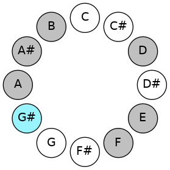
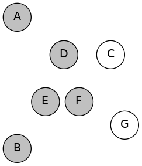
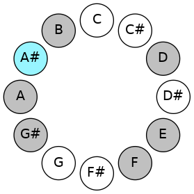
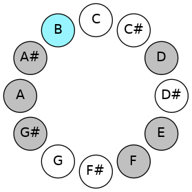
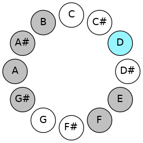
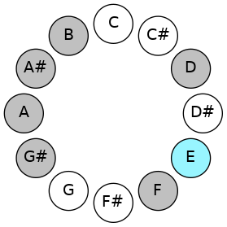
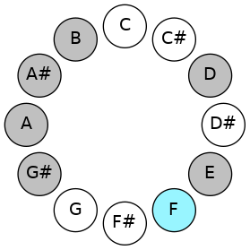

# Mode AFlatGanian

## Links

- [Documentation](README.md)
- [Scales Index](Scales.md)
- [Modes Index](Modes.md)
- [Chords Index](Chords.md)

## Scale

[Katocrian](ScaleKatocrian.md)

## Mode

[AFlatGanian](ModeAFlatGanian.md)

## Tonic

Ab

## Signature

[CNaturalMajor]

## Transposition

1, 1, 1, 3, 2, 1, 3

## Chord Pattern

i⁰b3, i⁰b3, III, III, v, VIb5, VIIb5

## Perfection

 - 4 Perfect Notes

 - 3 Imperfect Notes

## Notes

- Ab (Imperfect)
- Bbb
- Cbb
- Dbbb (Imperfect)
- Ebb
- Fb
- Gbb (Imperfect)
- Ab (Imperfect)

## Illustration

## Diagram

| Circle of Fifth | Chromatic Circle |
|-----------------|------------------|
|  |  |
## Relative Modes

| Number | Mode | Tonic | Notes | Illustration |
|--------|------|-------|-------|--------------|
| [847](https://ianring.com/musictheory/scales/847) | [Ganian](ModeGanian.md) | G# | G#, A, Bb, Cb, D, E, F, G# |  |
| [847](https://ianring.com/musictheory/scales/847) | [Ganian](ModeGanian.md) | Ab | Ab, Bbb, Cbb, Dbbb, Ebb, Fb, Gbb, Ab |  |
| [2471](https://ianring.com/musictheory/scales/2471) | [Eparian](ModeEparian.md) | A | A, Bb, Cb, D, E, F, G#, A |  |
| [3283](https://ianring.com/musictheory/scales/3283) | [Lyrian](ModeLyrian.md) | A# | A#, B, C##, D##, E#, F###, G##, A# |  |
| [3283](https://ianring.com/musictheory/scales/3283) | [Lyrian](ModeLyrian.md) | Bb | Bb, Cb, D, E, F, G#, A, Bb |  |
| [3689](https://ianring.com/musictheory/scales/3689) | [Katocrian](ModeKatocrian.md) | B | B, C##, D##, E#, F###, G##, A#, B |  |
| [973](https://ianring.com/musictheory/scales/973) | [Phryptian](ModePhryptian.md) | D | D, E, F, G#, A, Bb, Cb, D |  |
| [1267](https://ianring.com/musictheory/scales/1267) | [Katynian](ModeKatynian.md) | E | E, F, G#, A, Bb, Cb, D, E |  |
| [2681](https://ianring.com/musictheory/scales/2681) | [Aerycrian](ModeAerycrian.md) | F | F, G#, A, Bb, Cb, D, E, F |  |
## Relative Brightness

| Number | Mode | Tonic | Notes | Circle Of Fifth | Chromatic Circle |
|--------|------|-------|-------|-----------------|------------------|
| [847](https://ianring.com/musictheory/scales/847) | [Ganian](ModeGanian.md) | G# | G#, A, Bb, Cb, D, E, F, G# |  |  
| [847](https://ianring.com/musictheory/scales/847) | [Ganian](ModeGanian.md) | Ab | Ab, Bbb, Cbb, Dbbb, Ebb, Fb, Gbb, Ab |  |  
| [2471](https://ianring.com/musictheory/scales/2471) | [Eparian](ModeEparian.md) | A | A, Bb, Cb, D, E, F, G#, A |  |  
| [3283](https://ianring.com/musictheory/scales/3283) | [Lyrian](ModeLyrian.md) | A# | A#, B, C##, D##, E#, F###, G##, A# |  |  
| [3283](https://ianring.com/musictheory/scales/3283) | [Lyrian](ModeLyrian.md) | Bb | Bb, Cb, D, E, F, G#, A, Bb |  |  
| [3689](https://ianring.com/musictheory/scales/3689) | [Katocrian](ModeKatocrian.md) | B | B, C##, D##, E#, F###, G##, A#, B |  |  
| [973](https://ianring.com/musictheory/scales/973) | [Phryptian](ModePhryptian.md) | D | D, E, F, G#, A, Bb, Cb, D |  |  
| [1267](https://ianring.com/musictheory/scales/1267) | [Katynian](ModeKatynian.md) | E | E, F, G#, A, Bb, Cb, D, E |  |  
| [2681](https://ianring.com/musictheory/scales/2681) | [Aerycrian](ModeAerycrian.md) | F | F, G#, A, Bb, Cb, D, E, F |  |  

## Chords

### Ab

| Number | Root | Name | Notes | Illustration | Audio |
|--------|------|------|-------|--------------|-------|
| 772 | Ab | [G#loc](ChordGSharpLocrian.md) | G#, A, D |  | [midi](ChordGSharpLocrianRootPosition.mid) |
| 772 | Ab | [Abloc](ChordAFlatLocrian.md) | Ab, Bbb, Ebb |  | [midi](ChordAFlatLocrianRootPosition.mid) |
| 1284 | Ab | [G#](ChordGSharpDiminishedFlatThird.md) | G#, Bb, D |  | [midi](ChordGSharpDiminishedFlatThirdRootPosition.mid) |
| 1284 | Ab | [G#sus2b5](ChordGSharpSuspendedSecondFlatFifth.md) | G#, A#, D |  | [midi](ChordGSharpSuspendedSecondFlatFifthRootPosition.mid) |
| 1284 | Ab | [Ab](ChordAFlatDiminishedFlatThird.md) | Ab, Cbb, Ebb |  | [midi](ChordAFlatDiminishedFlatThirdRootPosition.mid) |
| 1284 | Ab | [Absus2b5](ChordAFlatSuspendedSecondFlatFifth.md) | Ab, Bb, Ebb |  | [midi](ChordAFlatSuspendedSecondFlatFifthRootPosition.mid) |
| 2308 | Ab | [G#o](ChordGSharpDiminished.md) | G#, B, D |  | [midi](ChordGSharpDiminishedRootPosition.mid) |
| 2308 | Ab | [Abo](ChordAFlatDiminished.md) | Ab, Cb, Ebb |  | [midi](ChordAFlatDiminishedRootPosition.mid) |
| 1296 | Ab | [G#sus2#5](ChordGSharpSuspendedSecondSharpFifth.md) | G#, A#, D## |  | [midi](ChordGSharpSuspendedSecondSharpFifthRootPosition.mid) |
| 1296 | Ab | [Absus2#5](ChordAFlatSuspendedSecondSharpFifth.md) | Ab, Bb, E |  | [midi](ChordAFlatSuspendedSecondSharpFifthRootPosition.mid) |
| 2320 | Ab | [G#m#5](ChordGSharpMinorSharpFifth.md) | G#, B, E |  | [midi](ChordGSharpMinorSharpFifthRootPosition.mid) |
| 2320 | Ab | [Abm#5](ChordAFlatMinorSharpFifth.md) | Ab, Cb, Fb |  | [midi](ChordAFlatMinorSharpFifthRootPosition.mid) |
| 1300 | Ab | [G#sus2b5add(#5)](ChordGSharpSuspendedSecondFlatFifthAddSharpFifth.md) | G#, A#, D, D## |  | [midi](ChordGSharpSuspendedSecondFlatFifthAddSharpFifthRootPosition.mid) |
| 1300 | Ab | [Absus2b5add(#5)](ChordAFlatSuspendedSecondFlatFifthAddSharpFifth.md) | Ab, Bb, Ebb, E |  | [midi](ChordAFlatSuspendedSecondFlatFifthAddSharpFifthRootPosition.mid) |
| 1316 | Ab | [G#M6sus2b5](ChordGSharpMajorSixthSuspendedSecondFlatFifth.md) | G#, A#, D, E# |  | [midi](ChordGSharpMajorSixthSuspendedSecondFlatFifthRootPosition.mid) |
| 1316 | Ab | [AbM6sus2b5](ChordAFlatMajorSixthSuspendedSecondFlatFifth.md) | Ab, Bb, Ebb, F |  | [midi](ChordAFlatMajorSixthSuspendedSecondFlatFifthRootPosition.mid) |
| 2340 | Ab | [G#o7](ChordGSharpFullDiminishedSeventh.md) | G#, B, D, F |  | [midi](ChordGSharpFullDiminishedSeventhRootPosition.mid) |
| 2340 | Ab | [Abo7](ChordAFlatFullDiminishedSeventh.md) | Ab, Cb, Ebb, Gbb |  | [midi](ChordAFlatFullDiminishedSeventhRootPosition.mid) |

### Bbb

| Number | Root | Name | Notes | Illustration | Audio |
|--------|------|------|-------|--------------|-------|
| 2564 | Bbb | [Asus2bb5](ChordANaturalSuspendedSecondDoubleFlatFifth.md) | A, B, D |  | [midi](ChordANaturalSuspendedSecondDoubleFlatFifthRootPosition.mid) |
| 528 | Bbb | [A5](ChordANaturalPowerChord.md) | A, E |  | [midi](ChordANaturalPowerChordRootPosition.mid) |
| 1552 | Bbb | [Aphryg](ChordANaturalPhrygian.md) | A, Bb, E |  | [midi](ChordANaturalPhrygianRootPosition.mid) |
| 2576 | Bbb | [Asus2](ChordANaturalSuspendedSecond.md) | A, B, E |  | [midi](ChordANaturalSuspendedSecondRootPosition.mid) |
| 532 | Bbb | [Asus4](ChordANaturalSuspendedFourth.md) | A, D, E |  | [midi](ChordANaturalSuspendedFourthRootPosition.mid) |
| 2592 | Bbb | [Asus2#5](ChordANaturalSuspendedSecondSharpFifth.md) | A, B, E# |  | [midi](ChordANaturalSuspendedSecondSharpFifthRootPosition.mid) |
| 548 | Bbb | [Asus4#5](ChordANaturalSuspendedFourthSharpFifth.md) | A, D, E# |  | [midi](ChordANaturalSuspendedFourthSharpFifthRootPosition.mid) |
| 772 | Bbb | [AQ+](ChordANaturalQuartalAugmented.md) | A, D, G# |  | [midi](ChordANaturalQuartalAugmentedRootPosition.mid) |
| 1808 | Bbb | [Aphryg+7](ChordANaturalPhrygianAddSeventh.md) | A, Bb, E, G# |  | [midi](ChordANaturalPhrygianAddSeventhRootPosition.mid) |
| 2832 | Bbb | [AM7(sus2)](ChordANaturalMajorSeventhSuspendedSecond.md) | A, B, E, G# |  | [midi](ChordANaturalMajorSeventhSuspendedSecondRootPosition.mid) |
| 2832 | Bbb | [AM9sus2](ChordANaturalMajorNinthSuspendedSecond.md) | A, B, E, G#, B |  | [midi](ChordANaturalMajorNinthSuspendedSecondRootPosition.mid) |
| 788 | Bbb | [AM7(sus4)](ChordANaturalMajorSeventhSuspendedFourth.md) | A, D, E, G# |  | [midi](ChordANaturalMajorSeventhSuspendedFourthRootPosition.mid) |
| 2836 | Bbb | [AM9sus4](ChordANaturalMajorNinthSuspendedFourth.md) | A, D, E, G#, B |  | [midi](ChordANaturalMajorNinthSuspendedFourthRootPosition.mid) |
| 804 | Bbb | [AM7(sus4)#5](ChordANaturalMajorSeventhSuspendedFourthSharpFifth.md) | A, D, E#, G# |  | [midi](ChordANaturalMajorSeventhSuspendedFourthSharpFifthRootPosition.mid) |

### Cbb

| Number | Root | Name | Notes | Illustration | Audio |
|--------|------|------|-------|--------------|-------|
| 3088 | Cbb | [A#loc](ChordASharpLocrian.md) | A#, B, E |  | [midi](ChordASharpLocrianRootPosition.mid) |
| 3088 | Cbb | [Bbloc](ChordBFlatLocrian.md) | Bb, Cb, Fb |  | [midi](ChordBFlatLocrianRootPosition.mid) |
| 1044 | Cbb | [A#Mb5](ChordASharpMajorFlatFifth.md) | A#, C##, E |  | [midi](ChordASharpMajorFlatFifthRootPosition.mid) |
| 1044 | Cbb | [BbMb5](ChordBFlatMajorFlatFifth.md) | Bb, D, Fb |  | [midi](ChordBFlatMajorFlatFifthRootPosition.mid) |
| 1056 | Cbb | [A#5](ChordASharpPowerChord.md) | A#, E# |  | [midi](ChordASharpPowerChordRootPosition.mid) |
| 1056 | Cbb | [Bb5](ChordBFlatPowerChord.md) | Bb, F |  | [midi](ChordBFlatPowerChordRootPosition.mid) |
| 3104 | Cbb | [A#phryg](ChordASharpPhrygian.md) | A#, B, E# |  | [midi](ChordASharpPhrygianRootPosition.mid) |
| 3104 | Cbb | [Bbphryg](ChordBFlatPhrygian.md) | Bb, Cb, F |  | [midi](ChordBFlatPhrygianRootPosition.mid) |
| 1060 | Cbb | [A#M](ChordASharpMajor.md) | A#, C##, E# |  | [midi](ChordASharpMajorRootPosition.mid) |
| 1060 | Cbb | [BbM](ChordBFlatMajor.md) | Bb, D, F |  | [midi](ChordBFlatMajorRootPosition.mid) |
| 1072 | Cbb | [A#lyd](ChordASharpLydian.md) | A#, D##, E# |  | [midi](ChordASharpLydianRootPosition.mid) |
| 1072 | Cbb | [Bblyd](ChordBFlatLydian.md) | Bb, E, F |  | [midi](ChordBFlatLydianRootPosition.mid) |
| 1076 | Cbb | [A#M(add(#4))](ChordASharpMajorAddSharpFourth.md) | A#, C##, D##, E# |  | [midi](ChordASharpMajorAddSharpFourthRootPosition.mid) |
| 1076 | Cbb | [BbM(add(#4))](ChordBFlatMajorAddSharpFourth.md) | Bb, D, E, F |  | [midi](ChordBFlatMajorAddSharpFourthRootPosition.mid) |
| 1300 | Cbb | [A#7b5](ChordASharpDominantSeventhFlatFifth.md) | A#, C##, E, G# |  | [midi](ChordASharpDominantSeventhFlatFifthRootPosition.mid) |
| 1300 | Cbb | [Bb7b5](ChordBFlatDominantSeventhFlatFifth.md) | Bb, D, Fb, Ab |  | [midi](ChordBFlatDominantSeventhFlatFifthRootPosition.mid) |
| 3348 | Cbb | [A#7b5b9](ChordASharpDominantSeventhFlatFifthFlatNinth.md) | A#, C##, E, G#, B |  | [midi](ChordASharpDominantSeventhFlatFifthFlatNinthRootPosition.mid) |
| 3348 | Cbb | [Bb7b5b9](ChordBFlatDominantSeventhFlatFifthFlatNinth.md) | Bb, D, Fb, Ab, Cb |  | [midi](ChordBFlatDominantSeventhFlatFifthFlatNinthRootPosition.mid) |
| 1316 | Cbb | [A#7](ChordASharpDominantSeventh.md) | A#, C##, E#, G# |  | [midi](ChordASharpDominantSeventhRootPosition.mid) |
| 1316 | Cbb | [Bb7](ChordBFlatDominantSeventh.md) | Bb, D, F, Ab |  | [midi](ChordBFlatDominantSeventhRootPosition.mid) |
| 3364 | Cbb | [A#7b9](ChordASharpDominantSeventhFlatNinth.md) | A#, C##, E#, G#, B |  | [midi](ChordASharpDominantSeventhFlatNinthRootPosition.mid) |
| 3364 | Cbb | [Bb7b9](ChordBFlatDominantSeventhFlatNinth.md) | Bb, D, F, Ab, Cb |  | [midi](ChordBFlatDominantSeventhFlatNinthRootPosition.mid) |
| 1332 | Cbb | [A#7add(#4)](ChordASharpDominantSeventhAddSharpFourth.md) | A#, C##, D##, E#, G# |  | [midi](ChordASharpDominantSeventhAddSharpFourthRootPosition.mid) |
| 1332 | Cbb | [A#7#11](ChordASharpDominantSeventhSharpEleventh.md) | A#, C##, E#, G#, D## |  | [midi](ChordASharpDominantSeventhSharpEleventhRootPosition.mid) |
| 1332 | Cbb | [Bb7add(#4)](ChordBFlatDominantSeventhAddSharpFourth.md) | Bb, D, E, F, Ab |  | [midi](ChordBFlatDominantSeventhAddSharpFourthRootPosition.mid) |
| 1332 | Cbb | [Bb7#11](ChordBFlatDominantSeventhSharpEleventh.md) | Bb, D, F, Ab, E |  | [midi](ChordBFlatDominantSeventhSharpEleventhRootPosition.mid) |
| 1556 | Cbb | [A#M7b5](ChordASharpMajorSeventhFlatFifth.md) | A#, C##, E, G## |  | [midi](ChordASharpMajorSeventhFlatFifthRootPosition.mid) |
| 1556 | Cbb | [BbM7b5](ChordBFlatMajorSeventhFlatFifth.md) | Bb, D, Fb, A |  | [midi](ChordBFlatMajorSeventhFlatFifthRootPosition.mid) |
| 3616 | Cbb | [A#phryg+7](ChordASharpPhrygianAddSeventh.md) | A#, B, E#, G## |  | [midi](ChordASharpPhrygianAddSeventhRootPosition.mid) |
| 3616 | Cbb | [Bbphryg+7](ChordBFlatPhrygianAddSeventh.md) | Bb, Cb, F, A |  | [midi](ChordBFlatPhrygianAddSeventhRootPosition.mid) |
| 1572 | Cbb | [A#M7](ChordASharpMajorSeventh.md) | A#, C##, E#, G## |  | [midi](ChordASharpMajorSeventhRootPosition.mid) |
| 1572 | Cbb | [BbM7](ChordBFlatMajorSeventh.md) | Bb, D, F, A |  | [midi](ChordBFlatMajorSeventhRootPosition.mid) |
| 1584 | Cbb | [A#lyd(M7)](ChordASharpLydianMajorSeventh.md) | A#, D##, E#, G## |  | [midi](ChordASharpLydianMajorSeventhRootPosition.mid) |
| 1584 | Cbb | [Bblyd(M7)](ChordBFlatLydianMajorSeventh.md) | Bb, E, F, A |  | [midi](ChordBFlatLydianMajorSeventhRootPosition.mid) |
| 1588 | Cbb | [A#M7add(#11)](ChordASharpMajorSeventhAddSharpEleventh.md) | A#, C##, E#, G##, D## |  | [midi](ChordASharpMajorSeventhAddSharpEleventhRootPosition.mid) |
| 1588 | Cbb | [A#M7add(#4)](ChordASharpMajorSeventhAddSharpFourth.md) | A#, C##, D##, E#, G## |  | [midi](ChordASharpMajorSeventhAddSharpFourthRootPosition.mid) |
| 1588 | Cbb | [BbM7add(#11)](ChordBFlatMajorSeventhAddSharpEleventh.md) | Bb, D, F, A, E |  | [midi](ChordBFlatMajorSeventhAddSharpEleventhRootPosition.mid) |
| 1588 | Cbb | [BbM7add(#4)](ChordBFlatMajorSeventhAddSharpFourth.md) | Bb, D, E, F, A |  | [midi](ChordBFlatMajorSeventhAddSharpFourthRootPosition.mid) |

### Dbbb

| Number | Root | Name | Notes | Illustration | Audio |
|--------|------|------|-------|--------------|-------|
| 2068 | Dbbb | [Bmbb5](ChordBNaturalMinorDoubleFlatFifth.md) | B, D, E |  | [midi](ChordBNaturalMinorDoubleFlatFifthRootPosition.mid) |
| 2084 | Dbbb | [Bo](ChordBNaturalDiminished.md) | B, D, F |  | [midi](ChordBNaturalDiminishedRootPosition.mid) |
| 2096 | Dbbb | [Bsus4b5](ChordBNaturalSuspendedFourthFlatFifth.md) | B, E, F |  | [midi](ChordBNaturalSuspendedFourthFlatFifthRootPosition.mid) |
| 2320 | Dbbb | [Bsus4##5](ChordBNaturalSuspendedFourthDoubleSharpFifth.md) | B, E, G# |  | [midi](ChordBNaturalSuspendedFourthDoubleSharpFifthRootPosition.mid) |
| 2340 | Dbbb | [Bo7](ChordBNaturalFullDiminishedSeventh.md) | B, D, F, Ab |  | [midi](ChordBNaturalFullDiminishedSeventhRootPosition.mid) |
| 2576 | Dbbb | [BQ](ChordBNaturalQuartal.md) | B, E, A |  | [midi](ChordBNaturalQuartalRootPosition.mid) |
| 2580 | Dbbb | [Bm7bb5](ChordBNaturalMinorSeventhDoubleFlatFifth.md) | B, D, E, A |  | [midi](ChordBNaturalMinorSeventhDoubleFlatFifthRootPosition.mid) |
| 2596 | Dbbb | [Bø7](ChordBNaturalHalfDiminishedSeventh.md) | B, D, F, A |  | [midi](ChordBNaturalHalfDiminishedSeventhRootPosition.mid) |
| 3088 | Dbbb | [BQ+](ChordBNaturalQuartalAugmented.md) | B, E, A# |  | [midi](ChordBNaturalQuartalAugmentedRootPosition.mid) |
| 3108 | Dbbb | [BoM7](ChordBNaturalDiminishedMajorSeventh.md) | B, D, F, A# |  | [midi](ChordBNaturalDiminishedMajorSeventhRootPosition.mid) |
| 3344 | Dbbb | [BM7(sus4)##5](ChordBNaturalMajorSeventhSuspendedFourthDoubleSharpFifth.md) | B, E, G#, A# |  | [midi](ChordBNaturalMajorSeventhSuspendedFourthDoubleSharpFifthRootPosition.mid) |

### Ebb

| Number | Root | Name | Notes | Illustration | Audio |
|--------|------|------|-------|--------------|-------|
| 276 | Ebb | [D](ChordDNaturalDiminishedFlatThird.md) | D, Fb, Ab |  | [midi](ChordDNaturalDiminishedFlatThirdRootPosition.mid) |
| 276 | Ebb | [Dsus2b5](ChordDNaturalSuspendedSecondFlatFifth.md) | D, E, Ab |  | [midi](ChordDNaturalSuspendedSecondFlatFifthRootPosition.mid) |
| 292 | Ebb | [Do](ChordDNaturalDiminished.md) | D, F, Ab |  | [midi](ChordDNaturalDiminishedRootPosition.mid) |
| 516 | Ebb | [D5](ChordDNaturalPowerChord.md) | D, A |  | [midi](ChordDNaturalPowerChordRootPosition.mid) |
| 532 | Ebb | [Dsus2](ChordDNaturalSuspendedSecond.md) | D, E, A |  | [midi](ChordDNaturalSuspendedSecondRootPosition.mid) |
| 548 | Ebb | [Dm](ChordDNaturalMinor.md) | D, F, A |  | [midi](ChordDNaturalMinorRootPosition.mid) |
| 548 | Ebb | [Dm(add(#9))](ChordDNaturalMinorAddSharpNinth.md) | D, F, A, E# |  | [midi](ChordDNaturalMinorAddSharpNinthRootPosition.mid) |
| 564 | Ebb | [Dm(add9)](ChordDNaturalMinorAddNinth.md) | D, F, A, E |  | [midi](ChordDNaturalMinorAddNinthRootPosition.mid) |
| 772 | Ebb | [Dlyd](ChordDNaturalLydian.md) | D, G#, A |  | [midi](ChordDNaturalLydianRootPosition.mid) |
| 804 | Ebb | [Dm(add(#4))](ChordDNaturalMinorAddSharpFourth.md) | D, F, G#, A |  | [midi](ChordDNaturalMinorAddSharpFourthRootPosition.mid) |
| 1044 | Ebb | [Dsus2#5](ChordDNaturalSuspendedSecondSharpFifth.md) | D, E, A# |  | [midi](ChordDNaturalSuspendedSecondSharpFifthRootPosition.mid) |
| 1060 | Ebb | [Dm#5](ChordDNaturalMinorSharpFifth.md) | D, F, Bb |  | [midi](ChordDNaturalMinorSharpFifthRootPosition.mid) |
| 1300 | Ebb | [Dsus2b5add(#5)](ChordDNaturalSuspendedSecondFlatFifthAddSharpFifth.md) | D, E, Ab, A# |  | [midi](ChordDNaturalSuspendedSecondFlatFifthAddSharpFifthRootPosition.mid) |
| 2324 | Ebb | [DM6sus2b5](ChordDNaturalMajorSixthSuspendedSecondFlatFifth.md) | D, E, Ab, B |  | [midi](ChordDNaturalMajorSixthSuspendedSecondFlatFifthRootPosition.mid) |
| 2340 | Ebb | [Do7](ChordDNaturalFullDiminishedSeventh.md) | D, F, Ab, Cb |  | [midi](ChordDNaturalFullDiminishedSeventhRootPosition.mid) |
| 2580 | Ebb | [DM6sus2](ChordDNaturalMajorSixthSuspendedSecond.md) | D, E, A, B |  | [midi](ChordDNaturalMajorSixthSuspendedSecondRootPosition.mid) |
| 2580 | Ebb | [D7sus2b5](ChordDNaturalDominantSeventhSuspendedSecondFlatFifth.md) | D, E, A, Cb |  | [midi](ChordDNaturalDominantSeventhSuspendedSecondFlatFifthRootPosition.mid) |
| 2596 | Ebb | [Dm6](ChordDNaturalMinorSixth.md) | D, F, A, B |  | [midi](ChordDNaturalMinorSixthRootPosition.mid) |
| 2612 | Ebb | [Dm6(add9)](ChordDNaturalMinorSixthAddNinth.md) | D, F, A, B, E |  | [midi](ChordDNaturalMinorSixthAddNinthRootPosition.mid) |

### Fb

| Number | Root | Name | Notes | Illustration | Audio |
|--------|------|------|-------|--------------|-------|
| 1072 | Fb | [Eloc](ChordENaturalLocrian.md) | E, F, Bb |  | [midi](ChordENaturalLocrianRootPosition.mid) |
| 1296 | Fb | [EMb5](ChordENaturalMajorFlatFifth.md) | E, G#, Bb |  | [midi](ChordENaturalMajorFlatFifthRootPosition.mid) |
| 1552 | Fb | [Esus4b5](ChordENaturalSuspendedFourthFlatFifth.md) | E, A, Bb |  | [midi](ChordENaturalSuspendedFourthFlatFifthRootPosition.mid) |
| 2064 | Fb | [E5](ChordENaturalPowerChord.md) | E, B |  | [midi](ChordENaturalPowerChordRootPosition.mid) |
| 2096 | Fb | [Ephryg](ChordENaturalPhrygian.md) | E, F, B |  | [midi](ChordENaturalPhrygianRootPosition.mid) |
| 2320 | Fb | [EM](ChordENaturalMajor.md) | E, G#, B |  | [midi](ChordENaturalMajorRootPosition.mid) |
| 2576 | Fb | [Esus4](ChordENaturalSuspendedFourth.md) | E, A, B |  | [midi](ChordENaturalSuspendedFourthRootPosition.mid) |
| 2832 | Fb | [EM(add11)](ChordENaturalMajorAddEleventh.md) | E, G#, B, A |  | [midi](ChordENaturalMajorAddEleventhRootPosition.mid) |
| 2832 | Fb | [EM(add4)](ChordENaturalMajorAddFourth.md) | E, G#, A, B |  | [midi](ChordENaturalMajorAddFourthRootPosition.mid) |
| 3088 | Fb | [Elyd](ChordENaturalLydian.md) | E, A#, B |  | [midi](ChordENaturalLydianRootPosition.mid) |
| 3344 | Fb | [EM(add(#4))](ChordENaturalMajorAddSharpFourth.md) | E, G#, A#, B |  | [midi](ChordENaturalMajorAddSharpFourthRootPosition.mid) |
| 532 | Fb | [EQ](ChordENaturalQuartal.md) | E, A, D |  | [midi](ChordENaturalQuartalRootPosition.mid) |
| 1300 | Fb | [E7b5](ChordENaturalDominantSeventhFlatFifth.md) | E, G#, Bb, D |  | [midi](ChordENaturalDominantSeventhFlatFifthRootPosition.mid) |
| 1332 | Fb | [E7b5b9](ChordENaturalDominantSeventhFlatFifthFlatNinth.md) | E, G#, Bb, D, F |  | [midi](ChordENaturalDominantSeventhFlatFifthFlatNinthRootPosition.mid) |
| 2324 | Fb | [E7](ChordENaturalDominantSeventh.md) | E, G#, B, D |  | [midi](ChordENaturalDominantSeventhRootPosition.mid) |
| 2356 | Fb | [E7b9](ChordENaturalDominantSeventhFlatNinth.md) | E, G#, B, D, F |  | [midi](ChordENaturalDominantSeventhFlatNinthRootPosition.mid) |
| 2580 | Fb | [E7sus4](ChordENaturalDominantSeventhSuspendedFourth.md) | E, A, B, D |  | [midi](ChordENaturalDominantSeventhSuspendedFourthRootPosition.mid) |
| 2836 | Fb | [E7add4](ChordENaturalDominantSeventhAddFourth.md) | E, G#, A, B, D |  | [midi](ChordENaturalDominantSeventhAddFourthRootPosition.mid) |
| 2836 | Fb | [E7add11](ChordENaturalDominantSeventhAddEleventh.md) | E, G#, B, D, A |  | [midi](ChordENaturalDominantSeventhAddEleventhRootPosition.mid) |
| 3348 | Fb | [E7add(#4)](ChordENaturalDominantSeventhAddSharpFourth.md) | E, G#, A#, B, D |  | [midi](ChordENaturalDominantSeventhAddSharpFourthRootPosition.mid) |
| 3348 | Fb | [E7#11](ChordENaturalDominantSeventhSharpEleventh.md) | E, G#, B, D, A# |  | [midi](ChordENaturalDominantSeventhSharpEleventhRootPosition.mid) |

### Gbb

| Number | Root | Name | Notes | Illustration | Audio |
|--------|------|------|-------|--------------|-------|
| 1312 | Gbb | [Fmbb5](ChordFNaturalMinorDoubleFlatFifth.md) | F, Ab, Bb |  | [midi](ChordFNaturalMinorDoubleFlatFifthRootPosition.mid) |
| 2336 | Gbb | [Fo](ChordFNaturalDiminished.md) | F, Ab, Cb |  | [midi](ChordFNaturalDiminishedRootPosition.mid) |
| 2592 | Gbb | [FMb5](ChordFNaturalMajorFlatFifth.md) | F, A, Cb |  | [midi](ChordFNaturalMajorFlatFifthRootPosition.mid) |
| 3104 | Gbb | [Fsus4b5](ChordFNaturalSuspendedFourthFlatFifth.md) | F, Bb, Cb |  | [midi](ChordFNaturalSuspendedFourthFlatFifthRootPosition.mid) |
| 548 | Gbb | [FM##5](ChordFNaturalMajorDoubleSharpFifth.md) | F, A, D |  | [midi](ChordFNaturalMajorDoubleSharpFifthRootPosition.mid) |
| 1060 | Gbb | [Fsus4##5](ChordFNaturalSuspendedFourthDoubleSharpFifth.md) | F, Bb, D |  | [midi](ChordFNaturalSuspendedFourthDoubleSharpFifthRootPosition.mid) |
| 2340 | Gbb | [Fo7](ChordFNaturalFullDiminishedSeventh.md) | F, Ab, Cb, Ebb |  | [midi](ChordFNaturalFullDiminishedSeventhRootPosition.mid) |
| 2596 | Gbb | [FM6b5](ChordFNaturalMajorSixthFlatFifth.md) | F, A, Cb, D |  | [midi](ChordFNaturalMajorSixthFlatFifthRootPosition.mid) |
| 1072 | Gbb | [FQ+](ChordFNaturalQuartalAugmented.md) | F, Bb, E |  | [midi](ChordFNaturalQuartalAugmentedRootPosition.mid) |
| 2352 | Gbb | [FoM7](ChordFNaturalDiminishedMajorSeventh.md) | F, Ab, Cb, E |  | [midi](ChordFNaturalDiminishedMajorSeventhRootPosition.mid) |
| 2608 | Gbb | [FM7b5](ChordFNaturalMajorSeventhFlatFifth.md) | F, A, Cb, E |  | [midi](ChordFNaturalMajorSeventhFlatFifthRootPosition.mid) |
| 564 | Gbb | [FM7##5](ChordFNaturalMajorSeventhDoubleSharpFifth.md) | F, A, D, E |  | [midi](ChordFNaturalMajorSeventhDoubleSharpFifthRootPosition.mid) |
| 1076 | Gbb | [FM7(sus4)##5](ChordFNaturalMajorSeventhSuspendedFourthDoubleSharpFifth.md) | F, Bb, D, E |  | [midi](ChordFNaturalMajorSeventhSuspendedFourthDoubleSharpFifthRootPosition.mid) |

