# Mode AFlatGathian

## Links

- [Documentation](README.md)
- [Scales Index](Scales.md)
- [Modes Index](Modes.md)
- [Chords Index](Chords.md)

## Scale

[Epogian](ScaleEpogian.md)

## Mode

[AFlatGathian](ModeAFlatGathian.md)

## Tonic

Ab

## Signature

[CNaturalMajor]

## Transposition

1, 1, 2, 3, 1, 1, 3

## Chord Pattern

ii, IV⁺, v⁰b3, VIb5, VII

## Perfection

 - 5 Perfect Notes

 - 2 Imperfect Notes

## Notes

- Ab
- Bbb
- Cbb
- Dbb (Imperfect)
- Eb
- Fb (Imperfect)
- Gbb
- Ab

## Illustration

## Diagram

| Circle of Fifth | Chromatic Circle |
|-----------------|------------------|
| 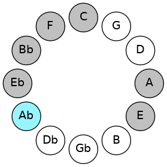 | 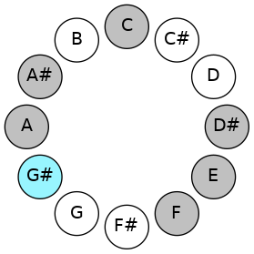 |
## Relative Modes

| Number | Mode | Tonic | Notes | Illustration |
|--------|------|-------|-------|--------------|
| [919](https://ianring.com/musictheory/scales/919) | [Gathian](ModeGathian.md) | G# | G#, A, Bb, C, D#, E, F, G# |  |
| [919](https://ianring.com/musictheory/scales/919) | [Gathian](ModeGathian.md) | Ab | Ab, Bbb, Cbb, Dbb, Eb, Fb, Gbb, Ab |  |
| [2507](https://ianring.com/musictheory/scales/2507) | [Ionyphian](ModeIonyphian.md) | A | A, Bb, C, D#, E, F, G#, A |  |
| [3301](https://ianring.com/musictheory/scales/3301) | [Phrynian](ModePhrynian.md) | A# | A#, B#, C###, D##, E#, F###, G##, A# | 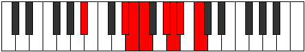 |
| [3301](https://ianring.com/musictheory/scales/3301) | [Phrynian](ModePhrynian.md) | Bb | Bb, C, D#, E, F, G#, A, Bb |  |
| [1849](https://ianring.com/musictheory/scales/1849) | [Epogian](ModeEpogian.md) | C | C, D#, E, F, G#, A, Bb, C |  |
| [743](https://ianring.com/musictheory/scales/743) | [Lanian](ModeLanian.md) | D# | D#, E, F, G#, A, Bb, C, D# |  |
| [743](https://ianring.com/musictheory/scales/743) | [Lanian](ModeLanian.md) | Eb | Eb, Fb, Gbb, Ab, Bbb, Cbb, Dbb, Eb |  |
| [2419](https://ianring.com/musictheory/scales/2419) | [Paptian](ModePaptian.md) | E | E, F, G#, A, Bb, C, D#, E |  |
| [3257](https://ianring.com/musictheory/scales/3257) | [Ionacrian](ModeIonacrian.md) | F | F, G#, A, Bb, C, D#, E, F |  |
## Relative Brightness

| Number | Mode | Tonic | Notes | Circle Of Fifth | Chromatic Circle |
|--------|------|-------|-------|-----------------|------------------|
| [919](https://ianring.com/musictheory/scales/919) | [Gathian](ModeGathian.md) | G# | G#, A, Bb, C, D#, E, F, G# |  |  |
| [919](https://ianring.com/musictheory/scales/919) | [Gathian](ModeGathian.md) | Ab | Ab, Bbb, Cbb, Dbb, Eb, Fb, Gbb, Ab |  |  |
| [2507](https://ianring.com/musictheory/scales/2507) | [Ionyphian](ModeIonyphian.md) | A | A, Bb, C, D#, E, F, G#, A | 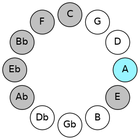 | 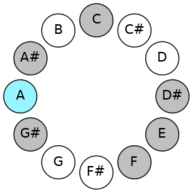 |
| [3301](https://ianring.com/musictheory/scales/3301) | [Phrynian](ModePhrynian.md) | A# | A#, B#, C###, D##, E#, F###, G##, A# |  |  |
| [3301](https://ianring.com/musictheory/scales/3301) | [Phrynian](ModePhrynian.md) | Bb | Bb, C, D#, E, F, G#, A, Bb | 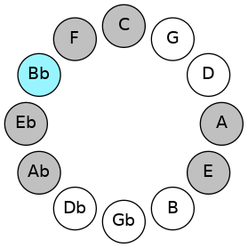 | 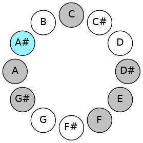 |
| [1849](https://ianring.com/musictheory/scales/1849) | [Epogian](ModeEpogian.md) | C | C, D#, E, F, G#, A, Bb, C | 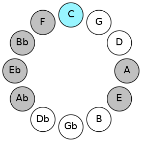 | 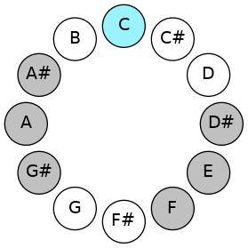 |
| [743](https://ianring.com/musictheory/scales/743) | [Lanian](ModeLanian.md) | D# | D#, E, F, G#, A, Bb, C, D# | 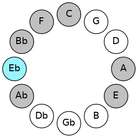 | 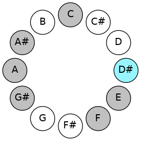 |
| [743](https://ianring.com/musictheory/scales/743) | [Lanian](ModeLanian.md) | Eb | Eb, Fb, Gbb, Ab, Bbb, Cbb, Dbb, Eb |  |  |
| [2419](https://ianring.com/musictheory/scales/2419) | [Paptian](ModePaptian.md) | E | E, F, G#, A, Bb, C, D#, E | 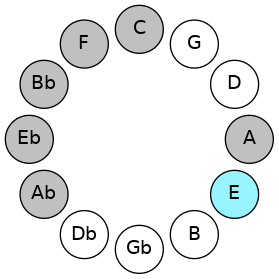 | 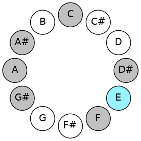 |
| [3257](https://ianring.com/musictheory/scales/3257) | [Ionacrian](ModeIonacrian.md) | F | F, G#, A, Bb, C, D#, E, F | 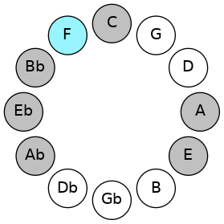 | 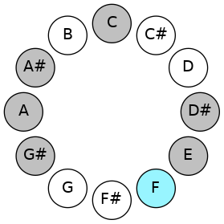 |

## Chords

### Ab

| Number | Root | Name | Notes | Illustration | Audio |
|--------|------|------|-------|--------------|-------|
| 264 | Ab | [G#5](ChordGSharpPowerChord.md) | G#, D# |  | [midi](ChordGSharpPowerChordRootPosition.mid) |
| 264 | Ab | [Ab5](ChordAFlatPowerChord.md) | Ab, Eb |  | [midi](ChordAFlatPowerChordRootPosition.mid) |
| 776 | Ab | [G#phryg](ChordGSharpPhrygian.md) | G#, A, D# |  | [midi](ChordGSharpPhrygianRootPosition.mid) |
| 776 | Ab | [Abphryg](ChordAFlatPhrygian.md) | Ab, Bbb, Eb |  | [midi](ChordAFlatPhrygianRootPosition.mid) |
| 1288 | Ab | [G#sus2](ChordGSharpSuspendedSecond.md) | G#, A#, D# |  | [midi](ChordGSharpSuspendedSecondRootPosition.mid) |
| 1288 | Ab | [Absus2](ChordAFlatSuspendedSecond.md) | Ab, Bb, Eb |  | [midi](ChordAFlatSuspendedSecondRootPosition.mid) |
| 265 | Ab | [G#M](ChordGSharpMajor.md) | G#, B#, D# |  | [midi](ChordGSharpMajorRootPosition.mid) |
| 265 | Ab | [AbM](ChordAFlatMajor.md) | Ab, C, Eb |  | [midi](ChordAFlatMajorRootPosition.mid) |
| 1289 | Ab | [G#M(add9)](ChordGSharpMajorAddNinth.md) | G#, B#, D#, A# |  | [midi](ChordGSharpMajorAddNinthRootPosition.mid) |
| 1289 | Ab | [AbM(add9)](ChordAFlatMajorAddNinth.md) | Ab, C, Eb, Bb |  | [midi](ChordAFlatMajorAddNinthRootPosition.mid) |
| 1296 | Ab | [G#sus2#5](ChordGSharpSuspendedSecondSharpFifth.md) | G#, A#, D## |  | [midi](ChordGSharpSuspendedSecondSharpFifthRootPosition.mid) |
| 1296 | Ab | [Absus2#5](ChordAFlatSuspendedSecondSharpFifth.md) | Ab, Bb, E |  | [midi](ChordAFlatSuspendedSecondSharpFifthRootPosition.mid) |
| 273 | Ab | [G#+](ChordGSharpAugmented.md) | G#, B#, D## |  | [midi](ChordGSharpAugmentedRootPosition.mid) |
| 273 | Ab | [G#+7](ChordGSharpAugmentedAugmentedSeventh.md) | G#, B#, D##, F### |  | [midi](ChordGSharpAugmentedAugmentedSeventhRootPosition.mid) |
| 273 | Ab | [Ab+](ChordAFlatAugmented.md) | Ab, C, E |  | [midi](ChordAFlatAugmentedRootPosition.mid) |
| 273 | Ab | [Ab+7](ChordAFlatAugmentedAugmentedSeventh.md) | Ab, C, E, G# |  | [midi](ChordAFlatAugmentedAugmentedSeventhRootPosition.mid) |
| 289 | Ab | [G#M##5](ChordGSharpMajorDoubleSharpFifth.md) | G#, B#, E# |  | [midi](ChordGSharpMajorDoubleSharpFifthRootPosition.mid) |
| 289 | Ab | [AbM##5](ChordAFlatMajorDoubleSharpFifth.md) | Ab, C, F |  | [midi](ChordAFlatMajorDoubleSharpFifthRootPosition.mid) |
| 1320 | Ab | [G#M6sus2](ChordGSharpMajorSixthSuspendedSecond.md) | G#, A#, D#, E# |  | [midi](ChordGSharpMajorSixthSuspendedSecondRootPosition.mid) |
| 1320 | Ab | [G#7sus2b5](ChordGSharpDominantSeventhSuspendedSecondFlatFifth.md) | G#, A#, D#, F |  | [midi](ChordGSharpDominantSeventhSuspendedSecondFlatFifthRootPosition.mid) |
| 1320 | Ab | [AbM6sus2](ChordAFlatMajorSixthSuspendedSecond.md) | Ab, Bb, Eb, F |  | [midi](ChordAFlatMajorSixthSuspendedSecondRootPosition.mid) |
| 1320 | Ab | [Ab7sus2b5](ChordAFlatDominantSeventhSuspendedSecondFlatFifth.md) | Ab, Bb, Eb, Gbb |  | [midi](ChordAFlatDominantSeventhSuspendedSecondFlatFifthRootPosition.mid) |
| 297 | Ab | [G#M6](ChordGSharpMajorSixth.md) | G#, B#, D#, E# |  | [midi](ChordGSharpMajorSixthRootPosition.mid) |
| 297 | Ab | [AbM6](ChordAFlatMajorSixth.md) | Ab, C, Eb, F |  | [midi](ChordAFlatMajorSixthRootPosition.mid) |
| 809 | Ab | [G#M6(addb9)](ChordGSharpMajorSixthAddFlatNinth.md) | G#, B#, D#, E#, A |  | [midi](ChordGSharpMajorSixthAddFlatNinthRootPosition.mid) |
| 809 | Ab | [AbM6(addb9)](ChordAFlatMajorSixthAddFlatNinth.md) | Ab, C, Eb, F, Bbb |  | [midi](ChordAFlatMajorSixthAddFlatNinthRootPosition.mid) |
| 1321 | Ab | [G#M6(add9)](ChordGSharpMajorSixthAddNinth.md) | G#, B#, D#, E#, A# |  | [midi](ChordGSharpMajorSixthAddNinthRootPosition.mid) |
| 1321 | Ab | [AbM6(add9)](ChordAFlatMajorSixthAddNinth.md) | Ab, C, Eb, F, Bb |  | [midi](ChordAFlatMajorSixthAddNinthRootPosition.mid) |

### Bbb

| Number | Root | Name | Notes | Illustration | Audio |
|--------|------|------|-------|--------------|-------|
| 1544 | Bbb | [Aloc](ChordANaturalLocrian.md) | A, Bb, Eb |  | [midi](ChordANaturalLocrianRootPosition.mid) |
| 521 | Bbb | [Ao](ChordANaturalDiminished.md) | A, C, Eb |  | [midi](ChordANaturalDiminishedRootPosition.mid) |
| 528 | Bbb | [A5](ChordANaturalPowerChord.md) | A, E |  | [midi](ChordANaturalPowerChordRootPosition.mid) |
| 1552 | Bbb | [Aphryg](ChordANaturalPhrygian.md) | A, Bb, E |  | [midi](ChordANaturalPhrygianRootPosition.mid) |
| 529 | Bbb | [Am](ChordANaturalMinor.md) | A, C, E |  | [midi](ChordANaturalMinorRootPosition.mid) |
| 529 | Bbb | [Am(add(#9))](ChordANaturalMinorAddSharpNinth.md) | A, C, E, B# |  | [midi](ChordANaturalMinorAddSharpNinthRootPosition.mid) |
| 536 | Bbb | [Alyd](ChordANaturalLydian.md) | A, D#, E |  | [midi](ChordANaturalLydianRootPosition.mid) |
| 537 | Bbb | [Am(add(#4))](ChordANaturalMinorAddSharpFourth.md) | A, C, D#, E |  | [midi](ChordANaturalMinorAddSharpFourthRootPosition.mid) |
| 545 | Bbb | [Am#5](ChordANaturalMinorSharpFifth.md) | A, C, F |  | [midi](ChordANaturalMinorSharpFifthRootPosition.mid) |
| 777 | Bbb | [AoM7](ChordANaturalDiminishedMajorSeventh.md) | A, C, Eb, G# |  | [midi](ChordANaturalDiminishedMajorSeventhRootPosition.mid) |
| 1808 | Bbb | [Aphryg+7](ChordANaturalPhrygianAddSeventh.md) | A, Bb, E, G# |  | [midi](ChordANaturalPhrygianAddSeventhRootPosition.mid) |
| 785 | Bbb | [Am(M7)](ChordANaturalMinorMajorSeventh.md) | A, C, E, G# |  | [midi](ChordANaturalMinorMajorSeventhRootPosition.mid) |
| 792 | Bbb | [Alyd(M7)](ChordANaturalLydianMajorSeventh.md) | A, D#, E, G# |  | [midi](ChordANaturalLydianMajorSeventhRootPosition.mid) |

### Cbb

| Number | Root | Name | Notes | Illustration | Audio |
|--------|------|------|-------|--------------|-------|
| 1033 | Cbb | [A#sus2bb5](ChordASharpSuspendedSecondDoubleFlatFifth.md) | A#, B#, D# |  | [midi](ChordASharpSuspendedSecondDoubleFlatFifthRootPosition.mid) |
| 1033 | Cbb | [Bbsus2bb5](ChordBFlatSuspendedSecondDoubleFlatFifth.md) | Bb, C, Eb |  | [midi](ChordBFlatSuspendedSecondDoubleFlatFifthRootPosition.mid) |
| 1041 | Cbb | [A#](ChordASharpDiminishedFlatThird.md) | A#, C, E |  | [midi](ChordASharpDiminishedFlatThirdRootPosition.mid) |
| 1041 | Cbb | [A#sus2b5](ChordASharpSuspendedSecondFlatFifth.md) | A#, B#, E |  | [midi](ChordASharpSuspendedSecondFlatFifthRootPosition.mid) |
| 1041 | Cbb | [Bb](ChordBFlatDiminishedFlatThird.md) | Bb, Dbb, Fb |  | [midi](ChordBFlatDiminishedFlatThirdRootPosition.mid) |
| 1041 | Cbb | [Bbsus2b5](ChordBFlatSuspendedSecondFlatFifth.md) | Bb, C, Fb |  | [midi](ChordBFlatSuspendedSecondFlatFifthRootPosition.mid) |
| 1048 | Cbb | [A#sus4b5](ChordASharpSuspendedFourthFlatFifth.md) | A#, D#, E |  | [midi](ChordASharpSuspendedFourthFlatFifthRootPosition.mid) |
| 1048 | Cbb | [Bbsus4b5](ChordBFlatSuspendedFourthFlatFifth.md) | Bb, Eb, Fb |  | [midi](ChordBFlatSuspendedFourthFlatFifthRootPosition.mid) |
| 1056 | Cbb | [A#5](ChordASharpPowerChord.md) | A#, E# |  | [midi](ChordASharpPowerChordRootPosition.mid) |
| 1056 | Cbb | [Bb5](ChordBFlatPowerChord.md) | Bb, F |  | [midi](ChordBFlatPowerChordRootPosition.mid) |
| 1057 | Cbb | [A#sus2](ChordASharpSuspendedSecond.md) | A#, B#, E# |  | [midi](ChordASharpSuspendedSecondRootPosition.mid) |
| 1057 | Cbb | [Bbsus2](ChordBFlatSuspendedSecond.md) | Bb, C, F |  | [midi](ChordBFlatSuspendedSecondRootPosition.mid) |
| 1064 | Cbb | [A#sus4](ChordASharpSuspendedFourth.md) | A#, D#, E# |  | [midi](ChordASharpSuspendedFourthRootPosition.mid) |
| 1064 | Cbb | [Bbsus4](ChordBFlatSuspendedFourth.md) | Bb, Eb, F |  | [midi](ChordBFlatSuspendedFourthRootPosition.mid) |
| 1072 | Cbb | [A#lyd](ChordASharpLydian.md) | A#, D##, E# |  | [midi](ChordASharpLydianRootPosition.mid) |
| 1072 | Cbb | [Bblyd](ChordBFlatLydian.md) | Bb, E, F |  | [midi](ChordBFlatLydianRootPosition.mid) |
| 1288 | Cbb | [A#Q](ChordASharpQuartal.md) | A#, D#, G# |  | [midi](ChordASharpQuartalRootPosition.mid) |
| 1288 | Cbb | [BbQ](ChordBFlatQuartal.md) | Bb, Eb, Ab |  | [midi](ChordBFlatQuartalRootPosition.mid) |
| 1313 | Cbb | [A#7sus2](ChordASharpDominantSeventhSuspendedSecond.md) | A#, B#, E#, G# |  | [midi](ChordASharpDominantSeventhSuspendedSecondRootPosition.mid) |
| 1313 | Cbb | [A#9sus2](ChordASharpDominantNinthSuspendedSecond.md) | A#, B#, E#, G#, B# |  | [midi](ChordASharpDominantNinthSuspendedSecondRootPosition.mid) |
| 1313 | Cbb | [Bb7sus2](ChordBFlatDominantSeventhSuspendedSecond.md) | Bb, C, F, Ab |  | [midi](ChordBFlatDominantSeventhSuspendedSecondRootPosition.mid) |
| 1313 | Cbb | [Bb9sus2](ChordBFlatDominantNinthSuspendedSecond.md) | Bb, C, F, Ab, C |  | [midi](ChordBFlatDominantNinthSuspendedSecondRootPosition.mid) |
| 1320 | Cbb | [A#7sus4](ChordASharpDominantSeventhSuspendedFourth.md) | A#, D#, E#, G# |  | [midi](ChordASharpDominantSeventhSuspendedFourthRootPosition.mid) |
| 1320 | Cbb | [Bb7sus4](ChordBFlatDominantSeventhSuspendedFourth.md) | Bb, Eb, F, Ab |  | [midi](ChordBFlatDominantSeventhSuspendedFourthRootPosition.mid) |
| 1321 | Cbb | [A#9sus4](ChordASharpDominantNinthSuspendedFourth.md) | A#, D#, E#, G#, B# |  | [midi](ChordASharpDominantNinthSuspendedFourthRootPosition.mid) |
| 1321 | Cbb | [Bb9sus4](ChordBFlatDominantNinthSuspendedFourth.md) | Bb, Eb, F, Ab, C |  | [midi](ChordBFlatDominantNinthSuspendedFourthRootPosition.mid) |
| 1544 | Cbb | [A#Q+](ChordASharpQuartalAugmented.md) | A#, D#, G## |  | [midi](ChordASharpQuartalAugmentedRootPosition.mid) |
| 1544 | Cbb | [BbQ+](ChordBFlatQuartalAugmented.md) | Bb, Eb, A |  | [midi](ChordBFlatQuartalAugmentedRootPosition.mid) |
| 1569 | Cbb | [A#M7(sus2)](ChordASharpMajorSeventhSuspendedSecond.md) | A#, B#, E#, G## |  | [midi](ChordASharpMajorSeventhSuspendedSecondRootPosition.mid) |
| 1569 | Cbb | [A#M9sus2](ChordASharpMajorNinthSuspendedSecond.md) | A#, B#, E#, G##, B# |  | [midi](ChordASharpMajorNinthSuspendedSecondRootPosition.mid) |
| 1569 | Cbb | [BbM7(sus2)](ChordBFlatMajorSeventhSuspendedSecond.md) | Bb, C, F, A |  | [midi](ChordBFlatMajorSeventhSuspendedSecondRootPosition.mid) |
| 1569 | Cbb | [BbM9sus2](ChordBFlatMajorNinthSuspendedSecond.md) | Bb, C, F, A, C |  | [midi](ChordBFlatMajorNinthSuspendedSecondRootPosition.mid) |
| 1576 | Cbb | [A#M7(sus4)](ChordASharpMajorSeventhSuspendedFourth.md) | A#, D#, E#, G## |  | [midi](ChordASharpMajorSeventhSuspendedFourthRootPosition.mid) |
| 1576 | Cbb | [BbM7(sus4)](ChordBFlatMajorSeventhSuspendedFourth.md) | Bb, Eb, F, A |  | [midi](ChordBFlatMajorSeventhSuspendedFourthRootPosition.mid) |
| 1577 | Cbb | [A#M9sus4](ChordASharpMajorNinthSuspendedFourth.md) | A#, D#, E#, G##, B# |  | [midi](ChordASharpMajorNinthSuspendedFourthRootPosition.mid) |
| 1577 | Cbb | [BbM9sus4](ChordBFlatMajorNinthSuspendedFourth.md) | Bb, Eb, F, A, C |  | [midi](ChordBFlatMajorNinthSuspendedFourthRootPosition.mid) |
| 1584 | Cbb | [A#lyd(M7)](ChordASharpLydianMajorSeventh.md) | A#, D##, E#, G## |  | [midi](ChordASharpLydianMajorSeventhRootPosition.mid) |
| 1584 | Cbb | [Bblyd(M7)](ChordBFlatLydianMajorSeventh.md) | Bb, E, F, A |  | [midi](ChordBFlatLydianMajorSeventhRootPosition.mid) |

### Dbb

| Number | Root | Name | Notes | Illustration | Audio |
|--------|------|------|-------|--------------|-------|
| 41 | Dbb | [Cmbb5](ChordCNaturalMinorDoubleFlatFifth.md) | C, Eb, F |  | [midi](ChordCNaturalMinorDoubleFlatFifthRootPosition.mid) |
| 265 | Dbb | [Cm#5](ChordCNaturalMinorSharpFifth.md) | C, Eb, Ab |  | [midi](ChordCNaturalMinorSharpFifthRootPosition.mid) |
| 273 | Dbb | [C+](ChordCNaturalAugmented.md) | C, E, G# |  | [midi](ChordCNaturalAugmentedRootPosition.mid) |
| 273 | Dbb | [C+7](ChordCNaturalAugmentedAugmentedSeventh.md) | C, E, G#, B# |  | [midi](ChordCNaturalAugmentedAugmentedSeventhRootPosition.mid) |
| 289 | Dbb | [Csus4#5](ChordCNaturalSuspendedFourthSharpFifth.md) | C, F, G# |  | [midi](ChordCNaturalSuspendedFourthSharpFifthRootPosition.mid) |
| 529 | Dbb | [CM##5](ChordCNaturalMajorDoubleSharpFifth.md) | C, E, A |  | [midi](ChordCNaturalMajorDoubleSharpFifthRootPosition.mid) |
| 545 | Dbb | [Csus4##5](ChordCNaturalSuspendedFourthDoubleSharpFifth.md) | C, F, A |  | [midi](ChordCNaturalSuspendedFourthDoubleSharpFifthRootPosition.mid) |
| 1057 | Dbb | [CQ](ChordCNaturalQuartal.md) | C, F, Bb |  | [midi](ChordCNaturalQuartalRootPosition.mid) |
| 1065 | Dbb | [Cm7bb5](ChordCNaturalMinorSeventhDoubleFlatFifth.md) | C, Eb, F, Bb |  | [midi](ChordCNaturalMinorSeventhDoubleFlatFifthRootPosition.mid) |
| 1289 | Dbb | [Cm7#5](ChordCNaturalMinorSeventhSharpFifth.md) | C, Eb, G#, Bb |  | [midi](ChordCNaturalMinorSeventhSharpFifthRootPosition.mid) |

### Eb

| Number | Root | Name | Notes | Illustration | Audio |
|--------|------|------|-------|--------------|-------|
| 296 | Eb | [D#sus2bb5](ChordDSharpSuspendedSecondDoubleFlatFifth.md) | D#, E#, G# |  | [midi](ChordDSharpSuspendedSecondDoubleFlatFifthRootPosition.mid) |
| 296 | Eb | [Ebsus2bb5](ChordEFlatSuspendedSecondDoubleFlatFifth.md) | Eb, F, Ab |  | [midi](ChordEFlatSuspendedSecondDoubleFlatFifthRootPosition.mid) |
| 536 | Eb | [D#loc](ChordDSharpLocrian.md) | D#, E, A |  | [midi](ChordDSharpLocrianRootPosition.mid) |
| 536 | Eb | [Ebloc](ChordEFlatLocrian.md) | Eb, Fb, Bbb |  | [midi](ChordEFlatLocrianRootPosition.mid) |
| 552 | Eb | [D#](ChordDSharpDiminishedFlatThird.md) | D#, F, A |  | [midi](ChordDSharpDiminishedFlatThirdRootPosition.mid) |
| 552 | Eb | [D#sus2b5](ChordDSharpSuspendedSecondFlatFifth.md) | D#, E#, A |  | [midi](ChordDSharpSuspendedSecondFlatFifthRootPosition.mid) |
| 552 | Eb | [Eb](ChordEFlatDiminishedFlatThird.md) | Eb, Gbb, Bbb |  | [midi](ChordEFlatDiminishedFlatThirdRootPosition.mid) |
| 552 | Eb | [Ebsus2b5](ChordEFlatSuspendedSecondFlatFifth.md) | Eb, F, Bbb |  | [midi](ChordEFlatSuspendedSecondFlatFifthRootPosition.mid) |
| 776 | Eb | [D#sus4b5](ChordDSharpSuspendedFourthFlatFifth.md) | D#, G#, A |  | [midi](ChordDSharpSuspendedFourthFlatFifthRootPosition.mid) |
| 776 | Eb | [Ebsus4b5](ChordEFlatSuspendedFourthFlatFifth.md) | Eb, Ab, Bbb |  | [midi](ChordEFlatSuspendedFourthFlatFifthRootPosition.mid) |
| 1032 | Eb | [D#5](ChordDSharpPowerChord.md) | D#, A# |  | [midi](ChordDSharpPowerChordRootPosition.mid) |
| 1032 | Eb | [Eb5](ChordEFlatPowerChord.md) | Eb, Bb |  | [midi](ChordEFlatPowerChordRootPosition.mid) |
| 1048 | Eb | [D#phryg](ChordDSharpPhrygian.md) | D#, E, A# |  | [midi](ChordDSharpPhrygianRootPosition.mid) |
| 1048 | Eb | [Ebphryg](ChordEFlatPhrygian.md) | Eb, Fb, Bb |  | [midi](ChordEFlatPhrygianRootPosition.mid) |
| 1064 | Eb | [D#sus2](ChordDSharpSuspendedSecond.md) | D#, E#, A# |  | [midi](ChordDSharpSuspendedSecondRootPosition.mid) |
| 1064 | Eb | [Ebsus2](ChordEFlatSuspendedSecond.md) | Eb, F, Bb |  | [midi](ChordEFlatSuspendedSecondRootPosition.mid) |
| 1288 | Eb | [D#sus4](ChordDSharpSuspendedFourth.md) | D#, G#, A# |  | [midi](ChordDSharpSuspendedFourthRootPosition.mid) |
| 1288 | Eb | [Ebsus4](ChordEFlatSuspendedFourth.md) | Eb, Ab, Bb |  | [midi](ChordEFlatSuspendedFourthRootPosition.mid) |
| 1544 | Eb | [D#lyd](ChordDSharpLydian.md) | D#, G##, A# |  | [midi](ChordDSharpLydianRootPosition.mid) |
| 1544 | Eb | [Eblyd](ChordEFlatLydian.md) | Eb, A, Bb |  | [midi](ChordEFlatLydianRootPosition.mid) |
| 265 | Eb | [D#sus4##5](ChordDSharpSuspendedFourthDoubleSharpFifth.md) | D#, G#, B# |  | [midi](ChordDSharpSuspendedFourthDoubleSharpFifthRootPosition.mid) |
| 265 | Eb | [Ebsus4##5](ChordEFlatSuspendedFourthDoubleSharpFifth.md) | Eb, Ab, C |  | [midi](ChordEFlatSuspendedFourthDoubleSharpFifthRootPosition.mid) |
| 297 | Eb | [D#M6sus2bb5](ChordDSharpMajorSixthSuspendedSecondDoubleFlatFifth.md) | D#, E#, G#, B# |  | [midi](ChordDSharpMajorSixthSuspendedSecondDoubleFlatFifthRootPosition.mid) |
| 297 | Eb | [EbM6sus2bb5](ChordEFlatMajorSixthSuspendedSecondDoubleFlatFifth.md) | Eb, F, Ab, C |  | [midi](ChordEFlatMajorSixthSuspendedSecondDoubleFlatFifthRootPosition.mid) |
| 553 | Eb | [D#M6sus2b5](ChordDSharpMajorSixthSuspendedSecondFlatFifth.md) | D#, E#, A, B# |  | [midi](ChordDSharpMajorSixthSuspendedSecondFlatFifthRootPosition.mid) |
| 553 | Eb | [EbM6sus2b5](ChordEFlatMajorSixthSuspendedSecondFlatFifth.md) | Eb, F, Bbb, C |  | [midi](ChordEFlatMajorSixthSuspendedSecondFlatFifthRootPosition.mid) |
| 1065 | Eb | [D#M6sus2](ChordDSharpMajorSixthSuspendedSecond.md) | D#, E#, A#, B# |  | [midi](ChordDSharpMajorSixthSuspendedSecondRootPosition.mid) |
| 1065 | Eb | [D#7sus2b5](ChordDSharpDominantSeventhSuspendedSecondFlatFifth.md) | D#, E#, A#, C |  | [midi](ChordDSharpDominantSeventhSuspendedSecondFlatFifthRootPosition.mid) |
| 1065 | Eb | [EbM6sus2](ChordEFlatMajorSixthSuspendedSecond.md) | Eb, F, Bb, C |  | [midi](ChordEFlatMajorSixthSuspendedSecondRootPosition.mid) |
| 1065 | Eb | [Eb7sus2b5](ChordEFlatDominantSeventhSuspendedSecondFlatFifth.md) | Eb, F, Bb, Dbb |  | [midi](ChordEFlatDominantSeventhSuspendedSecondFlatFifthRootPosition.mid) |
| 1289 | Eb | [D#M6sus4](ChordDSharpMajorSixthSuspendedFourth.md) | D#, G#, A#, B# |  | [midi](ChordDSharpMajorSixthSuspendedFourthRootPosition.mid) |
| 1289 | Eb | [EbM6sus4](ChordEFlatMajorSixthSuspendedFourth.md) | Eb, Ab, Bb, C |  | [midi](ChordEFlatMajorSixthSuspendedFourthRootPosition.mid) |

### Fb

| Number | Root | Name | Notes | Illustration | Audio |
|--------|------|------|-------|--------------|-------|
| 1072 | Fb | [Eloc](ChordENaturalLocrian.md) | E, F, Bb |  | [midi](ChordENaturalLocrianRootPosition.mid) |
| 1296 | Fb | [EMb5](ChordENaturalMajorFlatFifth.md) | E, G#, Bb |  | [midi](ChordENaturalMajorFlatFifthRootPosition.mid) |
| 1552 | Fb | [Esus4b5](ChordENaturalSuspendedFourthFlatFifth.md) | E, A, Bb |  | [midi](ChordENaturalSuspendedFourthFlatFifthRootPosition.mid) |
| 273 | Fb | [E+](ChordENaturalAugmented.md) | E, G#, B# |  | [midi](ChordENaturalAugmentedRootPosition.mid) |
| 273 | Fb | [E+7](ChordENaturalAugmentedAugmentedSeventh.md) | E, G#, B#, D## |  | [midi](ChordENaturalAugmentedAugmentedSeventhRootPosition.mid) |
| 529 | Fb | [Esus4#5](ChordENaturalSuspendedFourthSharpFifth.md) | E, A, B# |  | [midi](ChordENaturalSuspendedFourthSharpFifthRootPosition.mid) |
| 536 | Fb | [EQ+](ChordENaturalQuartalAugmented.md) | E, A, D# |  | [midi](ChordENaturalQuartalAugmentedRootPosition.mid) |
| 1304 | Fb | [EM7b5](ChordENaturalMajorSeventhFlatFifth.md) | E, G#, Bb, D# |  | [midi](ChordENaturalMajorSeventhFlatFifthRootPosition.mid) |
| 281 | Fb | [E+(M7)](ChordENaturalAugmentedMajorSeventh.md) | E, G#, B#, D# |  | [midi](ChordENaturalAugmentedMajorSeventhRootPosition.mid) |
| 537 | Fb | [EM7(sus4)#5](ChordENaturalMajorSeventhSuspendedFourthSharpFifth.md) | E, A, B#, D# |  | [midi](ChordENaturalMajorSeventhSuspendedFourthSharpFifthRootPosition.mid) |

### Gbb

| Number | Root | Name | Notes | Illustration | Audio |
|--------|------|------|-------|--------------|-------|
| 1312 | Gbb | [Fmbb5](ChordFNaturalMinorDoubleFlatFifth.md) | F, Ab, Bb |  | [midi](ChordFNaturalMinorDoubleFlatFifthRootPosition.mid) |
| 33 | Gbb | [F5](ChordFNaturalPowerChord.md) | F, C |  | [midi](ChordFNaturalPowerChordRootPosition.mid) |
| 289 | Gbb | [Fm](ChordFNaturalMinor.md) | F, Ab, C |  | [midi](ChordFNaturalMinorRootPosition.mid) |
| 289 | Gbb | [Fm(add(#9))](ChordFNaturalMinorAddSharpNinth.md) | F, Ab, C, G# |  | [midi](ChordFNaturalMinorAddSharpNinthRootPosition.mid) |
| 545 | Gbb | [FM](ChordFNaturalMajor.md) | F, A, C |  | [midi](ChordFNaturalMajorRootPosition.mid) |
| 801 | Gbb | [FM(add(#9))](ChordFNaturalMajorAddSharpNinth.md) | F, A, C, G# |  | [midi](ChordFNaturalMajorAddSharpNinthRootPosition.mid) |
| 1057 | Gbb | [Fsus4](ChordFNaturalSuspendedFourth.md) | F, Bb, C |  | [midi](ChordFNaturalSuspendedFourthRootPosition.mid) |
| 1313 | Gbb | [Fm(add11)](ChordFNaturalMinorAddEleventh.md) | F, Ab, C, Bb |  | [midi](ChordFNaturalMinorAddEleventhRootPosition.mid) |
| 1313 | Gbb | [Fm(add4)](ChordFNaturalMinorAddFourth.md) | F, Ab, Bb, C |  | [midi](ChordFNaturalMinorAddFourthRootPosition.mid) |
| 1569 | Gbb | [FM(add11)](ChordFNaturalMajorAddEleventh.md) | F, A, C, Bb |  | [midi](ChordFNaturalMajorAddEleventhRootPosition.mid) |
| 1569 | Gbb | [FM(add4)](ChordFNaturalMajorAddFourth.md) | F, A, Bb, C |  | [midi](ChordFNaturalMajorAddFourthRootPosition.mid) |
| 1064 | Gbb | [FQ](ChordFNaturalQuartal.md) | F, Bb, Eb |  | [midi](ChordFNaturalQuartalRootPosition.mid) |
| 1320 | Gbb | [Fm7bb5](ChordFNaturalMinorSeventhDoubleFlatFifth.md) | F, Ab, Bb, Eb |  | [midi](ChordFNaturalMinorSeventhDoubleFlatFifthRootPosition.mid) |
| 297 | Gbb | [Fm7](ChordFNaturalMinorSeventh.md) | F, Ab, C, Eb |  | [midi](ChordFNaturalMinorSeventhRootPosition.mid) |
| 553 | Gbb | [F7](ChordFNaturalDominantSeventh.md) | F, A, C, Eb |  | [midi](ChordFNaturalDominantSeventhRootPosition.mid) |
| 809 | Gbb | [F7#9](ChordFNaturalDominantSeventhSharpNinth.md) | F, A, C, Eb, G# |  | [midi](ChordFNaturalDominantSeventhSharpNinthRootPosition.mid) |
| 1065 | Gbb | [F7sus4](ChordFNaturalDominantSeventhSuspendedFourth.md) | F, Bb, C, Eb |  | [midi](ChordFNaturalDominantSeventhSuspendedFourthRootPosition.mid) |
| 1321 | Gbb | [Fm7add11](ChordFNaturalMinorSeventhAddEleventh.md) | F, Ab, C, Eb, Bb |  | [midi](ChordFNaturalMinorSeventhAddEleventhRootPosition.mid) |
| 1577 | Gbb | [F7add4](ChordFNaturalDominantSeventhAddFourth.md) | F, A, Bb, C, Eb |  | [midi](ChordFNaturalDominantSeventhAddFourthRootPosition.mid) |
| 1577 | Gbb | [F7add11](ChordFNaturalDominantSeventhAddEleventh.md) | F, A, C, Eb, Bb |  | [midi](ChordFNaturalDominantSeventhAddEleventhRootPosition.mid) |
| 1072 | Gbb | [FQ+](ChordFNaturalQuartalAugmented.md) | F, Bb, E |  | [midi](ChordFNaturalQuartalAugmentedRootPosition.mid) |
| 305 | Gbb | [Fm(M7)](ChordFNaturalMinorMajorSeventh.md) | F, Ab, C, E |  | [midi](ChordFNaturalMinorMajorSeventhRootPosition.mid) |
| 561 | Gbb | [FM7](ChordFNaturalMajorSeventh.md) | F, A, C, E |  | [midi](ChordFNaturalMajorSeventhRootPosition.mid) |
| 1073 | Gbb | [FM7(sus4)](ChordFNaturalMajorSeventhSuspendedFourth.md) | F, Bb, C, E |  | [midi](ChordFNaturalMajorSeventhSuspendedFourthRootPosition.mid) |
| 1329 | Gbb | [Fm(M7)add11](ChordFNaturalMinorMajorSeventhAddEleventh.md) | F, Ab, C, E, Bb |  | [midi](ChordFNaturalMinorMajorSeventhAddEleventhRootPosition.mid) |
| 1585 | Gbb | [FM7add4](ChordFNaturalMajorSeventhAddFourth.md) | F, A, Bb, C, E |  | [midi](ChordFNaturalMajorSeventhAddFourthRootPosition.mid) |
| 1585 | Gbb | [FM7add11](ChordFNaturalMajorSeventhAddEleventh.md) | F, A, C, E, Bb |  | [midi](ChordFNaturalMajorSeventhAddEleventhRootPosition.mid) |

