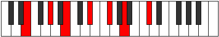

# Mode AFlatGodatic

## Links

- [Documentation](index.md)
- [Scales Index](Scales.md)
- [Modes Index](Modes.md)
- [Chords Index](Chords.md)

## Scale

[Aerycratic](ScaleAerycratic.md)

## Mode

[AFlatGodatic](ModeAFlatGodatic.md)

## Tonic

Ab

## Signature

[CNaturalMajor]

## Perfection

 - 10 Perfect Notes

 - 1 Imperfect Notes

## Notes

- Ab
- A
- Bb
- B
- C
- Db
- Eb
- E
- F
- Gb
- G (Imperfect)
- Ab

## Illustration

## Relative Modes

| Number | Mode | Tonic | Notes | Illustration |
|--------|------|-------|-------|--------------|
| [4031](https://ianring.com/musictheory/scales/4031) | [Godatic](ModeGodatic.md) | Ab | Ab, A, Bb, B, C, Db, Eb, E, F, Gb, G, Ab |  |
| [4063](https://ianring.com/musictheory/scales/4063) | [Eptatic](ModeEptatic.md) | A | A, A#, B, C, C#, D#, E, F, F#, G, G#, A |  |
| [4079](https://ianring.com/musictheory/scales/4079) | [Ionatic](ModeIonatic.md) | Bb | Bb, B, C, Db, Eb, E, F, Gb, G, Ab, A, Bb |  |
| [4087](https://ianring.com/musictheory/scales/4087) | [Aeolatic](ModeAeolatic.md) | B | B, C, C#, D#, E, F, F#, G, G#, A, A#, B |  |
| [4091](https://ianring.com/musictheory/scales/4091) | [Thydatic](ModeThydatic.md) | C | C, C#, D#, E, F, F#, G, G#, A, A#, B, C |  |
| [4093](https://ianring.com/musictheory/scales/4093) | [Aerycratic](ModeAerycratic.md) | Db | Db, Eb, E, F, Gb, G, Ab, A, Bb, B, C, Db |  |
| [2047](https://ianring.com/musictheory/scales/2047) | [Monatic](ModeMonatic.md) | Eb | Eb, E, F, Gb, G, Ab, A, Bb, B, C, Db, Eb |  |
| [3071](https://ianring.com/musictheory/scales/3071) | [Solatic](ModeSolatic.md) | E | E, F, F#, G, G#, A, A#, B, C, C#, D#, E |  |
| [3583](https://ianring.com/musictheory/scales/3583) | [Zylatic](ModeZylatic.md) | F | F, F#, G, G#, A, A#, B, C, C#, D#, E, F |  |
| [3839](https://ianring.com/musictheory/scales/3839) | [Mixolatic](ModeMixolatic.md) | Gb | Gb, G, Ab, A, Bb, B, C, Db, Eb, E, F, Gb |  |
| [3967](https://ianring.com/musictheory/scales/3967) | [Soratic](ModeSoratic.md) | G | G, G#, A, A#, B, C, C#, D#, E, F, F#, G |  |

## Chords

### Ab

| Number | Root | Name | Notes | Illustration | Audio |
|--------|------|------|-------|--------------|-------|

### A

| Number | Root | Name | Notes | Illustration | Audio |
|--------|------|------|-------|--------------|-------|
| 1544 | A | [Aloc](ChordANaturalLocrian.md) | A, Bb, Eb |  | [midi](ChordANaturalLocrianRootPosition.mid) |
| 2568 | A | [Asus2b5](ChordANaturalSuspendedSecondFlatFifth.md) | A, B, Eb |  | [midi](ChordANaturalSuspendedSecondFlatFifthRootPosition.mid) |
| 521 | A | [Ao](ChordANaturalDiminished.md) | A, C, Eb |  | [midi](ChordANaturalDiminishedRootPosition.mid) |
| 522 | A | [AMb5](ChordANaturalMajorFlatFifth.md) | A, C#, Eb |  | [midi](ChordANaturalMajorFlatFifthRootPosition.mid) |
| 528 | A | [A5](ChordANaturalPowerChord.md) | A, E |  | [midi](ChordANaturalPowerChordRootPosition.mid) |
| 1552 | A | [Aphryg](ChordANaturalPhrygian.md) | A, Bb, E |  | [midi](ChordANaturalPhrygianRootPosition.mid) |
| 2576 | A | [Asus2](ChordANaturalSuspendedSecond.md) | A, B, E |  | [midi](ChordANaturalSuspendedSecondRootPosition.mid) |
| 529 | A | [Am](ChordANaturalMinor.md) | A, C, E |  | [midi](ChordANaturalMinorRootPosition.mid) |
| 529 | A | [Am(add(#9))](ChordANaturalMinorAddSharpNinth.md) | A, C, E, B# |  | [midi](ChordANaturalMinorAddSharpNinthRootPosition.mid) |
| 2577 | A | [Am(add9)](ChordANaturalMinorAddNinth.md) | A, C, E, B |  | [midi](ChordANaturalMinorAddNinthRootPosition.mid) |
| 530 | A | [AM](ChordANaturalMajor.md) | A, C#, E |  | [midi](ChordANaturalMajorRootPosition.mid) |
| 2578 | A | [AM(add9)](ChordANaturalMajorAddNinth.md) | A, C#, E, B |  | [midi](ChordANaturalMajorAddNinthRootPosition.mid) |
| 531 | A | [AM(add(#9))](ChordANaturalMajorAddSharpNinth.md) | A, C#, E, B# |  | [midi](ChordANaturalMajorAddSharpNinthRootPosition.mid) |
| 536 | A | [Alyd](ChordANaturalLydian.md) | A, D#, E |  | [midi](ChordANaturalLydianRootPosition.mid) |
| 537 | A | [Am(add(#4))](ChordANaturalMinorAddSharpFourth.md) | A, C, D#, E |  | [midi](ChordANaturalMinorAddSharpFourthRootPosition.mid) |
| 538 | A | [AM(add(#4))](ChordANaturalMajorAddSharpFourth.md) | A, C#, D#, E |  | [midi](ChordANaturalMajorAddSharpFourthRootPosition.mid) |
| 2592 | A | [Asus2#5](ChordANaturalSuspendedSecondSharpFifth.md) | A, B, E# |  | [midi](ChordANaturalSuspendedSecondSharpFifthRootPosition.mid) |
| 545 | A | [Am#5](ChordANaturalMinorSharpFifth.md) | A, C, F |  | [midi](ChordANaturalMinorSharpFifthRootPosition.mid) |
| 546 | A | [A+](ChordANaturalAugmented.md) | A, C#, E# |  | [midi](ChordANaturalAugmentedRootPosition.mid) |
| 546 | A | [A+7](ChordANaturalAugmentedAugmentedSeventh.md) | A, C#, E#, G## |  | [midi](ChordANaturalAugmentedAugmentedSeventhRootPosition.mid) |
| 2600 | A | [Asus2b5add(#5)](ChordANaturalSuspendedSecondFlatFifthAddSharpFifth.md) | A, B, Eb, E# |  | [midi](ChordANaturalSuspendedSecondFlatFifthAddSharpFifthRootPosition.mid) |
| 578 | A | [AM##5](ChordANaturalMajorDoubleSharpFifth.md) | A, C#, F# |  | [midi](ChordANaturalMajorDoubleSharpFifthRootPosition.mid) |
| 2632 | A | [AM6sus2b5](ChordANaturalMajorSixthSuspendedSecondFlatFifth.md) | A, B, Eb, F# |  | [midi](ChordANaturalMajorSixthSuspendedSecondFlatFifthRootPosition.mid) |
| 585 | A | [Ao7](ChordANaturalFullDiminishedSeventh.md) | A, C, Eb, Gb |  | [midi](ChordANaturalFullDiminishedSeventhRootPosition.mid) |
| 586 | A | [AM6b5](ChordANaturalMajorSixthFlatFifth.md) | A, C#, Eb, F# |  | [midi](ChordANaturalMajorSixthFlatFifthRootPosition.mid) |
| 2640 | A | [AM6sus2](ChordANaturalMajorSixthSuspendedSecond.md) | A, B, E, F# |  | [midi](ChordANaturalMajorSixthSuspendedSecondRootPosition.mid) |
| 2640 | A | [A7sus2b5](ChordANaturalDominantSeventhSuspendedSecondFlatFifth.md) | A, B, E, Gb |  | [midi](ChordANaturalDominantSeventhSuspendedSecondFlatFifthRootPosition.mid) |
| 593 | A | [Am6](ChordANaturalMinorSixth.md) | A, C, E, F# |  | [midi](ChordANaturalMinorSixthRootPosition.mid) |
| 1617 | A | [Am6(addb9)](ChordANaturalMinorSixthAddFlatNinth.md) | A, C, E, F#, Bb |  | [midi](ChordANaturalMinorSixthAddFlatNinthRootPosition.mid) |
| 2641 | A | [Am6(add9)](ChordANaturalMinorSixthAddNinth.md) | A, C, E, F#, B |  | [midi](ChordANaturalMinorSixthAddNinthRootPosition.mid) |
| 594 | A | [AM6](ChordANaturalMajorSixth.md) | A, C#, E, F# |  | [midi](ChordANaturalMajorSixthRootPosition.mid) |
| 1618 | A | [AM6(addb9)](ChordANaturalMajorSixthAddFlatNinth.md) | A, C#, E, F#, Bb |  | [midi](ChordANaturalMajorSixthAddFlatNinthRootPosition.mid) |
| 2642 | A | [AM6(add9)](ChordANaturalMajorSixthAddNinth.md) | A, C#, E, F#, B |  | [midi](ChordANaturalMajorSixthAddNinthRootPosition.mid) |
| 649 | A | [Aø7](ChordANaturalHalfDiminishedSeventh.md) | A, C, Eb, G |  | [midi](ChordANaturalHalfDiminishedSeventhRootPosition.mid) |
| 650 | A | [A7b5](ChordANaturalDominantSeventhFlatFifth.md) | A, C#, Eb, G |  | [midi](ChordANaturalDominantSeventhFlatFifthRootPosition.mid) |
| 1674 | A | [A7b5b9](ChordANaturalDominantSeventhFlatFifthFlatNinth.md) | A, C#, Eb, G, Bb |  | [midi](ChordANaturalDominantSeventhFlatFifthFlatNinthRootPosition.mid) |
| 2704 | A | [A7sus2](ChordANaturalDominantSeventhSuspendedSecond.md) | A, B, E, G |  | [midi](ChordANaturalDominantSeventhSuspendedSecondRootPosition.mid) |
| 2704 | A | [A9sus2](ChordANaturalDominantNinthSuspendedSecond.md) | A, B, E, G, B |  | [midi](ChordANaturalDominantNinthSuspendedSecondRootPosition.mid) |
| 657 | A | [Am7](ChordANaturalMinorSeventh.md) | A, C, E, G |  | [midi](ChordANaturalMinorSeventhRootPosition.mid) |
| 1681 | A | [Am7b9](ChordANaturalMinorSeventhFlatNinth.md) | A, C, E, G, Bb |  | [midi](ChordANaturalMinorSeventhFlatNinthRootPosition.mid) |
| 2705 | A | [Am9](ChordANaturalMinorNinth.md) | A, C, E, G, B |  | [midi](ChordANaturalMinorNinthRootPosition.mid) |
| 658 | A | [A7](ChordANaturalDominantSeventh.md) | A, C#, E, G |  | [midi](ChordANaturalDominantSeventhRootPosition.mid) |
| 1682 | A | [A7b9](ChordANaturalDominantSeventhFlatNinth.md) | A, C#, E, G, Bb |  | [midi](ChordANaturalDominantSeventhFlatNinthRootPosition.mid) |
| 2706 | A | [A9](ChordANaturalDominantNinth.md) | A, C#, E, G, B |  | [midi](ChordANaturalDominantNinthRootPosition.mid) |
| 659 | A | [A7#9](ChordANaturalDominantSeventhSharpNinth.md) | A, C#, E, G, B# |  | [midi](ChordANaturalDominantSeventhSharpNinthRootPosition.mid) |
| 665 | A | [Am7add(#11)](ChordANaturalMinorSeventhAddSharpEleventh.md) | A, C, E, G, D# |  | [midi](ChordANaturalMinorSeventhAddSharpEleventhRootPosition.mid) |
| 666 | A | [A7add(#4)](ChordANaturalDominantSeventhAddSharpFourth.md) | A, C#, D#, E, G |  | [midi](ChordANaturalDominantSeventhAddSharpFourthRootPosition.mid) |
| 666 | A | [A7#11](ChordANaturalDominantSeventhSharpEleventh.md) | A, C#, E, G, D# |  | [midi](ChordANaturalDominantSeventhSharpEleventhRootPosition.mid) |
| 2714 | A | [A9#11](ChordANaturalDominantNinthSharpEleventh.md) | A, C#, E, G, B, D# |  | [midi](ChordANaturalDominantNinthSharpEleventhRootPosition.mid) |
| 667 | A | [A7#9#11](ChordANaturalDominantSeventhSharpNinthSharpEleventh.md) | A, C#, E, G, B#, D# |  | [midi](ChordANaturalDominantSeventhSharpNinthSharpEleventhRootPosition.mid) |
| 673 | A | [Am7#5](ChordANaturalMinorSeventhSharpFifth.md) | A, C, E#, G |  | [midi](ChordANaturalMinorSeventhSharpFifthRootPosition.mid) |
| 1698 | A | [A7#5b9](ChordANaturalDominantSeventhSharpFifthFlatNinth.md) | A, C#, E#, G, Bb |  | [midi](ChordANaturalDominantSeventhSharpFifthFlatNinthRootPosition.mid) |
| 1714 | A | [A7b9b13](ChordANaturalDominantSeventhFlatNinthFlatThirteenth.md) | A, C#, E, G, Bb, F |  | [midi](ChordANaturalDominantSeventhFlatNinthFlatThirteenthRootPosition.mid) |
| 2738 | A | [A9b13](ChordANaturalDominantNinthFlatThirteenth.md) | A, C#, E, G, B, F |  | [midi](ChordANaturalDominantNinthFlatThirteenthRootPosition.mid) |
| 721 | A | [Am7add13](ChordANaturalMinorSeventhAddThirteenth.md) | A, C, E, G, F# |  | [midi](ChordANaturalMinorSeventhAddThirteenthRootPosition.mid) |
| 722 | A | [A7add13](ChordANaturalDominantSeventhAddThirteenth.md) | A, C#, E, G, F# |  | [midi](ChordANaturalDominantSeventhAddThirteenthRootPosition.mid) |
| 777 | A | [AoM7](ChordANaturalDiminishedMajorSeventh.md) | A, C, Eb, G# |  | [midi](ChordANaturalDiminishedMajorSeventhRootPosition.mid) |
| 778 | A | [AM7b5](ChordANaturalMajorSeventhFlatFifth.md) | A, C#, Eb, G# |  | [midi](ChordANaturalMajorSeventhFlatFifthRootPosition.mid) |
| 1808 | A | [Aphryg+7](ChordANaturalPhrygianAddSeventh.md) | A, Bb, E, G# |  | [midi](ChordANaturalPhrygianAddSeventhRootPosition.mid) |
| 2832 | A | [AM7(sus2)](ChordANaturalMajorSeventhSuspendedSecond.md) | A, B, E, G# |  | [midi](ChordANaturalMajorSeventhSuspendedSecondRootPosition.mid) |
| 2832 | A | [AM9sus2](ChordANaturalMajorNinthSuspendedSecond.md) | A, B, E, G#, B |  | [midi](ChordANaturalMajorNinthSuspendedSecondRootPosition.mid) |
| 785 | A | [Am(M7)](ChordANaturalMinorMajorSeventh.md) | A, C, E, G# |  | [midi](ChordANaturalMinorMajorSeventhRootPosition.mid) |
| 2833 | A | [Am(M9)](ChordANaturalMinorMajorNinth.md) | A, C, E, G#, B |  | [midi](ChordANaturalMinorMajorNinthRootPosition.mid) |
| 786 | A | [AM7](ChordANaturalMajorSeventh.md) | A, C#, E, G# |  | [midi](ChordANaturalMajorSeventhRootPosition.mid) |
| 2834 | A | [AM9](ChordANaturalMajorNinth.md) | A, C#, E, G#, B |  | [midi](ChordANaturalMajorNinthRootPosition.mid) |
| 792 | A | [Alyd(M7)](ChordANaturalLydianMajorSeventh.md) | A, D#, E, G# |  | [midi](ChordANaturalLydianMajorSeventhRootPosition.mid) |
| 794 | A | [AM7add(#11)](ChordANaturalMajorSeventhAddSharpEleventh.md) | A, C#, E, G#, D# |  | [midi](ChordANaturalMajorSeventhAddSharpEleventhRootPosition.mid) |
| 794 | A | [AM7add(#4)](ChordANaturalMajorSeventhAddSharpFourth.md) | A, C#, D#, E, G# |  | [midi](ChordANaturalMajorSeventhAddSharpFourthRootPosition.mid) |
| 802 | A | [A+(M7)](ChordANaturalAugmentedMajorSeventh.md) | A, C#, E#, G# |  | [midi](ChordANaturalAugmentedMajorSeventhRootPosition.mid) |
| 834 | A | [AM7##5](ChordANaturalMajorSeventhDoubleSharpFifth.md) | A, C#, F#, G# |  | [midi](ChordANaturalMajorSeventhDoubleSharpFifthRootPosition.mid) |
| 849 | A | [Am(M7)add13](ChordANaturalMinorMajorSeventhAddThirteenth.md) | A, C, E, G#, F# |  | [midi](ChordANaturalMinorMajorSeventhAddThirteenthRootPosition.mid) |
| 850 | A | [AM7add13](ChordANaturalMajorSeventhAddThirteenth.md) | A, C#, E, G#, F# |  | [midi](ChordANaturalMajorSeventhAddThirteenthRootPosition.mid) |

### Bb

| Number | Root | Name | Notes | Illustration | Audio |
|--------|------|------|-------|--------------|-------|

### B

| Number | Root | Name | Notes | Illustration | Audio |
|--------|------|------|-------|--------------|-------|
| 2066 | B | [Bsus2bb5](ChordBNaturalSuspendedSecondDoubleFlatFifth.md) | B, C#, E |  | [midi](ChordBNaturalSuspendedSecondDoubleFlatFifthRootPosition.mid) |
| 2081 | B | [Bloc](ChordBNaturalLocrian.md) | B, C, F |  | [midi](ChordBNaturalLocrianRootPosition.mid) |
| 2082 | B | [Bsus2b5](ChordBNaturalSuspendedSecondFlatFifth.md) | B, C#, F |  | [midi](ChordBNaturalSuspendedSecondFlatFifthRootPosition.mid) |
| 2088 | B | [BMb5](ChordBNaturalMajorFlatFifth.md) | B, D#, F |  | [midi](ChordBNaturalMajorFlatFifthRootPosition.mid) |
| 2096 | B | [Bsus4b5](ChordBNaturalSuspendedFourthFlatFifth.md) | B, E, F |  | [midi](ChordBNaturalSuspendedFourthFlatFifthRootPosition.mid) |
| 2112 | B | [B5](ChordBNaturalPowerChord.md) | B, F# |  | [midi](ChordBNaturalPowerChordRootPosition.mid) |
| 2113 | B | [Bphryg](ChordBNaturalPhrygian.md) | B, C, F# |  | [midi](ChordBNaturalPhrygianRootPosition.mid) |
| 2114 | B | [Bsus2](ChordBNaturalSuspendedSecond.md) | B, C#, F# |  | [midi](ChordBNaturalSuspendedSecondRootPosition.mid) |
| 2120 | B | [BM](ChordBNaturalMajor.md) | B, D#, F# |  | [midi](ChordBNaturalMajorRootPosition.mid) |
| 2122 | B | [BM(add9)](ChordBNaturalMajorAddNinth.md) | B, D#, F#, C# |  | [midi](ChordBNaturalMajorAddNinthRootPosition.mid) |
| 2128 | B | [Bsus4](ChordBNaturalSuspendedFourth.md) | B, E, F# |  | [midi](ChordBNaturalSuspendedFourthRootPosition.mid) |
| 2136 | B | [BM(add11)](ChordBNaturalMajorAddEleventh.md) | B, D#, F#, E |  | [midi](ChordBNaturalMajorAddEleventhRootPosition.mid) |
| 2136 | B | [BM(add4)](ChordBNaturalMajorAddFourth.md) | B, D#, E, F# |  | [midi](ChordBNaturalMajorAddFourthRootPosition.mid) |
| 2144 | B | [Blyd](ChordBNaturalLydian.md) | B, E#, F# |  | [midi](ChordBNaturalLydianRootPosition.mid) |
| 2152 | B | [BM(add(#4))](ChordBNaturalMajorAddSharpFourth.md) | B, D#, E#, F# |  | [midi](ChordBNaturalMajorAddSharpFourthRootPosition.mid) |
| 2178 | B | [Bsus2#5](ChordBNaturalSuspendedSecondSharpFifth.md) | B, C#, F## |  | [midi](ChordBNaturalSuspendedSecondSharpFifthRootPosition.mid) |
| 2184 | B | [B+](ChordBNaturalAugmented.md) | B, D#, F## |  | [midi](ChordBNaturalAugmentedRootPosition.mid) |
| 2184 | B | [B+7](ChordBNaturalAugmentedAugmentedSeventh.md) | B, D#, F##, A## |  | [midi](ChordBNaturalAugmentedAugmentedSeventhRootPosition.mid) |
| 2192 | B | [Bsus4#5](ChordBNaturalSuspendedFourthSharpFifth.md) | B, E, F## |  | [midi](ChordBNaturalSuspendedFourthSharpFifthRootPosition.mid) |
| 2210 | B | [Bsus2b5add(#5)](ChordBNaturalSuspendedSecondFlatFifthAddSharpFifth.md) | B, C#, F, F## |  | [midi](ChordBNaturalSuspendedSecondFlatFifthAddSharpFifthRootPosition.mid) |
| 2312 | B | [BM##5](ChordBNaturalMajorDoubleSharpFifth.md) | B, D#, G# |  | [midi](ChordBNaturalMajorDoubleSharpFifthRootPosition.mid) |
| 2320 | B | [Bsus4##5](ChordBNaturalSuspendedFourthDoubleSharpFifth.md) | B, E, G# |  | [midi](ChordBNaturalSuspendedFourthDoubleSharpFifthRootPosition.mid) |
| 2322 | B | [BM6sus2bb5](ChordBNaturalMajorSixthSuspendedSecondDoubleFlatFifth.md) | B, C#, E, G# |  | [midi](ChordBNaturalMajorSixthSuspendedSecondDoubleFlatFifthRootPosition.mid) |
| 2338 | B | [BM6sus2b5](ChordBNaturalMajorSixthSuspendedSecondFlatFifth.md) | B, C#, F, G# |  | [midi](ChordBNaturalMajorSixthSuspendedSecondFlatFifthRootPosition.mid) |
| 2344 | B | [BM6b5](ChordBNaturalMajorSixthFlatFifth.md) | B, D#, F, G# |  | [midi](ChordBNaturalMajorSixthFlatFifthRootPosition.mid) |
| 2370 | B | [BM6sus2](ChordBNaturalMajorSixthSuspendedSecond.md) | B, C#, F#, G# |  | [midi](ChordBNaturalMajorSixthSuspendedSecondRootPosition.mid) |
| 2370 | B | [B7sus2b5](ChordBNaturalDominantSeventhSuspendedSecondFlatFifth.md) | B, C#, F#, Ab |  | [midi](ChordBNaturalDominantSeventhSuspendedSecondFlatFifthRootPosition.mid) |
| 2376 | B | [BM6](ChordBNaturalMajorSixth.md) | B, D#, F#, G# |  | [midi](ChordBNaturalMajorSixthRootPosition.mid) |
| 2377 | B | [BM6(addb9)](ChordBNaturalMajorSixthAddFlatNinth.md) | B, D#, F#, G#, C |  | [midi](ChordBNaturalMajorSixthAddFlatNinthRootPosition.mid) |
| 2378 | B | [BM6(add9)](ChordBNaturalMajorSixthAddNinth.md) | B, D#, F#, G#, C# |  | [midi](ChordBNaturalMajorSixthAddNinthRootPosition.mid) |
| 2384 | B | [BM6sus4](ChordBNaturalMajorSixthSuspendedFourth.md) | B, E, F#, G# |  | [midi](ChordBNaturalMajorSixthSuspendedFourthRootPosition.mid) |
| 2576 | B | [BQ](ChordBNaturalQuartal.md) | B, E, A |  | [midi](ChordBNaturalQuartalRootPosition.mid) |
| 2600 | B | [B7b5](ChordBNaturalDominantSeventhFlatFifth.md) | B, D#, F, A |  | [midi](ChordBNaturalDominantSeventhFlatFifthRootPosition.mid) |
| 2601 | B | [B7b5b9](ChordBNaturalDominantSeventhFlatFifthFlatNinth.md) | B, D#, F, A, C |  | [midi](ChordBNaturalDominantSeventhFlatFifthFlatNinthRootPosition.mid) |
| 2626 | B | [B7sus2](ChordBNaturalDominantSeventhSuspendedSecond.md) | B, C#, F#, A |  | [midi](ChordBNaturalDominantSeventhSuspendedSecondRootPosition.mid) |
| 2626 | B | [B9sus2](ChordBNaturalDominantNinthSuspendedSecond.md) | B, C#, F#, A, C# |  | [midi](ChordBNaturalDominantNinthSuspendedSecondRootPosition.mid) |
| 2632 | B | [B7](ChordBNaturalDominantSeventh.md) | B, D#, F#, A |  | [midi](ChordBNaturalDominantSeventhRootPosition.mid) |
| 2633 | B | [B7b9](ChordBNaturalDominantSeventhFlatNinth.md) | B, D#, F#, A, C |  | [midi](ChordBNaturalDominantSeventhFlatNinthRootPosition.mid) |
| 2634 | B | [B9](ChordBNaturalDominantNinth.md) | B, D#, F#, A, C# |  | [midi](ChordBNaturalDominantNinthRootPosition.mid) |
| 2640 | B | [B7sus4](ChordBNaturalDominantSeventhSuspendedFourth.md) | B, E, F#, A |  | [midi](ChordBNaturalDominantSeventhSuspendedFourthRootPosition.mid) |
| 2642 | B | [B9sus4](ChordBNaturalDominantNinthSuspendedFourth.md) | B, E, F#, A, C# |  | [midi](ChordBNaturalDominantNinthSuspendedFourthRootPosition.mid) |
| 2648 | B | [B7add4](ChordBNaturalDominantSeventhAddFourth.md) | B, D#, E, F#, A |  | [midi](ChordBNaturalDominantSeventhAddFourthRootPosition.mid) |
| 2648 | B | [B7add11](ChordBNaturalDominantSeventhAddEleventh.md) | B, D#, F#, A, E |  | [midi](ChordBNaturalDominantSeventhAddEleventhRootPosition.mid) |
| 2650 | B | [B11](ChordBNaturalDominantEleventh.md) | B, D#, F#, A, C#, E |  | [midi](ChordBNaturalDominantEleventhRootPosition.mid) |
| 2664 | B | [B7add(#4)](ChordBNaturalDominantSeventhAddSharpFourth.md) | B, D#, E#, F#, A |  | [midi](ChordBNaturalDominantSeventhAddSharpFourthRootPosition.mid) |
| 2664 | B | [B7#11](ChordBNaturalDominantSeventhSharpEleventh.md) | B, D#, F#, A, E# |  | [midi](ChordBNaturalDominantSeventhSharpEleventhRootPosition.mid) |
| 2666 | B | [B9#11](ChordBNaturalDominantNinthSharpEleventh.md) | B, D#, F#, A, C#, E# |  | [midi](ChordBNaturalDominantNinthSharpEleventhRootPosition.mid) |
| 2697 | B | [B7#5b9](ChordBNaturalDominantSeventhSharpFifthFlatNinth.md) | B, D#, F##, A, C |  | [midi](ChordBNaturalDominantSeventhSharpFifthFlatNinthRootPosition.mid) |
| 2761 | B | [B7b9b13](ChordBNaturalDominantSeventhFlatNinthFlatThirteenth.md) | B, D#, F#, A, C, G |  | [midi](ChordBNaturalDominantSeventhFlatNinthFlatThirteenthRootPosition.mid) |
| 2762 | B | [B9b13](ChordBNaturalDominantNinthFlatThirteenth.md) | B, D#, F#, A, C#, G |  | [midi](ChordBNaturalDominantNinthFlatThirteenthRootPosition.mid) |
| 2888 | B | [B7add13](ChordBNaturalDominantSeventhAddThirteenth.md) | B, D#, F#, A, G# |  | [midi](ChordBNaturalDominantSeventhAddThirteenthRootPosition.mid) |
| 2905 | B | [B13b9](ChordBNaturalDominantThirteenthFlatNinth.md) | B, D#, F#, A, C, E, G# |  | [midi](ChordBNaturalDominantThirteenthFlatNinthRootPosition.mid) |
| 2906 | B | [B13](ChordBNaturalDominantThirteenth.md) | B, D#, F#, A, C#, E, G# |  | [midi](ChordBNaturalDominantThirteenthRootPosition.mid) |
| 3088 | B | [BQ+](ChordBNaturalQuartalAugmented.md) | B, E, A# |  | [midi](ChordBNaturalQuartalAugmentedRootPosition.mid) |
| 3112 | B | [BM7b5](ChordBNaturalMajorSeventhFlatFifth.md) | B, D#, F, A# |  | [midi](ChordBNaturalMajorSeventhFlatFifthRootPosition.mid) |
| 3137 | B | [Bphryg+7](ChordBNaturalPhrygianAddSeventh.md) | B, C, F#, A# |  | [midi](ChordBNaturalPhrygianAddSeventhRootPosition.mid) |
| 3138 | B | [BM7(sus2)](ChordBNaturalMajorSeventhSuspendedSecond.md) | B, C#, F#, A# |  | [midi](ChordBNaturalMajorSeventhSuspendedSecondRootPosition.mid) |
| 3138 | B | [BM9sus2](ChordBNaturalMajorNinthSuspendedSecond.md) | B, C#, F#, A#, C# |  | [midi](ChordBNaturalMajorNinthSuspendedSecondRootPosition.mid) |
| 3144 | B | [BM7](ChordBNaturalMajorSeventh.md) | B, D#, F#, A# |  | [midi](ChordBNaturalMajorSeventhRootPosition.mid) |
| 3146 | B | [BM9](ChordBNaturalMajorNinth.md) | B, D#, F#, A#, C# |  | [midi](ChordBNaturalMajorNinthRootPosition.mid) |
| 3152 | B | [BM7(sus4)](ChordBNaturalMajorSeventhSuspendedFourth.md) | B, E, F#, A# |  | [midi](ChordBNaturalMajorSeventhSuspendedFourthRootPosition.mid) |
| 3154 | B | [BM9sus4](ChordBNaturalMajorNinthSuspendedFourth.md) | B, E, F#, A#, C# |  | [midi](ChordBNaturalMajorNinthSuspendedFourthRootPosition.mid) |
| 3160 | B | [BM7add4](ChordBNaturalMajorSeventhAddFourth.md) | B, D#, E, F#, A# |  | [midi](ChordBNaturalMajorSeventhAddFourthRootPosition.mid) |
| 3160 | B | [BM7add11](ChordBNaturalMajorSeventhAddEleventh.md) | B, D#, F#, A#, E |  | [midi](ChordBNaturalMajorSeventhAddEleventhRootPosition.mid) |
| 3162 | B | [BM11](ChordBNaturalMajorEleventh.md) | B, D#, F#, A#, C#, E |  | [midi](ChordBNaturalMajorEleventhRootPosition.mid) |
| 3168 | B | [Blyd(M7)](ChordBNaturalLydianMajorSeventh.md) | B, E#, F#, A# |  | [midi](ChordBNaturalLydianMajorSeventhRootPosition.mid) |
| 3176 | B | [BM7add(#11)](ChordBNaturalMajorSeventhAddSharpEleventh.md) | B, D#, F#, A#, E# |  | [midi](ChordBNaturalMajorSeventhAddSharpEleventhRootPosition.mid) |
| 3176 | B | [BM7add(#4)](ChordBNaturalMajorSeventhAddSharpFourth.md) | B, D#, E#, F#, A# |  | [midi](ChordBNaturalMajorSeventhAddSharpFourthRootPosition.mid) |
| 3208 | B | [B+(M7)](ChordBNaturalAugmentedMajorSeventh.md) | B, D#, F##, A# |  | [midi](ChordBNaturalAugmentedMajorSeventhRootPosition.mid) |
| 3216 | B | [BM7(sus4)#5](ChordBNaturalMajorSeventhSuspendedFourthSharpFifth.md) | B, E, F##, A# |  | [midi](ChordBNaturalMajorSeventhSuspendedFourthSharpFifthRootPosition.mid) |
| 3336 | B | [BM7##5](ChordBNaturalMajorSeventhDoubleSharpFifth.md) | B, D#, G#, A# |  | [midi](ChordBNaturalMajorSeventhDoubleSharpFifthRootPosition.mid) |
| 3344 | B | [BM7(sus4)##5](ChordBNaturalMajorSeventhSuspendedFourthDoubleSharpFifth.md) | B, E, G#, A# |  | [midi](ChordBNaturalMajorSeventhSuspendedFourthDoubleSharpFifthRootPosition.mid) |
| 3400 | B | [BM7add13](ChordBNaturalMajorSeventhAddThirteenth.md) | B, D#, F#, A#, G# |  | [midi](ChordBNaturalMajorSeventhAddThirteenthRootPosition.mid) |
| 3418 | B | [BM13](ChordBNaturalMajorThirteenth.md) | B, D#, F#, A#, C#, E, G# |  | [midi](ChordBNaturalMajorThirteenthRootPosition.mid) |

### C

| Number | Root | Name | Notes | Illustration | Audio |
|--------|------|------|-------|--------------|-------|
| 41 | C | [Cmbb5](ChordCNaturalMinorDoubleFlatFifth.md) | C, Eb, F |  | [midi](ChordCNaturalMinorDoubleFlatFifthRootPosition.mid) |
| 67 | C | [Cloc](ChordCNaturalLocrian.md) | C, Db, Gb |  | [midi](ChordCNaturalLocrianRootPosition.mid) |
| 73 | C | [Co](ChordCNaturalDiminished.md) | C, Eb, Gb |  | [midi](ChordCNaturalDiminishedRootPosition.mid) |
| 81 | C | [CMb5](ChordCNaturalMajorFlatFifth.md) | C, E, Gb |  | [midi](ChordCNaturalMajorFlatFifthRootPosition.mid) |
| 97 | C | [Csus4b5](ChordCNaturalSuspendedFourthFlatFifth.md) | C, F, Gb |  | [midi](ChordCNaturalSuspendedFourthFlatFifthRootPosition.mid) |
| 129 | C | [C5](ChordCNaturalPowerChord.md) | C, G |  | [midi](ChordCNaturalPowerChordRootPosition.mid) |
| 131 | C | [Cphryg](ChordCNaturalPhrygian.md) | C, Db, G |  | [midi](ChordCNaturalPhrygianRootPosition.mid) |
| 137 | C | [Cm](ChordCNaturalMinor.md) | C, Eb, G |  | [midi](ChordCNaturalMinorRootPosition.mid) |
| 137 | C | [Cm(add(#9))](ChordCNaturalMinorAddSharpNinth.md) | C, Eb, G, D# |  | [midi](ChordCNaturalMinorAddSharpNinthRootPosition.mid) |
| 145 | C | [CM](ChordCNaturalMajor.md) | C, E, G |  | [midi](ChordCNaturalMajorRootPosition.mid) |
| 153 | C | [CM(add(#9))](ChordCNaturalMajorAddSharpNinth.md) | C, E, G, D# |  | [midi](ChordCNaturalMajorAddSharpNinthRootPosition.mid) |
| 161 | C | [Csus4](ChordCNaturalSuspendedFourth.md) | C, F, G |  | [midi](ChordCNaturalSuspendedFourthRootPosition.mid) |
| 169 | C | [Cm(add11)](ChordCNaturalMinorAddEleventh.md) | C, Eb, G, F |  | [midi](ChordCNaturalMinorAddEleventhRootPosition.mid) |
| 169 | C | [Cm(add4)](ChordCNaturalMinorAddFourth.md) | C, Eb, F, G |  | [midi](ChordCNaturalMinorAddFourthRootPosition.mid) |
| 177 | C | [CM(add11)](ChordCNaturalMajorAddEleventh.md) | C, E, G, F |  | [midi](ChordCNaturalMajorAddEleventhRootPosition.mid) |
| 177 | C | [CM(add4)](ChordCNaturalMajorAddFourth.md) | C, E, F, G |  | [midi](ChordCNaturalMajorAddFourthRootPosition.mid) |
| 193 | C | [Clyd](ChordCNaturalLydian.md) | C, F#, G |  | [midi](ChordCNaturalLydianRootPosition.mid) |
| 201 | C | [Cm(add(#4))](ChordCNaturalMinorAddSharpFourth.md) | C, Eb, F#, G |  | [midi](ChordCNaturalMinorAddSharpFourthRootPosition.mid) |
| 209 | C | [CM(add(#4))](ChordCNaturalMajorAddSharpFourth.md) | C, E, F#, G |  | [midi](ChordCNaturalMajorAddSharpFourthRootPosition.mid) |
| 265 | C | [Cm#5](ChordCNaturalMinorSharpFifth.md) | C, Eb, Ab |  | [midi](ChordCNaturalMinorSharpFifthRootPosition.mid) |
| 273 | C | [C+](ChordCNaturalAugmented.md) | C, E, G# |  | [midi](ChordCNaturalAugmentedRootPosition.mid) |
| 273 | C | [C+7](ChordCNaturalAugmentedAugmentedSeventh.md) | C, E, G#, B# |  | [midi](ChordCNaturalAugmentedAugmentedSeventhRootPosition.mid) |
| 289 | C | [Csus4#5](ChordCNaturalSuspendedFourthSharpFifth.md) | C, F, G# |  | [midi](ChordCNaturalSuspendedFourthSharpFifthRootPosition.mid) |
| 529 | C | [CM##5](ChordCNaturalMajorDoubleSharpFifth.md) | C, E, A |  | [midi](ChordCNaturalMajorDoubleSharpFifthRootPosition.mid) |
| 545 | C | [Csus4##5](ChordCNaturalSuspendedFourthDoubleSharpFifth.md) | C, F, A |  | [midi](ChordCNaturalSuspendedFourthDoubleSharpFifthRootPosition.mid) |
| 585 | C | [Co7](ChordCNaturalFullDiminishedSeventh.md) | C, Eb, Gb, Bbb |  | [midi](ChordCNaturalFullDiminishedSeventhRootPosition.mid) |
| 593 | C | [CM6b5](ChordCNaturalMajorSixthFlatFifth.md) | C, E, Gb, A |  | [midi](ChordCNaturalMajorSixthFlatFifthRootPosition.mid) |
| 649 | C | [Cm6](ChordCNaturalMinorSixth.md) | C, Eb, G, A |  | [midi](ChordCNaturalMinorSixthRootPosition.mid) |
| 651 | C | [Cm6(addb9)](ChordCNaturalMinorSixthAddFlatNinth.md) | C, Eb, G, A, Db |  | [midi](ChordCNaturalMinorSixthAddFlatNinthRootPosition.mid) |
| 657 | C | [CM6](ChordCNaturalMajorSixth.md) | C, E, G, A |  | [midi](ChordCNaturalMajorSixthRootPosition.mid) |
| 659 | C | [CM6(addb9)](ChordCNaturalMajorSixthAddFlatNinth.md) | C, E, G, A, Db |  | [midi](ChordCNaturalMajorSixthAddFlatNinthRootPosition.mid) |
| 673 | C | [CM6sus4](ChordCNaturalMajorSixthSuspendedFourth.md) | C, F, G, A |  | [midi](ChordCNaturalMajorSixthSuspendedFourthRootPosition.mid) |
| 1057 | C | [CQ](ChordCNaturalQuartal.md) | C, F, Bb |  | [midi](ChordCNaturalQuartalRootPosition.mid) |
| 1065 | C | [Cm7bb5](ChordCNaturalMinorSeventhDoubleFlatFifth.md) | C, Eb, F, Bb |  | [midi](ChordCNaturalMinorSeventhDoubleFlatFifthRootPosition.mid) |
| 1097 | C | [Cø7](ChordCNaturalHalfDiminishedSeventh.md) | C, Eb, Gb, Bb |  | [midi](ChordCNaturalHalfDiminishedSeventhRootPosition.mid) |
| 1105 | C | [C7b5](ChordCNaturalDominantSeventhFlatFifth.md) | C, E, Gb, Bb |  | [midi](ChordCNaturalDominantSeventhFlatFifthRootPosition.mid) |
| 1107 | C | [C7b5b9](ChordCNaturalDominantSeventhFlatFifthFlatNinth.md) | C, E, Gb, Bb, Db |  | [midi](ChordCNaturalDominantSeventhFlatFifthFlatNinthRootPosition.mid) |
| 1161 | C | [Cm7](ChordCNaturalMinorSeventh.md) | C, Eb, G, Bb |  | [midi](ChordCNaturalMinorSeventhRootPosition.mid) |
| 1163 | C | [Cm7b9](ChordCNaturalMinorSeventhFlatNinth.md) | C, Eb, G, Bb, Db |  | [midi](ChordCNaturalMinorSeventhFlatNinthRootPosition.mid) |
| 1169 | C | [C7](ChordCNaturalDominantSeventh.md) | C, E, G, Bb |  | [midi](ChordCNaturalDominantSeventhRootPosition.mid) |
| 1171 | C | [C7b9](ChordCNaturalDominantSeventhFlatNinth.md) | C, E, G, Bb, Db |  | [midi](ChordCNaturalDominantSeventhFlatNinthRootPosition.mid) |
| 1177 | C | [C7#9](ChordCNaturalDominantSeventhSharpNinth.md) | C, E, G, Bb, D# |  | [midi](ChordCNaturalDominantSeventhSharpNinthRootPosition.mid) |
| 1185 | C | [C7sus4](ChordCNaturalDominantSeventhSuspendedFourth.md) | C, F, G, Bb |  | [midi](ChordCNaturalDominantSeventhSuspendedFourthRootPosition.mid) |
| 1193 | C | [Cm7add11](ChordCNaturalMinorSeventhAddEleventh.md) | C, Eb, G, Bb, F |  | [midi](ChordCNaturalMinorSeventhAddEleventhRootPosition.mid) |
| 1201 | C | [C7add4](ChordCNaturalDominantSeventhAddFourth.md) | C, E, F, G, Bb |  | [midi](ChordCNaturalDominantSeventhAddFourthRootPosition.mid) |
| 1201 | C | [C7add11](ChordCNaturalDominantSeventhAddEleventh.md) | C, E, G, Bb, F |  | [midi](ChordCNaturalDominantSeventhAddEleventhRootPosition.mid) |
| 1225 | C | [Cm7add(#11)](ChordCNaturalMinorSeventhAddSharpEleventh.md) | C, Eb, G, Bb, F# |  | [midi](ChordCNaturalMinorSeventhAddSharpEleventhRootPosition.mid) |
| 1233 | C | [C7add(#4)](ChordCNaturalDominantSeventhAddSharpFourth.md) | C, E, F#, G, Bb |  | [midi](ChordCNaturalDominantSeventhAddSharpFourthRootPosition.mid) |
| 1233 | C | [C7#11](ChordCNaturalDominantSeventhSharpEleventh.md) | C, E, G, Bb, F# |  | [midi](ChordCNaturalDominantSeventhSharpEleventhRootPosition.mid) |
| 1241 | C | [C7#9#11](ChordCNaturalDominantSeventhSharpNinthSharpEleventh.md) | C, E, G, Bb, D#, F# |  | [midi](ChordCNaturalDominantSeventhSharpNinthSharpEleventhRootPosition.mid) |
| 1289 | C | [Cm7#5](ChordCNaturalMinorSeventhSharpFifth.md) | C, Eb, G#, Bb |  | [midi](ChordCNaturalMinorSeventhSharpFifthRootPosition.mid) |
| 1299 | C | [C7#5b9](ChordCNaturalDominantSeventhSharpFifthFlatNinth.md) | C, E, G#, Bb, Db |  | [midi](ChordCNaturalDominantSeventhSharpFifthFlatNinthRootPosition.mid) |
| 1427 | C | [C7b9b13](ChordCNaturalDominantSeventhFlatNinthFlatThirteenth.md) | C, E, G, Bb, Db, Ab |  | [midi](ChordCNaturalDominantSeventhFlatNinthFlatThirteenthRootPosition.mid) |
| 1673 | C | [Cm7add13](ChordCNaturalMinorSeventhAddThirteenth.md) | C, Eb, G, Bb, A |  | [midi](ChordCNaturalMinorSeventhAddThirteenthRootPosition.mid) |
| 1681 | C | [C7add13](ChordCNaturalDominantSeventhAddThirteenth.md) | C, E, G, Bb, A |  | [midi](ChordCNaturalDominantSeventhAddThirteenthRootPosition.mid) |
| 1715 | C | [C13b9](ChordCNaturalDominantThirteenthFlatNinth.md) | C, E, G, Bb, Db, F, A |  | [midi](ChordCNaturalDominantThirteenthFlatNinthRootPosition.mid) |
| 2081 | C | [CQ+](ChordCNaturalQuartalAugmented.md) | C, F, B |  | [midi](ChordCNaturalQuartalAugmentedRootPosition.mid) |
| 2121 | C | [CoM7](ChordCNaturalDiminishedMajorSeventh.md) | C, Eb, Gb, B |  | [midi](ChordCNaturalDiminishedMajorSeventhRootPosition.mid) |
| 2129 | C | [CM7b5](ChordCNaturalMajorSeventhFlatFifth.md) | C, E, Gb, B |  | [midi](ChordCNaturalMajorSeventhFlatFifthRootPosition.mid) |
| 2179 | C | [Cphryg+7](ChordCNaturalPhrygianAddSeventh.md) | C, Db, G, B |  | [midi](ChordCNaturalPhrygianAddSeventhRootPosition.mid) |
| 2185 | C | [Cm(M7)](ChordCNaturalMinorMajorSeventh.md) | C, Eb, G, B |  | [midi](ChordCNaturalMinorMajorSeventhRootPosition.mid) |
| 2193 | C | [CM7](ChordCNaturalMajorSeventh.md) | C, E, G, B |  | [midi](ChordCNaturalMajorSeventhRootPosition.mid) |
| 2209 | C | [CM7(sus4)](ChordCNaturalMajorSeventhSuspendedFourth.md) | C, F, G, B |  | [midi](ChordCNaturalMajorSeventhSuspendedFourthRootPosition.mid) |
| 2217 | C | [Cm(M7)add11](ChordCNaturalMinorMajorSeventhAddEleventh.md) | C, Eb, G, B, F |  | [midi](ChordCNaturalMinorMajorSeventhAddEleventhRootPosition.mid) |
| 2225 | C | [CM7add4](ChordCNaturalMajorSeventhAddFourth.md) | C, E, F, G, B |  | [midi](ChordCNaturalMajorSeventhAddFourthRootPosition.mid) |
| 2225 | C | [CM7add11](ChordCNaturalMajorSeventhAddEleventh.md) | C, E, G, B, F |  | [midi](ChordCNaturalMajorSeventhAddEleventhRootPosition.mid) |
| 2241 | C | [Clyd(M7)](ChordCNaturalLydianMajorSeventh.md) | C, F#, G, B |  | [midi](ChordCNaturalLydianMajorSeventhRootPosition.mid) |
| 2257 | C | [CM7add(#11)](ChordCNaturalMajorSeventhAddSharpEleventh.md) | C, E, G, B, F# |  | [midi](ChordCNaturalMajorSeventhAddSharpEleventhRootPosition.mid) |
| 2257 | C | [CM7add(#4)](ChordCNaturalMajorSeventhAddSharpFourth.md) | C, E, F#, G, B |  | [midi](ChordCNaturalMajorSeventhAddSharpFourthRootPosition.mid) |
| 2321 | C | [C+(M7)](ChordCNaturalAugmentedMajorSeventh.md) | C, E, G#, B |  | [midi](ChordCNaturalAugmentedMajorSeventhRootPosition.mid) |
| 2337 | C | [CM7(sus4)#5](ChordCNaturalMajorSeventhSuspendedFourthSharpFifth.md) | C, F, G#, B |  | [midi](ChordCNaturalMajorSeventhSuspendedFourthSharpFifthRootPosition.mid) |
| 2577 | C | [CM7##5](ChordCNaturalMajorSeventhDoubleSharpFifth.md) | C, E, A, B |  | [midi](ChordCNaturalMajorSeventhDoubleSharpFifthRootPosition.mid) |
| 2593 | C | [CM7(sus4)##5](ChordCNaturalMajorSeventhSuspendedFourthDoubleSharpFifth.md) | C, F, A, B |  | [midi](ChordCNaturalMajorSeventhSuspendedFourthDoubleSharpFifthRootPosition.mid) |
| 2697 | C | [Cm(M7)add13](ChordCNaturalMinorMajorSeventhAddThirteenth.md) | C, Eb, G, B, A |  | [midi](ChordCNaturalMinorMajorSeventhAddThirteenthRootPosition.mid) |
| 2705 | C | [CM7add13](ChordCNaturalMajorSeventhAddThirteenth.md) | C, E, G, B, A |  | [midi](ChordCNaturalMajorSeventhAddThirteenthRootPosition.mid) |

### Db

| Number | Root | Name | Notes | Illustration | Audio |
|--------|------|------|-------|--------------|-------|

### Eb

| Number | Root | Name | Notes | Illustration | Audio |
|--------|------|------|-------|--------------|-------|

### E

| Number | Root | Name | Notes | Illustration | Audio |
|--------|------|------|-------|--------------|-------|
| 592 | E | [Esus2bb5](ChordENaturalSuspendedSecondDoubleFlatFifth.md) | E, F#, A |  | [midi](ChordENaturalSuspendedSecondDoubleFlatFifthRootPosition.mid) |
| 656 | E | [Embb5](ChordENaturalMinorDoubleFlatFifth.md) | E, G, A |  | [midi](ChordENaturalMinorDoubleFlatFifthRootPosition.mid) |
| 1072 | E | [Eloc](ChordENaturalLocrian.md) | E, F, Bb |  | [midi](ChordENaturalLocrianRootPosition.mid) |
| 1104 | E | [Esus2b5](ChordENaturalSuspendedSecondFlatFifth.md) | E, F#, Bb |  | [midi](ChordENaturalSuspendedSecondFlatFifthRootPosition.mid) |
| 1168 | E | [Eo](ChordENaturalDiminished.md) | E, G, Bb |  | [midi](ChordENaturalDiminishedRootPosition.mid) |
| 1296 | E | [EMb5](ChordENaturalMajorFlatFifth.md) | E, G#, Bb |  | [midi](ChordENaturalMajorFlatFifthRootPosition.mid) |
| 1552 | E | [Esus4b5](ChordENaturalSuspendedFourthFlatFifth.md) | E, A, Bb |  | [midi](ChordENaturalSuspendedFourthFlatFifthRootPosition.mid) |
| 2064 | E | [E5](ChordENaturalPowerChord.md) | E, B |  | [midi](ChordENaturalPowerChordRootPosition.mid) |
| 2096 | E | [Ephryg](ChordENaturalPhrygian.md) | E, F, B |  | [midi](ChordENaturalPhrygianRootPosition.mid) |
| 2128 | E | [Esus2](ChordENaturalSuspendedSecond.md) | E, F#, B |  | [midi](ChordENaturalSuspendedSecondRootPosition.mid) |
| 2192 | E | [Em](ChordENaturalMinor.md) | E, G, B |  | [midi](ChordENaturalMinorRootPosition.mid) |
| 2192 | E | [Em(add(#9))](ChordENaturalMinorAddSharpNinth.md) | E, G, B, F## |  | [midi](ChordENaturalMinorAddSharpNinthRootPosition.mid) |
| 2256 | E | [Em(add9)](ChordENaturalMinorAddNinth.md) | E, G, B, F# |  | [midi](ChordENaturalMinorAddNinthRootPosition.mid) |
| 2320 | E | [EM](ChordENaturalMajor.md) | E, G#, B |  | [midi](ChordENaturalMajorRootPosition.mid) |
| 2384 | E | [EM(add9)](ChordENaturalMajorAddNinth.md) | E, G#, B, F# |  | [midi](ChordENaturalMajorAddNinthRootPosition.mid) |
| 2448 | E | [EM(add(#9))](ChordENaturalMajorAddSharpNinth.md) | E, G#, B, F## |  | [midi](ChordENaturalMajorAddSharpNinthRootPosition.mid) |
| 2576 | E | [Esus4](ChordENaturalSuspendedFourth.md) | E, A, B |  | [midi](ChordENaturalSuspendedFourthRootPosition.mid) |
| 2704 | E | [Em(add11)](ChordENaturalMinorAddEleventh.md) | E, G, B, A |  | [midi](ChordENaturalMinorAddEleventhRootPosition.mid) |
| 2704 | E | [Em(add4)](ChordENaturalMinorAddFourth.md) | E, G, A, B |  | [midi](ChordENaturalMinorAddFourthRootPosition.mid) |
| 2832 | E | [EM(add11)](ChordENaturalMajorAddEleventh.md) | E, G#, B, A |  | [midi](ChordENaturalMajorAddEleventhRootPosition.mid) |
| 2832 | E | [EM(add4)](ChordENaturalMajorAddFourth.md) | E, G#, A, B |  | [midi](ChordENaturalMajorAddFourthRootPosition.mid) |
| 3088 | E | [Elyd](ChordENaturalLydian.md) | E, A#, B |  | [midi](ChordENaturalLydianRootPosition.mid) |
| 3216 | E | [Em(add(#4))](ChordENaturalMinorAddSharpFourth.md) | E, G, A#, B |  | [midi](ChordENaturalMinorAddSharpFourthRootPosition.mid) |
| 3344 | E | [EM(add(#4))](ChordENaturalMajorAddSharpFourth.md) | E, G#, A#, B |  | [midi](ChordENaturalMajorAddSharpFourthRootPosition.mid) |
| 81 | E | [Esus2#5](ChordENaturalSuspendedSecondSharpFifth.md) | E, F#, B# |  | [midi](ChordENaturalSuspendedSecondSharpFifthRootPosition.mid) |
| 145 | E | [Em#5](ChordENaturalMinorSharpFifth.md) | E, G, C |  | [midi](ChordENaturalMinorSharpFifthRootPosition.mid) |
| 273 | E | [E+](ChordENaturalAugmented.md) | E, G#, B# |  | [midi](ChordENaturalAugmentedRootPosition.mid) |
| 273 | E | [E+7](ChordENaturalAugmentedAugmentedSeventh.md) | E, G#, B#, D## |  | [midi](ChordENaturalAugmentedAugmentedSeventhRootPosition.mid) |
| 529 | E | [Esus4#5](ChordENaturalSuspendedFourthSharpFifth.md) | E, A, B# |  | [midi](ChordENaturalSuspendedFourthSharpFifthRootPosition.mid) |
| 1105 | E | [Esus2b5add(#5)](ChordENaturalSuspendedSecondFlatFifthAddSharpFifth.md) | E, F#, Bb, B# |  | [midi](ChordENaturalSuspendedSecondFlatFifthAddSharpFifthRootPosition.mid) |
| 274 | E | [EM##5](ChordENaturalMajorDoubleSharpFifth.md) | E, G#, C# |  | [midi](ChordENaturalMajorDoubleSharpFifthRootPosition.mid) |
| 530 | E | [Esus4##5](ChordENaturalSuspendedFourthDoubleSharpFifth.md) | E, A, C# |  | [midi](ChordENaturalSuspendedFourthDoubleSharpFifthRootPosition.mid) |
| 594 | E | [EM6sus2bb5](ChordENaturalMajorSixthSuspendedSecondDoubleFlatFifth.md) | E, F#, A, C# |  | [midi](ChordENaturalMajorSixthSuspendedSecondDoubleFlatFifthRootPosition.mid) |
| 1106 | E | [EM6sus2b5](ChordENaturalMajorSixthSuspendedSecondFlatFifth.md) | E, F#, Bb, C# |  | [midi](ChordENaturalMajorSixthSuspendedSecondFlatFifthRootPosition.mid) |
| 1170 | E | [Eo7](ChordENaturalFullDiminishedSeventh.md) | E, G, Bb, Db |  | [midi](ChordENaturalFullDiminishedSeventhRootPosition.mid) |
| 1298 | E | [EM6b5](ChordENaturalMajorSixthFlatFifth.md) | E, G#, Bb, C# |  | [midi](ChordENaturalMajorSixthFlatFifthRootPosition.mid) |
| 2130 | E | [EM6sus2](ChordENaturalMajorSixthSuspendedSecond.md) | E, F#, B, C# |  | [midi](ChordENaturalMajorSixthSuspendedSecondRootPosition.mid) |
| 2130 | E | [E7sus2b5](ChordENaturalDominantSeventhSuspendedSecondFlatFifth.md) | E, F#, B, Db |  | [midi](ChordENaturalDominantSeventhSuspendedSecondFlatFifthRootPosition.mid) |
| 2194 | E | [Em6](ChordENaturalMinorSixth.md) | E, G, B, C# |  | [midi](ChordENaturalMinorSixthRootPosition.mid) |
| 2226 | E | [Em6(addb9)](ChordENaturalMinorSixthAddFlatNinth.md) | E, G, B, C#, F |  | [midi](ChordENaturalMinorSixthAddFlatNinthRootPosition.mid) |
| 2258 | E | [Em6(add9)](ChordENaturalMinorSixthAddNinth.md) | E, G, B, C#, F# |  | [midi](ChordENaturalMinorSixthAddNinthRootPosition.mid) |
| 2322 | E | [EM6](ChordENaturalMajorSixth.md) | E, G#, B, C# |  | [midi](ChordENaturalMajorSixthRootPosition.mid) |
| 2354 | E | [EM6(addb9)](ChordENaturalMajorSixthAddFlatNinth.md) | E, G#, B, C#, F |  | [midi](ChordENaturalMajorSixthAddFlatNinthRootPosition.mid) |
| 2386 | E | [EM6(add9)](ChordENaturalMajorSixthAddNinth.md) | E, G#, B, C#, F# |  | [midi](ChordENaturalMajorSixthAddNinthRootPosition.mid) |
| 2578 | E | [EM6sus4](ChordENaturalMajorSixthSuspendedFourth.md) | E, A, B, C# |  | [midi](ChordENaturalMajorSixthSuspendedFourthRootPosition.mid) |
| 536 | E | [EQ+](ChordENaturalQuartalAugmented.md) | E, A, D# |  | [midi](ChordENaturalQuartalAugmentedRootPosition.mid) |
| 1176 | E | [EoM7](ChordENaturalDiminishedMajorSeventh.md) | E, G, Bb, D# |  | [midi](ChordENaturalDiminishedMajorSeventhRootPosition.mid) |
| 1304 | E | [EM7b5](ChordENaturalMajorSeventhFlatFifth.md) | E, G#, Bb, D# |  | [midi](ChordENaturalMajorSeventhFlatFifthRootPosition.mid) |
| 2104 | E | [Ephryg+7](ChordENaturalPhrygianAddSeventh.md) | E, F, B, D# |  | [midi](ChordENaturalPhrygianAddSeventhRootPosition.mid) |
| 2136 | E | [EM7(sus2)](ChordENaturalMajorSeventhSuspendedSecond.md) | E, F#, B, D# |  | [midi](ChordENaturalMajorSeventhSuspendedSecondRootPosition.mid) |
| 2136 | E | [EM9sus2](ChordENaturalMajorNinthSuspendedSecond.md) | E, F#, B, D#, F# |  | [midi](ChordENaturalMajorNinthSuspendedSecondRootPosition.mid) |
| 2200 | E | [Em(M7)](ChordENaturalMinorMajorSeventh.md) | E, G, B, D# |  | [midi](ChordENaturalMinorMajorSeventhRootPosition.mid) |
| 2264 | E | [Em(M9)](ChordENaturalMinorMajorNinth.md) | E, G, B, D#, F# |  | [midi](ChordENaturalMinorMajorNinthRootPosition.mid) |
| 2328 | E | [EM7](ChordENaturalMajorSeventh.md) | E, G#, B, D# |  | [midi](ChordENaturalMajorSeventhRootPosition.mid) |
| 2392 | E | [EM9](ChordENaturalMajorNinth.md) | E, G#, B, D#, F# |  | [midi](ChordENaturalMajorNinthRootPosition.mid) |
| 2584 | E | [EM7(sus4)](ChordENaturalMajorSeventhSuspendedFourth.md) | E, A, B, D# |  | [midi](ChordENaturalMajorSeventhSuspendedFourthRootPosition.mid) |
| 2648 | E | [EM9sus4](ChordENaturalMajorNinthSuspendedFourth.md) | E, A, B, D#, F# |  | [midi](ChordENaturalMajorNinthSuspendedFourthRootPosition.mid) |
| 2712 | E | [Em(M7)add11](ChordENaturalMinorMajorSeventhAddEleventh.md) | E, G, B, D#, A |  | [midi](ChordENaturalMinorMajorSeventhAddEleventhRootPosition.mid) |
| 2776 | E | [Em(M11)](ChordENaturalMinorMajorEleventh.md) | E, G, B, D#, F#, A |  | [midi](ChordENaturalMinorMajorEleventhRootPosition.mid) |
| 2840 | E | [EM7add4](ChordENaturalMajorSeventhAddFourth.md) | E, G#, A, B, D# |  | [midi](ChordENaturalMajorSeventhAddFourthRootPosition.mid) |
| 2840 | E | [EM7add11](ChordENaturalMajorSeventhAddEleventh.md) | E, G#, B, D#, A |  | [midi](ChordENaturalMajorSeventhAddEleventhRootPosition.mid) |
| 2904 | E | [EM11](ChordENaturalMajorEleventh.md) | E, G#, B, D#, F#, A |  | [midi](ChordENaturalMajorEleventhRootPosition.mid) |
| 3096 | E | [Elyd(M7)](ChordENaturalLydianMajorSeventh.md) | E, A#, B, D# |  | [midi](ChordENaturalLydianMajorSeventhRootPosition.mid) |
| 3352 | E | [EM7add(#11)](ChordENaturalMajorSeventhAddSharpEleventh.md) | E, G#, B, D#, A# |  | [midi](ChordENaturalMajorSeventhAddSharpEleventhRootPosition.mid) |
| 3352 | E | [EM7add(#4)](ChordENaturalMajorSeventhAddSharpFourth.md) | E, G#, A#, B, D# |  | [midi](ChordENaturalMajorSeventhAddSharpFourthRootPosition.mid) |
| 281 | E | [E+(M7)](ChordENaturalAugmentedMajorSeventh.md) | E, G#, B#, D# |  | [midi](ChordENaturalAugmentedMajorSeventhRootPosition.mid) |
| 537 | E | [EM7(sus4)#5](ChordENaturalMajorSeventhSuspendedFourthSharpFifth.md) | E, A, B#, D# |  | [midi](ChordENaturalMajorSeventhSuspendedFourthSharpFifthRootPosition.mid) |
| 282 | E | [EM7##5](ChordENaturalMajorSeventhDoubleSharpFifth.md) | E, G#, C#, D# |  | [midi](ChordENaturalMajorSeventhDoubleSharpFifthRootPosition.mid) |
| 538 | E | [EM7(sus4)##5](ChordENaturalMajorSeventhSuspendedFourthDoubleSharpFifth.md) | E, A, C#, D# |  | [midi](ChordENaturalMajorSeventhSuspendedFourthDoubleSharpFifthRootPosition.mid) |
| 2202 | E | [Em(M7)add13](ChordENaturalMinorMajorSeventhAddThirteenth.md) | E, G, B, D#, C# |  | [midi](ChordENaturalMinorMajorSeventhAddThirteenthRootPosition.mid) |
| 2330 | E | [EM7add13](ChordENaturalMajorSeventhAddThirteenth.md) | E, G#, B, D#, C# |  | [midi](ChordENaturalMajorSeventhAddThirteenthRootPosition.mid) |
| 2778 | E | [Em(M13)](ChordENaturalMinorMajorThirteenth.md) | E, G, B, D#, F#, A, C# |  | [midi](ChordENaturalMinorMajorThirteenthRootPosition.mid) |
| 2906 | E | [EM13](ChordENaturalMajorThirteenth.md) | E, G#, B, D#, F#, A, C# |  | [midi](ChordENaturalMajorThirteenthRootPosition.mid) |

### F

| Number | Root | Name | Notes | Illustration | Audio |
|--------|------|------|-------|--------------|-------|
| 1184 | F | [Fsus2bb5](ChordFNaturalSuspendedSecondDoubleFlatFifth.md) | F, G, Bb |  | [midi](ChordFNaturalSuspendedSecondDoubleFlatFifthRootPosition.mid) |
| 1312 | F | [Fmbb5](ChordFNaturalMinorDoubleFlatFifth.md) | F, Ab, Bb |  | [midi](ChordFNaturalMinorDoubleFlatFifthRootPosition.mid) |
| 2144 | F | [Floc](ChordFNaturalLocrian.md) | F, Gb, Cb |  | [midi](ChordFNaturalLocrianRootPosition.mid) |
| 2208 | F | [Fsus2b5](ChordFNaturalSuspendedSecondFlatFifth.md) | F, G, Cb |  | [midi](ChordFNaturalSuspendedSecondFlatFifthRootPosition.mid) |
| 2336 | F | [Fo](ChordFNaturalDiminished.md) | F, Ab, Cb |  | [midi](ChordFNaturalDiminishedRootPosition.mid) |
| 2592 | F | [FMb5](ChordFNaturalMajorFlatFifth.md) | F, A, Cb |  | [midi](ChordFNaturalMajorFlatFifthRootPosition.mid) |
| 3104 | F | [Fsus4b5](ChordFNaturalSuspendedFourthFlatFifth.md) | F, Bb, Cb |  | [midi](ChordFNaturalSuspendedFourthFlatFifthRootPosition.mid) |
| 33 | F | [F5](ChordFNaturalPowerChord.md) | F, C |  | [midi](ChordFNaturalPowerChordRootPosition.mid) |
| 97 | F | [Fphryg](ChordFNaturalPhrygian.md) | F, Gb, C |  | [midi](ChordFNaturalPhrygianRootPosition.mid) |
| 161 | F | [Fsus2](ChordFNaturalSuspendedSecond.md) | F, G, C |  | [midi](ChordFNaturalSuspendedSecondRootPosition.mid) |
| 289 | F | [Fm](ChordFNaturalMinor.md) | F, Ab, C |  | [midi](ChordFNaturalMinorRootPosition.mid) |
| 289 | F | [Fm(add(#9))](ChordFNaturalMinorAddSharpNinth.md) | F, Ab, C, G# |  | [midi](ChordFNaturalMinorAddSharpNinthRootPosition.mid) |
| 417 | F | [Fm(add9)](ChordFNaturalMinorAddNinth.md) | F, Ab, C, G |  | [midi](ChordFNaturalMinorAddNinthRootPosition.mid) |
| 545 | F | [FM](ChordFNaturalMajor.md) | F, A, C |  | [midi](ChordFNaturalMajorRootPosition.mid) |
| 673 | F | [FM(add9)](ChordFNaturalMajorAddNinth.md) | F, A, C, G |  | [midi](ChordFNaturalMajorAddNinthRootPosition.mid) |
| 801 | F | [FM(add(#9))](ChordFNaturalMajorAddSharpNinth.md) | F, A, C, G# |  | [midi](ChordFNaturalMajorAddSharpNinthRootPosition.mid) |
| 1057 | F | [Fsus4](ChordFNaturalSuspendedFourth.md) | F, Bb, C |  | [midi](ChordFNaturalSuspendedFourthRootPosition.mid) |
| 1313 | F | [Fm(add11)](ChordFNaturalMinorAddEleventh.md) | F, Ab, C, Bb |  | [midi](ChordFNaturalMinorAddEleventhRootPosition.mid) |
| 1313 | F | [Fm(add4)](ChordFNaturalMinorAddFourth.md) | F, Ab, Bb, C |  | [midi](ChordFNaturalMinorAddFourthRootPosition.mid) |
| 1569 | F | [FM(add11)](ChordFNaturalMajorAddEleventh.md) | F, A, C, Bb |  | [midi](ChordFNaturalMajorAddEleventhRootPosition.mid) |
| 1569 | F | [FM(add4)](ChordFNaturalMajorAddFourth.md) | F, A, Bb, C |  | [midi](ChordFNaturalMajorAddFourthRootPosition.mid) |
| 2081 | F | [Flyd](ChordFNaturalLydian.md) | F, B, C |  | [midi](ChordFNaturalLydianRootPosition.mid) |
| 2337 | F | [Fm(add(#4))](ChordFNaturalMinorAddSharpFourth.md) | F, Ab, B, C |  | [midi](ChordFNaturalMinorAddSharpFourthRootPosition.mid) |
| 2593 | F | [FM(add(#4))](ChordFNaturalMajorAddSharpFourth.md) | F, A, B, C |  | [midi](ChordFNaturalMajorAddSharpFourthRootPosition.mid) |
| 162 | F | [Fsus2#5](ChordFNaturalSuspendedSecondSharpFifth.md) | F, G, C# |  | [midi](ChordFNaturalSuspendedSecondSharpFifthRootPosition.mid) |
| 290 | F | [Fm#5](ChordFNaturalMinorSharpFifth.md) | F, Ab, Db |  | [midi](ChordFNaturalMinorSharpFifthRootPosition.mid) |
| 546 | F | [F+](ChordFNaturalAugmented.md) | F, A, C# |  | [midi](ChordFNaturalAugmentedRootPosition.mid) |
| 546 | F | [F+7](ChordFNaturalAugmentedAugmentedSeventh.md) | F, A, C#, E# |  | [midi](ChordFNaturalAugmentedAugmentedSeventhRootPosition.mid) |
| 1058 | F | [Fsus4#5](ChordFNaturalSuspendedFourthSharpFifth.md) | F, Bb, C# |  | [midi](ChordFNaturalSuspendedFourthSharpFifthRootPosition.mid) |
| 2210 | F | [Fsus2b5add(#5)](ChordFNaturalSuspendedSecondFlatFifthAddSharpFifth.md) | F, G, Cb, C# |  | [midi](ChordFNaturalSuspendedSecondFlatFifthAddSharpFifthRootPosition.mid) |
| 1064 | F | [FQ](ChordFNaturalQuartal.md) | F, Bb, Eb |  | [midi](ChordFNaturalQuartalRootPosition.mid) |
| 1320 | F | [Fm7bb5](ChordFNaturalMinorSeventhDoubleFlatFifth.md) | F, Ab, Bb, Eb |  | [midi](ChordFNaturalMinorSeventhDoubleFlatFifthRootPosition.mid) |
| 2344 | F | [Fø7](ChordFNaturalHalfDiminishedSeventh.md) | F, Ab, Cb, Eb |  | [midi](ChordFNaturalHalfDiminishedSeventhRootPosition.mid) |
| 2600 | F | [F7b5](ChordFNaturalDominantSeventhFlatFifth.md) | F, A, Cb, Eb |  | [midi](ChordFNaturalDominantSeventhFlatFifthRootPosition.mid) |
| 2664 | F | [F7b5b9](ChordFNaturalDominantSeventhFlatFifthFlatNinth.md) | F, A, Cb, Eb, Gb |  | [midi](ChordFNaturalDominantSeventhFlatFifthFlatNinthRootPosition.mid) |
| 169 | F | [F7sus2](ChordFNaturalDominantSeventhSuspendedSecond.md) | F, G, C, Eb |  | [midi](ChordFNaturalDominantSeventhSuspendedSecondRootPosition.mid) |
| 169 | F | [F9sus2](ChordFNaturalDominantNinthSuspendedSecond.md) | F, G, C, Eb, G |  | [midi](ChordFNaturalDominantNinthSuspendedSecondRootPosition.mid) |
| 297 | F | [Fm7](ChordFNaturalMinorSeventh.md) | F, Ab, C, Eb |  | [midi](ChordFNaturalMinorSeventhRootPosition.mid) |
| 361 | F | [Fm7b9](ChordFNaturalMinorSeventhFlatNinth.md) | F, Ab, C, Eb, Gb |  | [midi](ChordFNaturalMinorSeventhFlatNinthRootPosition.mid) |
| 425 | F | [Fm9](ChordFNaturalMinorNinth.md) | F, Ab, C, Eb, G |  | [midi](ChordFNaturalMinorNinthRootPosition.mid) |
| 553 | F | [F7](ChordFNaturalDominantSeventh.md) | F, A, C, Eb |  | [midi](ChordFNaturalDominantSeventhRootPosition.mid) |
| 617 | F | [F7b9](ChordFNaturalDominantSeventhFlatNinth.md) | F, A, C, Eb, Gb |  | [midi](ChordFNaturalDominantSeventhFlatNinthRootPosition.mid) |
| 681 | F | [F9](ChordFNaturalDominantNinth.md) | F, A, C, Eb, G |  | [midi](ChordFNaturalDominantNinthRootPosition.mid) |
| 809 | F | [F7#9](ChordFNaturalDominantSeventhSharpNinth.md) | F, A, C, Eb, G# |  | [midi](ChordFNaturalDominantSeventhSharpNinthRootPosition.mid) |
| 1065 | F | [F7sus4](ChordFNaturalDominantSeventhSuspendedFourth.md) | F, Bb, C, Eb |  | [midi](ChordFNaturalDominantSeventhSuspendedFourthRootPosition.mid) |
| 1193 | F | [F9sus4](ChordFNaturalDominantNinthSuspendedFourth.md) | F, Bb, C, Eb, G |  | [midi](ChordFNaturalDominantNinthSuspendedFourthRootPosition.mid) |
| 1321 | F | [Fm7add11](ChordFNaturalMinorSeventhAddEleventh.md) | F, Ab, C, Eb, Bb |  | [midi](ChordFNaturalMinorSeventhAddEleventhRootPosition.mid) |
| 1449 | F | [Fm11](ChordFNaturalMinorEleventh.md) | F, Ab, C, Eb, G, Bb |  | [midi](ChordFNaturalMinorEleventhRootPosition.mid) |
| 1577 | F | [F7add4](ChordFNaturalDominantSeventhAddFourth.md) | F, A, Bb, C, Eb |  | [midi](ChordFNaturalDominantSeventhAddFourthRootPosition.mid) |
| 1577 | F | [F7add11](ChordFNaturalDominantSeventhAddEleventh.md) | F, A, C, Eb, Bb |  | [midi](ChordFNaturalDominantSeventhAddEleventhRootPosition.mid) |
| 1705 | F | [F11](ChordFNaturalDominantEleventh.md) | F, A, C, Eb, G, Bb |  | [midi](ChordFNaturalDominantEleventhRootPosition.mid) |
| 2345 | F | [Fm7add(#11)](ChordFNaturalMinorSeventhAddSharpEleventh.md) | F, Ab, C, Eb, B |  | [midi](ChordFNaturalMinorSeventhAddSharpEleventhRootPosition.mid) |
| 2601 | F | [F7add(#4)](ChordFNaturalDominantSeventhAddSharpFourth.md) | F, A, B, C, Eb |  | [midi](ChordFNaturalDominantSeventhAddSharpFourthRootPosition.mid) |
| 2601 | F | [F7#11](ChordFNaturalDominantSeventhSharpEleventh.md) | F, A, C, Eb, B |  | [midi](ChordFNaturalDominantSeventhSharpEleventhRootPosition.mid) |
| 2729 | F | [F9#11](ChordFNaturalDominantNinthSharpEleventh.md) | F, A, C, Eb, G, B |  | [midi](ChordFNaturalDominantNinthSharpEleventhRootPosition.mid) |
| 2857 | F | [F7#9#11](ChordFNaturalDominantSeventhSharpNinthSharpEleventh.md) | F, A, C, Eb, G#, B |  | [midi](ChordFNaturalDominantSeventhSharpNinthSharpEleventhRootPosition.mid) |
| 298 | F | [Fm7#5](ChordFNaturalMinorSeventhSharpFifth.md) | F, Ab, C#, Eb |  | [midi](ChordFNaturalMinorSeventhSharpFifthRootPosition.mid) |
| 618 | F | [F7#5b9](ChordFNaturalDominantSeventhSharpFifthFlatNinth.md) | F, A, C#, Eb, Gb |  | [midi](ChordFNaturalDominantSeventhSharpFifthFlatNinthRootPosition.mid) |
| 619 | F | [F7b9b13](ChordFNaturalDominantSeventhFlatNinthFlatThirteenth.md) | F, A, C, Eb, Gb, Db |  | [midi](ChordFNaturalDominantSeventhFlatNinthFlatThirteenthRootPosition.mid) |
| 683 | F | [F9b13](ChordFNaturalDominantNinthFlatThirteenth.md) | F, A, C, Eb, G, Db |  | [midi](ChordFNaturalDominantNinthFlatThirteenthRootPosition.mid) |
| 1072 | F | [FQ+](ChordFNaturalQuartalAugmented.md) | F, Bb, E |  | [midi](ChordFNaturalQuartalAugmentedRootPosition.mid) |
| 2352 | F | [FoM7](ChordFNaturalDiminishedMajorSeventh.md) | F, Ab, Cb, E |  | [midi](ChordFNaturalDiminishedMajorSeventhRootPosition.mid) |
| 2608 | F | [FM7b5](ChordFNaturalMajorSeventhFlatFifth.md) | F, A, Cb, E |  | [midi](ChordFNaturalMajorSeventhFlatFifthRootPosition.mid) |
| 113 | F | [Fphryg+7](ChordFNaturalPhrygianAddSeventh.md) | F, Gb, C, E |  | [midi](ChordFNaturalPhrygianAddSeventhRootPosition.mid) |
| 177 | F | [FM7(sus2)](ChordFNaturalMajorSeventhSuspendedSecond.md) | F, G, C, E |  | [midi](ChordFNaturalMajorSeventhSuspendedSecondRootPosition.mid) |
| 177 | F | [FM9sus2](ChordFNaturalMajorNinthSuspendedSecond.md) | F, G, C, E, G |  | [midi](ChordFNaturalMajorNinthSuspendedSecondRootPosition.mid) |
| 305 | F | [Fm(M7)](ChordFNaturalMinorMajorSeventh.md) | F, Ab, C, E |  | [midi](ChordFNaturalMinorMajorSeventhRootPosition.mid) |
| 433 | F | [Fm(M9)](ChordFNaturalMinorMajorNinth.md) | F, Ab, C, E, G |  | [midi](ChordFNaturalMinorMajorNinthRootPosition.mid) |
| 561 | F | [FM7](ChordFNaturalMajorSeventh.md) | F, A, C, E |  | [midi](ChordFNaturalMajorSeventhRootPosition.mid) |
| 689 | F | [FM9](ChordFNaturalMajorNinth.md) | F, A, C, E, G |  | [midi](ChordFNaturalMajorNinthRootPosition.mid) |
| 1073 | F | [FM7(sus4)](ChordFNaturalMajorSeventhSuspendedFourth.md) | F, Bb, C, E |  | [midi](ChordFNaturalMajorSeventhSuspendedFourthRootPosition.mid) |
| 1201 | F | [FM9sus4](ChordFNaturalMajorNinthSuspendedFourth.md) | F, Bb, C, E, G |  | [midi](ChordFNaturalMajorNinthSuspendedFourthRootPosition.mid) |
| 1329 | F | [Fm(M7)add11](ChordFNaturalMinorMajorSeventhAddEleventh.md) | F, Ab, C, E, Bb |  | [midi](ChordFNaturalMinorMajorSeventhAddEleventhRootPosition.mid) |
| 1457 | F | [Fm(M11)](ChordFNaturalMinorMajorEleventh.md) | F, Ab, C, E, G, Bb |  | [midi](ChordFNaturalMinorMajorEleventhRootPosition.mid) |
| 1585 | F | [FM7add4](ChordFNaturalMajorSeventhAddFourth.md) | F, A, Bb, C, E |  | [midi](ChordFNaturalMajorSeventhAddFourthRootPosition.mid) |
| 1585 | F | [FM7add11](ChordFNaturalMajorSeventhAddEleventh.md) | F, A, C, E, Bb |  | [midi](ChordFNaturalMajorSeventhAddEleventhRootPosition.mid) |
| 1713 | F | [FM11](ChordFNaturalMajorEleventh.md) | F, A, C, E, G, Bb |  | [midi](ChordFNaturalMajorEleventhRootPosition.mid) |
| 2097 | F | [Flyd(M7)](ChordFNaturalLydianMajorSeventh.md) | F, B, C, E |  | [midi](ChordFNaturalLydianMajorSeventhRootPosition.mid) |
| 2609 | F | [FM7add(#11)](ChordFNaturalMajorSeventhAddSharpEleventh.md) | F, A, C, E, B |  | [midi](ChordFNaturalMajorSeventhAddSharpEleventhRootPosition.mid) |
| 2609 | F | [FM7add(#4)](ChordFNaturalMajorSeventhAddSharpFourth.md) | F, A, B, C, E |  | [midi](ChordFNaturalMajorSeventhAddSharpFourthRootPosition.mid) |
| 562 | F | [F+(M7)](ChordFNaturalAugmentedMajorSeventh.md) | F, A, C#, E |  | [midi](ChordFNaturalAugmentedMajorSeventhRootPosition.mid) |
| 1074 | F | [FM7(sus4)#5](ChordFNaturalMajorSeventhSuspendedFourthSharpFifth.md) | F, Bb, C#, E |  | [midi](ChordFNaturalMajorSeventhSuspendedFourthSharpFifthRootPosition.mid) |

### Gb

| Number | Root | Name | Notes | Illustration | Audio |
|--------|------|------|-------|--------------|-------|

### G

| Number | Root | Name | Notes | Illustration | Audio |
|--------|------|------|-------|--------------|-------|
| 641 | G | [Gsus2bb5](ChordGNaturalSuspendedSecondDoubleFlatFifth.md) | G, A, C |  | [midi](ChordGNaturalSuspendedSecondDoubleFlatFifthRootPosition.mid) |
| 1153 | G | [Gmbb5](ChordGNaturalMinorDoubleFlatFifth.md) | G, Bb, C |  | [midi](ChordGNaturalMinorDoubleFlatFifthRootPosition.mid) |
| 386 | G | [Gloc](ChordGNaturalLocrian.md) | G, Ab, Db |  | [midi](ChordGNaturalLocrianRootPosition.mid) |
| 642 | G | [Gsus2b5](ChordGNaturalSuspendedSecondFlatFifth.md) | G, A, Db |  | [midi](ChordGNaturalSuspendedSecondFlatFifthRootPosition.mid) |
| 1154 | G | [Go](ChordGNaturalDiminished.md) | G, Bb, Db |  | [midi](ChordGNaturalDiminishedRootPosition.mid) |
| 2178 | G | [GMb5](ChordGNaturalMajorFlatFifth.md) | G, B, Db |  | [midi](ChordGNaturalMajorFlatFifthRootPosition.mid) |
| 131 | G | [Gsus4b5](ChordGNaturalSuspendedFourthFlatFifth.md) | G, C, Db |  | [midi](ChordGNaturalSuspendedFourthFlatFifthRootPosition.mid) |
| 648 | G | [Gsus2#5](ChordGNaturalSuspendedSecondSharpFifth.md) | G, A, D# |  | [midi](ChordGNaturalSuspendedSecondSharpFifthRootPosition.mid) |
| 1160 | G | [Gm#5](ChordGNaturalMinorSharpFifth.md) | G, Bb, Eb |  | [midi](ChordGNaturalMinorSharpFifthRootPosition.mid) |
| 2184 | G | [G+](ChordGNaturalAugmented.md) | G, B, D# |  | [midi](ChordGNaturalAugmentedRootPosition.mid) |
| 2184 | G | [G+7](ChordGNaturalAugmentedAugmentedSeventh.md) | G, B, D#, F## |  | [midi](ChordGNaturalAugmentedAugmentedSeventhRootPosition.mid) |
| 137 | G | [Gsus4#5](ChordGNaturalSuspendedFourthSharpFifth.md) | G, C, D# |  | [midi](ChordGNaturalSuspendedFourthSharpFifthRootPosition.mid) |
| 650 | G | [Gsus2b5add(#5)](ChordGNaturalSuspendedSecondFlatFifthAddSharpFifth.md) | G, A, Db, D# |  | [midi](ChordGNaturalSuspendedSecondFlatFifthAddSharpFifthRootPosition.mid) |
| 2192 | G | [GM##5](ChordGNaturalMajorDoubleSharpFifth.md) | G, B, E |  | [midi](ChordGNaturalMajorDoubleSharpFifthRootPosition.mid) |
| 145 | G | [Gsus4##5](ChordGNaturalSuspendedFourthDoubleSharpFifth.md) | G, C, E |  | [midi](ChordGNaturalSuspendedFourthDoubleSharpFifthRootPosition.mid) |
| 657 | G | [GM6sus2bb5](ChordGNaturalMajorSixthSuspendedSecondDoubleFlatFifth.md) | G, A, C, E |  | [midi](ChordGNaturalMajorSixthSuspendedSecondDoubleFlatFifthRootPosition.mid) |
| 658 | G | [GM6sus2b5](ChordGNaturalMajorSixthSuspendedSecondFlatFifth.md) | G, A, Db, E |  | [midi](ChordGNaturalMajorSixthSuspendedSecondFlatFifthRootPosition.mid) |
| 1170 | G | [Go7](ChordGNaturalFullDiminishedSeventh.md) | G, Bb, Db, Fb |  | [midi](ChordGNaturalFullDiminishedSeventhRootPosition.mid) |
| 2194 | G | [GM6b5](ChordGNaturalMajorSixthFlatFifth.md) | G, B, Db, E |  | [midi](ChordGNaturalMajorSixthFlatFifthRootPosition.mid) |
| 161 | G | [GQ](ChordGNaturalQuartal.md) | G, C, F |  | [midi](ChordGNaturalQuartalRootPosition.mid) |
| 1185 | G | [Gm7bb5](ChordGNaturalMinorSeventhDoubleFlatFifth.md) | G, Bb, C, F |  | [midi](ChordGNaturalMinorSeventhDoubleFlatFifthRootPosition.mid) |
| 1186 | G | [Gø7](ChordGNaturalHalfDiminishedSeventh.md) | G, Bb, Db, F |  | [midi](ChordGNaturalHalfDiminishedSeventhRootPosition.mid) |
| 2210 | G | [G7b5](ChordGNaturalDominantSeventhFlatFifth.md) | G, B, Db, F |  | [midi](ChordGNaturalDominantSeventhFlatFifthRootPosition.mid) |
| 2466 | G | [G7b5b9](ChordGNaturalDominantSeventhFlatFifthFlatNinth.md) | G, B, Db, F, Ab |  | [midi](ChordGNaturalDominantSeventhFlatFifthFlatNinthRootPosition.mid) |
| 1192 | G | [Gm7#5](ChordGNaturalMinorSeventhSharpFifth.md) | G, Bb, D#, F |  | [midi](ChordGNaturalMinorSeventhSharpFifthRootPosition.mid) |
| 2472 | G | [G7#5b9](ChordGNaturalDominantSeventhSharpFifthFlatNinth.md) | G, B, D#, F, Ab |  | [midi](ChordGNaturalDominantSeventhSharpFifthFlatNinthRootPosition.mid) |
| 193 | G | [GQ+](ChordGNaturalQuartalAugmented.md) | G, C, F# |  | [midi](ChordGNaturalQuartalAugmentedRootPosition.mid) |
| 1218 | G | [GoM7](ChordGNaturalDiminishedMajorSeventh.md) | G, Bb, Db, F# |  | [midi](ChordGNaturalDiminishedMajorSeventhRootPosition.mid) |
| 2242 | G | [GM7b5](ChordGNaturalMajorSeventhFlatFifth.md) | G, B, Db, F# |  | [midi](ChordGNaturalMajorSeventhFlatFifthRootPosition.mid) |
| 2248 | G | [G+(M7)](ChordGNaturalAugmentedMajorSeventh.md) | G, B, D#, F# |  | [midi](ChordGNaturalAugmentedMajorSeventhRootPosition.mid) |
| 201 | G | [GM7(sus4)#5](ChordGNaturalMajorSeventhSuspendedFourthSharpFifth.md) | G, C, D#, F# |  | [midi](ChordGNaturalMajorSeventhSuspendedFourthSharpFifthRootPosition.mid) |
| 2256 | G | [GM7##5](ChordGNaturalMajorSeventhDoubleSharpFifth.md) | G, B, E, F# |  | [midi](ChordGNaturalMajorSeventhDoubleSharpFifthRootPosition.mid) |
| 209 | G | [GM7(sus4)##5](ChordGNaturalMajorSeventhSuspendedFourthDoubleSharpFifth.md) | G, C, E, F# |  | [midi](ChordGNaturalMajorSeventhSuspendedFourthDoubleSharpFifthRootPosition.mid) |

