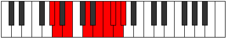
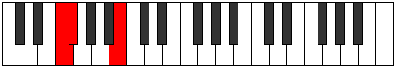

# Mode AFlatGogyllic

## Links

- [Documentation](index.md)
- [Scales Index](Scales.md)
- [Modes Index](Modes.md)
- [Chords Index](Chords.md)

## Scale

[Mixolydyllic](ScaleMixolydyllic.md)

## Mode

[AFlatGogyllic](ModeAFlatGogyllic.md)

## Tonic

Ab

## Signature

[CNaturalMajor]

## Perfection

 - 5 Perfect Notes

 - 3 Imperfect Notes

## Notes

- Ab (Imperfect)
- A
- B
- D
- E
- F (Imperfect)
- Gb (Imperfect)
- G
- Ab (Imperfect)

## Illustration

## Relative Modes

| Number | Mode | Tonic | Notes | Illustration |
|--------|------|-------|-------|--------------|
| [765](https://ianring.com/musictheory/scales/765) | [Mixonyphyllic](ModeMixonyphyllic.md) | D | D, E, F, F#, G, G#, A, B, D |  |
| [1215](https://ianring.com/musictheory/scales/1215) | [Aeolanyllic](ModeAeolanyllic.md) | E | E, F, F#, G, G#, A, B, D, E |  |
| [2025](https://ianring.com/musictheory/scales/2025) | [Mixolydyllic](ModeMixolydyllic.md) | B | B, D, E, F, F#, G, G#, A, B |  |
| [2655](https://ianring.com/musictheory/scales/2655) | [Thocryllic](ModeThocryllic.md) | F | F, F#, G, G#, A, B, D, E, F |  |
| [3375](https://ianring.com/musictheory/scales/3375) | [Kygyllic](ModeKygyllic.md) | F# | F#, G, G#, A, B, D, E, F, F# |  |
| [3375](https://ianring.com/musictheory/scales/3375) | [Kygyllic](ModeKygyllic.md) | Gb | Gb, G, Ab, A, B, D, E, F, Gb |  |
| [3735](https://ianring.com/musictheory/scales/3735) | [Ionagyllic](ModeIonagyllic.md) | G | G, G#, A, B, D, E, F, F#, G |  |
| [3915](https://ianring.com/musictheory/scales/3915) | [Gogyllic](ModeGogyllic.md) | G# | G#, A, B, D, E, F, F#, G, G# |  |
| [3915](https://ianring.com/musictheory/scales/3915) | [Gogyllic](ModeGogyllic.md) | Ab | Ab, A, B, D, E, F, Gb, G, Ab |  |
| [4005](https://ianring.com/musictheory/scales/4005) | [Phradyllic](ModePhradyllic.md) | A | A, B, D, E, F, F#, G, G#, A |  |

## Chords

### Ab

| Number | Root | Name | Notes | Illustration | Audio |
|--------|------|------|-------|--------------|-------|

### A

| Number | Root | Name | Notes | Illustration | Audio |
|--------|------|------|-------|--------------|-------|
| 2564 | A | [Asus2bb5](ChordANaturalSuspendedSecondDoubleFlatFifth.md) | A, B, D |  | [midi](ChordANaturalSuspendedSecondDoubleFlatFifthRootPosition.mid) [ogg](ChordANaturalSuspendedSecondDoubleFlatFifthRootPosition.ogg) |
| 528 | A | [A5](ChordANaturalPowerChord.md) | A, E |  | [midi](ChordANaturalPowerChordRootPosition.mid) [ogg](ChordANaturalPowerChordRootPosition.ogg) |
| 2576 | A | [Asus2](ChordANaturalSuspendedSecond.md) | A, B, E |  | [midi](ChordANaturalSuspendedSecondRootPosition.mid) [ogg](ChordANaturalSuspendedSecondRootPosition.ogg) |
| 532 | A | [Asus4](ChordANaturalSuspendedFourth.md) | A, D, E |  | [midi](ChordANaturalSuspendedFourthRootPosition.mid) [ogg](ChordANaturalSuspendedFourthRootPosition.ogg) |
| 2592 | A | [Asus2#5](ChordANaturalSuspendedSecondSharpFifth.md) | A, B, E# |  | [midi](ChordANaturalSuspendedSecondSharpFifthRootPosition.mid) [ogg](ChordANaturalSuspendedSecondSharpFifthRootPosition.ogg) |
| 548 | A | [Asus4#5](ChordANaturalSuspendedFourthSharpFifth.md) | A, D, E# |  | [midi](ChordANaturalSuspendedFourthSharpFifthRootPosition.mid) [ogg](ChordANaturalSuspendedFourthSharpFifthRootPosition.ogg) |
| 580 | A | [Asus4##5](ChordANaturalSuspendedFourthDoubleSharpFifth.md) | A, D, F# |  | [midi](ChordANaturalSuspendedFourthDoubleSharpFifthRootPosition.mid) [ogg](ChordANaturalSuspendedFourthDoubleSharpFifthRootPosition.ogg) |
| 2628 | A | [AM6sus2bb5](ChordANaturalMajorSixthSuspendedSecondDoubleFlatFifth.md) | A, B, D, F# |  | [midi](ChordANaturalMajorSixthSuspendedSecondDoubleFlatFifthRootPosition.mid) [ogg](ChordANaturalMajorSixthSuspendedSecondDoubleFlatFifthRootPosition.ogg) |
| 2640 | A | [AM6sus2](ChordANaturalMajorSixthSuspendedSecond.md) | A, B, E, F# |  | [midi](ChordANaturalMajorSixthSuspendedSecondRootPosition.mid) [ogg](ChordANaturalMajorSixthSuspendedSecondRootPosition.ogg) |
| 2640 | A | [A7sus2b5](ChordANaturalDominantSeventhSuspendedSecondFlatFifth.md) | A, B, E, Gb |  | [midi](ChordANaturalDominantSeventhSuspendedSecondFlatFifthRootPosition.mid) [ogg](ChordANaturalDominantSeventhSuspendedSecondFlatFifthRootPosition.ogg) |
| 596 | A | [AM6sus4](ChordANaturalMajorSixthSuspendedFourth.md) | A, D, E, F# |  | [midi](ChordANaturalMajorSixthSuspendedFourthRootPosition.mid) [ogg](ChordANaturalMajorSixthSuspendedFourthRootPosition.ogg) |
| 644 | A | [AQ](ChordANaturalQuartal.md) | A, D, G |  | [midi](ChordANaturalQuartalRootPosition.mid) [ogg](ChordANaturalQuartalRootPosition.ogg) |
| 2704 | A | [A7sus2](ChordANaturalDominantSeventhSuspendedSecond.md) | A, B, E, G |  | [midi](ChordANaturalDominantSeventhSuspendedSecondRootPosition.mid) [ogg](ChordANaturalDominantSeventhSuspendedSecondRootPosition.ogg) |
| 2704 | A | [A9sus2](ChordANaturalDominantNinthSuspendedSecond.md) | A, B, E, G, B |  | [midi](ChordANaturalDominantNinthSuspendedSecondRootPosition.mid) [ogg](ChordANaturalDominantNinthSuspendedSecondRootPosition.ogg) |
| 660 | A | [A7sus4](ChordANaturalDominantSeventhSuspendedFourth.md) | A, D, E, G |  | [midi](ChordANaturalDominantSeventhSuspendedFourthRootPosition.mid) [ogg](ChordANaturalDominantSeventhSuspendedFourthRootPosition.ogg) |
| 2708 | A | [A9sus4](ChordANaturalDominantNinthSuspendedFourth.md) | A, D, E, G, B |  | [midi](ChordANaturalDominantNinthSuspendedFourthRootPosition.mid) [ogg](ChordANaturalDominantNinthSuspendedFourthRootPosition.ogg) |
| 772 | A | [AQ+](ChordANaturalQuartalAugmented.md) | A, D, G# |  | [midi](ChordANaturalQuartalAugmentedRootPosition.mid) [ogg](ChordANaturalQuartalAugmentedRootPosition.ogg) |
| 2832 | A | [AM7(sus2)](ChordANaturalMajorSeventhSuspendedSecond.md) | A, B, E, G# |  | [midi](ChordANaturalMajorSeventhSuspendedSecondRootPosition.mid) [ogg](ChordANaturalMajorSeventhSuspendedSecondRootPosition.ogg) |
| 2832 | A | [AM9sus2](ChordANaturalMajorNinthSuspendedSecond.md) | A, B, E, G#, B |  | [midi](ChordANaturalMajorNinthSuspendedSecondRootPosition.mid) [ogg](ChordANaturalMajorNinthSuspendedSecondRootPosition.ogg) |
| 788 | A | [AM7(sus4)](ChordANaturalMajorSeventhSuspendedFourth.md) | A, D, E, G# |  | [midi](ChordANaturalMajorSeventhSuspendedFourthRootPosition.mid) [ogg](ChordANaturalMajorSeventhSuspendedFourthRootPosition.ogg) |
| 2836 | A | [AM9sus4](ChordANaturalMajorNinthSuspendedFourth.md) | A, D, E, G#, B |  | [midi](ChordANaturalMajorNinthSuspendedFourthRootPosition.mid) [ogg](ChordANaturalMajorNinthSuspendedFourthRootPosition.ogg) |
| 804 | A | [AM7(sus4)#5](ChordANaturalMajorSeventhSuspendedFourthSharpFifth.md) | A, D, E#, G# |  | [midi](ChordANaturalMajorSeventhSuspendedFourthSharpFifthRootPosition.mid) [ogg](ChordANaturalMajorSeventhSuspendedFourthSharpFifthRootPosition.ogg) |
| 836 | A | [AM7(sus4)##5](ChordANaturalMajorSeventhSuspendedFourthDoubleSharpFifth.md) | A, D, F#, G# |  | [midi](ChordANaturalMajorSeventhSuspendedFourthDoubleSharpFifthRootPosition.mid) [ogg](ChordANaturalMajorSeventhSuspendedFourthDoubleSharpFifthRootPosition.ogg) |

### B

| Number | Root | Name | Notes | Illustration | Audio |
|--------|------|------|-------|--------------|-------|
| 2068 | B | [Bmbb5](ChordBNaturalMinorDoubleFlatFifth.md) | B, D, E |  | [midi](ChordBNaturalMinorDoubleFlatFifthRootPosition.mid) [ogg](ChordBNaturalMinorDoubleFlatFifthRootPosition.ogg) |
| 2084 | B | [Bo](ChordBNaturalDiminished.md) | B, D, F |  | [midi](ChordBNaturalDiminishedRootPosition.mid) [ogg](ChordBNaturalDiminishedRootPosition.ogg) |
| 2096 | B | [Bsus4b5](ChordBNaturalSuspendedFourthFlatFifth.md) | B, E, F |  | [midi](ChordBNaturalSuspendedFourthFlatFifthRootPosition.mid) [ogg](ChordBNaturalSuspendedFourthFlatFifthRootPosition.ogg) |
| 2112 | B | [B5](ChordBNaturalPowerChord.md) | B, F# |  | [midi](ChordBNaturalPowerChordRootPosition.mid) [ogg](ChordBNaturalPowerChordRootPosition.ogg) |
| 2116 | B | [Bm](ChordBNaturalMinor.md) | B, D, F# |  | [midi](ChordBNaturalMinorRootPosition.mid) [ogg](ChordBNaturalMinorRootPosition.ogg) |
| 2116 | B | [Bm(add(#9))](ChordBNaturalMinorAddSharpNinth.md) | B, D, F#, C## |  | [midi](ChordBNaturalMinorAddSharpNinthRootPosition.mid) [ogg](ChordBNaturalMinorAddSharpNinthRootPosition.ogg) |
| 2128 | B | [Bsus4](ChordBNaturalSuspendedFourth.md) | B, E, F# |  | [midi](ChordBNaturalSuspendedFourthRootPosition.mid) [ogg](ChordBNaturalSuspendedFourthRootPosition.ogg) |
| 2132 | B | [Bm(add11)](ChordBNaturalMinorAddEleventh.md) | B, D, F#, E |  | [midi](ChordBNaturalMinorAddEleventhRootPosition.mid) [ogg](ChordBNaturalMinorAddEleventhRootPosition.ogg) |
| 2132 | B | [Bm(add4)](ChordBNaturalMinorAddFourth.md) | B, D, E, F# |  | [midi](ChordBNaturalMinorAddFourthRootPosition.mid) [ogg](ChordBNaturalMinorAddFourthRootPosition.ogg) |
| 2144 | B | [Blyd](ChordBNaturalLydian.md) | B, E#, F# |  | [midi](ChordBNaturalLydianRootPosition.mid) [ogg](ChordBNaturalLydianRootPosition.ogg) |
| 2148 | B | [Bm(add(#4))](ChordBNaturalMinorAddSharpFourth.md) | B, D, E#, F# |  | [midi](ChordBNaturalMinorAddSharpFourthRootPosition.mid) [ogg](ChordBNaturalMinorAddSharpFourthRootPosition.ogg) |
| 2180 | B | [Bm#5](ChordBNaturalMinorSharpFifth.md) | B, D, G |  | [midi](ChordBNaturalMinorSharpFifthRootPosition.mid) [ogg](ChordBNaturalMinorSharpFifthRootPosition.ogg) |
| 2192 | B | [Bsus4#5](ChordBNaturalSuspendedFourthSharpFifth.md) | B, E, F## |  | [midi](ChordBNaturalSuspendedFourthSharpFifthRootPosition.mid) [ogg](ChordBNaturalSuspendedFourthSharpFifthRootPosition.ogg) |
| 2320 | B | [Bsus4##5](ChordBNaturalSuspendedFourthDoubleSharpFifth.md) | B, E, G# |  | [midi](ChordBNaturalSuspendedFourthDoubleSharpFifthRootPosition.mid) [ogg](ChordBNaturalSuspendedFourthDoubleSharpFifthRootPosition.ogg) |
| 2340 | B | [Bo7](ChordBNaturalFullDiminishedSeventh.md) | B, D, F, Ab |  | [midi](ChordBNaturalFullDiminishedSeventhRootPosition.mid) [ogg](ChordBNaturalFullDiminishedSeventhRootPosition.ogg) |
| 2372 | B | [Bm6](ChordBNaturalMinorSixth.md) | B, D, F#, G# |  | [midi](ChordBNaturalMinorSixthRootPosition.mid) [ogg](ChordBNaturalMinorSixthRootPosition.ogg) |
| 2384 | B | [BM6sus4](ChordBNaturalMajorSixthSuspendedFourth.md) | B, E, F#, G# |  | [midi](ChordBNaturalMajorSixthSuspendedFourthRootPosition.mid) [ogg](ChordBNaturalMajorSixthSuspendedFourthRootPosition.ogg) |
| 2576 | B | [BQ](ChordBNaturalQuartal.md) | B, E, A |  | [midi](ChordBNaturalQuartalRootPosition.mid) [ogg](ChordBNaturalQuartalRootPosition.ogg) |
| 2580 | B | [Bm7bb5](ChordBNaturalMinorSeventhDoubleFlatFifth.md) | B, D, E, A |  | [midi](ChordBNaturalMinorSeventhDoubleFlatFifthRootPosition.mid) [ogg](ChordBNaturalMinorSeventhDoubleFlatFifthRootPosition.ogg) |
| 2596 | B | [Bø7](ChordBNaturalHalfDiminishedSeventh.md) | B, D, F, A |  | [midi](ChordBNaturalHalfDiminishedSeventhRootPosition.mid) [ogg](ChordBNaturalHalfDiminishedSeventhRootPosition.ogg) |
| 2628 | B | [Bm7](ChordBNaturalMinorSeventh.md) | B, D, F#, A |  | [midi](ChordBNaturalMinorSeventhRootPosition.mid) [ogg](ChordBNaturalMinorSeventhRootPosition.ogg) |
| 2640 | B | [B7sus4](ChordBNaturalDominantSeventhSuspendedFourth.md) | B, E, F#, A |  | [midi](ChordBNaturalDominantSeventhSuspendedFourthRootPosition.mid) [ogg](ChordBNaturalDominantSeventhSuspendedFourthRootPosition.ogg) |
| 2644 | B | [Bm7add11](ChordBNaturalMinorSeventhAddEleventh.md) | B, D, F#, A, E |  | [midi](ChordBNaturalMinorSeventhAddEleventhRootPosition.mid) [ogg](ChordBNaturalMinorSeventhAddEleventhRootPosition.ogg) |
| 2660 | B | [Bm7add(#11)](ChordBNaturalMinorSeventhAddSharpEleventh.md) | B, D, F#, A, E# |  | [midi](ChordBNaturalMinorSeventhAddSharpEleventhRootPosition.mid) [ogg](ChordBNaturalMinorSeventhAddSharpEleventhRootPosition.ogg) |
| 2692 | B | [Bm7#5](ChordBNaturalMinorSeventhSharpFifth.md) | B, D, F##, A |  | [midi](ChordBNaturalMinorSeventhSharpFifthRootPosition.mid) [ogg](ChordBNaturalMinorSeventhSharpFifthRootPosition.ogg) |
| 2884 | B | [Bm7add13](ChordBNaturalMinorSeventhAddThirteenth.md) | B, D, F#, A, G# |  | [midi](ChordBNaturalMinorSeventhAddThirteenthRootPosition.mid) [ogg](ChordBNaturalMinorSeventhAddThirteenthRootPosition.ogg) |

### D

| Number | Root | Name | Notes | Illustration | Audio |
|--------|------|------|-------|--------------|-------|
| 148 | D | [Dsus2bb5](ChordDNaturalSuspendedSecondDoubleFlatFifth.md) | D, E, G |  | [midi](ChordDNaturalSuspendedSecondDoubleFlatFifthRootPosition.mid) [ogg](ChordDNaturalSuspendedSecondDoubleFlatFifthRootPosition.ogg) |
| 164 | D | [Dmbb5](ChordDNaturalMinorDoubleFlatFifth.md) | D, F, G |  | [midi](ChordDNaturalMinorDoubleFlatFifthRootPosition.mid) [ogg](ChordDNaturalMinorDoubleFlatFifthRootPosition.ogg) |
| 276 | D | [Dsus2b5](ChordDNaturalSuspendedSecondFlatFifth.md) | D, E, Ab |  | [midi](ChordDNaturalSuspendedSecondFlatFifthRootPosition.mid) [ogg](ChordDNaturalSuspendedSecondFlatFifthRootPosition.ogg) |
| 292 | D | [Do](ChordDNaturalDiminished.md) | D, F, Ab |  | [midi](ChordDNaturalDiminishedRootPosition.mid) [ogg](ChordDNaturalDiminishedRootPosition.ogg) |
| 324 | D | [DMb5](ChordDNaturalMajorFlatFifth.md) | D, F#, Ab |  | [midi](ChordDNaturalMajorFlatFifthRootPosition.mid) [ogg](ChordDNaturalMajorFlatFifthRootPosition.ogg) |
| 388 | D | [Dsus4b5](ChordDNaturalSuspendedFourthFlatFifth.md) | D, G, Ab |  | [midi](ChordDNaturalSuspendedFourthFlatFifthRootPosition.mid) [ogg](ChordDNaturalSuspendedFourthFlatFifthRootPosition.ogg) |
| 516 | D | [D5](ChordDNaturalPowerChord.md) | D, A |  | [midi](ChordDNaturalPowerChordRootPosition.mid) [ogg](ChordDNaturalPowerChordRootPosition.ogg) |
| 532 | D | [Dsus2](ChordDNaturalSuspendedSecond.md) | D, E, A |  | [midi](ChordDNaturalSuspendedSecondRootPosition.mid) [ogg](ChordDNaturalSuspendedSecondRootPosition.ogg) |
| 548 | D | [Dm](ChordDNaturalMinor.md) | D, F, A |  | [midi](ChordDNaturalMinorRootPosition.mid) [ogg](ChordDNaturalMinorRootPosition.ogg) |
| 548 | D | [Dm(add(#9))](ChordDNaturalMinorAddSharpNinth.md) | D, F, A, E# |  | [midi](ChordDNaturalMinorAddSharpNinthRootPosition.mid) [ogg](ChordDNaturalMinorAddSharpNinthRootPosition.ogg) |
| 564 | D | [Dm(add9)](ChordDNaturalMinorAddNinth.md) | D, F, A, E |  | [midi](ChordDNaturalMinorAddNinthRootPosition.mid) [ogg](ChordDNaturalMinorAddNinthRootPosition.ogg) |
| 580 | D | [DM](ChordDNaturalMajor.md) | D, F#, A |  | [midi](ChordDNaturalMajorRootPosition.mid) [ogg](ChordDNaturalMajorRootPosition.ogg) |
| 596 | D | [DM(add9)](ChordDNaturalMajorAddNinth.md) | D, F#, A, E |  | [midi](ChordDNaturalMajorAddNinthRootPosition.mid) [ogg](ChordDNaturalMajorAddNinthRootPosition.ogg) |
| 612 | D | [DM(add(#9))](ChordDNaturalMajorAddSharpNinth.md) | D, F#, A, E# |  | [midi](ChordDNaturalMajorAddSharpNinthRootPosition.mid) [ogg](ChordDNaturalMajorAddSharpNinthRootPosition.ogg) |
| 644 | D | [Dsus4](ChordDNaturalSuspendedFourth.md) | D, G, A |  | [midi](ChordDNaturalSuspendedFourthRootPosition.mid) [ogg](ChordDNaturalSuspendedFourthRootPosition.ogg) |
| 676 | D | [Dm(add11)](ChordDNaturalMinorAddEleventh.md) | D, F, A, G |  | [midi](ChordDNaturalMinorAddEleventhRootPosition.mid) [ogg](ChordDNaturalMinorAddEleventhRootPosition.ogg) |
| 676 | D | [Dm(add4)](ChordDNaturalMinorAddFourth.md) | D, F, G, A |  | [midi](ChordDNaturalMinorAddFourthRootPosition.mid) [ogg](ChordDNaturalMinorAddFourthRootPosition.ogg) |
| 708 | D | [DM(add11)](ChordDNaturalMajorAddEleventh.md) | D, F#, A, G |  | [midi](ChordDNaturalMajorAddEleventhRootPosition.mid) [ogg](ChordDNaturalMajorAddEleventhRootPosition.ogg) |
| 708 | D | [DM(add4)](ChordDNaturalMajorAddFourth.md) | D, F#, G, A |  | [midi](ChordDNaturalMajorAddFourthRootPosition.mid) [ogg](ChordDNaturalMajorAddFourthRootPosition.ogg) |
| 772 | D | [Dlyd](ChordDNaturalLydian.md) | D, G#, A |  | [midi](ChordDNaturalLydianRootPosition.mid) [ogg](ChordDNaturalLydianRootPosition.ogg) |
| 804 | D | [Dm(add(#4))](ChordDNaturalMinorAddSharpFourth.md) | D, F, G#, A |  | [midi](ChordDNaturalMinorAddSharpFourthRootPosition.mid) [ogg](ChordDNaturalMinorAddSharpFourthRootPosition.ogg) |
| 836 | D | [DM(add(#4))](ChordDNaturalMajorAddSharpFourth.md) | D, F#, G#, A |  | [midi](ChordDNaturalMajorAddSharpFourthRootPosition.mid) [ogg](ChordDNaturalMajorAddSharpFourthRootPosition.ogg) |
| 2116 | D | [DM##5](ChordDNaturalMajorDoubleSharpFifth.md) | D, F#, B |  | [midi](ChordDNaturalMajorDoubleSharpFifthRootPosition.mid) [ogg](ChordDNaturalMajorDoubleSharpFifthRootPosition.ogg) |
| 2180 | D | [Dsus4##5](ChordDNaturalSuspendedFourthDoubleSharpFifth.md) | D, G, B |  | [midi](ChordDNaturalSuspendedFourthDoubleSharpFifthRootPosition.mid) [ogg](ChordDNaturalSuspendedFourthDoubleSharpFifthRootPosition.ogg) |
| 2196 | D | [DM6sus2bb5](ChordDNaturalMajorSixthSuspendedSecondDoubleFlatFifth.md) | D, E, G, B |  | [midi](ChordDNaturalMajorSixthSuspendedSecondDoubleFlatFifthRootPosition.mid) [ogg](ChordDNaturalMajorSixthSuspendedSecondDoubleFlatFifthRootPosition.ogg) |
| 2324 | D | [DM6sus2b5](ChordDNaturalMajorSixthSuspendedSecondFlatFifth.md) | D, E, Ab, B |  | [midi](ChordDNaturalMajorSixthSuspendedSecondFlatFifthRootPosition.mid) [ogg](ChordDNaturalMajorSixthSuspendedSecondFlatFifthRootPosition.ogg) |
| 2340 | D | [Do7](ChordDNaturalFullDiminishedSeventh.md) | D, F, Ab, Cb |  | [midi](ChordDNaturalFullDiminishedSeventhRootPosition.mid) [ogg](ChordDNaturalFullDiminishedSeventhRootPosition.ogg) |
| 2372 | D | [DM6b5](ChordDNaturalMajorSixthFlatFifth.md) | D, F#, Ab, B |  | [midi](ChordDNaturalMajorSixthFlatFifthRootPosition.mid) [ogg](ChordDNaturalMajorSixthFlatFifthRootPosition.ogg) |
| 2580 | D | [DM6sus2](ChordDNaturalMajorSixthSuspendedSecond.md) | D, E, A, B |  | [midi](ChordDNaturalMajorSixthSuspendedSecondRootPosition.mid) [ogg](ChordDNaturalMajorSixthSuspendedSecondRootPosition.ogg) |
| 2580 | D | [D7sus2b5](ChordDNaturalDominantSeventhSuspendedSecondFlatFifth.md) | D, E, A, Cb |  | [midi](ChordDNaturalDominantSeventhSuspendedSecondFlatFifthRootPosition.mid) [ogg](ChordDNaturalDominantSeventhSuspendedSecondFlatFifthRootPosition.ogg) |
| 2596 | D | [Dm6](ChordDNaturalMinorSixth.md) | D, F, A, B |  | [midi](ChordDNaturalMinorSixthRootPosition.mid) [ogg](ChordDNaturalMinorSixthRootPosition.ogg) |
| 2612 | D | [Dm6(add9)](ChordDNaturalMinorSixthAddNinth.md) | D, F, A, B, E |  | [midi](ChordDNaturalMinorSixthAddNinthRootPosition.mid) [ogg](ChordDNaturalMinorSixthAddNinthRootPosition.ogg) |
| 2628 | D | [DM6](ChordDNaturalMajorSixth.md) | D, F#, A, B |  | [midi](ChordDNaturalMajorSixthRootPosition.mid) [ogg](ChordDNaturalMajorSixthRootPosition.ogg) |
| 2644 | D | [DM6(add9)](ChordDNaturalMajorSixthAddNinth.md) | D, F#, A, B, E |  | [midi](ChordDNaturalMajorSixthAddNinthRootPosition.mid) [ogg](ChordDNaturalMajorSixthAddNinthRootPosition.ogg) |
| 2692 | D | [DM6sus4](ChordDNaturalMajorSixthSuspendedFourth.md) | D, G, A, B |  | [midi](ChordDNaturalMajorSixthSuspendedFourthRootPosition.mid) [ogg](ChordDNaturalMajorSixthSuspendedFourthRootPosition.ogg) |

### E

| Number | Root | Name | Notes | Illustration | Audio |
|--------|------|------|-------|--------------|-------|
| 592 | E | [Esus2bb5](ChordENaturalSuspendedSecondDoubleFlatFifth.md) | E, F#, A |  | [midi](ChordENaturalSuspendedSecondDoubleFlatFifthRootPosition.mid) [ogg](ChordENaturalSuspendedSecondDoubleFlatFifthRootPosition.ogg) |
| 656 | E | [Embb5](ChordENaturalMinorDoubleFlatFifth.md) | E, G, A |  | [midi](ChordENaturalMinorDoubleFlatFifthRootPosition.mid) [ogg](ChordENaturalMinorDoubleFlatFifthRootPosition.ogg) |
| 2064 | E | [E5](ChordENaturalPowerChord.md) | E, B |  | [midi](ChordENaturalPowerChordRootPosition.mid) [ogg](ChordENaturalPowerChordRootPosition.ogg) |
| 2096 | E | [Ephryg](ChordENaturalPhrygian.md) | E, F, B |  | [midi](ChordENaturalPhrygianRootPosition.mid) [ogg](ChordENaturalPhrygianRootPosition.ogg) |
| 2128 | E | [Esus2](ChordENaturalSuspendedSecond.md) | E, F#, B |  | [midi](ChordENaturalSuspendedSecondRootPosition.mid) [ogg](ChordENaturalSuspendedSecondRootPosition.ogg) |
| 2192 | E | [Em](ChordENaturalMinor.md) | E, G, B |  | [midi](ChordENaturalMinorRootPosition.mid) [ogg](ChordENaturalMinorRootPosition.ogg) |
| 2192 | E | [Em(add(#9))](ChordENaturalMinorAddSharpNinth.md) | E, G, B, F## |  | [midi](ChordENaturalMinorAddSharpNinthRootPosition.mid) [ogg](ChordENaturalMinorAddSharpNinthRootPosition.ogg) |
| 2256 | E | [Em(add9)](ChordENaturalMinorAddNinth.md) | E, G, B, F# |  | [midi](ChordENaturalMinorAddNinthRootPosition.mid) [ogg](ChordENaturalMinorAddNinthRootPosition.ogg) |
| 2320 | E | [EM](ChordENaturalMajor.md) | E, G#, B |  | [midi](ChordENaturalMajorRootPosition.mid) [ogg](ChordENaturalMajorRootPosition.ogg) |
| 2384 | E | [EM(add9)](ChordENaturalMajorAddNinth.md) | E, G#, B, F# |  | [midi](ChordENaturalMajorAddNinthRootPosition.mid) [ogg](ChordENaturalMajorAddNinthRootPosition.ogg) |
| 2448 | E | [EM(add(#9))](ChordENaturalMajorAddSharpNinth.md) | E, G#, B, F## |  | [midi](ChordENaturalMajorAddSharpNinthRootPosition.mid) [ogg](ChordENaturalMajorAddSharpNinthRootPosition.ogg) |
| 2576 | E | [Esus4](ChordENaturalSuspendedFourth.md) | E, A, B |  | [midi](ChordENaturalSuspendedFourthRootPosition.mid) [ogg](ChordENaturalSuspendedFourthRootPosition.ogg) |
| 2704 | E | [Em(add11)](ChordENaturalMinorAddEleventh.md) | E, G, B, A |  | [midi](ChordENaturalMinorAddEleventhRootPosition.mid) [ogg](ChordENaturalMinorAddEleventhRootPosition.ogg) |
| 2704 | E | [Em(add4)](ChordENaturalMinorAddFourth.md) | E, G, A, B |  | [midi](ChordENaturalMinorAddFourthRootPosition.mid) [ogg](ChordENaturalMinorAddFourthRootPosition.ogg) |
| 2832 | E | [EM(add11)](ChordENaturalMajorAddEleventh.md) | E, G#, B, A |  | [midi](ChordENaturalMajorAddEleventhRootPosition.mid) [ogg](ChordENaturalMajorAddEleventhRootPosition.ogg) |
| 2832 | E | [EM(add4)](ChordENaturalMajorAddFourth.md) | E, G#, A, B |  | [midi](ChordENaturalMajorAddFourthRootPosition.mid) [ogg](ChordENaturalMajorAddFourthRootPosition.ogg) |
| 532 | E | [EQ](ChordENaturalQuartal.md) | E, A, D |  | [midi](ChordENaturalQuartalRootPosition.mid) [ogg](ChordENaturalQuartalRootPosition.ogg) |
| 660 | E | [Em7bb5](ChordENaturalMinorSeventhDoubleFlatFifth.md) | E, G, A, D |  | [midi](ChordENaturalMinorSeventhDoubleFlatFifthRootPosition.mid) [ogg](ChordENaturalMinorSeventhDoubleFlatFifthRootPosition.ogg) |
| 2132 | E | [E7sus2](ChordENaturalDominantSeventhSuspendedSecond.md) | E, F#, B, D |  | [midi](ChordENaturalDominantSeventhSuspendedSecondRootPosition.mid) [ogg](ChordENaturalDominantSeventhSuspendedSecondRootPosition.ogg) |
| 2132 | E | [E9sus2](ChordENaturalDominantNinthSuspendedSecond.md) | E, F#, B, D, F# |  | [midi](ChordENaturalDominantNinthSuspendedSecondRootPosition.mid) [ogg](ChordENaturalDominantNinthSuspendedSecondRootPosition.ogg) |
| 2196 | E | [Em7](ChordENaturalMinorSeventh.md) | E, G, B, D |  | [midi](ChordENaturalMinorSeventhRootPosition.mid) [ogg](ChordENaturalMinorSeventhRootPosition.ogg) |
| 2228 | E | [Em7b9](ChordENaturalMinorSeventhFlatNinth.md) | E, G, B, D, F |  | [midi](ChordENaturalMinorSeventhFlatNinthRootPosition.mid) [ogg](ChordENaturalMinorSeventhFlatNinthRootPosition.ogg) |
| 2260 | E | [Em9](ChordENaturalMinorNinth.md) | E, G, B, D, F# |  | [midi](ChordENaturalMinorNinthRootPosition.mid) [ogg](ChordENaturalMinorNinthRootPosition.ogg) |
| 2324 | E | [E7](ChordENaturalDominantSeventh.md) | E, G#, B, D |  | [midi](ChordENaturalDominantSeventhRootPosition.mid) [ogg](ChordENaturalDominantSeventhRootPosition.ogg) |
| 2356 | E | [E7b9](ChordENaturalDominantSeventhFlatNinth.md) | E, G#, B, D, F |  | [midi](ChordENaturalDominantSeventhFlatNinthRootPosition.mid) [ogg](ChordENaturalDominantSeventhFlatNinthRootPosition.ogg) |
| 2388 | E | [E9](ChordENaturalDominantNinth.md) | E, G#, B, D, F# |  | [midi](ChordENaturalDominantNinthRootPosition.mid) [ogg](ChordENaturalDominantNinthRootPosition.ogg) |
| 2452 | E | [E7#9](ChordENaturalDominantSeventhSharpNinth.md) | E, G#, B, D, F## |  | [midi](ChordENaturalDominantSeventhSharpNinthRootPosition.mid) [ogg](ChordENaturalDominantSeventhSharpNinthRootPosition.ogg) |
| 2580 | E | [E7sus4](ChordENaturalDominantSeventhSuspendedFourth.md) | E, A, B, D |  | [midi](ChordENaturalDominantSeventhSuspendedFourthRootPosition.mid) [ogg](ChordENaturalDominantSeventhSuspendedFourthRootPosition.ogg) |
| 2644 | E | [E9sus4](ChordENaturalDominantNinthSuspendedFourth.md) | E, A, B, D, F# |  | [midi](ChordENaturalDominantNinthSuspendedFourthRootPosition.mid) [ogg](ChordENaturalDominantNinthSuspendedFourthRootPosition.ogg) |
| 2708 | E | [Em7add11](ChordENaturalMinorSeventhAddEleventh.md) | E, G, B, D, A |  | [midi](ChordENaturalMinorSeventhAddEleventhRootPosition.mid) [ogg](ChordENaturalMinorSeventhAddEleventhRootPosition.ogg) |
| 2772 | E | [Em11](ChordENaturalMinorEleventh.md) | E, G, B, D, F#, A |  | [midi](ChordENaturalMinorEleventhRootPosition.mid) [ogg](ChordENaturalMinorEleventhRootPosition.ogg) |
| 2836 | E | [E7add4](ChordENaturalDominantSeventhAddFourth.md) | E, G#, A, B, D |  | [midi](ChordENaturalDominantSeventhAddFourthRootPosition.mid) [ogg](ChordENaturalDominantSeventhAddFourthRootPosition.ogg) |
| 2836 | E | [E7add11](ChordENaturalDominantSeventhAddEleventh.md) | E, G#, B, D, A |  | [midi](ChordENaturalDominantSeventhAddEleventhRootPosition.mid) [ogg](ChordENaturalDominantSeventhAddEleventhRootPosition.ogg) |
| 2900 | E | [E11](ChordENaturalDominantEleventh.md) | E, G#, B, D, F#, A |  | [midi](ChordENaturalDominantEleventhRootPosition.mid) [ogg](ChordENaturalDominantEleventhRootPosition.ogg) |

### F

| Number | Root | Name | Notes | Illustration | Audio |
|--------|------|------|-------|--------------|-------|
| 2144 | F | [Floc](ChordFNaturalLocrian.md) | F, Gb, Cb |  | [midi](ChordFNaturalLocrianRootPosition.mid) [ogg](ChordFNaturalLocrianRootPosition.ogg) |
| 2208 | F | [Fsus2b5](ChordFNaturalSuspendedSecondFlatFifth.md) | F, G, Cb |  | [midi](ChordFNaturalSuspendedSecondFlatFifthRootPosition.mid) [ogg](ChordFNaturalSuspendedSecondFlatFifthRootPosition.ogg) |
| 2336 | F | [Fo](ChordFNaturalDiminished.md) | F, Ab, Cb |  | [midi](ChordFNaturalDiminishedRootPosition.mid) [ogg](ChordFNaturalDiminishedRootPosition.ogg) |
| 2592 | F | [FMb5](ChordFNaturalMajorFlatFifth.md) | F, A, Cb |  | [midi](ChordFNaturalMajorFlatFifthRootPosition.mid) [ogg](ChordFNaturalMajorFlatFifthRootPosition.ogg) |
| 548 | F | [FM##5](ChordFNaturalMajorDoubleSharpFifth.md) | F, A, D |  | [midi](ChordFNaturalMajorDoubleSharpFifthRootPosition.mid) [ogg](ChordFNaturalMajorDoubleSharpFifthRootPosition.ogg) |
| 2212 | F | [FM6sus2b5](ChordFNaturalMajorSixthSuspendedSecondFlatFifth.md) | F, G, Cb, D |  | [midi](ChordFNaturalMajorSixthSuspendedSecondFlatFifthRootPosition.mid) [ogg](ChordFNaturalMajorSixthSuspendedSecondFlatFifthRootPosition.ogg) |
| 2340 | F | [Fo7](ChordFNaturalFullDiminishedSeventh.md) | F, Ab, Cb, Ebb |  | [midi](ChordFNaturalFullDiminishedSeventhRootPosition.mid) [ogg](ChordFNaturalFullDiminishedSeventhRootPosition.ogg) |
| 2596 | F | [FM6b5](ChordFNaturalMajorSixthFlatFifth.md) | F, A, Cb, D |  | [midi](ChordFNaturalMajorSixthFlatFifthRootPosition.mid) [ogg](ChordFNaturalMajorSixthFlatFifthRootPosition.ogg) |
| 2352 | F | [FoM7](ChordFNaturalDiminishedMajorSeventh.md) | F, Ab, Cb, E |  | [midi](ChordFNaturalDiminishedMajorSeventhRootPosition.mid) [ogg](ChordFNaturalDiminishedMajorSeventhRootPosition.ogg) |
| 2608 | F | [FM7b5](ChordFNaturalMajorSeventhFlatFifth.md) | F, A, Cb, E |  | [midi](ChordFNaturalMajorSeventhFlatFifthRootPosition.mid) [ogg](ChordFNaturalMajorSeventhFlatFifthRootPosition.ogg) |
| 564 | F | [FM7##5](ChordFNaturalMajorSeventhDoubleSharpFifth.md) | F, A, D, E |  | [midi](ChordFNaturalMajorSeventhDoubleSharpFifthRootPosition.mid) [ogg](ChordFNaturalMajorSeventhDoubleSharpFifthRootPosition.ogg) |

### Gb

| Number | Root | Name | Notes | Illustration | Audio |
|--------|------|------|-------|--------------|-------|

### G

| Number | Root | Name | Notes | Illustration | Audio |
|--------|------|------|-------|--------------|-------|
| 132 | G | [G5](ChordGNaturalPowerChord.md) | G, D |  | [midi](ChordGNaturalPowerChordRootPosition.mid) [ogg](ChordGNaturalPowerChordRootPosition.ogg) |
| 388 | G | [Gphryg](ChordGNaturalPhrygian.md) | G, Ab, D |  | [midi](ChordGNaturalPhrygianRootPosition.mid) [ogg](ChordGNaturalPhrygianRootPosition.ogg) |
| 644 | G | [Gsus2](ChordGNaturalSuspendedSecond.md) | G, A, D |  | [midi](ChordGNaturalSuspendedSecondRootPosition.mid) [ogg](ChordGNaturalSuspendedSecondRootPosition.ogg) |
| 2180 | G | [GM](ChordGNaturalMajor.md) | G, B, D |  | [midi](ChordGNaturalMajorRootPosition.mid) [ogg](ChordGNaturalMajorRootPosition.ogg) |
| 2692 | G | [GM(add9)](ChordGNaturalMajorAddNinth.md) | G, B, D, A |  | [midi](ChordGNaturalMajorAddNinthRootPosition.mid) [ogg](ChordGNaturalMajorAddNinthRootPosition.ogg) |
| 2192 | G | [GM##5](ChordGNaturalMajorDoubleSharpFifth.md) | G, B, E |  | [midi](ChordGNaturalMajorDoubleSharpFifthRootPosition.mid) [ogg](ChordGNaturalMajorDoubleSharpFifthRootPosition.ogg) |
| 660 | G | [GM6sus2](ChordGNaturalMajorSixthSuspendedSecond.md) | G, A, D, E |  | [midi](ChordGNaturalMajorSixthSuspendedSecondRootPosition.mid) [ogg](ChordGNaturalMajorSixthSuspendedSecondRootPosition.ogg) |
| 660 | G | [G7sus2b5](ChordGNaturalDominantSeventhSuspendedSecondFlatFifth.md) | G, A, D, Fb |  | [midi](ChordGNaturalDominantSeventhSuspendedSecondFlatFifthRootPosition.mid) [ogg](ChordGNaturalDominantSeventhSuspendedSecondFlatFifthRootPosition.ogg) |
| 2196 | G | [GM6](ChordGNaturalMajorSixth.md) | G, B, D, E |  | [midi](ChordGNaturalMajorSixthRootPosition.mid) [ogg](ChordGNaturalMajorSixthRootPosition.ogg) |
| 2452 | G | [GM6(addb9)](ChordGNaturalMajorSixthAddFlatNinth.md) | G, B, D, E, Ab |  | [midi](ChordGNaturalMajorSixthAddFlatNinthRootPosition.mid) [ogg](ChordGNaturalMajorSixthAddFlatNinthRootPosition.ogg) |
| 2708 | G | [GM6(add9)](ChordGNaturalMajorSixthAddNinth.md) | G, B, D, E, A |  | [midi](ChordGNaturalMajorSixthAddNinthRootPosition.mid) [ogg](ChordGNaturalMajorSixthAddNinthRootPosition.ogg) |
| 676 | G | [G7sus2](ChordGNaturalDominantSeventhSuspendedSecond.md) | G, A, D, F |  | [midi](ChordGNaturalDominantSeventhSuspendedSecondRootPosition.mid) [ogg](ChordGNaturalDominantSeventhSuspendedSecondRootPosition.ogg) |
| 676 | G | [G9sus2](ChordGNaturalDominantNinthSuspendedSecond.md) | G, A, D, F, A |  | [midi](ChordGNaturalDominantNinthSuspendedSecondRootPosition.mid) [ogg](ChordGNaturalDominantNinthSuspendedSecondRootPosition.ogg) |
| 2212 | G | [G7](ChordGNaturalDominantSeventh.md) | G, B, D, F |  | [midi](ChordGNaturalDominantSeventhRootPosition.mid) [ogg](ChordGNaturalDominantSeventhRootPosition.ogg) |
| 2468 | G | [G7b9](ChordGNaturalDominantSeventhFlatNinth.md) | G, B, D, F, Ab |  | [midi](ChordGNaturalDominantSeventhFlatNinthRootPosition.mid) [ogg](ChordGNaturalDominantSeventhFlatNinthRootPosition.ogg) |
| 2724 | G | [G9](ChordGNaturalDominantNinth.md) | G, B, D, F, A |  | [midi](ChordGNaturalDominantNinthRootPosition.mid) [ogg](ChordGNaturalDominantNinthRootPosition.ogg) |
| 2228 | G | [G7add13](ChordGNaturalDominantSeventhAddThirteenth.md) | G, B, D, F, E |  | [midi](ChordGNaturalDominantSeventhAddThirteenthRootPosition.mid) [ogg](ChordGNaturalDominantSeventhAddThirteenthRootPosition.ogg) |
| 452 | G | [Gphryg+7](ChordGNaturalPhrygianAddSeventh.md) | G, Ab, D, F# |  | [midi](ChordGNaturalPhrygianAddSeventhRootPosition.mid) [ogg](ChordGNaturalPhrygianAddSeventhRootPosition.ogg) |
| 708 | G | [GM7(sus2)](ChordGNaturalMajorSeventhSuspendedSecond.md) | G, A, D, F# |  | [midi](ChordGNaturalMajorSeventhSuspendedSecondRootPosition.mid) [ogg](ChordGNaturalMajorSeventhSuspendedSecondRootPosition.ogg) |
| 708 | G | [GM9sus2](ChordGNaturalMajorNinthSuspendedSecond.md) | G, A, D, F#, A |  | [midi](ChordGNaturalMajorNinthSuspendedSecondRootPosition.mid) [ogg](ChordGNaturalMajorNinthSuspendedSecondRootPosition.ogg) |
| 2244 | G | [GM7](ChordGNaturalMajorSeventh.md) | G, B, D, F# |  | [midi](ChordGNaturalMajorSeventhRootPosition.mid) [ogg](ChordGNaturalMajorSeventhRootPosition.ogg) |
| 2756 | G | [GM9](ChordGNaturalMajorNinth.md) | G, B, D, F#, A |  | [midi](ChordGNaturalMajorNinthRootPosition.mid) [ogg](ChordGNaturalMajorNinthRootPosition.ogg) |
| 2256 | G | [GM7##5](ChordGNaturalMajorSeventhDoubleSharpFifth.md) | G, B, E, F# |  | [midi](ChordGNaturalMajorSeventhDoubleSharpFifthRootPosition.mid) [ogg](ChordGNaturalMajorSeventhDoubleSharpFifthRootPosition.ogg) |
| 2260 | G | [GM7add13](ChordGNaturalMajorSeventhAddThirteenth.md) | G, B, D, F#, E |  | [midi](ChordGNaturalMajorSeventhAddThirteenthRootPosition.mid) [ogg](ChordGNaturalMajorSeventhAddThirteenthRootPosition.ogg) |

