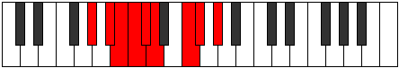

# Mode AFlatGonyllic

## Links

- [Documentation](README.md)
- [Scales Index](Scales.md)
- [Modes Index](Modes.md)
- [Chords Index](Chords.md)

## Scale

[Aeolothyllic](ScaleAeolothyllic.md)

## Mode

[AFlatGonyllic](ModeAFlatGonyllic.md)

## Tonic

Ab

## Signature

[CNaturalMajor]

## Transposition

2, 1, 1, 1, 1, 3, 1, 2

## Chord Pattern

iii⁰b3, iv⁰b3, V, VI⁺, vii⁰, VIIIb5

## Perfection

 - 5 Perfect Notes

 - 3 Imperfect Notes

## Notes

- Ab (Imperfect)
- Bb
- B
- C (Imperfect)
- Db
- D (Imperfect)
- F
- Gb
- Ab (Imperfect)

## Illustration

## Diagram

| Circle of Fifth | Chromatic Circle |
|-----------------|------------------|
|  |  |
## Relative Modes

| Number | Mode | Tonic | Notes | Illustration |
|--------|------|-------|-------|--------------|
| [1661](https://ianring.com/musictheory/scales/1661) | [Gonyllic](ModeGonyllic.md) | G# | G#, A#, B, C, C#, D, F, F#, G# |  |
| [1661](https://ianring.com/musictheory/scales/1661) | [Gonyllic](ModeGonyllic.md) | Ab | Ab, Bb, B, C, Db, D, F, Gb, Ab |  |
| [1439](https://ianring.com/musictheory/scales/1439) | [Rolyllic](ModeRolyllic.md) | A# | A#, B, C, C#, D, F, F#, G#, A# |  |
| [1439](https://ianring.com/musictheory/scales/1439) | [Rolyllic](ModeRolyllic.md) | Bb | Bb, B, C, Db, D, F, Gb, Ab, Bb |  |
| [2767](https://ianring.com/musictheory/scales/2767) | [Katydyllic](ModeKatydyllic.md) | B | B, C, C#, D, F, F#, G#, A#, B |  |
| [3431](https://ianring.com/musictheory/scales/3431) | [Zyptyllic](ModeZyptyllic.md) | C | C, C#, D, F, F#, G#, A#, B, C |  |
| [3763](https://ianring.com/musictheory/scales/3763) | [Modyllic](ModeModyllic.md) | C# | C#, D, F, F#, G#, A#, B, C, C# |  |
| [3763](https://ianring.com/musictheory/scales/3763) | [Modyllic](ModeModyllic.md) | Db | Db, D, F, Gb, Ab, Bb, B, C, Db |  |
| [3929](https://ianring.com/musictheory/scales/3929) | [Aeolothyllic](ModeAeolothyllic.md) | D | D, F, F#, G#, A#, B, C, C#, D |  |
| [1003](https://ianring.com/musictheory/scales/1003) | [Ionyryllic](ModeIonyryllic.md) | F | F, F#, G#, A#, B, C, C#, D, F |  |
| [2549](https://ianring.com/musictheory/scales/2549) | [Rydyllic](ModeRydyllic.md) | F# | F#, G#, A#, B, C, C#, D, F, F# |  |
| [2549](https://ianring.com/musictheory/scales/2549) | [Rydyllic](ModeRydyllic.md) | Gb | Gb, Ab, Bb, B, C, Db, D, F, Gb |  |
## Relative Brightness

| Number | Mode | Tonic | Notes | Circle Of Fifth | Chromatic Circle |
|--------|------|-------|-------|-----------------|------------------|
| [1661](https://ianring.com/musictheory/scales/1661) | [Gonyllic](ModeGonyllic.md) | G# | G#, A#, B, C, C#, D, F, F#, G# |  |  |
| [1661](https://ianring.com/musictheory/scales/1661) | [Gonyllic](ModeGonyllic.md) | Ab | Ab, Bb, B, C, Db, D, F, Gb, Ab |  |  |
| [1439](https://ianring.com/musictheory/scales/1439) | [Rolyllic](ModeRolyllic.md) | A# | A#, B, C, C#, D, F, F#, G#, A# |  |  |
| [1439](https://ianring.com/musictheory/scales/1439) | [Rolyllic](ModeRolyllic.md) | Bb | Bb, B, C, Db, D, F, Gb, Ab, Bb |  |  |
| [2767](https://ianring.com/musictheory/scales/2767) | [Katydyllic](ModeKatydyllic.md) | B | B, C, C#, D, F, F#, G#, A#, B |  |  |
| [3431](https://ianring.com/musictheory/scales/3431) | [Zyptyllic](ModeZyptyllic.md) | C | C, C#, D, F, F#, G#, A#, B, C |  |  |
| [3763](https://ianring.com/musictheory/scales/3763) | [Modyllic](ModeModyllic.md) | C# | C#, D, F, F#, G#, A#, B, C, C# |  |  |
| [3763](https://ianring.com/musictheory/scales/3763) | [Modyllic](ModeModyllic.md) | Db | Db, D, F, Gb, Ab, Bb, B, C, Db |  |  |
| [3929](https://ianring.com/musictheory/scales/3929) | [Aeolothyllic](ModeAeolothyllic.md) | D | D, F, F#, G#, A#, B, C, C#, D |  |  |
| [1003](https://ianring.com/musictheory/scales/1003) | [Ionyryllic](ModeIonyryllic.md) | F | F, F#, G#, A#, B, C, C#, D, F |  |  |
| [2549](https://ianring.com/musictheory/scales/2549) | [Rydyllic](ModeRydyllic.md) | F# | F#, G#, A#, B, C, C#, D, F, F# |  |  |
| [2549](https://ianring.com/musictheory/scales/2549) | [Rydyllic](ModeRydyllic.md) | Gb | Gb, Ab, Bb, B, C, Db, D, F, Gb |  |  |

## Chords

### Ab

| Number | Root | Name | Notes | Illustration | Audio |
|--------|------|------|-------|--------------|-------|
| 1282 | Ab | [G#sus2bb5](ChordGSharpSuspendedSecondDoubleFlatFifth.md) | G#, A#, C# |  | [midi](ChordGSharpSuspendedSecondDoubleFlatFifthRootPosition.mid) |
| 1282 | Ab | [Absus2bb5](ChordAFlatSuspendedSecondDoubleFlatFifth.md) | Ab, Bb, Db |  | [midi](ChordAFlatSuspendedSecondDoubleFlatFifthRootPosition.mid) |
| 2306 | Ab | [G#mbb5](ChordGSharpMinorDoubleFlatFifth.md) | G#, B, C# |  | [midi](ChordGSharpMinorDoubleFlatFifthRootPosition.mid) |
| 2306 | Ab | [Abmbb5](ChordAFlatMinorDoubleFlatFifth.md) | Ab, Cb, Db |  | [midi](ChordAFlatMinorDoubleFlatFifthRootPosition.mid) |
| 1284 | Ab | [G#](ChordGSharpDiminishedFlatThird.md) | G#, Bb, D |  | [midi](ChordGSharpDiminishedFlatThirdRootPosition.mid) |
| 1284 | Ab | [G#sus2b5](ChordGSharpSuspendedSecondFlatFifth.md) | G#, A#, D |  | [midi](ChordGSharpSuspendedSecondFlatFifthRootPosition.mid) |
| 1284 | Ab | [Ab](ChordAFlatDiminishedFlatThird.md) | Ab, Cbb, Ebb |  | [midi](ChordAFlatDiminishedFlatThirdRootPosition.mid) |
| 1284 | Ab | [Absus2b5](ChordAFlatSuspendedSecondFlatFifth.md) | Ab, Bb, Ebb |  | [midi](ChordAFlatSuspendedSecondFlatFifthRootPosition.mid) |
| 2308 | Ab | [G#o](ChordGSharpDiminished.md) | G#, B, D |  | [midi](ChordGSharpDiminishedRootPosition.mid) |
| 2308 | Ab | [Abo](ChordAFlatDiminished.md) | Ab, Cb, Ebb |  | [midi](ChordAFlatDiminishedRootPosition.mid) |
| 261 | Ab | [G#Mb5](ChordGSharpMajorFlatFifth.md) | G#, B#, D |  | [midi](ChordGSharpMajorFlatFifthRootPosition.mid) |
| 261 | Ab | [AbMb5](ChordAFlatMajorFlatFifth.md) | Ab, C, Ebb |  | [midi](ChordAFlatMajorFlatFifthRootPosition.mid) |
| 262 | Ab | [G#sus4b5](ChordGSharpSuspendedFourthFlatFifth.md) | G#, C#, D |  | [midi](ChordGSharpSuspendedFourthFlatFifthRootPosition.mid) |
| 262 | Ab | [Absus4b5](ChordAFlatSuspendedFourthFlatFifth.md) | Ab, Db, Ebb |  | [midi](ChordAFlatSuspendedFourthFlatFifthRootPosition.mid) |
| 289 | Ab | [G#M##5](ChordGSharpMajorDoubleSharpFifth.md) | G#, B#, E# |  | [midi](ChordGSharpMajorDoubleSharpFifthRootPosition.mid) |
| 289 | Ab | [AbM##5](ChordAFlatMajorDoubleSharpFifth.md) | Ab, C, F |  | [midi](ChordAFlatMajorDoubleSharpFifthRootPosition.mid) |
| 290 | Ab | [G#sus4##5](ChordGSharpSuspendedFourthDoubleSharpFifth.md) | G#, C#, E# |  | [midi](ChordGSharpSuspendedFourthDoubleSharpFifthRootPosition.mid) |
| 290 | Ab | [Absus4##5](ChordAFlatSuspendedFourthDoubleSharpFifth.md) | Ab, Db, F |  | [midi](ChordAFlatSuspendedFourthDoubleSharpFifthRootPosition.mid) |
| 1314 | Ab | [G#M6sus2bb5](ChordGSharpMajorSixthSuspendedSecondDoubleFlatFifth.md) | G#, A#, C#, E# |  | [midi](ChordGSharpMajorSixthSuspendedSecondDoubleFlatFifthRootPosition.mid) |
| 1314 | Ab | [AbM6sus2bb5](ChordAFlatMajorSixthSuspendedSecondDoubleFlatFifth.md) | Ab, Bb, Db, F |  | [midi](ChordAFlatMajorSixthSuspendedSecondDoubleFlatFifthRootPosition.mid) |
| 1316 | Ab | [G#M6sus2b5](ChordGSharpMajorSixthSuspendedSecondFlatFifth.md) | G#, A#, D, E# |  | [midi](ChordGSharpMajorSixthSuspendedSecondFlatFifthRootPosition.mid) |
| 1316 | Ab | [AbM6sus2b5](ChordAFlatMajorSixthSuspendedSecondFlatFifth.md) | Ab, Bb, Ebb, F |  | [midi](ChordAFlatMajorSixthSuspendedSecondFlatFifthRootPosition.mid) |
| 2340 | Ab | [G#o7](ChordGSharpFullDiminishedSeventh.md) | G#, B, D, F |  | [midi](ChordGSharpFullDiminishedSeventhRootPosition.mid) |
| 2340 | Ab | [Abo7](ChordAFlatFullDiminishedSeventh.md) | Ab, Cb, Ebb, Gbb |  | [midi](ChordAFlatFullDiminishedSeventhRootPosition.mid) |
| 293 | Ab | [G#M6b5](ChordGSharpMajorSixthFlatFifth.md) | G#, B#, D, E# |  | [midi](ChordGSharpMajorSixthFlatFifthRootPosition.mid) |
| 293 | Ab | [AbM6b5](ChordAFlatMajorSixthFlatFifth.md) | Ab, C, Ebb, F |  | [midi](ChordAFlatMajorSixthFlatFifthRootPosition.mid) |
| 322 | Ab | [G#Q](ChordGSharpQuartal.md) | G#, C#, F# |  | [midi](ChordGSharpQuartalRootPosition.mid) |
| 322 | Ab | [AbQ](ChordAFlatQuartal.md) | Ab, Db, Gb |  | [midi](ChordAFlatQuartalRootPosition.mid) |
| 2370 | Ab | [G#m7bb5](ChordGSharpMinorSeventhDoubleFlatFifth.md) | G#, B, C#, F# |  | [midi](ChordGSharpMinorSeventhDoubleFlatFifthRootPosition.mid) |
| 2370 | Ab | [Abm7bb5](ChordAFlatMinorSeventhDoubleFlatFifth.md) | Ab, Cb, Db, Gb |  | [midi](ChordAFlatMinorSeventhDoubleFlatFifthRootPosition.mid) |
| 2372 | Ab | [G#ø7](ChordGSharpHalfDiminishedSeventh.md) | G#, B, D, F# |  | [midi](ChordGSharpHalfDiminishedSeventhRootPosition.mid) |
| 2372 | Ab | [Abø7](ChordAFlatHalfDiminishedSeventh.md) | Ab, Cb, Ebb, Gb |  | [midi](ChordAFlatHalfDiminishedSeventhRootPosition.mid) |
| 325 | Ab | [G#7b5](ChordGSharpDominantSeventhFlatFifth.md) | G#, B#, D, F# |  | [midi](ChordGSharpDominantSeventhFlatFifthRootPosition.mid) |
| 325 | Ab | [Ab7b5](ChordAFlatDominantSeventhFlatFifth.md) | Ab, C, Ebb, Gb |  | [midi](ChordAFlatDominantSeventhFlatFifthRootPosition.mid) |

### Bb

| Number | Root | Name | Notes | Illustration | Audio |
|--------|------|------|-------|--------------|-------|
| 1056 | Bb | [A#5](ChordASharpPowerChord.md) | A#, E# |  | [midi](ChordASharpPowerChordRootPosition.mid) |
| 1056 | Bb | [Bb5](ChordBFlatPowerChord.md) | Bb, F |  | [midi](ChordBFlatPowerChordRootPosition.mid) |
| 3104 | Bb | [A#phryg](ChordASharpPhrygian.md) | A#, B, E# |  | [midi](ChordASharpPhrygianRootPosition.mid) |
| 3104 | Bb | [Bbphryg](ChordBFlatPhrygian.md) | Bb, Cb, F |  | [midi](ChordBFlatPhrygianRootPosition.mid) |
| 1057 | Bb | [A#sus2](ChordASharpSuspendedSecond.md) | A#, B#, E# |  | [midi](ChordASharpSuspendedSecondRootPosition.mid) |
| 1057 | Bb | [Bbsus2](ChordBFlatSuspendedSecond.md) | Bb, C, F |  | [midi](ChordBFlatSuspendedSecondRootPosition.mid) |
| 1058 | Bb | [A#m](ChordASharpMinor.md) | A#, C#, E# |  | [midi](ChordASharpMinorRootPosition.mid) |
| 1058 | Bb | [A#m(add(#9))](ChordASharpMinorAddSharpNinth.md) | A#, C#, E#, B## |  | [midi](ChordASharpMinorAddSharpNinthRootPosition.mid) |
| 1058 | Bb | [Bbm](ChordBFlatMinor.md) | Bb, Db, F |  | [midi](ChordBFlatMinorRootPosition.mid) |
| 1058 | Bb | [Bbm(add(#9))](ChordBFlatMinorAddSharpNinth.md) | Bb, Db, F, C# |  | [midi](ChordBFlatMinorAddSharpNinthRootPosition.mid) |
| 1059 | Bb | [A#m(add9)](ChordASharpMinorAddNinth.md) | A#, C#, E#, B# |  | [midi](ChordASharpMinorAddNinthRootPosition.mid) |
| 1059 | Bb | [Bbm(add9)](ChordBFlatMinorAddNinth.md) | Bb, Db, F, C |  | [midi](ChordBFlatMinorAddNinthRootPosition.mid) |
| 1060 | Bb | [A#M](ChordASharpMajor.md) | A#, C##, E# |  | [midi](ChordASharpMajorRootPosition.mid) |
| 1060 | Bb | [BbM](ChordBFlatMajor.md) | Bb, D, F |  | [midi](ChordBFlatMajorRootPosition.mid) |
| 1061 | Bb | [A#M(add9)](ChordASharpMajorAddNinth.md) | A#, C##, E#, B# |  | [midi](ChordASharpMajorAddNinthRootPosition.mid) |
| 1061 | Bb | [BbM(add9)](ChordBFlatMajorAddNinth.md) | Bb, D, F, C |  | [midi](ChordBFlatMajorAddNinthRootPosition.mid) |
| 1062 | Bb | [A#M(add(#9))](ChordASharpMajorAddSharpNinth.md) | A#, C##, E#, B## |  | [midi](ChordASharpMajorAddSharpNinthRootPosition.mid) |
| 1062 | Bb | [BbM(add(#9))](ChordBFlatMajorAddSharpNinth.md) | Bb, D, F, C# |  | [midi](ChordBFlatMajorAddSharpNinthRootPosition.mid) |
| 1089 | Bb | [A#sus2#5](ChordASharpSuspendedSecondSharpFifth.md) | A#, B#, E## |  | [midi](ChordASharpSuspendedSecondSharpFifthRootPosition.mid) |
| 1089 | Bb | [Bbsus2#5](ChordBFlatSuspendedSecondSharpFifth.md) | Bb, C, F# |  | [midi](ChordBFlatSuspendedSecondSharpFifthRootPosition.mid) |
| 1090 | Bb | [A#m#5](ChordASharpMinorSharpFifth.md) | A#, C#, F# |  | [midi](ChordASharpMinorSharpFifthRootPosition.mid) |
| 1090 | Bb | [Bbm#5](ChordBFlatMinorSharpFifth.md) | Bb, Db, Gb |  | [midi](ChordBFlatMinorSharpFifthRootPosition.mid) |
| 1092 | Bb | [A#+](ChordASharpAugmented.md) | A#, C##, E## |  | [midi](ChordASharpAugmentedRootPosition.mid) |
| 1092 | Bb | [A#+7](ChordASharpAugmentedAugmentedSeventh.md) | A#, C##, E##, G### |  | [midi](ChordASharpAugmentedAugmentedSeventhRootPosition.mid) |
| 1092 | Bb | [Bb+](ChordBFlatAugmented.md) | Bb, D, F# |  | [midi](ChordBFlatAugmentedRootPosition.mid) |
| 1092 | Bb | [Bb+7](ChordBFlatAugmentedAugmentedSeventh.md) | Bb, D, F#, A# |  | [midi](ChordBFlatAugmentedAugmentedSeventhRootPosition.mid) |
| 1313 | Bb | [A#7sus2](ChordASharpDominantSeventhSuspendedSecond.md) | A#, B#, E#, G# |  | [midi](ChordASharpDominantSeventhSuspendedSecondRootPosition.mid) |
| 1313 | Bb | [A#9sus2](ChordASharpDominantNinthSuspendedSecond.md) | A#, B#, E#, G#, B# |  | [midi](ChordASharpDominantNinthSuspendedSecondRootPosition.mid) |
| 1313 | Bb | [Bb7sus2](ChordBFlatDominantSeventhSuspendedSecond.md) | Bb, C, F, Ab |  | [midi](ChordBFlatDominantSeventhSuspendedSecondRootPosition.mid) |
| 1313 | Bb | [Bb9sus2](ChordBFlatDominantNinthSuspendedSecond.md) | Bb, C, F, Ab, C |  | [midi](ChordBFlatDominantNinthSuspendedSecondRootPosition.mid) |
| 1314 | Bb | [A#m7](ChordASharpMinorSeventh.md) | A#, C#, E#, G# |  | [midi](ChordASharpMinorSeventhRootPosition.mid) |
| 1314 | Bb | [Bbm7](ChordBFlatMinorSeventh.md) | Bb, Db, F, Ab |  | [midi](ChordBFlatMinorSeventhRootPosition.mid) |
| 3362 | Bb | [A#m7b9](ChordASharpMinorSeventhFlatNinth.md) | A#, C#, E#, G#, B |  | [midi](ChordASharpMinorSeventhFlatNinthRootPosition.mid) |
| 3362 | Bb | [Bbm7b9](ChordBFlatMinorSeventhFlatNinth.md) | Bb, Db, F, Ab, Cb |  | [midi](ChordBFlatMinorSeventhFlatNinthRootPosition.mid) |
| 1315 | Bb | [A#m9](ChordASharpMinorNinth.md) | A#, C#, E#, G#, B# |  | [midi](ChordASharpMinorNinthRootPosition.mid) |
| 1315 | Bb | [Bbm9](ChordBFlatMinorNinth.md) | Bb, Db, F, Ab, C |  | [midi](ChordBFlatMinorNinthRootPosition.mid) |
| 1316 | Bb | [A#7](ChordASharpDominantSeventh.md) | A#, C##, E#, G# |  | [midi](ChordASharpDominantSeventhRootPosition.mid) |
| 1316 | Bb | [Bb7](ChordBFlatDominantSeventh.md) | Bb, D, F, Ab |  | [midi](ChordBFlatDominantSeventhRootPosition.mid) |
| 3364 | Bb | [A#7b9](ChordASharpDominantSeventhFlatNinth.md) | A#, C##, E#, G#, B |  | [midi](ChordASharpDominantSeventhFlatNinthRootPosition.mid) |
| 3364 | Bb | [Bb7b9](ChordBFlatDominantSeventhFlatNinth.md) | Bb, D, F, Ab, Cb |  | [midi](ChordBFlatDominantSeventhFlatNinthRootPosition.mid) |
| 1317 | Bb | [A#9](ChordASharpDominantNinth.md) | A#, C##, E#, G#, B# |  | [midi](ChordASharpDominantNinthRootPosition.mid) |
| 1317 | Bb | [Bb9](ChordBFlatDominantNinth.md) | Bb, D, F, Ab, C |  | [midi](ChordBFlatDominantNinthRootPosition.mid) |
| 1318 | Bb | [A#7#9](ChordASharpDominantSeventhSharpNinth.md) | A#, C##, E#, G#, B## |  | [midi](ChordASharpDominantSeventhSharpNinthRootPosition.mid) |
| 1318 | Bb | [Bb7#9](ChordBFlatDominantSeventhSharpNinth.md) | Bb, D, F, Ab, C# |  | [midi](ChordBFlatDominantSeventhSharpNinthRootPosition.mid) |
| 1346 | Bb | [A#m7#5](ChordASharpMinorSeventhSharpFifth.md) | A#, C#, E##, G# |  | [midi](ChordASharpMinorSeventhSharpFifthRootPosition.mid) |
| 1346 | Bb | [Bbm7#5](ChordBFlatMinorSeventhSharpFifth.md) | Bb, Db, F#, Ab |  | [midi](ChordBFlatMinorSeventhSharpFifthRootPosition.mid) |
| 3396 | Bb | [A#7#5b9](ChordASharpDominantSeventhSharpFifthFlatNinth.md) | A#, C##, E##, G#, B |  | [midi](ChordASharpDominantSeventhSharpFifthFlatNinthRootPosition.mid) |
| 3396 | Bb | [Bb7#5b9](ChordBFlatDominantSeventhSharpFifthFlatNinth.md) | Bb, D, F#, Ab, Cb |  | [midi](ChordBFlatDominantSeventhSharpFifthFlatNinthRootPosition.mid) |
| 3428 | Bb | [A#7b9b13](ChordASharpDominantSeventhFlatNinthFlatThirteenth.md) | A#, C##, E#, G#, B, F# |  | [midi](ChordASharpDominantSeventhFlatNinthFlatThirteenthRootPosition.mid) |
| 3428 | Bb | [Bb7b9b13](ChordBFlatDominantSeventhFlatNinthFlatThirteenth.md) | Bb, D, F, Ab, Cb, Gb |  | [midi](ChordBFlatDominantSeventhFlatNinthFlatThirteenthRootPosition.mid) |
| 1381 | Bb | [A#9b13](ChordASharpDominantNinthFlatThirteenth.md) | A#, C##, E#, G#, B#, F# |  | [midi](ChordASharpDominantNinthFlatThirteenthRootPosition.mid) |
| 1381 | Bb | [Bb9b13](ChordBFlatDominantNinthFlatThirteenth.md) | Bb, D, F, Ab, C, Gb |  | [midi](ChordBFlatDominantNinthFlatThirteenthRootPosition.mid) |

### B

| Number | Root | Name | Notes | Illustration | Audio |
|--------|------|------|-------|--------------|-------|
| 2081 | B | [Bloc](ChordBNaturalLocrian.md) | B, C, F |  | [midi](ChordBNaturalLocrianRootPosition.mid) |
| 2082 | B | [B](ChordBNaturalDiminishedFlatThird.md) | B, Db, F |  | [midi](ChordBNaturalDiminishedFlatThirdRootPosition.mid) |
| 2082 | B | [Bsus2b5](ChordBNaturalSuspendedSecondFlatFifth.md) | B, C#, F |  | [midi](ChordBNaturalSuspendedSecondFlatFifthRootPosition.mid) |
| 2084 | B | [Bo](ChordBNaturalDiminished.md) | B, D, F |  | [midi](ChordBNaturalDiminishedRootPosition.mid) |
| 2112 | B | [B5](ChordBNaturalPowerChord.md) | B, F# |  | [midi](ChordBNaturalPowerChordRootPosition.mid) |
| 2113 | B | [Bphryg](ChordBNaturalPhrygian.md) | B, C, F# |  | [midi](ChordBNaturalPhrygianRootPosition.mid) |
| 2114 | B | [Bsus2](ChordBNaturalSuspendedSecond.md) | B, C#, F# |  | [midi](ChordBNaturalSuspendedSecondRootPosition.mid) |
| 2116 | B | [Bm](ChordBNaturalMinor.md) | B, D, F# |  | [midi](ChordBNaturalMinorRootPosition.mid) |
| 2116 | B | [Bm(add(#9))](ChordBNaturalMinorAddSharpNinth.md) | B, D, F#, C## |  | [midi](ChordBNaturalMinorAddSharpNinthRootPosition.mid) |
| 2118 | B | [Bm(add9)](ChordBNaturalMinorAddNinth.md) | B, D, F#, C# |  | [midi](ChordBNaturalMinorAddNinthRootPosition.mid) |
| 2144 | B | [Blyd](ChordBNaturalLydian.md) | B, E#, F# |  | [midi](ChordBNaturalLydianRootPosition.mid) |
| 2148 | B | [Bm(add(#4))](ChordBNaturalMinorAddSharpFourth.md) | B, D, E#, F# |  | [midi](ChordBNaturalMinorAddSharpFourthRootPosition.mid) |
| 2338 | B | [BM6sus2b5](ChordBNaturalMajorSixthSuspendedSecondFlatFifth.md) | B, C#, F, G# |  | [midi](ChordBNaturalMajorSixthSuspendedSecondFlatFifthRootPosition.mid) |
| 2340 | B | [Bo7](ChordBNaturalFullDiminishedSeventh.md) | B, D, F, Ab |  | [midi](ChordBNaturalFullDiminishedSeventhRootPosition.mid) |
| 2370 | B | [BM6sus2](ChordBNaturalMajorSixthSuspendedSecond.md) | B, C#, F#, G# |  | [midi](ChordBNaturalMajorSixthSuspendedSecondRootPosition.mid) |
| 2370 | B | [B7sus2b5](ChordBNaturalDominantSeventhSuspendedSecondFlatFifth.md) | B, C#, F#, Ab |  | [midi](ChordBNaturalDominantSeventhSuspendedSecondFlatFifthRootPosition.mid) |
| 2372 | B | [Bm6](ChordBNaturalMinorSixth.md) | B, D, F#, G# |  | [midi](ChordBNaturalMinorSixthRootPosition.mid) |
| 2373 | B | [Bm6(addb9)](ChordBNaturalMinorSixthAddFlatNinth.md) | B, D, F#, G#, C |  | [midi](ChordBNaturalMinorSixthAddFlatNinthRootPosition.mid) |
| 2374 | B | [Bm6(add9)](ChordBNaturalMinorSixthAddNinth.md) | B, D, F#, G#, C# |  | [midi](ChordBNaturalMinorSixthAddNinthRootPosition.mid) |
| 3108 | B | [BoM7](ChordBNaturalDiminishedMajorSeventh.md) | B, D, F, A# |  | [midi](ChordBNaturalDiminishedMajorSeventhRootPosition.mid) |
| 3137 | B | [Bphryg+7](ChordBNaturalPhrygianAddSeventh.md) | B, C, F#, A# |  | [midi](ChordBNaturalPhrygianAddSeventhRootPosition.mid) |
| 3138 | B | [BM7(sus2)](ChordBNaturalMajorSeventhSuspendedSecond.md) | B, C#, F#, A# |  | [midi](ChordBNaturalMajorSeventhSuspendedSecondRootPosition.mid) |
| 3138 | B | [BM9sus2](ChordBNaturalMajorNinthSuspendedSecond.md) | B, C#, F#, A#, C# |  | [midi](ChordBNaturalMajorNinthSuspendedSecondRootPosition.mid) |
| 3140 | B | [Bm(M7)](ChordBNaturalMinorMajorSeventh.md) | B, D, F#, A# |  | [midi](ChordBNaturalMinorMajorSeventhRootPosition.mid) |
| 3142 | B | [Bm(M9)](ChordBNaturalMinorMajorNinth.md) | B, D, F#, A#, C# |  | [midi](ChordBNaturalMinorMajorNinthRootPosition.mid) |
| 3168 | B | [Blyd(M7)](ChordBNaturalLydianMajorSeventh.md) | B, E#, F#, A# |  | [midi](ChordBNaturalLydianMajorSeventhRootPosition.mid) |
| 3396 | B | [Bm(M7)add13](ChordBNaturalMinorMajorSeventhAddThirteenth.md) | B, D, F#, A#, G# |  | [midi](ChordBNaturalMinorMajorSeventhAddThirteenthRootPosition.mid) |

### C

| Number | Root | Name | Notes | Illustration | Audio |
|--------|------|------|-------|--------------|-------|
| 37 | C | [Csus2bb5](ChordCNaturalSuspendedSecondDoubleFlatFifth.md) | C, D, F |  | [midi](ChordCNaturalSuspendedSecondDoubleFlatFifthRootPosition.mid) |
| 67 | C | [Cloc](ChordCNaturalLocrian.md) | C, Db, Gb |  | [midi](ChordCNaturalLocrianRootPosition.mid) |
| 69 | C | [C](ChordCNaturalDiminishedFlatThird.md) | C, Ebb, Gb |  | [midi](ChordCNaturalDiminishedFlatThirdRootPosition.mid) |
| 69 | C | [Csus2b5](ChordCNaturalSuspendedSecondFlatFifth.md) | C, D, Gb |  | [midi](ChordCNaturalSuspendedSecondFlatFifthRootPosition.mid) |
| 97 | C | [Csus4b5](ChordCNaturalSuspendedFourthFlatFifth.md) | C, F, Gb |  | [midi](ChordCNaturalSuspendedFourthFlatFifthRootPosition.mid) |
| 261 | C | [Csus2#5](ChordCNaturalSuspendedSecondSharpFifth.md) | C, D, G# |  | [midi](ChordCNaturalSuspendedSecondSharpFifthRootPosition.mid) |
| 289 | C | [Csus4#5](ChordCNaturalSuspendedFourthSharpFifth.md) | C, F, G# |  | [midi](ChordCNaturalSuspendedFourthSharpFifthRootPosition.mid) |
| 325 | C | [Csus2b5add(#5)](ChordCNaturalSuspendedSecondFlatFifthAddSharpFifth.md) | C, D, Gb, G# |  | [midi](ChordCNaturalSuspendedSecondFlatFifthAddSharpFifthRootPosition.mid) |
| 1057 | C | [CQ](ChordCNaturalQuartal.md) | C, F, Bb |  | [midi](ChordCNaturalQuartalRootPosition.mid) |
| 2081 | C | [CQ+](ChordCNaturalQuartalAugmented.md) | C, F, B |  | [midi](ChordCNaturalQuartalAugmentedRootPosition.mid) |
| 2337 | C | [CM7(sus4)#5](ChordCNaturalMajorSeventhSuspendedFourthSharpFifth.md) | C, F, G#, B |  | [midi](ChordCNaturalMajorSeventhSuspendedFourthSharpFifthRootPosition.mid) |

### Db

| Number | Root | Name | Notes | Illustration | Audio |
|--------|------|------|-------|--------------|-------|
| 258 | Db | [C#5](ChordCSharpPowerChord.md) | C#, G# |  | [midi](ChordCSharpPowerChordRootPosition.mid) |
| 258 | Db | [Db5](ChordDFlatPowerChord.md) | Db, Ab |  | [midi](ChordDFlatPowerChordRootPosition.mid) |
| 262 | Db | [C#phryg](ChordCSharpPhrygian.md) | C#, D, G# |  | [midi](ChordCSharpPhrygianRootPosition.mid) |
| 262 | Db | [Dbphryg](ChordDFlatPhrygian.md) | Db, Ebb, Ab |  | [midi](ChordDFlatPhrygianRootPosition.mid) |
| 290 | Db | [C#M](ChordCSharpMajor.md) | C#, E#, G# |  | [midi](ChordCSharpMajorRootPosition.mid) |
| 290 | Db | [DbM](ChordDFlatMajor.md) | Db, F, Ab |  | [midi](ChordDFlatMajorRootPosition.mid) |
| 322 | Db | [C#sus4](ChordCSharpSuspendedFourth.md) | C#, F#, G# |  | [midi](ChordCSharpSuspendedFourthRootPosition.mid) |
| 322 | Db | [Dbsus4](ChordDFlatSuspendedFourth.md) | Db, Gb, Ab |  | [midi](ChordDFlatSuspendedFourthRootPosition.mid) |
| 354 | Db | [C#M(add11)](ChordCSharpMajorAddEleventh.md) | C#, E#, G#, F# |  | [midi](ChordCSharpMajorAddEleventhRootPosition.mid) |
| 354 | Db | [C#M(add4)](ChordCSharpMajorAddFourth.md) | C#, E#, F#, G# |  | [midi](ChordCSharpMajorAddFourthRootPosition.mid) |
| 354 | Db | [DbM(add11)](ChordDFlatMajorAddEleventh.md) | Db, F, Ab, Gb |  | [midi](ChordDFlatMajorAddEleventhRootPosition.mid) |
| 354 | Db | [DbM(add4)](ChordDFlatMajorAddFourth.md) | Db, F, Gb, Ab |  | [midi](ChordDFlatMajorAddFourthRootPosition.mid) |
| 1058 | Db | [C#M##5](ChordCSharpMajorDoubleSharpFifth.md) | C#, E#, A# |  | [midi](ChordCSharpMajorDoubleSharpFifthRootPosition.mid) |
| 1058 | Db | [DbM##5](ChordDFlatMajorDoubleSharpFifth.md) | Db, F, Bb |  | [midi](ChordDFlatMajorDoubleSharpFifthRootPosition.mid) |
| 1090 | Db | [C#sus4##5](ChordCSharpSuspendedFourthDoubleSharpFifth.md) | C#, F#, A# |  | [midi](ChordCSharpSuspendedFourthDoubleSharpFifthRootPosition.mid) |
| 1090 | Db | [Dbsus4##5](ChordDFlatSuspendedFourthDoubleSharpFifth.md) | Db, Gb, Bb |  | [midi](ChordDFlatSuspendedFourthDoubleSharpFifthRootPosition.mid) |
| 1314 | Db | [C#M6](ChordCSharpMajorSixth.md) | C#, E#, G#, A# |  | [midi](ChordCSharpMajorSixthRootPosition.mid) |
| 1314 | Db | [DbM6](ChordDFlatMajorSixth.md) | Db, F, Ab, Bb |  | [midi](ChordDFlatMajorSixthRootPosition.mid) |
| 1318 | Db | [C#M6(addb9)](ChordCSharpMajorSixthAddFlatNinth.md) | C#, E#, G#, A#, D |  | [midi](ChordCSharpMajorSixthAddFlatNinthRootPosition.mid) |
| 1318 | Db | [DbM6(addb9)](ChordDFlatMajorSixthAddFlatNinth.md) | Db, F, Ab, Bb, Ebb |  | [midi](ChordDFlatMajorSixthAddFlatNinthRootPosition.mid) |
| 1346 | Db | [C#M6sus4](ChordCSharpMajorSixthSuspendedFourth.md) | C#, F#, G#, A# |  | [midi](ChordCSharpMajorSixthSuspendedFourthRootPosition.mid) |
| 1346 | Db | [DbM6sus4](ChordDFlatMajorSixthSuspendedFourth.md) | Db, Gb, Ab, Bb |  | [midi](ChordDFlatMajorSixthSuspendedFourthRootPosition.mid) |
| 2114 | Db | [C#Q](ChordCSharpQuartal.md) | C#, F#, B |  | [midi](ChordCSharpQuartalRootPosition.mid) |
| 2114 | Db | [DbQ](ChordDFlatQuartal.md) | Db, Gb, Cb |  | [midi](ChordDFlatQuartalRootPosition.mid) |
| 2338 | Db | [C#7](ChordCSharpDominantSeventh.md) | C#, E#, G#, B |  | [midi](ChordCSharpDominantSeventhRootPosition.mid) |
| 2338 | Db | [Db7](ChordDFlatDominantSeventh.md) | Db, F, Ab, Cb |  | [midi](ChordDFlatDominantSeventhRootPosition.mid) |
| 2342 | Db | [C#7b9](ChordCSharpDominantSeventhFlatNinth.md) | C#, E#, G#, B, D |  | [midi](ChordCSharpDominantSeventhFlatNinthRootPosition.mid) |
| 2342 | Db | [Db7b9](ChordDFlatDominantSeventhFlatNinth.md) | Db, F, Ab, Cb, Ebb |  | [midi](ChordDFlatDominantSeventhFlatNinthRootPosition.mid) |
| 2370 | Db | [C#7sus4](ChordCSharpDominantSeventhSuspendedFourth.md) | C#, F#, G#, B |  | [midi](ChordCSharpDominantSeventhSuspendedFourthRootPosition.mid) |
| 2370 | Db | [Db7sus4](ChordDFlatDominantSeventhSuspendedFourth.md) | Db, Gb, Ab, Cb |  | [midi](ChordDFlatDominantSeventhSuspendedFourthRootPosition.mid) |
| 2402 | Db | [C#7add4](ChordCSharpDominantSeventhAddFourth.md) | C#, E#, F#, G#, B |  | [midi](ChordCSharpDominantSeventhAddFourthRootPosition.mid) |
| 2402 | Db | [C#7add11](ChordCSharpDominantSeventhAddEleventh.md) | C#, E#, G#, B, F# |  | [midi](ChordCSharpDominantSeventhAddEleventhRootPosition.mid) |
| 2402 | Db | [Db7add4](ChordDFlatDominantSeventhAddFourth.md) | Db, F, Gb, Ab, Cb |  | [midi](ChordDFlatDominantSeventhAddFourthRootPosition.mid) |
| 2402 | Db | [Db7add11](ChordDFlatDominantSeventhAddEleventh.md) | Db, F, Ab, Cb, Gb |  | [midi](ChordDFlatDominantSeventhAddEleventhRootPosition.mid) |
| 3362 | Db | [C#7add13](ChordCSharpDominantSeventhAddThirteenth.md) | C#, E#, G#, B, A# |  | [midi](ChordCSharpDominantSeventhAddThirteenthRootPosition.mid) |
| 3362 | Db | [Db7add13](ChordDFlatDominantSeventhAddThirteenth.md) | Db, F, Ab, Cb, Bb |  | [midi](ChordDFlatDominantSeventhAddThirteenthRootPosition.mid) |
| 3430 | Db | [C#13b9](ChordCSharpDominantThirteenthFlatNinth.md) | C#, E#, G#, B, D, F#, A# |  | [midi](ChordCSharpDominantThirteenthFlatNinthRootPosition.mid) |
| 3430 | Db | [Db13b9](ChordDFlatDominantThirteenthFlatNinth.md) | Db, F, Ab, Cb, Ebb, Gb, Bb |  | [midi](ChordDFlatDominantThirteenthFlatNinthRootPosition.mid) |
| 67 | Db | [C#Q+](ChordCSharpQuartalAugmented.md) | C#, F#, B# |  | [midi](ChordCSharpQuartalAugmentedRootPosition.mid) |
| 67 | Db | [DbQ+](ChordDFlatQuartalAugmented.md) | Db, Gb, C |  | [midi](ChordDFlatQuartalAugmentedRootPosition.mid) |
| 263 | Db | [C#phryg+7](ChordCSharpPhrygianAddSeventh.md) | C#, D, G#, B# |  | [midi](ChordCSharpPhrygianAddSeventhRootPosition.mid) |
| 263 | Db | [Dbphryg+7](ChordDFlatPhrygianAddSeventh.md) | Db, Ebb, Ab, C |  | [midi](ChordDFlatPhrygianAddSeventhRootPosition.mid) |
| 291 | Db | [C#M7](ChordCSharpMajorSeventh.md) | C#, E#, G#, B# |  | [midi](ChordCSharpMajorSeventhRootPosition.mid) |
| 291 | Db | [DbM7](ChordDFlatMajorSeventh.md) | Db, F, Ab, C |  | [midi](ChordDFlatMajorSeventhRootPosition.mid) |
| 323 | Db | [C#M7(sus4)](ChordCSharpMajorSeventhSuspendedFourth.md) | C#, F#, G#, B# |  | [midi](ChordCSharpMajorSeventhSuspendedFourthRootPosition.mid) |
| 323 | Db | [DbM7(sus4)](ChordDFlatMajorSeventhSuspendedFourth.md) | Db, Gb, Ab, C |  | [midi](ChordDFlatMajorSeventhSuspendedFourthRootPosition.mid) |
| 355 | Db | [C#M7add4](ChordCSharpMajorSeventhAddFourth.md) | C#, E#, F#, G#, B# |  | [midi](ChordCSharpMajorSeventhAddFourthRootPosition.mid) |
| 355 | Db | [C#M7add11](ChordCSharpMajorSeventhAddEleventh.md) | C#, E#, G#, B#, F# |  | [midi](ChordCSharpMajorSeventhAddEleventhRootPosition.mid) |
| 355 | Db | [DbM7add4](ChordDFlatMajorSeventhAddFourth.md) | Db, F, Gb, Ab, C |  | [midi](ChordDFlatMajorSeventhAddFourthRootPosition.mid) |
| 355 | Db | [DbM7add11](ChordDFlatMajorSeventhAddEleventh.md) | Db, F, Ab, C, Gb |  | [midi](ChordDFlatMajorSeventhAddEleventhRootPosition.mid) |
| 1059 | Db | [C#M7##5](ChordCSharpMajorSeventhDoubleSharpFifth.md) | C#, E#, A#, B# |  | [midi](ChordCSharpMajorSeventhDoubleSharpFifthRootPosition.mid) |
| 1059 | Db | [DbM7##5](ChordDFlatMajorSeventhDoubleSharpFifth.md) | Db, F, Bb, C |  | [midi](ChordDFlatMajorSeventhDoubleSharpFifthRootPosition.mid) |
| 1091 | Db | [C#M7(sus4)##5](ChordCSharpMajorSeventhSuspendedFourthDoubleSharpFifth.md) | C#, F#, A#, B# |  | [midi](ChordCSharpMajorSeventhSuspendedFourthDoubleSharpFifthRootPosition.mid) |
| 1091 | Db | [DbM7(sus4)##5](ChordDFlatMajorSeventhSuspendedFourthDoubleSharpFifth.md) | Db, Gb, Bb, C |  | [midi](ChordDFlatMajorSeventhSuspendedFourthDoubleSharpFifthRootPosition.mid) |
| 1315 | Db | [C#M7add13](ChordCSharpMajorSeventhAddThirteenth.md) | C#, E#, G#, B#, A# |  | [midi](ChordCSharpMajorSeventhAddThirteenthRootPosition.mid) |
| 1315 | Db | [DbM7add13](ChordDFlatMajorSeventhAddThirteenth.md) | Db, F, Ab, C, Bb |  | [midi](ChordDFlatMajorSeventhAddThirteenthRootPosition.mid) |

### D

| Number | Root | Name | Notes | Illustration | Audio |
|--------|------|------|-------|--------------|-------|
| 292 | D | [Do](ChordDNaturalDiminished.md) | D, F, Ab |  | [midi](ChordDNaturalDiminishedRootPosition.mid) |
| 324 | D | [DMb5](ChordDNaturalMajorFlatFifth.md) | D, F#, Ab |  | [midi](ChordDNaturalMajorFlatFifthRootPosition.mid) |
| 1060 | D | [Dm#5](ChordDNaturalMinorSharpFifth.md) | D, F, Bb |  | [midi](ChordDNaturalMinorSharpFifthRootPosition.mid) |
| 1092 | D | [D+](ChordDNaturalAugmented.md) | D, F#, A# |  | [midi](ChordDNaturalAugmentedRootPosition.mid) |
| 1092 | D | [D+7](ChordDNaturalAugmentedAugmentedSeventh.md) | D, F#, A#, C## |  | [midi](ChordDNaturalAugmentedAugmentedSeventhRootPosition.mid) |
| 2116 | D | [DM##5](ChordDNaturalMajorDoubleSharpFifth.md) | D, F#, B |  | [midi](ChordDNaturalMajorDoubleSharpFifthRootPosition.mid) |
| 2340 | D | [Do7](ChordDNaturalFullDiminishedSeventh.md) | D, F, Ab, Cb |  | [midi](ChordDNaturalFullDiminishedSeventhRootPosition.mid) |
| 2372 | D | [DM6b5](ChordDNaturalMajorSixthFlatFifth.md) | D, F#, Ab, B |  | [midi](ChordDNaturalMajorSixthFlatFifthRootPosition.mid) |
| 293 | D | [Dø7](ChordDNaturalHalfDiminishedSeventh.md) | D, F, Ab, C |  | [midi](ChordDNaturalHalfDiminishedSeventhRootPosition.mid) |
| 325 | D | [D7b5](ChordDNaturalDominantSeventhFlatFifth.md) | D, F#, Ab, C |  | [midi](ChordDNaturalDominantSeventhFlatFifthRootPosition.mid) |
| 1061 | D | [Dm7#5](ChordDNaturalMinorSeventhSharpFifth.md) | D, F, A#, C |  | [midi](ChordDNaturalMinorSeventhSharpFifthRootPosition.mid) |
| 294 | D | [DoM7](ChordDNaturalDiminishedMajorSeventh.md) | D, F, Ab, C# |  | [midi](ChordDNaturalDiminishedMajorSeventhRootPosition.mid) |
| 326 | D | [DM7b5](ChordDNaturalMajorSeventhFlatFifth.md) | D, F#, Ab, C# |  | [midi](ChordDNaturalMajorSeventhFlatFifthRootPosition.mid) |
| 1094 | D | [D+(M7)](ChordDNaturalAugmentedMajorSeventh.md) | D, F#, A#, C# |  | [midi](ChordDNaturalAugmentedMajorSeventhRootPosition.mid) |
| 2118 | D | [DM7##5](ChordDNaturalMajorSeventhDoubleSharpFifth.md) | D, F#, B, C# |  | [midi](ChordDNaturalMajorSeventhDoubleSharpFifthRootPosition.mid) |

### F

| Number | Root | Name | Notes | Illustration | Audio |
|--------|------|------|-------|--------------|-------|
| 1312 | F | [Fmbb5](ChordFNaturalMinorDoubleFlatFifth.md) | F, Ab, Bb |  | [midi](ChordFNaturalMinorDoubleFlatFifthRootPosition.mid) |
| 2144 | F | [Floc](ChordFNaturalLocrian.md) | F, Gb, Cb |  | [midi](ChordFNaturalLocrianRootPosition.mid) |
| 2336 | F | [Fo](ChordFNaturalDiminished.md) | F, Ab, Cb |  | [midi](ChordFNaturalDiminishedRootPosition.mid) |
| 3104 | F | [Fsus4b5](ChordFNaturalSuspendedFourthFlatFifth.md) | F, Bb, Cb |  | [midi](ChordFNaturalSuspendedFourthFlatFifthRootPosition.mid) |
| 33 | F | [F5](ChordFNaturalPowerChord.md) | F, C |  | [midi](ChordFNaturalPowerChordRootPosition.mid) |
| 97 | F | [Fphryg](ChordFNaturalPhrygian.md) | F, Gb, C |  | [midi](ChordFNaturalPhrygianRootPosition.mid) |
| 289 | F | [Fm](ChordFNaturalMinor.md) | F, Ab, C |  | [midi](ChordFNaturalMinorRootPosition.mid) |
| 289 | F | [Fm(add(#9))](ChordFNaturalMinorAddSharpNinth.md) | F, Ab, C, G# |  | [midi](ChordFNaturalMinorAddSharpNinthRootPosition.mid) |
| 1057 | F | [Fsus4](ChordFNaturalSuspendedFourth.md) | F, Bb, C |  | [midi](ChordFNaturalSuspendedFourthRootPosition.mid) |
| 1313 | F | [Fm(add11)](ChordFNaturalMinorAddEleventh.md) | F, Ab, C, Bb |  | [midi](ChordFNaturalMinorAddEleventhRootPosition.mid) |
| 1313 | F | [Fm(add4)](ChordFNaturalMinorAddFourth.md) | F, Ab, Bb, C |  | [midi](ChordFNaturalMinorAddFourthRootPosition.mid) |
| 2081 | F | [Flyd](ChordFNaturalLydian.md) | F, B, C |  | [midi](ChordFNaturalLydianRootPosition.mid) |
| 2337 | F | [Fm(add(#4))](ChordFNaturalMinorAddSharpFourth.md) | F, Ab, B, C |  | [midi](ChordFNaturalMinorAddSharpFourthRootPosition.mid) |
| 290 | F | [Fm#5](ChordFNaturalMinorSharpFifth.md) | F, Ab, Db |  | [midi](ChordFNaturalMinorSharpFifthRootPosition.mid) |
| 1058 | F | [Fsus4#5](ChordFNaturalSuspendedFourthSharpFifth.md) | F, Bb, C# |  | [midi](ChordFNaturalSuspendedFourthSharpFifthRootPosition.mid) |
| 1060 | F | [Fsus4##5](ChordFNaturalSuspendedFourthDoubleSharpFifth.md) | F, Bb, D |  | [midi](ChordFNaturalSuspendedFourthDoubleSharpFifthRootPosition.mid) |
| 2340 | F | [Fo7](ChordFNaturalFullDiminishedSeventh.md) | F, Ab, Cb, Ebb |  | [midi](ChordFNaturalFullDiminishedSeventhRootPosition.mid) |
| 293 | F | [Fm6](ChordFNaturalMinorSixth.md) | F, Ab, C, D |  | [midi](ChordFNaturalMinorSixthRootPosition.mid) |
| 357 | F | [Fm6(addb9)](ChordFNaturalMinorSixthAddFlatNinth.md) | F, Ab, C, D, Gb |  | [midi](ChordFNaturalMinorSixthAddFlatNinthRootPosition.mid) |
| 1061 | F | [FM6sus4](ChordFNaturalMajorSixthSuspendedFourth.md) | F, Bb, C, D |  | [midi](ChordFNaturalMajorSixthSuspendedFourthRootPosition.mid) |

### Gb

| Number | Root | Name | Notes | Illustration | Audio |
|--------|------|------|-------|--------------|-------|
| 2368 | Gb | [F#sus2bb5](ChordFSharpSuspendedSecondDoubleFlatFifth.md) | F#, G#, B |  | [midi](ChordFSharpSuspendedSecondDoubleFlatFifthRootPosition.mid) |
| 2368 | Gb | [Gbsus2bb5](ChordGFlatSuspendedSecondDoubleFlatFifth.md) | Gb, Ab, Cb |  | [midi](ChordGFlatSuspendedSecondDoubleFlatFifthRootPosition.mid) |
| 321 | Gb | [F#](ChordFSharpDiminishedFlatThird.md) | F#, Ab, C |  | [midi](ChordFSharpDiminishedFlatThirdRootPosition.mid) |
| 321 | Gb | [F#sus2b5](ChordFSharpSuspendedSecondFlatFifth.md) | F#, G#, C |  | [midi](ChordFSharpSuspendedSecondFlatFifthRootPosition.mid) |
| 321 | Gb | [Gb](ChordGFlatDiminishedFlatThird.md) | Gb, Bbbb, Dbb |  | [midi](ChordGFlatDiminishedFlatThirdRootPosition.mid) |
| 321 | Gb | [Gbsus2b5](ChordGFlatSuspendedSecondFlatFifth.md) | Gb, Ab, Dbb |  | [midi](ChordGFlatSuspendedSecondFlatFifthRootPosition.mid) |
| 1089 | Gb | [F#Mb5](ChordFSharpMajorFlatFifth.md) | F#, A#, C |  | [midi](ChordFSharpMajorFlatFifthRootPosition.mid) |
| 1089 | Gb | [GbMb5](ChordGFlatMajorFlatFifth.md) | Gb, Bb, Dbb |  | [midi](ChordGFlatMajorFlatFifthRootPosition.mid) |
| 2113 | Gb | [F#sus4b5](ChordFSharpSuspendedFourthFlatFifth.md) | F#, B, C |  | [midi](ChordFSharpSuspendedFourthFlatFifthRootPosition.mid) |
| 2113 | Gb | [Gbsus4b5](ChordGFlatSuspendedFourthFlatFifth.md) | Gb, Cb, Dbb |  | [midi](ChordGFlatSuspendedFourthFlatFifthRootPosition.mid) |
| 66 | Gb | [F#5](ChordFSharpPowerChord.md) | F#, C# |  | [midi](ChordFSharpPowerChordRootPosition.mid) |
| 66 | Gb | [Gb5](ChordGFlatPowerChord.md) | Gb, Db |  | [midi](ChordGFlatPowerChordRootPosition.mid) |
| 322 | Gb | [F#sus2](ChordFSharpSuspendedSecond.md) | F#, G#, C# |  | [midi](ChordFSharpSuspendedSecondRootPosition.mid) |
| 322 | Gb | [Gbsus2](ChordGFlatSuspendedSecond.md) | Gb, Ab, Db |  | [midi](ChordGFlatSuspendedSecondRootPosition.mid) |
| 1090 | Gb | [F#M](ChordFSharpMajor.md) | F#, A#, C# |  | [midi](ChordFSharpMajorRootPosition.mid) |
| 1090 | Gb | [GbM](ChordGFlatMajor.md) | Gb, Bb, Db |  | [midi](ChordGFlatMajorRootPosition.mid) |
| 1346 | Gb | [F#M(add9)](ChordFSharpMajorAddNinth.md) | F#, A#, C#, G# |  | [midi](ChordFSharpMajorAddNinthRootPosition.mid) |
| 1346 | Gb | [GbM(add9)](ChordGFlatMajorAddNinth.md) | Gb, Bb, Db, Ab |  | [midi](ChordGFlatMajorAddNinthRootPosition.mid) |
| 2114 | Gb | [F#sus4](ChordFSharpSuspendedFourth.md) | F#, B, C# |  | [midi](ChordFSharpSuspendedFourthRootPosition.mid) |
| 2114 | Gb | [Gbsus4](ChordGFlatSuspendedFourth.md) | Gb, Cb, Db |  | [midi](ChordGFlatSuspendedFourthRootPosition.mid) |
| 3138 | Gb | [F#M(add11)](ChordFSharpMajorAddEleventh.md) | F#, A#, C#, B |  | [midi](ChordFSharpMajorAddEleventhRootPosition.mid) |
| 3138 | Gb | [F#M(add4)](ChordFSharpMajorAddFourth.md) | F#, A#, B, C# |  | [midi](ChordFSharpMajorAddFourthRootPosition.mid) |
| 3138 | Gb | [GbM(add11)](ChordGFlatMajorAddEleventh.md) | Gb, Bb, Db, Cb |  | [midi](ChordGFlatMajorAddEleventhRootPosition.mid) |
| 3138 | Gb | [GbM(add4)](ChordGFlatMajorAddFourth.md) | Gb, Bb, Cb, Db |  | [midi](ChordGFlatMajorAddFourthRootPosition.mid) |
| 67 | Gb | [F#lyd](ChordFSharpLydian.md) | F#, B#, C# |  | [midi](ChordFSharpLydianRootPosition.mid) |
| 67 | Gb | [Gblyd](ChordGFlatLydian.md) | Gb, C, Db |  | [midi](ChordGFlatLydianRootPosition.mid) |
| 1091 | Gb | [F#M(add(#4))](ChordFSharpMajorAddSharpFourth.md) | F#, A#, B#, C# |  | [midi](ChordFSharpMajorAddSharpFourthRootPosition.mid) |
| 1091 | Gb | [GbM(add(#4))](ChordGFlatMajorAddSharpFourth.md) | Gb, Bb, C, Db |  | [midi](ChordGFlatMajorAddSharpFourthRootPosition.mid) |
| 324 | Gb | [F#sus2#5](ChordFSharpSuspendedSecondSharpFifth.md) | F#, G#, C## |  | [midi](ChordFSharpSuspendedSecondSharpFifthRootPosition.mid) |
| 324 | Gb | [Gbsus2#5](ChordGFlatSuspendedSecondSharpFifth.md) | Gb, Ab, D |  | [midi](ChordGFlatSuspendedSecondSharpFifthRootPosition.mid) |
| 1092 | Gb | [F#+](ChordFSharpAugmented.md) | F#, A#, C## |  | [midi](ChordFSharpAugmentedRootPosition.mid) |
| 1092 | Gb | [F#+7](ChordFSharpAugmentedAugmentedSeventh.md) | F#, A#, C##, E## |  | [midi](ChordFSharpAugmentedAugmentedSeventhRootPosition.mid) |
| 1092 | Gb | [Gb+](ChordGFlatAugmented.md) | Gb, Bb, D |  | [midi](ChordGFlatAugmentedRootPosition.mid) |
| 1092 | Gb | [Gb+7](ChordGFlatAugmentedAugmentedSeventh.md) | Gb, Bb, D, F# |  | [midi](ChordGFlatAugmentedAugmentedSeventhRootPosition.mid) |
| 2116 | Gb | [F#sus4#5](ChordFSharpSuspendedFourthSharpFifth.md) | F#, B, C## |  | [midi](ChordFSharpSuspendedFourthSharpFifthRootPosition.mid) |
| 2116 | Gb | [Gbsus4#5](ChordGFlatSuspendedFourthSharpFifth.md) | Gb, Cb, D |  | [midi](ChordGFlatSuspendedFourthSharpFifthRootPosition.mid) |
| 325 | Gb | [F#sus2b5add(#5)](ChordFSharpSuspendedSecondFlatFifthAddSharpFifth.md) | F#, G#, C, C## |  | [midi](ChordFSharpSuspendedSecondFlatFifthAddSharpFifthRootPosition.mid) |
| 325 | Gb | [Gbsus2b5add(#5)](ChordGFlatSuspendedSecondFlatFifthAddSharpFifth.md) | Gb, Ab, Dbb, D |  | [midi](ChordGFlatSuspendedSecondFlatFifthAddSharpFifthRootPosition.mid) |
| 2144 | Gb | [F#Q+](ChordFSharpQuartalAugmented.md) | F#, B, E# |  | [midi](ChordFSharpQuartalAugmentedRootPosition.mid) |
| 2144 | Gb | [GbQ+](ChordGFlatQuartalAugmented.md) | Gb, Cb, F |  | [midi](ChordGFlatQuartalAugmentedRootPosition.mid) |
| 1121 | Gb | [F#M7b5](ChordFSharpMajorSeventhFlatFifth.md) | F#, A#, C, E# |  | [midi](ChordFSharpMajorSeventhFlatFifthRootPosition.mid) |
| 1121 | Gb | [GbM7b5](ChordGFlatMajorSeventhFlatFifth.md) | Gb, Bb, Dbb, F |  | [midi](ChordGFlatMajorSeventhFlatFifthRootPosition.mid) |
| 354 | Gb | [F#M7(sus2)](ChordFSharpMajorSeventhSuspendedSecond.md) | F#, G#, C#, E# |  | [midi](ChordFSharpMajorSeventhSuspendedSecondRootPosition.mid) |
| 354 | Gb | [F#M9sus2](ChordFSharpMajorNinthSuspendedSecond.md) | F#, G#, C#, E#, G# |  | [midi](ChordFSharpMajorNinthSuspendedSecondRootPosition.mid) |
| 354 | Gb | [GbM7(sus2)](ChordGFlatMajorSeventhSuspendedSecond.md) | Gb, Ab, Db, F |  | [midi](ChordGFlatMajorSeventhSuspendedSecondRootPosition.mid) |
| 354 | Gb | [GbM9sus2](ChordGFlatMajorNinthSuspendedSecond.md) | Gb, Ab, Db, F, Ab |  | [midi](ChordGFlatMajorNinthSuspendedSecondRootPosition.mid) |
| 1122 | Gb | [F#M7](ChordFSharpMajorSeventh.md) | F#, A#, C#, E# |  | [midi](ChordFSharpMajorSeventhRootPosition.mid) |
| 1122 | Gb | [GbM7](ChordGFlatMajorSeventh.md) | Gb, Bb, Db, F |  | [midi](ChordGFlatMajorSeventhRootPosition.mid) |
| 1378 | Gb | [F#M9](ChordFSharpMajorNinth.md) | F#, A#, C#, E#, G# |  | [midi](ChordFSharpMajorNinthRootPosition.mid) |
| 1378 | Gb | [GbM9](ChordGFlatMajorNinth.md) | Gb, Bb, Db, F, Ab |  | [midi](ChordGFlatMajorNinthRootPosition.mid) |
| 2146 | Gb | [F#M7(sus4)](ChordFSharpMajorSeventhSuspendedFourth.md) | F#, B, C#, E# |  | [midi](ChordFSharpMajorSeventhSuspendedFourthRootPosition.mid) |
| 2146 | Gb | [GbM7(sus4)](ChordGFlatMajorSeventhSuspendedFourth.md) | Gb, Cb, Db, F |  | [midi](ChordGFlatMajorSeventhSuspendedFourthRootPosition.mid) |
| 2402 | Gb | [F#M9sus4](ChordFSharpMajorNinthSuspendedFourth.md) | F#, B, C#, E#, G# |  | [midi](ChordFSharpMajorNinthSuspendedFourthRootPosition.mid) |
| 2402 | Gb | [GbM9sus4](ChordGFlatMajorNinthSuspendedFourth.md) | Gb, Cb, Db, F, Ab |  | [midi](ChordGFlatMajorNinthSuspendedFourthRootPosition.mid) |
| 3170 | Gb | [F#M7add4](ChordFSharpMajorSeventhAddFourth.md) | F#, A#, B, C#, E# |  | [midi](ChordFSharpMajorSeventhAddFourthRootPosition.mid) |
| 3170 | Gb | [F#M7add11](ChordFSharpMajorSeventhAddEleventh.md) | F#, A#, C#, E#, B |  | [midi](ChordFSharpMajorSeventhAddEleventhRootPosition.mid) |
| 3170 | Gb | [GbM7add4](ChordGFlatMajorSeventhAddFourth.md) | Gb, Bb, Cb, Db, F |  | [midi](ChordGFlatMajorSeventhAddFourthRootPosition.mid) |
| 3170 | Gb | [GbM7add11](ChordGFlatMajorSeventhAddEleventh.md) | Gb, Bb, Db, F, Cb |  | [midi](ChordGFlatMajorSeventhAddEleventhRootPosition.mid) |
| 3426 | Gb | [F#M11](ChordFSharpMajorEleventh.md) | F#, A#, C#, E#, G#, B |  | [midi](ChordFSharpMajorEleventhRootPosition.mid) |
| 3426 | Gb | [GbM11](ChordGFlatMajorEleventh.md) | Gb, Bb, Db, F, Ab, Cb |  | [midi](ChordGFlatMajorEleventhRootPosition.mid) |
| 99 | Gb | [F#lyd(M7)](ChordFSharpLydianMajorSeventh.md) | F#, B#, C#, E# |  | [midi](ChordFSharpLydianMajorSeventhRootPosition.mid) |
| 99 | Gb | [Gblyd(M7)](ChordGFlatLydianMajorSeventh.md) | Gb, C, Db, F |  | [midi](ChordGFlatLydianMajorSeventhRootPosition.mid) |
| 1123 | Gb | [F#M7add(#11)](ChordFSharpMajorSeventhAddSharpEleventh.md) | F#, A#, C#, E#, B# |  | [midi](ChordFSharpMajorSeventhAddSharpEleventhRootPosition.mid) |
| 1123 | Gb | [F#M7add(#4)](ChordFSharpMajorSeventhAddSharpFourth.md) | F#, A#, B#, C#, E# |  | [midi](ChordFSharpMajorSeventhAddSharpFourthRootPosition.mid) |
| 1123 | Gb | [GbM7add(#11)](ChordGFlatMajorSeventhAddSharpEleventh.md) | Gb, Bb, Db, F, C |  | [midi](ChordGFlatMajorSeventhAddSharpEleventhRootPosition.mid) |
| 1123 | Gb | [GbM7add(#4)](ChordGFlatMajorSeventhAddSharpFourth.md) | Gb, Bb, C, Db, F |  | [midi](ChordGFlatMajorSeventhAddSharpFourthRootPosition.mid) |
| 1124 | Gb | [F#+(M7)](ChordFSharpAugmentedMajorSeventh.md) | F#, A#, C##, E# |  | [midi](ChordFSharpAugmentedMajorSeventhRootPosition.mid) |
| 1124 | Gb | [Gb+(M7)](ChordGFlatAugmentedMajorSeventh.md) | Gb, Bb, D, F |  | [midi](ChordGFlatAugmentedMajorSeventhRootPosition.mid) |
| 2148 | Gb | [F#M7(sus4)#5](ChordFSharpMajorSeventhSuspendedFourthSharpFifth.md) | F#, B, C##, E# |  | [midi](ChordFSharpMajorSeventhSuspendedFourthSharpFifthRootPosition.mid) |
| 2148 | Gb | [GbM7(sus4)#5](ChordGFlatMajorSeventhSuspendedFourthSharpFifth.md) | Gb, Cb, D, F |  | [midi](ChordGFlatMajorSeventhSuspendedFourthSharpFifthRootPosition.mid) |

