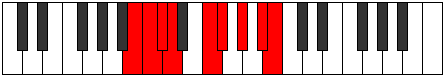

# Mode AFlatGonyllic

## Links

- [Documentation](index.md)
- [Scales Index](Scales.md)
- [Modes Index](Modes.md)
- [Chords Index](Chords.md)

## Scale

[Aeolothyllic](ScaleAeolothyllic.md)

## Mode

[AFlatGonyllic](ModeAFlatGonyllic.md)

## Tonic

Ab

## Signature

[CNaturalMajor]

## Perfection

 - 5 Perfect Notes

 - 3 Imperfect Notes

## Notes

- Ab (Imperfect)
- Bb
- B
- C (Imperfect)
- Db
- D (Imperfect)
- F
- Gb
- Ab (Imperfect)

## Illustration

## Relative Modes

| Number | Mode | Tonic | Notes | Illustration |
|--------|------|-------|-------|--------------|
| [1003](https://ianring.com/musictheory/scales/1003) | [Ionyryllic](ModeIonyryllic.md) | F | F, F#, G#, A#, B, C, C#, D, F |  |
| [1439](https://ianring.com/musictheory/scales/1439) | [Rolyllic](ModeRolyllic.md) | A# | A#, B, C, C#, D, F, F#, G#, A# |  |
| [1439](https://ianring.com/musictheory/scales/1439) | [Rolyllic](ModeRolyllic.md) | Bb | Bb, B, C, Db, D, F, Gb, Ab, Bb |  |
| [1661](https://ianring.com/musictheory/scales/1661) | [Gonyllic](ModeGonyllic.md) | G# | G#, A#, B, C, C#, D, F, F#, G# |  |
| [1661](https://ianring.com/musictheory/scales/1661) | [Gonyllic](ModeGonyllic.md) | Ab | Ab, Bb, B, C, Db, D, F, Gb, Ab |  |
| [2549](https://ianring.com/musictheory/scales/2549) | [Rydyllic](ModeRydyllic.md) | F# | F#, G#, A#, B, C, C#, D, F, F# |  |
| [2549](https://ianring.com/musictheory/scales/2549) | [Rydyllic](ModeRydyllic.md) | Gb | Gb, Ab, Bb, B, C, Db, D, F, Gb |  |
| [2767](https://ianring.com/musictheory/scales/2767) | [Katydyllic](ModeKatydyllic.md) | B | B, C, C#, D, F, F#, G#, A#, B |  |
| [3431](https://ianring.com/musictheory/scales/3431) | [Zyptyllic](ModeZyptyllic.md) | C | C, C#, D, F, F#, G#, A#, B, C |  |
| [3763](https://ianring.com/musictheory/scales/3763) | [Modyllic](ModeModyllic.md) | C# | C#, D, F, F#, G#, A#, B, C, C# |  |
| [3763](https://ianring.com/musictheory/scales/3763) | [Modyllic](ModeModyllic.md) | Db | Db, D, F, Gb, Ab, Bb, B, C, Db |  |
| [3929](https://ianring.com/musictheory/scales/3929) | [Aeolothyllic](ModeAeolothyllic.md) | D | D, F, F#, G#, A#, B, C, C#, D |  |

## Chords

### Ab

| Number | Root | Name | Notes | Illustration | Audio |
|--------|------|------|-------|--------------|-------|

### Bb

| Number | Root | Name | Notes | Illustration | Audio |
|--------|------|------|-------|--------------|-------|

### B

| Number | Root | Name | Notes | Illustration | Audio |
|--------|------|------|-------|--------------|-------|
| 2081 | B | [Bloc](ChordBNaturalLocrian.md) | B, C, F |  | [midi](ChordBNaturalLocrianRootPosition.mid) [ogg](ChordBNaturalLocrianRootPosition.ogg) |
| 2082 | B | [Bsus2b5](ChordBNaturalSuspendedSecondFlatFifth.md) | B, C#, F |  | [midi](ChordBNaturalSuspendedSecondFlatFifthRootPosition.mid) [ogg](ChordBNaturalSuspendedSecondFlatFifthRootPosition.ogg) |
| 2084 | B | [Bo](ChordBNaturalDiminished.md) | B, D, F |  | [midi](ChordBNaturalDiminishedRootPosition.mid) [ogg](ChordBNaturalDiminishedRootPosition.ogg) |
| 2112 | B | [B5](ChordBNaturalPowerChord.md) | B, F# |  | [midi](ChordBNaturalPowerChordRootPosition.mid) [ogg](ChordBNaturalPowerChordRootPosition.ogg) |
| 2113 | B | [Bphryg](ChordBNaturalPhrygian.md) | B, C, F# |  | [midi](ChordBNaturalPhrygianRootPosition.mid) [ogg](ChordBNaturalPhrygianRootPosition.ogg) |
| 2114 | B | [Bsus2](ChordBNaturalSuspendedSecond.md) | B, C#, F# |  | [midi](ChordBNaturalSuspendedSecondRootPosition.mid) [ogg](ChordBNaturalSuspendedSecondRootPosition.ogg) |
| 2116 | B | [Bm](ChordBNaturalMinor.md) | B, D, F# |  | [midi](ChordBNaturalMinorRootPosition.mid) [ogg](ChordBNaturalMinorRootPosition.ogg) |
| 2116 | B | [Bm(add(#9))](ChordBNaturalMinorAddSharpNinth.md) | B, D, F#, C## |  | [midi](ChordBNaturalMinorAddSharpNinthRootPosition.mid) [ogg](ChordBNaturalMinorAddSharpNinthRootPosition.ogg) |
| 2118 | B | [Bm(add9)](ChordBNaturalMinorAddNinth.md) | B, D, F#, C# |  | [midi](ChordBNaturalMinorAddNinthRootPosition.mid) [ogg](ChordBNaturalMinorAddNinthRootPosition.ogg) |
| 2144 | B | [Blyd](ChordBNaturalLydian.md) | B, E#, F# |  | [midi](ChordBNaturalLydianRootPosition.mid) [ogg](ChordBNaturalLydianRootPosition.ogg) |
| 2148 | B | [Bm(add(#4))](ChordBNaturalMinorAddSharpFourth.md) | B, D, E#, F# |  | [midi](ChordBNaturalMinorAddSharpFourthRootPosition.mid) [ogg](ChordBNaturalMinorAddSharpFourthRootPosition.ogg) |
| 2338 | B | [BM6sus2b5](ChordBNaturalMajorSixthSuspendedSecondFlatFifth.md) | B, C#, F, G# |  | [midi](ChordBNaturalMajorSixthSuspendedSecondFlatFifthRootPosition.mid) [ogg](ChordBNaturalMajorSixthSuspendedSecondFlatFifthRootPosition.ogg) |
| 2340 | B | [Bo7](ChordBNaturalFullDiminishedSeventh.md) | B, D, F, Ab |  | [midi](ChordBNaturalFullDiminishedSeventhRootPosition.mid) [ogg](ChordBNaturalFullDiminishedSeventhRootPosition.ogg) |
| 2370 | B | [BM6sus2](ChordBNaturalMajorSixthSuspendedSecond.md) | B, C#, F#, G# |  | [midi](ChordBNaturalMajorSixthSuspendedSecondRootPosition.mid) [ogg](ChordBNaturalMajorSixthSuspendedSecondRootPosition.ogg) |
| 2370 | B | [B7sus2b5](ChordBNaturalDominantSeventhSuspendedSecondFlatFifth.md) | B, C#, F#, Ab |  | [midi](ChordBNaturalDominantSeventhSuspendedSecondFlatFifthRootPosition.mid) [ogg](ChordBNaturalDominantSeventhSuspendedSecondFlatFifthRootPosition.ogg) |
| 2372 | B | [Bm6](ChordBNaturalMinorSixth.md) | B, D, F#, G# |  | [midi](ChordBNaturalMinorSixthRootPosition.mid) [ogg](ChordBNaturalMinorSixthRootPosition.ogg) |
| 2373 | B | [Bm6(addb9)](ChordBNaturalMinorSixthAddFlatNinth.md) | B, D, F#, G#, C |  | [midi](ChordBNaturalMinorSixthAddFlatNinthRootPosition.mid) [ogg](ChordBNaturalMinorSixthAddFlatNinthRootPosition.ogg) |
| 2374 | B | [Bm6(add9)](ChordBNaturalMinorSixthAddNinth.md) | B, D, F#, G#, C# |  | [midi](ChordBNaturalMinorSixthAddNinthRootPosition.mid) [ogg](ChordBNaturalMinorSixthAddNinthRootPosition.ogg) |
| 3108 | B | [BoM7](ChordBNaturalDiminishedMajorSeventh.md) | B, D, F, A# |  | [midi](ChordBNaturalDiminishedMajorSeventhRootPosition.mid) [ogg](ChordBNaturalDiminishedMajorSeventhRootPosition.ogg) |
| 3137 | B | [Bphryg+7](ChordBNaturalPhrygianAddSeventh.md) | B, C, F#, A# |  | [midi](ChordBNaturalPhrygianAddSeventhRootPosition.mid) [ogg](ChordBNaturalPhrygianAddSeventhRootPosition.ogg) |
| 3138 | B | [BM7(sus2)](ChordBNaturalMajorSeventhSuspendedSecond.md) | B, C#, F#, A# |  | [midi](ChordBNaturalMajorSeventhSuspendedSecondRootPosition.mid) [ogg](ChordBNaturalMajorSeventhSuspendedSecondRootPosition.ogg) |
| 3138 | B | [BM9sus2](ChordBNaturalMajorNinthSuspendedSecond.md) | B, C#, F#, A#, C# |  | [midi](ChordBNaturalMajorNinthSuspendedSecondRootPosition.mid) [ogg](ChordBNaturalMajorNinthSuspendedSecondRootPosition.ogg) |
| 3140 | B | [Bm(M7)](ChordBNaturalMinorMajorSeventh.md) | B, D, F#, A# |  | [midi](ChordBNaturalMinorMajorSeventhRootPosition.mid) [ogg](ChordBNaturalMinorMajorSeventhRootPosition.ogg) |
| 3142 | B | [Bm(M9)](ChordBNaturalMinorMajorNinth.md) | B, D, F#, A#, C# |  | [midi](ChordBNaturalMinorMajorNinthRootPosition.mid) [ogg](ChordBNaturalMinorMajorNinthRootPosition.ogg) |
| 3168 | B | [Blyd(M7)](ChordBNaturalLydianMajorSeventh.md) | B, E#, F#, A# |  | [midi](ChordBNaturalLydianMajorSeventhRootPosition.mid) [ogg](ChordBNaturalLydianMajorSeventhRootPosition.ogg) |
| 3396 | B | [Bm(M7)add13](ChordBNaturalMinorMajorSeventhAddThirteenth.md) | B, D, F#, A#, G# |  | [midi](ChordBNaturalMinorMajorSeventhAddThirteenthRootPosition.mid) [ogg](ChordBNaturalMinorMajorSeventhAddThirteenthRootPosition.ogg) |

### C

| Number | Root | Name | Notes | Illustration | Audio |
|--------|------|------|-------|--------------|-------|
| 37 | C | [Csus2bb5](ChordCNaturalSuspendedSecondDoubleFlatFifth.md) | C, D, F |  | [midi](ChordCNaturalSuspendedSecondDoubleFlatFifthRootPosition.mid) [ogg](ChordCNaturalSuspendedSecondDoubleFlatFifthRootPosition.ogg) |
| 67 | C | [Cloc](ChordCNaturalLocrian.md) | C, Db, Gb |  | [midi](ChordCNaturalLocrianRootPosition.mid) [ogg](ChordCNaturalLocrianRootPosition.ogg) |
| 69 | C | [Csus2b5](ChordCNaturalSuspendedSecondFlatFifth.md) | C, D, Gb |  | [midi](ChordCNaturalSuspendedSecondFlatFifthRootPosition.mid) [ogg](ChordCNaturalSuspendedSecondFlatFifthRootPosition.ogg) |
| 97 | C | [Csus4b5](ChordCNaturalSuspendedFourthFlatFifth.md) | C, F, Gb |  | [midi](ChordCNaturalSuspendedFourthFlatFifthRootPosition.mid) [ogg](ChordCNaturalSuspendedFourthFlatFifthRootPosition.ogg) |
| 261 | C | [Csus2#5](ChordCNaturalSuspendedSecondSharpFifth.md) | C, D, G# |  | [midi](ChordCNaturalSuspendedSecondSharpFifthRootPosition.mid) [ogg](ChordCNaturalSuspendedSecondSharpFifthRootPosition.ogg) |
| 289 | C | [Csus4#5](ChordCNaturalSuspendedFourthSharpFifth.md) | C, F, G# |  | [midi](ChordCNaturalSuspendedFourthSharpFifthRootPosition.mid) [ogg](ChordCNaturalSuspendedFourthSharpFifthRootPosition.ogg) |
| 325 | C | [Csus2b5add(#5)](ChordCNaturalSuspendedSecondFlatFifthAddSharpFifth.md) | C, D, Gb, G# |  | [midi](ChordCNaturalSuspendedSecondFlatFifthAddSharpFifthRootPosition.mid) [ogg](ChordCNaturalSuspendedSecondFlatFifthAddSharpFifthRootPosition.ogg) |
| 1057 | C | [CQ](ChordCNaturalQuartal.md) | C, F, Bb |  | [midi](ChordCNaturalQuartalRootPosition.mid) [ogg](ChordCNaturalQuartalRootPosition.ogg) |
| 2081 | C | [CQ+](ChordCNaturalQuartalAugmented.md) | C, F, B |  | [midi](ChordCNaturalQuartalAugmentedRootPosition.mid) [ogg](ChordCNaturalQuartalAugmentedRootPosition.ogg) |
| 2337 | C | [CM7(sus4)#5](ChordCNaturalMajorSeventhSuspendedFourthSharpFifth.md) | C, F, G#, B |  | [midi](ChordCNaturalMajorSeventhSuspendedFourthSharpFifthRootPosition.mid) [ogg](ChordCNaturalMajorSeventhSuspendedFourthSharpFifthRootPosition.ogg) |

### Db

| Number | Root | Name | Notes | Illustration | Audio |
|--------|------|------|-------|--------------|-------|

### D

| Number | Root | Name | Notes | Illustration | Audio |
|--------|------|------|-------|--------------|-------|
| 292 | D | [Do](ChordDNaturalDiminished.md) | D, F, Ab |  | [midi](ChordDNaturalDiminishedRootPosition.mid) [ogg](ChordDNaturalDiminishedRootPosition.ogg) |
| 324 | D | [DMb5](ChordDNaturalMajorFlatFifth.md) | D, F#, Ab |  | [midi](ChordDNaturalMajorFlatFifthRootPosition.mid) [ogg](ChordDNaturalMajorFlatFifthRootPosition.ogg) |
| 1060 | D | [Dm#5](ChordDNaturalMinorSharpFifth.md) | D, F, Bb |  | [midi](ChordDNaturalMinorSharpFifthRootPosition.mid) [ogg](ChordDNaturalMinorSharpFifthRootPosition.ogg) |
| 1092 | D | [D+](ChordDNaturalAugmented.md) | D, F#, A# |  | [midi](ChordDNaturalAugmentedRootPosition.mid) [ogg](ChordDNaturalAugmentedRootPosition.ogg) |
| 1092 | D | [D+7](ChordDNaturalAugmentedAugmentedSeventh.md) | D, F#, A#, C## |  | [midi](ChordDNaturalAugmentedAugmentedSeventhRootPosition.mid) [ogg](ChordDNaturalAugmentedAugmentedSeventhRootPosition.ogg) |
| 2116 | D | [DM##5](ChordDNaturalMajorDoubleSharpFifth.md) | D, F#, B |  | [midi](ChordDNaturalMajorDoubleSharpFifthRootPosition.mid) [ogg](ChordDNaturalMajorDoubleSharpFifthRootPosition.ogg) |
| 2340 | D | [Do7](ChordDNaturalFullDiminishedSeventh.md) | D, F, Ab, Cb |  | [midi](ChordDNaturalFullDiminishedSeventhRootPosition.mid) [ogg](ChordDNaturalFullDiminishedSeventhRootPosition.ogg) |
| 2372 | D | [DM6b5](ChordDNaturalMajorSixthFlatFifth.md) | D, F#, Ab, B |  | [midi](ChordDNaturalMajorSixthFlatFifthRootPosition.mid) [ogg](ChordDNaturalMajorSixthFlatFifthRootPosition.ogg) |
| 293 | D | [Dø7](ChordDNaturalHalfDiminishedSeventh.md) | D, F, Ab, C |  | [midi](ChordDNaturalHalfDiminishedSeventhRootPosition.mid) [ogg](ChordDNaturalHalfDiminishedSeventhRootPosition.ogg) |
| 325 | D | [D7b5](ChordDNaturalDominantSeventhFlatFifth.md) | D, F#, Ab, C |  | [midi](ChordDNaturalDominantSeventhFlatFifthRootPosition.mid) [ogg](ChordDNaturalDominantSeventhFlatFifthRootPosition.ogg) |
| 1061 | D | [Dm7#5](ChordDNaturalMinorSeventhSharpFifth.md) | D, F, A#, C |  | [midi](ChordDNaturalMinorSeventhSharpFifthRootPosition.mid) [ogg](ChordDNaturalMinorSeventhSharpFifthRootPosition.ogg) |
| 294 | D | [DoM7](ChordDNaturalDiminishedMajorSeventh.md) | D, F, Ab, C# |  | [midi](ChordDNaturalDiminishedMajorSeventhRootPosition.mid) [ogg](ChordDNaturalDiminishedMajorSeventhRootPosition.ogg) |
| 326 | D | [DM7b5](ChordDNaturalMajorSeventhFlatFifth.md) | D, F#, Ab, C# |  | [midi](ChordDNaturalMajorSeventhFlatFifthRootPosition.mid) [ogg](ChordDNaturalMajorSeventhFlatFifthRootPosition.ogg) |
| 1094 | D | [D+(M7)](ChordDNaturalAugmentedMajorSeventh.md) | D, F#, A#, C# |  | [midi](ChordDNaturalAugmentedMajorSeventhRootPosition.mid) [ogg](ChordDNaturalAugmentedMajorSeventhRootPosition.ogg) |
| 2118 | D | [DM7##5](ChordDNaturalMajorSeventhDoubleSharpFifth.md) | D, F#, B, C# |  | [midi](ChordDNaturalMajorSeventhDoubleSharpFifthRootPosition.mid) [ogg](ChordDNaturalMajorSeventhDoubleSharpFifthRootPosition.ogg) |

### F

| Number | Root | Name | Notes | Illustration | Audio |
|--------|------|------|-------|--------------|-------|
| 1312 | F | [Fmbb5](ChordFNaturalMinorDoubleFlatFifth.md) | F, Ab, Bb |  | [midi](ChordFNaturalMinorDoubleFlatFifthRootPosition.mid) [ogg](ChordFNaturalMinorDoubleFlatFifthRootPosition.ogg) |
| 2144 | F | [Floc](ChordFNaturalLocrian.md) | F, Gb, Cb |  | [midi](ChordFNaturalLocrianRootPosition.mid) [ogg](ChordFNaturalLocrianRootPosition.ogg) |
| 2336 | F | [Fo](ChordFNaturalDiminished.md) | F, Ab, Cb |  | [midi](ChordFNaturalDiminishedRootPosition.mid) [ogg](ChordFNaturalDiminishedRootPosition.ogg) |
| 3104 | F | [Fsus4b5](ChordFNaturalSuspendedFourthFlatFifth.md) | F, Bb, Cb |  | [midi](ChordFNaturalSuspendedFourthFlatFifthRootPosition.mid) [ogg](ChordFNaturalSuspendedFourthFlatFifthRootPosition.ogg) |
| 33 | F | [F5](ChordFNaturalPowerChord.md) | F, C |  | [midi](ChordFNaturalPowerChordRootPosition.mid) [ogg](ChordFNaturalPowerChordRootPosition.ogg) |
| 97 | F | [Fphryg](ChordFNaturalPhrygian.md) | F, Gb, C |  | [midi](ChordFNaturalPhrygianRootPosition.mid) [ogg](ChordFNaturalPhrygianRootPosition.ogg) |
| 289 | F | [Fm](ChordFNaturalMinor.md) | F, Ab, C |  | [midi](ChordFNaturalMinorRootPosition.mid) [ogg](ChordFNaturalMinorRootPosition.ogg) |
| 289 | F | [Fm(add(#9))](ChordFNaturalMinorAddSharpNinth.md) | F, Ab, C, G# |  | [midi](ChordFNaturalMinorAddSharpNinthRootPosition.mid) [ogg](ChordFNaturalMinorAddSharpNinthRootPosition.ogg) |
| 1057 | F | [Fsus4](ChordFNaturalSuspendedFourth.md) | F, Bb, C |  | [midi](ChordFNaturalSuspendedFourthRootPosition.mid) [ogg](ChordFNaturalSuspendedFourthRootPosition.ogg) |
| 1313 | F | [Fm(add11)](ChordFNaturalMinorAddEleventh.md) | F, Ab, C, Bb |  | [midi](ChordFNaturalMinorAddEleventhRootPosition.mid) [ogg](ChordFNaturalMinorAddEleventhRootPosition.ogg) |
| 1313 | F | [Fm(add4)](ChordFNaturalMinorAddFourth.md) | F, Ab, Bb, C |  | [midi](ChordFNaturalMinorAddFourthRootPosition.mid) [ogg](ChordFNaturalMinorAddFourthRootPosition.ogg) |
| 2081 | F | [Flyd](ChordFNaturalLydian.md) | F, B, C |  | [midi](ChordFNaturalLydianRootPosition.mid) [ogg](ChordFNaturalLydianRootPosition.ogg) |
| 2337 | F | [Fm(add(#4))](ChordFNaturalMinorAddSharpFourth.md) | F, Ab, B, C |  | [midi](ChordFNaturalMinorAddSharpFourthRootPosition.mid) [ogg](ChordFNaturalMinorAddSharpFourthRootPosition.ogg) |
| 290 | F | [Fm#5](ChordFNaturalMinorSharpFifth.md) | F, Ab, Db |  | [midi](ChordFNaturalMinorSharpFifthRootPosition.mid) [ogg](ChordFNaturalMinorSharpFifthRootPosition.ogg) |
| 1058 | F | [Fsus4#5](ChordFNaturalSuspendedFourthSharpFifth.md) | F, Bb, C# |  | [midi](ChordFNaturalSuspendedFourthSharpFifthRootPosition.mid) [ogg](ChordFNaturalSuspendedFourthSharpFifthRootPosition.ogg) |
| 1060 | F | [Fsus4##5](ChordFNaturalSuspendedFourthDoubleSharpFifth.md) | F, Bb, D |  | [midi](ChordFNaturalSuspendedFourthDoubleSharpFifthRootPosition.mid) [ogg](ChordFNaturalSuspendedFourthDoubleSharpFifthRootPosition.ogg) |
| 2340 | F | [Fo7](ChordFNaturalFullDiminishedSeventh.md) | F, Ab, Cb, Ebb |  | [midi](ChordFNaturalFullDiminishedSeventhRootPosition.mid) [ogg](ChordFNaturalFullDiminishedSeventhRootPosition.ogg) |
| 293 | F | [Fm6](ChordFNaturalMinorSixth.md) | F, Ab, C, D |  | [midi](ChordFNaturalMinorSixthRootPosition.mid) [ogg](ChordFNaturalMinorSixthRootPosition.ogg) |
| 357 | F | [Fm6(addb9)](ChordFNaturalMinorSixthAddFlatNinth.md) | F, Ab, C, D, Gb |  | [midi](ChordFNaturalMinorSixthAddFlatNinthRootPosition.mid) [ogg](ChordFNaturalMinorSixthAddFlatNinthRootPosition.ogg) |
| 1061 | F | [FM6sus4](ChordFNaturalMajorSixthSuspendedFourth.md) | F, Bb, C, D |  | [midi](ChordFNaturalMajorSixthSuspendedFourthRootPosition.mid) [ogg](ChordFNaturalMajorSixthSuspendedFourthRootPosition.ogg) |

### Gb

| Number | Root | Name | Notes | Illustration | Audio |
|--------|------|------|-------|--------------|-------|

