# Mode AFlatGorian

## Links

- [Documentation](README.md)
- [Scales Index](Scales.md)
- [Modes Index](Modes.md)
- [Chords Index](Chords.md)

## Scale

[Ionythian](ScaleIonythian.md)

## Mode

[AFlatGorian](ModeAFlatGorian.md)

## Tonic

Ab

## Signature

[CNaturalMajor]

## Transposition

2, 2, 1, 1, 1, 4, 1

## Chord Pattern

Ib5, vii⁰

## Perfection

 - 5 Perfect Notes

 - 2 Imperfect Notes

## Notes

- Ab
- Bb (Imperfect)
- C
- Db
- Ebb (Imperfect)
- Fbb
- G
- Ab

## Illustration

## Diagram

| Circle of Fifth | Chromatic Circle |
|-----------------|------------------|
| 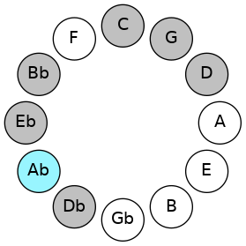 | 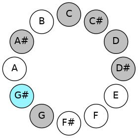 |
## Relative Modes

| Number | Mode | Tonic | Notes | Illustration |
|--------|------|-------|-------|--------------|
| [2293](https://ianring.com/musictheory/scales/2293) | [Gorian](ModeGorian.md) | G# | G#, A#, B#, C#, D, Eb, F##, G# |  |
| [2293](https://ianring.com/musictheory/scales/2293) | [Gorian](ModeGorian.md) | Ab | Ab, Bb, C, Db, Ebb, Fbb, G, Ab |  |
| [1597](https://ianring.com/musictheory/scales/1597) | [Aeolodian](ModeAeolodian.md) | A# | A#, B#, C#, D, Eb, F##, G#, A# |  |
| [1597](https://ianring.com/musictheory/scales/1597) | [Aeolodian](ModeAeolodian.md) | Bb | Bb, C, Db, Ebb, Fbb, G, Ab, Bb |  |
| [1423](https://ianring.com/musictheory/scales/1423) | [Doptian](ModeDoptian.md) | C | C, Db, Ebb, Fbb, G, Ab, Bb, C |  |
| [2759](https://ianring.com/musictheory/scales/2759) | [Aeraphian](ModeAeraphian.md) | C# | C#, D, Eb, F##, G#, A#, B#, C# |  |
| [2759](https://ianring.com/musictheory/scales/2759) | [Aeraphian](ModeAeraphian.md) | Db | Db, Ebb, Fbb, G, Ab, Bb, C, Db |  |
| [3427](https://ianring.com/musictheory/scales/3427) | [Zacrian](ModeZacrian.md) | D | D, Eb, F##, G#, A#, B#, C#, D |  |
| [3761](https://ianring.com/musictheory/scales/3761) | [Ionythian](ModeIonythian.md) | D# | D#, E###, F###, G###, A###, B##, C##, D# |  |
| [3761](https://ianring.com/musictheory/scales/3761) | [Ionythian](ModeIonythian.md) | Eb | Eb, F##, G#, A#, B#, C#, D, Eb |  |
| [491](https://ianring.com/musictheory/scales/491) | [Aeolyrian](ModeAeolyrian.md) | G | G, Ab, Bb, C, Db, Ebb, Fbb, G |  |
## Relative Brightness

| Number | Mode | Tonic | Notes | Circle Of Fifth | Chromatic Circle |
|--------|------|-------|-------|-----------------|------------------|
| [2293](https://ianring.com/musictheory/scales/2293) | [Gorian](ModeGorian.md) | G# | G#, A#, B#, C#, D, Eb, F##, G# |  | 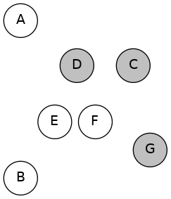 |
| [2293](https://ianring.com/musictheory/scales/2293) | [Gorian](ModeGorian.md) | Ab | Ab, Bb, C, Db, Ebb, Fbb, G, Ab |  |  |
| [1597](https://ianring.com/musictheory/scales/1597) | [Aeolodian](ModeAeolodian.md) | A# | A#, B#, C#, D, Eb, F##, G#, A# | 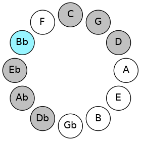 | 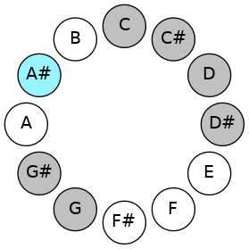 |
| [1597](https://ianring.com/musictheory/scales/1597) | [Aeolodian](ModeAeolodian.md) | Bb | Bb, C, Db, Ebb, Fbb, G, Ab, Bb |  |  |
| [1423](https://ianring.com/musictheory/scales/1423) | [Doptian](ModeDoptian.md) | C | C, Db, Ebb, Fbb, G, Ab, Bb, C | 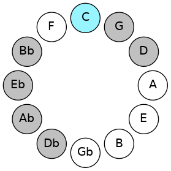 | 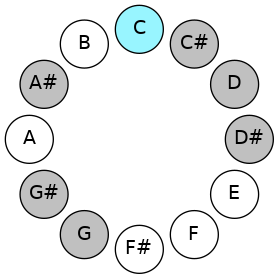 |
| [2759](https://ianring.com/musictheory/scales/2759) | [Aeraphian](ModeAeraphian.md) | C# | C#, D, Eb, F##, G#, A#, B#, C# |  | 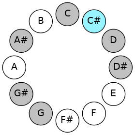 |
| [2759](https://ianring.com/musictheory/scales/2759) | [Aeraphian](ModeAeraphian.md) | Db | Db, Ebb, Fbb, G, Ab, Bb, C, Db | 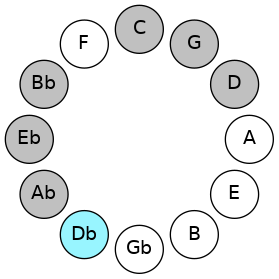 |  |
| [3427](https://ianring.com/musictheory/scales/3427) | [Zacrian](ModeZacrian.md) | D | D, Eb, F##, G#, A#, B#, C#, D | 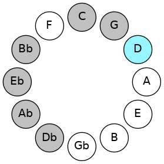 | 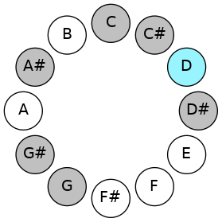 |
| [3761](https://ianring.com/musictheory/scales/3761) | [Ionythian](ModeIonythian.md) | D# | D#, E###, F###, G###, A###, B##, C##, D# | 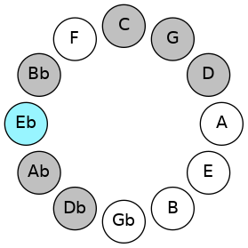 |  |
| [3761](https://ianring.com/musictheory/scales/3761) | [Ionythian](ModeIonythian.md) | Eb | Eb, F##, G#, A#, B#, C#, D, Eb |  | 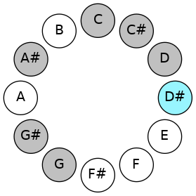 |
| [491](https://ianring.com/musictheory/scales/491) | [Aeolyrian](ModeAeolyrian.md) | G | G, Ab, Bb, C, Db, Ebb, Fbb, G | 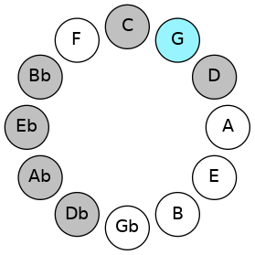 | 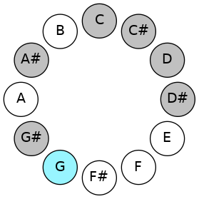 |

## Chords

### Ab

| Number | Root | Name | Notes | Illustration | Audio |
|--------|------|------|-------|--------------|-------|
| 1282 | Ab | [G#sus2bb5](ChordGSharpSuspendedSecondDoubleFlatFifth.md) | G#, A#, C# |  | [midi](ChordGSharpSuspendedSecondDoubleFlatFifthRootPosition.mid) |
| 1282 | Ab | [Absus2bb5](ChordAFlatSuspendedSecondDoubleFlatFifth.md) | Ab, Bb, Db |  | [midi](ChordAFlatSuspendedSecondDoubleFlatFifthRootPosition.mid) |
| 1284 | Ab | [G#](ChordGSharpDiminishedFlatThird.md) | G#, Bb, D |  | [midi](ChordGSharpDiminishedFlatThirdRootPosition.mid) |
| 1284 | Ab | [G#sus2b5](ChordGSharpSuspendedSecondFlatFifth.md) | G#, A#, D |  | [midi](ChordGSharpSuspendedSecondFlatFifthRootPosition.mid) |
| 1284 | Ab | [Ab](ChordAFlatDiminishedFlatThird.md) | Ab, Cbb, Ebb |  | [midi](ChordAFlatDiminishedFlatThirdRootPosition.mid) |
| 1284 | Ab | [Absus2b5](ChordAFlatSuspendedSecondFlatFifth.md) | Ab, Bb, Ebb |  | [midi](ChordAFlatSuspendedSecondFlatFifthRootPosition.mid) |
| 261 | Ab | [G#Mb5](ChordGSharpMajorFlatFifth.md) | G#, B#, D |  | [midi](ChordGSharpMajorFlatFifthRootPosition.mid) |
| 261 | Ab | [AbMb5](ChordAFlatMajorFlatFifth.md) | Ab, C, Ebb |  | [midi](ChordAFlatMajorFlatFifthRootPosition.mid) |
| 262 | Ab | [G#sus4b5](ChordGSharpSuspendedFourthFlatFifth.md) | G#, C#, D |  | [midi](ChordGSharpSuspendedFourthFlatFifthRootPosition.mid) |
| 262 | Ab | [Absus4b5](ChordAFlatSuspendedFourthFlatFifth.md) | Ab, Db, Ebb |  | [midi](ChordAFlatSuspendedFourthFlatFifthRootPosition.mid) |
| 264 | Ab | [G#5](ChordGSharpPowerChord.md) | G#, D# |  | [midi](ChordGSharpPowerChordRootPosition.mid) |
| 264 | Ab | [Ab5](ChordAFlatPowerChord.md) | Ab, Eb |  | [midi](ChordAFlatPowerChordRootPosition.mid) |
| 1288 | Ab | [G#sus2](ChordGSharpSuspendedSecond.md) | G#, A#, D# |  | [midi](ChordGSharpSuspendedSecondRootPosition.mid) |
| 1288 | Ab | [Absus2](ChordAFlatSuspendedSecond.md) | Ab, Bb, Eb |  | [midi](ChordAFlatSuspendedSecondRootPosition.mid) |
| 265 | Ab | [G#M](ChordGSharpMajor.md) | G#, B#, D# |  | [midi](ChordGSharpMajorRootPosition.mid) |
| 265 | Ab | [AbM](ChordAFlatMajor.md) | Ab, C, Eb |  | [midi](ChordAFlatMajorRootPosition.mid) |
| 1289 | Ab | [G#M(add9)](ChordGSharpMajorAddNinth.md) | G#, B#, D#, A# |  | [midi](ChordGSharpMajorAddNinthRootPosition.mid) |
| 1289 | Ab | [AbM(add9)](ChordAFlatMajorAddNinth.md) | Ab, C, Eb, Bb |  | [midi](ChordAFlatMajorAddNinthRootPosition.mid) |
| 266 | Ab | [G#sus4](ChordGSharpSuspendedFourth.md) | G#, C#, D# |  | [midi](ChordGSharpSuspendedFourthRootPosition.mid) |
| 266 | Ab | [Absus4](ChordAFlatSuspendedFourth.md) | Ab, Db, Eb |  | [midi](ChordAFlatSuspendedFourthRootPosition.mid) |
| 267 | Ab | [G#M(add11)](ChordGSharpMajorAddEleventh.md) | G#, B#, D#, C# |  | [midi](ChordGSharpMajorAddEleventhRootPosition.mid) |
| 267 | Ab | [G#M(add4)](ChordGSharpMajorAddFourth.md) | G#, B#, C#, D# |  | [midi](ChordGSharpMajorAddFourthRootPosition.mid) |
| 267 | Ab | [AbM(add11)](ChordAFlatMajorAddEleventh.md) | Ab, C, Eb, Db |  | [midi](ChordAFlatMajorAddEleventhRootPosition.mid) |
| 267 | Ab | [AbM(add4)](ChordAFlatMajorAddFourth.md) | Ab, C, Db, Eb |  | [midi](ChordAFlatMajorAddFourthRootPosition.mid) |
| 268 | Ab | [G#lyd](ChordGSharpLydian.md) | G#, C##, D# |  | [midi](ChordGSharpLydianRootPosition.mid) |
| 268 | Ab | [Ablyd](ChordAFlatLydian.md) | Ab, D, Eb |  | [midi](ChordAFlatLydianRootPosition.mid) |
| 269 | Ab | [G#M(add(#4))](ChordGSharpMajorAddSharpFourth.md) | G#, B#, C##, D# |  | [midi](ChordGSharpMajorAddSharpFourthRootPosition.mid) |
| 269 | Ab | [AbM(add(#4))](ChordAFlatMajorAddSharpFourth.md) | Ab, C, D, Eb |  | [midi](ChordAFlatMajorAddSharpFourthRootPosition.mid) |
| 386 | Ab | [G#Q+](ChordGSharpQuartalAugmented.md) | G#, C#, F## |  | [midi](ChordGSharpQuartalAugmentedRootPosition.mid) |
| 386 | Ab | [AbQ+](ChordAFlatQuartalAugmented.md) | Ab, Db, G |  | [midi](ChordAFlatQuartalAugmentedRootPosition.mid) |
| 389 | Ab | [G#M7b5](ChordGSharpMajorSeventhFlatFifth.md) | G#, B#, D, F## |  | [midi](ChordGSharpMajorSeventhFlatFifthRootPosition.mid) |
| 389 | Ab | [AbM7b5](ChordAFlatMajorSeventhFlatFifth.md) | Ab, C, Ebb, G |  | [midi](ChordAFlatMajorSeventhFlatFifthRootPosition.mid) |
| 1416 | Ab | [G#M7(sus2)](ChordGSharpMajorSeventhSuspendedSecond.md) | G#, A#, D#, F## |  | [midi](ChordGSharpMajorSeventhSuspendedSecondRootPosition.mid) |
| 1416 | Ab | [G#M9sus2](ChordGSharpMajorNinthSuspendedSecond.md) | G#, A#, D#, F##, A# |  | [midi](ChordGSharpMajorNinthSuspendedSecondRootPosition.mid) |
| 1416 | Ab | [AbM7(sus2)](ChordAFlatMajorSeventhSuspendedSecond.md) | Ab, Bb, Eb, G |  | [midi](ChordAFlatMajorSeventhSuspendedSecondRootPosition.mid) |
| 1416 | Ab | [AbM9sus2](ChordAFlatMajorNinthSuspendedSecond.md) | Ab, Bb, Eb, G, Bb |  | [midi](ChordAFlatMajorNinthSuspendedSecondRootPosition.mid) |
| 393 | Ab | [G#M7](ChordGSharpMajorSeventh.md) | G#, B#, D#, F## |  | [midi](ChordGSharpMajorSeventhRootPosition.mid) |
| 393 | Ab | [AbM7](ChordAFlatMajorSeventh.md) | Ab, C, Eb, G |  | [midi](ChordAFlatMajorSeventhRootPosition.mid) |
| 1417 | Ab | [G#M9](ChordGSharpMajorNinth.md) | G#, B#, D#, F##, A# |  | [midi](ChordGSharpMajorNinthRootPosition.mid) |
| 1417 | Ab | [AbM9](ChordAFlatMajorNinth.md) | Ab, C, Eb, G, Bb |  | [midi](ChordAFlatMajorNinthRootPosition.mid) |
| 394 | Ab | [G#M7(sus4)](ChordGSharpMajorSeventhSuspendedFourth.md) | G#, C#, D#, F## |  | [midi](ChordGSharpMajorSeventhSuspendedFourthRootPosition.mid) |
| 394 | Ab | [AbM7(sus4)](ChordAFlatMajorSeventhSuspendedFourth.md) | Ab, Db, Eb, G |  | [midi](ChordAFlatMajorSeventhSuspendedFourthRootPosition.mid) |
| 1418 | Ab | [G#M9sus4](ChordGSharpMajorNinthSuspendedFourth.md) | G#, C#, D#, F##, A# |  | [midi](ChordGSharpMajorNinthSuspendedFourthRootPosition.mid) |
| 1418 | Ab | [AbM9sus4](ChordAFlatMajorNinthSuspendedFourth.md) | Ab, Db, Eb, G, Bb |  | [midi](ChordAFlatMajorNinthSuspendedFourthRootPosition.mid) |
| 395 | Ab | [G#M7add4](ChordGSharpMajorSeventhAddFourth.md) | G#, B#, C#, D#, F## |  | [midi](ChordGSharpMajorSeventhAddFourthRootPosition.mid) |
| 395 | Ab | [G#M7add11](ChordGSharpMajorSeventhAddEleventh.md) | G#, B#, D#, F##, C# |  | [midi](ChordGSharpMajorSeventhAddEleventhRootPosition.mid) |
| 395 | Ab | [AbM7add4](ChordAFlatMajorSeventhAddFourth.md) | Ab, C, Db, Eb, G |  | [midi](ChordAFlatMajorSeventhAddFourthRootPosition.mid) |
| 395 | Ab | [AbM7add11](ChordAFlatMajorSeventhAddEleventh.md) | Ab, C, Eb, G, Db |  | [midi](ChordAFlatMajorSeventhAddEleventhRootPosition.mid) |
| 1419 | Ab | [G#M11](ChordGSharpMajorEleventh.md) | G#, B#, D#, F##, A#, C# |  | [midi](ChordGSharpMajorEleventhRootPosition.mid) |
| 1419 | Ab | [AbM11](ChordAFlatMajorEleventh.md) | Ab, C, Eb, G, Bb, Db |  | [midi](ChordAFlatMajorEleventhRootPosition.mid) |
| 396 | Ab | [G#lyd(M7)](ChordGSharpLydianMajorSeventh.md) | G#, C##, D#, F## |  | [midi](ChordGSharpLydianMajorSeventhRootPosition.mid) |
| 396 | Ab | [Ablyd(M7)](ChordAFlatLydianMajorSeventh.md) | Ab, D, Eb, G |  | [midi](ChordAFlatLydianMajorSeventhRootPosition.mid) |
| 397 | Ab | [G#M7add(#11)](ChordGSharpMajorSeventhAddSharpEleventh.md) | G#, B#, D#, F##, C## |  | [midi](ChordGSharpMajorSeventhAddSharpEleventhRootPosition.mid) |
| 397 | Ab | [G#M7add(#4)](ChordGSharpMajorSeventhAddSharpFourth.md) | G#, B#, C##, D#, F## |  | [midi](ChordGSharpMajorSeventhAddSharpFourthRootPosition.mid) |
| 397 | Ab | [AbM7add(#11)](ChordAFlatMajorSeventhAddSharpEleventh.md) | Ab, C, Eb, G, D |  | [midi](ChordAFlatMajorSeventhAddSharpEleventhRootPosition.mid) |
| 397 | Ab | [AbM7add(#4)](ChordAFlatMajorSeventhAddSharpFourth.md) | Ab, C, D, Eb, G |  | [midi](ChordAFlatMajorSeventhAddSharpFourthRootPosition.mid) |

### Bb

| Number | Root | Name | Notes | Illustration | Audio |
|--------|------|------|-------|--------------|-------|
| 1033 | Bb | [A#sus2bb5](ChordASharpSuspendedSecondDoubleFlatFifth.md) | A#, B#, D# |  | [midi](ChordASharpSuspendedSecondDoubleFlatFifthRootPosition.mid) |
| 1033 | Bb | [Bbsus2bb5](ChordBFlatSuspendedSecondDoubleFlatFifth.md) | Bb, C, Eb |  | [midi](ChordBFlatSuspendedSecondDoubleFlatFifthRootPosition.mid) |
| 1034 | Bb | [A#mbb5](ChordASharpMinorDoubleFlatFifth.md) | A#, C#, D# |  | [midi](ChordASharpMinorDoubleFlatFifthRootPosition.mid) |
| 1034 | Bb | [Bbmbb5](ChordBFlatMinorDoubleFlatFifth.md) | Bb, Db, Eb |  | [midi](ChordBFlatMinorDoubleFlatFifthRootPosition.mid) |
| 1156 | Bb | [A#M##5](ChordASharpMajorDoubleSharpFifth.md) | A#, C##, F## |  | [midi](ChordASharpMajorDoubleSharpFifthRootPosition.mid) |
| 1156 | Bb | [BbM##5](ChordBFlatMajorDoubleSharpFifth.md) | Bb, D, G |  | [midi](ChordBFlatMajorDoubleSharpFifthRootPosition.mid) |
| 1160 | Bb | [A#sus4##5](ChordASharpSuspendedFourthDoubleSharpFifth.md) | A#, D#, F## |  | [midi](ChordASharpSuspendedFourthDoubleSharpFifthRootPosition.mid) |
| 1160 | Bb | [Bbsus4##5](ChordBFlatSuspendedFourthDoubleSharpFifth.md) | Bb, Eb, G |  | [midi](ChordBFlatSuspendedFourthDoubleSharpFifthRootPosition.mid) |
| 1161 | Bb | [A#M6sus2bb5](ChordASharpMajorSixthSuspendedSecondDoubleFlatFifth.md) | A#, B#, D#, F## |  | [midi](ChordASharpMajorSixthSuspendedSecondDoubleFlatFifthRootPosition.mid) |
| 1161 | Bb | [BbM6sus2bb5](ChordBFlatMajorSixthSuspendedSecondDoubleFlatFifth.md) | Bb, C, Eb, G |  | [midi](ChordBFlatMajorSixthSuspendedSecondDoubleFlatFifthRootPosition.mid) |
| 1288 | Bb | [A#Q](ChordASharpQuartal.md) | A#, D#, G# |  | [midi](ChordASharpQuartalRootPosition.mid) |
| 1288 | Bb | [BbQ](ChordBFlatQuartal.md) | Bb, Eb, Ab |  | [midi](ChordBFlatQuartalRootPosition.mid) |
| 1290 | Bb | [A#m7bb5](ChordASharpMinorSeventhDoubleFlatFifth.md) | A#, C#, D#, G# |  | [midi](ChordASharpMinorSeventhDoubleFlatFifthRootPosition.mid) |
| 1290 | Bb | [Bbm7bb5](ChordBFlatMinorSeventhDoubleFlatFifth.md) | Bb, Db, Eb, Ab |  | [midi](ChordBFlatMinorSeventhDoubleFlatFifthRootPosition.mid) |

### C

| Number | Root | Name | Notes | Illustration | Audio |
|--------|------|------|-------|--------------|-------|
| 129 | C | [C5](ChordCNaturalPowerChord.md) | C, G |  | [midi](ChordCNaturalPowerChordRootPosition.mid) |
| 131 | C | [Cphryg](ChordCNaturalPhrygian.md) | C, Db, G |  | [midi](ChordCNaturalPhrygianRootPosition.mid) |
| 133 | C | [Csus2](ChordCNaturalSuspendedSecond.md) | C, D, G |  | [midi](ChordCNaturalSuspendedSecondRootPosition.mid) |
| 137 | C | [Cm](ChordCNaturalMinor.md) | C, Eb, G |  | [midi](ChordCNaturalMinorRootPosition.mid) |
| 137 | C | [Cm(add(#9))](ChordCNaturalMinorAddSharpNinth.md) | C, Eb, G, D# |  | [midi](ChordCNaturalMinorAddSharpNinthRootPosition.mid) |
| 141 | C | [Cm(add9)](ChordCNaturalMinorAddNinth.md) | C, Eb, G, D |  | [midi](ChordCNaturalMinorAddNinthRootPosition.mid) |
| 261 | C | [Csus2#5](ChordCNaturalSuspendedSecondSharpFifth.md) | C, D, G# |  | [midi](ChordCNaturalSuspendedSecondSharpFifthRootPosition.mid) |
| 265 | C | [Cm#5](ChordCNaturalMinorSharpFifth.md) | C, Eb, Ab |  | [midi](ChordCNaturalMinorSharpFifthRootPosition.mid) |
| 1157 | C | [C7sus2](ChordCNaturalDominantSeventhSuspendedSecond.md) | C, D, G, Bb |  | [midi](ChordCNaturalDominantSeventhSuspendedSecondRootPosition.mid) |
| 1157 | C | [C9sus2](ChordCNaturalDominantNinthSuspendedSecond.md) | C, D, G, Bb, D |  | [midi](ChordCNaturalDominantNinthSuspendedSecondRootPosition.mid) |
| 1161 | C | [Cm7](ChordCNaturalMinorSeventh.md) | C, Eb, G, Bb |  | [midi](ChordCNaturalMinorSeventhRootPosition.mid) |
| 1163 | C | [Cm7b9](ChordCNaturalMinorSeventhFlatNinth.md) | C, Eb, G, Bb, Db |  | [midi](ChordCNaturalMinorSeventhFlatNinthRootPosition.mid) |
| 1165 | C | [Cm9](ChordCNaturalMinorNinth.md) | C, Eb, G, Bb, D |  | [midi](ChordCNaturalMinorNinthRootPosition.mid) |
| 1289 | C | [Cm7#5](ChordCNaturalMinorSeventhSharpFifth.md) | C, Eb, G#, Bb |  | [midi](ChordCNaturalMinorSeventhSharpFifthRootPosition.mid) |

### Db

| Number | Root | Name | Notes | Illustration | Audio |
|--------|------|------|-------|--------------|-------|
| 134 | Db | [C#loc](ChordCSharpLocrian.md) | C#, D, G |  | [midi](ChordCSharpLocrianRootPosition.mid) |
| 134 | Db | [Dbloc](ChordDFlatLocrian.md) | Db, Ebb, Abb |  | [midi](ChordDFlatLocrianRootPosition.mid) |
| 138 | Db | [C#](ChordCSharpDiminishedFlatThird.md) | C#, Eb, G |  | [midi](ChordCSharpDiminishedFlatThirdRootPosition.mid) |
| 138 | Db | [C#sus2b5](ChordCSharpSuspendedSecondFlatFifth.md) | C#, D#, G |  | [midi](ChordCSharpSuspendedSecondFlatFifthRootPosition.mid) |
| 138 | Db | [Db](ChordDFlatDiminishedFlatThird.md) | Db, Fbb, Abb |  | [midi](ChordDFlatDiminishedFlatThirdRootPosition.mid) |
| 138 | Db | [Dbsus2b5](ChordDFlatSuspendedSecondFlatFifth.md) | Db, Eb, Abb |  | [midi](ChordDFlatSuspendedSecondFlatFifthRootPosition.mid) |
| 258 | Db | [C#5](ChordCSharpPowerChord.md) | C#, G# |  | [midi](ChordCSharpPowerChordRootPosition.mid) |
| 258 | Db | [Db5](ChordDFlatPowerChord.md) | Db, Ab |  | [midi](ChordDFlatPowerChordRootPosition.mid) |
| 262 | Db | [C#phryg](ChordCSharpPhrygian.md) | C#, D, G# |  | [midi](ChordCSharpPhrygianRootPosition.mid) |
| 262 | Db | [Dbphryg](ChordDFlatPhrygian.md) | Db, Ebb, Ab |  | [midi](ChordDFlatPhrygianRootPosition.mid) |
| 266 | Db | [C#sus2](ChordCSharpSuspendedSecond.md) | C#, D#, G# |  | [midi](ChordCSharpSuspendedSecondRootPosition.mid) |
| 266 | Db | [Dbsus2](ChordDFlatSuspendedSecond.md) | Db, Eb, Ab |  | [midi](ChordDFlatSuspendedSecondRootPosition.mid) |
| 386 | Db | [C#lyd](ChordCSharpLydian.md) | C#, F##, G# |  | [midi](ChordCSharpLydianRootPosition.mid) |
| 386 | Db | [Dblyd](ChordDFlatLydian.md) | Db, G, Ab |  | [midi](ChordDFlatLydianRootPosition.mid) |
| 1162 | Db | [C#M6sus2b5](ChordCSharpMajorSixthSuspendedSecondFlatFifth.md) | C#, D#, G, A# |  | [midi](ChordCSharpMajorSixthSuspendedSecondFlatFifthRootPosition.mid) |
| 1162 | Db | [DbM6sus2b5](ChordDFlatMajorSixthSuspendedSecondFlatFifth.md) | Db, Eb, Abb, Bb |  | [midi](ChordDFlatMajorSixthSuspendedSecondFlatFifthRootPosition.mid) |
| 1290 | Db | [C#M6sus2](ChordCSharpMajorSixthSuspendedSecond.md) | C#, D#, G#, A# |  | [midi](ChordCSharpMajorSixthSuspendedSecondRootPosition.mid) |
| 1290 | Db | [C#7sus2b5](ChordCSharpDominantSeventhSuspendedSecondFlatFifth.md) | C#, D#, G#, Bb |  | [midi](ChordCSharpDominantSeventhSuspendedSecondFlatFifthRootPosition.mid) |
| 1290 | Db | [DbM6sus2](ChordDFlatMajorSixthSuspendedSecond.md) | Db, Eb, Ab, Bb |  | [midi](ChordDFlatMajorSixthSuspendedSecondRootPosition.mid) |
| 1290 | Db | [Db7sus2b5](ChordDFlatDominantSeventhSuspendedSecondFlatFifth.md) | Db, Eb, Ab, Cbb |  | [midi](ChordDFlatDominantSeventhSuspendedSecondFlatFifthRootPosition.mid) |
| 263 | Db | [C#phryg+7](ChordCSharpPhrygianAddSeventh.md) | C#, D, G#, B# |  | [midi](ChordCSharpPhrygianAddSeventhRootPosition.mid) |
| 263 | Db | [Dbphryg+7](ChordDFlatPhrygianAddSeventh.md) | Db, Ebb, Ab, C |  | [midi](ChordDFlatPhrygianAddSeventhRootPosition.mid) |
| 267 | Db | [C#M7(sus2)](ChordCSharpMajorSeventhSuspendedSecond.md) | C#, D#, G#, B# |  | [midi](ChordCSharpMajorSeventhSuspendedSecondRootPosition.mid) |
| 267 | Db | [C#M9sus2](ChordCSharpMajorNinthSuspendedSecond.md) | C#, D#, G#, B#, D# |  | [midi](ChordCSharpMajorNinthSuspendedSecondRootPosition.mid) |
| 267 | Db | [DbM7(sus2)](ChordDFlatMajorSeventhSuspendedSecond.md) | Db, Eb, Ab, C |  | [midi](ChordDFlatMajorSeventhSuspendedSecondRootPosition.mid) |
| 267 | Db | [DbM9sus2](ChordDFlatMajorNinthSuspendedSecond.md) | Db, Eb, Ab, C, Eb |  | [midi](ChordDFlatMajorNinthSuspendedSecondRootPosition.mid) |
| 387 | Db | [C#lyd(M7)](ChordCSharpLydianMajorSeventh.md) | C#, F##, G#, B# |  | [midi](ChordCSharpLydianMajorSeventhRootPosition.mid) |
| 387 | Db | [Dblyd(M7)](ChordDFlatLydianMajorSeventh.md) | Db, G, Ab, C |  | [midi](ChordDFlatLydianMajorSeventhRootPosition.mid) |

### Ebb

| Number | Root | Name | Notes | Illustration | Audio |
|--------|------|------|-------|--------------|-------|
| 268 | Ebb | [Dloc](ChordDNaturalLocrian.md) | D, Eb, Ab |  | [midi](ChordDNaturalLocrianRootPosition.mid) |
| 388 | Ebb | [Dsus4b5](ChordDNaturalSuspendedFourthFlatFifth.md) | D, G, Ab |  | [midi](ChordDNaturalSuspendedFourthFlatFifthRootPosition.mid) |
| 1156 | Ebb | [Dsus4#5](ChordDNaturalSuspendedFourthSharpFifth.md) | D, G, A# |  | [midi](ChordDNaturalSuspendedFourthSharpFifthRootPosition.mid) |
| 133 | Ebb | [DQ](ChordDNaturalQuartal.md) | D, G, C |  | [midi](ChordDNaturalQuartalRootPosition.mid) |
| 134 | Ebb | [DQ+](ChordDNaturalQuartalAugmented.md) | D, G, C# |  | [midi](ChordDNaturalQuartalAugmentedRootPosition.mid) |
| 1158 | Ebb | [DM7(sus4)#5](ChordDNaturalMajorSeventhSuspendedFourthSharpFifth.md) | D, G, A#, C# |  | [midi](ChordDNaturalMajorSeventhSuspendedFourthSharpFifthRootPosition.mid) |

### Fbb

| Number | Root | Name | Notes | Illustration | Audio |
|--------|------|------|-------|--------------|-------|
| 1032 | Fbb | [D#5](ChordDSharpPowerChord.md) | D#, A# |  | [midi](ChordDSharpPowerChordRootPosition.mid) |
| 1032 | Fbb | [Eb5](ChordEFlatPowerChord.md) | Eb, Bb |  | [midi](ChordEFlatPowerChordRootPosition.mid) |
| 1160 | Fbb | [D#M](ChordDSharpMajor.md) | D#, F##, A# |  | [midi](ChordDSharpMajorRootPosition.mid) |
| 1160 | Fbb | [EbM](ChordEFlatMajor.md) | Eb, G, Bb |  | [midi](ChordEFlatMajorRootPosition.mid) |
| 1288 | Fbb | [D#sus4](ChordDSharpSuspendedFourth.md) | D#, G#, A# |  | [midi](ChordDSharpSuspendedFourthRootPosition.mid) |
| 1288 | Fbb | [Ebsus4](ChordEFlatSuspendedFourth.md) | Eb, Ab, Bb |  | [midi](ChordEFlatSuspendedFourthRootPosition.mid) |
| 1416 | Fbb | [D#M(add11)](ChordDSharpMajorAddEleventh.md) | D#, F##, A#, G# |  | [midi](ChordDSharpMajorAddEleventhRootPosition.mid) |
| 1416 | Fbb | [D#M(add4)](ChordDSharpMajorAddFourth.md) | D#, F##, G#, A# |  | [midi](ChordDSharpMajorAddFourthRootPosition.mid) |
| 1416 | Fbb | [EbM(add11)](ChordEFlatMajorAddEleventh.md) | Eb, G, Bb, Ab |  | [midi](ChordEFlatMajorAddEleventhRootPosition.mid) |
| 1416 | Fbb | [EbM(add4)](ChordEFlatMajorAddFourth.md) | Eb, G, Ab, Bb |  | [midi](ChordEFlatMajorAddFourthRootPosition.mid) |
| 137 | Fbb | [D#M##5](ChordDSharpMajorDoubleSharpFifth.md) | D#, F##, B# |  | [midi](ChordDSharpMajorDoubleSharpFifthRootPosition.mid) |
| 137 | Fbb | [EbM##5](ChordEFlatMajorDoubleSharpFifth.md) | Eb, G, C |  | [midi](ChordEFlatMajorDoubleSharpFifthRootPosition.mid) |
| 265 | Fbb | [D#sus4##5](ChordDSharpSuspendedFourthDoubleSharpFifth.md) | D#, G#, B# |  | [midi](ChordDSharpSuspendedFourthDoubleSharpFifthRootPosition.mid) |
| 265 | Fbb | [Ebsus4##5](ChordEFlatSuspendedFourthDoubleSharpFifth.md) | Eb, Ab, C |  | [midi](ChordEFlatSuspendedFourthDoubleSharpFifthRootPosition.mid) |
| 1161 | Fbb | [D#M6](ChordDSharpMajorSixth.md) | D#, F##, A#, B# |  | [midi](ChordDSharpMajorSixthRootPosition.mid) |
| 1161 | Fbb | [EbM6](ChordEFlatMajorSixth.md) | Eb, G, Bb, C |  | [midi](ChordEFlatMajorSixthRootPosition.mid) |
| 1289 | Fbb | [D#M6sus4](ChordDSharpMajorSixthSuspendedFourth.md) | D#, G#, A#, B# |  | [midi](ChordDSharpMajorSixthSuspendedFourthRootPosition.mid) |
| 1289 | Fbb | [EbM6sus4](ChordEFlatMajorSixthSuspendedFourth.md) | Eb, Ab, Bb, C |  | [midi](ChordEFlatMajorSixthSuspendedFourthRootPosition.mid) |
| 266 | Fbb | [D#Q](ChordDSharpQuartal.md) | D#, G#, C# |  | [midi](ChordDSharpQuartalRootPosition.mid) |
| 266 | Fbb | [EbQ](ChordEFlatQuartal.md) | Eb, Ab, Db |  | [midi](ChordEFlatQuartalRootPosition.mid) |
| 1162 | Fbb | [D#7](ChordDSharpDominantSeventh.md) | D#, F##, A#, C# |  | [midi](ChordDSharpDominantSeventhRootPosition.mid) |
| 1162 | Fbb | [Eb7](ChordEFlatDominantSeventh.md) | Eb, G, Bb, Db |  | [midi](ChordEFlatDominantSeventhRootPosition.mid) |
| 1290 | Fbb | [D#7sus4](ChordDSharpDominantSeventhSuspendedFourth.md) | D#, G#, A#, C# |  | [midi](ChordDSharpDominantSeventhSuspendedFourthRootPosition.mid) |
| 1290 | Fbb | [Eb7sus4](ChordEFlatDominantSeventhSuspendedFourth.md) | Eb, Ab, Bb, Db |  | [midi](ChordEFlatDominantSeventhSuspendedFourthRootPosition.mid) |
| 1418 | Fbb | [D#7add4](ChordDSharpDominantSeventhAddFourth.md) | D#, F##, G#, A#, C# |  | [midi](ChordDSharpDominantSeventhAddFourthRootPosition.mid) |
| 1418 | Fbb | [D#7add11](ChordDSharpDominantSeventhAddEleventh.md) | D#, F##, A#, C#, G# |  | [midi](ChordDSharpDominantSeventhAddEleventhRootPosition.mid) |
| 1418 | Fbb | [Eb7add4](ChordEFlatDominantSeventhAddFourth.md) | Eb, G, Ab, Bb, Db |  | [midi](ChordEFlatDominantSeventhAddFourthRootPosition.mid) |
| 1418 | Fbb | [Eb7add11](ChordEFlatDominantSeventhAddEleventh.md) | Eb, G, Bb, Db, Ab |  | [midi](ChordEFlatDominantSeventhAddEleventhRootPosition.mid) |
| 1163 | Fbb | [D#7add13](ChordDSharpDominantSeventhAddThirteenth.md) | D#, F##, A#, C#, B# |  | [midi](ChordDSharpDominantSeventhAddThirteenthRootPosition.mid) |
| 1163 | Fbb | [Eb7add13](ChordEFlatDominantSeventhAddThirteenth.md) | Eb, G, Bb, Db, C |  | [midi](ChordEFlatDominantSeventhAddThirteenthRootPosition.mid) |
| 268 | Fbb | [D#Q+](ChordDSharpQuartalAugmented.md) | D#, G#, C## |  | [midi](ChordDSharpQuartalAugmentedRootPosition.mid) |
| 268 | Fbb | [EbQ+](ChordEFlatQuartalAugmented.md) | Eb, Ab, D |  | [midi](ChordEFlatQuartalAugmentedRootPosition.mid) |
| 1164 | Fbb | [D#M7](ChordDSharpMajorSeventh.md) | D#, F##, A#, C## |  | [midi](ChordDSharpMajorSeventhRootPosition.mid) |
| 1164 | Fbb | [EbM7](ChordEFlatMajorSeventh.md) | Eb, G, Bb, D |  | [midi](ChordEFlatMajorSeventhRootPosition.mid) |
| 1292 | Fbb | [D#M7(sus4)](ChordDSharpMajorSeventhSuspendedFourth.md) | D#, G#, A#, C## |  | [midi](ChordDSharpMajorSeventhSuspendedFourthRootPosition.mid) |
| 1292 | Fbb | [EbM7(sus4)](ChordEFlatMajorSeventhSuspendedFourth.md) | Eb, Ab, Bb, D |  | [midi](ChordEFlatMajorSeventhSuspendedFourthRootPosition.mid) |
| 1420 | Fbb | [D#M7add4](ChordDSharpMajorSeventhAddFourth.md) | D#, F##, G#, A#, C## |  | [midi](ChordDSharpMajorSeventhAddFourthRootPosition.mid) |
| 1420 | Fbb | [D#M7add11](ChordDSharpMajorSeventhAddEleventh.md) | D#, F##, A#, C##, G# |  | [midi](ChordDSharpMajorSeventhAddEleventhRootPosition.mid) |
| 1420 | Fbb | [EbM7add4](ChordEFlatMajorSeventhAddFourth.md) | Eb, G, Ab, Bb, D |  | [midi](ChordEFlatMajorSeventhAddFourthRootPosition.mid) |
| 1420 | Fbb | [EbM7add11](ChordEFlatMajorSeventhAddEleventh.md) | Eb, G, Bb, D, Ab |  | [midi](ChordEFlatMajorSeventhAddEleventhRootPosition.mid) |
| 141 | Fbb | [D#M7##5](ChordDSharpMajorSeventhDoubleSharpFifth.md) | D#, F##, B#, C## |  | [midi](ChordDSharpMajorSeventhDoubleSharpFifthRootPosition.mid) |
| 141 | Fbb | [EbM7##5](ChordEFlatMajorSeventhDoubleSharpFifth.md) | Eb, G, C, D |  | [midi](ChordEFlatMajorSeventhDoubleSharpFifthRootPosition.mid) |
| 269 | Fbb | [D#M7(sus4)##5](ChordDSharpMajorSeventhSuspendedFourthDoubleSharpFifth.md) | D#, G#, B#, C## |  | [midi](ChordDSharpMajorSeventhSuspendedFourthDoubleSharpFifthRootPosition.mid) |
| 269 | Fbb | [EbM7(sus4)##5](ChordEFlatMajorSeventhSuspendedFourthDoubleSharpFifth.md) | Eb, Ab, C, D |  | [midi](ChordEFlatMajorSeventhSuspendedFourthDoubleSharpFifthRootPosition.mid) |
| 1165 | Fbb | [D#M7add13](ChordDSharpMajorSeventhAddThirteenth.md) | D#, F##, A#, C##, B# |  | [midi](ChordDSharpMajorSeventhAddThirteenthRootPosition.mid) |
| 1165 | Fbb | [EbM7add13](ChordEFlatMajorSeventhAddThirteenth.md) | Eb, G, Bb, D, C |  | [midi](ChordEFlatMajorSeventhAddThirteenthRootPosition.mid) |

### G

| Number | Root | Name | Notes | Illustration | Audio |
|--------|------|------|-------|--------------|-------|
| 1153 | G | [Gmbb5](ChordGNaturalMinorDoubleFlatFifth.md) | G, Bb, C |  | [midi](ChordGNaturalMinorDoubleFlatFifthRootPosition.mid) |
| 386 | G | [Gloc](ChordGNaturalLocrian.md) | G, Ab, Db |  | [midi](ChordGNaturalLocrianRootPosition.mid) |
| 1154 | G | [Go](ChordGNaturalDiminished.md) | G, Bb, Db |  | [midi](ChordGNaturalDiminishedRootPosition.mid) |
| 131 | G | [Gsus4b5](ChordGNaturalSuspendedFourthFlatFifth.md) | G, C, Db |  | [midi](ChordGNaturalSuspendedFourthFlatFifthRootPosition.mid) |
| 132 | G | [G5](ChordGNaturalPowerChord.md) | G, D |  | [midi](ChordGNaturalPowerChordRootPosition.mid) |
| 388 | G | [Gphryg](ChordGNaturalPhrygian.md) | G, Ab, D |  | [midi](ChordGNaturalPhrygianRootPosition.mid) |
| 1156 | G | [Gm](ChordGNaturalMinor.md) | G, Bb, D |  | [midi](ChordGNaturalMinorRootPosition.mid) |
| 1156 | G | [Gm(add(#9))](ChordGNaturalMinorAddSharpNinth.md) | G, Bb, D, A# |  | [midi](ChordGNaturalMinorAddSharpNinthRootPosition.mid) |
| 133 | G | [Gsus4](ChordGNaturalSuspendedFourth.md) | G, C, D |  | [midi](ChordGNaturalSuspendedFourthRootPosition.mid) |
| 1157 | G | [Gm(add11)](ChordGNaturalMinorAddEleventh.md) | G, Bb, D, C |  | [midi](ChordGNaturalMinorAddEleventhRootPosition.mid) |
| 1157 | G | [Gm(add4)](ChordGNaturalMinorAddFourth.md) | G, Bb, C, D |  | [midi](ChordGNaturalMinorAddFourthRootPosition.mid) |
| 134 | G | [Glyd](ChordGNaturalLydian.md) | G, C#, D |  | [midi](ChordGNaturalLydianRootPosition.mid) |
| 1158 | G | [Gm(add(#4))](ChordGNaturalMinorAddSharpFourth.md) | G, Bb, C#, D |  | [midi](ChordGNaturalMinorAddSharpFourthRootPosition.mid) |
| 1160 | G | [Gm#5](ChordGNaturalMinorSharpFifth.md) | G, Bb, Eb |  | [midi](ChordGNaturalMinorSharpFifthRootPosition.mid) |
| 137 | G | [Gsus4#5](ChordGNaturalSuspendedFourthSharpFifth.md) | G, C, D# |  | [midi](ChordGNaturalSuspendedFourthSharpFifthRootPosition.mid) |

