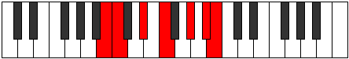

# Mode AFlatGycrimic

## Links

- [Documentation](index.md)
- [Scales Index](Scales.md)
- [Modes Index](Modes.md)
- [Chords Index](Chords.md)

## Scale

[Mixolimic](ScaleMixolimic.md)

## Mode

[AFlatGycrimic](ModeAFlatGycrimic.md)

## Tonic

Ab

## Signature

[CNaturalMajor]

## Perfection

 - 4 Perfect Notes

 - 2 Imperfect Notes

## Notes

- Ab
- Bb
- Cb (Imperfect)
- Dbb (Imperfect)
- Eb
- F
- Ab

## Illustration

## Relative Modes

| Number | Mode | Tonic | Notes | Illustration |
|--------|------|-------|-------|--------------|
| [669](https://ianring.com/musictheory/scales/669) | [Gycrimic](ModeGycrimic.md) | G# | G#, A#, B, C, D#, E#, G# |  |
| [669](https://ianring.com/musictheory/scales/669) | [Gycrimic](ModeGycrimic.md) | Ab | Ab, Bb, Cb, Dbb, Eb, F, Ab |  |
| [933](https://ianring.com/musictheory/scales/933) | [Dadimic](ModeDadimic.md) | D# | D#, E#, F###, G###, A##, B#, D# |  |
| [933](https://ianring.com/musictheory/scales/933) | [Dadimic](ModeDadimic.md) | Eb | Eb, F, G#, A#, B, C, Eb |  |
| [1191](https://ianring.com/musictheory/scales/1191) | [Pyrimic](ModePyrimic.md) | A# | A#, B, C, D#, E#, F###, A# |  |
| [1191](https://ianring.com/musictheory/scales/1191) | [Pyrimic](ModePyrimic.md) | Bb | Bb, Cb, Dbb, Eb, F, G#, Bb |  |
| [1257](https://ianring.com/musictheory/scales/1257) | [Aeolyphimic](ModeAeolyphimic.md) | F | F, G#, A#, B, C, D#, F |  |
| [2643](https://ianring.com/musictheory/scales/2643) | [Lydimic](ModeLydimic.md) | B | B, C, D#, E#, F###, G###, B |  |
| [3369](https://ianring.com/musictheory/scales/3369) | [Mixolimic](ModeMixolimic.md) | C | C, D#, E#, F###, G###, A##, C |  |

## Chords

### Ab

| Number | Root | Name | Notes | Illustration | Audio |
|--------|------|------|-------|--------------|-------|

### Bb

| Number | Root | Name | Notes | Illustration | Audio |
|--------|------|------|-------|--------------|-------|

### Cb

| Number | Root | Name | Notes | Illustration | Audio |
|--------|------|------|-------|--------------|-------|

### Dbb

| Number | Root | Name | Notes | Illustration | Audio |
|--------|------|------|-------|--------------|-------|

### Eb

| Number | Root | Name | Notes | Illustration | Audio |
|--------|------|------|-------|--------------|-------|

### F

| Number | Root | Name | Notes | Illustration | Audio |
|--------|------|------|-------|--------------|-------|

