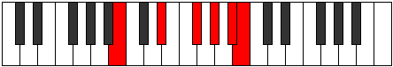

# Mode AFlatGycritonic

## Links

- [Documentation](index.md)
- [Scales Index](Scales.md)
- [Modes Index](Modes.md)
- [Chords Index](Chords.md)

## Scale

[Magitonic](ScaleMagitonic.md)

## Mode

[AFlatGycritonic](ModeAFlatGycritonic.md)

## Tonic

Ab

## Signature

[CNaturalMajor]

## Perfection

 - 3 Perfect Notes

 - 2 Imperfect Notes

## Notes

- Ab
- Bb (Imperfect)
- B
- Eb
- Gb (Imperfect)
- Ab

## Illustration

## Relative Modes

| Number | Mode | Tonic | Notes | Illustration |
|--------|------|-------|-------|--------------|
| [1165](https://ianring.com/musictheory/scales/1165) | [Gycritonic](ModeGycritonic.md) | Ab | Ab, Bb, B, Eb, Gb, Ab |  |
| [1315](https://ianring.com/musictheory/scales/1315) | [Pyritonic](ModePyritonic.md) | Bb | Bb, B, Eb, Gb, Ab, Bb |  |
| [2705](https://ianring.com/musictheory/scales/2705) | [Magitonic](ModeMagitonic.md) | B | B, D#, F#, G#, A#, B |  |
| [425](https://ianring.com/musictheory/scales/425) | [Daditonic](ModeDaditonic.md) | Eb | Eb, Gb, Ab, Bb, B, Eb |  |
| [565](https://ianring.com/musictheory/scales/565) | [Aeolyphritonic](ModeAeolyphritonic.md) | Gb | Gb, Ab, Bb, B, Eb, Gb |  |

## Chords

### Ab

| Number | Root | Name | Notes | Illustration | Audio |
|--------|------|------|-------|--------------|-------|

### Bb

| Number | Root | Name | Notes | Illustration | Audio |
|--------|------|------|-------|--------------|-------|

### B

| Number | Root | Name | Notes | Illustration | Audio |
|--------|------|------|-------|--------------|-------|
| 2112 | B | [B5](ChordBNaturalPowerChord.md) | B, F# |  | [midi](ChordBNaturalPowerChordRootPosition.mid) |
| 2120 | B | [BM](ChordBNaturalMajor.md) | B, D#, F# |  | [midi](ChordBNaturalMajorRootPosition.mid) |
| 2312 | B | [BM##5](ChordBNaturalMajorDoubleSharpFifth.md) | B, D#, G# |  | [midi](ChordBNaturalMajorDoubleSharpFifthRootPosition.mid) |
| 2376 | B | [BM6](ChordBNaturalMajorSixth.md) | B, D#, F#, G# |  | [midi](ChordBNaturalMajorSixthRootPosition.mid) |
| 3144 | B | [BM7](ChordBNaturalMajorSeventh.md) | B, D#, F#, A# |  | [midi](ChordBNaturalMajorSeventhRootPosition.mid) |
| 3336 | B | [BM7##5](ChordBNaturalMajorSeventhDoubleSharpFifth.md) | B, D#, G#, A# |  | [midi](ChordBNaturalMajorSeventhDoubleSharpFifthRootPosition.mid) |
| 3400 | B | [BM7add13](ChordBNaturalMajorSeventhAddThirteenth.md) | B, D#, F#, A#, G# |  | [midi](ChordBNaturalMajorSeventhAddThirteenthRootPosition.mid) |

### Eb

| Number | Root | Name | Notes | Illustration | Audio |
|--------|------|------|-------|--------------|-------|

### Gb

| Number | Root | Name | Notes | Illustration | Audio |
|--------|------|------|-------|--------------|-------|

