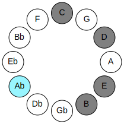
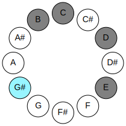
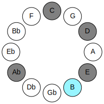
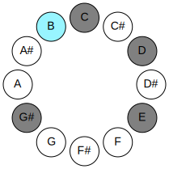
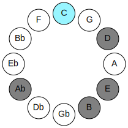
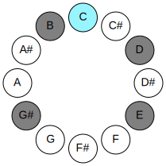
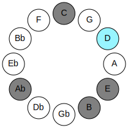
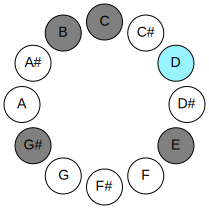
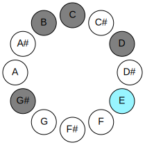

# Mode AFlatGylitonic

## Links

- [Documentation](README.md)
- [Scales Index](Scales.md)
- [Modes Index](Modes.md)
- [Chords Index](Chords.md)

## Parent Scale

[Ryphitonic](ScaleRyphitonic.md)

## Mode

[AFlatGylitonic](ModeAFlatGylitonic.md)

## Number

345

## Luminosity

-1

## Tonic

Ab

## Signature

C

## Transposition

3, 1, 2, 2, 4

## Chord Pattern

I⁺

## Perfection

 - 1 Perfect Notes

 - 4 Imperfect Notes

 - Perfection Profile - false, false, false, false, true

## Notes

- Ab (Imperfect)
- B (Imperfect)
- C (Imperfect)
- D (Imperfect)
- E
- Ab (Imperfect)

## Illustration

## Diagram

| Circle of Fifth | Chromatic Circle |
|-----------------|------------------|
|  |  |
## Relative Modes

| Number | Mode | Luminosity | Tonic | Notes | Illustration |
|--------|------|------------|-------|-------|--------------|
| [345](https://ianring.com/musictheory/scales/345) | [Gylitonic](ModeGylitonic.md) | -1 | G# | G#, B, C, D, E, G# |  |
| [345](https://ianring.com/musictheory/scales/345) | [Gylitonic](ModeGylitonic.md) | -1 | Ab | Ab, B, C, D, E, Ab |  |
| [555](https://ianring.com/musictheory/scales/555) | [Aeolycritonic](ModeAeolycritonic.md) | 4 | B | B, C, D, E, G#, B |  |
| [2325](https://ianring.com/musictheory/scales/2325) | [Pynitonic](ModePynitonic.md) | -1 | C | C, D, E, G#, B, C |  |
| [1605](https://ianring.com/musictheory/scales/1605) | [Zanitonic](ModeZanitonic.md) | -1 | D | D, E, G#, B, C, D |  |
| [1425](https://ianring.com/musictheory/scales/1425) | [Ryphitonic](ModeRyphitonic.md) | 5 | E | E, G#, B, C, D, E |  |
## Relative Brightness

| Number | Mode | Luminosity | Tonic | Notes | Circle Of Fifth | Chromatic Circle |
|--------|------|------------|-------|-------|-----------------|------------------|
| [345](https://ianring.com/musictheory/scales/345) | [Gylitonic](ModeGylitonic.md) | -1 | G# | G#, B, C, D, E, G# |  |  |
| [345](https://ianring.com/musictheory/scales/345) | [Gylitonic](ModeGylitonic.md) | -1 | Ab | Ab, B, C, D, E, Ab |  |  |
| [555](https://ianring.com/musictheory/scales/555) | [Aeolycritonic](ModeAeolycritonic.md) | 4 | B | B, C, D, E, G#, B |  |  |
| [2325](https://ianring.com/musictheory/scales/2325) | [Pynitonic](ModePynitonic.md) | -1 | C | C, D, E, G#, B, C |  |  |
| [1605](https://ianring.com/musictheory/scales/1605) | [Zanitonic](ModeZanitonic.md) | -1 | D | D, E, G#, B, C, D |  |  |
| [1425](https://ianring.com/musictheory/scales/1425) | [Ryphitonic](ModeRyphitonic.md) | 5 | E | E, G#, B, C, D, E |  |  |

## Chords

### Ab

| Number | Root | Name | Notes | Illustration | Audio |
|--------|------|------|-------|--------------|-------|
| 2308 | Ab | [G#o](ChordGSharpDiminished.md) | G#, B, D |  | [midi](ChordGSharpDiminishedRootPosition.mid) |
| 2308 | Ab | [Abo](ChordAFlatDiminished.md) | Ab, Cb, Ebb |  | [midi](ChordAFlatDiminishedRootPosition.mid) |
| 261 | Ab | [G#Mb5](ChordGSharpMajorFlatFifth.md) | G#, B#, D |  | [midi](ChordGSharpMajorFlatFifthRootPosition.mid) |
| 261 | Ab | [AbMb5](ChordAFlatMajorFlatFifth.md) | Ab, C, Ebb |  | [midi](ChordAFlatMajorFlatFifthRootPosition.mid) |
| 2320 | Ab | [G#m#5](ChordGSharpMinorSharpFifth.md) | G#, B, E |  | [midi](ChordGSharpMinorSharpFifthRootPosition.mid) |
| 2320 | Ab | [Abm#5](ChordAFlatMinorSharpFifth.md) | Ab, Cb, Fb |  | [midi](ChordAFlatMinorSharpFifthRootPosition.mid) |
| 273 | Ab | [G#+](ChordGSharpAugmented.md) | G#, B#, D## |  | [midi](ChordGSharpAugmentedRootPosition.mid) |
| 273 | Ab | [G#+7](ChordGSharpAugmentedAugmentedSeventh.md) | G#, B#, D##, F### |  | [midi](ChordGSharpAugmentedAugmentedSeventhRootPosition.mid) |
| 273 | Ab | [Ab+](ChordAFlatAugmented.md) | Ab, C, E |  | [midi](ChordAFlatAugmentedRootPosition.mid) |
| 273 | Ab | [Ab+7](ChordAFlatAugmentedAugmentedSeventh.md) | Ab, C, E, G# |  | [midi](ChordAFlatAugmentedAugmentedSeventhRootPosition.mid) |

### B

| Number | Root | Name | Notes | Illustration | Audio |
|--------|------|------|-------|--------------|-------|
| 2068 | B | [Bmbb5](ChordBNaturalMinorDoubleFlatFifth.md) | B, D, E |  | [midi](ChordBNaturalMinorDoubleFlatFifthRootPosition.mid) |
| 2320 | B | [Bsus4##5](ChordBNaturalSuspendedFourthDoubleSharpFifth.md) | B, E, G# |  | [midi](ChordBNaturalSuspendedFourthDoubleSharpFifthRootPosition.mid) |

### C

| Number | Root | Name | Notes | Illustration | Audio |
|--------|------|------|-------|--------------|-------|
| 261 | C | [Csus2#5](ChordCNaturalSuspendedSecondSharpFifth.md) | C, D, G# |  | [midi](ChordCNaturalSuspendedSecondSharpFifthRootPosition.mid) |
| 273 | C | [C+](ChordCNaturalAugmented.md) | C, E, G# |  | [midi](ChordCNaturalAugmentedRootPosition.mid) |
| 273 | C | [C+7](ChordCNaturalAugmentedAugmentedSeventh.md) | C, E, G#, B# |  | [midi](ChordCNaturalAugmentedAugmentedSeventhRootPosition.mid) |
| 2321 | C | [C+(M7)](ChordCNaturalAugmentedMajorSeventh.md) | C, E, G#, B |  | [midi](ChordCNaturalAugmentedMajorSeventhRootPosition.mid) |

### D

| Number | Root | Name | Notes | Illustration | Audio |
|--------|------|------|-------|--------------|-------|
| 276 | D | [D](ChordDNaturalDiminishedFlatThird.md) | D, Fb, Ab |  | [midi](ChordDNaturalDiminishedFlatThirdRootPosition.mid) |
| 276 | D | [Dsus2b5](ChordDNaturalSuspendedSecondFlatFifth.md) | D, E, Ab |  | [midi](ChordDNaturalSuspendedSecondFlatFifthRootPosition.mid) |
| 2324 | D | [DM6sus2b5](ChordDNaturalMajorSixthSuspendedSecondFlatFifth.md) | D, E, Ab, B |  | [midi](ChordDNaturalMajorSixthSuspendedSecondFlatFifthRootPosition.mid) |

### E

| Number | Root | Name | Notes | Illustration | Audio |
|--------|------|------|-------|--------------|-------|
| 2064 | E | [E5](ChordENaturalPowerChord.md) | E, B |  | [midi](ChordENaturalPowerChordRootPosition.mid) |
| 2320 | E | [EM](ChordENaturalMajor.md) | E, G#, B |  | [midi](ChordENaturalMajorRootPosition.mid) |
| 273 | E | [E+](ChordENaturalAugmented.md) | E, G#, B# |  | [midi](ChordENaturalAugmentedRootPosition.mid) |
| 273 | E | [E+7](ChordENaturalAugmentedAugmentedSeventh.md) | E, G#, B#, D## |  | [midi](ChordENaturalAugmentedAugmentedSeventhRootPosition.mid) |
| 2324 | E | [E7](ChordENaturalDominantSeventh.md) | E, G#, B, D |  | [midi](ChordENaturalDominantSeventhRootPosition.mid) |

