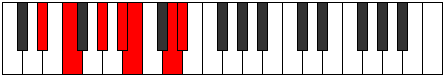

# Mode AFlatGythimic

## Links

- [Documentation](index.md)
- [Scales Index](Scales.md)
- [Modes Index](Modes.md)
- [Chords Index](Chords.md)

## Scale

[Bocrimic](ScaleBocrimic.md)

## Mode

[AFlatGythimic](ModeAFlatGythimic.md)

## Tonic

Ab

## Signature

[CNaturalMajor]

## Perfection

 - 3 Perfect Notes

 - 3 Imperfect Notes

## Notes

- Ab
- Bb
- Cb (Imperfect)
- D (Imperfect)
- Eb
- F (Imperfect)
- Ab

## Illustration

## Relative Modes

| Number | Mode | Tonic | Notes | Illustration |
|--------|------|-------|-------|--------------|
| [717](https://ianring.com/musictheory/scales/717) | [Gythimic](ModeGythimic.md) | G# | G#, A#, B, C##, D#, E#, G# |  |
| [717](https://ianring.com/musictheory/scales/717) | [Gythimic](ModeGythimic.md) | Ab | Ab, Bb, Cb, D, Eb, F, Ab |  |
| [843](https://ianring.com/musictheory/scales/843) | [Molimic](ModeMolimic.md) | D | D, Eb, F, G#, A#, B, D |  |
| [1203](https://ianring.com/musictheory/scales/1203) | [Pagimic](ModePagimic.md) | A# | A#, B, C##, D#, E#, F###, A# |  |
| [1203](https://ianring.com/musictheory/scales/1203) | [Pagimic](ModePagimic.md) | Bb | Bb, Cb, D, Eb, F, G#, Bb |  |
| [1641](https://ianring.com/musictheory/scales/1641) | [Bocrimic](ModeBocrimic.md) | F | F, G#, A#, B, C##, D#, F |  |
| [2469](https://ianring.com/musictheory/scales/2469) | [Staptimic](ModeStaptimic.md) | D# | D#, E#, F###, G###, A##, B###, D# |  |
| [2469](https://ianring.com/musictheory/scales/2469) | [Staptimic](ModeStaptimic.md) | Eb | Eb, F, G#, A#, B, C##, Eb |  |
| [2649](https://ianring.com/musictheory/scales/2649) | [Aeolythimic](ModeAeolythimic.md) | B | B, C##, D#, E#, F###, G###, B |  |

## Chords

### Ab

| Number | Root | Name | Notes | Illustration | Audio |
|--------|------|------|-------|--------------|-------|

### Bb

| Number | Root | Name | Notes | Illustration | Audio |
|--------|------|------|-------|--------------|-------|

### Cb

| Number | Root | Name | Notes | Illustration | Audio |
|--------|------|------|-------|--------------|-------|

### D

| Number | Root | Name | Notes | Illustration | Audio |
|--------|------|------|-------|--------------|-------|

### Eb

| Number | Root | Name | Notes | Illustration | Audio |
|--------|------|------|-------|--------------|-------|

### F

| Number | Root | Name | Notes | Illustration | Audio |
|--------|------|------|-------|--------------|-------|

