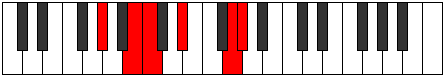
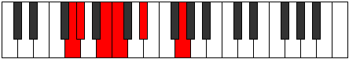
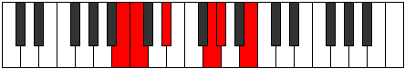
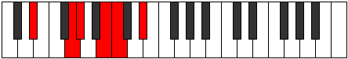
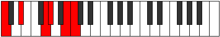

# Mode AFlatIonagitonic

## Links

- [Documentation](index.md)
- [Scales Index](Scales.md)
- [Modes Index](Modes.md)
- [Chords Index](Chords.md)

## Scale

[Zothitonic](ScaleZothitonic.md)

## Mode

[AFlatIonagitonic](ModeAFlatIonagitonic.md)

## Tonic

Ab

## Signature

[CNaturalMajor]

## Perfection

 - 2 Perfect Notes

 - 3 Imperfect Notes

## Notes

- Ab
- B (Imperfect)
- C
- Eb (Imperfect)
- G (Imperfect)
- Ab

## Illustration

## Relative Modes

| Number | Mode | Tonic | Notes | Illustration |
|--------|------|-------|-------|--------------|
| [307](https://ianring.com/musictheory/scales/307) | [Phrolitonic](ModePhrolitonic.md) | G | G, G#, B, C, D#, G |  |
| [787](https://ianring.com/musictheory/scales/787) | [Aeolapritonic](ModeAeolapritonic.md) | B | B, C, D#, G, G#, B |  |
| [817](https://ianring.com/musictheory/scales/817) | [Zothitonic](ModeZothitonic.md) | D# | D#, G, G#, B, C, D# |  |
| [817](https://ianring.com/musictheory/scales/817) | [Zothitonic](ModeZothitonic.md) | Eb | Eb, G, Ab, B, C, Eb |  |
| [2201](https://ianring.com/musictheory/scales/2201) | [Ionagitonic](ModeIonagitonic.md) | G# | G#, B, C, D#, G, G# |  |
| [2201](https://ianring.com/musictheory/scales/2201) | [Ionagitonic](ModeIonagitonic.md) | Ab | Ab, B, C, Eb, G, Ab |  |
| [2441](https://ianring.com/musictheory/scales/2441) | [Kyritonic](ModeKyritonic.md) | C | C, D#, G, G#, B, C |  |

## Chords

### Ab

| Number | Root | Name | Notes | Illustration | Audio |
|--------|------|------|-------|--------------|-------|

### B

| Number | Root | Name | Notes | Illustration | Audio |
|--------|------|------|-------|--------------|-------|
| 2184 | B | [B+](ChordBNaturalAugmented.md) | B, D#, F## |  | [midi](ChordBNaturalAugmentedRootPosition.mid) [ogg](ChordBNaturalAugmentedRootPosition.ogg) |
| 2184 | B | [B+7](ChordBNaturalAugmentedAugmentedSeventh.md) | B, D#, F##, A## |  | [midi](ChordBNaturalAugmentedAugmentedSeventhRootPosition.mid) [ogg](ChordBNaturalAugmentedAugmentedSeventhRootPosition.ogg) |
| 2312 | B | [BM##5](ChordBNaturalMajorDoubleSharpFifth.md) | B, D#, G# |  | [midi](ChordBNaturalMajorDoubleSharpFifthRootPosition.mid) [ogg](ChordBNaturalMajorDoubleSharpFifthRootPosition.ogg) |

### C

| Number | Root | Name | Notes | Illustration | Audio |
|--------|------|------|-------|--------------|-------|
| 129 | C | [C5](ChordCNaturalPowerChord.md) | C, G |  | [midi](ChordCNaturalPowerChordRootPosition.mid) [ogg](ChordCNaturalPowerChordRootPosition.ogg) |
| 137 | C | [Cm](ChordCNaturalMinor.md) | C, Eb, G |  | [midi](ChordCNaturalMinorRootPosition.mid) [ogg](ChordCNaturalMinorRootPosition.ogg) |
| 137 | C | [Cm(add(#9))](ChordCNaturalMinorAddSharpNinth.md) | C, Eb, G, D# |  | [midi](ChordCNaturalMinorAddSharpNinthRootPosition.mid) [ogg](ChordCNaturalMinorAddSharpNinthRootPosition.ogg) |
| 265 | C | [Cm#5](ChordCNaturalMinorSharpFifth.md) | C, Eb, Ab |  | [midi](ChordCNaturalMinorSharpFifthRootPosition.mid) [ogg](ChordCNaturalMinorSharpFifthRootPosition.ogg) |
| 2185 | C | [Cm(M7)](ChordCNaturalMinorMajorSeventh.md) | C, Eb, G, B |  | [midi](ChordCNaturalMinorMajorSeventhRootPosition.mid) [ogg](ChordCNaturalMinorMajorSeventhRootPosition.ogg) |

### Eb

| Number | Root | Name | Notes | Illustration | Audio |
|--------|------|------|-------|--------------|-------|

### G

| Number | Root | Name | Notes | Illustration | Audio |
|--------|------|------|-------|--------------|-------|
| 2184 | G | [G+](ChordGNaturalAugmented.md) | G, B, D# |  | [midi](ChordGNaturalAugmentedRootPosition.mid) [ogg](ChordGNaturalAugmentedRootPosition.ogg) |
| 2184 | G | [G+7](ChordGNaturalAugmentedAugmentedSeventh.md) | G, B, D#, F## |  | [midi](ChordGNaturalAugmentedAugmentedSeventhRootPosition.mid) [ogg](ChordGNaturalAugmentedAugmentedSeventhRootPosition.ogg) |
| 137 | G | [Gsus4#5](ChordGNaturalSuspendedFourthSharpFifth.md) | G, C, D# |  | [midi](ChordGNaturalSuspendedFourthSharpFifthRootPosition.mid) [ogg](ChordGNaturalSuspendedFourthSharpFifthRootPosition.ogg) |

