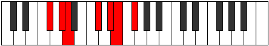

# Mode AFlatIonarimic

## Links

- [Documentation](index.md)
- [Scales Index](Scales.md)
- [Modes Index](Modes.md)
- [Chords Index](Chords.md)

## Scale

[Dyrimic](ScaleDyrimic.md)

## Mode

[AFlatIonarimic](ModeAFlatIonarimic.md)

## Tonic

Ab

## Signature

[CNaturalMajor]

## Perfection

 - 4 Perfect Notes

 - 2 Imperfect Notes

## Notes

- Ab
- Bbb
- C#
- D# (Imperfect)
- E (Imperfect)
- F#
- Ab

## Illustration

## Relative Modes

| Number | Mode | Tonic | Notes | Illustration |
|--------|------|-------|-------|--------------|
| [1443](https://ianring.com/musictheory/scales/1443) | [Ionarimic](ModeIonarimic.md) | Ab | Ab, Bbb, C#, D#, E, F#, Ab |  |
| [429](https://ianring.com/musictheory/scales/429) | [Koptimic](ModeKoptimic.md) | C# | C#, D#, E, F#, G#, A, C# |  |
| [1131](https://ianring.com/musictheory/scales/1131) | [Thocrimic](ModeThocrimic.md) | D# | D#, E, F#, G#, A, B##, D# |  |
| [2613](https://ianring.com/musictheory/scales/2613) | [Aeolanimic](ModeAeolanimic.md) | E | E, F#, G#, A, B##, C###, E |  |
| [1677](https://ianring.com/musictheory/scales/1677) | [Danimic](ModeDanimic.md) | F# | F#, G#, A, B##, C###, D##, F# |  |

## Chords

### Ab

| Number | Root | Name | Notes | Illustration | Audio |
|--------|------|------|-------|--------------|-------|

### Bbb

| Number | Root | Name | Notes | Illustration | Audio |
|--------|------|------|-------|--------------|-------|

### C#

| Number | Root | Name | Notes | Illustration | Audio |
|--------|------|------|-------|--------------|-------|

### D#

| Number | Root | Name | Notes | Illustration | Audio |
|--------|------|------|-------|--------------|-------|

### E

| Number | Root | Name | Notes | Illustration | Audio |
|--------|------|------|-------|--------------|-------|

### F#

| Number | Root | Name | Notes | Illustration | Audio |
|--------|------|------|-------|--------------|-------|

