# Mode AFlatIonogian

## Links

- [Documentation](README.md)
- [Scales Index](Scales.md)
- [Modes Index](Modes.md)
- [Chords Index](Chords.md)

## Scale

[Aeopian](ScaleAeopian.md)

## Mode

[AFlatIonogian](ModeAFlatIonogian.md)

## Tonic

Ab

## Signature

[CNaturalMajor]

## Transposition

2, 1, 1, 1, 4, 2, 1

## Chord Pattern

vi⁰

## Perfection

 - 4 Perfect Notes

 - 3 Imperfect Notes

## Notes

- Ab (Imperfect)
- Bb
- Cb (Imperfect)
- Dbb
- Ebbb
- F
- G (Imperfect)
- Ab (Imperfect)

## Illustration

## Diagram

| Circle of Fifth | Chromatic Circle |
|-----------------|------------------|
|  | 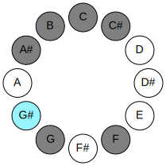 |
## Relative Modes

| Number | Mode | Tonic | Notes | Illustration |
|--------|------|-------|-------|--------------|
| [2621](https://ianring.com/musictheory/scales/2621) | [Ionogian](ModeIonogian.md) | G# | G#, A#, B, C, Db, E#, F##, G# |  |
| [2621](https://ianring.com/musictheory/scales/2621) | [Ionogian](ModeIonogian.md) | Ab | Ab, Bb, Cb, Dbb, Ebbb, F, G, Ab |  |
| [1679](https://ianring.com/musictheory/scales/1679) | [Kydian](ModeKydian.md) | A# | A#, B, C, Db, E#, F##, G#, A# |  |
| [1679](https://ianring.com/musictheory/scales/1679) | [Kydian](ModeKydian.md) | Bb | Bb, Cb, Dbb, Ebbb, F, G, Ab, Bb | 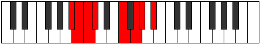 |
| [2887](https://ianring.com/musictheory/scales/2887) | [Gaptian](ModeGaptian.md) | B | B, C, Db, E#, F##, G#, A#, B |  |
| [3491](https://ianring.com/musictheory/scales/3491) | [Tharian](ModeTharian.md) | C | C, Db, E#, F##, G#, A#, B, C |  |
| [3793](https://ianring.com/musictheory/scales/3793) | [Aeopian](ModeAeopian.md) | C# | C#, D###, E###, F###, G###, A##, B#, C# |  |
| [3793](https://ianring.com/musictheory/scales/3793) | [Aeopian](ModeAeopian.md) | Db | Db, E#, F##, G#, A#, B, C, Db |  |
| [493](https://ianring.com/musictheory/scales/493) | [Rygian](ModeRygian.md) | F | F, G, Ab, Bb, Cb, Dbb, Ebbb, F |  |
| [1147](https://ianring.com/musictheory/scales/1147) | [Epynian](ModeEpynian.md) | G | G, Ab, Bb, Cb, Dbb, Ebbb, F, G |  |
## Relative Brightness

| Number | Mode | Tonic | Notes | Circle Of Fifth | Chromatic Circle |
|--------|------|-------|-------|-----------------|------------------|
| [2621](https://ianring.com/musictheory/scales/2621) | [Ionogian](ModeIonogian.md) | G# | G#, A#, B, C, Db, E#, F##, G# | 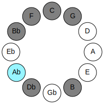 |  |
| [2621](https://ianring.com/musictheory/scales/2621) | [Ionogian](ModeIonogian.md) | Ab | Ab, Bb, Cb, Dbb, Ebbb, F, G, Ab |  |  |
| [1679](https://ianring.com/musictheory/scales/1679) | [Kydian](ModeKydian.md) | A# | A#, B, C, Db, E#, F##, G#, A# | 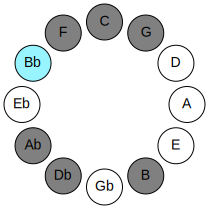 |  |
| [1679](https://ianring.com/musictheory/scales/1679) | [Kydian](ModeKydian.md) | Bb | Bb, Cb, Dbb, Ebbb, F, G, Ab, Bb |  |  |
| [2887](https://ianring.com/musictheory/scales/2887) | [Gaptian](ModeGaptian.md) | B | B, C, Db, E#, F##, G#, A#, B |  |  |
| [3491](https://ianring.com/musictheory/scales/3491) | [Tharian](ModeTharian.md) | C | C, Db, E#, F##, G#, A#, B, C | 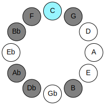 | 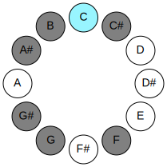 |
| [3793](https://ianring.com/musictheory/scales/3793) | [Aeopian](ModeAeopian.md) | C# | C#, D###, E###, F###, G###, A##, B#, C# |  |  |
| [3793](https://ianring.com/musictheory/scales/3793) | [Aeopian](ModeAeopian.md) | Db | Db, E#, F##, G#, A#, B, C, Db | 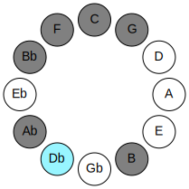 | 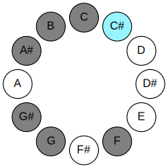 |
| [493](https://ianring.com/musictheory/scales/493) | [Rygian](ModeRygian.md) | F | F, G, Ab, Bb, Cb, Dbb, Ebbb, F | 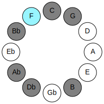 | 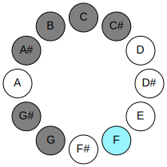 |
| [1147](https://ianring.com/musictheory/scales/1147) | [Epynian](ModeEpynian.md) | G | G, Ab, Bb, Cb, Dbb, Ebbb, F, G | 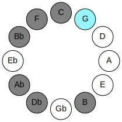 | 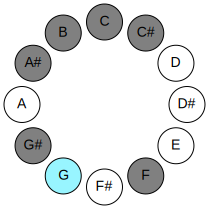 |

## Chords

### Ab

| Number | Root | Name | Notes | Illustration | Audio |
|--------|------|------|-------|--------------|-------|
| 1282 | Ab | [G#sus2bb5](ChordGSharpSuspendedSecondDoubleFlatFifth.md) | G#, A#, C# |  | [midi](ChordGSharpSuspendedSecondDoubleFlatFifthRootPosition.mid) |
| 1282 | Ab | [Absus2bb5](ChordAFlatSuspendedSecondDoubleFlatFifth.md) | Ab, Bb, Db |  | [midi](ChordAFlatSuspendedSecondDoubleFlatFifthRootPosition.mid) |
| 2306 | Ab | [G#mbb5](ChordGSharpMinorDoubleFlatFifth.md) | G#, B, C# |  | [midi](ChordGSharpMinorDoubleFlatFifthRootPosition.mid) |
| 2306 | Ab | [Abmbb5](ChordAFlatMinorDoubleFlatFifth.md) | Ab, Cb, Db |  | [midi](ChordAFlatMinorDoubleFlatFifthRootPosition.mid) |
| 289 | Ab | [G#M##5](ChordGSharpMajorDoubleSharpFifth.md) | G#, B#, E# |  | [midi](ChordGSharpMajorDoubleSharpFifthRootPosition.mid) |
| 289 | Ab | [AbM##5](ChordAFlatMajorDoubleSharpFifth.md) | Ab, C, F |  | [midi](ChordAFlatMajorDoubleSharpFifthRootPosition.mid) |
| 290 | Ab | [G#sus4##5](ChordGSharpSuspendedFourthDoubleSharpFifth.md) | G#, C#, E# |  | [midi](ChordGSharpSuspendedFourthDoubleSharpFifthRootPosition.mid) |
| 290 | Ab | [Absus4##5](ChordAFlatSuspendedFourthDoubleSharpFifth.md) | Ab, Db, F |  | [midi](ChordAFlatSuspendedFourthDoubleSharpFifthRootPosition.mid) |
| 1314 | Ab | [G#M6sus2bb5](ChordGSharpMajorSixthSuspendedSecondDoubleFlatFifth.md) | G#, A#, C#, E# |  | [midi](ChordGSharpMajorSixthSuspendedSecondDoubleFlatFifthRootPosition.mid) |
| 1314 | Ab | [AbM6sus2bb5](ChordAFlatMajorSixthSuspendedSecondDoubleFlatFifth.md) | Ab, Bb, Db, F |  | [midi](ChordAFlatMajorSixthSuspendedSecondDoubleFlatFifthRootPosition.mid) |
| 386 | Ab | [G#Q+](ChordGSharpQuartalAugmented.md) | G#, C#, F## |  | [midi](ChordGSharpQuartalAugmentedRootPosition.mid) |
| 386 | Ab | [AbQ+](ChordAFlatQuartalAugmented.md) | Ab, Db, G |  | [midi](ChordAFlatQuartalAugmentedRootPosition.mid) |
| 417 | Ab | [G#M7##5](ChordGSharpMajorSeventhDoubleSharpFifth.md) | G#, B#, E#, F## |  | [midi](ChordGSharpMajorSeventhDoubleSharpFifthRootPosition.mid) |
| 417 | Ab | [AbM7##5](ChordAFlatMajorSeventhDoubleSharpFifth.md) | Ab, C, F, G |  | [midi](ChordAFlatMajorSeventhDoubleSharpFifthRootPosition.mid) |
| 418 | Ab | [G#M7(sus4)##5](ChordGSharpMajorSeventhSuspendedFourthDoubleSharpFifth.md) | G#, C#, E#, F## |  | [midi](ChordGSharpMajorSeventhSuspendedFourthDoubleSharpFifthRootPosition.mid) |
| 418 | Ab | [AbM7(sus4)##5](ChordAFlatMajorSeventhSuspendedFourthDoubleSharpFifth.md) | Ab, Db, F, G |  | [midi](ChordAFlatMajorSeventhSuspendedFourthDoubleSharpFifthRootPosition.mid) |

### Bb

| Number | Root | Name | Notes | Illustration | Audio |
|--------|------|------|-------|--------------|-------|
| 1056 | Bb | [A#5](ChordASharpPowerChord.md) | A#, E# |  | [midi](ChordASharpPowerChordRootPosition.mid) |
| 1056 | Bb | [Bb5](ChordBFlatPowerChord.md) | Bb, F |  | [midi](ChordBFlatPowerChordRootPosition.mid) |
| 3104 | Bb | [A#phryg](ChordASharpPhrygian.md) | A#, B, E# |  | [midi](ChordASharpPhrygianRootPosition.mid) |
| 3104 | Bb | [Bbphryg](ChordBFlatPhrygian.md) | Bb, Cb, F |  | [midi](ChordBFlatPhrygianRootPosition.mid) |
| 1057 | Bb | [A#sus2](ChordASharpSuspendedSecond.md) | A#, B#, E# |  | [midi](ChordASharpSuspendedSecondRootPosition.mid) |
| 1057 | Bb | [Bbsus2](ChordBFlatSuspendedSecond.md) | Bb, C, F |  | [midi](ChordBFlatSuspendedSecondRootPosition.mid) |
| 1058 | Bb | [A#m](ChordASharpMinor.md) | A#, C#, E# |  | [midi](ChordASharpMinorRootPosition.mid) |
| 1058 | Bb | [A#m(add(#9))](ChordASharpMinorAddSharpNinth.md) | A#, C#, E#, B## |  | [midi](ChordASharpMinorAddSharpNinthRootPosition.mid) |
| 1058 | Bb | [Bbm](ChordBFlatMinor.md) | Bb, Db, F |  | [midi](ChordBFlatMinorRootPosition.mid) |
| 1058 | Bb | [Bbm(add(#9))](ChordBFlatMinorAddSharpNinth.md) | Bb, Db, F, C# |  | [midi](ChordBFlatMinorAddSharpNinthRootPosition.mid) |
| 1059 | Bb | [A#m(add9)](ChordASharpMinorAddNinth.md) | A#, C#, E#, B# |  | [midi](ChordASharpMinorAddNinthRootPosition.mid) |
| 1059 | Bb | [Bbm(add9)](ChordBFlatMinorAddNinth.md) | Bb, Db, F, C |  | [midi](ChordBFlatMinorAddNinthRootPosition.mid) |
| 1185 | Bb | [A#M6sus2](ChordASharpMajorSixthSuspendedSecond.md) | A#, B#, E#, F## |  | [midi](ChordASharpMajorSixthSuspendedSecondRootPosition.mid) |
| 1185 | Bb | [A#7sus2b5](ChordASharpDominantSeventhSuspendedSecondFlatFifth.md) | A#, B#, E#, G |  | [midi](ChordASharpDominantSeventhSuspendedSecondFlatFifthRootPosition.mid) |
| 1185 | Bb | [BbM6sus2](ChordBFlatMajorSixthSuspendedSecond.md) | Bb, C, F, G |  | [midi](ChordBFlatMajorSixthSuspendedSecondRootPosition.mid) |
| 1185 | Bb | [Bb7sus2b5](ChordBFlatDominantSeventhSuspendedSecondFlatFifth.md) | Bb, C, F, Abb |  | [midi](ChordBFlatDominantSeventhSuspendedSecondFlatFifthRootPosition.mid) |
| 1186 | Bb | [A#m6](ChordASharpMinorSixth.md) | A#, C#, E#, F## |  | [midi](ChordASharpMinorSixthRootPosition.mid) |
| 1186 | Bb | [Bbm6](ChordBFlatMinorSixth.md) | Bb, Db, F, G |  | [midi](ChordBFlatMinorSixthRootPosition.mid) |
| 3234 | Bb | [A#m6(addb9)](ChordASharpMinorSixthAddFlatNinth.md) | A#, C#, E#, F##, B |  | [midi](ChordASharpMinorSixthAddFlatNinthRootPosition.mid) |
| 3234 | Bb | [Bbm6(addb9)](ChordBFlatMinorSixthAddFlatNinth.md) | Bb, Db, F, G, Cb |  | [midi](ChordBFlatMinorSixthAddFlatNinthRootPosition.mid) |
| 1187 | Bb | [A#m6(add9)](ChordASharpMinorSixthAddNinth.md) | A#, C#, E#, F##, B# |  | [midi](ChordASharpMinorSixthAddNinthRootPosition.mid) |
| 1187 | Bb | [Bbm6(add9)](ChordBFlatMinorSixthAddNinth.md) | Bb, Db, F, G, C |  | [midi](ChordBFlatMinorSixthAddNinthRootPosition.mid) |
| 1313 | Bb | [A#7sus2](ChordASharpDominantSeventhSuspendedSecond.md) | A#, B#, E#, G# |  | [midi](ChordASharpDominantSeventhSuspendedSecondRootPosition.mid) |
| 1313 | Bb | [A#9sus2](ChordASharpDominantNinthSuspendedSecond.md) | A#, B#, E#, G#, B# |  | [midi](ChordASharpDominantNinthSuspendedSecondRootPosition.mid) |
| 1313 | Bb | [Bb7sus2](ChordBFlatDominantSeventhSuspendedSecond.md) | Bb, C, F, Ab |  | [midi](ChordBFlatDominantSeventhSuspendedSecondRootPosition.mid) |
| 1313 | Bb | [Bb9sus2](ChordBFlatDominantNinthSuspendedSecond.md) | Bb, C, F, Ab, C |  | [midi](ChordBFlatDominantNinthSuspendedSecondRootPosition.mid) |
| 1314 | Bb | [A#m7](ChordASharpMinorSeventh.md) | A#, C#, E#, G# |  | [midi](ChordASharpMinorSeventhRootPosition.mid) |
| 1314 | Bb | [Bbm7](ChordBFlatMinorSeventh.md) | Bb, Db, F, Ab |  | [midi](ChordBFlatMinorSeventhRootPosition.mid) |
| 3362 | Bb | [A#m7b9](ChordASharpMinorSeventhFlatNinth.md) | A#, C#, E#, G#, B |  | [midi](ChordASharpMinorSeventhFlatNinthRootPosition.mid) |
| 3362 | Bb | [Bbm7b9](ChordBFlatMinorSeventhFlatNinth.md) | Bb, Db, F, Ab, Cb |  | [midi](ChordBFlatMinorSeventhFlatNinthRootPosition.mid) |
| 1315 | Bb | [A#m9](ChordASharpMinorNinth.md) | A#, C#, E#, G#, B# |  | [midi](ChordASharpMinorNinthRootPosition.mid) |
| 1315 | Bb | [Bbm9](ChordBFlatMinorNinth.md) | Bb, Db, F, Ab, C |  | [midi](ChordBFlatMinorNinthRootPosition.mid) |
| 1442 | Bb | [A#m7add13](ChordASharpMinorSeventhAddThirteenth.md) | A#, C#, E#, G#, F## |  | [midi](ChordASharpMinorSeventhAddThirteenthRootPosition.mid) |
| 1442 | Bb | [Bbm7add13](ChordBFlatMinorSeventhAddThirteenth.md) | Bb, Db, F, Ab, G |  | [midi](ChordBFlatMinorSeventhAddThirteenthRootPosition.mid) |

### Cb

| Number | Root | Name | Notes | Illustration | Audio |
|--------|------|------|-------|--------------|-------|
| 2081 | Cb | [Bloc](ChordBNaturalLocrian.md) | B, C, F |  | [midi](ChordBNaturalLocrianRootPosition.mid) |
| 2082 | Cb | [B](ChordBNaturalDiminishedFlatThird.md) | B, Db, F |  | [midi](ChordBNaturalDiminishedFlatThirdRootPosition.mid) |
| 2082 | Cb | [Bsus2b5](ChordBNaturalSuspendedSecondFlatFifth.md) | B, C#, F |  | [midi](ChordBNaturalSuspendedSecondFlatFifthRootPosition.mid) |
| 2178 | Cb | [Bsus2#5](ChordBNaturalSuspendedSecondSharpFifth.md) | B, C#, F## |  | [midi](ChordBNaturalSuspendedSecondSharpFifthRootPosition.mid) |
| 2210 | Cb | [Bsus2b5add(#5)](ChordBNaturalSuspendedSecondFlatFifthAddSharpFifth.md) | B, C#, F, F## |  | [midi](ChordBNaturalSuspendedSecondFlatFifthAddSharpFifthRootPosition.mid) |
| 2338 | Cb | [BM6sus2b5](ChordBNaturalMajorSixthSuspendedSecondFlatFifth.md) | B, C#, F, G# |  | [midi](ChordBNaturalMajorSixthSuspendedSecondFlatFifthRootPosition.mid) |

### Dbb

| Number | Root | Name | Notes | Illustration | Audio |
|--------|------|------|-------|--------------|-------|
| 129 | Dbb | [C5](ChordCNaturalPowerChord.md) | C, G |  | [midi](ChordCNaturalPowerChordRootPosition.mid) |
| 131 | Dbb | [Cphryg](ChordCNaturalPhrygian.md) | C, Db, G |  | [midi](ChordCNaturalPhrygianRootPosition.mid) |
| 161 | Dbb | [Csus4](ChordCNaturalSuspendedFourth.md) | C, F, G |  | [midi](ChordCNaturalSuspendedFourthRootPosition.mid) |
| 289 | Dbb | [Csus4#5](ChordCNaturalSuspendedFourthSharpFifth.md) | C, F, G# |  | [midi](ChordCNaturalSuspendedFourthSharpFifthRootPosition.mid) |
| 1057 | Dbb | [CQ](ChordCNaturalQuartal.md) | C, F, Bb |  | [midi](ChordCNaturalQuartalRootPosition.mid) |
| 1185 | Dbb | [C7sus4](ChordCNaturalDominantSeventhSuspendedFourth.md) | C, F, G, Bb |  | [midi](ChordCNaturalDominantSeventhSuspendedFourthRootPosition.mid) |
| 2081 | Dbb | [CQ+](ChordCNaturalQuartalAugmented.md) | C, F, B |  | [midi](ChordCNaturalQuartalAugmentedRootPosition.mid) |
| 2179 | Dbb | [Cphryg+7](ChordCNaturalPhrygianAddSeventh.md) | C, Db, G, B |  | [midi](ChordCNaturalPhrygianAddSeventhRootPosition.mid) |
| 2209 | Dbb | [CM7(sus4)](ChordCNaturalMajorSeventhSuspendedFourth.md) | C, F, G, B |  | [midi](ChordCNaturalMajorSeventhSuspendedFourthRootPosition.mid) |
| 2337 | Dbb | [CM7(sus4)#5](ChordCNaturalMajorSeventhSuspendedFourthSharpFifth.md) | C, F, G#, B |  | [midi](ChordCNaturalMajorSeventhSuspendedFourthSharpFifthRootPosition.mid) |

### Ebbb

| Number | Root | Name | Notes | Illustration | Audio |
|--------|------|------|-------|--------------|-------|
| 162 | Ebbb | [C#Mb5](ChordCSharpMajorFlatFifth.md) | C#, E#, G |  | [midi](ChordCSharpMajorFlatFifthRootPosition.mid) |
| 162 | Ebbb | [DbMb5](ChordDFlatMajorFlatFifth.md) | Db, F, Abb |  | [midi](ChordDFlatMajorFlatFifthRootPosition.mid) |
| 258 | Ebbb | [C#5](ChordCSharpPowerChord.md) | C#, G# |  | [midi](ChordCSharpPowerChordRootPosition.mid) |
| 258 | Ebbb | [Db5](ChordDFlatPowerChord.md) | Db, Ab |  | [midi](ChordDFlatPowerChordRootPosition.mid) |
| 290 | Ebbb | [C#M](ChordCSharpMajor.md) | C#, E#, G# |  | [midi](ChordCSharpMajorRootPosition.mid) |
| 290 | Ebbb | [DbM](ChordDFlatMajor.md) | Db, F, Ab |  | [midi](ChordDFlatMajorRootPosition.mid) |
| 386 | Ebbb | [C#lyd](ChordCSharpLydian.md) | C#, F##, G# |  | [midi](ChordCSharpLydianRootPosition.mid) |
| 386 | Ebbb | [Dblyd](ChordDFlatLydian.md) | Db, G, Ab |  | [midi](ChordDFlatLydianRootPosition.mid) |
| 418 | Ebbb | [C#M(add(#4))](ChordCSharpMajorAddSharpFourth.md) | C#, E#, F##, G# |  | [midi](ChordCSharpMajorAddSharpFourthRootPosition.mid) |
| 418 | Ebbb | [DbM(add(#4))](ChordDFlatMajorAddSharpFourth.md) | Db, F, G, Ab |  | [midi](ChordDFlatMajorAddSharpFourthRootPosition.mid) |
| 1058 | Ebbb | [C#M##5](ChordCSharpMajorDoubleSharpFifth.md) | C#, E#, A# |  | [midi](ChordCSharpMajorDoubleSharpFifthRootPosition.mid) |
| 1058 | Ebbb | [DbM##5](ChordDFlatMajorDoubleSharpFifth.md) | Db, F, Bb |  | [midi](ChordDFlatMajorDoubleSharpFifthRootPosition.mid) |
| 1186 | Ebbb | [C#M6b5](ChordCSharpMajorSixthFlatFifth.md) | C#, E#, G, A# |  | [midi](ChordCSharpMajorSixthFlatFifthRootPosition.mid) |
| 1186 | Ebbb | [DbM6b5](ChordDFlatMajorSixthFlatFifth.md) | Db, F, Abb, Bb |  | [midi](ChordDFlatMajorSixthFlatFifthRootPosition.mid) |
| 1314 | Ebbb | [C#M6](ChordCSharpMajorSixth.md) | C#, E#, G#, A# |  | [midi](ChordCSharpMajorSixthRootPosition.mid) |
| 1314 | Ebbb | [DbM6](ChordDFlatMajorSixth.md) | Db, F, Ab, Bb |  | [midi](ChordDFlatMajorSixthRootPosition.mid) |
| 2210 | Ebbb | [C#7b5](ChordCSharpDominantSeventhFlatFifth.md) | C#, E#, G, B |  | [midi](ChordCSharpDominantSeventhFlatFifthRootPosition.mid) |
| 2210 | Ebbb | [Db7b5](ChordDFlatDominantSeventhFlatFifth.md) | Db, F, Abb, Cb |  | [midi](ChordDFlatDominantSeventhFlatFifthRootPosition.mid) |
| 2338 | Ebbb | [C#7](ChordCSharpDominantSeventh.md) | C#, E#, G#, B |  | [midi](ChordCSharpDominantSeventhRootPosition.mid) |
| 2338 | Ebbb | [Db7](ChordDFlatDominantSeventh.md) | Db, F, Ab, Cb |  | [midi](ChordDFlatDominantSeventhRootPosition.mid) |
| 2466 | Ebbb | [C#7add(#4)](ChordCSharpDominantSeventhAddSharpFourth.md) | C#, E#, F##, G#, B |  | [midi](ChordCSharpDominantSeventhAddSharpFourthRootPosition.mid) |
| 2466 | Ebbb | [C#7#11](ChordCSharpDominantSeventhSharpEleventh.md) | C#, E#, G#, B, F## |  | [midi](ChordCSharpDominantSeventhSharpEleventhRootPosition.mid) |
| 2466 | Ebbb | [Db7add(#4)](ChordDFlatDominantSeventhAddSharpFourth.md) | Db, F, G, Ab, Cb |  | [midi](ChordDFlatDominantSeventhAddSharpFourthRootPosition.mid) |
| 2466 | Ebbb | [Db7#11](ChordDFlatDominantSeventhSharpEleventh.md) | Db, F, Ab, Cb, G |  | [midi](ChordDFlatDominantSeventhSharpEleventhRootPosition.mid) |
| 3362 | Ebbb | [C#7add13](ChordCSharpDominantSeventhAddThirteenth.md) | C#, E#, G#, B, A# |  | [midi](ChordCSharpDominantSeventhAddThirteenthRootPosition.mid) |
| 3362 | Ebbb | [Db7add13](ChordDFlatDominantSeventhAddThirteenth.md) | Db, F, Ab, Cb, Bb |  | [midi](ChordDFlatDominantSeventhAddThirteenthRootPosition.mid) |
| 163 | Ebbb | [C#M7b5](ChordCSharpMajorSeventhFlatFifth.md) | C#, E#, G, B# |  | [midi](ChordCSharpMajorSeventhFlatFifthRootPosition.mid) |
| 163 | Ebbb | [DbM7b5](ChordDFlatMajorSeventhFlatFifth.md) | Db, F, Abb, C |  | [midi](ChordDFlatMajorSeventhFlatFifthRootPosition.mid) |
| 291 | Ebbb | [C#M7](ChordCSharpMajorSeventh.md) | C#, E#, G#, B# |  | [midi](ChordCSharpMajorSeventhRootPosition.mid) |
| 291 | Ebbb | [DbM7](ChordDFlatMajorSeventh.md) | Db, F, Ab, C |  | [midi](ChordDFlatMajorSeventhRootPosition.mid) |
| 387 | Ebbb | [C#lyd(M7)](ChordCSharpLydianMajorSeventh.md) | C#, F##, G#, B# |  | [midi](ChordCSharpLydianMajorSeventhRootPosition.mid) |
| 387 | Ebbb | [Dblyd(M7)](ChordDFlatLydianMajorSeventh.md) | Db, G, Ab, C |  | [midi](ChordDFlatLydianMajorSeventhRootPosition.mid) |
| 419 | Ebbb | [C#M7add(#11)](ChordCSharpMajorSeventhAddSharpEleventh.md) | C#, E#, G#, B#, F## |  | [midi](ChordCSharpMajorSeventhAddSharpEleventhRootPosition.mid) |
| 419 | Ebbb | [C#M7add(#4)](ChordCSharpMajorSeventhAddSharpFourth.md) | C#, E#, F##, G#, B# |  | [midi](ChordCSharpMajorSeventhAddSharpFourthRootPosition.mid) |
| 419 | Ebbb | [DbM7add(#11)](ChordDFlatMajorSeventhAddSharpEleventh.md) | Db, F, Ab, C, G |  | [midi](ChordDFlatMajorSeventhAddSharpEleventhRootPosition.mid) |
| 419 | Ebbb | [DbM7add(#4)](ChordDFlatMajorSeventhAddSharpFourth.md) | Db, F, G, Ab, C |  | [midi](ChordDFlatMajorSeventhAddSharpFourthRootPosition.mid) |
| 1059 | Ebbb | [C#M7##5](ChordCSharpMajorSeventhDoubleSharpFifth.md) | C#, E#, A#, B# |  | [midi](ChordCSharpMajorSeventhDoubleSharpFifthRootPosition.mid) |
| 1059 | Ebbb | [DbM7##5](ChordDFlatMajorSeventhDoubleSharpFifth.md) | Db, F, Bb, C |  | [midi](ChordDFlatMajorSeventhDoubleSharpFifthRootPosition.mid) |
| 1315 | Ebbb | [C#M7add13](ChordCSharpMajorSeventhAddThirteenth.md) | C#, E#, G#, B#, A# |  | [midi](ChordCSharpMajorSeventhAddThirteenthRootPosition.mid) |
| 1315 | Ebbb | [DbM7add13](ChordDFlatMajorSeventhAddThirteenth.md) | Db, F, Ab, C, Bb |  | [midi](ChordDFlatMajorSeventhAddThirteenthRootPosition.mid) |

### F

| Number | Root | Name | Notes | Illustration | Audio |
|--------|------|------|-------|--------------|-------|
| 1184 | F | [Fsus2bb5](ChordFNaturalSuspendedSecondDoubleFlatFifth.md) | F, G, Bb |  | [midi](ChordFNaturalSuspendedSecondDoubleFlatFifthRootPosition.mid) |
| 1312 | F | [Fmbb5](ChordFNaturalMinorDoubleFlatFifth.md) | F, Ab, Bb |  | [midi](ChordFNaturalMinorDoubleFlatFifthRootPosition.mid) |
| 2208 | F | [F](ChordFNaturalDiminishedFlatThird.md) | F, Abb, Cb |  | [midi](ChordFNaturalDiminishedFlatThirdRootPosition.mid) |
| 2208 | F | [Fsus2b5](ChordFNaturalSuspendedSecondFlatFifth.md) | F, G, Cb |  | [midi](ChordFNaturalSuspendedSecondFlatFifthRootPosition.mid) |
| 2336 | F | [Fo](ChordFNaturalDiminished.md) | F, Ab, Cb |  | [midi](ChordFNaturalDiminishedRootPosition.mid) |
| 3104 | F | [Fsus4b5](ChordFNaturalSuspendedFourthFlatFifth.md) | F, Bb, Cb |  | [midi](ChordFNaturalSuspendedFourthFlatFifthRootPosition.mid) |
| 33 | F | [F5](ChordFNaturalPowerChord.md) | F, C |  | [midi](ChordFNaturalPowerChordRootPosition.mid) |
| 161 | F | [Fsus2](ChordFNaturalSuspendedSecond.md) | F, G, C |  | [midi](ChordFNaturalSuspendedSecondRootPosition.mid) |
| 289 | F | [Fm](ChordFNaturalMinor.md) | F, Ab, C |  | [midi](ChordFNaturalMinorRootPosition.mid) |
| 289 | F | [Fm(add(#9))](ChordFNaturalMinorAddSharpNinth.md) | F, Ab, C, G# |  | [midi](ChordFNaturalMinorAddSharpNinthRootPosition.mid) |
| 417 | F | [Fm(add9)](ChordFNaturalMinorAddNinth.md) | F, Ab, C, G |  | [midi](ChordFNaturalMinorAddNinthRootPosition.mid) |
| 1057 | F | [Fsus4](ChordFNaturalSuspendedFourth.md) | F, Bb, C |  | [midi](ChordFNaturalSuspendedFourthRootPosition.mid) |
| 1313 | F | [Fm(add11)](ChordFNaturalMinorAddEleventh.md) | F, Ab, C, Bb |  | [midi](ChordFNaturalMinorAddEleventhRootPosition.mid) |
| 1313 | F | [Fm(add4)](ChordFNaturalMinorAddFourth.md) | F, Ab, Bb, C |  | [midi](ChordFNaturalMinorAddFourthRootPosition.mid) |
| 2081 | F | [Flyd](ChordFNaturalLydian.md) | F, B, C |  | [midi](ChordFNaturalLydianRootPosition.mid) |
| 2337 | F | [Fm(add(#4))](ChordFNaturalMinorAddSharpFourth.md) | F, Ab, B, C |  | [midi](ChordFNaturalMinorAddSharpFourthRootPosition.mid) |
| 162 | F | [Fsus2#5](ChordFNaturalSuspendedSecondSharpFifth.md) | F, G, C# |  | [midi](ChordFNaturalSuspendedSecondSharpFifthRootPosition.mid) |
| 290 | F | [Fm#5](ChordFNaturalMinorSharpFifth.md) | F, Ab, Db |  | [midi](ChordFNaturalMinorSharpFifthRootPosition.mid) |
| 1058 | F | [Fsus4#5](ChordFNaturalSuspendedFourthSharpFifth.md) | F, Bb, C# |  | [midi](ChordFNaturalSuspendedFourthSharpFifthRootPosition.mid) |
| 2210 | F | [Fsus2b5add(#5)](ChordFNaturalSuspendedSecondFlatFifthAddSharpFifth.md) | F, G, Cb, C# |  | [midi](ChordFNaturalSuspendedSecondFlatFifthAddSharpFifthRootPosition.mid) |

### G

| Number | Root | Name | Notes | Illustration | Audio |
|--------|------|------|-------|--------------|-------|
| 1153 | G | [Gmbb5](ChordGNaturalMinorDoubleFlatFifth.md) | G, Bb, C |  | [midi](ChordGNaturalMinorDoubleFlatFifthRootPosition.mid) |
| 386 | G | [Gloc](ChordGNaturalLocrian.md) | G, Ab, Db |  | [midi](ChordGNaturalLocrianRootPosition.mid) |
| 1154 | G | [Go](ChordGNaturalDiminished.md) | G, Bb, Db |  | [midi](ChordGNaturalDiminishedRootPosition.mid) |
| 2178 | G | [GMb5](ChordGNaturalMajorFlatFifth.md) | G, B, Db |  | [midi](ChordGNaturalMajorFlatFifthRootPosition.mid) |
| 131 | G | [Gsus4b5](ChordGNaturalSuspendedFourthFlatFifth.md) | G, C, Db |  | [midi](ChordGNaturalSuspendedFourthFlatFifthRootPosition.mid) |
| 161 | G | [GQ](ChordGNaturalQuartal.md) | G, C, F |  | [midi](ChordGNaturalQuartalRootPosition.mid) |
| 1185 | G | [Gm7bb5](ChordGNaturalMinorSeventhDoubleFlatFifth.md) | G, Bb, C, F |  | [midi](ChordGNaturalMinorSeventhDoubleFlatFifthRootPosition.mid) |
| 1186 | G | [Gø7](ChordGNaturalHalfDiminishedSeventh.md) | G, Bb, Db, F |  | [midi](ChordGNaturalHalfDiminishedSeventhRootPosition.mid) |
| 2210 | G | [G7b5](ChordGNaturalDominantSeventhFlatFifth.md) | G, B, Db, F |  | [midi](ChordGNaturalDominantSeventhFlatFifthRootPosition.mid) |
| 2466 | G | [G7b5b9](ChordGNaturalDominantSeventhFlatFifthFlatNinth.md) | G, B, Db, F, Ab |  | [midi](ChordGNaturalDominantSeventhFlatFifthFlatNinthRootPosition.mid) |

