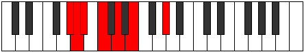
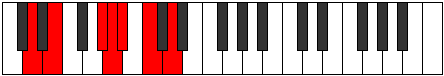

# Mode AFlatIonorimic

## Links

- [Documentation](index.md)
- [Scales Index](Scales.md)
- [Modes Index](Modes.md)
- [Chords Index](Chords.md)

## Scale

[Mycrimic](ScaleMycrimic.md)

## Mode

[AFlatIonorimic](ModeAFlatIonorimic.md)

## Tonic

Ab

## Signature

[CNaturalMajor]

## Perfection

 - 2 Perfect Notes

 - 4 Imperfect Notes

## Notes

- Ab (Imperfect)
- Bbb
- Cbb (Imperfect)
- Dbb (Imperfect)
- Ebb
- Fb (Imperfect)
- Ab (Imperfect)

## Illustration

## Relative Modes

| Number | Mode | Tonic | Notes | Illustration |
|--------|------|-------|-------|--------------|
| [343](https://ianring.com/musictheory/scales/343) | [Ionorimic](ModeIonorimic.md) | G# | G#, A, Bb, C, D, E, G# |  |
| [343](https://ianring.com/musictheory/scales/343) | [Ionorimic](ModeIonorimic.md) | Ab | Ab, Bbb, Cbb, Dbb, Ebb, Fb, Ab |  |
| [1393](https://ianring.com/musictheory/scales/1393) | [Mycrimic](ModeMycrimic.md) | E | E, F###, G##, A#, B#, C##, E |  |
| [1477](https://ianring.com/musictheory/scales/1477) | [Phrylimic](ModePhrylimic.md) | D | D, E, F###, G##, A#, B#, D |  |
| [1813](https://ianring.com/musictheory/scales/1813) | [Katothimic](ModeKatothimic.md) | C | C, D, E, F###, G##, A#, C |  |
| [2219](https://ianring.com/musictheory/scales/2219) | [Phrydimic](ModePhrydimic.md) | A | A, Bb, C, D, E, F###, A |  |
| [3157](https://ianring.com/musictheory/scales/3157) | [Zyptimic](ModeZyptimic.md) | A# | A#, B#, C##, D##, F###, G##, A# |  |
| [3157](https://ianring.com/musictheory/scales/3157) | [Zyptimic](ModeZyptimic.md) | Bb | Bb, C, D, E, F###, G##, Bb |  |

## Chords

### Ab

| Number | Root | Name | Notes | Illustration | Audio |
|--------|------|------|-------|--------------|-------|

### Bbb

| Number | Root | Name | Notes | Illustration | Audio |
|--------|------|------|-------|--------------|-------|

### Cbb

| Number | Root | Name | Notes | Illustration | Audio |
|--------|------|------|-------|--------------|-------|

### Dbb

| Number | Root | Name | Notes | Illustration | Audio |
|--------|------|------|-------|--------------|-------|

### Ebb

| Number | Root | Name | Notes | Illustration | Audio |
|--------|------|------|-------|--------------|-------|

### Fb

| Number | Root | Name | Notes | Illustration | Audio |
|--------|------|------|-------|--------------|-------|

