# Mode AFlatIonyrian

## Links

- [Documentation](README.md)
- [Scales Index](Scales.md)
- [Modes Index](Modes.md)
- [Chords Index](Chords.md)

## Parent Scale

[Katogian](ScaleKatogian.md)

## Mode

[AFlatIonyrian](ModeAFlatIonyrian.md)

## Number

2619

## Luminosity

6

## Tonic

Ab

## Signature

C

## Transposition

1, 2, 1, 1, 4, 2, 1

## Chord Pattern

vi⁰

## Perfection

 - 3 Perfect Notes

 - 4 Imperfect Notes

 - Perfection Profile - false, false, false, true, true, true, false

## Notes

- Ab (Imperfect)
- Bbb (Imperfect)
- Cb (Imperfect)
- Dbb
- Ebbb
- F
- G (Imperfect)
- Ab (Imperfect)

## Illustration

## Diagram

| Circle of Fifth | Chromatic Circle |
|-----------------|------------------|
| 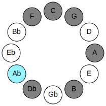 | 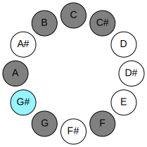 |
## Relative Modes

| Number | Mode | Luminosity | Tonic | Notes | Illustration |
|--------|------|------------|-------|-------|--------------|
| [2619](https://ianring.com/musictheory/scales/2619) | [Ionyrian](ModeIonyrian.md) | -1 | G# | G#, A, B, C, Db, E#, F##, G# |  |
| [3357](https://ianring.com/musictheory/scales/3357) | [Phrodian](ModePhrodian.md) | -1 | A | A, B, C, Db, E#, F##, G#, A |  |
| [1863](https://ianring.com/musictheory/scales/1863) | [Pycrian](ModePycrian.md) | -1 | B | B, C, Db, E#, F##, G#, A, B |  |
| [2979](https://ianring.com/musictheory/scales/2979) | [Gyptian](ModeGyptian.md) | 6 | C | C, Db, E#, F##, G#, A, B, C |  |
| [3537](https://ianring.com/musictheory/scales/3537) | [Katogian](ModeKatogian.md) | 7 | C# | C#, D###, E###, F###, G##, A##, B#, C# |  |
| [477](https://ianring.com/musictheory/scales/477) | [Stacrian](ModeStacrian.md) | -1 | F | F, G, Ab, Bbb, Cb, Dbb, Ebbb, F |  |
| [1143](https://ianring.com/musictheory/scales/1143) | [Styrian](ModeStyrian.md) | 5 | G | G, Ab, Bbb, Cb, Dbb, Ebbb, F, G |  |
## Relative Brightness

| Number | Mode | Luminosity | Tonic | Notes | Circle Of Fifth | Chromatic Circle |
|--------|------|------------|-------|-------|-----------------|------------------|
| [2619](https://ianring.com/musictheory/scales/2619) | [Ionyrian](ModeIonyrian.md) | 6 | G# | G#, A, B, C, Db, E#, F##, G# |  |  |
| [2619](https://ianring.com/musictheory/scales/2619) | [Ionyrian](ModeIonyrian.md) | 6 | Ab | Ab, Bbb, Cb, Dbb, Ebbb, F, G, Ab |  |  |
| [3357](https://ianring.com/musictheory/scales/3357) | [Phrodian](ModePhrodian.md) | -1 | A | A, B, C, Db, E#, F##, G#, A | 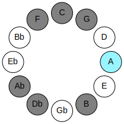 | 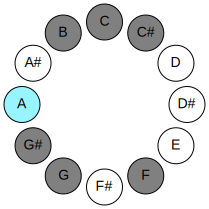 |
| [1863](https://ianring.com/musictheory/scales/1863) | [Pycrian](ModePycrian.md) | -1 | B | B, C, Db, E#, F##, G#, A, B | 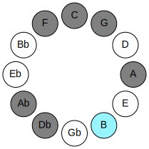 | 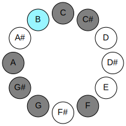 |
| [2979](https://ianring.com/musictheory/scales/2979) | [Gyptian](ModeGyptian.md) | -1 | C | C, Db, E#, F##, G#, A, B, C |  | 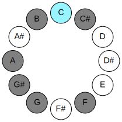 |
| [3537](https://ianring.com/musictheory/scales/3537) | [Katogian](ModeKatogian.md) | 7 | C# | C#, D###, E###, F###, G##, A##, B#, C# | 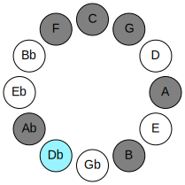 | 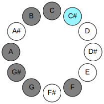 |
| [3537](https://ianring.com/musictheory/scales/3537) | [Katogian](ModeKatogian.md) | 7 | Db | Db, E#, F##, G#, A, B, C, Db |  |  |
| [477](https://ianring.com/musictheory/scales/477) | [Stacrian](ModeStacrian.md) | -1 | F | F, G, Ab, Bbb, Cb, Dbb, Ebbb, F | 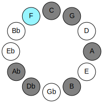 | 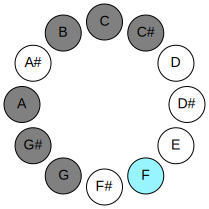 |
| [1143](https://ianring.com/musictheory/scales/1143) | [Styrian](ModeStyrian.md) | -1 | G | G, Ab, Bbb, Cb, Dbb, Ebbb, F, G | 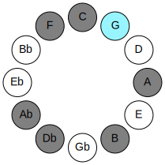 | 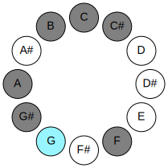 |

## Chords

### Ab

| Number | Root | Name | Notes | Illustration | Audio |
|--------|------|------|-------|--------------|-------|
| 2306 | Ab | [G#mbb5](ChordGSharpMinorDoubleFlatFifth.md) | G#, B, C# |  | [midi](ChordGSharpMinorDoubleFlatFifthRootPosition.mid) |
| 2306 | Ab | [Abmbb5](ChordAFlatMinorDoubleFlatFifth.md) | Ab, Cb, Db |  | [midi](ChordAFlatMinorDoubleFlatFifthRootPosition.mid) |
| 289 | Ab | [G#M##5](ChordGSharpMajorDoubleSharpFifth.md) | G#, B#, E# |  | [midi](ChordGSharpMajorDoubleSharpFifthRootPosition.mid) |
| 289 | Ab | [AbM##5](ChordAFlatMajorDoubleSharpFifth.md) | Ab, C, F |  | [midi](ChordAFlatMajorDoubleSharpFifthRootPosition.mid) |
| 290 | Ab | [G#sus4##5](ChordGSharpSuspendedFourthDoubleSharpFifth.md) | G#, C#, E# |  | [midi](ChordGSharpSuspendedFourthDoubleSharpFifthRootPosition.mid) |
| 290 | Ab | [Absus4##5](ChordAFlatSuspendedFourthDoubleSharpFifth.md) | Ab, Db, F |  | [midi](ChordAFlatSuspendedFourthDoubleSharpFifthRootPosition.mid) |
| 386 | Ab | [G#Q+](ChordGSharpQuartalAugmented.md) | G#, C#, F## |  | [midi](ChordGSharpQuartalAugmentedRootPosition.mid) |
| 386 | Ab | [AbQ+](ChordAFlatQuartalAugmented.md) | Ab, Db, G |  | [midi](ChordAFlatQuartalAugmentedRootPosition.mid) |
| 417 | Ab | [G#M7##5](ChordGSharpMajorSeventhDoubleSharpFifth.md) | G#, B#, E#, F## |  | [midi](ChordGSharpMajorSeventhDoubleSharpFifthRootPosition.mid) |
| 417 | Ab | [AbM7##5](ChordAFlatMajorSeventhDoubleSharpFifth.md) | Ab, C, F, G |  | [midi](ChordAFlatMajorSeventhDoubleSharpFifthRootPosition.mid) |
| 418 | Ab | [G#M7(sus4)##5](ChordGSharpMajorSeventhSuspendedFourthDoubleSharpFifth.md) | G#, C#, E#, F## |  | [midi](ChordGSharpMajorSeventhSuspendedFourthDoubleSharpFifthRootPosition.mid) |
| 418 | Ab | [AbM7(sus4)##5](ChordAFlatMajorSeventhSuspendedFourthDoubleSharpFifth.md) | Ab, Db, F, G |  | [midi](ChordAFlatMajorSeventhSuspendedFourthDoubleSharpFifthRootPosition.mid) |

### Bbb

| Number | Root | Name | Notes | Illustration | Audio |
|--------|------|------|-------|--------------|-------|
| 2592 | Bbb | [Asus2#5](ChordANaturalSuspendedSecondSharpFifth.md) | A, B, E# |  | [midi](ChordANaturalSuspendedSecondSharpFifthRootPosition.mid) |
| 545 | Bbb | [Am#5](ChordANaturalMinorSharpFifth.md) | A, C, F |  | [midi](ChordANaturalMinorSharpFifthRootPosition.mid) |
| 546 | Bbb | [A+](ChordANaturalAugmented.md) | A, C#, E# |  | [midi](ChordANaturalAugmentedRootPosition.mid) |
| 546 | Bbb | [A+7](ChordANaturalAugmentedAugmentedSeventh.md) | A, C#, E#, G## |  | [midi](ChordANaturalAugmentedAugmentedSeventhRootPosition.mid) |
| 673 | Bbb | [Am7#5](ChordANaturalMinorSeventhSharpFifth.md) | A, C, E#, G |  | [midi](ChordANaturalMinorSeventhSharpFifthRootPosition.mid) |
| 802 | Bbb | [A+(M7)](ChordANaturalAugmentedMajorSeventh.md) | A, C#, E#, G# |  | [midi](ChordANaturalAugmentedMajorSeventhRootPosition.mid) |

### Cb

| Number | Root | Name | Notes | Illustration | Audio |
|--------|------|------|-------|--------------|-------|
| 2081 | Cb | [Bloc](ChordBNaturalLocrian.md) | B, C, F |  | [midi](ChordBNaturalLocrianRootPosition.mid) |
| 2082 | Cb | [B](ChordBNaturalDiminishedFlatThird.md) | B, Db, F |  | [midi](ChordBNaturalDiminishedFlatThirdRootPosition.mid) |
| 2082 | Cb | [Bsus2b5](ChordBNaturalSuspendedSecondFlatFifth.md) | B, C#, F |  | [midi](ChordBNaturalSuspendedSecondFlatFifthRootPosition.mid) |
| 2178 | Cb | [Bsus2#5](ChordBNaturalSuspendedSecondSharpFifth.md) | B, C#, F## |  | [midi](ChordBNaturalSuspendedSecondSharpFifthRootPosition.mid) |
| 2210 | Cb | [Bsus2b5add(#5)](ChordBNaturalSuspendedSecondFlatFifthAddSharpFifth.md) | B, C#, F, F## |  | [midi](ChordBNaturalSuspendedSecondFlatFifthAddSharpFifthRootPosition.mid) |
| 2338 | Cb | [BM6sus2b5](ChordBNaturalMajorSixthSuspendedSecondFlatFifth.md) | B, C#, F, G# |  | [midi](ChordBNaturalMajorSixthSuspendedSecondFlatFifthRootPosition.mid) |

### Dbb

| Number | Root | Name | Notes | Illustration | Audio |
|--------|------|------|-------|--------------|-------|
| 129 | Dbb | [C5](ChordCNaturalPowerChord.md) | C, G |  | [midi](ChordCNaturalPowerChordRootPosition.mid) |
| 131 | Dbb | [Cphryg](ChordCNaturalPhrygian.md) | C, Db, G |  | [midi](ChordCNaturalPhrygianRootPosition.mid) |
| 161 | Dbb | [Csus4](ChordCNaturalSuspendedFourth.md) | C, F, G |  | [midi](ChordCNaturalSuspendedFourthRootPosition.mid) |
| 289 | Dbb | [Csus4#5](ChordCNaturalSuspendedFourthSharpFifth.md) | C, F, G# |  | [midi](ChordCNaturalSuspendedFourthSharpFifthRootPosition.mid) |
| 545 | Dbb | [Csus4##5](ChordCNaturalSuspendedFourthDoubleSharpFifth.md) | C, F, A |  | [midi](ChordCNaturalSuspendedFourthDoubleSharpFifthRootPosition.mid) |
| 673 | Dbb | [CM6sus4](ChordCNaturalMajorSixthSuspendedFourth.md) | C, F, G, A |  | [midi](ChordCNaturalMajorSixthSuspendedFourthRootPosition.mid) |
| 2081 | Dbb | [CQ+](ChordCNaturalQuartalAugmented.md) | C, F, B |  | [midi](ChordCNaturalQuartalAugmentedRootPosition.mid) |
| 2179 | Dbb | [Cphryg+7](ChordCNaturalPhrygianAddSeventh.md) | C, Db, G, B |  | [midi](ChordCNaturalPhrygianAddSeventhRootPosition.mid) |
| 2209 | Dbb | [CM7(sus4)](ChordCNaturalMajorSeventhSuspendedFourth.md) | C, F, G, B |  | [midi](ChordCNaturalMajorSeventhSuspendedFourthRootPosition.mid) |
| 2337 | Dbb | [CM7(sus4)#5](ChordCNaturalMajorSeventhSuspendedFourthSharpFifth.md) | C, F, G#, B |  | [midi](ChordCNaturalMajorSeventhSuspendedFourthSharpFifthRootPosition.mid) |
| 2593 | Dbb | [CM7(sus4)##5](ChordCNaturalMajorSeventhSuspendedFourthDoubleSharpFifth.md) | C, F, A, B |  | [midi](ChordCNaturalMajorSeventhSuspendedFourthDoubleSharpFifthRootPosition.mid) |

### Ebbb

| Number | Root | Name | Notes | Illustration | Audio |
|--------|------|------|-------|--------------|-------|
| 162 | Ebbb | [C#Mb5](ChordCSharpMajorFlatFifth.md) | C#, E#, G |  | [midi](ChordCSharpMajorFlatFifthRootPosition.mid) |
| 162 | Ebbb | [DbMb5](ChordDFlatMajorFlatFifth.md) | Db, F, Abb |  | [midi](ChordDFlatMajorFlatFifthRootPosition.mid) |
| 258 | Ebbb | [C#5](ChordCSharpPowerChord.md) | C#, G# |  | [midi](ChordCSharpPowerChordRootPosition.mid) |
| 258 | Ebbb | [Db5](ChordDFlatPowerChord.md) | Db, Ab |  | [midi](ChordDFlatPowerChordRootPosition.mid) |
| 290 | Ebbb | [C#M](ChordCSharpMajor.md) | C#, E#, G# |  | [midi](ChordCSharpMajorRootPosition.mid) |
| 290 | Ebbb | [DbM](ChordDFlatMajor.md) | Db, F, Ab |  | [midi](ChordDFlatMajorRootPosition.mid) |
| 386 | Ebbb | [C#lyd](ChordCSharpLydian.md) | C#, F##, G# |  | [midi](ChordCSharpLydianRootPosition.mid) |
| 386 | Ebbb | [Dblyd](ChordDFlatLydian.md) | Db, G, Ab |  | [midi](ChordDFlatLydianRootPosition.mid) |
| 418 | Ebbb | [C#M(add(#4))](ChordCSharpMajorAddSharpFourth.md) | C#, E#, F##, G# |  | [midi](ChordCSharpMajorAddSharpFourthRootPosition.mid) |
| 418 | Ebbb | [DbM(add(#4))](ChordDFlatMajorAddSharpFourth.md) | Db, F, G, Ab |  | [midi](ChordDFlatMajorAddSharpFourthRootPosition.mid) |
| 546 | Ebbb | [C#+](ChordCSharpAugmented.md) | C#, E#, G## |  | [midi](ChordCSharpAugmentedRootPosition.mid) |
| 546 | Ebbb | [C#+7](ChordCSharpAugmentedAugmentedSeventh.md) | C#, E#, G##, B## |  | [midi](ChordCSharpAugmentedAugmentedSeventhRootPosition.mid) |
| 546 | Ebbb | [Db+](ChordDFlatAugmented.md) | Db, F, A |  | [midi](ChordDFlatAugmentedRootPosition.mid) |
| 546 | Ebbb | [Db+7](ChordDFlatAugmentedAugmentedSeventh.md) | Db, F, A, C# |  | [midi](ChordDFlatAugmentedAugmentedSeventhRootPosition.mid) |
| 2210 | Ebbb | [C#7b5](ChordCSharpDominantSeventhFlatFifth.md) | C#, E#, G, B |  | [midi](ChordCSharpDominantSeventhFlatFifthRootPosition.mid) |
| 2210 | Ebbb | [Db7b5](ChordDFlatDominantSeventhFlatFifth.md) | Db, F, Abb, Cb |  | [midi](ChordDFlatDominantSeventhFlatFifthRootPosition.mid) |
| 2338 | Ebbb | [C#7](ChordCSharpDominantSeventh.md) | C#, E#, G#, B |  | [midi](ChordCSharpDominantSeventhRootPosition.mid) |
| 2338 | Ebbb | [Db7](ChordDFlatDominantSeventh.md) | Db, F, Ab, Cb |  | [midi](ChordDFlatDominantSeventhRootPosition.mid) |
| 2466 | Ebbb | [C#7add(#4)](ChordCSharpDominantSeventhAddSharpFourth.md) | C#, E#, F##, G#, B |  | [midi](ChordCSharpDominantSeventhAddSharpFourthRootPosition.mid) |
| 2466 | Ebbb | [C#7#11](ChordCSharpDominantSeventhSharpEleventh.md) | C#, E#, G#, B, F## |  | [midi](ChordCSharpDominantSeventhSharpEleventhRootPosition.mid) |
| 2466 | Ebbb | [Db7add(#4)](ChordDFlatDominantSeventhAddSharpFourth.md) | Db, F, G, Ab, Cb |  | [midi](ChordDFlatDominantSeventhAddSharpFourthRootPosition.mid) |
| 2466 | Ebbb | [Db7#11](ChordDFlatDominantSeventhSharpEleventh.md) | Db, F, Ab, Cb, G |  | [midi](ChordDFlatDominantSeventhSharpEleventhRootPosition.mid) |
| 163 | Ebbb | [C#M7b5](ChordCSharpMajorSeventhFlatFifth.md) | C#, E#, G, B# |  | [midi](ChordCSharpMajorSeventhFlatFifthRootPosition.mid) |
| 163 | Ebbb | [DbM7b5](ChordDFlatMajorSeventhFlatFifth.md) | Db, F, Abb, C |  | [midi](ChordDFlatMajorSeventhFlatFifthRootPosition.mid) |
| 291 | Ebbb | [C#M7](ChordCSharpMajorSeventh.md) | C#, E#, G#, B# |  | [midi](ChordCSharpMajorSeventhRootPosition.mid) |
| 291 | Ebbb | [DbM7](ChordDFlatMajorSeventh.md) | Db, F, Ab, C |  | [midi](ChordDFlatMajorSeventhRootPosition.mid) |
| 387 | Ebbb | [C#lyd(M7)](ChordCSharpLydianMajorSeventh.md) | C#, F##, G#, B# |  | [midi](ChordCSharpLydianMajorSeventhRootPosition.mid) |
| 387 | Ebbb | [Dblyd(M7)](ChordDFlatLydianMajorSeventh.md) | Db, G, Ab, C |  | [midi](ChordDFlatLydianMajorSeventhRootPosition.mid) |
| 419 | Ebbb | [C#M7add(#11)](ChordCSharpMajorSeventhAddSharpEleventh.md) | C#, E#, G#, B#, F## |  | [midi](ChordCSharpMajorSeventhAddSharpEleventhRootPosition.mid) |
| 419 | Ebbb | [C#M7add(#4)](ChordCSharpMajorSeventhAddSharpFourth.md) | C#, E#, F##, G#, B# |  | [midi](ChordCSharpMajorSeventhAddSharpFourthRootPosition.mid) |
| 419 | Ebbb | [DbM7add(#11)](ChordDFlatMajorSeventhAddSharpEleventh.md) | Db, F, Ab, C, G |  | [midi](ChordDFlatMajorSeventhAddSharpEleventhRootPosition.mid) |
| 419 | Ebbb | [DbM7add(#4)](ChordDFlatMajorSeventhAddSharpFourth.md) | Db, F, G, Ab, C |  | [midi](ChordDFlatMajorSeventhAddSharpFourthRootPosition.mid) |
| 547 | Ebbb | [C#+(M7)](ChordCSharpAugmentedMajorSeventh.md) | C#, E#, G##, B# |  | [midi](ChordCSharpAugmentedMajorSeventhRootPosition.mid) |
| 547 | Ebbb | [Db+(M7)](ChordDFlatAugmentedMajorSeventh.md) | Db, F, A, C |  | [midi](ChordDFlatAugmentedMajorSeventhRootPosition.mid) |

### F

| Number | Root | Name | Notes | Illustration | Audio |
|--------|------|------|-------|--------------|-------|
| 2208 | F | [F](ChordFNaturalDiminishedFlatThird.md) | F, Abb, Cb |  | [midi](ChordFNaturalDiminishedFlatThirdRootPosition.mid) |
| 2208 | F | [Fsus2b5](ChordFNaturalSuspendedSecondFlatFifth.md) | F, G, Cb |  | [midi](ChordFNaturalSuspendedSecondFlatFifthRootPosition.mid) |
| 2336 | F | [Fo](ChordFNaturalDiminished.md) | F, Ab, Cb |  | [midi](ChordFNaturalDiminishedRootPosition.mid) |
| 2592 | F | [FMb5](ChordFNaturalMajorFlatFifth.md) | F, A, Cb |  | [midi](ChordFNaturalMajorFlatFifthRootPosition.mid) |
| 33 | F | [F5](ChordFNaturalPowerChord.md) | F, C |  | [midi](ChordFNaturalPowerChordRootPosition.mid) |
| 161 | F | [Fsus2](ChordFNaturalSuspendedSecond.md) | F, G, C |  | [midi](ChordFNaturalSuspendedSecondRootPosition.mid) |
| 289 | F | [Fm](ChordFNaturalMinor.md) | F, Ab, C |  | [midi](ChordFNaturalMinorRootPosition.mid) |
| 289 | F | [Fm(add(#9))](ChordFNaturalMinorAddSharpNinth.md) | F, Ab, C, G# |  | [midi](ChordFNaturalMinorAddSharpNinthRootPosition.mid) |
| 417 | F | [Fm(add9)](ChordFNaturalMinorAddNinth.md) | F, Ab, C, G |  | [midi](ChordFNaturalMinorAddNinthRootPosition.mid) |
| 545 | F | [FM](ChordFNaturalMajor.md) | F, A, C |  | [midi](ChordFNaturalMajorRootPosition.mid) |
| 673 | F | [FM(add9)](ChordFNaturalMajorAddNinth.md) | F, A, C, G |  | [midi](ChordFNaturalMajorAddNinthRootPosition.mid) |
| 801 | F | [FM(add(#9))](ChordFNaturalMajorAddSharpNinth.md) | F, A, C, G# |  | [midi](ChordFNaturalMajorAddSharpNinthRootPosition.mid) |
| 2081 | F | [Flyd](ChordFNaturalLydian.md) | F, B, C |  | [midi](ChordFNaturalLydianRootPosition.mid) |
| 2337 | F | [Fm(add(#4))](ChordFNaturalMinorAddSharpFourth.md) | F, Ab, B, C |  | [midi](ChordFNaturalMinorAddSharpFourthRootPosition.mid) |
| 2593 | F | [FM(add(#4))](ChordFNaturalMajorAddSharpFourth.md) | F, A, B, C |  | [midi](ChordFNaturalMajorAddSharpFourthRootPosition.mid) |
| 162 | F | [Fsus2#5](ChordFNaturalSuspendedSecondSharpFifth.md) | F, G, C# |  | [midi](ChordFNaturalSuspendedSecondSharpFifthRootPosition.mid) |
| 290 | F | [Fm#5](ChordFNaturalMinorSharpFifth.md) | F, Ab, Db |  | [midi](ChordFNaturalMinorSharpFifthRootPosition.mid) |
| 546 | F | [F+](ChordFNaturalAugmented.md) | F, A, C# |  | [midi](ChordFNaturalAugmentedRootPosition.mid) |
| 546 | F | [F+7](ChordFNaturalAugmentedAugmentedSeventh.md) | F, A, C#, E# |  | [midi](ChordFNaturalAugmentedAugmentedSeventhRootPosition.mid) |
| 2210 | F | [Fsus2b5add(#5)](ChordFNaturalSuspendedSecondFlatFifthAddSharpFifth.md) | F, G, Cb, C# |  | [midi](ChordFNaturalSuspendedSecondFlatFifthAddSharpFifthRootPosition.mid) |

### G

| Number | Root | Name | Notes | Illustration | Audio |
|--------|------|------|-------|--------------|-------|
| 641 | G | [Gsus2bb5](ChordGNaturalSuspendedSecondDoubleFlatFifth.md) | G, A, C |  | [midi](ChordGNaturalSuspendedSecondDoubleFlatFifthRootPosition.mid) |
| 386 | G | [Gloc](ChordGNaturalLocrian.md) | G, Ab, Db |  | [midi](ChordGNaturalLocrianRootPosition.mid) |
| 642 | G | [G](ChordGNaturalDiminishedFlatThird.md) | G, Bbb, Db |  | [midi](ChordGNaturalDiminishedFlatThirdRootPosition.mid) |
| 642 | G | [Gsus2b5](ChordGNaturalSuspendedSecondFlatFifth.md) | G, A, Db |  | [midi](ChordGNaturalSuspendedSecondFlatFifthRootPosition.mid) |
| 2178 | G | [GMb5](ChordGNaturalMajorFlatFifth.md) | G, B, Db |  | [midi](ChordGNaturalMajorFlatFifthRootPosition.mid) |
| 131 | G | [Gsus4b5](ChordGNaturalSuspendedFourthFlatFifth.md) | G, C, Db |  | [midi](ChordGNaturalSuspendedFourthFlatFifthRootPosition.mid) |
| 161 | G | [GQ](ChordGNaturalQuartal.md) | G, C, F |  | [midi](ChordGNaturalQuartalRootPosition.mid) |
| 2210 | G | [G7b5](ChordGNaturalDominantSeventhFlatFifth.md) | G, B, Db, F |  | [midi](ChordGNaturalDominantSeventhFlatFifthRootPosition.mid) |
| 2466 | G | [G7b5b9](ChordGNaturalDominantSeventhFlatFifthFlatNinth.md) | G, B, Db, F, Ab |  | [midi](ChordGNaturalDominantSeventhFlatFifthFlatNinthRootPosition.mid) |

