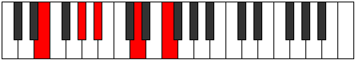

# Mode AFlatKatycryllic

## Links

- [Documentation](index.md)
- [Scales Index](Scales.md)
- [Modes Index](Modes.md)
- [Chords Index](Chords.md)

## Scale

[Kataryllic](ScaleKataryllic.md)

## Mode

[AFlatKatycryllic](ModeAFlatKatycryllic.md)

## Tonic

Ab

## Signature

[CNaturalMajor]

## Perfection

 - 5 Perfect Notes

 - 3 Imperfect Notes

## Notes

- Ab
- Bb
- Db
- D (Imperfect)
- Eb
- E (Imperfect)
- F (Imperfect)
- Gb
- Ab

## Illustration

## Relative Modes

| Number | Mode | Tonic | Notes | Illustration |
|--------|------|-------|-------|--------------|
| [703](https://ianring.com/musictheory/scales/703) | [Aerocryllic](ModeAerocryllic.md) | C# | C#, D, D#, E, F, F#, G#, A#, C# |  |
| [703](https://ianring.com/musictheory/scales/703) | [Aerocryllic](ModeAerocryllic.md) | Db | Db, D, Eb, E, F, Gb, Ab, Bb, Db |  |
| [1529](https://ianring.com/musictheory/scales/1529) | [Kataryllic](ModeKataryllic.md) | A# | A#, C#, D, D#, E, F, F#, G#, A# |  |
| [1529](https://ianring.com/musictheory/scales/1529) | [Kataryllic](ModeKataryllic.md) | Bb | Bb, Db, D, Eb, E, F, Gb, Ab, Bb |  |
| [2021](https://ianring.com/musictheory/scales/2021) | [Katycryllic](ModeKatycryllic.md) | G# | G#, A#, C#, D, D#, E, F, F#, G# |  |
| [2021](https://ianring.com/musictheory/scales/2021) | [Katycryllic](ModeKatycryllic.md) | Ab | Ab, Bb, Db, D, Eb, E, F, Gb, Ab |  |
| [2399](https://ianring.com/musictheory/scales/2399) | [Zanyllic](ModeZanyllic.md) | D | D, D#, E, F, F#, G#, A#, C#, D |  |
| [3247](https://ianring.com/musictheory/scales/3247) | [Aeolonyllic](ModeAeolonyllic.md) | D# | D#, E, F, F#, G#, A#, C#, D, D# |  |
| [3247](https://ianring.com/musictheory/scales/3247) | [Aeolonyllic](ModeAeolonyllic.md) | Eb | Eb, E, F, Gb, Ab, Bb, Db, D, Eb |  |
| [3671](https://ianring.com/musictheory/scales/3671) | [Aeonyllic](ModeAeonyllic.md) | E | E, F, F#, G#, A#, C#, D, D#, E |  |
| [3883](https://ianring.com/musictheory/scales/3883) | [Kyryllic](ModeKyryllic.md) | F | F, F#, G#, A#, C#, D, D#, E, F |  |
| [3989](https://ianring.com/musictheory/scales/3989) | [Sythyllic](ModeSythyllic.md) | F# | F#, G#, A#, C#, D, D#, E, F, F# |  |
| [3989](https://ianring.com/musictheory/scales/3989) | [Sythyllic](ModeSythyllic.md) | Gb | Gb, Ab, Bb, Db, D, Eb, E, F, Gb |  |

## Chords

### Ab

| Number | Root | Name | Notes | Illustration | Audio |
|--------|------|------|-------|--------------|-------|
| 1282 | Ab | [Absus2bb5](ChordAFlatSuspendedSecondDoubleFlatFifth.md) | Ab, Bb, Db |  | [midi](ChordAFlatSuspendedSecondDoubleFlatFifthRootPosition.mid) [ogg](ChordAFlatSuspendedSecondDoubleFlatFifthRootPosition.ogg) |
| 1284 | Ab | [Absus2b5](ChordAFlatSuspendedSecondFlatFifth.md) | Ab, Bb, Ebb |  | [midi](ChordAFlatSuspendedSecondFlatFifthRootPosition.mid) [ogg](ChordAFlatSuspendedSecondFlatFifthRootPosition.ogg) |
| 262 | Ab | [Absus4b5](ChordAFlatSuspendedFourthFlatFifth.md) | Ab, Db, Ebb |  | [midi](ChordAFlatSuspendedFourthFlatFifthRootPosition.mid) [ogg](ChordAFlatSuspendedFourthFlatFifthRootPosition.ogg) |
| 264 | Ab | [Ab5](ChordAFlatPowerChord.md) | Ab, Eb |  | [midi](ChordAFlatPowerChordRootPosition.mid) [ogg](ChordAFlatPowerChordRootPosition.ogg) |
| 1288 | Ab | [Absus2](ChordAFlatSuspendedSecond.md) | Ab, Bb, Eb |  | [midi](ChordAFlatSuspendedSecondRootPosition.mid) [ogg](ChordAFlatSuspendedSecondRootPosition.ogg) |
| 266 | Ab | [Absus4](ChordAFlatSuspendedFourth.md) | Ab, Db, Eb |  | [midi](ChordAFlatSuspendedFourthRootPosition.mid) [ogg](ChordAFlatSuspendedFourthRootPosition.ogg) |
| 268 | Ab | [Ablyd](ChordAFlatLydian.md) | Ab, D, Eb |  | [midi](ChordAFlatLydianRootPosition.mid) [ogg](ChordAFlatLydianRootPosition.ogg) |
| 1296 | Ab | [Absus2#5](ChordAFlatSuspendedSecondSharpFifth.md) | Ab, Bb, E |  | [midi](ChordAFlatSuspendedSecondSharpFifthRootPosition.mid) [ogg](ChordAFlatSuspendedSecondSharpFifthRootPosition.ogg) |
| 274 | Ab | [Absus4#5](ChordAFlatSuspendedFourthSharpFifth.md) | Ab, Db, E |  | [midi](ChordAFlatSuspendedFourthSharpFifthRootPosition.mid) [ogg](ChordAFlatSuspendedFourthSharpFifthRootPosition.ogg) |
| 1300 | Ab | [Absus2b5add(#5)](ChordAFlatSuspendedSecondFlatFifthAddSharpFifth.md) | Ab, Bb, Ebb, E |  | [midi](ChordAFlatSuspendedSecondFlatFifthAddSharpFifthRootPosition.mid) [ogg](ChordAFlatSuspendedSecondFlatFifthAddSharpFifthRootPosition.ogg) |
| 290 | Ab | [Absus4##5](ChordAFlatSuspendedFourthDoubleSharpFifth.md) | Ab, Db, F |  | [midi](ChordAFlatSuspendedFourthDoubleSharpFifthRootPosition.mid) [ogg](ChordAFlatSuspendedFourthDoubleSharpFifthRootPosition.ogg) |
| 1314 | Ab | [AbM6sus2bb5](ChordAFlatMajorSixthSuspendedSecondDoubleFlatFifth.md) | Ab, Bb, Db, F |  | [midi](ChordAFlatMajorSixthSuspendedSecondDoubleFlatFifthRootPosition.mid) [ogg](ChordAFlatMajorSixthSuspendedSecondDoubleFlatFifthRootPosition.ogg) |
| 1316 | Ab | [AbM6sus2b5](ChordAFlatMajorSixthSuspendedSecondFlatFifth.md) | Ab, Bb, Ebb, F |  | [midi](ChordAFlatMajorSixthSuspendedSecondFlatFifthRootPosition.mid) [ogg](ChordAFlatMajorSixthSuspendedSecondFlatFifthRootPosition.ogg) |
| 1320 | Ab | [AbM6sus2](ChordAFlatMajorSixthSuspendedSecond.md) | Ab, Bb, Eb, F |  | [midi](ChordAFlatMajorSixthSuspendedSecondRootPosition.mid) [ogg](ChordAFlatMajorSixthSuspendedSecondRootPosition.ogg) |
| 1320 | Ab | [Ab7sus2b5](ChordAFlatDominantSeventhSuspendedSecondFlatFifth.md) | Ab, Bb, Eb, Gbb |  | [midi](ChordAFlatDominantSeventhSuspendedSecondFlatFifthRootPosition.mid) [ogg](ChordAFlatDominantSeventhSuspendedSecondFlatFifthRootPosition.ogg) |
| 298 | Ab | [AbM6sus4](ChordAFlatMajorSixthSuspendedFourth.md) | Ab, Db, Eb, F |  | [midi](ChordAFlatMajorSixthSuspendedFourthRootPosition.mid) [ogg](ChordAFlatMajorSixthSuspendedFourthRootPosition.ogg) |
| 322 | Ab | [AbQ](ChordAFlatQuartal.md) | Ab, Db, Gb |  | [midi](ChordAFlatQuartalRootPosition.mid) [ogg](ChordAFlatQuartalRootPosition.ogg) |
| 1352 | Ab | [Ab7sus2](ChordAFlatDominantSeventhSuspendedSecond.md) | Ab, Bb, Eb, Gb |  | [midi](ChordAFlatDominantSeventhSuspendedSecondRootPosition.mid) [ogg](ChordAFlatDominantSeventhSuspendedSecondRootPosition.ogg) |
| 1352 | Ab | [Ab9sus2](ChordAFlatDominantNinthSuspendedSecond.md) | Ab, Bb, Eb, Gb, Bb |  | [midi](ChordAFlatDominantNinthSuspendedSecondRootPosition.mid) [ogg](ChordAFlatDominantNinthSuspendedSecondRootPosition.ogg) |
| 330 | Ab | [Ab7sus4](ChordAFlatDominantSeventhSuspendedFourth.md) | Ab, Db, Eb, Gb |  | [midi](ChordAFlatDominantSeventhSuspendedFourthRootPosition.mid) [ogg](ChordAFlatDominantSeventhSuspendedFourthRootPosition.ogg) |
| 1354 | Ab | [Ab9sus4](ChordAFlatDominantNinthSuspendedFourth.md) | Ab, Db, Eb, Gb, Bb |  | [midi](ChordAFlatDominantNinthSuspendedFourthRootPosition.mid) [ogg](ChordAFlatDominantNinthSuspendedFourthRootPosition.ogg) |

### Bb

| Number | Root | Name | Notes | Illustration | Audio |
|--------|------|------|-------|--------------|-------|
| 1034 | Bb | [Bbmbb5](ChordBFlatMinorDoubleFlatFifth.md) | Bb, Db, Eb |  | [midi](ChordBFlatMinorDoubleFlatFifthRootPosition.mid) [ogg](ChordBFlatMinorDoubleFlatFifthRootPosition.ogg) |
| 1042 | Bb | [Bbo](ChordBFlatDiminished.md) | Bb, Db, Fb |  | [midi](ChordBFlatDiminishedRootPosition.mid) [ogg](ChordBFlatDiminishedRootPosition.ogg) |
| 1044 | Bb | [BbMb5](ChordBFlatMajorFlatFifth.md) | Bb, D, Fb |  | [midi](ChordBFlatMajorFlatFifthRootPosition.mid) [ogg](ChordBFlatMajorFlatFifthRootPosition.ogg) |
| 1048 | Bb | [Bbsus4b5](ChordBFlatSuspendedFourthFlatFifth.md) | Bb, Eb, Fb |  | [midi](ChordBFlatSuspendedFourthFlatFifthRootPosition.mid) [ogg](ChordBFlatSuspendedFourthFlatFifthRootPosition.ogg) |
| 1056 | Bb | [Bb5](ChordBFlatPowerChord.md) | Bb, F |  | [midi](ChordBFlatPowerChordRootPosition.mid) [ogg](ChordBFlatPowerChordRootPosition.ogg) |
| 1058 | Bb | [Bbm](ChordBFlatMinor.md) | Bb, Db, F |  | [midi](ChordBFlatMinorRootPosition.mid) [ogg](ChordBFlatMinorRootPosition.ogg) |
| 1058 | Bb | [Bbm(add(#9))](ChordBFlatMinorAddSharpNinth.md) | Bb, Db, F, C# |  | [midi](ChordBFlatMinorAddSharpNinthRootPosition.mid) [ogg](ChordBFlatMinorAddSharpNinthRootPosition.ogg) |
| 1060 | Bb | [BbM](ChordBFlatMajor.md) | Bb, D, F |  | [midi](ChordBFlatMajorRootPosition.mid) [ogg](ChordBFlatMajorRootPosition.ogg) |
| 1062 | Bb | [BbM(add(#9))](ChordBFlatMajorAddSharpNinth.md) | Bb, D, F, C# |  | [midi](ChordBFlatMajorAddSharpNinthRootPosition.mid) [ogg](ChordBFlatMajorAddSharpNinthRootPosition.ogg) |
| 1064 | Bb | [Bbsus4](ChordBFlatSuspendedFourth.md) | Bb, Eb, F |  | [midi](ChordBFlatSuspendedFourthRootPosition.mid) [ogg](ChordBFlatSuspendedFourthRootPosition.ogg) |
| 1066 | Bb | [Bbm(add11)](ChordBFlatMinorAddEleventh.md) | Bb, Db, F, Eb |  | [midi](ChordBFlatMinorAddEleventhRootPosition.mid) [ogg](ChordBFlatMinorAddEleventhRootPosition.ogg) |
| 1066 | Bb | [Bbm(add4)](ChordBFlatMinorAddFourth.md) | Bb, Db, Eb, F |  | [midi](ChordBFlatMinorAddFourthRootPosition.mid) [ogg](ChordBFlatMinorAddFourthRootPosition.ogg) |
| 1068 | Bb | [BbM(add11)](ChordBFlatMajorAddEleventh.md) | Bb, D, F, Eb |  | [midi](ChordBFlatMajorAddEleventhRootPosition.mid) [ogg](ChordBFlatMajorAddEleventhRootPosition.ogg) |
| 1068 | Bb | [BbM(add4)](ChordBFlatMajorAddFourth.md) | Bb, D, Eb, F |  | [midi](ChordBFlatMajorAddFourthRootPosition.mid) [ogg](ChordBFlatMajorAddFourthRootPosition.ogg) |
| 1072 | Bb | [Bblyd](ChordBFlatLydian.md) | Bb, E, F |  | [midi](ChordBFlatLydianRootPosition.mid) [ogg](ChordBFlatLydianRootPosition.ogg) |
| 1074 | Bb | [Bbm(add(#4))](ChordBFlatMinorAddSharpFourth.md) | Bb, Db, E, F |  | [midi](ChordBFlatMinorAddSharpFourthRootPosition.mid) [ogg](ChordBFlatMinorAddSharpFourthRootPosition.ogg) |
| 1076 | Bb | [BbM(add(#4))](ChordBFlatMajorAddSharpFourth.md) | Bb, D, E, F |  | [midi](ChordBFlatMajorAddSharpFourthRootPosition.mid) [ogg](ChordBFlatMajorAddSharpFourthRootPosition.ogg) |
| 1090 | Bb | [Bbm#5](ChordBFlatMinorSharpFifth.md) | Bb, Db, Gb |  | [midi](ChordBFlatMinorSharpFifthRootPosition.mid) [ogg](ChordBFlatMinorSharpFifthRootPosition.ogg) |
| 1092 | Bb | [Bb+](ChordBFlatAugmented.md) | Bb, D, F# |  | [midi](ChordBFlatAugmentedRootPosition.mid) [ogg](ChordBFlatAugmentedRootPosition.ogg) |
| 1092 | Bb | [Bb+7](ChordBFlatAugmentedAugmentedSeventh.md) | Bb, D, F#, A# |  | [midi](ChordBFlatAugmentedAugmentedSeventhRootPosition.mid) [ogg](ChordBFlatAugmentedAugmentedSeventhRootPosition.ogg) |
| 1096 | Bb | [Bbsus4#5](ChordBFlatSuspendedFourthSharpFifth.md) | Bb, Eb, F# |  | [midi](ChordBFlatSuspendedFourthSharpFifthRootPosition.mid) [ogg](ChordBFlatSuspendedFourthSharpFifthRootPosition.ogg) |
| 1288 | Bb | [BbQ](ChordBFlatQuartal.md) | Bb, Eb, Ab |  | [midi](ChordBFlatQuartalRootPosition.mid) [ogg](ChordBFlatQuartalRootPosition.ogg) |
| 1290 | Bb | [Bbm7bb5](ChordBFlatMinorSeventhDoubleFlatFifth.md) | Bb, Db, Eb, Ab |  | [midi](ChordBFlatMinorSeventhDoubleFlatFifthRootPosition.mid) [ogg](ChordBFlatMinorSeventhDoubleFlatFifthRootPosition.ogg) |
| 1298 | Bb | [Bbø7](ChordBFlatHalfDiminishedSeventh.md) | Bb, Db, Fb, Ab |  | [midi](ChordBFlatHalfDiminishedSeventhRootPosition.mid) [ogg](ChordBFlatHalfDiminishedSeventhRootPosition.ogg) |
| 1300 | Bb | [Bb7b5](ChordBFlatDominantSeventhFlatFifth.md) | Bb, D, Fb, Ab |  | [midi](ChordBFlatDominantSeventhFlatFifthRootPosition.mid) [ogg](ChordBFlatDominantSeventhFlatFifthRootPosition.ogg) |
| 1314 | Bb | [Bbm7](ChordBFlatMinorSeventh.md) | Bb, Db, F, Ab |  | [midi](ChordBFlatMinorSeventhRootPosition.mid) [ogg](ChordBFlatMinorSeventhRootPosition.ogg) |
| 1316 | Bb | [Bb7](ChordBFlatDominantSeventh.md) | Bb, D, F, Ab |  | [midi](ChordBFlatDominantSeventhRootPosition.mid) [ogg](ChordBFlatDominantSeventhRootPosition.ogg) |
| 1318 | Bb | [Bb7#9](ChordBFlatDominantSeventhSharpNinth.md) | Bb, D, F, Ab, C# |  | [midi](ChordBFlatDominantSeventhSharpNinthRootPosition.mid) [ogg](ChordBFlatDominantSeventhSharpNinthRootPosition.ogg) |
| 1320 | Bb | [Bb7sus4](ChordBFlatDominantSeventhSuspendedFourth.md) | Bb, Eb, F, Ab |  | [midi](ChordBFlatDominantSeventhSuspendedFourthRootPosition.mid) [ogg](ChordBFlatDominantSeventhSuspendedFourthRootPosition.ogg) |
| 1322 | Bb | [Bbm7add11](ChordBFlatMinorSeventhAddEleventh.md) | Bb, Db, F, Ab, Eb |  | [midi](ChordBFlatMinorSeventhAddEleventhRootPosition.mid) [ogg](ChordBFlatMinorSeventhAddEleventhRootPosition.ogg) |
| 1324 | Bb | [Bb7add4](ChordBFlatDominantSeventhAddFourth.md) | Bb, D, Eb, F, Ab |  | [midi](ChordBFlatDominantSeventhAddFourthRootPosition.mid) [ogg](ChordBFlatDominantSeventhAddFourthRootPosition.ogg) |
| 1324 | Bb | [Bb7add11](ChordBFlatDominantSeventhAddEleventh.md) | Bb, D, F, Ab, Eb |  | [midi](ChordBFlatDominantSeventhAddEleventhRootPosition.mid) [ogg](ChordBFlatDominantSeventhAddEleventhRootPosition.ogg) |
| 1330 | Bb | [Bbm7add(#11)](ChordBFlatMinorSeventhAddSharpEleventh.md) | Bb, Db, F, Ab, E |  | [midi](ChordBFlatMinorSeventhAddSharpEleventhRootPosition.mid) [ogg](ChordBFlatMinorSeventhAddSharpEleventhRootPosition.ogg) |
| 1332 | Bb | [Bb7add(#4)](ChordBFlatDominantSeventhAddSharpFourth.md) | Bb, D, E, F, Ab |  | [midi](ChordBFlatDominantSeventhAddSharpFourthRootPosition.mid) [ogg](ChordBFlatDominantSeventhAddSharpFourthRootPosition.ogg) |
| 1332 | Bb | [Bb7#11](ChordBFlatDominantSeventhSharpEleventh.md) | Bb, D, F, Ab, E |  | [midi](ChordBFlatDominantSeventhSharpEleventhRootPosition.mid) [ogg](ChordBFlatDominantSeventhSharpEleventhRootPosition.ogg) |
| 1334 | Bb | [Bb7#9#11](ChordBFlatDominantSeventhSharpNinthSharpEleventh.md) | Bb, D, F, Ab, C#, E |  | [midi](ChordBFlatDominantSeventhSharpNinthSharpEleventhRootPosition.mid) [ogg](ChordBFlatDominantSeventhSharpNinthSharpEleventhRootPosition.ogg) |
| 1346 | Bb | [Bbm7#5](ChordBFlatMinorSeventhSharpFifth.md) | Bb, Db, F#, Ab |  | [midi](ChordBFlatMinorSeventhSharpFifthRootPosition.mid) [ogg](ChordBFlatMinorSeventhSharpFifthRootPosition.ogg) |

### Db

| Number | Root | Name | Notes | Illustration | Audio |
|--------|------|------|-------|--------------|-------|
| 74 | Db | [Dbsus2bb5](ChordDFlatSuspendedSecondDoubleFlatFifth.md) | Db, Eb, Gb |  | [midi](ChordDFlatSuspendedSecondDoubleFlatFifthRootPosition.mid) [ogg](ChordDFlatSuspendedSecondDoubleFlatFifthRootPosition.ogg) |
| 82 | Db | [Dbmbb5](ChordDFlatMinorDoubleFlatFifth.md) | Db, Fb, Gb |  | [midi](ChordDFlatMinorDoubleFlatFifthRootPosition.mid) [ogg](ChordDFlatMinorDoubleFlatFifthRootPosition.ogg) |
| 258 | Db | [Db5](ChordDFlatPowerChord.md) | Db, Ab |  | [midi](ChordDFlatPowerChordRootPosition.mid) [ogg](ChordDFlatPowerChordRootPosition.ogg) |
| 262 | Db | [Dbphryg](ChordDFlatPhrygian.md) | Db, Ebb, Ab |  | [midi](ChordDFlatPhrygianRootPosition.mid) [ogg](ChordDFlatPhrygianRootPosition.ogg) |
| 266 | Db | [Dbsus2](ChordDFlatSuspendedSecond.md) | Db, Eb, Ab |  | [midi](ChordDFlatSuspendedSecondRootPosition.mid) [ogg](ChordDFlatSuspendedSecondRootPosition.ogg) |
| 274 | Db | [Dbm](ChordDFlatMinor.md) | Db, Fb, Ab |  | [midi](ChordDFlatMinorRootPosition.mid) [ogg](ChordDFlatMinorRootPosition.ogg) |
| 274 | Db | [Dbm(add(#9))](ChordDFlatMinorAddSharpNinth.md) | Db, Fb, Ab, E |  | [midi](ChordDFlatMinorAddSharpNinthRootPosition.mid) [ogg](ChordDFlatMinorAddSharpNinthRootPosition.ogg) |
| 282 | Db | [Dbm(add9)](ChordDFlatMinorAddNinth.md) | Db, Fb, Ab, Eb |  | [midi](ChordDFlatMinorAddNinthRootPosition.mid) [ogg](ChordDFlatMinorAddNinthRootPosition.ogg) |
| 290 | Db | [DbM](ChordDFlatMajor.md) | Db, F, Ab |  | [midi](ChordDFlatMajorRootPosition.mid) [ogg](ChordDFlatMajorRootPosition.ogg) |
| 298 | Db | [DbM(add9)](ChordDFlatMajorAddNinth.md) | Db, F, Ab, Eb |  | [midi](ChordDFlatMajorAddNinthRootPosition.mid) [ogg](ChordDFlatMajorAddNinthRootPosition.ogg) |
| 306 | Db | [DbM(add(#9))](ChordDFlatMajorAddSharpNinth.md) | Db, F, Ab, E |  | [midi](ChordDFlatMajorAddSharpNinthRootPosition.mid) [ogg](ChordDFlatMajorAddSharpNinthRootPosition.ogg) |
| 322 | Db | [Dbsus4](ChordDFlatSuspendedFourth.md) | Db, Gb, Ab |  | [midi](ChordDFlatSuspendedFourthRootPosition.mid) [ogg](ChordDFlatSuspendedFourthRootPosition.ogg) |
| 338 | Db | [Dbm(add11)](ChordDFlatMinorAddEleventh.md) | Db, Fb, Ab, Gb |  | [midi](ChordDFlatMinorAddEleventhRootPosition.mid) [ogg](ChordDFlatMinorAddEleventhRootPosition.ogg) |
| 338 | Db | [Dbm(add4)](ChordDFlatMinorAddFourth.md) | Db, Fb, Gb, Ab |  | [midi](ChordDFlatMinorAddFourthRootPosition.mid) [ogg](ChordDFlatMinorAddFourthRootPosition.ogg) |
| 354 | Db | [DbM(add11)](ChordDFlatMajorAddEleventh.md) | Db, F, Ab, Gb |  | [midi](ChordDFlatMajorAddEleventhRootPosition.mid) [ogg](ChordDFlatMajorAddEleventhRootPosition.ogg) |
| 354 | Db | [DbM(add4)](ChordDFlatMajorAddFourth.md) | Db, F, Gb, Ab |  | [midi](ChordDFlatMajorAddFourthRootPosition.mid) [ogg](ChordDFlatMajorAddFourthRootPosition.ogg) |
| 1058 | Db | [DbM##5](ChordDFlatMajorDoubleSharpFifth.md) | Db, F, Bb |  | [midi](ChordDFlatMajorDoubleSharpFifthRootPosition.mid) [ogg](ChordDFlatMajorDoubleSharpFifthRootPosition.ogg) |
| 1090 | Db | [Dbsus4##5](ChordDFlatSuspendedFourthDoubleSharpFifth.md) | Db, Gb, Bb |  | [midi](ChordDFlatSuspendedFourthDoubleSharpFifthRootPosition.mid) [ogg](ChordDFlatSuspendedFourthDoubleSharpFifthRootPosition.ogg) |
| 1098 | Db | [DbM6sus2bb5](ChordDFlatMajorSixthSuspendedSecondDoubleFlatFifth.md) | Db, Eb, Gb, Bb |  | [midi](ChordDFlatMajorSixthSuspendedSecondDoubleFlatFifthRootPosition.mid) [ogg](ChordDFlatMajorSixthSuspendedSecondDoubleFlatFifthRootPosition.ogg) |
| 1290 | Db | [DbM6sus2](ChordDFlatMajorSixthSuspendedSecond.md) | Db, Eb, Ab, Bb |  | [midi](ChordDFlatMajorSixthSuspendedSecondRootPosition.mid) [ogg](ChordDFlatMajorSixthSuspendedSecondRootPosition.ogg) |
| 1290 | Db | [Db7sus2b5](ChordDFlatDominantSeventhSuspendedSecondFlatFifth.md) | Db, Eb, Ab, Cbb |  | [midi](ChordDFlatDominantSeventhSuspendedSecondFlatFifthRootPosition.mid) [ogg](ChordDFlatDominantSeventhSuspendedSecondFlatFifthRootPosition.ogg) |
| 1298 | Db | [Dbm6](ChordDFlatMinorSixth.md) | Db, Fb, Ab, Bb |  | [midi](ChordDFlatMinorSixthRootPosition.mid) [ogg](ChordDFlatMinorSixthRootPosition.ogg) |
| 1302 | Db | [Dbm6(addb9)](ChordDFlatMinorSixthAddFlatNinth.md) | Db, Fb, Ab, Bb, Ebb |  | [midi](ChordDFlatMinorSixthAddFlatNinthRootPosition.mid) [ogg](ChordDFlatMinorSixthAddFlatNinthRootPosition.ogg) |
| 1306 | Db | [Dbm6(add9)](ChordDFlatMinorSixthAddNinth.md) | Db, Fb, Ab, Bb, Eb |  | [midi](ChordDFlatMinorSixthAddNinthRootPosition.mid) [ogg](ChordDFlatMinorSixthAddNinthRootPosition.ogg) |
| 1314 | Db | [DbM6](ChordDFlatMajorSixth.md) | Db, F, Ab, Bb |  | [midi](ChordDFlatMajorSixthRootPosition.mid) [ogg](ChordDFlatMajorSixthRootPosition.ogg) |
| 1318 | Db | [DbM6(addb9)](ChordDFlatMajorSixthAddFlatNinth.md) | Db, F, Ab, Bb, Ebb |  | [midi](ChordDFlatMajorSixthAddFlatNinthRootPosition.mid) [ogg](ChordDFlatMajorSixthAddFlatNinthRootPosition.ogg) |
| 1322 | Db | [DbM6(add9)](ChordDFlatMajorSixthAddNinth.md) | Db, F, Ab, Bb, Eb |  | [midi](ChordDFlatMajorSixthAddNinthRootPosition.mid) [ogg](ChordDFlatMajorSixthAddNinthRootPosition.ogg) |
| 1346 | Db | [DbM6sus4](ChordDFlatMajorSixthSuspendedFourth.md) | Db, Gb, Ab, Bb |  | [midi](ChordDFlatMajorSixthSuspendedFourthRootPosition.mid) [ogg](ChordDFlatMajorSixthSuspendedFourthRootPosition.ogg) |

### D

| Number | Root | Name | Notes | Illustration | Audio |
|--------|------|------|-------|--------------|-------|
| 268 | D | [Dloc](ChordDNaturalLocrian.md) | D, Eb, Ab |  | [midi](ChordDNaturalLocrianRootPosition.mid) [ogg](ChordDNaturalLocrianRootPosition.ogg) |
| 276 | D | [Dsus2b5](ChordDNaturalSuspendedSecondFlatFifth.md) | D, E, Ab |  | [midi](ChordDNaturalSuspendedSecondFlatFifthRootPosition.mid) [ogg](ChordDNaturalSuspendedSecondFlatFifthRootPosition.ogg) |
| 292 | D | [Do](ChordDNaturalDiminished.md) | D, F, Ab |  | [midi](ChordDNaturalDiminishedRootPosition.mid) [ogg](ChordDNaturalDiminishedRootPosition.ogg) |
| 324 | D | [DMb5](ChordDNaturalMajorFlatFifth.md) | D, F#, Ab |  | [midi](ChordDNaturalMajorFlatFifthRootPosition.mid) [ogg](ChordDNaturalMajorFlatFifthRootPosition.ogg) |
| 1044 | D | [Dsus2#5](ChordDNaturalSuspendedSecondSharpFifth.md) | D, E, A# |  | [midi](ChordDNaturalSuspendedSecondSharpFifthRootPosition.mid) [ogg](ChordDNaturalSuspendedSecondSharpFifthRootPosition.ogg) |
| 1060 | D | [Dm#5](ChordDNaturalMinorSharpFifth.md) | D, F, Bb |  | [midi](ChordDNaturalMinorSharpFifthRootPosition.mid) [ogg](ChordDNaturalMinorSharpFifthRootPosition.ogg) |
| 1092 | D | [D+](ChordDNaturalAugmented.md) | D, F#, A# |  | [midi](ChordDNaturalAugmentedRootPosition.mid) [ogg](ChordDNaturalAugmentedRootPosition.ogg) |
| 1092 | D | [D+7](ChordDNaturalAugmentedAugmentedSeventh.md) | D, F#, A#, C## |  | [midi](ChordDNaturalAugmentedAugmentedSeventhRootPosition.mid) [ogg](ChordDNaturalAugmentedAugmentedSeventhRootPosition.ogg) |
| 1300 | D | [Dsus2b5add(#5)](ChordDNaturalSuspendedSecondFlatFifthAddSharpFifth.md) | D, E, Ab, A# |  | [midi](ChordDNaturalSuspendedSecondFlatFifthAddSharpFifthRootPosition.mid) [ogg](ChordDNaturalSuspendedSecondFlatFifthAddSharpFifthRootPosition.ogg) |
| 294 | D | [DoM7](ChordDNaturalDiminishedMajorSeventh.md) | D, F, Ab, C# |  | [midi](ChordDNaturalDiminishedMajorSeventhRootPosition.mid) [ogg](ChordDNaturalDiminishedMajorSeventhRootPosition.ogg) |
| 326 | D | [DM7b5](ChordDNaturalMajorSeventhFlatFifth.md) | D, F#, Ab, C# |  | [midi](ChordDNaturalMajorSeventhFlatFifthRootPosition.mid) [ogg](ChordDNaturalMajorSeventhFlatFifthRootPosition.ogg) |
| 1094 | D | [D+(M7)](ChordDNaturalAugmentedMajorSeventh.md) | D, F#, A#, C# |  | [midi](ChordDNaturalAugmentedMajorSeventhRootPosition.mid) [ogg](ChordDNaturalAugmentedMajorSeventhRootPosition.ogg) |

### Eb

| Number | Root | Name | Notes | Illustration | Audio |
|--------|------|------|-------|--------------|-------|
| 296 | Eb | [Ebsus2bb5](ChordEFlatSuspendedSecondDoubleFlatFifth.md) | Eb, F, Ab |  | [midi](ChordEFlatSuspendedSecondDoubleFlatFifthRootPosition.mid) [ogg](ChordEFlatSuspendedSecondDoubleFlatFifthRootPosition.ogg) |
| 328 | Eb | [Ebmbb5](ChordEFlatMinorDoubleFlatFifth.md) | Eb, Gb, Ab |  | [midi](ChordEFlatMinorDoubleFlatFifthRootPosition.mid) [ogg](ChordEFlatMinorDoubleFlatFifthRootPosition.ogg) |
| 1032 | Eb | [Eb5](ChordEFlatPowerChord.md) | Eb, Bb |  | [midi](ChordEFlatPowerChordRootPosition.mid) [ogg](ChordEFlatPowerChordRootPosition.ogg) |
| 1048 | Eb | [Ebphryg](ChordEFlatPhrygian.md) | Eb, Fb, Bb |  | [midi](ChordEFlatPhrygianRootPosition.mid) [ogg](ChordEFlatPhrygianRootPosition.ogg) |
| 1064 | Eb | [Ebsus2](ChordEFlatSuspendedSecond.md) | Eb, F, Bb |  | [midi](ChordEFlatSuspendedSecondRootPosition.mid) [ogg](ChordEFlatSuspendedSecondRootPosition.ogg) |
| 1096 | Eb | [Ebm](ChordEFlatMinor.md) | Eb, Gb, Bb |  | [midi](ChordEFlatMinorRootPosition.mid) [ogg](ChordEFlatMinorRootPosition.ogg) |
| 1096 | Eb | [Ebm(add(#9))](ChordEFlatMinorAddSharpNinth.md) | Eb, Gb, Bb, F# |  | [midi](ChordEFlatMinorAddSharpNinthRootPosition.mid) [ogg](ChordEFlatMinorAddSharpNinthRootPosition.ogg) |
| 1128 | Eb | [Ebm(add9)](ChordEFlatMinorAddNinth.md) | Eb, Gb, Bb, F |  | [midi](ChordEFlatMinorAddNinthRootPosition.mid) [ogg](ChordEFlatMinorAddNinthRootPosition.ogg) |
| 1288 | Eb | [Ebsus4](ChordEFlatSuspendedFourth.md) | Eb, Ab, Bb |  | [midi](ChordEFlatSuspendedFourthRootPosition.mid) [ogg](ChordEFlatSuspendedFourthRootPosition.ogg) |
| 1352 | Eb | [Ebm(add11)](ChordEFlatMinorAddEleventh.md) | Eb, Gb, Bb, Ab |  | [midi](ChordEFlatMinorAddEleventhRootPosition.mid) [ogg](ChordEFlatMinorAddEleventhRootPosition.ogg) |
| 1352 | Eb | [Ebm(add4)](ChordEFlatMinorAddFourth.md) | Eb, Gb, Ab, Bb |  | [midi](ChordEFlatMinorAddFourthRootPosition.mid) [ogg](ChordEFlatMinorAddFourthRootPosition.ogg) |
| 266 | Eb | [EbQ](ChordEFlatQuartal.md) | Eb, Ab, Db |  | [midi](ChordEFlatQuartalRootPosition.mid) [ogg](ChordEFlatQuartalRootPosition.ogg) |
| 330 | Eb | [Ebm7bb5](ChordEFlatMinorSeventhDoubleFlatFifth.md) | Eb, Gb, Ab, Db |  | [midi](ChordEFlatMinorSeventhDoubleFlatFifthRootPosition.mid) [ogg](ChordEFlatMinorSeventhDoubleFlatFifthRootPosition.ogg) |
| 1066 | Eb | [Eb7sus2](ChordEFlatDominantSeventhSuspendedSecond.md) | Eb, F, Bb, Db |  | [midi](ChordEFlatDominantSeventhSuspendedSecondRootPosition.mid) [ogg](ChordEFlatDominantSeventhSuspendedSecondRootPosition.ogg) |
| 1066 | Eb | [Eb9sus2](ChordEFlatDominantNinthSuspendedSecond.md) | Eb, F, Bb, Db, F |  | [midi](ChordEFlatDominantNinthSuspendedSecondRootPosition.mid) [ogg](ChordEFlatDominantNinthSuspendedSecondRootPosition.ogg) |
| 1098 | Eb | [Ebm7](ChordEFlatMinorSeventh.md) | Eb, Gb, Bb, Db |  | [midi](ChordEFlatMinorSeventhRootPosition.mid) [ogg](ChordEFlatMinorSeventhRootPosition.ogg) |
| 1114 | Eb | [Ebm7b9](ChordEFlatMinorSeventhFlatNinth.md) | Eb, Gb, Bb, Db, Fb |  | [midi](ChordEFlatMinorSeventhFlatNinthRootPosition.mid) [ogg](ChordEFlatMinorSeventhFlatNinthRootPosition.ogg) |
| 1130 | Eb | [Ebm9](ChordEFlatMinorNinth.md) | Eb, Gb, Bb, Db, F |  | [midi](ChordEFlatMinorNinthRootPosition.mid) [ogg](ChordEFlatMinorNinthRootPosition.ogg) |
| 1290 | Eb | [Eb7sus4](ChordEFlatDominantSeventhSuspendedFourth.md) | Eb, Ab, Bb, Db |  | [midi](ChordEFlatDominantSeventhSuspendedFourthRootPosition.mid) [ogg](ChordEFlatDominantSeventhSuspendedFourthRootPosition.ogg) |
| 1322 | Eb | [Eb9sus4](ChordEFlatDominantNinthSuspendedFourth.md) | Eb, Ab, Bb, Db, F |  | [midi](ChordEFlatDominantNinthSuspendedFourthRootPosition.mid) [ogg](ChordEFlatDominantNinthSuspendedFourthRootPosition.ogg) |
| 1354 | Eb | [Ebm7add11](ChordEFlatMinorSeventhAddEleventh.md) | Eb, Gb, Bb, Db, Ab |  | [midi](ChordEFlatMinorSeventhAddEleventhRootPosition.mid) [ogg](ChordEFlatMinorSeventhAddEleventhRootPosition.ogg) |
| 1386 | Eb | [Ebm11](ChordEFlatMinorEleventh.md) | Eb, Gb, Bb, Db, F, Ab |  | [midi](ChordEFlatMinorEleventhRootPosition.mid) [ogg](ChordEFlatMinorEleventhRootPosition.ogg) |
| 268 | Eb | [EbQ+](ChordEFlatQuartalAugmented.md) | Eb, Ab, D |  | [midi](ChordEFlatQuartalAugmentedRootPosition.mid) [ogg](ChordEFlatQuartalAugmentedRootPosition.ogg) |
| 1052 | Eb | [Ebphryg+7](ChordEFlatPhrygianAddSeventh.md) | Eb, Fb, Bb, D |  | [midi](ChordEFlatPhrygianAddSeventhRootPosition.mid) [ogg](ChordEFlatPhrygianAddSeventhRootPosition.ogg) |
| 1068 | Eb | [EbM7(sus2)](ChordEFlatMajorSeventhSuspendedSecond.md) | Eb, F, Bb, D |  | [midi](ChordEFlatMajorSeventhSuspendedSecondRootPosition.mid) [ogg](ChordEFlatMajorSeventhSuspendedSecondRootPosition.ogg) |
| 1068 | Eb | [EbM9sus2](ChordEFlatMajorNinthSuspendedSecond.md) | Eb, F, Bb, D, F |  | [midi](ChordEFlatMajorNinthSuspendedSecondRootPosition.mid) [ogg](ChordEFlatMajorNinthSuspendedSecondRootPosition.ogg) |
| 1100 | Eb | [Ebm(M7)](ChordEFlatMinorMajorSeventh.md) | Eb, Gb, Bb, D |  | [midi](ChordEFlatMinorMajorSeventhRootPosition.mid) [ogg](ChordEFlatMinorMajorSeventhRootPosition.ogg) |
| 1132 | Eb | [Ebm(M9)](ChordEFlatMinorMajorNinth.md) | Eb, Gb, Bb, D, F |  | [midi](ChordEFlatMinorMajorNinthRootPosition.mid) [ogg](ChordEFlatMinorMajorNinthRootPosition.ogg) |
| 1292 | Eb | [EbM7(sus4)](ChordEFlatMajorSeventhSuspendedFourth.md) | Eb, Ab, Bb, D |  | [midi](ChordEFlatMajorSeventhSuspendedFourthRootPosition.mid) [ogg](ChordEFlatMajorSeventhSuspendedFourthRootPosition.ogg) |
| 1324 | Eb | [EbM9sus4](ChordEFlatMajorNinthSuspendedFourth.md) | Eb, Ab, Bb, D, F |  | [midi](ChordEFlatMajorNinthSuspendedFourthRootPosition.mid) [ogg](ChordEFlatMajorNinthSuspendedFourthRootPosition.ogg) |
| 1356 | Eb | [Ebm(M7)add11](ChordEFlatMinorMajorSeventhAddEleventh.md) | Eb, Gb, Bb, D, Ab |  | [midi](ChordEFlatMinorMajorSeventhAddEleventhRootPosition.mid) [ogg](ChordEFlatMinorMajorSeventhAddEleventhRootPosition.ogg) |
| 1388 | Eb | [Ebm(M11)](ChordEFlatMinorMajorEleventh.md) | Eb, Gb, Bb, D, F, Ab |  | [midi](ChordEFlatMinorMajorEleventhRootPosition.mid) [ogg](ChordEFlatMinorMajorEleventhRootPosition.ogg) |

### E

| Number | Root | Name | Notes | Illustration | Audio |
|--------|------|------|-------|--------------|-------|
| 1072 | E | [Eloc](ChordENaturalLocrian.md) | E, F, Bb |  | [midi](ChordENaturalLocrianRootPosition.mid) [ogg](ChordENaturalLocrianRootPosition.ogg) |
| 1104 | E | [Esus2b5](ChordENaturalSuspendedSecondFlatFifth.md) | E, F#, Bb |  | [midi](ChordENaturalSuspendedSecondFlatFifthRootPosition.mid) [ogg](ChordENaturalSuspendedSecondFlatFifthRootPosition.ogg) |
| 1296 | E | [EMb5](ChordENaturalMajorFlatFifth.md) | E, G#, Bb |  | [midi](ChordENaturalMajorFlatFifthRootPosition.mid) [ogg](ChordENaturalMajorFlatFifthRootPosition.ogg) |
| 274 | E | [EM##5](ChordENaturalMajorDoubleSharpFifth.md) | E, G#, C# |  | [midi](ChordENaturalMajorDoubleSharpFifthRootPosition.mid) [ogg](ChordENaturalMajorDoubleSharpFifthRootPosition.ogg) |
| 1106 | E | [EM6sus2b5](ChordENaturalMajorSixthSuspendedSecondFlatFifth.md) | E, F#, Bb, C# |  | [midi](ChordENaturalMajorSixthSuspendedSecondFlatFifthRootPosition.mid) [ogg](ChordENaturalMajorSixthSuspendedSecondFlatFifthRootPosition.ogg) |
| 1298 | E | [EM6b5](ChordENaturalMajorSixthFlatFifth.md) | E, G#, Bb, C# |  | [midi](ChordENaturalMajorSixthFlatFifthRootPosition.mid) [ogg](ChordENaturalMajorSixthFlatFifthRootPosition.ogg) |
| 1300 | E | [E7b5](ChordENaturalDominantSeventhFlatFifth.md) | E, G#, Bb, D |  | [midi](ChordENaturalDominantSeventhFlatFifthRootPosition.mid) [ogg](ChordENaturalDominantSeventhFlatFifthRootPosition.ogg) |
| 1332 | E | [E7b5b9](ChordENaturalDominantSeventhFlatFifthFlatNinth.md) | E, G#, Bb, D, F |  | [midi](ChordENaturalDominantSeventhFlatFifthFlatNinthRootPosition.mid) [ogg](ChordENaturalDominantSeventhFlatFifthFlatNinthRootPosition.ogg) |
| 1304 | E | [EM7b5](ChordENaturalMajorSeventhFlatFifth.md) | E, G#, Bb, D# |  | [midi](ChordENaturalMajorSeventhFlatFifthRootPosition.mid) [ogg](ChordENaturalMajorSeventhFlatFifthRootPosition.ogg) |
| 282 | E | [EM7##5](ChordENaturalMajorSeventhDoubleSharpFifth.md) | E, G#, C#, D# |  | [midi](ChordENaturalMajorSeventhDoubleSharpFifthRootPosition.mid) [ogg](ChordENaturalMajorSeventhDoubleSharpFifthRootPosition.ogg) |

### F

| Number | Root | Name | Notes | Illustration | Audio |
|--------|------|------|-------|--------------|-------|
| 1312 | F | [Fmbb5](ChordFNaturalMinorDoubleFlatFifth.md) | F, Ab, Bb |  | [midi](ChordFNaturalMinorDoubleFlatFifthRootPosition.mid) [ogg](ChordFNaturalMinorDoubleFlatFifthRootPosition.ogg) |
| 290 | F | [Fm#5](ChordFNaturalMinorSharpFifth.md) | F, Ab, Db |  | [midi](ChordFNaturalMinorSharpFifthRootPosition.mid) [ogg](ChordFNaturalMinorSharpFifthRootPosition.ogg) |
| 1058 | F | [Fsus4#5](ChordFNaturalSuspendedFourthSharpFifth.md) | F, Bb, C# |  | [midi](ChordFNaturalSuspendedFourthSharpFifthRootPosition.mid) [ogg](ChordFNaturalSuspendedFourthSharpFifthRootPosition.ogg) |
| 1060 | F | [Fsus4##5](ChordFNaturalSuspendedFourthDoubleSharpFifth.md) | F, Bb, D |  | [midi](ChordFNaturalSuspendedFourthDoubleSharpFifthRootPosition.mid) [ogg](ChordFNaturalSuspendedFourthDoubleSharpFifthRootPosition.ogg) |
| 1064 | F | [FQ](ChordFNaturalQuartal.md) | F, Bb, Eb |  | [midi](ChordFNaturalQuartalRootPosition.mid) [ogg](ChordFNaturalQuartalRootPosition.ogg) |
| 1320 | F | [Fm7bb5](ChordFNaturalMinorSeventhDoubleFlatFifth.md) | F, Ab, Bb, Eb |  | [midi](ChordFNaturalMinorSeventhDoubleFlatFifthRootPosition.mid) [ogg](ChordFNaturalMinorSeventhDoubleFlatFifthRootPosition.ogg) |
| 298 | F | [Fm7#5](ChordFNaturalMinorSeventhSharpFifth.md) | F, Ab, C#, Eb |  | [midi](ChordFNaturalMinorSeventhSharpFifthRootPosition.mid) [ogg](ChordFNaturalMinorSeventhSharpFifthRootPosition.ogg) |
| 1072 | F | [FQ+](ChordFNaturalQuartalAugmented.md) | F, Bb, E |  | [midi](ChordFNaturalQuartalAugmentedRootPosition.mid) [ogg](ChordFNaturalQuartalAugmentedRootPosition.ogg) |
| 1074 | F | [FM7(sus4)#5](ChordFNaturalMajorSeventhSuspendedFourthSharpFifth.md) | F, Bb, C#, E |  | [midi](ChordFNaturalMajorSeventhSuspendedFourthSharpFifthRootPosition.mid) [ogg](ChordFNaturalMajorSeventhSuspendedFourthSharpFifthRootPosition.ogg) |
| 1076 | F | [FM7(sus4)##5](ChordFNaturalMajorSeventhSuspendedFourthDoubleSharpFifth.md) | F, Bb, D, E |  | [midi](ChordFNaturalMajorSeventhSuspendedFourthDoubleSharpFifthRootPosition.mid) [ogg](ChordFNaturalMajorSeventhSuspendedFourthDoubleSharpFifthRootPosition.ogg) |

### Gb

| Number | Root | Name | Notes | Illustration | Audio |
|--------|------|------|-------|--------------|-------|
| 66 | Gb | [Gb5](ChordGFlatPowerChord.md) | Gb, Db |  | [midi](ChordGFlatPowerChordRootPosition.mid) [ogg](ChordGFlatPowerChordRootPosition.ogg) |
| 322 | Gb | [Gbsus2](ChordGFlatSuspendedSecond.md) | Gb, Ab, Db |  | [midi](ChordGFlatSuspendedSecondRootPosition.mid) [ogg](ChordGFlatSuspendedSecondRootPosition.ogg) |
| 1090 | Gb | [GbM](ChordGFlatMajor.md) | Gb, Bb, Db |  | [midi](ChordGFlatMajorRootPosition.mid) [ogg](ChordGFlatMajorRootPosition.ogg) |
| 1346 | Gb | [GbM(add9)](ChordGFlatMajorAddNinth.md) | Gb, Bb, Db, Ab |  | [midi](ChordGFlatMajorAddNinthRootPosition.mid) [ogg](ChordGFlatMajorAddNinthRootPosition.ogg) |
| 324 | Gb | [Gbsus2#5](ChordGFlatSuspendedSecondSharpFifth.md) | Gb, Ab, D |  | [midi](ChordGFlatSuspendedSecondSharpFifthRootPosition.mid) [ogg](ChordGFlatSuspendedSecondSharpFifthRootPosition.ogg) |
| 1092 | Gb | [Gb+](ChordGFlatAugmented.md) | Gb, Bb, D |  | [midi](ChordGFlatAugmentedRootPosition.mid) [ogg](ChordGFlatAugmentedRootPosition.ogg) |
| 1092 | Gb | [Gb+7](ChordGFlatAugmentedAugmentedSeventh.md) | Gb, Bb, D, F# |  | [midi](ChordGFlatAugmentedAugmentedSeventhRootPosition.mid) [ogg](ChordGFlatAugmentedAugmentedSeventhRootPosition.ogg) |
| 1096 | Gb | [GbM##5](ChordGFlatMajorDoubleSharpFifth.md) | Gb, Bb, Eb |  | [midi](ChordGFlatMajorDoubleSharpFifthRootPosition.mid) [ogg](ChordGFlatMajorDoubleSharpFifthRootPosition.ogg) |
| 330 | Gb | [GbM6sus2](ChordGFlatMajorSixthSuspendedSecond.md) | Gb, Ab, Db, Eb |  | [midi](ChordGFlatMajorSixthSuspendedSecondRootPosition.mid) [ogg](ChordGFlatMajorSixthSuspendedSecondRootPosition.ogg) |
| 330 | Gb | [Gb7sus2b5](ChordGFlatDominantSeventhSuspendedSecondFlatFifth.md) | Gb, Ab, Db, Fbb |  | [midi](ChordGFlatDominantSeventhSuspendedSecondFlatFifthRootPosition.mid) [ogg](ChordGFlatDominantSeventhSuspendedSecondFlatFifthRootPosition.ogg) |
| 1098 | Gb | [GbM6](ChordGFlatMajorSixth.md) | Gb, Bb, Db, Eb |  | [midi](ChordGFlatMajorSixthRootPosition.mid) [ogg](ChordGFlatMajorSixthRootPosition.ogg) |
| 1354 | Gb | [GbM6(add9)](ChordGFlatMajorSixthAddNinth.md) | Gb, Bb, Db, Eb, Ab |  | [midi](ChordGFlatMajorSixthAddNinthRootPosition.mid) [ogg](ChordGFlatMajorSixthAddNinthRootPosition.ogg) |
| 338 | Gb | [Gb7sus2](ChordGFlatDominantSeventhSuspendedSecond.md) | Gb, Ab, Db, Fb |  | [midi](ChordGFlatDominantSeventhSuspendedSecondRootPosition.mid) [ogg](ChordGFlatDominantSeventhSuspendedSecondRootPosition.ogg) |
| 338 | Gb | [Gb9sus2](ChordGFlatDominantNinthSuspendedSecond.md) | Gb, Ab, Db, Fb, Ab |  | [midi](ChordGFlatDominantNinthSuspendedSecondRootPosition.mid) [ogg](ChordGFlatDominantNinthSuspendedSecondRootPosition.ogg) |
| 1106 | Gb | [Gb7](ChordGFlatDominantSeventh.md) | Gb, Bb, Db, Fb |  | [midi](ChordGFlatDominantSeventhRootPosition.mid) [ogg](ChordGFlatDominantSeventhRootPosition.ogg) |
| 1362 | Gb | [Gb9](ChordGFlatDominantNinth.md) | Gb, Bb, Db, Fb, Ab |  | [midi](ChordGFlatDominantNinthRootPosition.mid) [ogg](ChordGFlatDominantNinthRootPosition.ogg) |
| 1366 | Gb | [Gb9b13](ChordGFlatDominantNinthFlatThirteenth.md) | Gb, Bb, Db, Fb, Ab, Ebb |  | [midi](ChordGFlatDominantNinthFlatThirteenthRootPosition.mid) [ogg](ChordGFlatDominantNinthFlatThirteenthRootPosition.ogg) |
| 1114 | Gb | [Gb7add13](ChordGFlatDominantSeventhAddThirteenth.md) | Gb, Bb, Db, Fb, Eb |  | [midi](ChordGFlatDominantSeventhAddThirteenthRootPosition.mid) [ogg](ChordGFlatDominantSeventhAddThirteenthRootPosition.ogg) |
| 354 | Gb | [GbM7(sus2)](ChordGFlatMajorSeventhSuspendedSecond.md) | Gb, Ab, Db, F |  | [midi](ChordGFlatMajorSeventhSuspendedSecondRootPosition.mid) [ogg](ChordGFlatMajorSeventhSuspendedSecondRootPosition.ogg) |
| 354 | Gb | [GbM9sus2](ChordGFlatMajorNinthSuspendedSecond.md) | Gb, Ab, Db, F, Ab |  | [midi](ChordGFlatMajorNinthSuspendedSecondRootPosition.mid) [ogg](ChordGFlatMajorNinthSuspendedSecondRootPosition.ogg) |
| 1122 | Gb | [GbM7](ChordGFlatMajorSeventh.md) | Gb, Bb, Db, F |  | [midi](ChordGFlatMajorSeventhRootPosition.mid) [ogg](ChordGFlatMajorSeventhRootPosition.ogg) |
| 1378 | Gb | [GbM9](ChordGFlatMajorNinth.md) | Gb, Bb, Db, F, Ab |  | [midi](ChordGFlatMajorNinthRootPosition.mid) [ogg](ChordGFlatMajorNinthRootPosition.ogg) |
| 1124 | Gb | [Gb+(M7)](ChordGFlatAugmentedMajorSeventh.md) | Gb, Bb, D, F |  | [midi](ChordGFlatAugmentedMajorSeventhRootPosition.mid) [ogg](ChordGFlatAugmentedMajorSeventhRootPosition.ogg) |
| 1128 | Gb | [GbM7##5](ChordGFlatMajorSeventhDoubleSharpFifth.md) | Gb, Bb, Eb, F |  | [midi](ChordGFlatMajorSeventhDoubleSharpFifthRootPosition.mid) [ogg](ChordGFlatMajorSeventhDoubleSharpFifthRootPosition.ogg) |
| 1130 | Gb | [GbM7add13](ChordGFlatMajorSeventhAddThirteenth.md) | Gb, Bb, Db, F, Eb |  | [midi](ChordGFlatMajorSeventhAddThirteenthRootPosition.mid) [ogg](ChordGFlatMajorSeventhAddThirteenthRootPosition.ogg) |

