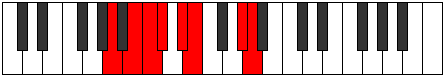

# Mode AFlatKothian

## Links

- [Documentation](index.md)
- [Scales Index](Scales.md)
- [Modes Index](Modes.md)
- [Chords Index](Chords.md)

## Scale

[Stythian](ScaleStythian.md)

## Mode

[AFlatKothian](ModeAFlatKothian.md)

## Tonic

Ab

## Signature

[CNaturalMajor]

## Perfection

 - 4 Perfect Notes

 - 3 Imperfect Notes

## Notes

- Ab
- Bbb
- Cb (Imperfect)
- Dbb (Imperfect)
- Ebbb
- Fbb (Imperfect)
- Gbbb
- Ab

## Illustration

## Relative Modes

| Number | Mode | Tonic | Notes | Illustration |
|--------|------|-------|-------|--------------|
| [443](https://ianring.com/musictheory/scales/443) | [Kothian](ModeKothian.md) | G# | G#, A, B, C, Db, Eb, Fb, G# |  |
| [443](https://ianring.com/musictheory/scales/443) | [Kothian](ModeKothian.md) | Ab | Ab, Bbb, Cb, Dbb, Ebbb, Fbb, Gbbb, Ab |  |
| [1591](https://ianring.com/musictheory/scales/1591) | [Rodian](ModeRodian.md) | B | B, C, Db, Eb, Fb, G#, A, B |  |
| [1891](https://ianring.com/musictheory/scales/1891) | [Thalian](ModeThalian.md) | D# | D#, E, F###, G##, A##, B#, C#, D# |  |
| [1891](https://ianring.com/musictheory/scales/1891) | [Thalian](ModeThalian.md) | Eb | Eb, Fb, G#, A, B, C, Db, Eb |  |
| [2269](https://ianring.com/musictheory/scales/2269) | [Pygian](ModePygian.md) | A | A, B, C, Db, Eb, Fb, G#, A |  |
| [2843](https://ianring.com/musictheory/scales/2843) | [Sorian](ModeSorian.md) | C | C, Db, Eb, Fb, G#, A, B, C |  |
| [2993](https://ianring.com/musictheory/scales/2993) | [Stythian](ModeStythian.md) | E | E, F###, G##, A##, B#, C#, D#, E |  |
| [3469](https://ianring.com/musictheory/scales/3469) | [Monian](ModeMonian.md) | C# | C#, D#, E, F###, G##, A##, B#, C# |  |
| [3469](https://ianring.com/musictheory/scales/3469) | [Monian](ModeMonian.md) | Db | Db, Eb, Fb, G#, A, B, C, Db |  |

## Chords

### Ab

| Number | Root | Name | Notes | Illustration | Audio |
|--------|------|------|-------|--------------|-------|

### Bbb

| Number | Root | Name | Notes | Illustration | Audio |
|--------|------|------|-------|--------------|-------|

### Cb

| Number | Root | Name | Notes | Illustration | Audio |
|--------|------|------|-------|--------------|-------|

### Dbb

| Number | Root | Name | Notes | Illustration | Audio |
|--------|------|------|-------|--------------|-------|

### Ebbb

| Number | Root | Name | Notes | Illustration | Audio |
|--------|------|------|-------|--------------|-------|

### Fbb

| Number | Root | Name | Notes | Illustration | Audio |
|--------|------|------|-------|--------------|-------|

### Gbbb

| Number | Root | Name | Notes | Illustration | Audio |
|--------|------|------|-------|--------------|-------|

