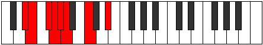

# Mode AFlatKylian

## Links

- [Documentation](index.md)
- [Scales Index](Scales.md)
- [Modes Index](Modes.md)
- [Chords Index](Chords.md)

## Scale

[Epagian](ScaleEpagian.md)

## Mode

[AFlatKylian](ModeAFlatKylian.md)

## Tonic

Ab

## Signature

[CNaturalMajor]

## Perfection

 - 3 Perfect Notes

 - 4 Imperfect Notes

## Notes

- Ab
- Bbb
- C
- D# (Imperfect)
- E (Imperfect)
- F# (Imperfect)
- G (Imperfect)
- Ab

## Illustration

## Relative Modes

| Number | Mode | Tonic | Notes | Illustration |
|--------|------|-------|-------|--------------|
| [635](https://ianring.com/musictheory/scales/635) | [Epolian](ModeEpolian.md) | D# | D#, E, F#, G, Ab, Bbb, C, D# |  |
| [635](https://ianring.com/musictheory/scales/635) | [Epolian](ModeEpolian.md) | Eb | Eb, Fb, Gb, Abb, Bbbb, Cbbb, Dbb, Eb |  |
| [985](https://ianring.com/musictheory/scales/985) | [Raptian](ModeRaptian.md) | C | C, D#, E, F#, G, Ab, Bbb, C |  |
| [1615](https://ianring.com/musictheory/scales/1615) | [Sydian](ModeSydian.md) | F# | F#, G, Ab, Bbb, C, D#, E, F# |  |
| [1615](https://ianring.com/musictheory/scales/1615) | [Sydian](ModeSydian.md) | Gb | Gb, Abb, Bbbb, Cbbb, Dbb, Eb, Fb, Gb |  |
| [2365](https://ianring.com/musictheory/scales/2365) | [Sythian](ModeSythian.md) | E | E, F#, G, Ab, Bbb, C, D#, E |  |
| [2855](https://ianring.com/musictheory/scales/2855) | [Epocrian](ModeEpocrian.md) | G | G, Ab, Bbb, C, D#, E, F#, G |  |
| [3475](https://ianring.com/musictheory/scales/3475) | [Kylian](ModeKylian.md) | G# | G#, A, B#, C###, D##, E##, F##, G# |  |
| [3475](https://ianring.com/musictheory/scales/3475) | [Kylian](ModeKylian.md) | Ab | Ab, Bbb, C, D#, E, F#, G, Ab |  |
| [3785](https://ianring.com/musictheory/scales/3785) | [Epagian](ModeEpagian.md) | A | A, B#, C###, D##, E##, F##, G#, A |  |

## Chords

### Ab

| Number | Root | Name | Notes | Illustration | Audio |
|--------|------|------|-------|--------------|-------|

### Bbb

| Number | Root | Name | Notes | Illustration | Audio |
|--------|------|------|-------|--------------|-------|

### C

| Number | Root | Name | Notes | Illustration | Audio |
|--------|------|------|-------|--------------|-------|

### D#

| Number | Root | Name | Notes | Illustration | Audio |
|--------|------|------|-------|--------------|-------|

### E

| Number | Root | Name | Notes | Illustration | Audio |
|--------|------|------|-------|--------------|-------|

### F#

| Number | Root | Name | Notes | Illustration | Audio |
|--------|------|------|-------|--------------|-------|

### G

| Number | Root | Name | Notes | Illustration | Audio |
|--------|------|------|-------|--------------|-------|

