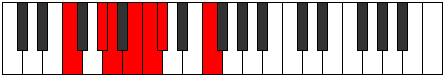

# Mode AFlatKynimic

## Links

- [Documentation](index.md)
- [Scales Index](Scales.md)
- [Modes Index](Modes.md)
- [Chords Index](Chords.md)

## Scale

[Lathimic](ScaleLathimic.md)

## Mode

[AFlatKynimic](ModeAFlatKynimic.md)

## Tonic

Ab

## Signature

[CNaturalMajor]

## Perfection

 - 2 Perfect Notes

 - 4 Imperfect Notes

## Notes

- Ab (Imperfect)
- Bbb (Imperfect)
- Cb (Imperfect)
- Dbb (Imperfect)
- Ebbb
- F
- Ab (Imperfect)

## Illustration

## Relative Modes

| Number | Mode | Tonic | Notes | Illustration |
|--------|------|-------|-------|--------------|
| [473](https://ianring.com/musictheory/scales/473) | [Aeralimic](ModeAeralimic.md) | F | F, G#, A, B, C, Db, F |  |
| [571](https://ianring.com/musictheory/scales/571) | [Kynimic](ModeKynimic.md) | G# | G#, A, B, C, Db, E#, G# |  |
| [571](https://ianring.com/musictheory/scales/571) | [Kynimic](ModeKynimic.md) | Ab | Ab, Bbb, Cb, Dbb, Ebbb, F, Ab |  |
| [1607](https://ianring.com/musictheory/scales/1607) | [Epytimic](ModeEpytimic.md) | B | B, C, Db, E#, F###, G##, B |  |
| [2333](https://ianring.com/musictheory/scales/2333) | [Stynimic](ModeStynimic.md) | A | A, B, C, Db, E#, F###, A |  |
| [2851](https://ianring.com/musictheory/scales/2851) | [Katoptimic](ModeKatoptimic.md) | C | C, Db, E#, F###, G##, A##, C |  |
| [3473](https://ianring.com/musictheory/scales/3473) | [Lathimic](ModeLathimic.md) | C# | C#, D###, F###, G##, A##, B#, C# |  |
| [3473](https://ianring.com/musictheory/scales/3473) | [Lathimic](ModeLathimic.md) | Db | Db, E#, F###, G##, A##, B#, Db |  |

## Chords

### Ab

| Number | Root | Name | Notes | Illustration | Audio |
|--------|------|------|-------|--------------|-------|

### Bbb

| Number | Root | Name | Notes | Illustration | Audio |
|--------|------|------|-------|--------------|-------|

### Cb

| Number | Root | Name | Notes | Illustration | Audio |
|--------|------|------|-------|--------------|-------|

### Dbb

| Number | Root | Name | Notes | Illustration | Audio |
|--------|------|------|-------|--------------|-------|

### Ebbb

| Number | Root | Name | Notes | Illustration | Audio |
|--------|------|------|-------|--------------|-------|

### F

| Number | Root | Name | Notes | Illustration | Audio |
|--------|------|------|-------|--------------|-------|

