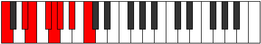
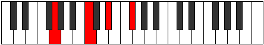

# Mode AFlatKyptian

## Links

- [Documentation](index.md)
- [Scales Index](Scales.md)
- [Modes Index](Modes.md)
- [Chords Index](Chords.md)

## Scale

[Ionanian](ScaleIonanian.md)

## Mode

[AFlatKyptian](ModeAFlatKyptian.md)

## Tonic

Ab

## Signature

[CNaturalMajor]

## Perfection

 - 3 Perfect Notes

 - 4 Imperfect Notes

## Notes

- Ab
- Bb (Imperfect)
- C
- D#
- E (Imperfect)
- F# (Imperfect)
- G (Imperfect)
- Ab

## Illustration

## Relative Modes

| Number | Mode | Tonic | Notes | Illustration |
|--------|------|-------|-------|--------------|
| [699](https://ianring.com/musictheory/scales/699) | [Aerothian](ModeAerothian.md) | D# | D#, E, F#, G, Ab, Bb, C, D# |  |
| [699](https://ianring.com/musictheory/scales/699) | [Aerothian](ModeAerothian.md) | Eb | Eb, Fb, Gb, Abb, Bbbb, Cbb, Dbb, Eb |  |
| [1497](https://ianring.com/musictheory/scales/1497) | [Ionanian](ModeIonanian.md) | C | C, D#, E, F#, G, Ab, Bb, C |  |
| [1623](https://ianring.com/musictheory/scales/1623) | [Lothian](ModeLothian.md) | F# | F#, G, Ab, Bb, C, D#, E, F# |  |
| [1623](https://ianring.com/musictheory/scales/1623) | [Lothian](ModeLothian.md) | Gb | Gb, Abb, Bbbb, Cbb, Dbb, Eb, Fb, Gb |  |
| [1893](https://ianring.com/musictheory/scales/1893) | [Ionylian](ModeIonylian.md) | A# | A#, B#, C###, D##, E##, F##, G#, A# |  |
| [1893](https://ianring.com/musictheory/scales/1893) | [Ionylian](ModeIonylian.md) | Bb | Bb, C, D#, E, F#, G, Ab, Bb |  |
| [2397](https://ianring.com/musictheory/scales/2397) | [Stagian](ModeStagian.md) | E | E, F#, G, Ab, Bb, C, D#, E |  |
| [2859](https://ianring.com/musictheory/scales/2859) | [Phrycrian](ModePhrycrian.md) | G | G, Ab, Bb, C, D#, E, F#, G |  |
| [3477](https://ianring.com/musictheory/scales/3477) | [Kyptian](ModeKyptian.md) | G# | G#, A#, B#, C###, D##, E##, F##, G# |  |
| [3477](https://ianring.com/musictheory/scales/3477) | [Kyptian](ModeKyptian.md) | Ab | Ab, Bb, C, D#, E, F#, G, Ab |  |

## Chords

### Ab

| Number | Root | Name | Notes | Illustration | Audio |
|--------|------|------|-------|--------------|-------|
| 264 | Ab | [Ab5](ChordAFlatPowerChord.md) | Ab, Eb |  | [midi](ChordAFlatPowerChordRootPosition.mid) [ogg](ChordAFlatPowerChordRootPosition.ogg) |
| 1288 | Ab | [Absus2](ChordAFlatSuspendedSecond.md) | Ab, Bb, Eb |  | [midi](ChordAFlatSuspendedSecondRootPosition.mid) [ogg](ChordAFlatSuspendedSecondRootPosition.ogg) |
| 265 | Ab | [AbM](ChordAFlatMajor.md) | Ab, C, Eb |  | [midi](ChordAFlatMajorRootPosition.mid) [ogg](ChordAFlatMajorRootPosition.ogg) |
| 1289 | Ab | [AbM(add9)](ChordAFlatMajorAddNinth.md) | Ab, C, Eb, Bb |  | [midi](ChordAFlatMajorAddNinthRootPosition.mid) [ogg](ChordAFlatMajorAddNinthRootPosition.ogg) |
| 1296 | Ab | [Absus2#5](ChordAFlatSuspendedSecondSharpFifth.md) | Ab, Bb, E |  | [midi](ChordAFlatSuspendedSecondSharpFifthRootPosition.mid) [ogg](ChordAFlatSuspendedSecondSharpFifthRootPosition.ogg) |
| 273 | Ab | [Ab+](ChordAFlatAugmented.md) | Ab, C, E |  | [midi](ChordAFlatAugmentedRootPosition.mid) [ogg](ChordAFlatAugmentedRootPosition.ogg) |
| 273 | Ab | [Ab+7](ChordAFlatAugmentedAugmentedSeventh.md) | Ab, C, E, G# |  | [midi](ChordAFlatAugmentedAugmentedSeventhRootPosition.mid) [ogg](ChordAFlatAugmentedAugmentedSeventhRootPosition.ogg) |
| 1352 | Ab | [Ab7sus2](ChordAFlatDominantSeventhSuspendedSecond.md) | Ab, Bb, Eb, Gb |  | [midi](ChordAFlatDominantSeventhSuspendedSecondRootPosition.mid) [ogg](ChordAFlatDominantSeventhSuspendedSecondRootPosition.ogg) |
| 1352 | Ab | [Ab9sus2](ChordAFlatDominantNinthSuspendedSecond.md) | Ab, Bb, Eb, Gb, Bb |  | [midi](ChordAFlatDominantNinthSuspendedSecondRootPosition.mid) [ogg](ChordAFlatDominantNinthSuspendedSecondRootPosition.ogg) |
| 329 | Ab | [Ab7](ChordAFlatDominantSeventh.md) | Ab, C, Eb, Gb |  | [midi](ChordAFlatDominantSeventhRootPosition.mid) [ogg](ChordAFlatDominantSeventhRootPosition.ogg) |
| 1353 | Ab | [Ab9](ChordAFlatDominantNinth.md) | Ab, C, Eb, Gb, Bb |  | [midi](ChordAFlatDominantNinthRootPosition.mid) [ogg](ChordAFlatDominantNinthRootPosition.ogg) |
| 1369 | Ab | [Ab9b13](ChordAFlatDominantNinthFlatThirteenth.md) | Ab, C, Eb, Gb, Bb, Fb |  | [midi](ChordAFlatDominantNinthFlatThirteenthRootPosition.mid) [ogg](ChordAFlatDominantNinthFlatThirteenthRootPosition.ogg) |
| 1416 | Ab | [AbM7(sus2)](ChordAFlatMajorSeventhSuspendedSecond.md) | Ab, Bb, Eb, G |  | [midi](ChordAFlatMajorSeventhSuspendedSecondRootPosition.mid) [ogg](ChordAFlatMajorSeventhSuspendedSecondRootPosition.ogg) |
| 1416 | Ab | [AbM9sus2](ChordAFlatMajorNinthSuspendedSecond.md) | Ab, Bb, Eb, G, Bb |  | [midi](ChordAFlatMajorNinthSuspendedSecondRootPosition.mid) [ogg](ChordAFlatMajorNinthSuspendedSecondRootPosition.ogg) |
| 393 | Ab | [AbM7](ChordAFlatMajorSeventh.md) | Ab, C, Eb, G |  | [midi](ChordAFlatMajorSeventhRootPosition.mid) [ogg](ChordAFlatMajorSeventhRootPosition.ogg) |
| 1417 | Ab | [AbM9](ChordAFlatMajorNinth.md) | Ab, C, Eb, G, Bb |  | [midi](ChordAFlatMajorNinthRootPosition.mid) [ogg](ChordAFlatMajorNinthRootPosition.ogg) |
| 401 | Ab | [Ab+(M7)](ChordAFlatAugmentedMajorSeventh.md) | Ab, C, E, G |  | [midi](ChordAFlatAugmentedMajorSeventhRootPosition.mid) [ogg](ChordAFlatAugmentedMajorSeventhRootPosition.ogg) |

### Bb

| Number | Root | Name | Notes | Illustration | Audio |
|--------|------|------|-------|--------------|-------|
| 1033 | Bb | [Bbsus2bb5](ChordBFlatSuspendedSecondDoubleFlatFifth.md) | Bb, C, Eb |  | [midi](ChordBFlatSuspendedSecondDoubleFlatFifthRootPosition.mid) [ogg](ChordBFlatSuspendedSecondDoubleFlatFifthRootPosition.ogg) |
| 1041 | Bb | [Bbsus2b5](ChordBFlatSuspendedSecondFlatFifth.md) | Bb, C, Fb |  | [midi](ChordBFlatSuspendedSecondFlatFifthRootPosition.mid) [ogg](ChordBFlatSuspendedSecondFlatFifthRootPosition.ogg) |
| 1048 | Bb | [Bbsus4b5](ChordBFlatSuspendedFourthFlatFifth.md) | Bb, Eb, Fb |  | [midi](ChordBFlatSuspendedFourthFlatFifthRootPosition.mid) [ogg](ChordBFlatSuspendedFourthFlatFifthRootPosition.ogg) |
| 1089 | Bb | [Bbsus2#5](ChordBFlatSuspendedSecondSharpFifth.md) | Bb, C, F# |  | [midi](ChordBFlatSuspendedSecondSharpFifthRootPosition.mid) [ogg](ChordBFlatSuspendedSecondSharpFifthRootPosition.ogg) |
| 1096 | Bb | [Bbsus4#5](ChordBFlatSuspendedFourthSharpFifth.md) | Bb, Eb, F# |  | [midi](ChordBFlatSuspendedFourthSharpFifthRootPosition.mid) [ogg](ChordBFlatSuspendedFourthSharpFifthRootPosition.ogg) |
| 1105 | Bb | [Bbsus2b5add(#5)](ChordBFlatSuspendedSecondFlatFifthAddSharpFifth.md) | Bb, C, Fb, F# |  | [midi](ChordBFlatSuspendedSecondFlatFifthAddSharpFifthRootPosition.mid) [ogg](ChordBFlatSuspendedSecondFlatFifthAddSharpFifthRootPosition.ogg) |
| 1160 | Bb | [Bbsus4##5](ChordBFlatSuspendedFourthDoubleSharpFifth.md) | Bb, Eb, G |  | [midi](ChordBFlatSuspendedFourthDoubleSharpFifthRootPosition.mid) [ogg](ChordBFlatSuspendedFourthDoubleSharpFifthRootPosition.ogg) |
| 1161 | Bb | [BbM6sus2bb5](ChordBFlatMajorSixthSuspendedSecondDoubleFlatFifth.md) | Bb, C, Eb, G |  | [midi](ChordBFlatMajorSixthSuspendedSecondDoubleFlatFifthRootPosition.mid) [ogg](ChordBFlatMajorSixthSuspendedSecondDoubleFlatFifthRootPosition.ogg) |
| 1169 | Bb | [BbM6sus2b5](ChordBFlatMajorSixthSuspendedSecondFlatFifth.md) | Bb, C, Fb, G |  | [midi](ChordBFlatMajorSixthSuspendedSecondFlatFifthRootPosition.mid) [ogg](ChordBFlatMajorSixthSuspendedSecondFlatFifthRootPosition.ogg) |
| 1288 | Bb | [BbQ](ChordBFlatQuartal.md) | Bb, Eb, Ab |  | [midi](ChordBFlatQuartalRootPosition.mid) [ogg](ChordBFlatQuartalRootPosition.ogg) |

### C

| Number | Root | Name | Notes | Illustration | Audio |
|--------|------|------|-------|--------------|-------|
| 73 | C | [Co](ChordCNaturalDiminished.md) | C, Eb, Gb |  | [midi](ChordCNaturalDiminishedRootPosition.mid) [ogg](ChordCNaturalDiminishedRootPosition.ogg) |
| 81 | C | [CMb5](ChordCNaturalMajorFlatFifth.md) | C, E, Gb |  | [midi](ChordCNaturalMajorFlatFifthRootPosition.mid) [ogg](ChordCNaturalMajorFlatFifthRootPosition.ogg) |
| 129 | C | [C5](ChordCNaturalPowerChord.md) | C, G |  | [midi](ChordCNaturalPowerChordRootPosition.mid) [ogg](ChordCNaturalPowerChordRootPosition.ogg) |
| 137 | C | [Cm](ChordCNaturalMinor.md) | C, Eb, G |  | [midi](ChordCNaturalMinorRootPosition.mid) [ogg](ChordCNaturalMinorRootPosition.ogg) |
| 137 | C | [Cm(add(#9))](ChordCNaturalMinorAddSharpNinth.md) | C, Eb, G, D# |  | [midi](ChordCNaturalMinorAddSharpNinthRootPosition.mid) [ogg](ChordCNaturalMinorAddSharpNinthRootPosition.ogg) |
| 145 | C | [CM](ChordCNaturalMajor.md) | C, E, G |  | [midi](ChordCNaturalMajorRootPosition.mid) [ogg](ChordCNaturalMajorRootPosition.ogg) |
| 153 | C | [CM(add(#9))](ChordCNaturalMajorAddSharpNinth.md) | C, E, G, D# |  | [midi](ChordCNaturalMajorAddSharpNinthRootPosition.mid) [ogg](ChordCNaturalMajorAddSharpNinthRootPosition.ogg) |
| 193 | C | [Clyd](ChordCNaturalLydian.md) | C, F#, G |  | [midi](ChordCNaturalLydianRootPosition.mid) [ogg](ChordCNaturalLydianRootPosition.ogg) |
| 201 | C | [Cm(add(#4))](ChordCNaturalMinorAddSharpFourth.md) | C, Eb, F#, G |  | [midi](ChordCNaturalMinorAddSharpFourthRootPosition.mid) [ogg](ChordCNaturalMinorAddSharpFourthRootPosition.ogg) |
| 209 | C | [CM(add(#4))](ChordCNaturalMajorAddSharpFourth.md) | C, E, F#, G |  | [midi](ChordCNaturalMajorAddSharpFourthRootPosition.mid) [ogg](ChordCNaturalMajorAddSharpFourthRootPosition.ogg) |
| 265 | C | [Cm#5](ChordCNaturalMinorSharpFifth.md) | C, Eb, Ab |  | [midi](ChordCNaturalMinorSharpFifthRootPosition.mid) [ogg](ChordCNaturalMinorSharpFifthRootPosition.ogg) |
| 273 | C | [C+](ChordCNaturalAugmented.md) | C, E, G# |  | [midi](ChordCNaturalAugmentedRootPosition.mid) [ogg](ChordCNaturalAugmentedRootPosition.ogg) |
| 273 | C | [C+7](ChordCNaturalAugmentedAugmentedSeventh.md) | C, E, G#, B# |  | [midi](ChordCNaturalAugmentedAugmentedSeventhRootPosition.mid) [ogg](ChordCNaturalAugmentedAugmentedSeventhRootPosition.ogg) |
| 1097 | C | [Cø7](ChordCNaturalHalfDiminishedSeventh.md) | C, Eb, Gb, Bb |  | [midi](ChordCNaturalHalfDiminishedSeventhRootPosition.mid) [ogg](ChordCNaturalHalfDiminishedSeventhRootPosition.ogg) |
| 1105 | C | [C7b5](ChordCNaturalDominantSeventhFlatFifth.md) | C, E, Gb, Bb |  | [midi](ChordCNaturalDominantSeventhFlatFifthRootPosition.mid) [ogg](ChordCNaturalDominantSeventhFlatFifthRootPosition.ogg) |
| 1161 | C | [Cm7](ChordCNaturalMinorSeventh.md) | C, Eb, G, Bb |  | [midi](ChordCNaturalMinorSeventhRootPosition.mid) [ogg](ChordCNaturalMinorSeventhRootPosition.ogg) |
| 1169 | C | [C7](ChordCNaturalDominantSeventh.md) | C, E, G, Bb |  | [midi](ChordCNaturalDominantSeventhRootPosition.mid) [ogg](ChordCNaturalDominantSeventhRootPosition.ogg) |
| 1177 | C | [C7#9](ChordCNaturalDominantSeventhSharpNinth.md) | C, E, G, Bb, D# |  | [midi](ChordCNaturalDominantSeventhSharpNinthRootPosition.mid) [ogg](ChordCNaturalDominantSeventhSharpNinthRootPosition.ogg) |
| 1225 | C | [Cm7add(#11)](ChordCNaturalMinorSeventhAddSharpEleventh.md) | C, Eb, G, Bb, F# |  | [midi](ChordCNaturalMinorSeventhAddSharpEleventhRootPosition.mid) [ogg](ChordCNaturalMinorSeventhAddSharpEleventhRootPosition.ogg) |
| 1233 | C | [C7add(#4)](ChordCNaturalDominantSeventhAddSharpFourth.md) | C, E, F#, G, Bb |  | [midi](ChordCNaturalDominantSeventhAddSharpFourthRootPosition.mid) [ogg](ChordCNaturalDominantSeventhAddSharpFourthRootPosition.ogg) |
| 1233 | C | [C7#11](ChordCNaturalDominantSeventhSharpEleventh.md) | C, E, G, Bb, F# |  | [midi](ChordCNaturalDominantSeventhSharpEleventhRootPosition.mid) [ogg](ChordCNaturalDominantSeventhSharpEleventhRootPosition.ogg) |
| 1241 | C | [C7#9#11](ChordCNaturalDominantSeventhSharpNinthSharpEleventh.md) | C, E, G, Bb, D#, F# |  | [midi](ChordCNaturalDominantSeventhSharpNinthSharpEleventhRootPosition.mid) [ogg](ChordCNaturalDominantSeventhSharpNinthSharpEleventhRootPosition.ogg) |
| 1289 | C | [Cm7#5](ChordCNaturalMinorSeventhSharpFifth.md) | C, Eb, G#, Bb |  | [midi](ChordCNaturalMinorSeventhSharpFifthRootPosition.mid) [ogg](ChordCNaturalMinorSeventhSharpFifthRootPosition.ogg) |

### D#

| Number | Root | Name | Notes | Illustration | Audio |
|--------|------|------|-------|--------------|-------|
| 328 | D# | [D#mbb5](ChordDSharpMinorDoubleFlatFifth.md) | D#, F#, G# |  | [midi](ChordDSharpMinorDoubleFlatFifthRootPosition.mid) [ogg](ChordDSharpMinorDoubleFlatFifthRootPosition.ogg) |
| 1032 | D# | [D#5](ChordDSharpPowerChord.md) | D#, A# |  | [midi](ChordDSharpPowerChordRootPosition.mid) [ogg](ChordDSharpPowerChordRootPosition.ogg) |
| 1048 | D# | [D#phryg](ChordDSharpPhrygian.md) | D#, E, A# |  | [midi](ChordDSharpPhrygianRootPosition.mid) [ogg](ChordDSharpPhrygianRootPosition.ogg) |
| 1096 | D# | [D#m](ChordDSharpMinor.md) | D#, F#, A# |  | [midi](ChordDSharpMinorRootPosition.mid) [ogg](ChordDSharpMinorRootPosition.ogg) |
| 1096 | D# | [D#m(add(#9))](ChordDSharpMinorAddSharpNinth.md) | D#, F#, A#, E## |  | [midi](ChordDSharpMinorAddSharpNinthRootPosition.mid) [ogg](ChordDSharpMinorAddSharpNinthRootPosition.ogg) |
| 1160 | D# | [D#M](ChordDSharpMajor.md) | D#, F##, A# |  | [midi](ChordDSharpMajorRootPosition.mid) [ogg](ChordDSharpMajorRootPosition.ogg) |
| 1224 | D# | [D#M(add(#9))](ChordDSharpMajorAddSharpNinth.md) | D#, F##, A#, E## |  | [midi](ChordDSharpMajorAddSharpNinthRootPosition.mid) [ogg](ChordDSharpMajorAddSharpNinthRootPosition.ogg) |
| 1288 | D# | [D#sus4](ChordDSharpSuspendedFourth.md) | D#, G#, A# |  | [midi](ChordDSharpSuspendedFourthRootPosition.mid) [ogg](ChordDSharpSuspendedFourthRootPosition.ogg) |
| 1352 | D# | [D#m(add11)](ChordDSharpMinorAddEleventh.md) | D#, F#, A#, G# |  | [midi](ChordDSharpMinorAddEleventhRootPosition.mid) [ogg](ChordDSharpMinorAddEleventhRootPosition.ogg) |
| 1352 | D# | [D#m(add4)](ChordDSharpMinorAddFourth.md) | D#, F#, G#, A# |  | [midi](ChordDSharpMinorAddFourthRootPosition.mid) [ogg](ChordDSharpMinorAddFourthRootPosition.ogg) |
| 1416 | D# | [D#M(add11)](ChordDSharpMajorAddEleventh.md) | D#, F##, A#, G# |  | [midi](ChordDSharpMajorAddEleventhRootPosition.mid) [ogg](ChordDSharpMajorAddEleventhRootPosition.ogg) |
| 1416 | D# | [D#M(add4)](ChordDSharpMajorAddFourth.md) | D#, F##, G#, A# |  | [midi](ChordDSharpMajorAddFourthRootPosition.mid) [ogg](ChordDSharpMajorAddFourthRootPosition.ogg) |
| 137 | D# | [D#M##5](ChordDSharpMajorDoubleSharpFifth.md) | D#, F##, B# |  | [midi](ChordDSharpMajorDoubleSharpFifthRootPosition.mid) [ogg](ChordDSharpMajorDoubleSharpFifthRootPosition.ogg) |
| 265 | D# | [D#sus4##5](ChordDSharpSuspendedFourthDoubleSharpFifth.md) | D#, G#, B# |  | [midi](ChordDSharpSuspendedFourthDoubleSharpFifthRootPosition.mid) [ogg](ChordDSharpSuspendedFourthDoubleSharpFifthRootPosition.ogg) |
| 1097 | D# | [D#m6](ChordDSharpMinorSixth.md) | D#, F#, A#, B# |  | [midi](ChordDSharpMinorSixthRootPosition.mid) [ogg](ChordDSharpMinorSixthRootPosition.ogg) |
| 1113 | D# | [D#m6(addb9)](ChordDSharpMinorSixthAddFlatNinth.md) | D#, F#, A#, B#, E |  | [midi](ChordDSharpMinorSixthAddFlatNinthRootPosition.mid) [ogg](ChordDSharpMinorSixthAddFlatNinthRootPosition.ogg) |
| 1161 | D# | [D#M6](ChordDSharpMajorSixth.md) | D#, F##, A#, B# |  | [midi](ChordDSharpMajorSixthRootPosition.mid) [ogg](ChordDSharpMajorSixthRootPosition.ogg) |
| 1177 | D# | [D#M6(addb9)](ChordDSharpMajorSixthAddFlatNinth.md) | D#, F##, A#, B#, E |  | [midi](ChordDSharpMajorSixthAddFlatNinthRootPosition.mid) [ogg](ChordDSharpMajorSixthAddFlatNinthRootPosition.ogg) |
| 1289 | D# | [D#M6sus4](ChordDSharpMajorSixthSuspendedFourth.md) | D#, G#, A#, B# |  | [midi](ChordDSharpMajorSixthSuspendedFourthRootPosition.mid) [ogg](ChordDSharpMajorSixthSuspendedFourthRootPosition.ogg) |

### E

| Number | Root | Name | Notes | Illustration | Audio |
|--------|------|------|-------|--------------|-------|
| 1104 | E | [Esus2b5](ChordENaturalSuspendedSecondFlatFifth.md) | E, F#, Bb |  | [midi](ChordENaturalSuspendedSecondFlatFifthRootPosition.mid) [ogg](ChordENaturalSuspendedSecondFlatFifthRootPosition.ogg) |
| 1168 | E | [Eo](ChordENaturalDiminished.md) | E, G, Bb |  | [midi](ChordENaturalDiminishedRootPosition.mid) [ogg](ChordENaturalDiminishedRootPosition.ogg) |
| 1296 | E | [EMb5](ChordENaturalMajorFlatFifth.md) | E, G#, Bb |  | [midi](ChordENaturalMajorFlatFifthRootPosition.mid) [ogg](ChordENaturalMajorFlatFifthRootPosition.ogg) |
| 81 | E | [Esus2#5](ChordENaturalSuspendedSecondSharpFifth.md) | E, F#, B# |  | [midi](ChordENaturalSuspendedSecondSharpFifthRootPosition.mid) [ogg](ChordENaturalSuspendedSecondSharpFifthRootPosition.ogg) |
| 145 | E | [Em#5](ChordENaturalMinorSharpFifth.md) | E, G, C |  | [midi](ChordENaturalMinorSharpFifthRootPosition.mid) [ogg](ChordENaturalMinorSharpFifthRootPosition.ogg) |
| 273 | E | [E+](ChordENaturalAugmented.md) | E, G#, B# |  | [midi](ChordENaturalAugmentedRootPosition.mid) [ogg](ChordENaturalAugmentedRootPosition.ogg) |
| 273 | E | [E+7](ChordENaturalAugmentedAugmentedSeventh.md) | E, G#, B#, D## |  | [midi](ChordENaturalAugmentedAugmentedSeventhRootPosition.mid) [ogg](ChordENaturalAugmentedAugmentedSeventhRootPosition.ogg) |
| 1105 | E | [Esus2b5add(#5)](ChordENaturalSuspendedSecondFlatFifthAddSharpFifth.md) | E, F#, Bb, B# |  | [midi](ChordENaturalSuspendedSecondFlatFifthAddSharpFifthRootPosition.mid) [ogg](ChordENaturalSuspendedSecondFlatFifthAddSharpFifthRootPosition.ogg) |
| 1176 | E | [EoM7](ChordENaturalDiminishedMajorSeventh.md) | E, G, Bb, D# |  | [midi](ChordENaturalDiminishedMajorSeventhRootPosition.mid) [ogg](ChordENaturalDiminishedMajorSeventhRootPosition.ogg) |
| 1304 | E | [EM7b5](ChordENaturalMajorSeventhFlatFifth.md) | E, G#, Bb, D# |  | [midi](ChordENaturalMajorSeventhFlatFifthRootPosition.mid) [ogg](ChordENaturalMajorSeventhFlatFifthRootPosition.ogg) |
| 281 | E | [E+(M7)](ChordENaturalAugmentedMajorSeventh.md) | E, G#, B#, D# |  | [midi](ChordENaturalAugmentedMajorSeventhRootPosition.mid) [ogg](ChordENaturalAugmentedMajorSeventhRootPosition.ogg) |

### F#

| Number | Root | Name | Notes | Illustration | Audio |
|--------|------|------|-------|--------------|-------|
| 193 | F# | [F#loc](ChordFSharpLocrian.md) | F#, G, C |  | [midi](ChordFSharpLocrianRootPosition.mid) [ogg](ChordFSharpLocrianRootPosition.ogg) |
| 321 | F# | [F#sus2b5](ChordFSharpSuspendedSecondFlatFifth.md) | F#, G#, C |  | [midi](ChordFSharpSuspendedSecondFlatFifthRootPosition.mid) [ogg](ChordFSharpSuspendedSecondFlatFifthRootPosition.ogg) |
| 1089 | F# | [F#Mb5](ChordFSharpMajorFlatFifth.md) | F#, A#, C |  | [midi](ChordFSharpMajorFlatFifthRootPosition.mid) [ogg](ChordFSharpMajorFlatFifthRootPosition.ogg) |
| 1096 | F# | [F#M##5](ChordFSharpMajorDoubleSharpFifth.md) | F#, A#, D# |  | [midi](ChordFSharpMajorDoubleSharpFifthRootPosition.mid) [ogg](ChordFSharpMajorDoubleSharpFifthRootPosition.ogg) |
| 329 | F# | [F#M6sus2b5](ChordFSharpMajorSixthSuspendedSecondFlatFifth.md) | F#, G#, C, D# |  | [midi](ChordFSharpMajorSixthSuspendedSecondFlatFifthRootPosition.mid) [ogg](ChordFSharpMajorSixthSuspendedSecondFlatFifthRootPosition.ogg) |
| 1097 | F# | [F#M6b5](ChordFSharpMajorSixthFlatFifth.md) | F#, A#, C, D# |  | [midi](ChordFSharpMajorSixthFlatFifthRootPosition.mid) [ogg](ChordFSharpMajorSixthFlatFifthRootPosition.ogg) |
| 1105 | F# | [F#7b5](ChordFSharpDominantSeventhFlatFifth.md) | F#, A#, C, E |  | [midi](ChordFSharpDominantSeventhFlatFifthRootPosition.mid) [ogg](ChordFSharpDominantSeventhFlatFifthRootPosition.ogg) |
| 1233 | F# | [F#7b5b9](ChordFSharpDominantSeventhFlatFifthFlatNinth.md) | F#, A#, C, E, G |  | [midi](ChordFSharpDominantSeventhFlatFifthFlatNinthRootPosition.mid) [ogg](ChordFSharpDominantSeventhFlatFifthFlatNinthRootPosition.ogg) |

### G

| Number | Root | Name | Notes | Illustration | Audio |
|--------|------|------|-------|--------------|-------|
| 1153 | G | [Gmbb5](ChordGNaturalMinorDoubleFlatFifth.md) | G, Bb, C |  | [midi](ChordGNaturalMinorDoubleFlatFifthRootPosition.mid) [ogg](ChordGNaturalMinorDoubleFlatFifthRootPosition.ogg) |
| 1160 | G | [Gm#5](ChordGNaturalMinorSharpFifth.md) | G, Bb, Eb |  | [midi](ChordGNaturalMinorSharpFifthRootPosition.mid) [ogg](ChordGNaturalMinorSharpFifthRootPosition.ogg) |
| 137 | G | [Gsus4#5](ChordGNaturalSuspendedFourthSharpFifth.md) | G, C, D# |  | [midi](ChordGNaturalSuspendedFourthSharpFifthRootPosition.mid) [ogg](ChordGNaturalSuspendedFourthSharpFifthRootPosition.ogg) |
| 145 | G | [Gsus4##5](ChordGNaturalSuspendedFourthDoubleSharpFifth.md) | G, C, E |  | [midi](ChordGNaturalSuspendedFourthDoubleSharpFifthRootPosition.mid) [ogg](ChordGNaturalSuspendedFourthDoubleSharpFifthRootPosition.ogg) |
| 193 | G | [GQ+](ChordGNaturalQuartalAugmented.md) | G, C, F# |  | [midi](ChordGNaturalQuartalAugmentedRootPosition.mid) [ogg](ChordGNaturalQuartalAugmentedRootPosition.ogg) |
| 201 | G | [GM7(sus4)#5](ChordGNaturalMajorSeventhSuspendedFourthSharpFifth.md) | G, C, D#, F# |  | [midi](ChordGNaturalMajorSeventhSuspendedFourthSharpFifthRootPosition.mid) [ogg](ChordGNaturalMajorSeventhSuspendedFourthSharpFifthRootPosition.ogg) |
| 209 | G | [GM7(sus4)##5](ChordGNaturalMajorSeventhSuspendedFourthDoubleSharpFifth.md) | G, C, E, F# |  | [midi](ChordGNaturalMajorSeventhSuspendedFourthDoubleSharpFifthRootPosition.mid) [ogg](ChordGNaturalMajorSeventhSuspendedFourthDoubleSharpFifthRootPosition.ogg) |

