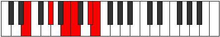

# Mode AFlatLaritonic

## Links

- [Documentation](index.md)
- [Scales Index](Scales.md)
- [Modes Index](Modes.md)
- [Chords Index](Chords.md)

## Scale

[Zacritonic](ScaleZacritonic.md)

## Mode

[AFlatLaritonic](ModeAFlatLaritonic.md)

## Tonic

Ab

## Signature

[CNaturalMajor]

## Perfection

 - 2 Perfect Notes

 - 3 Imperfect Notes

## Notes

- Ab
- B (Imperfect)
- C (Imperfect)
- Eb (Imperfect)
- E
- Ab

## Illustration

## Relative Modes

| Number | Mode | Tonic | Notes | Illustration |
|--------|------|-------|-------|--------------|
| [409](https://ianring.com/musictheory/scales/409) | [Laritonic](ModeLaritonic.md) | G# | G#, B, C, D#, E, G# |  |
| [409](https://ianring.com/musictheory/scales/409) | [Laritonic](ModeLaritonic.md) | Ab | Ab, B, C, Eb, E, Ab |  |
| [563](https://ianring.com/musictheory/scales/563) | [Thacritonic](ModeThacritonic.md) | B | B, C, D#, E, G#, B |  |
| [803](https://ianring.com/musictheory/scales/803) | [Loritonic](ModeLoritonic.md) | D# | D#, E, G#, B, C, D# |  |
| [803](https://ianring.com/musictheory/scales/803) | [Loritonic](ModeLoritonic.md) | Eb | Eb, E, Ab, B, C, Eb |  |
| [2329](https://ianring.com/musictheory/scales/2329) | [Styditonic](ModeStyditonic.md) | C | C, D#, E, G#, B, C |  |
| [2449](https://ianring.com/musictheory/scales/2449) | [Zacritonic](ModeZacritonic.md) | E | E, G#, B, C, D#, E |  |

## Chords

### Ab

| Number | Root | Name | Notes | Illustration | Audio |
|--------|------|------|-------|--------------|-------|

### B

| Number | Root | Name | Notes | Illustration | Audio |
|--------|------|------|-------|--------------|-------|
| 2312 | B | [BM##5](ChordBNaturalMajorDoubleSharpFifth.md) | B, D#, G# |  | [midi](ChordBNaturalMajorDoubleSharpFifthRootPosition.mid) [ogg](ChordBNaturalMajorDoubleSharpFifthRootPosition.ogg) |
| 2320 | B | [Bsus4##5](ChordBNaturalSuspendedFourthDoubleSharpFifth.md) | B, E, G# |  | [midi](ChordBNaturalSuspendedFourthDoubleSharpFifthRootPosition.mid) [ogg](ChordBNaturalSuspendedFourthDoubleSharpFifthRootPosition.ogg) |

### C

| Number | Root | Name | Notes | Illustration | Audio |
|--------|------|------|-------|--------------|-------|
| 265 | C | [Cm#5](ChordCNaturalMinorSharpFifth.md) | C, Eb, Ab |  | [midi](ChordCNaturalMinorSharpFifthRootPosition.mid) [ogg](ChordCNaturalMinorSharpFifthRootPosition.ogg) |
| 273 | C | [C+](ChordCNaturalAugmented.md) | C, E, G# |  | [midi](ChordCNaturalAugmentedRootPosition.mid) [ogg](ChordCNaturalAugmentedRootPosition.ogg) |
| 273 | C | [C+7](ChordCNaturalAugmentedAugmentedSeventh.md) | C, E, G#, B# |  | [midi](ChordCNaturalAugmentedAugmentedSeventhRootPosition.mid) [ogg](ChordCNaturalAugmentedAugmentedSeventhRootPosition.ogg) |
| 2321 | C | [C+(M7)](ChordCNaturalAugmentedMajorSeventh.md) | C, E, G#, B |  | [midi](ChordCNaturalAugmentedMajorSeventhRootPosition.mid) [ogg](ChordCNaturalAugmentedMajorSeventhRootPosition.ogg) |

### Eb

| Number | Root | Name | Notes | Illustration | Audio |
|--------|------|------|-------|--------------|-------|

### E

| Number | Root | Name | Notes | Illustration | Audio |
|--------|------|------|-------|--------------|-------|
| 2064 | E | [E5](ChordENaturalPowerChord.md) | E, B |  | [midi](ChordENaturalPowerChordRootPosition.mid) [ogg](ChordENaturalPowerChordRootPosition.ogg) |
| 2320 | E | [EM](ChordENaturalMajor.md) | E, G#, B |  | [midi](ChordENaturalMajorRootPosition.mid) [ogg](ChordENaturalMajorRootPosition.ogg) |
| 273 | E | [E+](ChordENaturalAugmented.md) | E, G#, B# |  | [midi](ChordENaturalAugmentedRootPosition.mid) [ogg](ChordENaturalAugmentedRootPosition.ogg) |
| 273 | E | [E+7](ChordENaturalAugmentedAugmentedSeventh.md) | E, G#, B#, D## |  | [midi](ChordENaturalAugmentedAugmentedSeventhRootPosition.mid) [ogg](ChordENaturalAugmentedAugmentedSeventhRootPosition.ogg) |
| 2328 | E | [EM7](ChordENaturalMajorSeventh.md) | E, G#, B, D# |  | [midi](ChordENaturalMajorSeventhRootPosition.mid) [ogg](ChordENaturalMajorSeventhRootPosition.ogg) |
| 281 | E | [E+(M7)](ChordENaturalAugmentedMajorSeventh.md) | E, G#, B#, D# |  | [midi](ChordENaturalAugmentedMajorSeventhRootPosition.mid) [ogg](ChordENaturalAugmentedMajorSeventhRootPosition.ogg) |

