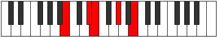

# Mode AFlatLothic

## Links

- [Documentation](index.md)
- [Scales Index](Scales.md)
- [Modes Index](Modes.md)
- [Chords Index](Chords.md)

## Scale

[Thaptic](ScaleThaptic.md)

## Mode

[AFlatLothic](ModeAFlatLothic.md)

## Tonic

Ab

## Signature

[CNaturalMajor]

## Perfection

 - 2 Perfect Notes

 - 2 Imperfect Notes

## Notes

- Ab
- B (Imperfect)
- Eb (Imperfect)
- E
- Ab

## Illustration

## Relative Modes

| Number | Mode | Tonic | Notes | Illustration |
|--------|------|-------|-------|--------------|
| [291](https://ianring.com/musictheory/scales/291) | [Aerathic](ModeAerathic.md) | D# | D#, E, G#, B, D# |  |
| [291](https://ianring.com/musictheory/scales/291) | [Aerathic](ModeAerathic.md) | Eb | Eb, E, Ab, B, Eb |  |
| [393](https://ianring.com/musictheory/scales/393) | [Lothic](ModeLothic.md) | G# | G#, B, D#, E, G# |  |
| [393](https://ianring.com/musictheory/scales/393) | [Lothic](ModeLothic.md) | Ab | Ab, B, Eb, E, Ab |  |
| [561](https://ianring.com/musictheory/scales/561) | [Phratic](ModePhratic.md) | B | B, D#, E, G#, B |  |
| [2193](https://ianring.com/musictheory/scales/2193) | [Thaptic](ModeThaptic.md) | E | E, G#, B, D#, E |  |

## Chords

### Ab

| Number | Root | Name | Notes | Illustration | Audio |
|--------|------|------|-------|--------------|-------|

### B

| Number | Root | Name | Notes | Illustration | Audio |
|--------|------|------|-------|--------------|-------|
| 2312 | B | [BM##5](ChordBNaturalMajorDoubleSharpFifth.md) | B, D#, G# |  | [midi](ChordBNaturalMajorDoubleSharpFifthRootPosition.mid) [ogg](ChordBNaturalMajorDoubleSharpFifthRootPosition.ogg) |
| 2320 | B | [Bsus4##5](ChordBNaturalSuspendedFourthDoubleSharpFifth.md) | B, E, G# |  | [midi](ChordBNaturalSuspendedFourthDoubleSharpFifthRootPosition.mid) [ogg](ChordBNaturalSuspendedFourthDoubleSharpFifthRootPosition.ogg) |

### Eb

| Number | Root | Name | Notes | Illustration | Audio |
|--------|------|------|-------|--------------|-------|

### E

| Number | Root | Name | Notes | Illustration | Audio |
|--------|------|------|-------|--------------|-------|
| 2064 | E | [E5](ChordENaturalPowerChord.md) | E, B |  | [midi](ChordENaturalPowerChordRootPosition.mid) [ogg](ChordENaturalPowerChordRootPosition.ogg) |
| 2320 | E | [EM](ChordENaturalMajor.md) | E, G#, B |  | [midi](ChordENaturalMajorRootPosition.mid) [ogg](ChordENaturalMajorRootPosition.ogg) |
| 2328 | E | [EM7](ChordENaturalMajorSeventh.md) | E, G#, B, D# |  | [midi](ChordENaturalMajorSeventhRootPosition.mid) [ogg](ChordENaturalMajorSeventhRootPosition.ogg) |

