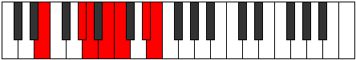

# Mode AFlatLygimic

## Links

- [Documentation](index.md)
- [Scales Index](Scales.md)
- [Modes Index](Modes.md)
- [Chords Index](Chords.md)

## Scale

[Laptimic](ScaleLaptimic.md)

## Mode

[AFlatLygimic](ModeAFlatLygimic.md)

## Tonic

Ab

## Signature

[CNaturalMajor]

## Perfection

 - 3 Perfect Notes

 - 3 Imperfect Notes

## Notes

- Ab
- Bbb
- Cb (Imperfect)
- Dbb (Imperfect)
- Eb (Imperfect)
- Fb
- Ab

## Illustration

## Relative Modes

| Number | Mode | Tonic | Notes | Illustration |
|--------|------|-------|-------|--------------|
| [411](https://ianring.com/musictheory/scales/411) | [Lygimic](ModeLygimic.md) | G# | G#, A, B, C, D#, E, G# |  |
| [411](https://ianring.com/musictheory/scales/411) | [Lygimic](ModeLygimic.md) | Ab | Ab, Bbb, Cb, Dbb, Eb, Fb, Ab |  |
| [867](https://ianring.com/musictheory/scales/867) | [Phrocrimic](ModePhrocrimic.md) | D# | D#, E, F###, G##, A##, B#, D# |  |
| [867](https://ianring.com/musictheory/scales/867) | [Phrocrimic](ModePhrocrimic.md) | Eb | Eb, Fb, G#, A, B, C, Eb |  |
| [1587](https://ianring.com/musictheory/scales/1587) | [Lalimic](ModeLalimic.md) | B | B, C, D#, E, F###, G##, B |  |
| [2253](https://ianring.com/musictheory/scales/2253) | [Logimic](ModeLogimic.md) | A | A, B, C, D#, E, F###, A |  |
| [2481](https://ianring.com/musictheory/scales/2481) | [Laptimic](ModeLaptimic.md) | E | E, F###, G##, A##, B#, C###, E |  |
| [2841](https://ianring.com/musictheory/scales/2841) | [Sothimic](ModeSothimic.md) | C | C, D#, E, F###, G##, A##, C |  |

## Chords

### Ab

| Number | Root | Name | Notes | Illustration | Audio |
|--------|------|------|-------|--------------|-------|

### Bbb

| Number | Root | Name | Notes | Illustration | Audio |
|--------|------|------|-------|--------------|-------|

### Cb

| Number | Root | Name | Notes | Illustration | Audio |
|--------|------|------|-------|--------------|-------|

### Dbb

| Number | Root | Name | Notes | Illustration | Audio |
|--------|------|------|-------|--------------|-------|

### Eb

| Number | Root | Name | Notes | Illustration | Audio |
|--------|------|------|-------|--------------|-------|

### Fb

| Number | Root | Name | Notes | Illustration | Audio |
|--------|------|------|-------|--------------|-------|

