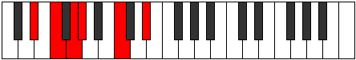

# Mode AFlatMagitonic

## Links

- [Documentation](index.md)
- [Scales Index](Scales.md)
- [Modes Index](Modes.md)
- [Chords Index](Chords.md)

## Scale

[Magitonic](ScaleMagitonic.md)

## Mode

[AFlatMagitonic](ModeAFlatMagitonic.md)

## Tonic

Ab

## Signature

[CNaturalMajor]

## Perfection

 - 3 Perfect Notes

 - 2 Imperfect Notes

## Notes

- Ab
- C
- Eb (Imperfect)
- F
- G (Imperfect)
- Ab

## Illustration

## Relative Modes

| Number | Mode | Tonic | Notes | Illustration |
|--------|------|-------|-------|--------------|
| [425](https://ianring.com/musictheory/scales/425) | [Daditonic](ModeDaditonic.md) | C | C, D#, F, G, G#, C |  |
| [565](https://ianring.com/musictheory/scales/565) | [Aeolyphritonic](ModeAeolyphritonic.md) | D# | D#, F, G, G#, C, D# |  |
| [565](https://ianring.com/musictheory/scales/565) | [Aeolyphritonic](ModeAeolyphritonic.md) | Eb | Eb, F, G, Ab, C, Eb |  |
| [1165](https://ianring.com/musictheory/scales/1165) | [Gycritonic](ModeGycritonic.md) | F | F, G, G#, C, D#, F |  |
| [1315](https://ianring.com/musictheory/scales/1315) | [Pyritonic](ModePyritonic.md) | G | G, G#, C, D#, F, G |  |
| [2705](https://ianring.com/musictheory/scales/2705) | [Magitonic](ModeMagitonic.md) | G# | G#, C, D#, F, G, G# |  |
| [2705](https://ianring.com/musictheory/scales/2705) | [Magitonic](ModeMagitonic.md) | Ab | Ab, C, Eb, F, G, Ab |  |

## Chords

### Ab

| Number | Root | Name | Notes | Illustration | Audio |
|--------|------|------|-------|--------------|-------|
| 264 | Ab | [Ab5](ChordAFlatPowerChord.md) | Ab, Eb |  | [midi](ChordAFlatPowerChordRootPosition.mid) [ogg](ChordAFlatPowerChordRootPosition.ogg) |
| 265 | Ab | [AbM](ChordAFlatMajor.md) | Ab, C, Eb |  | [midi](ChordAFlatMajorRootPosition.mid) [ogg](ChordAFlatMajorRootPosition.ogg) |
| 289 | Ab | [AbM##5](ChordAFlatMajorDoubleSharpFifth.md) | Ab, C, F |  | [midi](ChordAFlatMajorDoubleSharpFifthRootPosition.mid) [ogg](ChordAFlatMajorDoubleSharpFifthRootPosition.ogg) |
| 297 | Ab | [AbM6](ChordAFlatMajorSixth.md) | Ab, C, Eb, F |  | [midi](ChordAFlatMajorSixthRootPosition.mid) [ogg](ChordAFlatMajorSixthRootPosition.ogg) |
| 393 | Ab | [AbM7](ChordAFlatMajorSeventh.md) | Ab, C, Eb, G |  | [midi](ChordAFlatMajorSeventhRootPosition.mid) [ogg](ChordAFlatMajorSeventhRootPosition.ogg) |
| 417 | Ab | [AbM7##5](ChordAFlatMajorSeventhDoubleSharpFifth.md) | Ab, C, F, G |  | [midi](ChordAFlatMajorSeventhDoubleSharpFifthRootPosition.mid) [ogg](ChordAFlatMajorSeventhDoubleSharpFifthRootPosition.ogg) |
| 425 | Ab | [AbM7add13](ChordAFlatMajorSeventhAddThirteenth.md) | Ab, C, Eb, G, F |  | [midi](ChordAFlatMajorSeventhAddThirteenthRootPosition.mid) [ogg](ChordAFlatMajorSeventhAddThirteenthRootPosition.ogg) |

### C

| Number | Root | Name | Notes | Illustration | Audio |
|--------|------|------|-------|--------------|-------|
| 41 | C | [Cmbb5](ChordCNaturalMinorDoubleFlatFifth.md) | C, Eb, F |  | [midi](ChordCNaturalMinorDoubleFlatFifthRootPosition.mid) [ogg](ChordCNaturalMinorDoubleFlatFifthRootPosition.ogg) |
| 129 | C | [C5](ChordCNaturalPowerChord.md) | C, G |  | [midi](ChordCNaturalPowerChordRootPosition.mid) [ogg](ChordCNaturalPowerChordRootPosition.ogg) |
| 137 | C | [Cm](ChordCNaturalMinor.md) | C, Eb, G |  | [midi](ChordCNaturalMinorRootPosition.mid) [ogg](ChordCNaturalMinorRootPosition.ogg) |
| 137 | C | [Cm(add(#9))](ChordCNaturalMinorAddSharpNinth.md) | C, Eb, G, D# |  | [midi](ChordCNaturalMinorAddSharpNinthRootPosition.mid) [ogg](ChordCNaturalMinorAddSharpNinthRootPosition.ogg) |
| 161 | C | [Csus4](ChordCNaturalSuspendedFourth.md) | C, F, G |  | [midi](ChordCNaturalSuspendedFourthRootPosition.mid) [ogg](ChordCNaturalSuspendedFourthRootPosition.ogg) |
| 169 | C | [Cm(add11)](ChordCNaturalMinorAddEleventh.md) | C, Eb, G, F |  | [midi](ChordCNaturalMinorAddEleventhRootPosition.mid) [ogg](ChordCNaturalMinorAddEleventhRootPosition.ogg) |
| 169 | C | [Cm(add4)](ChordCNaturalMinorAddFourth.md) | C, Eb, F, G |  | [midi](ChordCNaturalMinorAddFourthRootPosition.mid) [ogg](ChordCNaturalMinorAddFourthRootPosition.ogg) |
| 265 | C | [Cm#5](ChordCNaturalMinorSharpFifth.md) | C, Eb, Ab |  | [midi](ChordCNaturalMinorSharpFifthRootPosition.mid) [ogg](ChordCNaturalMinorSharpFifthRootPosition.ogg) |
| 289 | C | [Csus4#5](ChordCNaturalSuspendedFourthSharpFifth.md) | C, F, G# |  | [midi](ChordCNaturalSuspendedFourthSharpFifthRootPosition.mid) [ogg](ChordCNaturalSuspendedFourthSharpFifthRootPosition.ogg) |

### Eb

| Number | Root | Name | Notes | Illustration | Audio |
|--------|------|------|-------|--------------|-------|
| 296 | Eb | [Ebsus2bb5](ChordEFlatSuspendedSecondDoubleFlatFifth.md) | Eb, F, Ab |  | [midi](ChordEFlatSuspendedSecondDoubleFlatFifthRootPosition.mid) [ogg](ChordEFlatSuspendedSecondDoubleFlatFifthRootPosition.ogg) |
| 137 | Eb | [EbM##5](ChordEFlatMajorDoubleSharpFifth.md) | Eb, G, C |  | [midi](ChordEFlatMajorDoubleSharpFifthRootPosition.mid) [ogg](ChordEFlatMajorDoubleSharpFifthRootPosition.ogg) |
| 265 | Eb | [Ebsus4##5](ChordEFlatSuspendedFourthDoubleSharpFifth.md) | Eb, Ab, C |  | [midi](ChordEFlatSuspendedFourthDoubleSharpFifthRootPosition.mid) [ogg](ChordEFlatSuspendedFourthDoubleSharpFifthRootPosition.ogg) |
| 297 | Eb | [EbM6sus2bb5](ChordEFlatMajorSixthSuspendedSecondDoubleFlatFifth.md) | Eb, F, Ab, C |  | [midi](ChordEFlatMajorSixthSuspendedSecondDoubleFlatFifthRootPosition.mid) [ogg](ChordEFlatMajorSixthSuspendedSecondDoubleFlatFifthRootPosition.ogg) |

### F

| Number | Root | Name | Notes | Illustration | Audio |
|--------|------|------|-------|--------------|-------|
| 33 | F | [F5](ChordFNaturalPowerChord.md) | F, C |  | [midi](ChordFNaturalPowerChordRootPosition.mid) [ogg](ChordFNaturalPowerChordRootPosition.ogg) |
| 161 | F | [Fsus2](ChordFNaturalSuspendedSecond.md) | F, G, C |  | [midi](ChordFNaturalSuspendedSecondRootPosition.mid) [ogg](ChordFNaturalSuspendedSecondRootPosition.ogg) |
| 289 | F | [Fm](ChordFNaturalMinor.md) | F, Ab, C |  | [midi](ChordFNaturalMinorRootPosition.mid) [ogg](ChordFNaturalMinorRootPosition.ogg) |
| 289 | F | [Fm(add(#9))](ChordFNaturalMinorAddSharpNinth.md) | F, Ab, C, G# |  | [midi](ChordFNaturalMinorAddSharpNinthRootPosition.mid) [ogg](ChordFNaturalMinorAddSharpNinthRootPosition.ogg) |
| 417 | F | [Fm(add9)](ChordFNaturalMinorAddNinth.md) | F, Ab, C, G |  | [midi](ChordFNaturalMinorAddNinthRootPosition.mid) [ogg](ChordFNaturalMinorAddNinthRootPosition.ogg) |
| 169 | F | [F7sus2](ChordFNaturalDominantSeventhSuspendedSecond.md) | F, G, C, Eb |  | [midi](ChordFNaturalDominantSeventhSuspendedSecondRootPosition.mid) [ogg](ChordFNaturalDominantSeventhSuspendedSecondRootPosition.ogg) |
| 169 | F | [F9sus2](ChordFNaturalDominantNinthSuspendedSecond.md) | F, G, C, Eb, G |  | [midi](ChordFNaturalDominantNinthSuspendedSecondRootPosition.mid) [ogg](ChordFNaturalDominantNinthSuspendedSecondRootPosition.ogg) |
| 297 | F | [Fm7](ChordFNaturalMinorSeventh.md) | F, Ab, C, Eb |  | [midi](ChordFNaturalMinorSeventhRootPosition.mid) [ogg](ChordFNaturalMinorSeventhRootPosition.ogg) |
| 425 | F | [Fm9](ChordFNaturalMinorNinth.md) | F, Ab, C, Eb, G |  | [midi](ChordFNaturalMinorNinthRootPosition.mid) [ogg](ChordFNaturalMinorNinthRootPosition.ogg) |

### G

| Number | Root | Name | Notes | Illustration | Audio |
|--------|------|------|-------|--------------|-------|
| 137 | G | [Gsus4#5](ChordGNaturalSuspendedFourthSharpFifth.md) | G, C, D# |  | [midi](ChordGNaturalSuspendedFourthSharpFifthRootPosition.mid) [ogg](ChordGNaturalSuspendedFourthSharpFifthRootPosition.ogg) |
| 161 | G | [GQ](ChordGNaturalQuartal.md) | G, C, F |  | [midi](ChordGNaturalQuartalRootPosition.mid) [ogg](ChordGNaturalQuartalRootPosition.ogg) |

