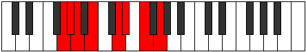

# Mode AFlatManian

## Links

- [Documentation](index.md)
- [Scales Index](Scales.md)
- [Modes Index](Modes.md)
- [Chords Index](Chords.md)

## Scale

[Korian](ScaleKorian.md)

## Mode

[AFlatManian](ModeAFlatManian.md)

## Tonic

Ab

## Signature

[CNaturalMajor]

## Perfection

 - 3 Perfect Notes

 - 4 Imperfect Notes

## Notes

- Ab
- Bbb (Imperfect)
- Cb (Imperfect)
- D
- Eb (Imperfect)
- F (Imperfect)
- G
- Ab

## Illustration

## Relative Modes

| Number | Mode | Tonic | Notes | Illustration |
|--------|------|-------|-------|--------------|
| [2763](https://ianring.com/musictheory/scales/2763) | [Manian](ModeManian.md) | Ab | Ab, Bbb, Cb, D, Eb, F, G, Ab |  |
| [747](https://ianring.com/musictheory/scales/747) | [Lynian](ModeLynian.md) | D | D, Eb, F, G, Ab, Bbb, Cb, D |  |
| [2421](https://ianring.com/musictheory/scales/2421) | [Malian](ModeMalian.md) | Eb | Eb, F, G, Ab, Bbb, Cb, D, Eb |  |
| [1629](https://ianring.com/musictheory/scales/1629) | [Synian](ModeSynian.md) | F | F, G, Ab, Bbb, Cb, D, Eb, F |  |
| [1431](https://ianring.com/musictheory/scales/1431) | [Phragian](ModePhragian.md) | G | G, Ab, Bbb, Cb, D, Eb, F, G |  |

## Chords

### Ab

| Number | Root | Name | Notes | Illustration | Audio |
|--------|------|------|-------|--------------|-------|

### Bbb

| Number | Root | Name | Notes | Illustration | Audio |
|--------|------|------|-------|--------------|-------|

### Cb

| Number | Root | Name | Notes | Illustration | Audio |
|--------|------|------|-------|--------------|-------|

### D

| Number | Root | Name | Notes | Illustration | Audio |
|--------|------|------|-------|--------------|-------|

### Eb

| Number | Root | Name | Notes | Illustration | Audio |
|--------|------|------|-------|--------------|-------|

### F

| Number | Root | Name | Notes | Illustration | Audio |
|--------|------|------|-------|--------------|-------|

### G

| Number | Root | Name | Notes | Illustration | Audio |
|--------|------|------|-------|--------------|-------|

