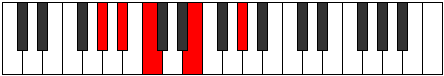
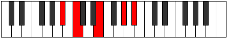
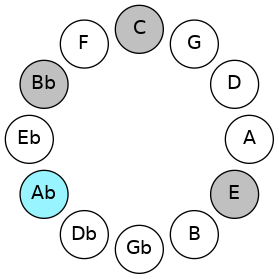
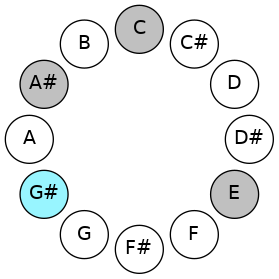
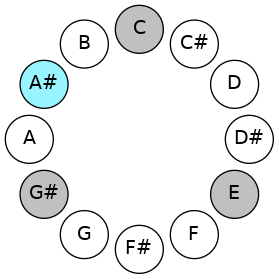
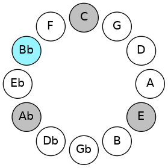
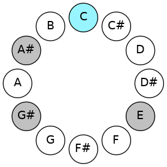
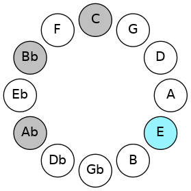
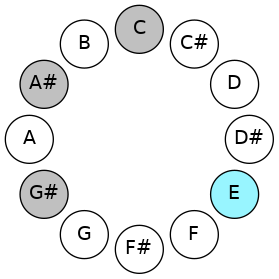

# Mode AFlatMixolyric

## Links

- [Documentation](README.md)
- [Scales Index](Scales.md)
- [Modes Index](Modes.md)
- [Chords Index](Chords.md)

## Scale

[Aeolic](ScaleAeolic.md)

## Mode

[AFlatMixolyric](ModeAFlatMixolyric.md)

## Tonic

Ab

## Signature

[CNaturalMajor]

## Transposition

2, 2, 4, 4

## Chord Pattern

## Perfection

 - 0 Perfect Notes

 - 4 Imperfect Notes

## Notes

- Ab (Imperfect)
- Bb (Imperfect)
- C (Imperfect)
- E (Imperfect)
- Ab (Imperfect)

## Illustration

## Diagram

| Circle of Fifth | Chromatic Circle |
|-----------------|------------------|
|  |  |
## Relative Modes

| Number | Mode | Tonic | Notes | Illustration |
|--------|------|-------|-------|--------------|
| [277](https://ianring.com/musictheory/scales/277) | [Mixolyric](ModeMixolyric.md) | G# | G#, A#, C, E, G# |  |
| [277](https://ianring.com/musictheory/scales/277) | [Mixolyric](ModeMixolyric.md) | Ab | Ab, Bb, C, E, Ab |  |
| [1093](https://ianring.com/musictheory/scales/1093) | [Lydic](ModeLydic.md) | A# | A#, C, E, G#, A# |  |
| [1093](https://ianring.com/musictheory/scales/1093) | [Lydic](ModeLydic.md) | Bb | Bb, C, E, Ab, Bb |  |
| [1297](https://ianring.com/musictheory/scales/1297) | [Aeolic](ModeAeolic.md) | C | C, E, G#, A#, C |  |
| [337](https://ianring.com/musictheory/scales/337) | [Koptic](ModeKoptic.md) | E | E, G#, A#, C, E |  |
## Relative Brightness

| Number | Mode | Tonic | Notes | Circle Of Fifth | Chromatic Circle |
|--------|------|-------|-------|-----------------|------------------|
| [277](https://ianring.com/musictheory/scales/277) | [Mixolyric](ModeMixolyric.md) | G# | G#, A#, C, E, G# |  |  
| [277](https://ianring.com/musictheory/scales/277) | [Mixolyric](ModeMixolyric.md) | Ab | Ab, Bb, C, E, Ab |  |  
| [1093](https://ianring.com/musictheory/scales/1093) | [Lydic](ModeLydic.md) | A# | A#, C, E, G#, A# |  |  
| [1093](https://ianring.com/musictheory/scales/1093) | [Lydic](ModeLydic.md) | Bb | Bb, C, E, Ab, Bb |  |  
| [1297](https://ianring.com/musictheory/scales/1297) | [Aeolic](ModeAeolic.md) | C | C, E, G#, A#, C |  |  
| [337](https://ianring.com/musictheory/scales/337) | [Koptic](ModeKoptic.md) | E | E, G#, A#, C, E |  |  

## Chords

### Ab

| Number | Root | Name | Notes | Illustration | Audio |
|--------|------|------|-------|--------------|-------|
| 1296 | Ab | [G#sus2#5](ChordGSharpSuspendedSecondSharpFifth.md) | G#, A#, D## |  | [midi](ChordGSharpSuspendedSecondSharpFifthRootPosition.mid) |
| 1296 | Ab | [Absus2#5](ChordAFlatSuspendedSecondSharpFifth.md) | Ab, Bb, E |  | [midi](ChordAFlatSuspendedSecondSharpFifthRootPosition.mid) |
| 273 | Ab | [G#+](ChordGSharpAugmented.md) | G#, B#, D## |  | [midi](ChordGSharpAugmentedRootPosition.mid) |
| 273 | Ab | [G#+7](ChordGSharpAugmentedAugmentedSeventh.md) | G#, B#, D##, F### |  | [midi](ChordGSharpAugmentedAugmentedSeventhRootPosition.mid) |
| 273 | Ab | [Ab+](ChordAFlatAugmented.md) | Ab, C, E |  | [midi](ChordAFlatAugmentedRootPosition.mid) |
| 273 | Ab | [Ab+7](ChordAFlatAugmentedAugmentedSeventh.md) | Ab, C, E, G# |  | [midi](ChordAFlatAugmentedAugmentedSeventhRootPosition.mid) |

### Bb

| Number | Root | Name | Notes | Illustration | Audio |
|--------|------|------|-------|--------------|-------|
| 1041 | Bb | [A#](ChordASharpDiminishedFlatThird.md) | A#, C, E |  | [midi](ChordASharpDiminishedFlatThirdRootPosition.mid) |
| 1041 | Bb | [A#sus2b5](ChordASharpSuspendedSecondFlatFifth.md) | A#, B#, E |  | [midi](ChordASharpSuspendedSecondFlatFifthRootPosition.mid) |
| 1041 | Bb | [Bb](ChordBFlatDiminishedFlatThird.md) | Bb, Dbb, Fb |  | [midi](ChordBFlatDiminishedFlatThirdRootPosition.mid) |
| 1041 | Bb | [Bbsus2b5](ChordBFlatSuspendedSecondFlatFifth.md) | Bb, C, Fb |  | [midi](ChordBFlatSuspendedSecondFlatFifthRootPosition.mid) |

### C

| Number | Root | Name | Notes | Illustration | Audio |
|--------|------|------|-------|--------------|-------|
| 273 | C | [C+](ChordCNaturalAugmented.md) | C, E, G# |  | [midi](ChordCNaturalAugmentedRootPosition.mid) |
| 273 | C | [C+7](ChordCNaturalAugmentedAugmentedSeventh.md) | C, E, G#, B# |  | [midi](ChordCNaturalAugmentedAugmentedSeventhRootPosition.mid) |

### E

| Number | Root | Name | Notes | Illustration | Audio |
|--------|------|------|-------|--------------|-------|
| 1296 | E | [EMb5](ChordENaturalMajorFlatFifth.md) | E, G#, Bb |  | [midi](ChordENaturalMajorFlatFifthRootPosition.mid) |
| 273 | E | [E+](ChordENaturalAugmented.md) | E, G#, B# |  | [midi](ChordENaturalAugmentedRootPosition.mid) |
| 273 | E | [E+7](ChordENaturalAugmentedAugmentedSeventh.md) | E, G#, B#, D## |  | [midi](ChordENaturalAugmentedAugmentedSeventhRootPosition.mid) |

