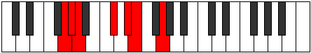
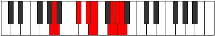

# Mode AFlatMorimic

## Links

- [Documentation](index.md)
- [Scales Index](Scales.md)
- [Modes Index](Modes.md)
- [Chords Index](Chords.md)

## Scale

[Katythimic](ScaleKatythimic.md)

## Mode

[AFlatMorimic](ModeAFlatMorimic.md)

## Tonic

Ab

## Signature

[CNaturalMajor]

## Perfection

 - 3 Perfect Notes

 - 3 Imperfect Notes

## Notes

- Ab
- Bbb
- C#
- D# (Imperfect)
- E (Imperfect)
- F## (Imperfect)
- Ab

## Illustration

## Relative Modes

| Number | Mode | Tonic | Notes | Illustration |
|--------|------|-------|-------|--------------|
| [461](https://ianring.com/musictheory/scales/461) | [Madimic](ModeMadimic.md) | C# | C#, D#, E, F##, G#, A, C# |  |
| [461](https://ianring.com/musictheory/scales/461) | [Madimic](ModeMadimic.md) | Db | Db, Eb, Fb, G, Ab, Bbb, Db |  |
| [839](https://ianring.com/musictheory/scales/839) | [Ionathimic](ModeIonathimic.md) | G | G, Ab, Bbb, C#, D#, E, G |  |
| [1139](https://ianring.com/musictheory/scales/1139) | [Aerygimic](ModeAerygimic.md) | D# | D#, E, F##, G#, A, B##, D# |  |
| [1139](https://ianring.com/musictheory/scales/1139) | [Aerygimic](ModeAerygimic.md) | Eb | Eb, Fb, G, Ab, Bbb, C#, Eb |  |
| [2467](https://ianring.com/musictheory/scales/2467) | [Morimic](ModeMorimic.md) | G# | G#, A, B##, C###, D##, E###, G# |  |
| [2467](https://ianring.com/musictheory/scales/2467) | [Morimic](ModeMorimic.md) | Ab | Ab, Bbb, C#, D#, E, F##, Ab |  |
| [2617](https://ianring.com/musictheory/scales/2617) | [Pylimic](ModePylimic.md) | E | E, F##, G#, A, B##, C###, E |  |
| [3281](https://ianring.com/musictheory/scales/3281) | [Katythimic](ModeKatythimic.md) | A | A, B##, C###, D##, E###, F###, A |  |

## Chords

### Ab

| Number | Root | Name | Notes | Illustration | Audio |
|--------|------|------|-------|--------------|-------|

### Bbb

| Number | Root | Name | Notes | Illustration | Audio |
|--------|------|------|-------|--------------|-------|

### C#

| Number | Root | Name | Notes | Illustration | Audio |
|--------|------|------|-------|--------------|-------|

### D#

| Number | Root | Name | Notes | Illustration | Audio |
|--------|------|------|-------|--------------|-------|

### E

| Number | Root | Name | Notes | Illustration | Audio |
|--------|------|------|-------|--------------|-------|

### F##

| Number | Root | Name | Notes | Illustration | Audio |
|--------|------|------|-------|--------------|-------|

