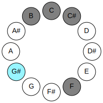
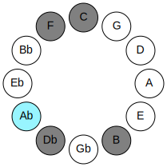
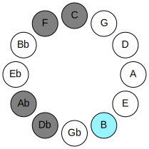
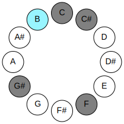
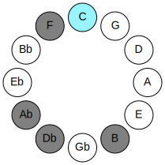
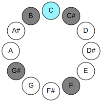
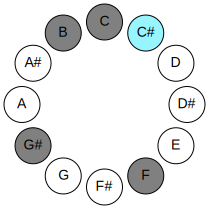
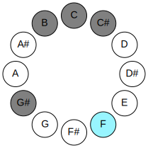

# Mode AFlatMothitonic

## Links

- [Documentation](README.md)
- [Scales Index](Scales.md)
- [Modes Index](Modes.md)
- [Chords Index](Chords.md)

## Parent Scale

[Molitonic](ScaleMolitonic.md)

## Mode

[AFlatMothitonic](ModeAFlatMothitonic.md)

## Number

569

## Luminosity

4

## Tonic

Ab

## Signature

C

## Transposition

3, 1, 1, 4, 3

## Chord Pattern

## Perfection

 - 2 Perfect Notes

 - 3 Imperfect Notes

 - Perfection Profile - false, false, false, true, true

## Notes

- Ab (Imperfect)
- B (Imperfect)
- C (Imperfect)
- Db
- F
- Ab (Imperfect)

## Illustration

## Diagram

| Circle of Fifth | Chromatic Circle |
|-----------------|------------------|
|  |  |
## Relative Modes

| Number | Mode | Luminosity | Tonic | Notes | Illustration |
|--------|------|------------|-------|-------|--------------|
| [569](https://ianring.com/musictheory/scales/569) | [Mothitonic](ModeMothitonic.md) | -1 | G# | G#, B, C, C#, F, G# |  |
| [569](https://ianring.com/musictheory/scales/569) | [Mothitonic](ModeMothitonic.md) | -1 | Ab | Ab, B, C, Db, F, Ab |  |
| [583](https://ianring.com/musictheory/scales/583) | [Aeritonic](ModeAeritonic.md) | -1 | B | B, C, C#, F, G#, B |  |
| [2339](https://ianring.com/musictheory/scales/2339) | [Ragitonic](ModeRagitonic.md) | -1 | C | C, C#, F, G#, B, C |  |
| [3217](https://ianring.com/musictheory/scales/3217) | [Molitonic](ModeMolitonic.md) | 5 | C# | C#, F, G#, B, C, C# |  |
| [3217](https://ianring.com/musictheory/scales/3217) | [Molitonic](ModeMolitonic.md) | 5 | Db | Db, F, Ab, B, C, Db |  |
| [457](https://ianring.com/musictheory/scales/457) | [Staptitonic](ModeStaptitonic.md) | 5 | F | F, G#, B, C, C#, F |  |
## Relative Brightness

| Number | Mode | Luminosity | Tonic | Notes | Circle Of Fifth | Chromatic Circle |
|--------|------|------------|-------|-------|-----------------|------------------|
| [569](https://ianring.com/musictheory/scales/569) | [Mothitonic](ModeMothitonic.md) | -1 | G# | G#, B, C, C#, F, G# |  |  |
| [569](https://ianring.com/musictheory/scales/569) | [Mothitonic](ModeMothitonic.md) | 4 | Ab | Ab, B, C, Db, F, Ab |  |  |
| [583](https://ianring.com/musictheory/scales/583) | [Aeritonic](ModeAeritonic.md) | -1 | B | B, C, C#, F, G#, B |  |  |
| [2339](https://ianring.com/musictheory/scales/2339) | [Ragitonic](ModeRagitonic.md) | 4 | C | C, C#, F, G#, B, C |  |  |
| [3217](https://ianring.com/musictheory/scales/3217) | [Molitonic](ModeMolitonic.md) | -1 | C# | C#, F, G#, B, C, C# |  |  |
| [3217](https://ianring.com/musictheory/scales/3217) | [Molitonic](ModeMolitonic.md) | 5 | Db | Db, F, Ab, B, C, Db |  |  |
| [457](https://ianring.com/musictheory/scales/457) | [Staptitonic](ModeStaptitonic.md) | -1 | F | F, G#, B, C, C#, F |  |  |

## Chords

### Ab

| Number | Root | Name | Notes | Illustration | Audio |
|--------|------|------|-------|--------------|-------|
| 2306 | Ab | [G#mbb5](ChordGSharpMinorDoubleFlatFifth.md) | G#, B, C# |  | [midi](ChordGSharpMinorDoubleFlatFifthRootPosition.mid) |
| 2306 | Ab | [Abmbb5](ChordAFlatMinorDoubleFlatFifth.md) | Ab, Cb, Db |  | [midi](ChordAFlatMinorDoubleFlatFifthRootPosition.mid) |
| 289 | Ab | [G#M##5](ChordGSharpMajorDoubleSharpFifth.md) | G#, B#, E# |  | [midi](ChordGSharpMajorDoubleSharpFifthRootPosition.mid) |
| 289 | Ab | [AbM##5](ChordAFlatMajorDoubleSharpFifth.md) | Ab, C, F |  | [midi](ChordAFlatMajorDoubleSharpFifthRootPosition.mid) |
| 290 | Ab | [G#sus4##5](ChordGSharpSuspendedFourthDoubleSharpFifth.md) | G#, C#, E# |  | [midi](ChordGSharpSuspendedFourthDoubleSharpFifthRootPosition.mid) |
| 290 | Ab | [Absus4##5](ChordAFlatSuspendedFourthDoubleSharpFifth.md) | Ab, Db, F |  | [midi](ChordAFlatSuspendedFourthDoubleSharpFifthRootPosition.mid) |

### B

| Number | Root | Name | Notes | Illustration | Audio |
|--------|------|------|-------|--------------|-------|
| 2081 | B | [Bloc](ChordBNaturalLocrian.md) | B, C, F |  | [midi](ChordBNaturalLocrianRootPosition.mid) |
| 2082 | B | [B](ChordBNaturalDiminishedFlatThird.md) | B, Db, F |  | [midi](ChordBNaturalDiminishedFlatThirdRootPosition.mid) |
| 2082 | B | [Bsus2b5](ChordBNaturalSuspendedSecondFlatFifth.md) | B, C#, F |  | [midi](ChordBNaturalSuspendedSecondFlatFifthRootPosition.mid) |
| 2338 | B | [BM6sus2b5](ChordBNaturalMajorSixthSuspendedSecondFlatFifth.md) | B, C#, F, G# |  | [midi](ChordBNaturalMajorSixthSuspendedSecondFlatFifthRootPosition.mid) |

### C

| Number | Root | Name | Notes | Illustration | Audio |
|--------|------|------|-------|--------------|-------|
| 289 | C | [Csus4#5](ChordCNaturalSuspendedFourthSharpFifth.md) | C, F, G# |  | [midi](ChordCNaturalSuspendedFourthSharpFifthRootPosition.mid) |
| 2081 | C | [CQ+](ChordCNaturalQuartalAugmented.md) | C, F, B |  | [midi](ChordCNaturalQuartalAugmentedRootPosition.mid) |
| 2337 | C | [CM7(sus4)#5](ChordCNaturalMajorSeventhSuspendedFourthSharpFifth.md) | C, F, G#, B |  | [midi](ChordCNaturalMajorSeventhSuspendedFourthSharpFifthRootPosition.mid) |

### Db

| Number | Root | Name | Notes | Illustration | Audio |
|--------|------|------|-------|--------------|-------|
| 258 | Db | [C#5](ChordCSharpPowerChord.md) | C#, G# |  | [midi](ChordCSharpPowerChordRootPosition.mid) |
| 258 | Db | [Db5](ChordDFlatPowerChord.md) | Db, Ab |  | [midi](ChordDFlatPowerChordRootPosition.mid) |
| 290 | Db | [C#M](ChordCSharpMajor.md) | C#, E#, G# |  | [midi](ChordCSharpMajorRootPosition.mid) |
| 290 | Db | [DbM](ChordDFlatMajor.md) | Db, F, Ab |  | [midi](ChordDFlatMajorRootPosition.mid) |
| 2338 | Db | [C#7](ChordCSharpDominantSeventh.md) | C#, E#, G#, B |  | [midi](ChordCSharpDominantSeventhRootPosition.mid) |
| 2338 | Db | [Db7](ChordDFlatDominantSeventh.md) | Db, F, Ab, Cb |  | [midi](ChordDFlatDominantSeventhRootPosition.mid) |
| 291 | Db | [C#M7](ChordCSharpMajorSeventh.md) | C#, E#, G#, B# |  | [midi](ChordCSharpMajorSeventhRootPosition.mid) |
| 291 | Db | [DbM7](ChordDFlatMajorSeventh.md) | Db, F, Ab, C |  | [midi](ChordDFlatMajorSeventhRootPosition.mid) |

### F

| Number | Root | Name | Notes | Illustration | Audio |
|--------|------|------|-------|--------------|-------|
| 2336 | F | [Fo](ChordFNaturalDiminished.md) | F, Ab, Cb |  | [midi](ChordFNaturalDiminishedRootPosition.mid) |
| 33 | F | [F5](ChordFNaturalPowerChord.md) | F, C |  | [midi](ChordFNaturalPowerChordRootPosition.mid) |
| 289 | F | [Fm](ChordFNaturalMinor.md) | F, Ab, C |  | [midi](ChordFNaturalMinorRootPosition.mid) |
| 289 | F | [Fm(add(#9))](ChordFNaturalMinorAddSharpNinth.md) | F, Ab, C, G# |  | [midi](ChordFNaturalMinorAddSharpNinthRootPosition.mid) |
| 2081 | F | [Flyd](ChordFNaturalLydian.md) | F, B, C |  | [midi](ChordFNaturalLydianRootPosition.mid) |
| 2337 | F | [Fm(add(#4))](ChordFNaturalMinorAddSharpFourth.md) | F, Ab, B, C |  | [midi](ChordFNaturalMinorAddSharpFourthRootPosition.mid) |
| 290 | F | [Fm#5](ChordFNaturalMinorSharpFifth.md) | F, Ab, Db |  | [midi](ChordFNaturalMinorSharpFifthRootPosition.mid) |

