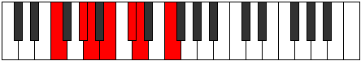
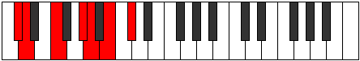

# Mode AFlatParimic

## Links

- [Documentation](index.md)
- [Scales Index](Scales.md)
- [Modes Index](Modes.md)
- [Chords Index](Chords.md)

## Scale

[Dagimic](ScaleDagimic.md)

## Mode

[AFlatParimic](ModeAFlatParimic.md)

## Tonic

Ab

## Signature

[CNaturalMajor]

## Perfection

 - 2 Perfect Notes

 - 4 Imperfect Notes

## Notes

- Ab (Imperfect)
- Bbb (Imperfect)
- Cb (Imperfect)
- Db
- Ebb
- F (Imperfect)
- Ab (Imperfect)

## Illustration

## Relative Modes

| Number | Mode | Tonic | Notes | Illustration |
|--------|------|-------|-------|--------------|
| [619](https://ianring.com/musictheory/scales/619) | [Parimic](ModeParimic.md) | G# | G#, A, B, C#, D, E#, G# |  |
| [619](https://ianring.com/musictheory/scales/619) | [Parimic](ModeParimic.md) | Ab | Ab, Bbb, Cb, Db, Ebb, F, Ab |  |
| [857](https://ianring.com/musictheory/scales/857) | [Aeolydimic](ModeAeolydimic.md) | F | F, G#, A, B, C#, D, F |  |
| [1427](https://ianring.com/musictheory/scales/1427) | [Lolimic](ModeLolimic.md) | C# | C#, D, E#, F###, G##, A##, C# |  |
| [1427](https://ianring.com/musictheory/scales/1427) | [Lolimic](ModeLolimic.md) | Db | Db, Ebb, F, G#, A, B, Db |  |
| [1613](https://ianring.com/musictheory/scales/1613) | [Thylimic](ModeThylimic.md) | B | B, C#, D, E#, F###, G##, B |  |
| [2357](https://ianring.com/musictheory/scales/2357) | [Ionaptimic](ModeIonaptimic.md) | A | A, B, C#, D, E#, F###, A |  |
| [2761](https://ianring.com/musictheory/scales/2761) | [Dagimic](ModeDagimic.md) | D | D, E#, F###, G##, A##, B##, D |  |

## Chords

### Ab

| Number | Root | Name | Notes | Illustration | Audio |
|--------|------|------|-------|--------------|-------|

### Bbb

| Number | Root | Name | Notes | Illustration | Audio |
|--------|------|------|-------|--------------|-------|

### Cb

| Number | Root | Name | Notes | Illustration | Audio |
|--------|------|------|-------|--------------|-------|

### Db

| Number | Root | Name | Notes | Illustration | Audio |
|--------|------|------|-------|--------------|-------|

### Ebb

| Number | Root | Name | Notes | Illustration | Audio |
|--------|------|------|-------|--------------|-------|

### F

| Number | Root | Name | Notes | Illustration | Audio |
|--------|------|------|-------|--------------|-------|

