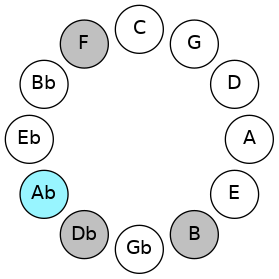
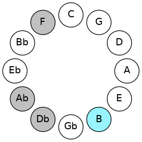
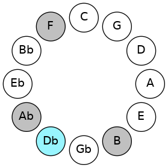
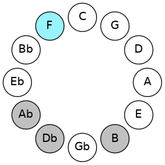

# Mode AFlatPhradic

## Links

- [Documentation](README.md)
- [Scales Index](Scales.md)
- [Modes Index](Modes.md)
- [Chords Index](Chords.md)

## Scale

[Daric](ScaleDaric.md)

## Mode

[AFlatPhradic](ModeAFlatPhradic.md)

## Tonic

Ab

## Signature

[CNaturalMajor]

## Transposition

3, 2, 4, 3

## Chord Pattern

## Perfection

 - 1 Perfect Notes

 - 3 Imperfect Notes

## Notes

- Ab (Imperfect)
- B (Imperfect)
- Db
- F (Imperfect)
- Ab (Imperfect)

## Illustration

## Diagram

## Relative Modes

| Number | Mode | Tonic | Notes | Illustration |
|--------|------|-------|-------|--------------|
| [553](https://ianring.com/musictheory/scales/553) | [Phradic](ModePhradic.md) | G# | G#, B, C#, F, G# |  |
| [553](https://ianring.com/musictheory/scales/553) | [Phradic](ModePhradic.md) | Ab | Ab, B, Db, F, Ab |  |
| [581](https://ianring.com/musictheory/scales/581) | [Bolic](ModeBolic.md) | B | B, C#, F, G#, B |  |
| [1169](https://ianring.com/musictheory/scales/1169) | [Daric](ModeDaric.md) | C# | C#, F, G#, B, C# |  |
| [1169](https://ianring.com/musictheory/scales/1169) | [Daric](ModeDaric.md) | Db | Db, F, Ab, B, Db |  |
| [329](https://ianring.com/musictheory/scales/329) | [Lonic](ModeLonic.md) | F | F, G#, B, C#, F |  |
## Relative Brightness

| Number | Mode | Tonic | Notes | Illustration |
|--------|------|-------|-------|--------------|
| [553](https://ianring.com/musictheory/scales/553) | [Phradic](ModePhradic.md) | G# | G#, B, C#, F, G# |  |
| [553](https://ianring.com/musictheory/scales/553) | [Phradic](ModePhradic.md) | Ab | Ab, B, Db, F, Ab |  |
| [581](https://ianring.com/musictheory/scales/581) | [Bolic](ModeBolic.md) | B | B, C#, F, G#, B |  |
| [1169](https://ianring.com/musictheory/scales/1169) | [Daric](ModeDaric.md) | C# | C#, F, G#, B, C# |  |
| [1169](https://ianring.com/musictheory/scales/1169) | [Daric](ModeDaric.md) | Db | Db, F, Ab, B, Db |  |
| [329](https://ianring.com/musictheory/scales/329) | [Lonic](ModeLonic.md) | F | F, G#, B, C#, F |  |

## Chords

### Ab

| Number | Root | Name | Notes | Illustration | Audio |
|--------|------|------|-------|--------------|-------|
| 2306 | Ab | [G#mbb5](ChordGSharpMinorDoubleFlatFifth.md) | G#, B, C# |  | [midi](ChordGSharpMinorDoubleFlatFifthRootPosition.mid) |
| 2306 | Ab | [Abmbb5](ChordAFlatMinorDoubleFlatFifth.md) | Ab, Cb, Db |  | [midi](ChordAFlatMinorDoubleFlatFifthRootPosition.mid) |
| 290 | Ab | [G#sus4##5](ChordGSharpSuspendedFourthDoubleSharpFifth.md) | G#, C#, E# |  | [midi](ChordGSharpSuspendedFourthDoubleSharpFifthRootPosition.mid) |
| 290 | Ab | [Absus4##5](ChordAFlatSuspendedFourthDoubleSharpFifth.md) | Ab, Db, F |  | [midi](ChordAFlatSuspendedFourthDoubleSharpFifthRootPosition.mid) |

### B

| Number | Root | Name | Notes | Illustration | Audio |
|--------|------|------|-------|--------------|-------|
| 2082 | B | [B](ChordBNaturalDiminishedFlatThird.md) | B, Db, F |  | [midi](ChordBNaturalDiminishedFlatThirdRootPosition.mid) |
| 2082 | B | [Bsus2b5](ChordBNaturalSuspendedSecondFlatFifth.md) | B, C#, F |  | [midi](ChordBNaturalSuspendedSecondFlatFifthRootPosition.mid) |
| 2338 | B | [BM6sus2b5](ChordBNaturalMajorSixthSuspendedSecondFlatFifth.md) | B, C#, F, G# |  | [midi](ChordBNaturalMajorSixthSuspendedSecondFlatFifthRootPosition.mid) |

### Db

| Number | Root | Name | Notes | Illustration | Audio |
|--------|------|------|-------|--------------|-------|
| 258 | Db | [C#5](ChordCSharpPowerChord.md) | C#, G# |  | [midi](ChordCSharpPowerChordRootPosition.mid) |
| 258 | Db | [Db5](ChordDFlatPowerChord.md) | Db, Ab |  | [midi](ChordDFlatPowerChordRootPosition.mid) |
| 290 | Db | [C#M](ChordCSharpMajor.md) | C#, E#, G# |  | [midi](ChordCSharpMajorRootPosition.mid) |
| 290 | Db | [DbM](ChordDFlatMajor.md) | Db, F, Ab |  | [midi](ChordDFlatMajorRootPosition.mid) |
| 2338 | Db | [C#7](ChordCSharpDominantSeventh.md) | C#, E#, G#, B |  | [midi](ChordCSharpDominantSeventhRootPosition.mid) |
| 2338 | Db | [Db7](ChordDFlatDominantSeventh.md) | Db, F, Ab, Cb |  | [midi](ChordDFlatDominantSeventhRootPosition.mid) |

### F

| Number | Root | Name | Notes | Illustration | Audio |
|--------|------|------|-------|--------------|-------|
| 2336 | F | [Fo](ChordFNaturalDiminished.md) | F, Ab, Cb |  | [midi](ChordFNaturalDiminishedRootPosition.mid) |
| 290 | F | [Fm#5](ChordFNaturalMinorSharpFifth.md) | F, Ab, Db |  | [midi](ChordFNaturalMinorSharpFifthRootPosition.mid) |

