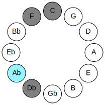
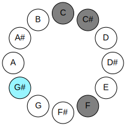
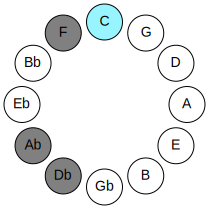
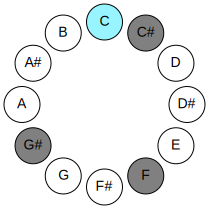
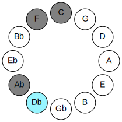
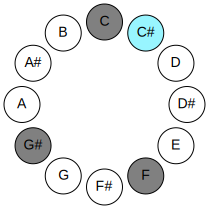
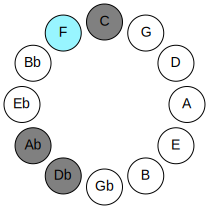
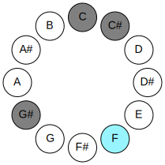

# Mode AFlatPhratic

## Links

- [Documentation](README.md)
- [Scales Index](Scales.md)
- [Modes Index](Modes.md)
- [Chords Index](Chords.md)

## Parent Scale

[Thaptic](ScaleThaptic.md)

## Mode

[AFlatPhratic](ModeAFlatPhratic.md)

## Number

561

## Luminosity

3

## Tonic

Ab

## Signature

C

## Transposition

4, 1, 4, 3

## Chord Pattern

## Perfection

 - 2 Perfect Notes

 - 2 Imperfect Notes

 - Perfection Profile - false, false, true, true

## Notes

- Ab (Imperfect)
- C (Imperfect)
- Db
- F
- Ab (Imperfect)

## Illustration

## Diagram

| Circle of Fifth | Chromatic Circle |
|-----------------|------------------|
|  |  |
## Relative Modes

| Number | Mode | Luminosity | Tonic | Notes | Illustration |
|--------|------|------------|-------|-------|--------------|
| [561](https://ianring.com/musictheory/scales/561) | [Phratic](ModePhratic.md) | 3 | G# | G#, C, C#, F, G# |  |
| [561](https://ianring.com/musictheory/scales/561) | [Phratic](ModePhratic.md) | 3 | Ab | Ab, C, Db, F, Ab |  |
| [291](https://ianring.com/musictheory/scales/291) | [Aerathic](ModeAerathic.md) | -1 | C | C, C#, F, G#, C |  |
| [2193](https://ianring.com/musictheory/scales/2193) | [Thaptic](ModeThaptic.md) | 4 | C# | C#, F, G#, C, C# |  |
| [2193](https://ianring.com/musictheory/scales/2193) | [Thaptic](ModeThaptic.md) | -1 | Db | Db, F, Ab, C, Db |  |
| [393](https://ianring.com/musictheory/scales/393) | [Lothic](ModeLothic.md) | 4 | F | F, G#, C, C#, F |  |
## Relative Brightness

| Number | Mode | Luminosity | Tonic | Notes | Circle Of Fifth | Chromatic Circle |
|--------|------|------------|-------|-------|-----------------|------------------|
| [561](https://ianring.com/musictheory/scales/561) | [Phratic](ModePhratic.md) | -1 | G# | G#, C, C#, F, G# |  |  |
| [561](https://ianring.com/musictheory/scales/561) | [Phratic](ModePhratic.md) | 3 | Ab | Ab, C, Db, F, Ab |  |  |
| [291](https://ianring.com/musictheory/scales/291) | [Aerathic](ModeAerathic.md) | -1 | C | C, C#, F, G#, C |  |  |
| [2193](https://ianring.com/musictheory/scales/2193) | [Thaptic](ModeThaptic.md) | 4 | C# | C#, F, G#, C, C# |  |  |
| [2193](https://ianring.com/musictheory/scales/2193) | [Thaptic](ModeThaptic.md) | -1 | Db | Db, F, Ab, C, Db |  |  |
| [393](https://ianring.com/musictheory/scales/393) | [Lothic](ModeLothic.md) | -1 | F | F, G#, C, C#, F |  |  |

## Chords

### Ab

| Number | Root | Name | Notes | Illustration | Audio |
|--------|------|------|-------|--------------|-------|
| 289 | Ab | [G#M##5](ChordGSharpMajorDoubleSharpFifth.md) | G#, B#, E# |  | [midi](ChordGSharpMajorDoubleSharpFifthRootPosition.mid) |
| 289 | Ab | [AbM##5](ChordAFlatMajorDoubleSharpFifth.md) | Ab, C, F |  | [midi](ChordAFlatMajorDoubleSharpFifthRootPosition.mid) |
| 290 | Ab | [G#sus4##5](ChordGSharpSuspendedFourthDoubleSharpFifth.md) | G#, C#, E# |  | [midi](ChordGSharpSuspendedFourthDoubleSharpFifthRootPosition.mid) |
| 290 | Ab | [Absus4##5](ChordAFlatSuspendedFourthDoubleSharpFifth.md) | Ab, Db, F |  | [midi](ChordAFlatSuspendedFourthDoubleSharpFifthRootPosition.mid) |

### C

| Number | Root | Name | Notes | Illustration | Audio |
|--------|------|------|-------|--------------|-------|
| 289 | C | [Csus4#5](ChordCNaturalSuspendedFourthSharpFifth.md) | C, F, G# |  | [midi](ChordCNaturalSuspendedFourthSharpFifthRootPosition.mid) |

### Db

| Number | Root | Name | Notes | Illustration | Audio |
|--------|------|------|-------|--------------|-------|
| 258 | Db | [C#5](ChordCSharpPowerChord.md) | C#, G# |  | [midi](ChordCSharpPowerChordRootPosition.mid) |
| 258 | Db | [Db5](ChordDFlatPowerChord.md) | Db, Ab |  | [midi](ChordDFlatPowerChordRootPosition.mid) |
| 290 | Db | [C#M](ChordCSharpMajor.md) | C#, E#, G# |  | [midi](ChordCSharpMajorRootPosition.mid) |
| 290 | Db | [DbM](ChordDFlatMajor.md) | Db, F, Ab |  | [midi](ChordDFlatMajorRootPosition.mid) |
| 291 | Db | [C#M7](ChordCSharpMajorSeventh.md) | C#, E#, G#, B# |  | [midi](ChordCSharpMajorSeventhRootPosition.mid) |
| 291 | Db | [DbM7](ChordDFlatMajorSeventh.md) | Db, F, Ab, C |  | [midi](ChordDFlatMajorSeventhRootPosition.mid) |

### F

| Number | Root | Name | Notes | Illustration | Audio |
|--------|------|------|-------|--------------|-------|
| 33 | F | [F5](ChordFNaturalPowerChord.md) | F, C |  | [midi](ChordFNaturalPowerChordRootPosition.mid) |
| 289 | F | [Fm](ChordFNaturalMinor.md) | F, Ab, C |  | [midi](ChordFNaturalMinorRootPosition.mid) |
| 289 | F | [Fm(add(#9))](ChordFNaturalMinorAddSharpNinth.md) | F, Ab, C, G# |  | [midi](ChordFNaturalMinorAddSharpNinthRootPosition.mid) |
| 290 | F | [Fm#5](ChordFNaturalMinorSharpFifth.md) | F, Ab, Db |  | [midi](ChordFNaturalMinorSharpFifthRootPosition.mid) |

