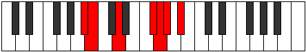

# Mode AFlatPhrycrimic

## Links

- [Documentation](index.md)
- [Scales Index](Scales.md)
- [Modes Index](Modes.md)
- [Chords Index](Chords.md)

## Scale

[Aerothimic](ScaleAerothimic.md)

## Mode

[AFlatPhrycrimic](ModeAFlatPhrycrimic.md)

## Tonic

Ab

## Signature

[CNaturalMajor]

## Perfection

 - 2 Perfect Notes

 - 4 Imperfect Notes

## Notes

- Ab (Imperfect)
- Bb (Imperfect)
- Cb
- D (Imperfect)
- E## (Imperfect)
- F##
- Ab (Imperfect)

## Illustration

## Relative Modes

| Number | Mode | Tonic | Notes | Illustration |
|--------|------|-------|-------|--------------|
| [3149](https://ianring.com/musictheory/scales/3149) | [Phrycrimic](ModePhrycrimic.md) | Ab | Ab, Bb, Cb, D, E##, F##, Ab |  |
| [1811](https://ianring.com/musictheory/scales/1811) | [Kyptimic](ModeKyptimic.md) | Bb | Bb, Cb, D, E##, F##, G#, Bb |  |
| [881](https://ianring.com/musictheory/scales/881) | [Aerothimic](ModeAerothimic.md) | D | D, E##, F##, G#, A#, B, D |  |

## Chords

### Ab

| Number | Root | Name | Notes | Illustration | Audio |
|--------|------|------|-------|--------------|-------|

### Bb

| Number | Root | Name | Notes | Illustration | Audio |
|--------|------|------|-------|--------------|-------|

### Cb

| Number | Root | Name | Notes | Illustration | Audio |
|--------|------|------|-------|--------------|-------|

### D

| Number | Root | Name | Notes | Illustration | Audio |
|--------|------|------|-------|--------------|-------|

### E##

| Number | Root | Name | Notes | Illustration | Audio |
|--------|------|------|-------|--------------|-------|

### F##

| Number | Root | Name | Notes | Illustration | Audio |
|--------|------|------|-------|--------------|-------|

