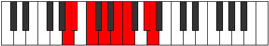

# Mode AFlatPorian

## Links

- [Documentation](index.md)
- [Scales Index](Scales.md)
- [Modes Index](Modes.md)
- [Chords Index](Chords.md)

## Scale

[Dolian](ScaleDolian.md)

## Mode

[AFlatPorian](ModeAFlatPorian.md)

## Tonic

Ab

## Signature

[CNaturalMajor]

## Perfection

 - 4 Perfect Notes

 - 3 Imperfect Notes

## Notes

- Ab (Imperfect)
- Bbb
- Cbb
- Dbb (Imperfect)
- Ebb
- Fb (Imperfect)
- Gbb
- Ab (Imperfect)

## Illustration

## Relative Modes

| Number | Mode | Tonic | Notes | Illustration |
|--------|------|-------|-------|--------------|
| [855](https://ianring.com/musictheory/scales/855) | [Porian](ModePorian.md) | G# | G#, A, Bb, C, D, E, F, G# |  |
| [855](https://ianring.com/musictheory/scales/855) | [Porian](ModePorian.md) | Ab | Ab, Bbb, Cbb, Dbb, Ebb, Fb, Gbb, Ab |  |
| [1395](https://ianring.com/musictheory/scales/1395) | [Mixonorian](ModeMixonorian.md) | E | E, F, G#, A, Bb, C, D, E |  |
| [1485](https://ianring.com/musictheory/scales/1485) | [Tyrian](ModeTyrian.md) | D | D, E, F, G#, A, Bb, C, D |  |
| [1845](https://ianring.com/musictheory/scales/1845) | [Lagian](ModeLagian.md) | C | C, D, E, F, G#, A, Bb, C |  |
| [2475](https://ianring.com/musictheory/scales/2475) | [Aerylian](ModeAerylian.md) | A | A, Bb, C, D, E, F, G#, A |  |
| [2745](https://ianring.com/musictheory/scales/2745) | [Dolian](ModeDolian.md) | F | F, G#, A, Bb, C, D, E, F |  |
| [3285](https://ianring.com/musictheory/scales/3285) | [Zagian](ModeZagian.md) | A# | A#, B#, C##, D##, E#, F###, G##, A# |  |
| [3285](https://ianring.com/musictheory/scales/3285) | [Zagian](ModeZagian.md) | Bb | Bb, C, D, E, F, G#, A, Bb |  |

## Chords

### Ab

| Number | Root | Name | Notes | Illustration | Audio |
|--------|------|------|-------|--------------|-------|

### Bbb

| Number | Root | Name | Notes | Illustration | Audio |
|--------|------|------|-------|--------------|-------|

### Cbb

| Number | Root | Name | Notes | Illustration | Audio |
|--------|------|------|-------|--------------|-------|

### Dbb

| Number | Root | Name | Notes | Illustration | Audio |
|--------|------|------|-------|--------------|-------|

### Ebb

| Number | Root | Name | Notes | Illustration | Audio |
|--------|------|------|-------|--------------|-------|

### Fb

| Number | Root | Name | Notes | Illustration | Audio |
|--------|------|------|-------|--------------|-------|

### Gbb

| Number | Root | Name | Notes | Illustration | Audio |
|--------|------|------|-------|--------------|-------|

