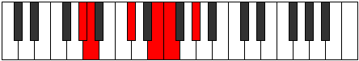
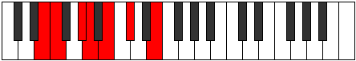
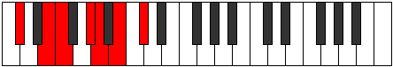
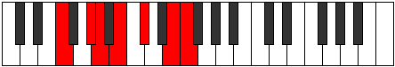

# Mode AFlatRadimic

## Links

- [Documentation](index.md)
- [Scales Index](Scales.md)
- [Modes Index](Modes.md)
- [Chords Index](Chords.md)

## Scale

[Dynimic](ScaleDynimic.md)

## Mode

[AFlatRadimic](ModeAFlatRadimic.md)

## Tonic

Ab

## Signature

[CNaturalMajor]

## Perfection

 - 3 Perfect Notes

 - 3 Imperfect Notes

## Notes

- Ab (Imperfect)
- Bbb
- Cb (Imperfect)
- Db
- E
- F (Imperfect)
- Ab (Imperfect)

## Illustration

## Relative Modes

| Number | Mode | Tonic | Notes | Illustration |
|--------|------|-------|-------|--------------|
| [691](https://ianring.com/musictheory/scales/691) | [Zydimic](ModeZydimic.md) | E | E, F, G#, A, B, C#, E |  |
| [811](https://ianring.com/musictheory/scales/811) | [Radimic](ModeRadimic.md) | G# | G#, A, B, C#, D##, E#, G# |  |
| [811](https://ianring.com/musictheory/scales/811) | [Radimic](ModeRadimic.md) | Ab | Ab, Bbb, Cb, Db, E, F, Ab |  |
| [1433](https://ianring.com/musictheory/scales/1433) | [Dynimic](ModeDynimic.md) | C# | C#, D##, E#, F###, G##, A##, C# |  |
| [1433](https://ianring.com/musictheory/scales/1433) | [Dynimic](ModeDynimic.md) | Db | Db, E, F, G#, A, B, Db |  |
| [1637](https://ianring.com/musictheory/scales/1637) | [Syptimic](ModeSyptimic.md) | B | B, C#, D##, E#, F###, G##, B |  |
| [2393](https://ianring.com/musictheory/scales/2393) | [Zathimic](ModeZathimic.md) | F | F, G#, A, B, C#, D##, F |  |
| [2453](https://ianring.com/musictheory/scales/2453) | [Stonimic](ModeStonimic.md) | A | A, B, C#, D##, E#, F###, A |  |

## Chords

### Ab

| Number | Root | Name | Notes | Illustration | Audio |
|--------|------|------|-------|--------------|-------|

### Bbb

| Number | Root | Name | Notes | Illustration | Audio |
|--------|------|------|-------|--------------|-------|

### Cb

| Number | Root | Name | Notes | Illustration | Audio |
|--------|------|------|-------|--------------|-------|

### Db

| Number | Root | Name | Notes | Illustration | Audio |
|--------|------|------|-------|--------------|-------|

### E

| Number | Root | Name | Notes | Illustration | Audio |
|--------|------|------|-------|--------------|-------|

### F

| Number | Root | Name | Notes | Illustration | Audio |
|--------|------|------|-------|--------------|-------|

