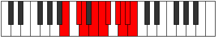

# Mode AFlatRocrygic

## Links

- [Documentation](index.md)
- [Scales Index](Scales.md)
- [Modes Index](Modes.md)
- [Chords Index](Chords.md)

## Scale

[Epyrygic](ScaleEpyrygic.md)

## Mode

[AFlatRocrygic](ModeAFlatRocrygic.md)

## Tonic

Ab

## Signature

[CNaturalMajor]

## Perfection

 - 7 Perfect Notes

 - 2 Imperfect Notes

## Notes

- Ab (Imperfect)
- A
- Bb
- B
- Db
- D
- E
- F (Imperfect)
- Gb
- Ab (Imperfect)

## Illustration

## Relative Modes

| Number | Mode | Tonic | Notes | Illustration |
|--------|------|-------|-------|--------------|
| [1783](https://ianring.com/musictheory/scales/1783) | [Danygic](ModeDanygic.md) | E | E, F, F#, G#, A, A#, B, C#, D, E |  |
| [1903](https://ianring.com/musictheory/scales/1903) | [Rocrygic](ModeRocrygic.md) | G# | G#, A, A#, B, C#, D, E, F, F#, G# |  |
| [1903](https://ianring.com/musictheory/scales/1903) | [Rocrygic](ModeRocrygic.md) | Ab | Ab, A, Bb, B, Db, D, E, F, Gb, Ab |  |
| [1979](https://ianring.com/musictheory/scales/1979) | [Aeradygic](ModeAeradygic.md) | C# | C#, D, E, F, F#, G#, A, A#, B, C# |  |
| [1979](https://ianring.com/musictheory/scales/1979) | [Aeradygic](ModeAeradygic.md) | Db | Db, D, E, F, Gb, Ab, A, Bb, B, Db |  |
| [2939](https://ianring.com/musictheory/scales/2939) | [Goptygic](ModeGoptygic.md) | F | F, F#, G#, A, A#, B, C#, D, E, F |  |
| [2999](https://ianring.com/musictheory/scales/2999) | [Zyrygic](ModeZyrygic.md) | A | A, A#, B, C#, D, E, F, F#, G#, A |  |
| [3037](https://ianring.com/musictheory/scales/3037) | [Staptygic](ModeStaptygic.md) | D | D, E, F, F#, G#, A, A#, B, C#, D |  |
| [3517](https://ianring.com/musictheory/scales/3517) | [Epocrygic](ModeEpocrygic.md) | F# | F#, G#, A, A#, B, C#, D, E, F, F# |  |
| [3517](https://ianring.com/musictheory/scales/3517) | [Epocrygic](ModeEpocrygic.md) | Gb | Gb, Ab, A, Bb, B, Db, D, E, F, Gb |  |
| [3547](https://ianring.com/musictheory/scales/3547) | [Sadygic](ModeSadygic.md) | A# | A#, B, C#, D, E, F, F#, G#, A, A# |  |
| [3547](https://ianring.com/musictheory/scales/3547) | [Sadygic](ModeSadygic.md) | Bb | Bb, B, Db, D, E, F, Gb, Ab, A, Bb |  |
| [3821](https://ianring.com/musictheory/scales/3821) | [Epyrygic](ModeEpyrygic.md) | B | B, C#, D, E, F, F#, G#, A, A#, B |  |

## Chords

### Ab

| Number | Root | Name | Notes | Illustration | Audio |
|--------|------|------|-------|--------------|-------|

### A

| Number | Root | Name | Notes | Illustration | Audio |
|--------|------|------|-------|--------------|-------|
| 2564 | A | [Asus2bb5](ChordANaturalSuspendedSecondDoubleFlatFifth.md) | A, B, D |  | [midi](ChordANaturalSuspendedSecondDoubleFlatFifthRootPosition.mid) [ogg](ChordANaturalSuspendedSecondDoubleFlatFifthRootPosition.ogg) |
| 528 | A | [A5](ChordANaturalPowerChord.md) | A, E |  | [midi](ChordANaturalPowerChordRootPosition.mid) [ogg](ChordANaturalPowerChordRootPosition.ogg) |
| 1552 | A | [Aphryg](ChordANaturalPhrygian.md) | A, Bb, E |  | [midi](ChordANaturalPhrygianRootPosition.mid) [ogg](ChordANaturalPhrygianRootPosition.ogg) |
| 2576 | A | [Asus2](ChordANaturalSuspendedSecond.md) | A, B, E |  | [midi](ChordANaturalSuspendedSecondRootPosition.mid) [ogg](ChordANaturalSuspendedSecondRootPosition.ogg) |
| 530 | A | [AM](ChordANaturalMajor.md) | A, C#, E |  | [midi](ChordANaturalMajorRootPosition.mid) [ogg](ChordANaturalMajorRootPosition.ogg) |
| 2578 | A | [AM(add9)](ChordANaturalMajorAddNinth.md) | A, C#, E, B |  | [midi](ChordANaturalMajorAddNinthRootPosition.mid) [ogg](ChordANaturalMajorAddNinthRootPosition.ogg) |
| 532 | A | [Asus4](ChordANaturalSuspendedFourth.md) | A, D, E |  | [midi](ChordANaturalSuspendedFourthRootPosition.mid) [ogg](ChordANaturalSuspendedFourthRootPosition.ogg) |
| 534 | A | [AM(add11)](ChordANaturalMajorAddEleventh.md) | A, C#, E, D |  | [midi](ChordANaturalMajorAddEleventhRootPosition.mid) [ogg](ChordANaturalMajorAddEleventhRootPosition.ogg) |
| 534 | A | [AM(add4)](ChordANaturalMajorAddFourth.md) | A, C#, D, E |  | [midi](ChordANaturalMajorAddFourthRootPosition.mid) [ogg](ChordANaturalMajorAddFourthRootPosition.ogg) |
| 2592 | A | [Asus2#5](ChordANaturalSuspendedSecondSharpFifth.md) | A, B, E# |  | [midi](ChordANaturalSuspendedSecondSharpFifthRootPosition.mid) [ogg](ChordANaturalSuspendedSecondSharpFifthRootPosition.ogg) |
| 546 | A | [A+](ChordANaturalAugmented.md) | A, C#, E# |  | [midi](ChordANaturalAugmentedRootPosition.mid) [ogg](ChordANaturalAugmentedRootPosition.ogg) |
| 546 | A | [A+7](ChordANaturalAugmentedAugmentedSeventh.md) | A, C#, E#, G## |  | [midi](ChordANaturalAugmentedAugmentedSeventhRootPosition.mid) [ogg](ChordANaturalAugmentedAugmentedSeventhRootPosition.ogg) |
| 548 | A | [Asus4#5](ChordANaturalSuspendedFourthSharpFifth.md) | A, D, E# |  | [midi](ChordANaturalSuspendedFourthSharpFifthRootPosition.mid) [ogg](ChordANaturalSuspendedFourthSharpFifthRootPosition.ogg) |
| 578 | A | [AM##5](ChordANaturalMajorDoubleSharpFifth.md) | A, C#, F# |  | [midi](ChordANaturalMajorDoubleSharpFifthRootPosition.mid) [ogg](ChordANaturalMajorDoubleSharpFifthRootPosition.ogg) |
| 580 | A | [Asus4##5](ChordANaturalSuspendedFourthDoubleSharpFifth.md) | A, D, F# |  | [midi](ChordANaturalSuspendedFourthDoubleSharpFifthRootPosition.mid) [ogg](ChordANaturalSuspendedFourthDoubleSharpFifthRootPosition.ogg) |
| 2628 | A | [AM6sus2bb5](ChordANaturalMajorSixthSuspendedSecondDoubleFlatFifth.md) | A, B, D, F# |  | [midi](ChordANaturalMajorSixthSuspendedSecondDoubleFlatFifthRootPosition.mid) [ogg](ChordANaturalMajorSixthSuspendedSecondDoubleFlatFifthRootPosition.ogg) |
| 2640 | A | [AM6sus2](ChordANaturalMajorSixthSuspendedSecond.md) | A, B, E, F# |  | [midi](ChordANaturalMajorSixthSuspendedSecondRootPosition.mid) [ogg](ChordANaturalMajorSixthSuspendedSecondRootPosition.ogg) |
| 2640 | A | [A7sus2b5](ChordANaturalDominantSeventhSuspendedSecondFlatFifth.md) | A, B, E, Gb |  | [midi](ChordANaturalDominantSeventhSuspendedSecondFlatFifthRootPosition.mid) [ogg](ChordANaturalDominantSeventhSuspendedSecondFlatFifthRootPosition.ogg) |
| 594 | A | [AM6](ChordANaturalMajorSixth.md) | A, C#, E, F# |  | [midi](ChordANaturalMajorSixthRootPosition.mid) [ogg](ChordANaturalMajorSixthRootPosition.ogg) |
| 1618 | A | [AM6(addb9)](ChordANaturalMajorSixthAddFlatNinth.md) | A, C#, E, F#, Bb |  | [midi](ChordANaturalMajorSixthAddFlatNinthRootPosition.mid) [ogg](ChordANaturalMajorSixthAddFlatNinthRootPosition.ogg) |
| 2642 | A | [AM6(add9)](ChordANaturalMajorSixthAddNinth.md) | A, C#, E, F#, B |  | [midi](ChordANaturalMajorSixthAddNinthRootPosition.mid) [ogg](ChordANaturalMajorSixthAddNinthRootPosition.ogg) |
| 596 | A | [AM6sus4](ChordANaturalMajorSixthSuspendedFourth.md) | A, D, E, F# |  | [midi](ChordANaturalMajorSixthSuspendedFourthRootPosition.mid) [ogg](ChordANaturalMajorSixthSuspendedFourthRootPosition.ogg) |
| 772 | A | [AQ+](ChordANaturalQuartalAugmented.md) | A, D, G# |  | [midi](ChordANaturalQuartalAugmentedRootPosition.mid) [ogg](ChordANaturalQuartalAugmentedRootPosition.ogg) |
| 1808 | A | [Aphryg+7](ChordANaturalPhrygianAddSeventh.md) | A, Bb, E, G# |  | [midi](ChordANaturalPhrygianAddSeventhRootPosition.mid) [ogg](ChordANaturalPhrygianAddSeventhRootPosition.ogg) |
| 2832 | A | [AM7(sus2)](ChordANaturalMajorSeventhSuspendedSecond.md) | A, B, E, G# |  | [midi](ChordANaturalMajorSeventhSuspendedSecondRootPosition.mid) [ogg](ChordANaturalMajorSeventhSuspendedSecondRootPosition.ogg) |
| 2832 | A | [AM9sus2](ChordANaturalMajorNinthSuspendedSecond.md) | A, B, E, G#, B |  | [midi](ChordANaturalMajorNinthSuspendedSecondRootPosition.mid) [ogg](ChordANaturalMajorNinthSuspendedSecondRootPosition.ogg) |
| 786 | A | [AM7](ChordANaturalMajorSeventh.md) | A, C#, E, G# |  | [midi](ChordANaturalMajorSeventhRootPosition.mid) [ogg](ChordANaturalMajorSeventhRootPosition.ogg) |
| 2834 | A | [AM9](ChordANaturalMajorNinth.md) | A, C#, E, G#, B |  | [midi](ChordANaturalMajorNinthRootPosition.mid) [ogg](ChordANaturalMajorNinthRootPosition.ogg) |
| 788 | A | [AM7(sus4)](ChordANaturalMajorSeventhSuspendedFourth.md) | A, D, E, G# |  | [midi](ChordANaturalMajorSeventhSuspendedFourthRootPosition.mid) [ogg](ChordANaturalMajorSeventhSuspendedFourthRootPosition.ogg) |
| 2836 | A | [AM9sus4](ChordANaturalMajorNinthSuspendedFourth.md) | A, D, E, G#, B |  | [midi](ChordANaturalMajorNinthSuspendedFourthRootPosition.mid) [ogg](ChordANaturalMajorNinthSuspendedFourthRootPosition.ogg) |
| 790 | A | [AM7add4](ChordANaturalMajorSeventhAddFourth.md) | A, C#, D, E, G# |  | [midi](ChordANaturalMajorSeventhAddFourthRootPosition.mid) [ogg](ChordANaturalMajorSeventhAddFourthRootPosition.ogg) |
| 790 | A | [AM7add11](ChordANaturalMajorSeventhAddEleventh.md) | A, C#, E, G#, D |  | [midi](ChordANaturalMajorSeventhAddEleventhRootPosition.mid) [ogg](ChordANaturalMajorSeventhAddEleventhRootPosition.ogg) |
| 2838 | A | [AM11](ChordANaturalMajorEleventh.md) | A, C#, E, G#, B, D |  | [midi](ChordANaturalMajorEleventhRootPosition.mid) [ogg](ChordANaturalMajorEleventhRootPosition.ogg) |
| 802 | A | [A+(M7)](ChordANaturalAugmentedMajorSeventh.md) | A, C#, E#, G# |  | [midi](ChordANaturalAugmentedMajorSeventhRootPosition.mid) [ogg](ChordANaturalAugmentedMajorSeventhRootPosition.ogg) |
| 804 | A | [AM7(sus4)#5](ChordANaturalMajorSeventhSuspendedFourthSharpFifth.md) | A, D, E#, G# |  | [midi](ChordANaturalMajorSeventhSuspendedFourthSharpFifthRootPosition.mid) [ogg](ChordANaturalMajorSeventhSuspendedFourthSharpFifthRootPosition.ogg) |
| 834 | A | [AM7##5](ChordANaturalMajorSeventhDoubleSharpFifth.md) | A, C#, F#, G# |  | [midi](ChordANaturalMajorSeventhDoubleSharpFifthRootPosition.mid) [ogg](ChordANaturalMajorSeventhDoubleSharpFifthRootPosition.ogg) |
| 836 | A | [AM7(sus4)##5](ChordANaturalMajorSeventhSuspendedFourthDoubleSharpFifth.md) | A, D, F#, G# |  | [midi](ChordANaturalMajorSeventhSuspendedFourthDoubleSharpFifthRootPosition.mid) [ogg](ChordANaturalMajorSeventhSuspendedFourthDoubleSharpFifthRootPosition.ogg) |
| 850 | A | [AM7add13](ChordANaturalMajorSeventhAddThirteenth.md) | A, C#, E, G#, F# |  | [midi](ChordANaturalMajorSeventhAddThirteenthRootPosition.mid) [ogg](ChordANaturalMajorSeventhAddThirteenthRootPosition.ogg) |
| 2902 | A | [AM13](ChordANaturalMajorThirteenth.md) | A, C#, E, G#, B, D, F# |  | [midi](ChordANaturalMajorThirteenthRootPosition.mid) [ogg](ChordANaturalMajorThirteenthRootPosition.ogg) |

### Bb

| Number | Root | Name | Notes | Illustration | Audio |
|--------|------|------|-------|--------------|-------|

### B

| Number | Root | Name | Notes | Illustration | Audio |
|--------|------|------|-------|--------------|-------|
| 2066 | B | [Bsus2bb5](ChordBNaturalSuspendedSecondDoubleFlatFifth.md) | B, C#, E |  | [midi](ChordBNaturalSuspendedSecondDoubleFlatFifthRootPosition.mid) [ogg](ChordBNaturalSuspendedSecondDoubleFlatFifthRootPosition.ogg) |
| 2068 | B | [Bmbb5](ChordBNaturalMinorDoubleFlatFifth.md) | B, D, E |  | [midi](ChordBNaturalMinorDoubleFlatFifthRootPosition.mid) [ogg](ChordBNaturalMinorDoubleFlatFifthRootPosition.ogg) |
| 2082 | B | [Bsus2b5](ChordBNaturalSuspendedSecondFlatFifth.md) | B, C#, F |  | [midi](ChordBNaturalSuspendedSecondFlatFifthRootPosition.mid) [ogg](ChordBNaturalSuspendedSecondFlatFifthRootPosition.ogg) |
| 2084 | B | [Bo](ChordBNaturalDiminished.md) | B, D, F |  | [midi](ChordBNaturalDiminishedRootPosition.mid) [ogg](ChordBNaturalDiminishedRootPosition.ogg) |
| 2096 | B | [Bsus4b5](ChordBNaturalSuspendedFourthFlatFifth.md) | B, E, F |  | [midi](ChordBNaturalSuspendedFourthFlatFifthRootPosition.mid) [ogg](ChordBNaturalSuspendedFourthFlatFifthRootPosition.ogg) |
| 2112 | B | [B5](ChordBNaturalPowerChord.md) | B, F# |  | [midi](ChordBNaturalPowerChordRootPosition.mid) [ogg](ChordBNaturalPowerChordRootPosition.ogg) |
| 2114 | B | [Bsus2](ChordBNaturalSuspendedSecond.md) | B, C#, F# |  | [midi](ChordBNaturalSuspendedSecondRootPosition.mid) [ogg](ChordBNaturalSuspendedSecondRootPosition.ogg) |
| 2116 | B | [Bm](ChordBNaturalMinor.md) | B, D, F# |  | [midi](ChordBNaturalMinorRootPosition.mid) [ogg](ChordBNaturalMinorRootPosition.ogg) |
| 2116 | B | [Bm(add(#9))](ChordBNaturalMinorAddSharpNinth.md) | B, D, F#, C## |  | [midi](ChordBNaturalMinorAddSharpNinthRootPosition.mid) [ogg](ChordBNaturalMinorAddSharpNinthRootPosition.ogg) |
| 2118 | B | [Bm(add9)](ChordBNaturalMinorAddNinth.md) | B, D, F#, C# |  | [midi](ChordBNaturalMinorAddNinthRootPosition.mid) [ogg](ChordBNaturalMinorAddNinthRootPosition.ogg) |
| 2128 | B | [Bsus4](ChordBNaturalSuspendedFourth.md) | B, E, F# |  | [midi](ChordBNaturalSuspendedFourthRootPosition.mid) [ogg](ChordBNaturalSuspendedFourthRootPosition.ogg) |
| 2132 | B | [Bm(add11)](ChordBNaturalMinorAddEleventh.md) | B, D, F#, E |  | [midi](ChordBNaturalMinorAddEleventhRootPosition.mid) [ogg](ChordBNaturalMinorAddEleventhRootPosition.ogg) |
| 2132 | B | [Bm(add4)](ChordBNaturalMinorAddFourth.md) | B, D, E, F# |  | [midi](ChordBNaturalMinorAddFourthRootPosition.mid) [ogg](ChordBNaturalMinorAddFourthRootPosition.ogg) |
| 2144 | B | [Blyd](ChordBNaturalLydian.md) | B, E#, F# |  | [midi](ChordBNaturalLydianRootPosition.mid) [ogg](ChordBNaturalLydianRootPosition.ogg) |
| 2148 | B | [Bm(add(#4))](ChordBNaturalMinorAddSharpFourth.md) | B, D, E#, F# |  | [midi](ChordBNaturalMinorAddSharpFourthRootPosition.mid) [ogg](ChordBNaturalMinorAddSharpFourthRootPosition.ogg) |
| 2320 | B | [Bsus4##5](ChordBNaturalSuspendedFourthDoubleSharpFifth.md) | B, E, G# |  | [midi](ChordBNaturalSuspendedFourthDoubleSharpFifthRootPosition.mid) [ogg](ChordBNaturalSuspendedFourthDoubleSharpFifthRootPosition.ogg) |
| 2322 | B | [BM6sus2bb5](ChordBNaturalMajorSixthSuspendedSecondDoubleFlatFifth.md) | B, C#, E, G# |  | [midi](ChordBNaturalMajorSixthSuspendedSecondDoubleFlatFifthRootPosition.mid) [ogg](ChordBNaturalMajorSixthSuspendedSecondDoubleFlatFifthRootPosition.ogg) |
| 2338 | B | [BM6sus2b5](ChordBNaturalMajorSixthSuspendedSecondFlatFifth.md) | B, C#, F, G# |  | [midi](ChordBNaturalMajorSixthSuspendedSecondFlatFifthRootPosition.mid) [ogg](ChordBNaturalMajorSixthSuspendedSecondFlatFifthRootPosition.ogg) |
| 2340 | B | [Bo7](ChordBNaturalFullDiminishedSeventh.md) | B, D, F, Ab |  | [midi](ChordBNaturalFullDiminishedSeventhRootPosition.mid) [ogg](ChordBNaturalFullDiminishedSeventhRootPosition.ogg) |
| 2370 | B | [BM6sus2](ChordBNaturalMajorSixthSuspendedSecond.md) | B, C#, F#, G# |  | [midi](ChordBNaturalMajorSixthSuspendedSecondRootPosition.mid) [ogg](ChordBNaturalMajorSixthSuspendedSecondRootPosition.ogg) |
| 2370 | B | [B7sus2b5](ChordBNaturalDominantSeventhSuspendedSecondFlatFifth.md) | B, C#, F#, Ab |  | [midi](ChordBNaturalDominantSeventhSuspendedSecondFlatFifthRootPosition.mid) [ogg](ChordBNaturalDominantSeventhSuspendedSecondFlatFifthRootPosition.ogg) |
| 2372 | B | [Bm6](ChordBNaturalMinorSixth.md) | B, D, F#, G# |  | [midi](ChordBNaturalMinorSixthRootPosition.mid) [ogg](ChordBNaturalMinorSixthRootPosition.ogg) |
| 2374 | B | [Bm6(add9)](ChordBNaturalMinorSixthAddNinth.md) | B, D, F#, G#, C# |  | [midi](ChordBNaturalMinorSixthAddNinthRootPosition.mid) [ogg](ChordBNaturalMinorSixthAddNinthRootPosition.ogg) |
| 2384 | B | [BM6sus4](ChordBNaturalMajorSixthSuspendedFourth.md) | B, E, F#, G# |  | [midi](ChordBNaturalMajorSixthSuspendedFourthRootPosition.mid) [ogg](ChordBNaturalMajorSixthSuspendedFourthRootPosition.ogg) |
| 2576 | B | [BQ](ChordBNaturalQuartal.md) | B, E, A |  | [midi](ChordBNaturalQuartalRootPosition.mid) [ogg](ChordBNaturalQuartalRootPosition.ogg) |
| 2580 | B | [Bm7bb5](ChordBNaturalMinorSeventhDoubleFlatFifth.md) | B, D, E, A |  | [midi](ChordBNaturalMinorSeventhDoubleFlatFifthRootPosition.mid) [ogg](ChordBNaturalMinorSeventhDoubleFlatFifthRootPosition.ogg) |
| 2596 | B | [Bø7](ChordBNaturalHalfDiminishedSeventh.md) | B, D, F, A |  | [midi](ChordBNaturalHalfDiminishedSeventhRootPosition.mid) [ogg](ChordBNaturalHalfDiminishedSeventhRootPosition.ogg) |
| 2626 | B | [B7sus2](ChordBNaturalDominantSeventhSuspendedSecond.md) | B, C#, F#, A |  | [midi](ChordBNaturalDominantSeventhSuspendedSecondRootPosition.mid) [ogg](ChordBNaturalDominantSeventhSuspendedSecondRootPosition.ogg) |
| 2626 | B | [B9sus2](ChordBNaturalDominantNinthSuspendedSecond.md) | B, C#, F#, A, C# |  | [midi](ChordBNaturalDominantNinthSuspendedSecondRootPosition.mid) [ogg](ChordBNaturalDominantNinthSuspendedSecondRootPosition.ogg) |
| 2628 | B | [Bm7](ChordBNaturalMinorSeventh.md) | B, D, F#, A |  | [midi](ChordBNaturalMinorSeventhRootPosition.mid) [ogg](ChordBNaturalMinorSeventhRootPosition.ogg) |
| 2630 | B | [Bm9](ChordBNaturalMinorNinth.md) | B, D, F#, A, C# |  | [midi](ChordBNaturalMinorNinthRootPosition.mid) [ogg](ChordBNaturalMinorNinthRootPosition.ogg) |
| 2640 | B | [B7sus4](ChordBNaturalDominantSeventhSuspendedFourth.md) | B, E, F#, A |  | [midi](ChordBNaturalDominantSeventhSuspendedFourthRootPosition.mid) [ogg](ChordBNaturalDominantSeventhSuspendedFourthRootPosition.ogg) |
| 2642 | B | [B9sus4](ChordBNaturalDominantNinthSuspendedFourth.md) | B, E, F#, A, C# |  | [midi](ChordBNaturalDominantNinthSuspendedFourthRootPosition.mid) [ogg](ChordBNaturalDominantNinthSuspendedFourthRootPosition.ogg) |
| 2644 | B | [Bm7add11](ChordBNaturalMinorSeventhAddEleventh.md) | B, D, F#, A, E |  | [midi](ChordBNaturalMinorSeventhAddEleventhRootPosition.mid) [ogg](ChordBNaturalMinorSeventhAddEleventhRootPosition.ogg) |
| 2646 | B | [Bm11](ChordBNaturalMinorEleventh.md) | B, D, F#, A, C#, E |  | [midi](ChordBNaturalMinorEleventhRootPosition.mid) [ogg](ChordBNaturalMinorEleventhRootPosition.ogg) |
| 2660 | B | [Bm7add(#11)](ChordBNaturalMinorSeventhAddSharpEleventh.md) | B, D, F#, A, E# |  | [midi](ChordBNaturalMinorSeventhAddSharpEleventhRootPosition.mid) [ogg](ChordBNaturalMinorSeventhAddSharpEleventhRootPosition.ogg) |
| 2884 | B | [Bm7add13](ChordBNaturalMinorSeventhAddThirteenth.md) | B, D, F#, A, G# |  | [midi](ChordBNaturalMinorSeventhAddThirteenthRootPosition.mid) [ogg](ChordBNaturalMinorSeventhAddThirteenthRootPosition.ogg) |
| 2902 | B | [Bm13](ChordBNaturalMinorThirteenth.md) | B, D, F#, A, C#, E, G# |  | [midi](ChordBNaturalMinorThirteenthRootPosition.mid) [ogg](ChordBNaturalMinorThirteenthRootPosition.ogg) |
| 3088 | B | [BQ+](ChordBNaturalQuartalAugmented.md) | B, E, A# |  | [midi](ChordBNaturalQuartalAugmentedRootPosition.mid) [ogg](ChordBNaturalQuartalAugmentedRootPosition.ogg) |
| 3108 | B | [BoM7](ChordBNaturalDiminishedMajorSeventh.md) | B, D, F, A# |  | [midi](ChordBNaturalDiminishedMajorSeventhRootPosition.mid) [ogg](ChordBNaturalDiminishedMajorSeventhRootPosition.ogg) |
| 3138 | B | [BM7(sus2)](ChordBNaturalMajorSeventhSuspendedSecond.md) | B, C#, F#, A# |  | [midi](ChordBNaturalMajorSeventhSuspendedSecondRootPosition.mid) [ogg](ChordBNaturalMajorSeventhSuspendedSecondRootPosition.ogg) |
| 3138 | B | [BM9sus2](ChordBNaturalMajorNinthSuspendedSecond.md) | B, C#, F#, A#, C# |  | [midi](ChordBNaturalMajorNinthSuspendedSecondRootPosition.mid) [ogg](ChordBNaturalMajorNinthSuspendedSecondRootPosition.ogg) |
| 3140 | B | [Bm(M7)](ChordBNaturalMinorMajorSeventh.md) | B, D, F#, A# |  | [midi](ChordBNaturalMinorMajorSeventhRootPosition.mid) [ogg](ChordBNaturalMinorMajorSeventhRootPosition.ogg) |
| 3142 | B | [Bm(M9)](ChordBNaturalMinorMajorNinth.md) | B, D, F#, A#, C# |  | [midi](ChordBNaturalMinorMajorNinthRootPosition.mid) [ogg](ChordBNaturalMinorMajorNinthRootPosition.ogg) |
| 3152 | B | [BM7(sus4)](ChordBNaturalMajorSeventhSuspendedFourth.md) | B, E, F#, A# |  | [midi](ChordBNaturalMajorSeventhSuspendedFourthRootPosition.mid) [ogg](ChordBNaturalMajorSeventhSuspendedFourthRootPosition.ogg) |
| 3154 | B | [BM9sus4](ChordBNaturalMajorNinthSuspendedFourth.md) | B, E, F#, A#, C# |  | [midi](ChordBNaturalMajorNinthSuspendedFourthRootPosition.mid) [ogg](ChordBNaturalMajorNinthSuspendedFourthRootPosition.ogg) |
| 3156 | B | [Bm(M7)add11](ChordBNaturalMinorMajorSeventhAddEleventh.md) | B, D, F#, A#, E |  | [midi](ChordBNaturalMinorMajorSeventhAddEleventhRootPosition.mid) [ogg](ChordBNaturalMinorMajorSeventhAddEleventhRootPosition.ogg) |
| 3158 | B | [Bm(M11)](ChordBNaturalMinorMajorEleventh.md) | B, D, F#, A#, C#, E |  | [midi](ChordBNaturalMinorMajorEleventhRootPosition.mid) [ogg](ChordBNaturalMinorMajorEleventhRootPosition.ogg) |
| 3168 | B | [Blyd(M7)](ChordBNaturalLydianMajorSeventh.md) | B, E#, F#, A# |  | [midi](ChordBNaturalLydianMajorSeventhRootPosition.mid) [ogg](ChordBNaturalLydianMajorSeventhRootPosition.ogg) |
| 3344 | B | [BM7(sus4)##5](ChordBNaturalMajorSeventhSuspendedFourthDoubleSharpFifth.md) | B, E, G#, A# |  | [midi](ChordBNaturalMajorSeventhSuspendedFourthDoubleSharpFifthRootPosition.mid) [ogg](ChordBNaturalMajorSeventhSuspendedFourthDoubleSharpFifthRootPosition.ogg) |
| 3396 | B | [Bm(M7)add13](ChordBNaturalMinorMajorSeventhAddThirteenth.md) | B, D, F#, A#, G# |  | [midi](ChordBNaturalMinorMajorSeventhAddThirteenthRootPosition.mid) [ogg](ChordBNaturalMinorMajorSeventhAddThirteenthRootPosition.ogg) |
| 3414 | B | [Bm(M13)](ChordBNaturalMinorMajorThirteenth.md) | B, D, F#, A#, C#, E, G# |  | [midi](ChordBNaturalMinorMajorThirteenthRootPosition.mid) [ogg](ChordBNaturalMinorMajorThirteenthRootPosition.ogg) |

### Db

| Number | Root | Name | Notes | Illustration | Audio |
|--------|------|------|-------|--------------|-------|

### D

| Number | Root | Name | Notes | Illustration | Audio |
|--------|------|------|-------|--------------|-------|
| 276 | D | [Dsus2b5](ChordDNaturalSuspendedSecondFlatFifth.md) | D, E, Ab |  | [midi](ChordDNaturalSuspendedSecondFlatFifthRootPosition.mid) [ogg](ChordDNaturalSuspendedSecondFlatFifthRootPosition.ogg) |
| 292 | D | [Do](ChordDNaturalDiminished.md) | D, F, Ab |  | [midi](ChordDNaturalDiminishedRootPosition.mid) [ogg](ChordDNaturalDiminishedRootPosition.ogg) |
| 324 | D | [DMb5](ChordDNaturalMajorFlatFifth.md) | D, F#, Ab |  | [midi](ChordDNaturalMajorFlatFifthRootPosition.mid) [ogg](ChordDNaturalMajorFlatFifthRootPosition.ogg) |
| 516 | D | [D5](ChordDNaturalPowerChord.md) | D, A |  | [midi](ChordDNaturalPowerChordRootPosition.mid) [ogg](ChordDNaturalPowerChordRootPosition.ogg) |
| 532 | D | [Dsus2](ChordDNaturalSuspendedSecond.md) | D, E, A |  | [midi](ChordDNaturalSuspendedSecondRootPosition.mid) [ogg](ChordDNaturalSuspendedSecondRootPosition.ogg) |
| 548 | D | [Dm](ChordDNaturalMinor.md) | D, F, A |  | [midi](ChordDNaturalMinorRootPosition.mid) [ogg](ChordDNaturalMinorRootPosition.ogg) |
| 548 | D | [Dm(add(#9))](ChordDNaturalMinorAddSharpNinth.md) | D, F, A, E# |  | [midi](ChordDNaturalMinorAddSharpNinthRootPosition.mid) [ogg](ChordDNaturalMinorAddSharpNinthRootPosition.ogg) |
| 564 | D | [Dm(add9)](ChordDNaturalMinorAddNinth.md) | D, F, A, E |  | [midi](ChordDNaturalMinorAddNinthRootPosition.mid) [ogg](ChordDNaturalMinorAddNinthRootPosition.ogg) |
| 580 | D | [DM](ChordDNaturalMajor.md) | D, F#, A |  | [midi](ChordDNaturalMajorRootPosition.mid) [ogg](ChordDNaturalMajorRootPosition.ogg) |
| 596 | D | [DM(add9)](ChordDNaturalMajorAddNinth.md) | D, F#, A, E |  | [midi](ChordDNaturalMajorAddNinthRootPosition.mid) [ogg](ChordDNaturalMajorAddNinthRootPosition.ogg) |
| 612 | D | [DM(add(#9))](ChordDNaturalMajorAddSharpNinth.md) | D, F#, A, E# |  | [midi](ChordDNaturalMajorAddSharpNinthRootPosition.mid) [ogg](ChordDNaturalMajorAddSharpNinthRootPosition.ogg) |
| 772 | D | [Dlyd](ChordDNaturalLydian.md) | D, G#, A |  | [midi](ChordDNaturalLydianRootPosition.mid) [ogg](ChordDNaturalLydianRootPosition.ogg) |
| 804 | D | [Dm(add(#4))](ChordDNaturalMinorAddSharpFourth.md) | D, F, G#, A |  | [midi](ChordDNaturalMinorAddSharpFourthRootPosition.mid) [ogg](ChordDNaturalMinorAddSharpFourthRootPosition.ogg) |
| 836 | D | [DM(add(#4))](ChordDNaturalMajorAddSharpFourth.md) | D, F#, G#, A |  | [midi](ChordDNaturalMajorAddSharpFourthRootPosition.mid) [ogg](ChordDNaturalMajorAddSharpFourthRootPosition.ogg) |
| 1044 | D | [Dsus2#5](ChordDNaturalSuspendedSecondSharpFifth.md) | D, E, A# |  | [midi](ChordDNaturalSuspendedSecondSharpFifthRootPosition.mid) [ogg](ChordDNaturalSuspendedSecondSharpFifthRootPosition.ogg) |
| 1060 | D | [Dm#5](ChordDNaturalMinorSharpFifth.md) | D, F, Bb |  | [midi](ChordDNaturalMinorSharpFifthRootPosition.mid) [ogg](ChordDNaturalMinorSharpFifthRootPosition.ogg) |
| 1092 | D | [D+](ChordDNaturalAugmented.md) | D, F#, A# |  | [midi](ChordDNaturalAugmentedRootPosition.mid) [ogg](ChordDNaturalAugmentedRootPosition.ogg) |
| 1092 | D | [D+7](ChordDNaturalAugmentedAugmentedSeventh.md) | D, F#, A#, C## |  | [midi](ChordDNaturalAugmentedAugmentedSeventhRootPosition.mid) [ogg](ChordDNaturalAugmentedAugmentedSeventhRootPosition.ogg) |
| 1300 | D | [Dsus2b5add(#5)](ChordDNaturalSuspendedSecondFlatFifthAddSharpFifth.md) | D, E, Ab, A# |  | [midi](ChordDNaturalSuspendedSecondFlatFifthAddSharpFifthRootPosition.mid) [ogg](ChordDNaturalSuspendedSecondFlatFifthAddSharpFifthRootPosition.ogg) |
| 2116 | D | [DM##5](ChordDNaturalMajorDoubleSharpFifth.md) | D, F#, B |  | [midi](ChordDNaturalMajorDoubleSharpFifthRootPosition.mid) [ogg](ChordDNaturalMajorDoubleSharpFifthRootPosition.ogg) |
| 2324 | D | [DM6sus2b5](ChordDNaturalMajorSixthSuspendedSecondFlatFifth.md) | D, E, Ab, B |  | [midi](ChordDNaturalMajorSixthSuspendedSecondFlatFifthRootPosition.mid) [ogg](ChordDNaturalMajorSixthSuspendedSecondFlatFifthRootPosition.ogg) |
| 2340 | D | [Do7](ChordDNaturalFullDiminishedSeventh.md) | D, F, Ab, Cb |  | [midi](ChordDNaturalFullDiminishedSeventhRootPosition.mid) [ogg](ChordDNaturalFullDiminishedSeventhRootPosition.ogg) |
| 2372 | D | [DM6b5](ChordDNaturalMajorSixthFlatFifth.md) | D, F#, Ab, B |  | [midi](ChordDNaturalMajorSixthFlatFifthRootPosition.mid) [ogg](ChordDNaturalMajorSixthFlatFifthRootPosition.ogg) |
| 2580 | D | [DM6sus2](ChordDNaturalMajorSixthSuspendedSecond.md) | D, E, A, B |  | [midi](ChordDNaturalMajorSixthSuspendedSecondRootPosition.mid) [ogg](ChordDNaturalMajorSixthSuspendedSecondRootPosition.ogg) |
| 2580 | D | [D7sus2b5](ChordDNaturalDominantSeventhSuspendedSecondFlatFifth.md) | D, E, A, Cb |  | [midi](ChordDNaturalDominantSeventhSuspendedSecondFlatFifthRootPosition.mid) [ogg](ChordDNaturalDominantSeventhSuspendedSecondFlatFifthRootPosition.ogg) |
| 2596 | D | [Dm6](ChordDNaturalMinorSixth.md) | D, F, A, B |  | [midi](ChordDNaturalMinorSixthRootPosition.mid) [ogg](ChordDNaturalMinorSixthRootPosition.ogg) |
| 2612 | D | [Dm6(add9)](ChordDNaturalMinorSixthAddNinth.md) | D, F, A, B, E |  | [midi](ChordDNaturalMinorSixthAddNinthRootPosition.mid) [ogg](ChordDNaturalMinorSixthAddNinthRootPosition.ogg) |
| 2628 | D | [DM6](ChordDNaturalMajorSixth.md) | D, F#, A, B |  | [midi](ChordDNaturalMajorSixthRootPosition.mid) [ogg](ChordDNaturalMajorSixthRootPosition.ogg) |
| 2644 | D | [DM6(add9)](ChordDNaturalMajorSixthAddNinth.md) | D, F#, A, B, E |  | [midi](ChordDNaturalMajorSixthAddNinthRootPosition.mid) [ogg](ChordDNaturalMajorSixthAddNinthRootPosition.ogg) |
| 294 | D | [DoM7](ChordDNaturalDiminishedMajorSeventh.md) | D, F, Ab, C# |  | [midi](ChordDNaturalDiminishedMajorSeventhRootPosition.mid) [ogg](ChordDNaturalDiminishedMajorSeventhRootPosition.ogg) |
| 326 | D | [DM7b5](ChordDNaturalMajorSeventhFlatFifth.md) | D, F#, Ab, C# |  | [midi](ChordDNaturalMajorSeventhFlatFifthRootPosition.mid) [ogg](ChordDNaturalMajorSeventhFlatFifthRootPosition.ogg) |
| 534 | D | [DM7(sus2)](ChordDNaturalMajorSeventhSuspendedSecond.md) | D, E, A, C# |  | [midi](ChordDNaturalMajorSeventhSuspendedSecondRootPosition.mid) [ogg](ChordDNaturalMajorSeventhSuspendedSecondRootPosition.ogg) |
| 534 | D | [DM9sus2](ChordDNaturalMajorNinthSuspendedSecond.md) | D, E, A, C#, E |  | [midi](ChordDNaturalMajorNinthSuspendedSecondRootPosition.mid) [ogg](ChordDNaturalMajorNinthSuspendedSecondRootPosition.ogg) |
| 550 | D | [Dm(M7)](ChordDNaturalMinorMajorSeventh.md) | D, F, A, C# |  | [midi](ChordDNaturalMinorMajorSeventhRootPosition.mid) [ogg](ChordDNaturalMinorMajorSeventhRootPosition.ogg) |
| 566 | D | [Dm(M9)](ChordDNaturalMinorMajorNinth.md) | D, F, A, C#, E |  | [midi](ChordDNaturalMinorMajorNinthRootPosition.mid) [ogg](ChordDNaturalMinorMajorNinthRootPosition.ogg) |
| 582 | D | [DM7](ChordDNaturalMajorSeventh.md) | D, F#, A, C# |  | [midi](ChordDNaturalMajorSeventhRootPosition.mid) [ogg](ChordDNaturalMajorSeventhRootPosition.ogg) |
| 598 | D | [DM9](ChordDNaturalMajorNinth.md) | D, F#, A, C#, E |  | [midi](ChordDNaturalMajorNinthRootPosition.mid) [ogg](ChordDNaturalMajorNinthRootPosition.ogg) |
| 774 | D | [Dlyd(M7)](ChordDNaturalLydianMajorSeventh.md) | D, G#, A, C# |  | [midi](ChordDNaturalLydianMajorSeventhRootPosition.mid) [ogg](ChordDNaturalLydianMajorSeventhRootPosition.ogg) |
| 838 | D | [DM7add(#11)](ChordDNaturalMajorSeventhAddSharpEleventh.md) | D, F#, A, C#, G# |  | [midi](ChordDNaturalMajorSeventhAddSharpEleventhRootPosition.mid) [ogg](ChordDNaturalMajorSeventhAddSharpEleventhRootPosition.ogg) |
| 838 | D | [DM7add(#4)](ChordDNaturalMajorSeventhAddSharpFourth.md) | D, F#, G#, A, C# |  | [midi](ChordDNaturalMajorSeventhAddSharpFourthRootPosition.mid) [ogg](ChordDNaturalMajorSeventhAddSharpFourthRootPosition.ogg) |
| 1094 | D | [D+(M7)](ChordDNaturalAugmentedMajorSeventh.md) | D, F#, A#, C# |  | [midi](ChordDNaturalAugmentedMajorSeventhRootPosition.mid) [ogg](ChordDNaturalAugmentedMajorSeventhRootPosition.ogg) |
| 2118 | D | [DM7##5](ChordDNaturalMajorSeventhDoubleSharpFifth.md) | D, F#, B, C# |  | [midi](ChordDNaturalMajorSeventhDoubleSharpFifthRootPosition.mid) [ogg](ChordDNaturalMajorSeventhDoubleSharpFifthRootPosition.ogg) |
| 2598 | D | [Dm(M7)add13](ChordDNaturalMinorMajorSeventhAddThirteenth.md) | D, F, A, C#, B |  | [midi](ChordDNaturalMinorMajorSeventhAddThirteenthRootPosition.mid) [ogg](ChordDNaturalMinorMajorSeventhAddThirteenthRootPosition.ogg) |
| 2630 | D | [DM7add13](ChordDNaturalMajorSeventhAddThirteenth.md) | D, F#, A, C#, B |  | [midi](ChordDNaturalMajorSeventhAddThirteenthRootPosition.mid) [ogg](ChordDNaturalMajorSeventhAddThirteenthRootPosition.ogg) |

### E

| Number | Root | Name | Notes | Illustration | Audio |
|--------|------|------|-------|--------------|-------|
| 592 | E | [Esus2bb5](ChordENaturalSuspendedSecondDoubleFlatFifth.md) | E, F#, A |  | [midi](ChordENaturalSuspendedSecondDoubleFlatFifthRootPosition.mid) [ogg](ChordENaturalSuspendedSecondDoubleFlatFifthRootPosition.ogg) |
| 1072 | E | [Eloc](ChordENaturalLocrian.md) | E, F, Bb |  | [midi](ChordENaturalLocrianRootPosition.mid) [ogg](ChordENaturalLocrianRootPosition.ogg) |
| 1104 | E | [Esus2b5](ChordENaturalSuspendedSecondFlatFifth.md) | E, F#, Bb |  | [midi](ChordENaturalSuspendedSecondFlatFifthRootPosition.mid) [ogg](ChordENaturalSuspendedSecondFlatFifthRootPosition.ogg) |
| 1296 | E | [EMb5](ChordENaturalMajorFlatFifth.md) | E, G#, Bb |  | [midi](ChordENaturalMajorFlatFifthRootPosition.mid) [ogg](ChordENaturalMajorFlatFifthRootPosition.ogg) |
| 1552 | E | [Esus4b5](ChordENaturalSuspendedFourthFlatFifth.md) | E, A, Bb |  | [midi](ChordENaturalSuspendedFourthFlatFifthRootPosition.mid) [ogg](ChordENaturalSuspendedFourthFlatFifthRootPosition.ogg) |
| 2064 | E | [E5](ChordENaturalPowerChord.md) | E, B |  | [midi](ChordENaturalPowerChordRootPosition.mid) [ogg](ChordENaturalPowerChordRootPosition.ogg) |
| 2096 | E | [Ephryg](ChordENaturalPhrygian.md) | E, F, B |  | [midi](ChordENaturalPhrygianRootPosition.mid) [ogg](ChordENaturalPhrygianRootPosition.ogg) |
| 2128 | E | [Esus2](ChordENaturalSuspendedSecond.md) | E, F#, B |  | [midi](ChordENaturalSuspendedSecondRootPosition.mid) [ogg](ChordENaturalSuspendedSecondRootPosition.ogg) |
| 2320 | E | [EM](ChordENaturalMajor.md) | E, G#, B |  | [midi](ChordENaturalMajorRootPosition.mid) [ogg](ChordENaturalMajorRootPosition.ogg) |
| 2384 | E | [EM(add9)](ChordENaturalMajorAddNinth.md) | E, G#, B, F# |  | [midi](ChordENaturalMajorAddNinthRootPosition.mid) [ogg](ChordENaturalMajorAddNinthRootPosition.ogg) |
| 2576 | E | [Esus4](ChordENaturalSuspendedFourth.md) | E, A, B |  | [midi](ChordENaturalSuspendedFourthRootPosition.mid) [ogg](ChordENaturalSuspendedFourthRootPosition.ogg) |
| 2832 | E | [EM(add11)](ChordENaturalMajorAddEleventh.md) | E, G#, B, A |  | [midi](ChordENaturalMajorAddEleventhRootPosition.mid) [ogg](ChordENaturalMajorAddEleventhRootPosition.ogg) |
| 2832 | E | [EM(add4)](ChordENaturalMajorAddFourth.md) | E, G#, A, B |  | [midi](ChordENaturalMajorAddFourthRootPosition.mid) [ogg](ChordENaturalMajorAddFourthRootPosition.ogg) |
| 3088 | E | [Elyd](ChordENaturalLydian.md) | E, A#, B |  | [midi](ChordENaturalLydianRootPosition.mid) [ogg](ChordENaturalLydianRootPosition.ogg) |
| 3344 | E | [EM(add(#4))](ChordENaturalMajorAddSharpFourth.md) | E, G#, A#, B |  | [midi](ChordENaturalMajorAddSharpFourthRootPosition.mid) [ogg](ChordENaturalMajorAddSharpFourthRootPosition.ogg) |
| 274 | E | [EM##5](ChordENaturalMajorDoubleSharpFifth.md) | E, G#, C# |  | [midi](ChordENaturalMajorDoubleSharpFifthRootPosition.mid) [ogg](ChordENaturalMajorDoubleSharpFifthRootPosition.ogg) |
| 530 | E | [Esus4##5](ChordENaturalSuspendedFourthDoubleSharpFifth.md) | E, A, C# |  | [midi](ChordENaturalSuspendedFourthDoubleSharpFifthRootPosition.mid) [ogg](ChordENaturalSuspendedFourthDoubleSharpFifthRootPosition.ogg) |
| 594 | E | [EM6sus2bb5](ChordENaturalMajorSixthSuspendedSecondDoubleFlatFifth.md) | E, F#, A, C# |  | [midi](ChordENaturalMajorSixthSuspendedSecondDoubleFlatFifthRootPosition.mid) [ogg](ChordENaturalMajorSixthSuspendedSecondDoubleFlatFifthRootPosition.ogg) |
| 1106 | E | [EM6sus2b5](ChordENaturalMajorSixthSuspendedSecondFlatFifth.md) | E, F#, Bb, C# |  | [midi](ChordENaturalMajorSixthSuspendedSecondFlatFifthRootPosition.mid) [ogg](ChordENaturalMajorSixthSuspendedSecondFlatFifthRootPosition.ogg) |
| 1298 | E | [EM6b5](ChordENaturalMajorSixthFlatFifth.md) | E, G#, Bb, C# |  | [midi](ChordENaturalMajorSixthFlatFifthRootPosition.mid) [ogg](ChordENaturalMajorSixthFlatFifthRootPosition.ogg) |
| 2130 | E | [EM6sus2](ChordENaturalMajorSixthSuspendedSecond.md) | E, F#, B, C# |  | [midi](ChordENaturalMajorSixthSuspendedSecondRootPosition.mid) [ogg](ChordENaturalMajorSixthSuspendedSecondRootPosition.ogg) |
| 2130 | E | [E7sus2b5](ChordENaturalDominantSeventhSuspendedSecondFlatFifth.md) | E, F#, B, Db |  | [midi](ChordENaturalDominantSeventhSuspendedSecondFlatFifthRootPosition.mid) [ogg](ChordENaturalDominantSeventhSuspendedSecondFlatFifthRootPosition.ogg) |
| 2322 | E | [EM6](ChordENaturalMajorSixth.md) | E, G#, B, C# |  | [midi](ChordENaturalMajorSixthRootPosition.mid) [ogg](ChordENaturalMajorSixthRootPosition.ogg) |
| 2354 | E | [EM6(addb9)](ChordENaturalMajorSixthAddFlatNinth.md) | E, G#, B, C#, F |  | [midi](ChordENaturalMajorSixthAddFlatNinthRootPosition.mid) [ogg](ChordENaturalMajorSixthAddFlatNinthRootPosition.ogg) |
| 2386 | E | [EM6(add9)](ChordENaturalMajorSixthAddNinth.md) | E, G#, B, C#, F# |  | [midi](ChordENaturalMajorSixthAddNinthRootPosition.mid) [ogg](ChordENaturalMajorSixthAddNinthRootPosition.ogg) |
| 2578 | E | [EM6sus4](ChordENaturalMajorSixthSuspendedFourth.md) | E, A, B, C# |  | [midi](ChordENaturalMajorSixthSuspendedFourthRootPosition.mid) [ogg](ChordENaturalMajorSixthSuspendedFourthRootPosition.ogg) |
| 532 | E | [EQ](ChordENaturalQuartal.md) | E, A, D |  | [midi](ChordENaturalQuartalRootPosition.mid) [ogg](ChordENaturalQuartalRootPosition.ogg) |
| 1300 | E | [E7b5](ChordENaturalDominantSeventhFlatFifth.md) | E, G#, Bb, D |  | [midi](ChordENaturalDominantSeventhFlatFifthRootPosition.mid) [ogg](ChordENaturalDominantSeventhFlatFifthRootPosition.ogg) |
| 1332 | E | [E7b5b9](ChordENaturalDominantSeventhFlatFifthFlatNinth.md) | E, G#, Bb, D, F |  | [midi](ChordENaturalDominantSeventhFlatFifthFlatNinthRootPosition.mid) [ogg](ChordENaturalDominantSeventhFlatFifthFlatNinthRootPosition.ogg) |
| 2132 | E | [E7sus2](ChordENaturalDominantSeventhSuspendedSecond.md) | E, F#, B, D |  | [midi](ChordENaturalDominantSeventhSuspendedSecondRootPosition.mid) [ogg](ChordENaturalDominantSeventhSuspendedSecondRootPosition.ogg) |
| 2132 | E | [E9sus2](ChordENaturalDominantNinthSuspendedSecond.md) | E, F#, B, D, F# |  | [midi](ChordENaturalDominantNinthSuspendedSecondRootPosition.mid) [ogg](ChordENaturalDominantNinthSuspendedSecondRootPosition.ogg) |
| 2324 | E | [E7](ChordENaturalDominantSeventh.md) | E, G#, B, D |  | [midi](ChordENaturalDominantSeventhRootPosition.mid) [ogg](ChordENaturalDominantSeventhRootPosition.ogg) |
| 2356 | E | [E7b9](ChordENaturalDominantSeventhFlatNinth.md) | E, G#, B, D, F |  | [midi](ChordENaturalDominantSeventhFlatNinthRootPosition.mid) [ogg](ChordENaturalDominantSeventhFlatNinthRootPosition.ogg) |
| 2388 | E | [E9](ChordENaturalDominantNinth.md) | E, G#, B, D, F# |  | [midi](ChordENaturalDominantNinthRootPosition.mid) [ogg](ChordENaturalDominantNinthRootPosition.ogg) |
| 2580 | E | [E7sus4](ChordENaturalDominantSeventhSuspendedFourth.md) | E, A, B, D |  | [midi](ChordENaturalDominantSeventhSuspendedFourthRootPosition.mid) [ogg](ChordENaturalDominantSeventhSuspendedFourthRootPosition.ogg) |
| 2644 | E | [E9sus4](ChordENaturalDominantNinthSuspendedFourth.md) | E, A, B, D, F# |  | [midi](ChordENaturalDominantNinthSuspendedFourthRootPosition.mid) [ogg](ChordENaturalDominantNinthSuspendedFourthRootPosition.ogg) |
| 2836 | E | [E7add4](ChordENaturalDominantSeventhAddFourth.md) | E, G#, A, B, D |  | [midi](ChordENaturalDominantSeventhAddFourthRootPosition.mid) [ogg](ChordENaturalDominantSeventhAddFourthRootPosition.ogg) |
| 2836 | E | [E7add11](ChordENaturalDominantSeventhAddEleventh.md) | E, G#, B, D, A |  | [midi](ChordENaturalDominantSeventhAddEleventhRootPosition.mid) [ogg](ChordENaturalDominantSeventhAddEleventhRootPosition.ogg) |
| 2900 | E | [E11](ChordENaturalDominantEleventh.md) | E, G#, B, D, F#, A |  | [midi](ChordENaturalDominantEleventhRootPosition.mid) [ogg](ChordENaturalDominantEleventhRootPosition.ogg) |
| 3348 | E | [E7add(#4)](ChordENaturalDominantSeventhAddSharpFourth.md) | E, G#, A#, B, D |  | [midi](ChordENaturalDominantSeventhAddSharpFourthRootPosition.mid) [ogg](ChordENaturalDominantSeventhAddSharpFourthRootPosition.ogg) |
| 3348 | E | [E7#11](ChordENaturalDominantSeventhSharpEleventh.md) | E, G#, B, D, A# |  | [midi](ChordENaturalDominantSeventhSharpEleventhRootPosition.mid) [ogg](ChordENaturalDominantSeventhSharpEleventhRootPosition.ogg) |
| 3412 | E | [E9#11](ChordENaturalDominantNinthSharpEleventh.md) | E, G#, B, D, F#, A# |  | [midi](ChordENaturalDominantNinthSharpEleventhRootPosition.mid) [ogg](ChordENaturalDominantNinthSharpEleventhRootPosition.ogg) |
| 2326 | E | [E7add13](ChordENaturalDominantSeventhAddThirteenth.md) | E, G#, B, D, C# |  | [midi](ChordENaturalDominantSeventhAddThirteenthRootPosition.mid) [ogg](ChordENaturalDominantSeventhAddThirteenthRootPosition.ogg) |
| 2870 | E | [E13b9](ChordENaturalDominantThirteenthFlatNinth.md) | E, G#, B, D, F, A, C# |  | [midi](ChordENaturalDominantThirteenthFlatNinthRootPosition.mid) [ogg](ChordENaturalDominantThirteenthFlatNinthRootPosition.ogg) |
| 2902 | E | [E13](ChordENaturalDominantThirteenth.md) | E, G#, B, D, F#, A, C# |  | [midi](ChordENaturalDominantThirteenthRootPosition.mid) [ogg](ChordENaturalDominantThirteenthRootPosition.ogg) |

### F

| Number | Root | Name | Notes | Illustration | Audio |
|--------|------|------|-------|--------------|-------|
| 1312 | F | [Fmbb5](ChordFNaturalMinorDoubleFlatFifth.md) | F, Ab, Bb |  | [midi](ChordFNaturalMinorDoubleFlatFifthRootPosition.mid) [ogg](ChordFNaturalMinorDoubleFlatFifthRootPosition.ogg) |
| 2144 | F | [Floc](ChordFNaturalLocrian.md) | F, Gb, Cb |  | [midi](ChordFNaturalLocrianRootPosition.mid) [ogg](ChordFNaturalLocrianRootPosition.ogg) |
| 2336 | F | [Fo](ChordFNaturalDiminished.md) | F, Ab, Cb |  | [midi](ChordFNaturalDiminishedRootPosition.mid) [ogg](ChordFNaturalDiminishedRootPosition.ogg) |
| 2592 | F | [FMb5](ChordFNaturalMajorFlatFifth.md) | F, A, Cb |  | [midi](ChordFNaturalMajorFlatFifthRootPosition.mid) [ogg](ChordFNaturalMajorFlatFifthRootPosition.ogg) |
| 3104 | F | [Fsus4b5](ChordFNaturalSuspendedFourthFlatFifth.md) | F, Bb, Cb |  | [midi](ChordFNaturalSuspendedFourthFlatFifthRootPosition.mid) [ogg](ChordFNaturalSuspendedFourthFlatFifthRootPosition.ogg) |
| 290 | F | [Fm#5](ChordFNaturalMinorSharpFifth.md) | F, Ab, Db |  | [midi](ChordFNaturalMinorSharpFifthRootPosition.mid) [ogg](ChordFNaturalMinorSharpFifthRootPosition.ogg) |
| 546 | F | [F+](ChordFNaturalAugmented.md) | F, A, C# |  | [midi](ChordFNaturalAugmentedRootPosition.mid) [ogg](ChordFNaturalAugmentedRootPosition.ogg) |
| 546 | F | [F+7](ChordFNaturalAugmentedAugmentedSeventh.md) | F, A, C#, E# |  | [midi](ChordFNaturalAugmentedAugmentedSeventhRootPosition.mid) [ogg](ChordFNaturalAugmentedAugmentedSeventhRootPosition.ogg) |
| 1058 | F | [Fsus4#5](ChordFNaturalSuspendedFourthSharpFifth.md) | F, Bb, C# |  | [midi](ChordFNaturalSuspendedFourthSharpFifthRootPosition.mid) [ogg](ChordFNaturalSuspendedFourthSharpFifthRootPosition.ogg) |
| 548 | F | [FM##5](ChordFNaturalMajorDoubleSharpFifth.md) | F, A, D |  | [midi](ChordFNaturalMajorDoubleSharpFifthRootPosition.mid) [ogg](ChordFNaturalMajorDoubleSharpFifthRootPosition.ogg) |
| 1060 | F | [Fsus4##5](ChordFNaturalSuspendedFourthDoubleSharpFifth.md) | F, Bb, D |  | [midi](ChordFNaturalSuspendedFourthDoubleSharpFifthRootPosition.mid) [ogg](ChordFNaturalSuspendedFourthDoubleSharpFifthRootPosition.ogg) |
| 2340 | F | [Fo7](ChordFNaturalFullDiminishedSeventh.md) | F, Ab, Cb, Ebb |  | [midi](ChordFNaturalFullDiminishedSeventhRootPosition.mid) [ogg](ChordFNaturalFullDiminishedSeventhRootPosition.ogg) |
| 2596 | F | [FM6b5](ChordFNaturalMajorSixthFlatFifth.md) | F, A, Cb, D |  | [midi](ChordFNaturalMajorSixthFlatFifthRootPosition.mid) [ogg](ChordFNaturalMajorSixthFlatFifthRootPosition.ogg) |
| 1072 | F | [FQ+](ChordFNaturalQuartalAugmented.md) | F, Bb, E |  | [midi](ChordFNaturalQuartalAugmentedRootPosition.mid) [ogg](ChordFNaturalQuartalAugmentedRootPosition.ogg) |
| 2352 | F | [FoM7](ChordFNaturalDiminishedMajorSeventh.md) | F, Ab, Cb, E |  | [midi](ChordFNaturalDiminishedMajorSeventhRootPosition.mid) [ogg](ChordFNaturalDiminishedMajorSeventhRootPosition.ogg) |
| 2608 | F | [FM7b5](ChordFNaturalMajorSeventhFlatFifth.md) | F, A, Cb, E |  | [midi](ChordFNaturalMajorSeventhFlatFifthRootPosition.mid) [ogg](ChordFNaturalMajorSeventhFlatFifthRootPosition.ogg) |
| 562 | F | [F+(M7)](ChordFNaturalAugmentedMajorSeventh.md) | F, A, C#, E |  | [midi](ChordFNaturalAugmentedMajorSeventhRootPosition.mid) [ogg](ChordFNaturalAugmentedMajorSeventhRootPosition.ogg) |
| 1074 | F | [FM7(sus4)#5](ChordFNaturalMajorSeventhSuspendedFourthSharpFifth.md) | F, Bb, C#, E |  | [midi](ChordFNaturalMajorSeventhSuspendedFourthSharpFifthRootPosition.mid) [ogg](ChordFNaturalMajorSeventhSuspendedFourthSharpFifthRootPosition.ogg) |
| 564 | F | [FM7##5](ChordFNaturalMajorSeventhDoubleSharpFifth.md) | F, A, D, E |  | [midi](ChordFNaturalMajorSeventhDoubleSharpFifthRootPosition.mid) [ogg](ChordFNaturalMajorSeventhDoubleSharpFifthRootPosition.ogg) |
| 1076 | F | [FM7(sus4)##5](ChordFNaturalMajorSeventhSuspendedFourthDoubleSharpFifth.md) | F, Bb, D, E |  | [midi](ChordFNaturalMajorSeventhSuspendedFourthDoubleSharpFifthRootPosition.mid) [ogg](ChordFNaturalMajorSeventhSuspendedFourthDoubleSharpFifthRootPosition.ogg) |

### Gb

| Number | Root | Name | Notes | Illustration | Audio |
|--------|------|------|-------|--------------|-------|

