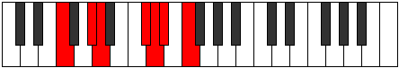

# Mode AFlatRorimic

## Links

- [Documentation](index.md)
- [Scales Index](Scales.md)
- [Modes Index](Modes.md)
- [Chords Index](Chords.md)

## Scale

[Kanimic](ScaleKanimic.md)

## Mode

[AFlatRorimic](ModeAFlatRorimic.md)

## Tonic

Ab

## Signature

[CNaturalMajor]

## Perfection

 - 3 Perfect Notes

 - 3 Imperfect Notes

## Notes

- Ab
- Bbb (Imperfect)
- C#
- D
- Eb (Imperfect)
- F (Imperfect)
- Ab

## Illustration

## Relative Modes

| Number | Mode | Tonic | Notes | Illustration |
|--------|------|-------|-------|--------------|
| [739](https://ianring.com/musictheory/scales/739) | [Rorimic](ModeRorimic.md) | Ab | Ab, Bbb, C#, D, Eb, F, Ab |  |
| [407](https://ianring.com/musictheory/scales/407) | [Zylimic](ModeZylimic.md) | C# | C#, D, Eb, F, G#, A, C# |  |
| [2251](https://ianring.com/musictheory/scales/2251) | [Zodimic](ModeZodimic.md) | D | D, Eb, F, G#, A, B##, D |  |
| [3173](https://ianring.com/musictheory/scales/3173) | [Zarimic](ModeZarimic.md) | Eb | Eb, F, G#, A, B##, C##, Eb |  |
| [1817](https://ianring.com/musictheory/scales/1817) | [Phrythimic](ModePhrythimic.md) | F | F, G#, A, B##, C##, D#, F |  |

## Chords

### Ab

| Number | Root | Name | Notes | Illustration | Audio |
|--------|------|------|-------|--------------|-------|

### Bbb

| Number | Root | Name | Notes | Illustration | Audio |
|--------|------|------|-------|--------------|-------|

### C#

| Number | Root | Name | Notes | Illustration | Audio |
|--------|------|------|-------|--------------|-------|

### D

| Number | Root | Name | Notes | Illustration | Audio |
|--------|------|------|-------|--------------|-------|

### Eb

| Number | Root | Name | Notes | Illustration | Audio |
|--------|------|------|-------|--------------|-------|

### F

| Number | Root | Name | Notes | Illustration | Audio |
|--------|------|------|-------|--------------|-------|

