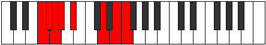

# Mode AFlatRydian

## Links

- [Documentation](index.md)
- [Scales Index](Scales.md)
- [Modes Index](Modes.md)
- [Chords Index](Chords.md)

## Scale

[Gydian](ScaleGydian.md)

## Mode

[AFlatRydian](ModeAFlatRydian.md)

## Tonic

Ab

## Signature

[CNaturalMajor]

## Perfection

 - 2 Perfect Notes

 - 5 Imperfect Notes

## Notes

- Ab (Imperfect)
- Bb
- C## (Imperfect)
- D## (Imperfect)
- E# (Imperfect)
- F# (Imperfect)
- G
- Ab (Imperfect)

## Illustration

## Relative Modes

| Number | Mode | Tonic | Notes | Illustration |
|--------|------|-------|-------|--------------|
| [381](https://ianring.com/musictheory/scales/381) | [Kogian](ModeKogian.md) | D | D, E, F, Gb, Abb, Bbbb, Cbb, D |  |
| [1119](https://ianring.com/musictheory/scales/1119) | [Rarian](ModeRarian.md) | E | E, F, Gb, Abb, Bbbb, Cbb, D, E |  |
| [2001](https://ianring.com/musictheory/scales/2001) | [Gydian](ModeGydian.md) | A# | A#, B###, D##, E#, F#, G, Ab, A# |  |
| [2001](https://ianring.com/musictheory/scales/2001) | [Gydian](ModeGydian.md) | Bb | Bb, C##, D##, E#, F#, G, Ab, Bb |  |
| [2607](https://ianring.com/musictheory/scales/2607) | [Aerolian](ModeAerolian.md) | F | F, Gb, Abb, Bbbb, Cbb, D, E, F |  |
| [3351](https://ianring.com/musictheory/scales/3351) | [Karian](ModeKarian.md) | F# | F#, G, Ab, Bb, C##, D##, E#, F# |  |
| [3351](https://ianring.com/musictheory/scales/3351) | [Karian](ModeKarian.md) | Gb | Gb, Abb, Bbbb, Cbb, D, E, F, Gb |  |
| [3723](https://ianring.com/musictheory/scales/3723) | [Myptian](ModeMyptian.md) | G | G, Ab, Bb, C##, D##, E#, F#, G |  |
| [3909](https://ianring.com/musictheory/scales/3909) | [Rydian](ModeRydian.md) | G# | G#, A#, B###, D##, E#, F#, G, G# |  |
| [3909](https://ianring.com/musictheory/scales/3909) | [Rydian](ModeRydian.md) | Ab | Ab, Bb, C##, D##, E#, F#, G, Ab |  |

## Chords

### Ab

| Number | Root | Name | Notes | Illustration | Audio |
|--------|------|------|-------|--------------|-------|
| 1284 | Ab | [Absus2b5](ChordAFlatSuspendedSecondFlatFifth.md) | Ab, Bb, Ebb |  | [midi](ChordAFlatSuspendedSecondFlatFifthRootPosition.mid) [ogg](ChordAFlatSuspendedSecondFlatFifthRootPosition.ogg) |
| 1296 | Ab | [Absus2#5](ChordAFlatSuspendedSecondSharpFifth.md) | Ab, Bb, E |  | [midi](ChordAFlatSuspendedSecondSharpFifthRootPosition.mid) [ogg](ChordAFlatSuspendedSecondSharpFifthRootPosition.ogg) |
| 1300 | Ab | [Absus2b5add(#5)](ChordAFlatSuspendedSecondFlatFifthAddSharpFifth.md) | Ab, Bb, Ebb, E |  | [midi](ChordAFlatSuspendedSecondFlatFifthAddSharpFifthRootPosition.mid) [ogg](ChordAFlatSuspendedSecondFlatFifthAddSharpFifthRootPosition.ogg) |
| 1316 | Ab | [AbM6sus2b5](ChordAFlatMajorSixthSuspendedSecondFlatFifth.md) | Ab, Bb, Ebb, F |  | [midi](ChordAFlatMajorSixthSuspendedSecondFlatFifthRootPosition.mid) [ogg](ChordAFlatMajorSixthSuspendedSecondFlatFifthRootPosition.ogg) |

### Bb

| Number | Root | Name | Notes | Illustration | Audio |
|--------|------|------|-------|--------------|-------|
| 1044 | Bb | [BbMb5](ChordBFlatMajorFlatFifth.md) | Bb, D, Fb |  | [midi](ChordBFlatMajorFlatFifthRootPosition.mid) [ogg](ChordBFlatMajorFlatFifthRootPosition.ogg) |
| 1056 | Bb | [Bb5](ChordBFlatPowerChord.md) | Bb, F |  | [midi](ChordBFlatPowerChordRootPosition.mid) [ogg](ChordBFlatPowerChordRootPosition.ogg) |
| 1060 | Bb | [BbM](ChordBFlatMajor.md) | Bb, D, F |  | [midi](ChordBFlatMajorRootPosition.mid) [ogg](ChordBFlatMajorRootPosition.ogg) |
| 1072 | Bb | [Bblyd](ChordBFlatLydian.md) | Bb, E, F |  | [midi](ChordBFlatLydianRootPosition.mid) [ogg](ChordBFlatLydianRootPosition.ogg) |
| 1076 | Bb | [BbM(add(#4))](ChordBFlatMajorAddSharpFourth.md) | Bb, D, E, F |  | [midi](ChordBFlatMajorAddSharpFourthRootPosition.mid) [ogg](ChordBFlatMajorAddSharpFourthRootPosition.ogg) |
| 1092 | Bb | [Bb+](ChordBFlatAugmented.md) | Bb, D, F# |  | [midi](ChordBFlatAugmentedRootPosition.mid) [ogg](ChordBFlatAugmentedRootPosition.ogg) |
| 1092 | Bb | [Bb+7](ChordBFlatAugmentedAugmentedSeventh.md) | Bb, D, F#, A# |  | [midi](ChordBFlatAugmentedAugmentedSeventhRootPosition.mid) [ogg](ChordBFlatAugmentedAugmentedSeventhRootPosition.ogg) |
| 1156 | Bb | [BbM##5](ChordBFlatMajorDoubleSharpFifth.md) | Bb, D, G |  | [midi](ChordBFlatMajorDoubleSharpFifthRootPosition.mid) [ogg](ChordBFlatMajorDoubleSharpFifthRootPosition.ogg) |
| 1172 | Bb | [BbM6b5](ChordBFlatMajorSixthFlatFifth.md) | Bb, D, Fb, G |  | [midi](ChordBFlatMajorSixthFlatFifthRootPosition.mid) [ogg](ChordBFlatMajorSixthFlatFifthRootPosition.ogg) |
| 1188 | Bb | [BbM6](ChordBFlatMajorSixth.md) | Bb, D, F, G |  | [midi](ChordBFlatMajorSixthRootPosition.mid) [ogg](ChordBFlatMajorSixthRootPosition.ogg) |
| 1300 | Bb | [Bb7b5](ChordBFlatDominantSeventhFlatFifth.md) | Bb, D, Fb, Ab |  | [midi](ChordBFlatDominantSeventhFlatFifthRootPosition.mid) [ogg](ChordBFlatDominantSeventhFlatFifthRootPosition.ogg) |
| 1316 | Bb | [Bb7](ChordBFlatDominantSeventh.md) | Bb, D, F, Ab |  | [midi](ChordBFlatDominantSeventhRootPosition.mid) [ogg](ChordBFlatDominantSeventhRootPosition.ogg) |
| 1332 | Bb | [Bb7add(#4)](ChordBFlatDominantSeventhAddSharpFourth.md) | Bb, D, E, F, Ab |  | [midi](ChordBFlatDominantSeventhAddSharpFourthRootPosition.mid) [ogg](ChordBFlatDominantSeventhAddSharpFourthRootPosition.ogg) |
| 1332 | Bb | [Bb7#11](ChordBFlatDominantSeventhSharpEleventh.md) | Bb, D, F, Ab, E |  | [midi](ChordBFlatDominantSeventhSharpEleventhRootPosition.mid) [ogg](ChordBFlatDominantSeventhSharpEleventhRootPosition.ogg) |
| 1444 | Bb | [Bb7add13](ChordBFlatDominantSeventhAddThirteenth.md) | Bb, D, F, Ab, G |  | [midi](ChordBFlatDominantSeventhAddThirteenthRootPosition.mid) [ogg](ChordBFlatDominantSeventhAddThirteenthRootPosition.ogg) |

### C##

| Number | Root | Name | Notes | Illustration | Audio |
|--------|------|------|-------|--------------|-------|

### D##

| Number | Root | Name | Notes | Illustration | Audio |
|--------|------|------|-------|--------------|-------|

### E#

| Number | Root | Name | Notes | Illustration | Audio |
|--------|------|------|-------|--------------|-------|

### F#

| Number | Root | Name | Notes | Illustration | Audio |
|--------|------|------|-------|--------------|-------|
| 324 | F# | [F#sus2#5](ChordFSharpSuspendedSecondSharpFifth.md) | F#, G#, C## |  | [midi](ChordFSharpSuspendedSecondSharpFifthRootPosition.mid) [ogg](ChordFSharpSuspendedSecondSharpFifthRootPosition.ogg) |
| 1092 | F# | [F#+](ChordFSharpAugmented.md) | F#, A#, C## |  | [midi](ChordFSharpAugmentedRootPosition.mid) [ogg](ChordFSharpAugmentedRootPosition.ogg) |
| 1092 | F# | [F#+7](ChordFSharpAugmentedAugmentedSeventh.md) | F#, A#, C##, E## |  | [midi](ChordFSharpAugmentedAugmentedSeventhRootPosition.mid) [ogg](ChordFSharpAugmentedAugmentedSeventhRootPosition.ogg) |
| 1236 | F# | [F#7#5b9](ChordFSharpDominantSeventhSharpFifthFlatNinth.md) | F#, A#, C##, E, G |  | [midi](ChordFSharpDominantSeventhSharpFifthFlatNinthRootPosition.mid) [ogg](ChordFSharpDominantSeventhSharpFifthFlatNinthRootPosition.ogg) |
| 1124 | F# | [F#+(M7)](ChordFSharpAugmentedMajorSeventh.md) | F#, A#, C##, E# |  | [midi](ChordFSharpAugmentedMajorSeventhRootPosition.mid) [ogg](ChordFSharpAugmentedMajorSeventhRootPosition.ogg) |

### G

| Number | Root | Name | Notes | Illustration | Audio |
|--------|------|------|-------|--------------|-------|
| 132 | G | [G5](ChordGNaturalPowerChord.md) | G, D |  | [midi](ChordGNaturalPowerChordRootPosition.mid) [ogg](ChordGNaturalPowerChordRootPosition.ogg) |
| 388 | G | [Gphryg](ChordGNaturalPhrygian.md) | G, Ab, D |  | [midi](ChordGNaturalPhrygianRootPosition.mid) [ogg](ChordGNaturalPhrygianRootPosition.ogg) |
| 1156 | G | [Gm](ChordGNaturalMinor.md) | G, Bb, D |  | [midi](ChordGNaturalMinorRootPosition.mid) [ogg](ChordGNaturalMinorRootPosition.ogg) |
| 1156 | G | [Gm(add(#9))](ChordGNaturalMinorAddSharpNinth.md) | G, Bb, D, A# |  | [midi](ChordGNaturalMinorAddSharpNinthRootPosition.mid) [ogg](ChordGNaturalMinorAddSharpNinthRootPosition.ogg) |
| 1172 | G | [Gm6](ChordGNaturalMinorSixth.md) | G, Bb, D, E |  | [midi](ChordGNaturalMinorSixthRootPosition.mid) [ogg](ChordGNaturalMinorSixthRootPosition.ogg) |
| 1428 | G | [Gm6(addb9)](ChordGNaturalMinorSixthAddFlatNinth.md) | G, Bb, D, E, Ab |  | [midi](ChordGNaturalMinorSixthAddFlatNinthRootPosition.mid) [ogg](ChordGNaturalMinorSixthAddFlatNinthRootPosition.ogg) |
| 1188 | G | [Gm7](ChordGNaturalMinorSeventh.md) | G, Bb, D, F |  | [midi](ChordGNaturalMinorSeventhRootPosition.mid) [ogg](ChordGNaturalMinorSeventhRootPosition.ogg) |
| 1444 | G | [Gm7b9](ChordGNaturalMinorSeventhFlatNinth.md) | G, Bb, D, F, Ab |  | [midi](ChordGNaturalMinorSeventhFlatNinthRootPosition.mid) [ogg](ChordGNaturalMinorSeventhFlatNinthRootPosition.ogg) |
| 1204 | G | [Gm7add13](ChordGNaturalMinorSeventhAddThirteenth.md) | G, Bb, D, F, E |  | [midi](ChordGNaturalMinorSeventhAddThirteenthRootPosition.mid) [ogg](ChordGNaturalMinorSeventhAddThirteenthRootPosition.ogg) |
| 452 | G | [Gphryg+7](ChordGNaturalPhrygianAddSeventh.md) | G, Ab, D, F# |  | [midi](ChordGNaturalPhrygianAddSeventhRootPosition.mid) [ogg](ChordGNaturalPhrygianAddSeventhRootPosition.ogg) |
| 1220 | G | [Gm(M7)](ChordGNaturalMinorMajorSeventh.md) | G, Bb, D, F# |  | [midi](ChordGNaturalMinorMajorSeventhRootPosition.mid) [ogg](ChordGNaturalMinorMajorSeventhRootPosition.ogg) |
| 1236 | G | [Gm(M7)add13](ChordGNaturalMinorMajorSeventhAddThirteenth.md) | G, Bb, D, F#, E |  | [midi](ChordGNaturalMinorMajorSeventhAddThirteenthRootPosition.mid) [ogg](ChordGNaturalMinorMajorSeventhAddThirteenthRootPosition.ogg) |

