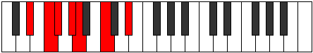

# Mode AFlatRygimic

## Links

- [Documentation](index.md)
- [Scales Index](Scales.md)
- [Modes Index](Modes.md)
- [Chords Index](Chords.md)

## Scale

[Thoptimic](ScaleThoptimic.md)

## Mode

[AFlatRygimic](ModeAFlatRygimic.md)

## Tonic

Ab

## Signature

[CNaturalMajor]

## Perfection

 - 2 Perfect Notes

 - 4 Imperfect Notes

## Notes

- Ab
- Bbb (Imperfect)
- C (Imperfect)
- D# (Imperfect)
- E#
- F# (Imperfect)
- Ab

## Illustration

## Relative Modes

| Number | Mode | Tonic | Notes | Illustration |
|--------|------|-------|-------|--------------|
| [621](https://ianring.com/musictheory/scales/621) | [Kyrimic](ModeKyrimic.md) | D# | D#, E#, F#, G#, A, B#, D# |  |
| [621](https://ianring.com/musictheory/scales/621) | [Kyrimic](ModeKyrimic.md) | Eb | Eb, F, Gb, Ab, Bbb, C, Eb |  |
| [873](https://ianring.com/musictheory/scales/873) | [Bagimic](ModeBagimic.md) | C | C, D#, E#, F#, G#, A, C |  |
| [1179](https://ianring.com/musictheory/scales/1179) | [Sonimic](ModeSonimic.md) | F | F, Gb, Ab, Bbb, C, D#, F |  |
| [1683](https://ianring.com/musictheory/scales/1683) | [Rygimic](ModeRygimic.md) | G# | G#, A, B#, C###, D###, E##, G# |  |
| [1683](https://ianring.com/musictheory/scales/1683) | [Rygimic](ModeRygimic.md) | Ab | Ab, Bbb, C, D#, E#, F#, Ab |  |
| [2637](https://ianring.com/musictheory/scales/2637) | [Aeolonimic](ModeAeolonimic.md) | F# | F#, G#, A, B#, C###, D###, F# |  |
| [2637](https://ianring.com/musictheory/scales/2637) | [Aeolonimic](ModeAeolonimic.md) | Gb | Gb, Ab, Bbb, C, D#, E#, Gb |  |
| [2889](https://ianring.com/musictheory/scales/2889) | [Thoptimic](ModeThoptimic.md) | A | A, B#, C###, D###, E##, F###, A |  |

## Chords

### Ab

| Number | Root | Name | Notes | Illustration | Audio |
|--------|------|------|-------|--------------|-------|

### Bbb

| Number | Root | Name | Notes | Illustration | Audio |
|--------|------|------|-------|--------------|-------|

### C

| Number | Root | Name | Notes | Illustration | Audio |
|--------|------|------|-------|--------------|-------|

### D#

| Number | Root | Name | Notes | Illustration | Audio |
|--------|------|------|-------|--------------|-------|

### E#

| Number | Root | Name | Notes | Illustration | Audio |
|--------|------|------|-------|--------------|-------|

### F#

| Number | Root | Name | Notes | Illustration | Audio |
|--------|------|------|-------|--------------|-------|

