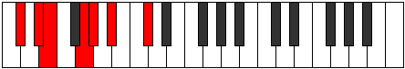

# Mode AFlatStaptimic

## Links

- [Documentation](index.md)
- [Scales Index](Scales.md)
- [Modes Index](Modes.md)
- [Chords Index](Chords.md)

## Scale

[Bocrimic](ScaleBocrimic.md)

## Mode

[AFlatStaptimic](ModeAFlatStaptimic.md)

## Tonic

Ab

## Signature

[CNaturalMajor]

## Perfection

 - 3 Perfect Notes

 - 3 Imperfect Notes

## Notes

- Ab
- Bb (Imperfect)
- C#
- D#
- E (Imperfect)
- F## (Imperfect)
- Ab

## Illustration

## Relative Modes

| Number | Mode | Tonic | Notes | Illustration |
|--------|------|-------|-------|--------------|
| [717](https://ianring.com/musictheory/scales/717) | [Gythimic](ModeGythimic.md) | C# | C#, D#, E, F##, G#, A#, C# |  |
| [717](https://ianring.com/musictheory/scales/717) | [Gythimic](ModeGythimic.md) | Db | Db, Eb, Fb, G, Ab, Bb, Db |  |
| [843](https://ianring.com/musictheory/scales/843) | [Molimic](ModeMolimic.md) | G | G, Ab, Bb, C#, D#, E, G |  |
| [1203](https://ianring.com/musictheory/scales/1203) | [Pagimic](ModePagimic.md) | D# | D#, E, F##, G#, A#, B##, D# |  |
| [1203](https://ianring.com/musictheory/scales/1203) | [Pagimic](ModePagimic.md) | Eb | Eb, Fb, G, Ab, Bb, C#, Eb |  |
| [1641](https://ianring.com/musictheory/scales/1641) | [Bocrimic](ModeBocrimic.md) | A# | A#, B##, C###, D##, E###, F###, A# |  |
| [1641](https://ianring.com/musictheory/scales/1641) | [Bocrimic](ModeBocrimic.md) | Bb | Bb, C#, D#, E, F##, G#, Bb |  |
| [2469](https://ianring.com/musictheory/scales/2469) | [Staptimic](ModeStaptimic.md) | G# | G#, A#, B##, C###, D##, E###, G# |  |
| [2469](https://ianring.com/musictheory/scales/2469) | [Staptimic](ModeStaptimic.md) | Ab | Ab, Bb, C#, D#, E, F##, Ab |  |
| [2649](https://ianring.com/musictheory/scales/2649) | [Aeolythimic](ModeAeolythimic.md) | E | E, F##, G#, A#, B##, C###, E |  |

## Chords

### Ab

| Number | Root | Name | Notes | Illustration | Audio |
|--------|------|------|-------|--------------|-------|

### Bb

| Number | Root | Name | Notes | Illustration | Audio |
|--------|------|------|-------|--------------|-------|
| 1034 | Bb | [Bbmbb5](ChordBFlatMinorDoubleFlatFifth.md) | Bb, Db, Eb |  | [midi](ChordBFlatMinorDoubleFlatFifthRootPosition.mid) [ogg](ChordBFlatMinorDoubleFlatFifthRootPosition.ogg) |
| 1042 | Bb | [Bbo](ChordBFlatDiminished.md) | Bb, Db, Fb |  | [midi](ChordBFlatDiminishedRootPosition.mid) [ogg](ChordBFlatDiminishedRootPosition.ogg) |
| 1048 | Bb | [Bbsus4b5](ChordBFlatSuspendedFourthFlatFifth.md) | Bb, Eb, Fb |  | [midi](ChordBFlatSuspendedFourthFlatFifthRootPosition.mid) [ogg](ChordBFlatSuspendedFourthFlatFifthRootPosition.ogg) |
| 1160 | Bb | [Bbsus4##5](ChordBFlatSuspendedFourthDoubleSharpFifth.md) | Bb, Eb, G |  | [midi](ChordBFlatSuspendedFourthDoubleSharpFifthRootPosition.mid) [ogg](ChordBFlatSuspendedFourthDoubleSharpFifthRootPosition.ogg) |
| 1170 | Bb | [Bbo7](ChordBFlatFullDiminishedSeventh.md) | Bb, Db, Fb, Abb |  | [midi](ChordBFlatFullDiminishedSeventhRootPosition.mid) [ogg](ChordBFlatFullDiminishedSeventhRootPosition.ogg) |
| 1288 | Bb | [BbQ](ChordBFlatQuartal.md) | Bb, Eb, Ab |  | [midi](ChordBFlatQuartalRootPosition.mid) [ogg](ChordBFlatQuartalRootPosition.ogg) |
| 1290 | Bb | [Bbm7bb5](ChordBFlatMinorSeventhDoubleFlatFifth.md) | Bb, Db, Eb, Ab |  | [midi](ChordBFlatMinorSeventhDoubleFlatFifthRootPosition.mid) [ogg](ChordBFlatMinorSeventhDoubleFlatFifthRootPosition.ogg) |
| 1298 | Bb | [Bbø7](ChordBFlatHalfDiminishedSeventh.md) | Bb, Db, Fb, Ab |  | [midi](ChordBFlatHalfDiminishedSeventhRootPosition.mid) [ogg](ChordBFlatHalfDiminishedSeventhRootPosition.ogg) |

### C#

| Number | Root | Name | Notes | Illustration | Audio |
|--------|------|------|-------|--------------|-------|
| 138 | C# | [C#sus2b5](ChordCSharpSuspendedSecondFlatFifth.md) | C#, D#, G |  | [midi](ChordCSharpSuspendedSecondFlatFifthRootPosition.mid) [ogg](ChordCSharpSuspendedSecondFlatFifthRootPosition.ogg) |
| 146 | C# | [C#o](ChordCSharpDiminished.md) | C#, E, G |  | [midi](ChordCSharpDiminishedRootPosition.mid) [ogg](ChordCSharpDiminishedRootPosition.ogg) |
| 258 | C# | [C#5](ChordCSharpPowerChord.md) | C#, G# |  | [midi](ChordCSharpPowerChordRootPosition.mid) [ogg](ChordCSharpPowerChordRootPosition.ogg) |
| 266 | C# | [C#sus2](ChordCSharpSuspendedSecond.md) | C#, D#, G# |  | [midi](ChordCSharpSuspendedSecondRootPosition.mid) [ogg](ChordCSharpSuspendedSecondRootPosition.ogg) |
| 274 | C# | [C#m](ChordCSharpMinor.md) | C#, E, G# |  | [midi](ChordCSharpMinorRootPosition.mid) [ogg](ChordCSharpMinorRootPosition.ogg) |
| 274 | C# | [C#m(add(#9))](ChordCSharpMinorAddSharpNinth.md) | C#, E, G#, D## |  | [midi](ChordCSharpMinorAddSharpNinthRootPosition.mid) [ogg](ChordCSharpMinorAddSharpNinthRootPosition.ogg) |
| 282 | C# | [C#m(add9)](ChordCSharpMinorAddNinth.md) | C#, E, G#, D# |  | [midi](ChordCSharpMinorAddNinthRootPosition.mid) [ogg](ChordCSharpMinorAddNinthRootPosition.ogg) |
| 386 | C# | [C#lyd](ChordCSharpLydian.md) | C#, F##, G# |  | [midi](ChordCSharpLydianRootPosition.mid) [ogg](ChordCSharpLydianRootPosition.ogg) |
| 402 | C# | [C#m(add(#4))](ChordCSharpMinorAddSharpFourth.md) | C#, E, F##, G# |  | [midi](ChordCSharpMinorAddSharpFourthRootPosition.mid) [ogg](ChordCSharpMinorAddSharpFourthRootPosition.ogg) |
| 1162 | C# | [C#M6sus2b5](ChordCSharpMajorSixthSuspendedSecondFlatFifth.md) | C#, D#, G, A# |  | [midi](ChordCSharpMajorSixthSuspendedSecondFlatFifthRootPosition.mid) [ogg](ChordCSharpMajorSixthSuspendedSecondFlatFifthRootPosition.ogg) |
| 1170 | C# | [C#o7](ChordCSharpFullDiminishedSeventh.md) | C#, E, G, Bb |  | [midi](ChordCSharpFullDiminishedSeventhRootPosition.mid) [ogg](ChordCSharpFullDiminishedSeventhRootPosition.ogg) |
| 1290 | C# | [C#M6sus2](ChordCSharpMajorSixthSuspendedSecond.md) | C#, D#, G#, A# |  | [midi](ChordCSharpMajorSixthSuspendedSecondRootPosition.mid) [ogg](ChordCSharpMajorSixthSuspendedSecondRootPosition.ogg) |
| 1290 | C# | [C#7sus2b5](ChordCSharpDominantSeventhSuspendedSecondFlatFifth.md) | C#, D#, G#, Bb |  | [midi](ChordCSharpDominantSeventhSuspendedSecondFlatFifthRootPosition.mid) [ogg](ChordCSharpDominantSeventhSuspendedSecondFlatFifthRootPosition.ogg) |
| 1298 | C# | [C#m6](ChordCSharpMinorSixth.md) | C#, E, G#, A# |  | [midi](ChordCSharpMinorSixthRootPosition.mid) [ogg](ChordCSharpMinorSixthRootPosition.ogg) |
| 1306 | C# | [C#m6(add9)](ChordCSharpMinorSixthAddNinth.md) | C#, E, G#, A#, D# |  | [midi](ChordCSharpMinorSixthAddNinthRootPosition.mid) [ogg](ChordCSharpMinorSixthAddNinthRootPosition.ogg) |

### D#

| Number | Root | Name | Notes | Illustration | Audio |
|--------|------|------|-------|--------------|-------|
| 1032 | D# | [D#5](ChordDSharpPowerChord.md) | D#, A# |  | [midi](ChordDSharpPowerChordRootPosition.mid) [ogg](ChordDSharpPowerChordRootPosition.ogg) |
| 1048 | D# | [D#phryg](ChordDSharpPhrygian.md) | D#, E, A# |  | [midi](ChordDSharpPhrygianRootPosition.mid) [ogg](ChordDSharpPhrygianRootPosition.ogg) |
| 1160 | D# | [D#M](ChordDSharpMajor.md) | D#, F##, A# |  | [midi](ChordDSharpMajorRootPosition.mid) [ogg](ChordDSharpMajorRootPosition.ogg) |
| 1288 | D# | [D#sus4](ChordDSharpSuspendedFourth.md) | D#, G#, A# |  | [midi](ChordDSharpSuspendedFourthRootPosition.mid) [ogg](ChordDSharpSuspendedFourthRootPosition.ogg) |
| 1416 | D# | [D#M(add11)](ChordDSharpMajorAddEleventh.md) | D#, F##, A#, G# |  | [midi](ChordDSharpMajorAddEleventhRootPosition.mid) [ogg](ChordDSharpMajorAddEleventhRootPosition.ogg) |
| 1416 | D# | [D#M(add4)](ChordDSharpMajorAddFourth.md) | D#, F##, G#, A# |  | [midi](ChordDSharpMajorAddFourthRootPosition.mid) [ogg](ChordDSharpMajorAddFourthRootPosition.ogg) |
| 266 | D# | [D#Q](ChordDSharpQuartal.md) | D#, G#, C# |  | [midi](ChordDSharpQuartalRootPosition.mid) [ogg](ChordDSharpQuartalRootPosition.ogg) |
| 1162 | D# | [D#7](ChordDSharpDominantSeventh.md) | D#, F##, A#, C# |  | [midi](ChordDSharpDominantSeventhRootPosition.mid) [ogg](ChordDSharpDominantSeventhRootPosition.ogg) |
| 1178 | D# | [D#7b9](ChordDSharpDominantSeventhFlatNinth.md) | D#, F##, A#, C#, E |  | [midi](ChordDSharpDominantSeventhFlatNinthRootPosition.mid) [ogg](ChordDSharpDominantSeventhFlatNinthRootPosition.ogg) |
| 1290 | D# | [D#7sus4](ChordDSharpDominantSeventhSuspendedFourth.md) | D#, G#, A#, C# |  | [midi](ChordDSharpDominantSeventhSuspendedFourthRootPosition.mid) [ogg](ChordDSharpDominantSeventhSuspendedFourthRootPosition.ogg) |
| 1418 | D# | [D#7add4](ChordDSharpDominantSeventhAddFourth.md) | D#, F##, G#, A#, C# |  | [midi](ChordDSharpDominantSeventhAddFourthRootPosition.mid) [ogg](ChordDSharpDominantSeventhAddFourthRootPosition.ogg) |
| 1418 | D# | [D#7add11](ChordDSharpDominantSeventhAddEleventh.md) | D#, F##, A#, C#, G# |  | [midi](ChordDSharpDominantSeventhAddEleventhRootPosition.mid) [ogg](ChordDSharpDominantSeventhAddEleventhRootPosition.ogg) |

### E

| Number | Root | Name | Notes | Illustration | Audio |
|--------|------|------|-------|--------------|-------|
| 1168 | E | [Eo](ChordENaturalDiminished.md) | E, G, Bb |  | [midi](ChordENaturalDiminishedRootPosition.mid) [ogg](ChordENaturalDiminishedRootPosition.ogg) |
| 1296 | E | [EMb5](ChordENaturalMajorFlatFifth.md) | E, G#, Bb |  | [midi](ChordENaturalMajorFlatFifthRootPosition.mid) [ogg](ChordENaturalMajorFlatFifthRootPosition.ogg) |
| 274 | E | [EM##5](ChordENaturalMajorDoubleSharpFifth.md) | E, G#, C# |  | [midi](ChordENaturalMajorDoubleSharpFifthRootPosition.mid) [ogg](ChordENaturalMajorDoubleSharpFifthRootPosition.ogg) |
| 1170 | E | [Eo7](ChordENaturalFullDiminishedSeventh.md) | E, G, Bb, Db |  | [midi](ChordENaturalFullDiminishedSeventhRootPosition.mid) [ogg](ChordENaturalFullDiminishedSeventhRootPosition.ogg) |
| 1298 | E | [EM6b5](ChordENaturalMajorSixthFlatFifth.md) | E, G#, Bb, C# |  | [midi](ChordENaturalMajorSixthFlatFifthRootPosition.mid) [ogg](ChordENaturalMajorSixthFlatFifthRootPosition.ogg) |
| 1176 | E | [EoM7](ChordENaturalDiminishedMajorSeventh.md) | E, G, Bb, D# |  | [midi](ChordENaturalDiminishedMajorSeventhRootPosition.mid) [ogg](ChordENaturalDiminishedMajorSeventhRootPosition.ogg) |
| 1304 | E | [EM7b5](ChordENaturalMajorSeventhFlatFifth.md) | E, G#, Bb, D# |  | [midi](ChordENaturalMajorSeventhFlatFifthRootPosition.mid) [ogg](ChordENaturalMajorSeventhFlatFifthRootPosition.ogg) |
| 282 | E | [EM7##5](ChordENaturalMajorSeventhDoubleSharpFifth.md) | E, G#, C#, D# |  | [midi](ChordENaturalMajorSeventhDoubleSharpFifthRootPosition.mid) [ogg](ChordENaturalMajorSeventhDoubleSharpFifthRootPosition.ogg) |

### F##

| Number | Root | Name | Notes | Illustration | Audio |
|--------|------|------|-------|--------------|-------|

