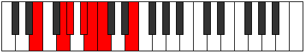

# Mode AFlatStynimic

## Links

- [Documentation](index.md)
- [Scales Index](Scales.md)
- [Modes Index](Modes.md)
- [Chords Index](Chords.md)

## Scale

[Lathimic](ScaleLathimic.md)

## Mode

[AFlatStynimic](ModeAFlatStynimic.md)

## Tonic

Ab

## Signature

[CNaturalMajor]

## Perfection

 - 2 Perfect Notes

 - 4 Imperfect Notes

## Notes

- Ab (Imperfect)
- Bb (Imperfect)
- Cb (Imperfect)
- Dbb
- E
- F## (Imperfect)
- Ab (Imperfect)

## Illustration

## Relative Modes

| Number | Mode | Tonic | Notes | Illustration |
|--------|------|-------|-------|--------------|
| [2333](https://ianring.com/musictheory/scales/2333) | [Stynimic](ModeStynimic.md) | Ab | Ab, Bb, Cb, Dbb, E, F##, Ab |  |
| [1607](https://ianring.com/musictheory/scales/1607) | [Epytimic](ModeEpytimic.md) | Bb | Bb, Cb, Dbb, E, F##, G#, Bb |  |
| [473](https://ianring.com/musictheory/scales/473) | [Aeralimic](ModeAeralimic.md) | E | E, F##, G#, A#, B, C, E |  |

## Chords

### Ab

| Number | Root | Name | Notes | Illustration | Audio |
|--------|------|------|-------|--------------|-------|

### Bb

| Number | Root | Name | Notes | Illustration | Audio |
|--------|------|------|-------|--------------|-------|

### Cb

| Number | Root | Name | Notes | Illustration | Audio |
|--------|------|------|-------|--------------|-------|

### Dbb

| Number | Root | Name | Notes | Illustration | Audio |
|--------|------|------|-------|--------------|-------|

### E

| Number | Root | Name | Notes | Illustration | Audio |
|--------|------|------|-------|--------------|-------|

### F##

| Number | Root | Name | Notes | Illustration | Audio |
|--------|------|------|-------|--------------|-------|

