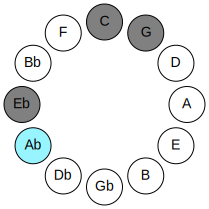
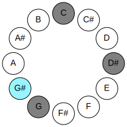
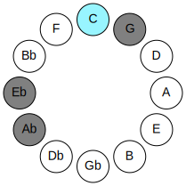
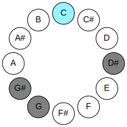
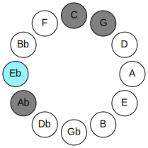
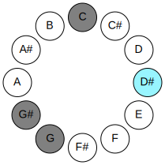
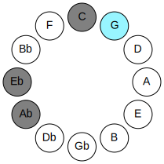
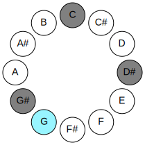

# Mode AFlatThaptic

## Links

- [Documentation](README.md)
- [Scales Index](Scales.md)
- [Modes Index](Modes.md)
- [Chords Index](Chords.md)

## Parent Scale

[Thaptic](ScaleThaptic.md)

## Mode

[AFlatThaptic](ModeAFlatThaptic.md)

## Number

2193

## Luminosity

4

## Tonic

Ab

## Signature

C

## Transposition

4, 3, 4, 1

## Chord Pattern

## Perfection

 - 2 Perfect Notes

 - 2 Imperfect Notes

 - Perfection Profile - true, true, false, false

## Notes

- Ab
- C
- Eb (Imperfect)
- G (Imperfect)
- Ab

## Illustration

## Diagram

| Circle of Fifth | Chromatic Circle |
|-----------------|------------------|
|  |  |
## Relative Modes

| Number | Mode | Luminosity | Tonic | Notes | Illustration |
|--------|------|------------|-------|-------|--------------|
| [2193](https://ianring.com/musictheory/scales/2193) | [Thaptic](ModeThaptic.md) | -1 | G# | G#, C, D#, G, G# |  |
| [393](https://ianring.com/musictheory/scales/393) | [Lothic](ModeLothic.md) | -1 | C | C, D#, G, G#, C |  |
| [561](https://ianring.com/musictheory/scales/561) | [Phratic](ModePhratic.md) | -1 | D# | D#, G, G#, C, D# |  |
| [291](https://ianring.com/musictheory/scales/291) | [Aerathic](ModeAerathic.md) | 3 | G | G, G#, C, D#, G |  |
## Relative Brightness

| Number | Mode | Luminosity | Tonic | Notes | Circle Of Fifth | Chromatic Circle |
|--------|------|------------|-------|-------|-----------------|------------------|
| [2193](https://ianring.com/musictheory/scales/2193) | [Thaptic](ModeThaptic.md) | -1 | G# | G#, C, D#, G, G# |  |  |
| [2193](https://ianring.com/musictheory/scales/2193) | [Thaptic](ModeThaptic.md) | 4 | Ab | Ab, C, Eb, G, Ab |  |  |
| [393](https://ianring.com/musictheory/scales/393) | [Lothic](ModeLothic.md) | 4 | C | C, D#, G, G#, C |  |  |
| [561](https://ianring.com/musictheory/scales/561) | [Phratic](ModePhratic.md) | 3 | D# | D#, G, G#, C, D# |  |  |
| [561](https://ianring.com/musictheory/scales/561) | [Phratic](ModePhratic.md) | 3 | Eb | Eb, G, Ab, C, Eb |  |  |
| [291](https://ianring.com/musictheory/scales/291) | [Aerathic](ModeAerathic.md) | -1 | G | G, G#, C, D#, G |  |  |

## Chords

### Ab

| Number | Root | Name | Notes | Illustration | Audio |
|--------|------|------|-------|--------------|-------|
| 264 | Ab | [G#5](ChordGSharpPowerChord.md) | G#, D# |  | [midi](ChordGSharpPowerChordRootPosition.mid) |
| 264 | Ab | [Ab5](ChordAFlatPowerChord.md) | Ab, Eb |  | [midi](ChordAFlatPowerChordRootPosition.mid) |
| 265 | Ab | [G#M](ChordGSharpMajor.md) | G#, B#, D# |  | [midi](ChordGSharpMajorRootPosition.mid) |
| 265 | Ab | [AbM](ChordAFlatMajor.md) | Ab, C, Eb |  | [midi](ChordAFlatMajorRootPosition.mid) |
| 393 | Ab | [G#M7](ChordGSharpMajorSeventh.md) | G#, B#, D#, F## |  | [midi](ChordGSharpMajorSeventhRootPosition.mid) |
| 393 | Ab | [AbM7](ChordAFlatMajorSeventh.md) | Ab, C, Eb, G |  | [midi](ChordAFlatMajorSeventhRootPosition.mid) |

### C

| Number | Root | Name | Notes | Illustration | Audio |
|--------|------|------|-------|--------------|-------|
| 129 | C | [C5](ChordCNaturalPowerChord.md) | C, G |  | [midi](ChordCNaturalPowerChordRootPosition.mid) |
| 137 | C | [Cm](ChordCNaturalMinor.md) | C, Eb, G |  | [midi](ChordCNaturalMinorRootPosition.mid) |
| 137 | C | [Cm(add(#9))](ChordCNaturalMinorAddSharpNinth.md) | C, Eb, G, D# |  | [midi](ChordCNaturalMinorAddSharpNinthRootPosition.mid) |
| 265 | C | [Cm#5](ChordCNaturalMinorSharpFifth.md) | C, Eb, Ab |  | [midi](ChordCNaturalMinorSharpFifthRootPosition.mid) |

### Eb

| Number | Root | Name | Notes | Illustration | Audio |
|--------|------|------|-------|--------------|-------|
| 137 | Eb | [D#M##5](ChordDSharpMajorDoubleSharpFifth.md) | D#, F##, B# |  | [midi](ChordDSharpMajorDoubleSharpFifthRootPosition.mid) |
| 137 | Eb | [EbM##5](ChordEFlatMajorDoubleSharpFifth.md) | Eb, G, C |  | [midi](ChordEFlatMajorDoubleSharpFifthRootPosition.mid) |
| 265 | Eb | [D#sus4##5](ChordDSharpSuspendedFourthDoubleSharpFifth.md) | D#, G#, B# |  | [midi](ChordDSharpSuspendedFourthDoubleSharpFifthRootPosition.mid) |
| 265 | Eb | [Ebsus4##5](ChordEFlatSuspendedFourthDoubleSharpFifth.md) | Eb, Ab, C |  | [midi](ChordEFlatSuspendedFourthDoubleSharpFifthRootPosition.mid) |

### G

| Number | Root | Name | Notes | Illustration | Audio |
|--------|------|------|-------|--------------|-------|
| 137 | G | [Gsus4#5](ChordGNaturalSuspendedFourthSharpFifth.md) | G, C, D# |  | [midi](ChordGNaturalSuspendedFourthSharpFifthRootPosition.mid) |

